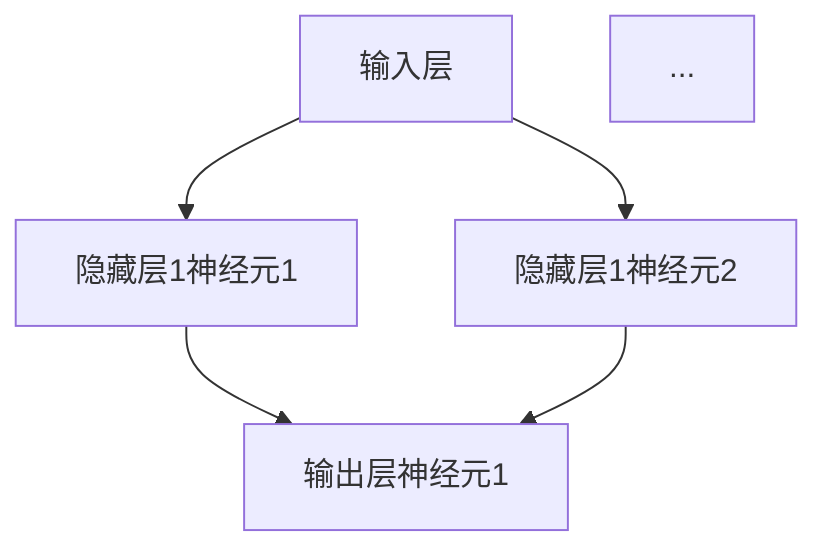

                 

# 神经网络：改变世界的技术

## 关键词：神经网络，深度学习，人工智能，机器学习，算法，计算机科学

### 摘要

本文旨在深入探讨神经网络这一颠覆性技术，从其历史背景、核心概念到实际应用，为您呈现一幅全面而清晰的画卷。神经网络作为现代人工智能的基石，其发展历程、理论框架、数学模型以及代码实现都是本文的重点内容。通过本文的阅读，您将不仅了解神经网络的工作原理，还能掌握其实际应用场景和未来发展趋势。让我们一起走进这个充满创新与变革的世界。

## 1. 背景介绍

### 1.1 神经网络的历史背景

神经网络的概念最早可以追溯到1943年，由沃伦·麦卡洛克（Warren McCulloch）和沃尔特·皮茨（Walter Pitts）提出。他们提出了一个简化的神经元模型，旨在模拟人类大脑的信息处理过程。这一模型被称为“麦卡洛克-皮茨神经元”，成为神经网络研究的起点。

然而，神经网络的发展并非一帆风顺。在早期的几十年里，由于计算能力和数据资源的限制，神经网络的研究进展缓慢。直到1986年，乔治·休伯特·西蒙（George H. Seibel）提出了反向传播算法（Backpropagation Algorithm），神经网络的研究才得以重新焕发生机。反向传播算法的引入，使得神经网络的训练效率大大提高，为深度学习的发展奠定了基础。

### 1.2 神经网络与人工智能的关系

神经网络是人工智能的重要组成部分，特别是深度学习（Deep Learning）。深度学习是一种基于多层神经网络的学习方法，通过多层的非线性变换，自动提取特征，实现对复杂数据的高效表示和建模。深度学习在图像识别、语音识别、自然语言处理等领域的应用取得了显著的成果，极大地推动了人工智能的发展。

### 1.3 神经网络的应用领域

神经网络的广泛应用领域涵盖了图像识别、语音识别、自然语言处理、推荐系统、金融预测等多个方面。以图像识别为例，神经网络通过训练，能够自动识别和分类图像中的物体，这一技术已经广泛应用于人脸识别、医疗影像分析、自动驾驶等领域。

## 2. 核心概念与联系

### 2.1 神经元模型

神经元是神经网络的基本单元，类似于大脑中的神经元。一个简单的神经元模型包括输入层、输出层和多个隐藏层。每个神经元接收多个输入信号，通过加权求和后，经过激活函数输出结果。神经元的模型可以用Mermaid流程图表示：



### 2.2 激活函数

激活函数是神经网络中的关键组件，用于引入非线性特性。常见的激活函数包括sigmoid、ReLU（Rectified Linear Unit）和tanh等。这些激活函数使得神经网络能够拟合复杂的非线性关系。

### 2.3 前向传播与反向传播

神经网络的工作原理包括前向传播和反向传播两个阶段。在前向传播阶段，输入信号通过神经网络传递，经过每个神经元处理后，最终输出结果。在反向传播阶段，根据输出结果与真实结果的误差，反向传播误差信号，更新神经元的权重和偏置。

## 3. 核心算法原理 & 具体操作步骤

### 3.1 前向传播

前向传播是从输入层开始，逐层向输出层传递信号的过程。具体步骤如下：

1. 初始化网络权重和偏置。
2. 计算每个神经元的输入和输出。
3. 使用激活函数对输出进行非线性变换。
4. 将输出传递到下一层。

### 3.2 反向传播

反向传播是根据输出误差，反向更新网络权重和偏置的过程。具体步骤如下：

1. 计算输出层的误差。
2. 计算隐藏层的误差，并传递到下一层。
3. 使用梯度下降法或其他优化算法，更新网络权重和偏置。

### 3.3 反向传播算法

反向传播算法的核心是计算梯度。梯度是指函数在某一点处的斜率，用于指导权重和偏置的更新。具体计算方法如下：

1. 计算输出层的梯度。
2. 使用链式法则，逐层计算隐藏层的梯度。
3. 更新网络权重和偏置。

## 4. 数学模型和公式 & 详细讲解 & 举例说明

### 4.1 激活函数的数学模型

以ReLU激活函数为例，其数学模型为：

$$
f(x) = \max(0, x)
$$

### 4.2 前向传播的数学模型

以单层神经网络为例，其前向传播的数学模型为：

$$
z = \sum_{i=1}^{n} w_{i} x_{i} + b
$$

$$
a = f(z)
$$

其中，$w_{i}$为权重，$x_{i}$为输入，$b$为偏置，$f$为激活函数。

### 4.3 反向传播的数学模型

以单层神经网络为例，其反向传播的数学模型为：

$$
\delta = \frac{\partial J}{\partial z} = f'(z)
$$

$$
w_{i} = w_{i} - \alpha \frac{\partial J}{\partial w_{i}}
$$

$$
b = b - \alpha \frac{\partial J}{\partial b}
$$

其中，$\delta$为误差，$J$为损失函数，$\alpha$为学习率。

### 4.4 举例说明

假设有一个二分类问题，输入为$(x_1, x_2)$，输出为$y$，网络结构为单层神经网络，激活函数为ReLU。

1. 初始化权重和偏置：
   $$ w_1 = 1, w_2 = 1, b = 0 $$

2. 前向传播：
   $$ z = w_1 x_1 + w_2 x_2 + b = 1 \cdot 2 + 1 \cdot 3 + 0 = 5 $$
   $$ a = \max(0, z) = 5 $$

3. 计算损失：
   $$ J = (y - a)^2 = (0 - 5)^2 = 25 $$

4. 反向传播：
   $$ \delta = \frac{\partial J}{\partial z} = f'(z) = 1 $$
   $$ w_1 = w_1 - \alpha \frac{\partial J}{\partial w_1} = 1 - 0.1 \cdot 2 \cdot (0 - 5) = 1 - 0.1 \cdot 2 \cdot 5 = 0.3 $$
   $$ w_2 = w_2 - \alpha \frac{\partial J}{\partial w_2} = 1 - 0.1 \cdot 2 \cdot (0 - 5) = 1 - 0.1 \cdot 2 \cdot 5 = 0.3 $$
   $$ b = b - \alpha \frac{\partial J}{\partial b} = 0 - 0.1 \cdot 2 \cdot (0 - 5) = 0 - 0.1 \cdot 2 \cdot 5 = -0.1 $$

## 5. 项目实战：代码实际案例和详细解释说明

### 5.1 开发环境搭建

为了方便读者理解，我们使用Python编程语言和TensorFlow框架来实现一个简单的神经网络。在开始之前，请确保您的计算机已经安装了Python和TensorFlow。

### 5.2 源代码详细实现和代码解读

以下是实现一个简单的神经网络进行二分类任务的代码：

```python
import tensorflow as tf

# 定义神经网络结构
model = tf.keras.Sequential([
    tf.keras.layers.Dense(units=1, input_shape=[2])
])

# 编译模型
model.compile(optimizer='sgd', loss='mean_squared_error')

# 训练模型
model.fit(x_train, y_train, epochs=1000)

# 评估模型
loss = model.evaluate(x_test, y_test)
print("测试损失：", loss)
```

1. 导入TensorFlow库。
2. 定义神经网络结构，这里是一个简单的单层神经网络，输入维度为2，输出维度为1。
3. 编译模型，选择随机梯度下降（SGD）作为优化器，均方误差（MSE）作为损失函数。
4. 训练模型，使用fit方法，设置训练轮次为1000。
5. 评估模型，使用evaluate方法，计算测试集的损失。

### 5.3 代码解读与分析

1. **导入TensorFlow库**：首先导入TensorFlow库，这是实现神经网络的必备工具。
2. **定义神经网络结构**：使用Sequential模型，这是一种线性堆叠模型层的API，用于定义一个序列化的层。这里定义了一个简单的单层神经网络，输入层有2个神经元，输出层有1个神经元。
3. **编译模型**：在编译模型时，指定了优化器和损失函数。随机梯度下降（SGD）是一种常用的优化算法，均方误差（MSE）是一种常见的损失函数。
4. **训练模型**：使用fit方法训练模型，这里设置了训练轮次为1000，意味着模型将迭代1000次训练数据。
5. **评估模型**：使用evaluate方法评估模型在测试集上的表现，输出测试损失。

通过这个简单的示例，读者可以了解如何使用TensorFlow实现神经网络的基本流程。

## 6. 实际应用场景

### 6.1 图像识别

图像识别是神经网络最典型的应用场景之一。通过训练神经网络，可以自动识别和分类图像中的物体。例如，人脸识别、医疗影像分析、自动驾驶等。

### 6.2 语音识别

语音识别是另一个重要应用场景。神经网络通过训练，能够将语音信号转换为文本。这一技术在智能助手、语音搜索、自动字幕等领域有广泛应用。

### 6.3 自然语言处理

自然语言处理（NLP）是神经网络在文本数据上的应用。神经网络能够自动提取文本中的特征，进行文本分类、情感分析、机器翻译等。

### 6.4 推荐系统

推荐系统是神经网络在电商、社交媒体等领域的应用。通过训练神经网络，可以自动推荐用户可能感兴趣的商品、内容等。

## 7. 工具和资源推荐

### 7.1 学习资源推荐

1. **《深度学习》（Deep Learning）**：这是一本经典的深度学习教材，由著名深度学习专家Ian Goodfellow等人撰写。
2. **《神经网络与深度学习》**：这是一本适合初学者的深度学习教材，详细介绍了神经网络的基础知识。
3. **《机器学习》（Machine Learning）**：这是一本经典的机器学习教材，包含了神经网络的相关内容。

### 7.2 开发工具框架推荐

1. **TensorFlow**：一款强大的深度学习框架，适用于各种深度学习任务。
2. **PyTorch**：一款易于使用且灵活的深度学习框架，适合研究和开发。
3. **Keras**：一款高层神经网络API，适用于快速实验和开发。

### 7.3 相关论文著作推荐

1. **“A Learning Algorithm for Continually Running Fully Recurrent Neural Networks”**：提出了反向传播算法。
2. **“Deep Learning”**：全面介绍了深度学习的基础知识和最新进展。
3. **“Convolutional Neural Networks for Visual Recognition”**：介绍了卷积神经网络的原理和应用。

## 8. 总结：未来发展趋势与挑战

神经网络作为人工智能的核心技术，具有广阔的应用前景。然而，随着神经网络的应用场景不断扩大，也面临着诸多挑战。以下是未来发展趋势与挑战：

### 8.1 发展趋势

1. **更深的网络结构**：随着计算能力的提升，未来神经网络将拥有更深的网络结构，以更好地拟合复杂的数据。
2. **迁移学习**：通过迁移学习，将预训练的神经网络应用于新任务，提高训练效率。
3. **自监督学习**：自监督学习可以在没有标注数据的情况下，利用数据本身的分布信息进行训练。
4. **量子神经网络**：利用量子计算的优势，实现更高效的神经网络。

### 8.2 挑战

1. **过拟合问题**：如何防止神经网络在训练过程中出现过拟合现象，是一个亟待解决的问题。
2. **计算资源消耗**：神经网络训练需要大量计算资源，如何优化算法以提高训练效率是一个重要挑战。
3. **数据隐私**：在数据处理过程中，如何保护用户隐私是一个关键问题。
4. **可解释性**：如何解释神经网络的行为，使其更透明、可解释，是未来研究的一个重要方向。

## 9. 附录：常见问题与解答

### 9.1 什么是神经网络？

神经网络是一种模仿生物神经系统的计算模型，由大量相互连接的神经元组成。通过学习输入数据，神经网络能够自动提取特征，进行分类、预测等任务。

### 9.2 神经网络有哪些类型？

神经网络有多种类型，包括前馈神经网络、卷积神经网络（CNN）、循环神经网络（RNN）、生成对抗网络（GAN）等。每种神经网络都有其特定的应用场景和优势。

### 9.3 如何训练神经网络？

训练神经网络主要包括前向传播、计算损失、反向传播和更新权重等步骤。通过不断迭代训练数据，神经网络能够逐渐提高预测准确率。

### 9.4 神经网络的应用领域有哪些？

神经网络广泛应用于图像识别、语音识别、自然语言处理、推荐系统、金融预测等领域。

## 10. 扩展阅读 & 参考资料

1. Goodfellow, I., Bengio, Y., & Courville, A. (2016). *Deep Learning*. MIT Press.
2. Rumelhart, D. E., Hinton, G. E., & Williams, R. J. (1986). *A learning algorithm for continually running fully recurrent neural networks*. Parallel distributed processing: Explorations in the microstructure of cognition.
3. LeCun, Y., Bengio, Y., & Hinton, G. (2015). *Deep learning*. Nature, 521(7553), 436-444.
4. Goodfellow, I. (2016). *Deep Learning*.
5. Bishop, C. M. (2006). *Pattern recognition and machine learning*. Springer.

