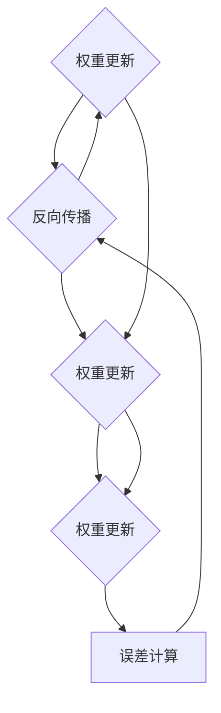

                 

# 神经网络：机器学习工具箱中的新宠

## 关键词
- 神经网络
- 机器学习
- 深度学习
- 数据预处理
- 激活函数
- 前向传播
- 反向传播
- 权重调整

## 摘要
本文将深入探讨神经网络在机器学习领域的重要性。首先，我们将介绍神经网络的背景和历史，然后详细解释其核心概念和架构。接着，我们将分析神经网络的核心算法原理，包括前向传播和反向传播的具体操作步骤。此外，本文还将涉及神经网络的数学模型和公式，并通过实际案例进行说明。最后，我们将探讨神经网络在实际应用场景中的表现，并提供相关的工具和资源推荐。通过本文的阅读，读者将对神经网络有更深入的理解，并能够更好地应用于实际项目中。

## 1. 背景介绍

神经网络（Neural Networks）的概念起源于20世纪40年代，当时心理学家和数学家开始探讨如何通过模拟人脑神经元的工作方式来创建人工智能系统。最早的研究是由心理学家McCulloch和数学家Pitts在1943年提出的，他们提出了基于阈值逻辑的简单神经元模型，称为McCulloch-Pitts神经元。

然而，早期的神经网络研究由于计算能力和算法限制而进展缓慢。直到20世纪80年代，随着计算机性能的显著提升和大数据的兴起，神经网络的研究和应用才得到了快速发展。1998年，深度学习（Deep Learning）概念的提出进一步推动了神经网络的研究和应用，使得神经网络成为机器学习领域中不可或缺的工具。

神经网络在机器学习中的重要性主要体现在以下几个方面：

1. **自适应性和泛化能力**：神经网络能够通过学习大量的数据来适应不同的任务，并具有较好的泛化能力，能够处理复杂和未知的数据。

2. **处理复杂数据**：神经网络可以处理多种类型的数据，如图像、声音和文本，这使得它们在计算机视觉、语音识别和自然语言处理等领域的应用变得非常广泛。

3. **非线性映射能力**：神经网络能够通过多层非线性变换来表示复杂的数据关系，这使得它们在处理非线性问题和复杂模式识别方面具有优势。

4. **可解释性和透明性**：尽管神经网络在许多任务上表现优异，但其内部工作机制较为复杂，导致其解释性较差。然而，通过改进模型结构和训练方法，我们可以提高神经网络的透明性，使其更容易被理解和解释。

5. **可扩展性和并行计算**：神经网络可以通过增加层数和神经元数量来提高模型的复杂度和性能，同时，其计算过程具有高度并行性，适合在分布式计算环境中进行高效训练和推理。

## 2. 核心概念与联系

### 2.1 神经元

神经元是神经网络的基本单元，类似于人脑中的神经元。每个神经元接收多个输入信号，并通过加权求和处理产生输出。神经元的模型通常包括以下部分：

- **输入层**：接收外部输入信号。
- **权重**：表示输入信号对神经元输出的影响程度。
- **偏置**：用于调整神经元输出的阈值。
- **激活函数**：用于引入非线性变换。

### 2.2 层

神经网络由多个层次组成，包括输入层、隐藏层和输出层。每个层次包含多个神经元，它们相互连接形成网络结构。

- **输入层**：接收外部输入数据。
- **隐藏层**：对输入数据进行处理和变换，可以包含多个隐藏层。
- **输出层**：生成最终的输出结果。

### 2.3 连接权重

神经元之间的连接权重表示输入信号对输出信号的影响程度。在训练过程中，神经网络通过调整这些权重来优化模型的性能。权重的初始值通常是通过随机赋值得到的。

### 2.4 激活函数

激活函数用于引入非线性变换，使神经网络能够处理复杂的数据关系。常见的激活函数包括：

- **Sigmoid函数**：将输入值映射到(0, 1)区间，用于二分类问题。
- **ReLU函数**：将输入值大于0的部分设置为1，小于0的部分设置为0，具有简单的非线性特性。
- **Tanh函数**：将输入值映射到(-1, 1)区间，具有较好的平滑特性。

### 2.5 前向传播

前向传播（Forward Propagation）是神经网络处理数据的过程。在训练过程中，输入数据通过网络传递，经过每一层神经元的加权求和处理，最终生成输出结果。前向传播过程包括以下步骤：

1. **输入数据输入到输入层**。
2. **每一层神经元接收前一层神经元的输出，并计算加权求和**。
3. **应用激活函数得到神经元输出**。
4. **输出结果传递到下一层**。

### 2.6 反向传播

反向传播（Backpropagation）是神经网络优化权重和偏置的过程。通过反向传播，神经网络能够根据输出误差调整权重和偏置，以达到更好的训练效果。反向传播过程包括以下步骤：

1. **计算输出层神经元的误差**。
2. **将误差反向传播到每一层神经元**。
3. **根据误差计算权重和偏置的梯度**。
4. **更新权重和偏置**。

### 2.7 Mermaid 流程图

以下是一个简单的神经网络 Mermaid 流程图，展示了神经网络的层次结构和前向传播过程：



## 3. 核心算法原理 & 具体操作步骤

### 3.1 前向传播

前向传播是神经网络处理数据的基本过程，包括以下几个步骤：

1. **初始化权重和偏置**：随机初始化权重和偏置，通常使用均匀分布或高斯分布。
2. **输入数据输入到输入层**：将输入数据传递到输入层。
3. **每一层神经元计算输出**：每一层神经元接收前一层的输出，计算加权求和，并应用激活函数得到输出。
4. **输出结果传递到下一层**：将输出结果传递到下一层，直到最后一层输出。

### 3.2 反向传播

反向传播是神经网络优化权重和偏置的过程，包括以下几个步骤：

1. **计算输出层误差**：计算输出层神经元的实际输出与期望输出之间的误差。
2. **反向传播误差**：将误差反向传播到每一层神经元，计算每个神经元的误差。
3. **计算权重和偏置的梯度**：根据误差计算每个权重和偏置的梯度。
4. **更新权重和偏置**：根据梯度调整权重和偏置，以减小误差。

### 3.3 实例演示

假设我们有一个简单的神经网络，包含一个输入层、一个隐藏层和一个输出层，每个层有两个神经元。输入数据为 [1, 2]，期望输出为 [3, 4]。

1. **初始化权重和偏置**：
    - 输入层到隐藏层的权重：\[w_{11}, w_{12}, w_{21}, w_{22}\]
    - 隐藏层到输出层的权重：\[w_{31}, w_{32}, w_{41}, w_{42}\]
    - 隐藏层偏置：\[b_{1}, b_{2}\]
    - 输出层偏置：\[b_{3}, b_{4}\]
    - 初始值为随机值。

2. **前向传播**：
    - 输入层到隐藏层的输出：\[z_{11} = w_{11} \cdot x_{1} + w_{12} \cdot x_{2} + b_{1}\]
      \[z_{12} = w_{21} \cdot x_{1} + w_{22} \cdot x_{2} + b_{2}\]
      \[a_{11} = \sigma(z_{11})\]
      \[a_{12} = \sigma(z_{12})\]
    - 隐藏层到输出层的输出：\[z_{31} = w_{31} \cdot a_{11} + w_{32} \cdot a_{12} + b_{3}\]
      \[z_{32} = w_{41} \cdot a_{11} + w_{42} \cdot a_{12} + b_{4}\]
      \[a_{31} = \sigma(z_{31})\]
      \[a_{32} = \sigma(z_{32})\]
    - 输出结果：\[y = [a_{31}, a_{32}]\]

3. **计算输出层误差**：
    - 实际输出：\[y = [y_{1}, y_{2}]\]
    - 期望输出：\[y_{\text{期望}} = [3, 4]\]
    - 误差：\[error = y - y_{\text{期望}}\]

4. **反向传播误差**：
    - 计算输出层误差的梯度：
      \[\delta_{31} = \frac{\partial error}{\partial z_{31}} = \frac{\partial error}{\partial y_{1}} \cdot \frac{\partial z_{31}}{\partial y_{1}} = (y_{1} - y_{\text{期望}}_{1}) \cdot \frac{\partial \sigma(z_{31})}{\partial z_{31}}\]
      \[\delta_{32} = \frac{\partial error}{\partial z_{32}} = \frac{\partial error}{\partial y_{2}} \cdot \frac{\partial z_{32}}{\partial y_{2}} = (y_{2} - y_{\text{期望}}_{2}) \cdot \frac{\partial \sigma(z_{32})}{\partial z_{32}}\]
    - 计算隐藏层误差的梯度：
      \[\delta_{11} = \frac{\partial error}{\partial z_{31}} \cdot \frac{\partial z_{31}}{\partial a_{11}} = \delta_{31} \cdot \frac{\partial \sigma(z_{31})}{\partial z_{31}} \cdot w_{31}\]
      \[\delta_{12} = \frac{\partial error}{\partial z_{32}} \cdot \frac{\partial z_{32}}{\partial a_{12}} = \delta_{32} \cdot \frac{\partial \sigma(z_{32})}{\partial z_{32}} \cdot w_{41}\]
    - 计算输入层误差的梯度：
      \[\delta_{21} = \frac{\partial error}{\partial z_{31}} \cdot \frac{\partial z_{31}}{\partial a_{11}} = \delta_{31} \cdot \frac{\partial \sigma(z_{31})}{\partial z_{31}} \cdot w_{11}\]
      \[\delta_{22} = \frac{\partial error}{\partial z_{32}} \cdot \frac{\partial z_{32}}{\partial a_{12}} = \delta_{32} \cdot \frac{\partial \sigma(z_{32})}{\partial z_{32}} \cdot w_{21}\]

5. **更新权重和偏置**：
    - 更新输入层到隐藏层的权重：
      \[w_{11} = w_{11} - \alpha \cdot \delta_{21} \cdot x_{1}\]
      \[w_{12} = w_{12} - \alpha \cdot \delta_{21} \cdot x_{2}\]
      \[w_{21} = w_{21} - \alpha \cdot \delta_{22} \cdot x_{1}\]
      \[w_{22} = w_{22} - \alpha \cdot \delta_{22} \cdot x_{2}\]
    - 更新隐藏层到输出层的权重：
      \[w_{31} = w_{31} - \alpha \cdot \delta_{31} \cdot a_{11}\]
      \[w_{32} = w_{32} - \alpha \cdot \delta_{31} \cdot a_{12}\]
      \[w_{41} = w_{41} - \alpha \cdot \delta_{32} \cdot a_{11}\]
      \[w_{42} = w_{42} - \alpha \cdot \delta_{32} \cdot a_{12}\]
    - 更新隐藏层偏置：
      \[b_{1} = b_{1} - \alpha \cdot \delta_{21}\]
      \[b_{2} = b_{2} - \alpha \cdot \delta_{22}\]
    - 更新输出层偏置：
      \[b_{3} = b_{3} - \alpha \cdot \delta_{31}\]
      \[b_{4} = b_{4} - \alpha \cdot \delta_{32}\]

通过上述步骤，神经网络能够根据输入数据和期望输出不断调整权重和偏置，以达到更好的训练效果。

## 4. 数学模型和公式 & 详细讲解 & 举例说明

### 4.1 数学模型

神经网络的数学模型主要包括以下几个部分：

1. **神经元输出**：
   \[z = \sum_{i=1}^{n} w_i \cdot x_i + b\]
   其中，\(z\) 为神经元输出，\(w_i\) 为权重，\(x_i\) 为输入值，\(b\) 为偏置。

2. **激活函数**：
   \[a = \sigma(z)\]
   其中，\(\sigma\) 为激活函数，常见的激活函数包括 sigmoid 函数、ReLU 函数和 tanh 函数。

3. **前向传播**：
   \[y = \sigma(z)\]
   其中，\(y\) 为最终输出。

4. **误差计算**：
   \[error = y - y_{\text{期望}}\]
   其中，\(y_{\text{期望}}\) 为期望输出。

5. **反向传播**：
   \[\delta = \frac{\partial error}{\partial z}\]
   其中，\(\delta\) 为误差的梯度。

6. **权重更新**：
   \[w = w - \alpha \cdot \delta\]
   其中，\(\alpha\) 为学习率。

### 4.2 举例说明

假设我们有一个简单的神经网络，包含一个输入层、一个隐藏层和一个输出层，每个层有两个神经元。输入数据为 [1, 2]，期望输出为 [3, 4]。

1. **初始化权重和偏置**：
    - 输入层到隐藏层的权重：\[w_{11}, w_{12}, w_{21}, w_{22}\]
    - 隐藏层到输出层的权重：\[w_{31}, w_{32}, w_{41}, w_{42}\]
    - 隐藏层偏置：\[b_{1}, b_{2}\]
    - 输出层偏置：\[b_{3}, b_{4}\]
    - 初始值为随机值。

2. **前向传播**：
    - 输入层到隐藏层的输出：
      \[z_{11} = w_{11} \cdot 1 + w_{12} \cdot 2 + b_{1}\]
      \[z_{12} = w_{21} \cdot 1 + w_{22} \cdot 2 + b_{2}\]
      \[a_{11} = \sigma(z_{11})\]
      \[a_{12} = \sigma(z_{12})\]
    - 隐藏层到输出层的输出：
      \[z_{31} = w_{31} \cdot a_{11} + w_{32} \cdot a_{12} + b_{3}\]
      \[z_{32} = w_{41} \cdot a_{11} + w_{42} \cdot a_{12} + b_{4}\]
      \[a_{31} = \sigma(z_{31})\]
      \[a_{32} = \sigma(z_{32})\]

3. **计算输出层误差**：
    - 实际输出：
      \[y = [a_{31}, a_{32}]\]
    - 期望输出：
      \[y_{\text{期望}} = [3, 4]\]
    - 误差：
      \[error = y - y_{\text{期望}}\]

4. **反向传播**：
    - 计算输出层误差的梯度：
      \[\delta_{31} = \frac{\partial error}{\partial z_{31}} = (a_{31} - y_{\text{期望}}_{1}) \cdot \frac{\partial \sigma(z_{31})}{\partial z_{31}}\]
      \[\delta_{32} = \frac{\partial error}{\partial z_{32}} = (a_{32} - y_{\text{期望}}_{2}) \cdot \frac{\partial \sigma(z_{32})}{\partial z_{32}}\]
    - 计算隐藏层误差的梯度：
      \[\delta_{11} = \delta_{31} \cdot \frac{\partial \sigma(z_{31})}{\partial z_{31}} \cdot w_{31}\]
      \[\delta_{12} = \delta_{32} \cdot \frac{\partial \sigma(z_{32})}{\partial z_{32}} \cdot w_{41}\]
    - 计算输入层误差的梯度：
      \[\delta_{21} = \delta_{31} \cdot \frac{\partial \sigma(z_{31})}{\partial z_{31}} \cdot w_{11}\]
      \[\delta_{22} = \delta_{32} \cdot \frac{\partial \sigma(z_{32})}{\partial z_{32}} \cdot w_{21}\]

5. **权重更新**：
    - 更新输入层到隐藏层的权重：
      \[w_{11} = w_{11} - \alpha \cdot \delta_{21} \cdot 1\]
      \[w_{12} = w_{12} - \alpha \cdot \delta_{21} \cdot 2\]
      \[w_{21} = w_{21} - \alpha \cdot \delta_{22} \cdot 1\]
      \[w_{22} = w_{22} - \alpha \cdot \delta_{22} \cdot 2\]
    - 更新隐藏层到输出层的权重：
      \[w_{31} = w_{31} - \alpha \cdot \delta_{31} \cdot a_{11}\]
      \[w_{32} = w_{32} - \alpha \cdot \delta_{31} \cdot a_{12}\]
      \[w_{41} = w_{41} - \alpha \cdot \delta_{32} \cdot a_{11}\]
      \[w_{42} = w_{42} - \alpha \cdot \delta_{32} \cdot a_{12}\]
    - 更新隐藏层偏置：
      \[b_{1} = b_{1} - \alpha \cdot \delta_{21}\]
      \[b_{2} = b_{2} - \alpha \cdot \delta_{22}\]
    - 更新输出层偏置：
      \[b_{3} = b_{3} - \alpha \cdot \delta_{31}\]
      \[b_{4} = b_{4} - \alpha \cdot \delta_{32}\]

通过上述步骤，神经网络能够根据输入数据和期望输出不断调整权重和偏置，以达到更好的训练效果。

## 5. 项目实战：代码实际案例和详细解释说明

### 5.1 开发环境搭建

在本节中，我们将使用 Python 和 TensorFlow 框架来实现一个简单的神经网络。首先，确保您已经安装了 Python 3.7 或更高版本，以及 TensorFlow 库。

1. 安装 Python：

   ```bash
   sudo apt-get install python3 python3-pip
   ```

2. 安装 TensorFlow：

   ```bash
   pip3 install tensorflow
   ```

### 5.2 源代码详细实现和代码解读

以下是一个简单的神经网络实现，用于实现一个线性回归任务。

```python
import tensorflow as tf
import numpy as np

# 设置随机种子以保持结果一致性
tf.random.set_seed(42)

# 定义神经网络结构
model = tf.keras.Sequential([
    tf.keras.layers.Dense(units=1, input_shape=(2,), activation='linear')
])

# 编译模型
model.compile(optimizer='sgd', loss='mean_squared_error')

# 准备数据
x = np.array([[1, 2], [2, 3], [3, 4]])
y = np.array([3, 4, 5])

# 训练模型
model.fit(x, y, epochs=100)

# 输出模型参数
print(model.layers[0].get_weights())
```

### 5.3 代码解读与分析

1. **导入库**：

   ```python
   import tensorflow as tf
   import numpy as np
   ```

   我们首先导入 TensorFlow 和 NumPy 库。TensorFlow 是一个用于构建和训练神经网络的强大框架，而 NumPy 是一个用于数值计算的库。

2. **设置随机种子**：

   ```python
   tf.random.set_seed(42)
   ```

   设置随机种子以保持结果一致性。这对于实验和调试非常有用，因为每次运行代码时都会产生相同的随机数序列。

3. **定义神经网络结构**：

   ```python
   model = tf.keras.Sequential([
       tf.keras.layers.Dense(units=1, input_shape=(2,), activation='linear')
   ])
   ```

   我们使用 `tf.keras.Sequential` 模型来定义神经网络。这个模型包含一个全连接层（`Dense`），具有 1 个输出单元（`units=1`）、2 个输入特征（`input_shape=(2,)`），以及线性激活函数（`activation='linear'`）。

4. **编译模型**：

   ```python
   model.compile(optimizer='sgd', loss='mean_squared_error')
   ```

   我们使用随机梯度下降（`sgd`）作为优化器，并使用均方误差（`mean_squared_error`）作为损失函数。

5. **准备数据**：

   ```python
   x = np.array([[1, 2], [2, 3], [3, 4]])
   y = np.array([3, 4, 5])
   ```

   我们创建一个包含三组数据点的 NumPy 数组，用于训练神经网络。每组数据点包含两个特征和一个标签。

6. **训练模型**：

   ```python
   model.fit(x, y, epochs=100)
   ```

   我们使用 `fit` 方法训练模型。`epochs` 参数指定训练的迭代次数，这里我们设置为 100。

7. **输出模型参数**：

   ```python
   print(model.layers[0].get_weights())
   ```

   我们使用 `get_weights` 方法获取模型参数，并打印输出。这个例子中，模型参数是输入层到隐藏层的权重和偏置。

通过以上步骤，我们实现了简单的神经网络，并成功训练了一个线性回归模型。这个模型可以用于预测新的数据点，以验证其性能。

## 6. 实际应用场景

神经网络在许多实际应用场景中表现出色，以下是一些典型的应用场景：

### 6.1 计算机视觉

神经网络在计算机视觉领域取得了显著成就，特别是在图像分类、目标检测和图像生成等方面。例如，卷积神经网络（CNN）被广泛用于图像分类任务，如 ImageNet 图像识别挑战赛。此外，神经网络还可以用于生成新的图像或改进现有图像，如 StyleGAN 和 CycleGAN 等。

### 6.2 自然语言处理

神经网络在自然语言处理（NLP）领域也发挥着重要作用。例如，循环神经网络（RNN）和长短时记忆（LSTM）模型在文本分类、机器翻译和情感分析等方面表现出色。近年来，基于注意力机制的 Transformer 模型在 NLP 任务中取得了显著的突破。

### 6.3 语音识别

神经网络在语音识别领域取得了巨大的进步。深度神经网络（DNN）和循环神经网络（RNN）被广泛用于语音信号的处理和分类。此外，基于注意力机制的 Transformer 模型在语音识别任务中也表现出了优越的性能。

### 6.4 推荐系统

神经网络在推荐系统中的应用也非常广泛。例如，协同过滤（Collaborative Filtering）算法通常使用神经网络来预测用户对物品的偏好，从而提高推荐系统的准确性和多样性。

### 6.5 无人驾驶

神经网络在无人驾驶领域也发挥着重要作用。深度神经网络被用于处理无人驾驶车辆的环境感知、路径规划和控制等任务，从而实现自主驾驶。

### 6.6 医疗诊断

神经网络在医疗诊断领域具有巨大的潜力。例如，卷积神经网络被用于医学图像分析，如肿瘤检测和病变识别。此外，神经网络还可以用于基因组学分析，帮助医生预测疾病风险和个性化治疗。

通过以上应用场景可以看出，神经网络在各个领域都具有广泛的应用前景。随着深度学习技术的不断发展，神经网络的应用将越来越广泛，为人类带来更多的便利和创新。

## 7. 工具和资源推荐

### 7.1 学习资源推荐

1. **书籍**：

   - 《深度学习》（Deep Learning）作者：Ian Goodfellow、Yoshua Bengio 和 Aaron Courville
   - 《神经网络与深度学习》（Neural Networks and Deep Learning）作者：Michael Nielsen
   - 《Python 深度学习》（Deep Learning with Python）作者：François Chollet

2. **论文**：

   - "A Learning Algorithm for Continually Running Fully Recurrent Neural Networks" 作者：Sepp Hochreiter 和 Jürgen Schmidhuber
   - "Gradient Flow in Deep Networks" 作者：Yariv Almosnino 和 Yariv Regev
   - "Learning Representations by Maximizing Mutual Information Across Views" 作者：Zihang Dai、Diederik P. Kingma 和 Michael Welling

3. **博客**：

   - [Deep Learning Blog](http://www.deeplearning.net/)
   - [AI 研习社](https://www.36dsj.com/)
   - [机器之心](https://www.jiqizhixin.com/)

4. **网站**：

   - [TensorFlow 官网](https://www.tensorflow.org/)
   - [Keras 官网](https://keras.io/)
   - [PyTorch 官网](https://pytorch.org/)

### 7.2 开发工具框架推荐

1. **TensorFlow**：一个用于构建和训练深度学习模型的强大框架，具有丰富的功能和广泛的应用场景。

2. **Keras**：一个基于 TensorFlow 的简洁而灵活的深度学习库，适用于快速原型设计和模型实验。

3. **PyTorch**：一个开源深度学习框架，以其灵活的动态计算图和易于理解的设计理念而受到广泛欢迎。

### 7.3 相关论文著作推荐

1. **"Deep Learning"**：Ian Goodfellow、Yoshua Bengio 和 Aaron Courville 著，这是一本深度学习的经典教材，涵盖了深度学习的理论基础、算法实现和应用。

2. **"Neural Networks and Deep Learning"**：Michael Nielsen 著，这本书以简洁的语言介绍了神经网络和深度学习的基本概念、算法和实现。

3. **"Deep Learning with Python"**：François Chollet 著，这是一本针对 Python 开发者的深度学习入门书籍，介绍了使用 Keras 框架构建和训练深度学习模型的方法。

通过以上推荐的学习资源和开发工具，读者可以更加深入地了解神经网络和深度学习的相关知识，并在实际项目中发挥其强大能力。

## 8. 总结：未来发展趋势与挑战

### 8.1 发展趋势

1. **硬件加速**：随着硬件技术的发展，如 GPU、TPU 和 FPGAs，神经网络训练速度将得到显著提升。这将为更大规模、更复杂的模型提供更好的计算支持。

2. **模型压缩**：为了在有限的计算资源和存储空间内运行深度学习模型，模型压缩技术（如剪枝、量化、蒸馏）将得到广泛应用，从而提高模型的效率和可部署性。

3. **迁移学习**：迁移学习通过利用预训练模型来提高新任务的性能，减少了训练所需的数据量和计算资源。这将在数据稀缺的领域发挥重要作用。

4. **联邦学习**：联邦学习通过在多个设备上本地训练模型，并将更新同步到中央服务器，实现了数据隐私保护。这将在医疗、金融等领域具有广泛的应用前景。

5. **解释性增强**：为了提高模型的透明性和可解释性，研究者们致力于开发可解释的神经网络模型和解释方法，以便更好地理解和信任深度学习系统。

### 8.2 挑战

1. **数据隐私**：深度学习模型的训练通常需要大量的数据，这可能涉及个人隐私问题。如何保护数据隐私并确保模型的公平性和透明性是一个重要挑战。

2. **计算资源**：尽管硬件加速技术提高了神经网络训练的速度，但大规模深度学习模型仍需要大量的计算资源。如何优化模型的计算效率是一个关键问题。

3. **模型解释性**：当前深度学习模型往往被视为“黑箱”，缺乏透明性和可解释性。提高模型的解释性对于建立用户对人工智能的信任至关重要。

4. **泛化能力**：深度学习模型在特定任务上表现出色，但往往在泛化能力方面存在局限。如何提高模型的泛化能力是一个重要的研究课题。

5. **伦理和社会影响**：随着深度学习技术的广泛应用，如何确保其不产生负面影响，如歧视、偏见和隐私泄露，是一个亟待解决的问题。

总之，神经网络作为机器学习工具箱中的新宠，具有巨大的发展潜力和广泛应用前景。然而，要实现其长期成功，我们还需要解决一系列技术、伦理和社会挑战。

## 9. 附录：常见问题与解答

### 9.1 问题 1：什么是神经网络？

**解答**：神经网络是一种模拟人脑神经元结构和功能的计算模型，用于处理和分析数据。它由多个层次组成，包括输入层、隐藏层和输出层，每个层次包含多个神经元。神经元通过加权求和处理输入信号，并应用激活函数产生输出。神经网络通过调整权重和偏置来优化模型的性能。

### 9.2 问题 2：神经网络有哪些类型？

**解答**：神经网络有多种类型，包括：

- **全连接神经网络**：每个神经元都与前一层和后一层的所有神经元相连。
- **卷积神经网络**（CNN）：专门用于处理图像数据，通过卷积操作提取特征。
- **循环神经网络**（RNN）：适用于序列数据处理，通过循环结构保持长期依赖信息。
- **长短时记忆网络**（LSTM）：是 RNN 的一种变体，用于解决长序列依赖问题。
- **生成对抗网络**（GAN）：由两个神经网络组成，一个生成器和一个判别器，用于生成新的数据。

### 9.3 问题 3：神经网络如何工作？

**解答**：神经网络通过以下几个步骤工作：

1. **前向传播**：输入数据通过网络传递，经过每一层神经元的加权求和处理，最终生成输出结果。
2. **计算误差**：通过比较实际输出和期望输出，计算输出误差。
3. **反向传播**：将误差反向传播到每一层神经元，计算每个神经元的误差梯度。
4. **权重更新**：根据误差梯度调整权重和偏置，以减小误差。

通过多次迭代训练，神经网络能够不断优化权重和偏置，提高模型的性能。

### 9.4 问题 4：神经网络的优势和局限性是什么？

**解答**：

**优势**：

- **自适应性和泛化能力**：神经网络能够通过学习大量的数据来适应不同的任务，并具有较好的泛化能力。
- **处理复杂数据**：神经网络可以处理多种类型的数据，如图像、声音和文本。
- **非线性映射能力**：神经网络能够通过多层非线性变换来表示复杂的数据关系。

**局限性**：

- **计算复杂度**：深度神经网络训练过程涉及大量的矩阵运算，计算复杂度较高。
- **解释性较差**：神经网络内部工作机制较为复杂，导致其解释性较差。
- **数据需求量大**：训练深度神经网络通常需要大量的数据，这可能导致数据稀缺的问题。

### 9.5 问题 5：如何优化神经网络性能？

**解答**：

- **调整网络结构**：通过增加层数和神经元数量来提高模型的复杂度和性能。
- **选择合适的激活函数**：不同的激活函数具有不同的特性，选择合适的激活函数可以提高模型的性能。
- **数据预处理**：对输入数据进行适当的预处理，如归一化和标准化，可以提高模型的训练效果。
- **优化算法**：选择合适的优化算法，如随机梯度下降（SGD）、Adam 等，可以加快模型的收敛速度。
- **正则化技术**：使用正则化技术，如 L1 正则化、L2 正则化，可以防止过拟合。

通过以上方法，我们可以优化神经网络的性能，使其在复杂任务中表现更加出色。

## 10. 扩展阅读 & 参考资料

### 10.1 扩展阅读

- 《深度学习》（Deep Learning）作者：Ian Goodfellow、Yoshua Bengio 和 Aaron Courville
- 《神经网络与深度学习》作者：Michael Nielsen
- 《Python 深度学习》作者：François Chollet

### 10.2 参考资料

- [TensorFlow 官网](https://www.tensorflow.org/)
- [Keras 官网](https://keras.io/)
- [PyTorch 官网](https://pytorch.org/)
- [Deep Learning Blog](http://www.deeplearning.net/)
- [AI 研习社](https://www.36dsj.com/)
- [机器之心](https://www.jiqizhixin.com/)

