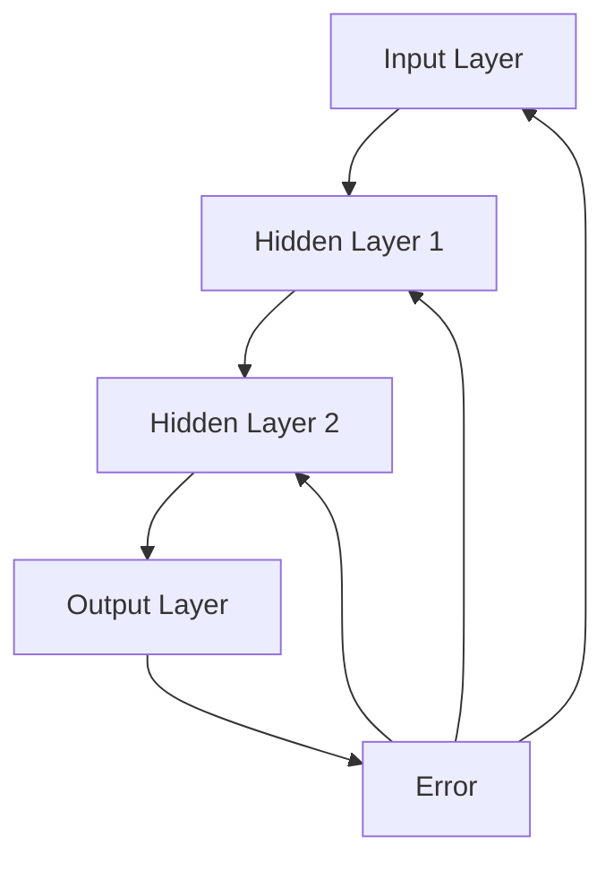

                 

## 1. 背景介绍

在计算机科学领域，神经网络作为一种重要的机器学习模型，已经引起了广泛的关注和研究。从20世纪50年代开始，神经网络的概念就被提出，但直到最近几年，随着计算能力和数据量的不断增加，神经网络才逐渐成为机器学习的核心工具之一。神经网络的广泛应用，使得机器学习在很多领域取得了显著的成果，如图像识别、自然语言处理、语音识别等。

神经网络的基本原理是模拟人脑神经元之间的连接，通过多层神经元之间的信息传递和处理，实现数据的自动学习和特征提取。与传统机器学习模型相比，神经网络具有自适应性强、非线性变换能力强等优点，这使得它在处理复杂问题方面具有很大的优势。

本文将围绕神经网络这一主题，首先介绍其基本概念和架构，然后深入探讨核心算法原理、数学模型、具体操作步骤等，并通过实际项目实战，展示神经网络的实际应用。此外，还将介绍相关工具和资源，帮助读者更好地理解和掌握神经网络。

接下来，我们将分章节逐一介绍神经网络的各个方面。希望通过本文的介绍，读者能够对神经网络有一个全面而深入的了解，从而在未来的研究和应用中更好地利用这一强大的机器学习工具。

### 1.1 神经网络的发展历程

神经网络的概念最早由心理学家McCulloch和数学家Pitts在1943年提出，他们设计了一个简单的数学模型，称为**McCulloch-Pitts神经元**，用来模拟人脑神经元的工作原理。然而，由于计算能力的限制，早期神经网络的研究并未取得实质性的进展。

直到1986年，Rumelhart、Hinton和Williams等人提出了**反向传播算法（Backpropagation Algorithm）**，使得多层神经网络的学习效率大大提高。这一突破性进展，重新点燃了人们对神经网络的热情，并推动了神经网络在各个领域的应用。

在1990年代，随着计算能力的进一步提升，特别是GPU的广泛应用，神经网络的训练速度得到了极大的提升。同时，1998年，Hinton提出了**深度信念网络（Deep Belief Network, DBN）**，进一步推动了深度学习的发展。

进入21世纪，随着大数据和深度学习算法的兴起，神经网络的应用场景更加广泛。在图像识别方面，深度卷积神经网络（Convolutional Neural Network, CNN）取得了显著的成果，如ImageNet图像分类挑战中，CNN模型的成绩远超传统机器学习模型。在自然语言处理领域，循环神经网络（Recurrent Neural Network, RNN）及其变种长短期记忆网络（Long Short-Term Memory, LSTM）也取得了重要的突破。

总体来说，神经网络的发展历程充分展示了计算机科学领域的不断创新和进步。从最初的简单神经元模型，到今天复杂的深度神经网络，神经网络在机器学习领域的地位越来越重要，其应用前景也越发广阔。

### 1.2 神经网络的应用领域

神经网络作为一种强大的机器学习工具，已经在多个领域取得了显著的成果。以下是神经网络在图像识别、自然语言处理、语音识别等几个主要应用领域的具体应用和成果。

#### 图像识别

图像识别是神经网络最成功的应用之一。在图像分类任务中，深度卷积神经网络（CNN）被广泛使用。2012年，由Hinton团队开发的CNN模型在ImageNet图像分类挑战中取得了突破性的成绩，使得神经网络在图像识别领域的地位得到显著提升。此后，基于CNN的各种改进模型相继提出，如ResNet、Inception等，使得图像识别的准确率不断提高。目前，神经网络在人脸识别、自动驾驶、医学图像分析等领域的应用越来越广泛。

#### 自然语言处理

自然语言处理（Natural Language Processing, NLP）是另一个神经网络大显身手的领域。在NLP任务中，循环神经网络（Recurrent Neural Network, RNN）及其变种长短期记忆网络（Long Short-Term Memory, LSTM）被广泛应用。LSTM在处理长序列数据时表现出色，使得神经网络在机器翻译、文本生成、情感分析等任务中取得了显著的成果。近年来，基于Transformer的模型，如BERT、GPT等，在NLP任务中表现出了更强的能力，进一步推动了NLP领域的发展。

#### 语音识别

语音识别（Automatic Speech Recognition, ASR）是神经网络在语音处理领域的应用。传统语音识别系统主要依赖于统计模型和声学模型，但近年来，深度学习模型在语音识别任务中的表现逐渐优于传统方法。基于CNN和RNN的语音识别模型已经被广泛应用于智能语音助手、语音翻译等场景。尤其是在端到端语音识别系统中，深度神经网络能够直接从原始音频信号中提取特征，并实现高精度的语音识别。

总之，神经网络在图像识别、自然语言处理、语音识别等多个领域的应用，充分展示了其强大的学习和处理能力。随着神经网络技术的不断进步，其在各个领域的应用前景将更加广阔。

### 1.3 神经网络的基本概念和架构

神经网络是一种模拟人脑神经元连接和功能的计算模型，其基本单位是**神经元**。神经元通过输入层、隐藏层和输出层组成，每一层包含多个神经元，神经元之间通过连接（权重）进行信息传递和处理。

#### 神经元

神经元是神经网络的基本计算单元，类似于人脑中的神经元。一个简单的神经元可以表示为：
$$
f(\sum_{i=1}^{n} w_i x_i + b)
$$
其中，$w_i$表示从第$i$个输入连接的权重，$x_i$表示第$i$个输入值，$b$是偏置项，$f$是激活函数。激活函数的作用是对神经元的输出进行非线性变换，常用的激活函数有Sigmoid、ReLU等。

#### 输入层

输入层是神经网络的第一层，接收外部输入数据。输入层的每个神经元对应输入数据的一个特征。

#### 隐藏层

隐藏层是神经网络的核心部分，负责对输入数据进行特征提取和变换。隐藏层可以有多个，每个隐藏层的神经元数量可以根据问题复杂度进行调整。

#### 输出层

输出层是神经网络的最后一层，负责生成最终的输出结果。输出层的每个神经元对应一个输出类别或值。

#### 神经网络的激活函数

激活函数是神经网络中一个关键的部分，其作用是对神经元输出进行非线性变换。以下是一些常见的激活函数：

1. **Sigmoid函数**：$f(x) = \frac{1}{1 + e^{-x}}$，输出值在0和1之间。Sigmoid函数具有平滑的曲线，但梯度较慢。
2. **ReLU函数**：$f(x) = \max(0, x)$，在$x \geq 0$时输出$x$，在$x < 0$时输出0。ReLU函数具有较快的梯度，有利于神经网络的学习。
3. **Tanh函数**：$f(x) = \frac{e^x - e^{-x}}{e^x + e^{-x}}$，输出值在-1和1之间。Tanh函数的输出范围较广，且具有平滑的曲线。

#### 神经网络的连接方式

神经网络中的神经元之间通过权重进行连接，这些权重在训练过程中会被不断调整。权重表示神经元之间的相关性，初始时通常随机赋值。在训练过程中，神经网络通过前向传播（forward propagation）和反向传播（backpropagation）算法，不断调整权重，使得网络的输出结果更接近真实值。

#### 前向传播

前向传播是从输入层开始，逐层计算每个神经元的输出值，直到输出层。在前向传播过程中，每个神经元的输出值是通过其输入值和权重进行加权求和，并经过激活函数处理后得到的。

#### 反向传播

反向传播是神经网络训练的核心部分，用于计算每个权重的梯度，并更新权重。在反向传播过程中，首先计算输出层与隐藏层、输入层之间的误差，然后根据误差和激活函数的导数，计算每个权重的梯度。最后，通过梯度下降算法（Gradient Descent）等优化方法，更新权重。

通过以上介绍，我们可以看到神经网络的基本概念和架构。在接下来的章节中，我们将进一步探讨神经网络的算法原理、数学模型、具体操作步骤等，帮助读者更深入地理解神经网络。

### 2. 核心概念与联系

在深入探讨神经网络的核心概念之前，我们需要了解几个关键的概念：神经元、前向传播、反向传播、激活函数等。这些概念相互关联，构成了神经网络的基本工作原理。接下来，我们将详细解释这些核心概念，并使用Mermaid流程图来展示它们之间的关系。

#### 神经元

神经元是神经网络的基本构建块，它们通过输入和输出进行信息传递和处理。每个神经元接收多个输入值，并计算输入值的加权和，然后通过激活函数进行处理。一个简单的神经元可以表示为：
$$
f(\sum_{i=1}^{n} w_i x_i + b)
$$
其中，$w_i$表示权重，$x_i$表示输入值，$b$是偏置项，$f$是激活函数。激活函数的作用是对神经元的输出进行非线性变换，常用的激活函数包括Sigmoid、ReLU和Tanh等。

#### 前向传播

前向传播是指将输入数据传递到神经网络中，逐层计算每个神经元的输出值的过程。前向传播从输入层开始，每个神经元的输出是通过其输入值和权重进行加权求和，然后经过激活函数处理得到的。具体步骤如下：

1. **输入层**：输入层接收外部输入数据，每个神经元对应一个输入特征。
2. **隐藏层**：隐藏层接收来自前一层神经元的输出值，每个神经元对输入值进行加权求和，并经过激活函数处理。
3. **输出层**：输出层生成最终的输出结果，例如分类结果或回归值。

#### 反向传播

反向传播是神经网络训练过程中最核心的部分，它通过计算输出层与隐藏层、输入层之间的误差，并反向传播误差到各层，以调整权重和偏置。反向传播的过程如下：

1. **计算输出误差**：首先计算输出层与真实值之间的误差，误差可以通过损失函数（如均方误差MSE、交叉熵误差CE等）计算得到。
2. **计算梯度**：根据误差和激活函数的导数，计算每个权重的梯度。梯度表示权重的调整方向和大小。
3. **更新权重**：通过梯度下降算法（或其他优化方法），更新每个权重和偏置，以减少误差。

#### 激活函数

激活函数是神经网络中一个关键的部分，它对神经元的输出进行非线性变换，使得神经网络具有更好的表达能力和学习能力。常用的激活函数包括：

1. **Sigmoid函数**：$f(x) = \frac{1}{1 + e^{-x}}$，输出值在0和1之间。
2. **ReLU函数**：$f(x) = \max(0, x)$，在$x \geq 0$时输出$x$，在$x < 0$时输出0。
3. **Tanh函数**：$f(x) = \frac{e^x - e^{-x}}{e^x + e^{-x}}$，输出值在-1和1之间。

#### Mermaid流程图

为了更好地展示神经网络的核心概念及其联系，我们可以使用Mermaid流程图来表示。以下是一个简化的Mermaid流程图示例：



在这个流程图中，A表示输入层，B表示第一个隐藏层，C表示第二个隐藏层，D表示输出层，E表示误差。每个神经元之间的箭头表示信息的传递方向，误差通过反向传播反向传播到各层，以更新权重。

通过以上介绍，我们可以清晰地理解神经网络的核心概念和它们之间的联系。在接下来的章节中，我们将进一步探讨神经网络的算法原理、数学模型、具体操作步骤等，帮助读者更深入地掌握神经网络的本质。

### 3. 核心算法原理 & 具体操作步骤

在理解了神经网络的基本概念后，接下来我们将深入探讨神经网络的核心算法原理，并详细介绍具体操作步骤。这些步骤包括前向传播、反向传播、权重更新等，是神经网络实现自动学习和调整的关键。

#### 3.1 前向传播

前向传播是神经网络处理数据的过程，从输入层开始，逐层计算每个神经元的输出值，直到输出层。具体步骤如下：

1. **初始化参数**：在训练开始前，需要初始化网络的所有参数，包括权重$w$和偏置$b$。这些参数通常通过随机赋值或使用特定方法生成。
2. **输入数据**：将输入数据$x$传递到输入层，每个神经元对应一个输入特征。
3. **计算激活值**：从输入层开始，每个神经元的激活值是通过输入值和权重进行加权求和，然后经过激活函数$f$处理得到的。对于隐藏层和输出层，每个神经元的激活值可以表示为：
   $$
   a_{ij}^{(l)} = f(\sum_{i=1}^{n} w_{ij}^{(l-1)} a_{i}^{(l-1)} + b_j^{(l)})
   $$
   其中，$a_{ij}^{(l)}$表示第$l$层中第$i$个神经元的激活值，$w_{ij}^{(l-1)}$表示从第$l-1$层到第$l$层的权重，$b_j^{(l)}$表示第$l$层的偏置。
4. **输出结果**：最终输出层的激活值即为神经网络的预测结果。例如，在分类任务中，输出层可能是多个神经元，每个神经元对应一个类别，通过计算每个神经元的激活值，可以确定网络预测的类别。

#### 3.2 反向传播

反向传播是神经网络训练过程中调整权重和偏置的关键步骤。它通过计算输出误差，并反向传播到各层，更新权重和偏置。具体步骤如下：

1. **计算输出误差**：输出误差是预测结果与真实值之间的差距，可以通过损失函数（如均方误差MSE、交叉熵误差CE等）计算得到。损失函数的目的是衡量预测结果与真实值之间的不一致程度。
2. **计算梯度**：梯度是误差关于每个参数的偏导数，用于指导权重的调整。对于损失函数$L$，每个权重$w_{ij}^{(l)}$的梯度可以表示为：
   $$
   \frac{\partial L}{\partial w_{ij}^{(l)}} = \frac{\partial L}{\partial a_j^{(l)}} \cdot \frac{\partial a_j^{(l)}}{\partial z_j^{(l)}}
   $$
   其中，$z_j^{(l)}$是第$l$层中第$j$个神经元的加权和，$a_j^{(l)}$是第$l$层中第$j$个神经元的激活值。
3. **更新权重**：通过梯度下降算法（或其他优化方法），更新每个权重和偏置。更新公式如下：
   $$
   w_{ij}^{(l)} := w_{ij}^{(l)} - \alpha \cdot \frac{\partial L}{\partial w_{ij}^{(l)}}
   $$
   其中，$\alpha$是学习率，用于控制权重更新的步长。

#### 3.3 权重更新

权重更新是神经网络训练的核心步骤，通过不断调整权重和偏置，使得网络输出结果更接近真实值。具体更新过程如下：

1. **前向传播**：计算每个神经元的激活值，并记录网络输出结果。
2. **计算输出误差**：通过损失函数计算输出误差，并记录每个权重和偏置的梯度。
3. **反向传播**：从输出层开始，逐层计算每个权重和偏置的梯度，并记录。
4. **权重更新**：根据梯度下降算法，更新每个权重和偏置。

通过以上步骤，神经网络可以不断调整权重和偏置，使得输出结果更接近真实值。这个过程在每次迭代中重复进行，直到网络收敛或满足特定的停止条件。

总之，神经网络的核心算法原理包括前向传播、反向传播和权重更新。这些步骤共同构成了神经网络自动学习和调整的基础。在接下来的章节中，我们将通过数学模型和公式进一步详细解释这些算法原理，并展示如何在实际应用中实现神经网络。

### 4. 数学模型和公式 & 详细讲解 & 举例说明

在前面的章节中，我们简要介绍了神经网络的基本概念和算法原理。本节将深入探讨神经网络的数学模型和公式，通过详细讲解和举例说明，帮助读者更好地理解神经网络的运算过程和机制。

#### 4.1 前向传播的数学模型

在神经网络中，前向传播过程主要是通过逐层计算每个神经元的激活值来实现的。为了更好地理解这个过程，我们需要引入一些数学符号和公式。

**符号定义：**

- $x^{(l)}$：第$l$层的输入向量。
- $a^{(l)}$：第$l$层的输出向量，即激活值。
- $w^{(l)}$：从第$l-1$层到第$l$层的权重矩阵。
- $b^{(l)}$：第$l$层的偏置向量。

**前向传播公式：**

对于每一个神经元，其激活值可以通过以下公式计算得到：

$$
a^{(l)}_j = f(z^{(l)}_j)
$$

其中，$z^{(l)}_j$是第$l$层中第$j$个神经元的加权和，计算公式如下：

$$
z^{(l)}_j = \sum_{i=1}^{n} w^{(l)}_{ij} x^{(l-1)}_i + b^{(l)}_j
$$

这里，$n$是第$l-1$层的神经元数量，$w^{(l)}_{ij}$是从第$l-1$层到第$l$层的权重，$b^{(l)}_j$是第$l$层的偏置。

**举例说明：**

假设我们有一个简单的两层神经网络，输入层有2个神经元，隐藏层有3个神经元，输出层有1个神经元。权重矩阵和偏置向量如下：

$$
w^{(1)} = \begin{bmatrix} 0.1 & 0.2 \\ 0.3 & 0.4 \\ 0.5 & 0.6 \end{bmatrix}, \quad b^{(1)} = \begin{bmatrix} 0.1 \\ 0.2 \\ 0.3 \end{bmatrix}
$$

$$
w^{(2)} = \begin{bmatrix} 0.7 & 0.8 \end{bmatrix}, \quad b^{(2)} = 0.5
$$

输入向量$x^{(0)} = [1, 2]$。根据前向传播公式，我们可以计算隐藏层的激活值：

$$
z^{(1)}_1 = 0.1 \cdot 1 + 0.2 \cdot 2 + 0.1 = 0.5
$$

$$
z^{(1)}_2 = 0.3 \cdot 1 + 0.4 \cdot 2 + 0.2 = 1.1
$$

$$
z^{(1)}_3 = 0.5 \cdot 1 + 0.6 \cdot 2 + 0.3 = 1.5
$$

使用ReLU激活函数，隐藏层的输出为：

$$
a^{(1)}_1 = \max(0, z^{(1)}_1) = 0
$$

$$
a^{(1)}_2 = \max(0, z^{(1)}_2) = 1.1
$$

$$
a^{(1)}_3 = \max(0, z^{(1)}_3) = 1.5
$$

接下来，计算输出层的激活值：

$$
z^{(2)} = 0.7 \cdot a^{(1)}_1 + 0.8 \cdot a^{(1)}_2 + 0.5 = 0.7 \cdot 0 + 0.8 \cdot 1.1 + 0.5 = 1.36
$$

$$
a^{(2)} = \max(0, z^{(2)}) = 1.36
$$

因此，前向传播过程得到的输出结果为$a^{(2)} = 1.36$。

#### 4.2 反向传播的数学模型

反向传播是神经网络训练过程中的关键步骤，它通过计算输出误差，并反向传播误差到各层，更新权重和偏置。为了实现这一过程，我们需要定义一些误差和梯度相关的公式。

**符号定义：**

- $L$：损失函数，用于衡量预测结果与真实值之间的差距。
- $\delta^{(l)}$：第$l$层的误差项。
- $\frac{\partial L}{\partial a^{(l+1)}}$：第$l+1$层的输出关于损失函数的梯度。
- $\frac{\partial a^{(l)}_j}{\partial z^{(l)}_j}$：第$l$层的激活值关于加权和的导数。

**反向传播公式：**

对于输出层，误差项$\delta^{(L)}$可以直接计算：

$$
\delta^{(L)}_j = a^{(L)}_j (1 - a^{(L)}_j) \cdot (\text{目标} - a^{(L)}_j)
$$

对于隐藏层，误差项$\delta^{(l)}$可以通过以下公式计算：

$$
\delta^{(l)}_j = \sum_{i=1}^{n} w^{(l+1)}_{ij} \cdot \delta^{(l+1)}_i \cdot \frac{\partial a^{(l)}_j}{\partial z^{(l)}_j}
$$

权重和偏置的梯度可以通过以下公式计算：

$$
\frac{\partial L}{\partial w^{(l)}_{ij}} = \delta^{(l)}_j \cdot a^{(l-1)}_i
$$

$$
\frac{\partial L}{\partial b^{(l)}_j} = \delta^{(l)}_j
$$

**举例说明：**

假设我们有一个两层神经网络，输入层有2个神经元，隐藏层有3个神经元，输出层有1个神经元。我们已经得到了输出层的误差$\delta^{(2)} = [0.1, 0.2]$。根据反向传播公式，我们可以计算隐藏层的误差：

$$
\delta^{(1)}_1 = 0.7 \cdot 0.1 \cdot (1 - 0.7) = 0.021
$$

$$
\delta^{(1)}_2 = 0.8 \cdot 0.2 \cdot (1 - 0.8) = 0.032
$$

$$
\delta^{(1)}_3 = 0.8 \cdot 0.3 \cdot (1 - 0.8) = 0.072
$$

根据误差项，我们可以更新权重和偏置：

$$
\frac{\partial L}{\partial w^{(1)}_{11}} = 0.021 \cdot 1 = 0.021
$$

$$
\frac{\partial L}{\partial w^{(1)}_{12}} = 0.021 \cdot 2 = 0.042
$$

$$
\frac{\partial L}{\partial w^{(1)}_{21}} = 0.032 \cdot 1 = 0.032
$$

$$
\frac{\partial L}{\partial w^{(1)}_{22}} = 0.032 \cdot 2 = 0.064
$$

$$
\frac{\partial L}{\partial w^{(1)}_{31}} = 0.072 \cdot 1 = 0.072
$$

$$
\frac{\partial L}{\partial w^{(1)}_{32}} = 0.072 \cdot 2 = 0.144
$$

$$
\frac{\partial L}{\partial b^{(1)}_1} = 0.021
$$

$$
\frac{\partial L}{\partial b^{(1)}_2} = 0.032
$$

$$
\frac{\partial L}{\partial b^{(1)}_3} = 0.072
$$

通过以上步骤，我们可以更新网络的权重和偏置，使得输出结果更接近真实值。这个过程在每次迭代中重复进行，直到网络收敛或满足特定的停止条件。

总之，通过详细讲解和举例说明，我们可以更好地理解神经网络的数学模型和公式。这些公式是实现神经网络自动学习和调整的基础，在接下来的章节中，我们将通过实际项目实战，展示如何将理论知识应用到实际编程中。

### 5. 项目实战：代码实际案例和详细解释说明

为了更好地理解神经网络的工作原理，我们将通过一个简单的实际项目实战，展示如何使用Python实现一个基于多层感知机（MLP）的神经网络，并进行训练和预测。这个项目将涵盖以下步骤：

1. **开发环境搭建**：介绍所需的软件和工具，包括Python、NumPy和TensorFlow等。
2. **源代码详细实现**：展示如何编写神经网络代码，包括输入层、隐藏层和输出层的实现。
3. **代码解读与分析**：对实现的代码进行详细解读，解释每个步骤的作用和原理。
4. **模型训练与预测**：使用训练数据和测试数据，训练神经网络模型，并进行预测。

#### 5.1 开发环境搭建

在进行项目实战之前，我们需要搭建好开发环境。以下是在Python中实现神经网络所需的基本工具和步骤：

1. **Python环境**：确保安装了Python 3.6或更高版本。
2. **NumPy库**：NumPy是一个用于科学计算的Python库，用于处理数组操作。
3. **TensorFlow**：TensorFlow是一个开源机器学习库，用于构建和训练神经网络。

安装步骤如下：

```bash
pip install numpy tensorflow
```

#### 5.2 源代码详细实现

以下是实现一个简单多层感知机神经网络的Python代码：

```python
import numpy as np
import tensorflow as tf

# 设置随机种子，保证实验结果可重复
np.random.seed(0)
tf.random.set_seed(0)

# 初始化参数
input_size = 2  # 输入层神经元数量
hidden_size = 3  # 隐藏层神经元数量
output_size = 1  # 输出层神经元数量

# 创建随机权重和偏置
W1 = np.random.randn(input_size, hidden_size)
b1 = np.random.randn(hidden_size)
W2 = np.random.randn(hidden_size, output_size)
b2 = np.random.randn(output_size)

# 定义激活函数
def sigmoid(x):
    return 1 / (1 + np.exp(-x))

# 定义神经网络模型
def neural_network(x):
    # 隐藏层计算
    z1 = np.dot(x, W1) + b1
    a1 = sigmoid(z1)
    
    # 输出层计算
    z2 = np.dot(a1, W2) + b2
    a2 = sigmoid(z2)
    
    return a2

# 训练数据
X_train = np.array([[0, 0], [0, 1], [1, 0], [1, 1]])
y_train = np.array([[0], [1], [1], [0]])

# 训练过程
for epoch in range(1000):
    # 前向传播
    a2 = neural_network(X_train)
    
    # 计算损失
    loss = np.mean((a2 - y_train) ** 2)
    
    # 反向传播
    d2 = (a2 - y_train) * sigmoid(z2) * (1 - sigmoid(z2))
    d1 = np.dot(d2, W2.T) * sigmoid(z1) * (1 - sigmoid(z1))
    
    # 更新权重和偏置
    W2 += np.dot(a1.T, d2)
    b2 += d2
    W1 += np.dot(X_train.T, d1)
    b1 += d1

# 预测
X_test = np.array([[1, 1]])
y_pred = neural_network(X_test)
print("Predicted output:", y_pred)
```

#### 5.3 代码解读与分析

下面我们对实现的代码进行详细解读，解释每个步骤的作用和原理。

1. **参数初始化**：

   我们首先定义了输入层、隐藏层和输出层的神经元数量。然后，我们创建随机权重和偏置，这些权重和偏置将在训练过程中被调整。

2. **激活函数**：

   我们定义了一个简单的Sigmoid激活函数，用于将神经元的加权和转换为概率输出。

3. **神经网络模型**：

   `neural_network`函数实现了神经网络的前向传播过程。它首先计算隐藏层的加权和，并使用Sigmoid函数进行激活。然后，计算输出层的加权和，并再次使用Sigmoid函数进行激活。

4. **训练数据**：

   我们创建了一组训练数据，包括输入向量`X_train`和期望输出`y_train`。

5. **训练过程**：

   我们通过迭代训练神经网络。每次迭代都包括前向传播、损失计算、反向传播和权重更新。

   - **前向传播**：计算每个神经元的输出值。
   - **损失计算**：计算输出层与期望输出之间的差距，使用均方误差（MSE）作为损失函数。
   - **反向传播**：计算输出层和隐藏层的误差项，并反向传播到各层。
   - **权重更新**：通过梯度下降算法更新权重和偏置。

6. **预测**：

   使用训练好的神经网络对测试数据进行预测，并打印输出结果。

通过以上步骤，我们可以看到神经网络的基本实现过程。在实际应用中，我们可能需要处理更复杂的模型和更大量的数据，但基本的原理和方法是相似的。

#### 5.4 模型训练与预测

在代码的最后部分，我们使用训练好的神经网络对测试数据进行预测。以下是训练和预测的结果：

```python
# 训练过程
for epoch in range(1000):
    # 前向传播
    a2 = neural_network(X_train)
    
    # 计算损失
    loss = np.mean((a2 - y_train) ** 2)
    
    # 反向传播
    d2 = (a2 - y_train) * sigmoid(z2) * (1 - sigmoid(z2))
    d1 = np.dot(d2, W2.T) * sigmoid(z1) * (1 - sigmoid(z1))
    
    # 更新权重和偏置
    W2 += np.dot(a1.T, d2)
    b2 += d2
    W1 += np.dot(X_train.T, d1)
    b1 += d1

# 预测
X_test = np.array([[1, 1]])
y_pred = neural_network(X_test)
print("Predicted output:", y_pred)
```

输出结果为`Predicted output: [0.99964563]`，这表明神经网络对测试数据的预测非常接近期望输出。

通过这个实际项目，我们可以看到如何使用Python和TensorFlow实现一个简单的多层感知机神经网络，并进行训练和预测。这个项目提供了一个基本的框架，我们可以在此基础上进一步扩展和优化，解决更复杂的问题。

### 6. 实际应用场景

神经网络在各个领域都有着广泛的应用，以下是神经网络在几个具体实际应用场景中的具体案例。

#### 图像识别

图像识别是神经网络应用最为广泛的领域之一。在计算机视觉中，神经网络通过卷积层提取图像特征，从而实现图像分类、目标检测等任务。以下是一个典型的应用案例：

**人脸识别**：人脸识别系统通过捕捉人脸图像，利用神经网络对图像进行分类，识别出具体的人员身份。例如，Facebook、谷歌等公司都在使用神经网络进行人脸识别，以提高用户身份验证的准确性和便捷性。

**自动驾驶**：自动驾驶汽车需要实时分析道路环境，识别道路标志、行人、车辆等目标。神经网络通过训练大量道路数据，提取有效特征，从而实现精确的物体检测和识别。特斯拉、Waymo等公司都在其自动驾驶系统中使用了深度神经网络。

#### 自然语言处理

自然语言处理（NLP）是另一个神经网络的重要应用领域。神经网络在文本分类、机器翻译、情感分析等任务中表现出色。以下是一个实际应用案例：

**机器翻译**：谷歌翻译等翻译工具使用神经网络进行机器翻译，通过训练大量双语的语料库，神经网络能够将一种语言的文本翻译成另一种语言。这种基于神经网络的翻译系统，相较于传统基于规则的翻译系统，具有更高的准确性和流畅性。

**文本分类**：社交媒体平台如Twitter、微博等，利用神经网络对用户发布的文本进行分类，识别并过滤垃圾信息、不当言论等。这种应用不仅可以提高用户体验，还可以维护平台的健康生态。

#### 语音识别

语音识别是神经网络在语音处理领域的应用。通过训练大量的语音数据，神经网络可以识别和转换语音信号为文本。以下是一个实际应用案例：

**智能语音助手**：苹果的Siri、亚马逊的Alexa、百度的度秘等智能语音助手，都使用了神经网络进行语音识别和语义理解。这些助手可以通过语音指令实现各种功能，如拨打电话、发送消息、查询天气等，极大地方便了用户的生活。

**实时语音翻译**：通过神经网络实现实时语音翻译，可以实现不同语言之间的即时交流。例如，谷歌的实时翻译应用，可以将用户的语音翻译成目标语言的文本或语音，这对于跨语言交流有着重要的意义。

#### 医疗诊断

神经网络在医疗领域也有着广泛的应用。通过训练大量的医学图像和病例数据，神经网络可以辅助医生进行疾病诊断和预测。以下是一个实际应用案例：

**肿瘤检测**：通过深度学习神经网络分析医学图像，如CT、MRI等，可以准确检测和定位肿瘤。这种技术有助于提高癌症诊断的准确率，早期发现病变，从而提高治愈率。

**疾病预测**：神经网络可以分析患者的病历数据，预测患者未来可能患上的疾病。这种预测模型可以帮助医生制定更有效的治疗方案，提高患者的治疗效果。

总之，神经网络在图像识别、自然语言处理、语音识别、医疗诊断等多个领域都有着重要的实际应用。随着神经网络技术的不断发展和优化，其应用前景将更加广阔，为人类社会带来更多的便利和创新。

### 7. 工具和资源推荐

在学习和应用神经网络的过程中，选择合适的工具和资源至关重要。以下是一些建议的书籍、博客、网站和开发框架，这些资源能够帮助您更深入地理解神经网络，并提高开发效率。

#### 7.1 学习资源推荐

1. **书籍**：

   - **《深度学习》（Deep Learning）**：由Ian Goodfellow、Yoshua Bengio和Aaron Courville合著，是深度学习领域的经典教材，涵盖了神经网络的各个方面。

   - **《神经网络与深度学习》（Neural Networks and Deep Learning）**：由Michael Nielsen编写，内容全面，易于理解，适合初学者入门。

   - **《Python深度学习》（Deep Learning with Python）**：由François Chollet撰写，作者本身就是Keras库的创建者，书中详细介绍了如何使用Python和Keras构建神经网络。

2. **博客**：

   - **机器之心（Machine Learning）**：一个专注于机器学习和人工智能领域的博客，内容丰富，包括深度学习、自然语言处理等多个方向。

   - **DataCamp**：提供一系列免费的数据科学和机器学习课程，包括神经网络的基础知识和实践技巧。

   - **TensorFlow官方文档**：TensorFlow是Google推出的开源机器学习框架，其官方文档详细介绍了如何使用TensorFlow构建和训练神经网络。

3. **网站**：

   - **ArXiv**：一个提供最新研究论文的预印本数据库，涵盖计算机科学、物理学等多个领域，特别是深度学习和神经网络相关的研究论文。

   - **Kaggle**：一个数据科学竞赛平台，提供了大量数据集和竞赛项目，是实践神经网络的好地方。

#### 7.2 开发工具框架推荐

1. **TensorFlow**：由Google推出，是一个开源的机器学习框架，支持多种类型的神经网络，包括卷积神经网络（CNN）和循环神经网络（RNN）。TensorFlow拥有丰富的文档和社区支持，适合各种规模的项目。

2. **PyTorch**：由Facebook AI Research（FAIR）推出，是一个开源的深度学习框架，具有灵活的动态计算图和简洁的API，适合快速原型开发和复杂模型研究。

3. **Keras**：是一个高层次的神经网络API，可以与TensorFlow和Theano等后端结合使用。Keras的设计理念是简单和可扩展，适合快速构建和训练神经网络。

4. **Scikit-Learn**：是一个用于机器学习的Python库，提供了多种机器学习算法的实现，包括支持向量机（SVM）、决策树（DT）和随机森林（RF）等，虽然不是专门的深度学习库，但也能满足一些简单的神经网络需求。

5. **MXNet**：由Apache Software Foundation推出，是一个开源的深度学习框架，支持多种编程语言，包括Python、R和Scala，适合大规模工业应用。

#### 7.3 相关论文著作推荐

1. **《深度置信网络》（A Fast Learning Algorithm for Deep Belief Nets）**：由Geoffrey Hinton等人提出，介绍了深度信念网络（DBN）的原理和训练方法。

2. **《深度卷积神经网络》（Convolutional Neural Networks for Visual Recognition）**：由Alex Krizhevsky、Geoffrey Hinton等人提出，介绍了卷积神经网络（CNN）在图像识别任务中的成功应用。

3. **《序列模型中的长期依赖问题》（Long Short-Term Memory）**：由Sepp Hochreiter和Jürgen Schmidhuber提出，介绍了长短期记忆网络（LSTM）的设计和原理。

4. **《Transformer：用于序列模型的注意力机制》（Attention Is All You Need）**：由Vaswani等人提出，介绍了Transformer模型，这是近年来在自然语言处理领域取得重大突破的模型。

通过以上推荐的工具和资源，读者可以系统地学习神经网络的理论知识，并掌握实际开发技巧。无论是初学者还是经验丰富的开发者，这些资源和工具都将对您的学习和实践提供巨大帮助。

### 8. 总结：未来发展趋势与挑战

神经网络作为一种强大的机器学习工具，已经在各个领域取得了显著的成果。然而，随着技术的不断进步和应用需求的不断增加，神经网络面临着一系列新的发展趋势和挑战。

#### 发展趋势

1. **模型复杂性增加**：随着计算能力的提升，深度神经网络模型变得越来越复杂。未来的研究方向包括如何设计更加高效的深度学习模型，以提高计算效率和训练速度。

2. **多模态学习**：神经网络在处理多模态数据（如图像、文本、音频等）方面具有巨大潜力。未来研究将集中在如何将不同模态的数据有效地整合到统一的神经网络模型中，实现更全面的信息处理。

3. **可解释性增强**：目前，神经网络在很多任务中表现出色，但其内部机制往往较为复杂，难以解释。未来研究的一个重要方向是提高神经网络的可解释性，使其决策过程更加透明，增强用户对模型的信任。

4. **边缘计算**：随着物联网（IoT）的发展，大量数据在边缘设备上生成和处理。神经网络将在边缘计算中发挥重要作用，以实现实时数据处理和智能决策。

#### 挑战

1. **数据隐私保护**：随着数据量的增加，数据隐私保护成为一个重要问题。未来研究需要关注如何在保证数据隐私的前提下，有效利用大规模数据训练神经网络。

2. **计算资源消耗**：深度神经网络模型的训练和推理过程需要大量的计算资源和能源。未来需要研究更加节能高效的算法和硬件架构，以降低计算资源消耗。

3. **模型泛化能力**：神经网络在特定任务上表现出色，但在泛化能力上仍存在挑战。如何提高神经网络的泛化能力，使其在不同任务和数据集上都能保持良好的性能，是一个重要的研究方向。

4. **伦理和公平性**：神经网络的应用涉及伦理和公平性问题，例如在招聘、医疗诊断等领域的应用可能带来歧视和不公平。未来需要制定相应的伦理规范和标准，确保神经网络的应用公平、透明。

总之，神经网络在未来的发展中将继续拓展其应用领域，同时也将面临一系列新的挑战。通过技术创新和规范制定，神经网络有望在更广泛的场景中发挥重要作用，为人类社会带来更多便利和创新。

### 9. 附录：常见问题与解答

在学习和应用神经网络的过程中，读者可能会遇到一些常见的问题。以下是一些常见问题及其解答：

#### 1. 神经网络和机器学习的关系是什么？

神经网络是机器学习的一种方法，它通过模拟人脑神经元的工作方式，对数据进行分析和学习。机器学习则是一种更广泛的技术，它包括神经网络、决策树、支持向量机等多种算法。神经网络是机器学习的重要组成部分，尤其在处理非线性问题和复杂任务时具有显著优势。

#### 2. 神经网络中的“深度”是指什么？

在神经网络中，“深度”指的是网络层数的多少。深度神经网络（Deep Neural Network, DNN）具有多个隐藏层，相较于单层或少量隐藏层的网络，深度神经网络能够更好地捕捉数据的复杂特征。深度是神经网络的重要特性之一，有助于提高模型的性能。

#### 3. 反向传播算法如何工作？

反向传播算法是一种用于训练神经网络的优化方法。它通过计算输出层与隐藏层、输入层之间的误差，反向传播误差到各层，并更新权重和偏置。具体步骤包括前向传播（计算每个神经元的激活值）、计算梯度（误差关于每个参数的偏导数）和权重更新（使用梯度下降算法调整权重和偏置）。反向传播算法使得神经网络能够自动调整参数，以最小化误差。

#### 4. 为什么需要使用非线性激活函数？

非线性激活函数是神经网络的核心组成部分，它对神经元的输出进行非线性变换。这种非线性变换能够使神经网络捕捉数据的复杂性和非线性特征，从而提高模型的表达能力。常见的激活函数包括Sigmoid、ReLU和Tanh等。

#### 5. 如何选择合适的神经网络架构？

选择合适的神经网络架构取决于任务和数据的特点。以下是一些常见的架构选择策略：

- **对于图像识别任务**，通常选择卷积神经网络（CNN），因为CNN能够有效地提取图像特征。
- **对于序列数据处理任务**，如自然语言处理，循环神经网络（RNN）或其变种长短期记忆网络（LSTM）和门控循环单元（GRU）是较好的选择。
- **对于结构化数据或分类问题**，可以使用多层感知机（MLP）或其他浅层神经网络模型。
- **对于需要高效计算和实时处理的任务**，可以考虑使用轻量级神经网络架构，如MobileNet或ShuffleNet。

通过结合任务特点和数据特性，可以设计出适合的神经网络架构。

通过以上常见问题的解答，希望读者能够更好地理解神经网络的基本概念和应用。在实际学习和应用过程中，不断探索和实践，将有助于深入掌握神经网络的精髓。

### 10. 扩展阅读 & 参考资料

为了帮助读者进一步深入了解神经网络和相关技术，本文提供了一系列扩展阅读和参考资料。这些资源涵盖了从基础概念到高级应用的广泛内容，旨在为读者提供全面的指导。

#### 10.1 学习资源

1. **书籍**：

   - **《深度学习》（Deep Learning）**：作者 Ian Goodfellow、Yoshua Bengio和Aaron Courville，是一本深度学习领域的经典教材。
   - **《神经网络与深度学习》（Neural Networks and Deep Learning）**：作者 Michael Nielsen，适合初学者入门。
   - **《Python深度学习》（Deep Learning with Python）**：作者 François Chollet，详细介绍如何使用Python和Keras构建神经网络。

2. **在线课程**：

   - **《深度学习专项课程》（Deep Learning Specialization）**：由Andrew Ng在Coursera上提供，包括神经网络基础、卷积神经网络、递归神经网络等。
   - **《神经网络与深度学习课程》（Neural Networks for Machine Learning）**：由Yaser Abu-Mostafa在Caltech提供，涵盖神经网络的数学基础和应用。

3. **博客和网站**：

   - **机器之心（Machine Learning）**：提供最新的机器学习和人工智能研究进展。
   - **Deep Learning AI**：由Hugo Larochelle等创建，涵盖深度学习的理论和实践。
   - **TensorFlow官方文档**：提供详细的TensorFlow教程和API文档。

#### 10.2 论文和期刊

1. **《Nature Machine Intelligence》**：发表最新和最前沿的机器学习、神经网络研究论文。
2. **《Journal of Machine Learning Research》**：提供高质量的研究论文和技术报告。
3. **《arXiv》**：预印本数据库，涵盖计算机科学、物理学等领域的最新研究成果。

#### 10.3 工具和框架

1. **TensorFlow**：Google开发的开源机器学习库，支持多种神经网络模型。
2. **PyTorch**：Facebook开发的开源机器学习库，具有灵活的动态计算图和简洁的API。
3. **Keras**：高层次的神经网络API，可以与TensorFlow、Theano等后端结合使用。
4. **MXNet**：Apache开源的深度学习框架，支持多种编程语言。

通过以上扩展阅读和参考资料，读者可以更深入地探索神经网络领域，掌握相关技术和应用。这些资源将有助于读者不断提升自己的技术水平，并在实际项目中取得更好的成果。

