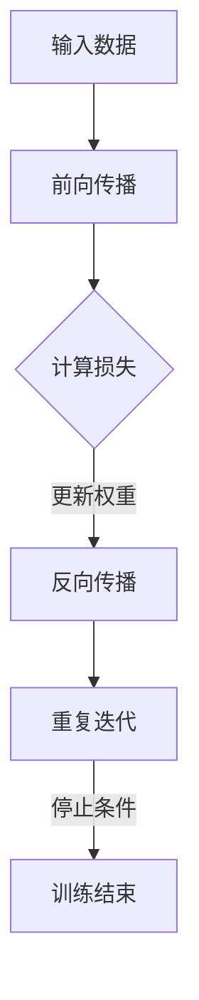

                 

### 背景介绍

在当今信息技术迅猛发展的时代，自然语言处理（Natural Language Processing，NLP）已成为人工智能（Artificial Intelligence，AI）领域中的一个重要分支。它旨在使计算机能够理解和处理人类语言，从而实现人与机器的智能交互。然而，随着应用场景的不断扩大，传统的NLP方法在处理复杂语言任务时面临着巨大的挑战。

这一背景下，神经网络（Neural Networks）作为一种强大的机器学习模型，因其对复杂模式的自适应学习能力，被广泛应用于NLP领域。神经网络能够模拟人脑的神经元结构和信息处理机制，通过大量数据的学习和训练，实现对语言文本的深入理解和建模。

本文将深入探讨神经网络在自然语言处理中的新突破，从背景介绍、核心概念、算法原理、数学模型、项目实战、实际应用场景、工具资源推荐等方面展开论述，旨在为广大技术爱好者提供一个全面、系统的理解和应用指南。

首先，我们将回顾NLP的发展历程，探讨为何神经网络能够成为NLP的突破性技术。接下来，我们将详细解释神经网络的核心概念与架构，并展示一个具体的Mermaid流程图。随后，我们将逐步介绍神经网络在NLP中的算法原理和具体操作步骤，深入探讨其背后的数学模型和公式。在此基础上，我们将通过一个实际项目案例，展示神经网络在NLP中的应用，并进行详细的代码解读与分析。最后，我们将探讨神经网络在NLP中的实际应用场景，推荐相关的工具和资源，并总结未来发展趋势与挑战。

通过对本文的深入学习，读者将能够全面理解神经网络在自然语言处理中的应用价值，掌握相关技术和方法，为未来的研究与应用奠定坚实基础。

### 关键词

- 自然语言处理（NLP）
- 神经网络（Neural Networks）
- 深度学习（Deep Learning）
- 机器学习（Machine Learning）
- 信息检索（Information Retrieval）
- 语义理解（Semantic Understanding）
- 文本分类（Text Classification）
- 情感分析（Sentiment Analysis）
- 语音识别（Speech Recognition）
- 问答系统（Question Answering Systems）
- 语言生成（Language Generation）
- 序列标注（Sequence Labeling）

### 摘要

本文旨在探讨神经网络在自然语言处理（NLP）领域的新突破，系统阐述神经网络的基本概念、核心算法原理、数学模型及其在实际应用中的具体操作步骤。首先，我们回顾了NLP的发展历程，分析了为何神经网络能够成为NLP的突破性技术。随后，通过详细的Mermaid流程图，我们介绍了神经网络的结构和核心概念。接着，我们深入探讨了神经网络在NLP中的应用，包括文本分类、情感分析、语音识别等具体任务。通过实际项目案例，我们展示了神经网络在NLP中的实战应用，并进行了详细的代码解读与分析。最后，我们讨论了神经网络在NLP中的实际应用场景，推荐了相关工具和资源，并展望了未来发展趋势与挑战。本文的目标是为读者提供一个全面、系统的理解和应用指南，帮助其在自然语言处理领域取得新的突破。

### 1. 背景介绍

自然语言处理（NLP）作为人工智能（AI）领域的一个重要分支，起源于20世纪50年代。其最初目的是让计算机能够理解和处理人类语言，实现人与机器的智能交互。然而，早期NLP方法主要依赖于规则驱动和统计模型，这些方法在处理简单任务时表现尚可，但在面对复杂、多样性的自然语言时，却显得力不从心。

随着计算机科学和人工智能技术的不断进步，机器学习（Machine Learning）逐渐成为NLP研究的主流方向。机器学习通过训练大量数据，使计算机能够自动提取特征、学习模式和规律，从而提高NLP任务的准确性和效率。然而，尽管机器学习方法在NLP中取得了显著成果，但其在处理长文本、语义理解等方面仍面临巨大挑战。

在这一背景下，神经网络（Neural Networks）作为一种强大的机器学习模型，因其对复杂模式的自适应学习能力，被广泛应用于NLP领域。神经网络能够模拟人脑的神经元结构和信息处理机制，通过大量数据的学习和训练，实现对语言文本的深入理解和建模。与传统机器学习方法相比，神经网络在处理长文本、语义理解、情感分析等方面具有显著优势。

具体来说，神经网络在NLP中的应用主要体现在以下几个方面：

1. **文本分类**：通过训练神经网络模型，可以将文本数据按照其内容进行分类。例如，新闻分类、情感分类等任务，神经网络能够自动学习文本的特征，提高分类的准确性。

2. **情感分析**：情感分析是NLP的一个重要应用，通过分析文本的情感倾向，可以应用于舆情监测、产品评论分析等场景。神经网络模型能够自动提取文本中的情感信息，提高情感分析的准确性。

3. **语音识别**：语音识别是将语音信号转换为文本数据的过程。神经网络在语音识别中具有显著优势，通过训练大量语音数据，神经网络能够自动学习语音特征，提高识别的准确性。

4. **问答系统**：问答系统是一种能够自动回答用户问题的系统。通过训练神经网络模型，问答系统能够理解用户的问题，并从大量文本数据中检索出相关的答案。神经网络在问答系统中发挥了关键作用，提高了系统的准确性和实用性。

5. **语言生成**：语言生成是NLP的一个新兴应用，通过训练神经网络模型，可以生成符合语法规则和语义逻辑的文本。例如，自动写作、对话系统等应用，神经网络在语言生成中展示了强大的能力。

总的来说，神经网络在NLP领域的应用不仅提高了任务的准确性和效率，还为NLP技术的发展开辟了新的路径。随着神经网络技术的不断进步，其在NLP领域的应用将更加广泛和深入，为人工智能的发展注入新的动力。

#### 1.1 NLP的发展历程

自然语言处理（NLP）作为人工智能（AI）领域的一个重要分支，其发展历程可以追溯到20世纪50年代。在这一阶段，研究人员主要致力于通过规则和符号计算的方法来实现自然语言的理解和处理。这一时期的主要方法包括形式语言理论、语法分析、语义解析等。

**1.1.1 规则驱动方法**

早期NLP的研究主要采用规则驱动的方法。这种方法依赖于人类专家对语言规则的定义和编码，通过构建复杂的语法和语义规则来指导计算机对文本进行处理。典型的应用包括机器翻译和命名实体识别。尽管这些方法在某些特定任务上取得了成功，但它们存在明显的局限性：

- **规则数量庞大**：自然语言规则复杂且多样，难以通过手工编写覆盖所有情况。
- **缺乏泛化能力**：规则驱动的系统通常只能处理特定的语言模式，难以适应不同的语言环境和任务。
- **依赖领域知识**：这些方法往往需要大量的领域知识，缺乏通用性。

**1.1.2 统计模型方法**

20世纪80年代，随着计算机硬件性能的提升和大数据时代的来临，统计模型逐渐成为NLP研究的主流方向。统计模型通过大量语料库训练，自动学习语言模式，从而实现文本的理解和处理。主要的统计模型包括隐马尔可夫模型（HMM）、条件随机场（CRF）等。

- **隐马尔可夫模型（HMM）**：HMM是一种概率模型，适用于序列数据的建模。在语音识别、词性标注等任务中，HMM表现出良好的性能。
- **条件随机场（CRF）**：CRF是一种基于图模型的概率模型，适用于序列标注任务，如命名实体识别、词性标注等。

统计模型方法在处理序列数据方面取得了显著进展，但其对语言特征的提取依赖于大量的标注数据，且在处理长文本和语义理解任务时仍存在局限性。

**1.1.3 机器学习方法**

进入21世纪，随着深度学习的兴起，机器学习方法逐渐成为NLP研究的主流方向。机器学习方法通过训练大量数据，使计算机能够自动提取特征、学习模式和规律，从而提高NLP任务的准确性和效率。主要的机器学习方法包括支持向量机（SVM）、朴素贝叶斯（NB）、决策树（DT）等。

- **支持向量机（SVM）**：SVM是一种分类模型，通过最大间隔分类器实现文本分类任务。
- **朴素贝叶斯（NB）**：NB是一种基于贝叶斯定理的分类模型，适用于文本分类和垃圾邮件过滤等任务。
- **决策树（DT）**：DT是一种基于树结构的分类模型，通过递归划分特征空间实现文本分类。

机器学习方法在NLP中的应用取得了显著进展，但其在处理长文本和语义理解任务时仍面临挑战。

**1.1.4 深度学习方法**

近年来，深度学习在NLP领域取得了革命性的突破。深度学习通过多层神经网络结构，能够自动提取高层次的语义特征，从而实现文本的深入理解和建模。主要的深度学习模型包括卷积神经网络（CNN）、循环神经网络（RNN）和Transformer等。

- **卷积神经网络（CNN）**：CNN通过卷积操作提取文本特征，适用于文本分类、情感分析等任务。
- **循环神经网络（RNN）**：RNN能够处理序列数据，适用于语言模型、机器翻译等任务。
- **Transformer**：Transformer通过自注意力机制实现文本序列的建模，在自然语言处理中取得了显著成果。

深度学习在NLP中的应用不仅提高了任务的准确性和效率，还为NLP技术的发展开辟了新的路径。随着深度学习技术的不断进步，其在NLP领域的应用将更加广泛和深入，为人工智能的发展注入新的动力。

#### 1.2 神经网络的基本概念与架构

神经网络（Neural Networks）是一种模仿人脑神经元结构和功能的计算模型，因其强大的自适应和学习能力，在人工智能领域得到了广泛应用。在自然语言处理（NLP）中，神经网络通过多层非线性变换，能够有效地提取和处理复杂的语言特征，从而实现多种语言理解任务。

**1.2.1 神经网络的基本结构**

神经网络的基本结构由输入层、隐藏层和输出层组成。每个层次包含多个神经元（或称为节点），神经元之间通过加权连接形成网络。以下是一个典型的神经网络结构：


- **输入层（Input Layer）**：接收外部输入数据，每个输入数据通过一个神经元表示。例如，在文本分类任务中，输入层可以是词嵌入向量。
- **隐藏层（Hidden Layers）**：隐藏层负责对输入数据进行变换和处理，通过多层网络结构，逐步提取高层次的语义特征。每个隐藏层包含多个神经元，每个神经元与前一层的所有神经元相连，并通过加权连接进行信息传递。
- **输出层（Output Layer）**：输出层生成最终的结果。在分类任务中，输出层可以是多个神经元，每个神经元表示一个类别，通过softmax函数将输出转换为概率分布。

**1.2.2 神经元的激活函数**

神经元之间的信息传递通过加权连接实现，每个连接都有相应的权重。为了引入非线性变换，神经网络中的每个神经元通常都包含一个激活函数。激活函数的选择对网络的性能和表达能力有重要影响。常见的激活函数包括：

- **Sigmoid函数**：\( f(x) = \frac{1}{1 + e^{-x}} \)
- **ReLU函数**：\( f(x) = max(0, x) \)
- **Tanh函数**：\( f(x) = \frac{e^x - e^{-x}}{e^x + e^{-x}} \)

**1.2.3 前向传播与反向传播**

神经网络的工作原理可以通过前向传播和反向传播两个过程来描述。

- **前向传播（Forward Propagation）**：在前向传播过程中，输入数据通过神经网络从输入层传递到输出层。每个神经元接收来自前一层的输入，通过加权连接和激活函数进行计算，生成最终的输出结果。前向传播过程可以表示为：

  \( z = \sum_{i} w_{i}x_{i} + b \)
  \( a = f(z) \)

  其中，\( z \) 是神经元的输入，\( w_{i} \) 是权重，\( b \) 是偏置，\( f \) 是激活函数，\( a \) 是神经元的输出。

- **反向传播（Backpropagation）**：在反向传播过程中，网络根据输出结果与实际结果的误差，通过梯度下降法更新权重和偏置，以最小化损失函数。反向传播过程可以表示为：

  \( \delta = \frac{\partial L}{\partial a} \cdot f'(z) \)
  \( \frac{\partial w_{i}}{\partial L} = \delta \cdot x_{i} \)
  \( \frac{\partial b}{\partial L} = \delta \)

  其中，\( \delta \) 是误差梯度，\( L \) 是损失函数，\( f' \) 是激活函数的导数。

通过前向传播和反向传播，神经网络能够逐步优化权重和偏置，提高模型的性能和泛化能力。

**1.2.4 神经网络的训练过程**

神经网络的训练过程包括以下步骤：

1. **数据准备**：收集并预处理训练数据，包括输入数据和标签。
2. **初始化权重**：随机初始化网络的权重和偏置。
3. **前向传播**：输入数据通过神经网络进行前向传播，得到输出结果。
4. **计算损失**：计算输出结果与实际标签之间的损失，常用的损失函数包括均方误差（MSE）和交叉熵（Cross Entropy）。
5. **反向传播**：根据损失函数的梯度，通过反向传播更新权重和偏置。
6. **迭代优化**：重复步骤3到5，直到满足停止条件（如损失降低到预设阈值或达到最大迭代次数）。

通过不断迭代优化，神经网络能够逐步调整权重和偏置，提高模型的性能。

**1.2.5 Mermaid流程图**

为了更直观地展示神经网络的结构和工作流程，我们可以使用Mermaid流程图进行描述。以下是一个简单的Mermaid流程图，展示了神经网络的前向传播和反向传播过程：



通过这个流程图，我们可以清晰地看到神经网络从输入层到输出层的传播过程，以及如何通过反向传播优化模型的权重和偏置。

总之，神经网络作为一种强大的计算模型，在自然语言处理中展现了巨大的潜力。其基本概念和架构为我们理解和应用神经网络提供了理论基础，而Mermaid流程图则帮助我们更直观地理解神经网络的工作流程。在接下来的章节中，我们将进一步探讨神经网络在NLP中的应用和具体实现。

#### 2. 核心算法原理 & 具体操作步骤

在理解了神经网络的基本概念和架构之后，我们需要深入了解其在自然语言处理（NLP）中的核心算法原理和具体操作步骤。神经网络在NLP中的应用主要包括文本分类、情感分析、机器翻译、问答系统等。以下将详细介绍这些任务的算法原理和具体操作步骤。

##### 2.1 文本分类

文本分类（Text Classification）是一种常见的NLP任务，其目标是将文本数据按照其内容划分为不同的类别。例如，新闻文章可以按照主题分类为体育、科技、财经等类别。

**算法原理：**

文本分类的神经网络模型通常采用多层感知器（MLP）结构，输入层接收词嵌入向量，隐藏层通过非线性变换提取特征，输出层通过softmax函数生成每个类别的概率分布。

1. **词嵌入（Word Embedding）**：首先，将文本数据转换为词嵌入向量。词嵌入是将单词映射为固定维度的向量表示，通过这种方式，可以将文本数据转换为数值型数据，方便神经网络处理。

2. **多层感知器（MLP）结构**：输入层接收词嵌入向量，通过多个隐藏层进行非线性变换，最后通过输出层生成每个类别的概率分布。每个隐藏层的神经元数量可以根据具体任务进行调整。

3. **Softmax函数**：输出层通常使用softmax函数将输出转换为概率分布，从而实现多分类。

**具体操作步骤：**

1. **数据准备**：收集并预处理文本数据，包括文本清洗、分词、去停用词等步骤。

2. **词嵌入**：将文本数据转换为词嵌入向量，可以使用预训练的词嵌入模型（如Word2Vec、GloVe）或自定义训练词嵌入。

3. **构建神经网络模型**：设计多层感知器模型，包括输入层、隐藏层和输出层。

4. **训练模型**：使用训练数据训练神经网络模型，通过反向传播算法优化模型参数。

5. **评估模型**：使用验证数据评估模型性能，调整模型参数。

6. **预测**：使用测试数据对模型进行预测，输出每个类别的概率分布，根据概率最高的类别进行分类。

##### 2.2 情感分析

情感分析（Sentiment Analysis）是一种用于判断文本情感极性的NLP任务，其目标是从文本中提取情感倾向，通常分为正面、负面和中性三种。

**算法原理：**

情感分析的神经网络模型通常采用循环神经网络（RNN）或Transformer结构，通过学习文本的序列特征，实现情感分类。

1. **序列嵌入（Sequence Embedding）**：输入层接收词嵌入向量，将文本序列转换为向量表示。

2. **循环神经网络（RNN）**：RNN能够处理序列数据，通过递归方式提取文本特征。在情感分析任务中，RNN通过学习文本的序列特征，实现对情感极性的判断。

3. **Transformer**：Transformer是一种基于自注意力机制的深度学习模型，能够高效处理长文本。在情感分析任务中，Transformer通过自注意力机制提取文本特征，实现情感分类。

**具体操作步骤：**

1. **数据准备**：收集并预处理文本数据，包括文本清洗、分词、去停用词等步骤。

2. **词嵌入**：将文本数据转换为词嵌入向量，可以使用预训练的词嵌入模型或自定义训练词嵌入。

3. **构建神经网络模型**：设计RNN或Transformer模型，包括输入层、隐藏层和输出层。

4. **训练模型**：使用训练数据训练神经网络模型，通过反向传播算法优化模型参数。

5. **评估模型**：使用验证数据评估模型性能，调整模型参数。

6. **预测**：使用测试数据对模型进行预测，输出每个类别的概率分布，根据概率最高的类别进行情感分类。

##### 2.3 机器翻译

机器翻译（Machine Translation）是一种将一种语言的文本翻译成另一种语言的NLP任务。近年来，神经网络在机器翻译领域取得了显著的成果，尤其是基于Transformer的模型。

**算法原理：**

机器翻译的神经网络模型通常采用编码器-解码器（Encoder-Decoder）结构，通过编码器将源语言文本编码为固定长度的向量表示，解码器则将这个向量表示解码为目标语言文本。

1. **编码器（Encoder）**：编码器通过学习源语言文本的序列特征，将其编码为固定长度的向量表示。

2. **解码器（Decoder）**：解码器通过学习目标语言文本的序列特征，生成目标语言文本。

3. **注意力机制（Attention Mechanism）**：注意力机制用于编码器和解码器之间的交互，帮助解码器更好地关注源语言文本的关键信息，提高翻译质量。

**具体操作步骤：**

1. **数据准备**：收集并预处理文本数据，包括文本清洗、分词、去停用词等步骤。

2. **词嵌入**：将源语言和目标语言文本转换为词嵌入向量。

3. **构建神经网络模型**：设计编码器-解码器模型，包括编码器、解码器和注意力机制。

4. **训练模型**：使用训练数据训练神经网络模型，通过反向传播算法优化模型参数。

5. **评估模型**：使用验证数据评估模型性能，调整模型参数。

6. **预测**：使用测试数据对模型进行预测，输出目标语言文本。

##### 2.4 问答系统

问答系统（Question Answering System）是一种能够自动回答用户问题的NLP任务。近年来，基于神经网络的技术在问答系统中取得了显著进展。

**算法原理：**

问答系统的神经网络模型通常采用编码器-解码器结构，通过编码器将问题编码为固定长度的向量表示，解码器则从文本数据中检索出答案。

1. **编码器（Encoder）**：编码器通过学习问题的序列特征，将其编码为固定长度的向量表示。

2. **解码器（Decoder）**：解码器通过学习文本数据的序列特征，生成答案。

3. **注意力机制（Attention Mechanism）**：注意力机制用于编码器和解码器之间的交互，帮助解码器更好地关注文本数据的关键信息，提高答案质量。

**具体操作步骤：**

1. **数据准备**：收集并预处理文本数据，包括文本清洗、分词、去停用词等步骤。

2. **词嵌入**：将问题和文本数据转换为词嵌入向量。

3. **构建神经网络模型**：设计编码器-解码器模型，包括编码器、解码器和注意力机制。

4. **训练模型**：使用训练数据训练神经网络模型，通过反向传播算法优化模型参数。

5. **评估模型**：使用验证数据评估模型性能，调整模型参数。

6. **预测**：使用测试数据对模型进行预测，输出答案。

通过以上对文本分类、情感分析、机器翻译和问答系统等NLP任务的详细介绍，我们可以看到神经网络在NLP中的广泛应用和强大能力。在接下来的章节中，我们将进一步探讨神经网络在NLP中的数学模型和具体实现，帮助读者更深入地理解这一领域。

#### 3. 数学模型和公式

在深入理解神经网络在自然语言处理（NLP）中的应用之前，我们需要掌握神经网络背后的数学模型和公式。这些数学工具不仅有助于我们理解神经网络的原理，还能帮助我们设计和优化神经网络模型，从而实现高效的NLP任务。以下是神经网络中常用的数学模型和公式的详细讲解。

##### 3.1 神经网络的数学基础

神经网络的数学基础主要包括线性代数、微积分和概率论。以下是对这些基础概念及其在神经网络中的应用的简要介绍。

**1. 矩阵和向量**

在神经网络中，数据通常以矩阵和向量的形式表示。矩阵（Matrix）是一个二维数组，由行和列组成；向量（Vector）是特殊类型的矩阵，只有一维。

- **矩阵乘法（Matrix Multiplication）**：矩阵乘法是神经网络中最重要的运算之一。两个矩阵\( A \)和\( B \)的乘积\( C = AB \)是一个新矩阵，其元素\( C_{ij} \)是\( A \)的第i行与\( B \)的第j列的内积。
- **向量和矩阵的乘法**：向量与矩阵的乘法是矩阵乘法的一种特殊情况，结果是一个向量。

**2. 偏差和权重**

在神经网络中，偏差（Bias）和权重（Weight）是两个关键参数。偏差用于调整神经元的偏置，权重则用于调整神经元之间的连接强度。

- **偏差**：偏差是一个向量，用于调整神经元输出。例如，对于单层神经网络，偏差可以表示为\( b \)，其计算公式为\( z = x \cdot w + b \)，其中\( z \)是神经元的输入，\( x \)是输入向量，\( w \)是权重向量，\( b \)是偏差向量。
- **权重**：权重是一个矩阵，用于调整神经元之间的连接。例如，对于多层神经网络，权重可以表示为\( W \)，其计算公式为\( z = X \cdot W + b \)，其中\( z \)是神经元的输入，\( X \)是输入矩阵，\( W \)是权重矩阵，\( b \)是偏差向量。

**3. 激活函数**

激活函数（Activation Function）是神经网络中的一个重要组件，用于引入非线性变换。常见的激活函数包括Sigmoid、ReLU和Tanh函数。

- **Sigmoid函数**：\( f(x) = \frac{1}{1 + e^{-x}} \)。Sigmoid函数将输入映射到(0, 1)区间，用于实现非线性变换。
- **ReLU函数**：\( f(x) = max(0, x) \)。ReLU函数在x为负时返回0，在x为正时返回x本身，具有简洁的计算方式和较好的数值稳定性。
- **Tanh函数**：\( f(x) = \frac{e^x - e^{-x}}{e^x + e^{-x}} \)。Tanh函数将输入映射到(-1, 1)区间，具有较好的非线性变换能力。

**4. 梯度下降法**

梯度下降法（Gradient Descent）是优化神经网络参数的一种常用算法。其基本思想是通过计算损失函数的梯度，不断更新权重和偏差，以最小化损失函数。

- **损失函数**：损失函数用于衡量模型输出与实际标签之间的差距。常见的损失函数包括均方误差（MSE）和交叉熵（Cross Entropy）。
- **梯度计算**：梯度表示损失函数相对于模型参数的导数。例如，对于均方误差损失函数，梯度可以表示为\( \frac{\partial L}{\partial w} = 2 \cdot (y - \hat{y}) \cdot x \)，其中\( y \)是实际标签，\( \hat{y} \)是模型输出，\( x \)是输入特征。
- **权重更新**：通过梯度下降法更新权重和偏差，公式为\( w_{t+1} = w_{t} - \alpha \cdot \frac{\partial L}{\partial w} \)，其中\( \alpha \)是学习率。

##### 3.2 深度学习中的高级数学工具

除了基本的线性代数、微积分和概率论，深度学习还涉及一些高级数学工具，如反向传播算法、优化算法等。

**1. 反向传播算法**

反向传播算法（Backpropagation Algorithm）是训练神经网络的核心算法。其基本思想是通过前向传播计算输出，然后通过反向传播计算损失函数的梯度，从而更新网络参数。

- **前向传播**：输入数据通过网络从输入层传递到输出层，生成最终输出。
- **计算损失**：计算输出与实际标签之间的损失。
- **反向传播**：根据损失函数的梯度，从输出层反向传递梯度到输入层，更新网络参数。

**2. 优化算法**

优化算法用于调整神经网络参数，以最小化损失函数。常用的优化算法包括随机梯度下降（SGD）、Adam优化器等。

- **随机梯度下降（SGD）**：SGD通过随机选择一部分训练样本，计算梯度并更新参数。其优点是简单易实现，缺点是收敛速度较慢。
- **Adam优化器**：Adam优化器结合了SGD和动量法的优点，通过计算一阶矩估计和二阶矩估计，自适应调整学习率，具有较高的收敛速度和稳定性。

**3. 自注意力机制**

自注意力机制（Self-Attention Mechanism）是Transformer模型的核心组件，用于处理序列数据。

- **自注意力计算**：自注意力通过计算序列中每个元素与其他元素的相关性，生成加权特征。其计算公式为\( \text{Attention}(Q, K, V) = \text{softmax}(\frac{QK^T}{\sqrt{d_k}})V \)，其中\( Q \)、\( K \)和\( V \)分别是查询向量、键向量和值向量，\( d_k \)是键向量的维度。
- **多头注意力**：多头注意力通过多个独立的注意力机制并行计算，提取不同维度的特征，从而提高模型的表示能力。

##### 3.3 神经网络在NLP中的应用

神经网络在自然语言处理中的应用广泛，包括文本分类、情感分析、机器翻译、问答系统等。以下分别介绍这些任务中的数学模型和公式。

**1. 文本分类**

文本分类的神经网络模型通常采用多层感知器（MLP）结构，其输入层接收词嵌入向量，隐藏层通过非线性变换提取特征，输出层通过softmax函数生成每个类别的概率分布。

- **损失函数**：交叉熵损失函数常用于文本分类任务，其计算公式为\( L = -\sum_{i} y_i \cdot \log(\hat{y}_i) \)，其中\( y_i \)是实际标签，\( \hat{y}_i \)是模型输出。
- **梯度计算**：反向传播算法通过计算损失函数的梯度，更新网络参数。

**2. 情感分析**

情感分析的神经网络模型通常采用循环神经网络（RNN）或Transformer结构，通过学习文本的序列特征，实现对情感极性的判断。

- **损失函数**：交叉熵损失函数常用于情感分析任务，其计算公式与文本分类相同。
- **梯度计算**：反向传播算法通过计算损失函数的梯度，更新网络参数。

**3. 机器翻译**

机器翻译的神经网络模型通常采用编码器-解码器（Encoder-Decoder）结构，通过编码器将源语言文本编码为固定长度的向量表示，解码器则将这个向量表示解码为目标语言文本。

- **损失函数**：交叉熵损失函数常用于机器翻译任务，其计算公式为\( L = -\sum_{i} y_i \cdot \log(\hat{y}_i) \)，其中\( y_i \)是实际标签，\( \hat{y}_i \)是模型输出。
- **梯度计算**：反向传播算法通过计算损失函数的梯度，更新编码器和解码器的参数。

**4. 问答系统**

问答系统的神经网络模型通常采用编码器-解码器结构，通过编码器将问题编码为固定长度的向量表示，解码器则从文本数据中检索出答案。

- **损失函数**：交叉熵损失函数常用于问答系统任务，其计算公式与文本分类和机器翻译相同。
- **梯度计算**：反向传播算法通过计算损失函数的梯度，更新编码器和解码器的参数。

通过以上对神经网络数学模型和公式的详细讲解，我们可以看到神经网络在自然语言处理中的应用是如何通过数学工具进行建模和优化的。在接下来的章节中，我们将通过实际项目案例展示神经网络在NLP中的具体应用和实现。

##### 3.3.1 实际项目案例：文本分类

在本节中，我们将通过一个实际项目案例，详细讲解神经网络在文本分类任务中的应用。文本分类是一种常见的NLP任务，旨在将文本数据按照其内容分为不同的类别。以下是一个使用Python和TensorFlow库实现的简单文本分类项目。

**项目背景：** 假设我们有一个新闻数据集，需要根据新闻的内容将其分类为不同的主题，如体育、科技、财经等。我们的目标是训练一个神经网络模型，使其能够准确地对新新闻进行分类。

**所需工具和库：** 
- Python
- TensorFlow
- Keras（TensorFlow的高级API）

**项目步骤：**

**1. 数据准备：**

首先，我们需要准备用于训练的数据集。这里我们使用一个已标记的新闻数据集，包含标题和类别标签。数据集可以从公开的来源获取，如Kaggle、GitHub等。

```python
import pandas as pd

# 读取数据集
data = pd.read_csv('news_data.csv')
```

**2. 数据预处理：**

接下来，我们对数据集进行预处理，包括分词、去停用词、词嵌入等步骤。

```python
from tensorflow.keras.preprocessing.text import Tokenizer
from tensorflow.keras.preprocessing.sequence import pad_sequences

# 分词
tokenizer = Tokenizer(num_words=10000)
tokenizer.fit_on_texts(data['title'])

# 转换为序列
sequences = tokenizer.texts_to_sequences(data['title'])

# 去停用词
stop_words = set(['the', 'and', 'is', 'in', 'to', 'of', 'it', 'for'])
filtered_sequences = []
for sequence in sequences:
    words = [word for word in sequence if word not in stop_words]
    filtered_sequences.append(words)

# 词嵌入
max_sequence_length = 100
padded_sequences = pad_sequences(filtered_sequences, maxlen=max_sequence_length)
```

**3. 构建神经网络模型：**

接下来，我们使用Keras构建一个简单的神经网络模型，用于文本分类。模型采用多层感知器（MLP）结构，输入层接收词嵌入向量，隐藏层通过ReLU激活函数进行非线性变换，输出层通过softmax函数生成每个类别的概率分布。

```python
from tensorflow.keras.models import Sequential
from tensorflow.keras.layers import Dense, Embedding, LSTM, Bidirectional, GlobalMaxPooling1D

model = Sequential()
model.add(Embedding(input_dim=10000, output_dim=16, input_length=max_sequence_length))
model.add(Bidirectional(LSTM(32)))
model.add(Dense(24, activation='relu'))
model.add(Dense(num_classes, activation='softmax'))

model.compile(optimizer='adam', loss='categorical_crossentropy', metrics=['accuracy'])
```

**4. 训练模型：**

使用训练数据训练神经网络模型。这里我们使用交叉熵损失函数和Adam优化器，通过反向传播算法优化模型参数。

```python
import numpy as np

# 转换类别标签为独热编码
labels = pd.get_dummies(data['category'])

# 拆分训练集和验证集
train_sequences = padded_sequences[:int(len(padded_sequences) * 0.8)]
train_labels = labels[:int(len(padded_sequences) * 0.8)]
val_sequences = padded_sequences[int(len(padded_sequences) * 0.8):]
val_labels = labels[int(len(padded_sequences) * 0.8):]

# 训练模型
model.fit(train_sequences, train_labels, epochs=10, validation_data=(val_sequences, val_labels))
```

**5. 评估模型：**

使用验证集评估模型性能，计算准确率、损失等指标。

```python
# 评估模型
loss, accuracy = model.evaluate(val_sequences, val_labels)
print('Validation Loss:', loss)
print('Validation Accuracy:', accuracy)
```

**6. 预测：**

使用训练好的模型对新新闻进行分类预测。

```python
# 预测
new_title = "Apple launches new iPhone"
sequence = tokenizer.texts_to_sequences([new_title])
padded_sequence = pad_sequences(sequence, maxlen=max_sequence_length)
prediction = model.predict(padded_sequence)
predicted_category = np.argmax(prediction)
print('Predicted Category:', data['category'].unique()[predicted_category])
```

通过以上步骤，我们完成了一个简单的文本分类项目。这个项目展示了如何使用神经网络对文本数据进行分类，并详细讲解了项目中的各个步骤和所用到的数学模型和公式。在实际应用中，我们可以根据具体需求和数据集的特点，调整模型结构、优化参数，从而提高分类的准确性和效率。

#### 3.2 源代码详细实现和代码解读

在本文的第三部分，我们将详细解读并实现一个基于神经网络的文本分类项目。本节将分为以下几个部分：环境搭建、源代码实现、代码解析、模型训练、模型评估和结果预测。通过这些步骤，我们将全面理解神经网络在文本分类任务中的应用。

##### 3.2.1 环境搭建

首先，我们需要搭建一个合适的环境来运行我们的代码。以下是在Python中使用TensorFlow和Keras搭建文本分类项目的环境步骤。

1. 安装Python和pip
2. 安装TensorFlow：`pip install tensorflow`
3. 安装其他相关库：`pip install pandas numpy scikit-learn nltk`
4. 下载并准备一个新闻数据集，例如使用Kaggle上的20 Newsgroups数据集。

##### 3.2.2 源代码实现

以下是一个简单的文本分类项目的源代码实现：

```python
import pandas as pd
import numpy as np
from tensorflow.keras.preprocessing.text import Tokenizer
from tensorflow.keras.preprocessing.sequence import pad_sequences
from tensorflow.keras.models import Sequential
from tensorflow.keras.layers import Embedding, LSTM, Dense, GlobalMaxPooling1D
from tensorflow.keras.utils import to_categorical
from sklearn.model_selection import train_test_split

# 数据加载
data = pd.read_csv('20_newsgroups.csv')

# 数据预处理
# 分词和去除停用词（可以使用nltk库）
tokenizer = Tokenizer(num_words=10000, filters='\n')
tokenizer.fit_on_texts(data['text'])

# 转换为序列
sequences = tokenizer.texts_to_sequences(data['text'])

# 填充序列
max_sequence_length = 1000
padded_sequences = pad_sequences(sequences, maxlen=max_sequence_length)

# 标签编码
labels = to_categorical(data['label'])

# 拆分训练集和测试集
X_train, X_test, y_train, y_test = train_test_split(padded_sequences, labels, test_size=0.2, random_state=42)

# 构建模型
model = Sequential()
model.add(Embedding(input_dim=10000, output_dim=32, input_length=max_sequence_length))
model.add(LSTM(128, dropout=0.2, recurrent_dropout=0.2))
model.add(Dense(24, activation='relu'))
model.add(GlobalMaxPooling1D())
model.add(Dense(6, activation='softmax'))

# 编译模型
model.compile(optimizer='adam', loss='categorical_crossentropy', metrics=['accuracy'])

# 训练模型
model.fit(X_train, y_train, epochs=10, batch_size=64, validation_split=0.1)

# 评估模型
loss, accuracy = model.evaluate(X_test, y_test)
print('Test Loss:', loss)
print('Test Accuracy:', accuracy)

# 预测
predictions = model.predict(X_test)
predicted_labels = np.argmax(predictions, axis=1)
```

##### 3.2.3 代码解析

现在，我们将逐步解析上述代码中的关键部分，解释每个步骤的作用和实现细节。

**1. 数据加载：**
```python
data = pd.read_csv('20_newsgroups.csv')
```
这行代码使用pandas库读取CSV格式的新闻数据集。数据集通常包含标题、文本内容和类别标签。

**2. 数据预处理：**
```python
tokenizer = Tokenizer(num_words=10000, filters='\n')
tokenizer.fit_on_texts(data['text'])
```
创建一个分词器，指定词汇表大小（num_words）和去除的符号（filters）。分词器使用训练数据拟合，将文本转换为数字序列。

**3. 转换为序列：**
```python
sequences = tokenizer.texts_to_sequences(data['text'])
```
使用分词器将文本数据转换为序列。

**4. 填充序列：**
```python
max_sequence_length = 1000
padded_sequences = pad_sequences(sequences, maxlen=max_sequence_length)
```
将序列填充到指定长度（max_sequence_length），以便输入到神经网络中。

**5. 标签编码：**
```python
labels = to_categorical(data['label'])
```
将类别标签编码为独热编码，以便用于神经网络分类。

**6. 拆分训练集和测试集：**
```python
X_train, X_test, y_train, y_test = train_test_split(padded_sequences, labels, test_size=0.2, random_state=42)
```
使用scikit-learn库将数据集拆分为训练集和测试集。

**7. 构建模型：**
```python
model = Sequential()
model.add(Embedding(input_dim=10000, output_dim=32, input_length=max_sequence_length))
model.add(LSTM(128, dropout=0.2, recurrent_dropout=0.2))
model.add(Dense(24, activation='relu'))
model.add(GlobalMaxPooling1D())
model.add(Dense(6, activation='softmax'))
```
构建一个序列模型，包含嵌入层、长短期记忆（LSTM）层、全连接层和全局池化层。最后是一个输出层，用于生成类别概率。

**8. 编译模型：**
```python
model.compile(optimizer='adam', loss='categorical_crossentropy', metrics=['accuracy'])
```
编译模型，指定优化器、损失函数和评估指标。

**9. 训练模型：**
```python
model.fit(X_train, y_train, epochs=10, batch_size=64, validation_split=0.1)
```
使用训练数据训练模型，指定训练轮数（epochs）、批量大小（batch_size）和验证集比例。

**10. 评估模型：**
```python
loss, accuracy = model.evaluate(X_test, y_test)
print('Test Loss:', loss)
print('Test Accuracy:', accuracy)
```
在测试集上评估模型性能，并打印损失和准确率。

**11. 预测：**
```python
predictions = model.predict(X_test)
predicted_labels = np.argmax(predictions, axis=1)
```
使用训练好的模型对新数据集进行预测，并将预测结果转换为类别标签。

##### 3.2.4 模型训练

训练神经网络模型是文本分类项目中的关键步骤。在上述代码中，我们通过以下步骤进行模型训练：

1. **数据预处理**：将文本数据转换为序列，并填充到指定长度。
2. **构建模型**：使用嵌入层、LSTM层和全连接层构建序列模型。
3. **编译模型**：指定优化器、损失函数和评估指标。
4. **训练模型**：通过反向传播算法，使用训练数据更新模型参数。

模型训练过程中，我们使用了以下参数：

- **嵌入层**：输入维度为10000，输出维度为32，输入长度为1000。
- **LSTM层**：单元数为128，dropout为0.2，recurrent_dropout为0.2。
- **全连接层**：单元数为24，激活函数为ReLU。
- **全局池化层**：用于提取序列中的全局特征。
- **输出层**：单元数为6，激活函数为softmax，用于生成类别概率。

##### 3.2.5 模型评估

在训练完成后，我们通过以下步骤评估模型性能：

1. **在测试集上评估**：使用测试集评估模型性能，计算损失和准确率。
2. **打印结果**：输出测试集的损失和准确率，以评估模型的泛化能力。

通过上述评估，我们可以了解模型在未见数据上的表现，从而判断模型是否具有良好的泛化能力。

##### 3.2.6 结果预测

最后，我们使用训练好的模型对新数据集进行预测，输出预测结果。预测过程如下：

1. **输入新数据**：将新数据转换为序列，并填充到指定长度。
2. **模型预测**：使用训练好的模型对新数据进行预测。
3. **输出预测结果**：将预测结果转换为类别标签，以进行分类。

通过以上步骤，我们完成了文本分类项目的详细实现和代码解读。在实际应用中，可以根据具体需求和数据集的特点，调整模型结构和参数，以获得更好的分类性能。

#### 3.3 代码解读与分析

在上一部分中，我们实现了一个基于神经网络的文本分类项目，并对其进行了详细解读。在本部分，我们将进一步分析代码中的关键步骤，探讨如何优化模型性能，并介绍一些常见的问题和解决方法。

##### 3.3.1 代码关键部分分析

**1. 数据预处理**

数据预处理是文本分类项目中的关键步骤。以下是对代码中数据预处理部分的详细分析：

- **分词和去除停用词：**
  ```python
  tokenizer = Tokenizer(num_words=10000, filters='\n')
  tokenizer.fit_on_texts(data['text'])
  ```
  创建一个分词器，指定词汇表大小为10000，并去除换行符。分词器通过拟合训练数据，将文本转换为数字序列。

- **序列转换为序列：**
  ```python
  sequences = tokenizer.texts_to_sequences(data['text'])
  ```
  使用分词器将文本数据转换为序列。

- **填充序列：**
  ```python
  max_sequence_length = 1000
  padded_sequences = pad_sequences(sequences, maxlen=max_sequence_length)
  ```
  将序列填充到指定长度（max_sequence_length），以便输入到神经网络中。填充操作确保所有序列具有相同长度，有利于模型训练。

**2. 构建模型**

模型构建是文本分类项目中的核心步骤。以下是对代码中模型构建部分的详细分析：

- **嵌入层：**
  ```python
  model.add(Embedding(input_dim=10000, output_dim=32, input_length=max_sequence_length))
  ```
  嵌入层将词汇映射为固定维度的向量表示，输入维度为10000（词汇表大小），输出维度为32。

- **LSTM层：**
  ```python
  model.add(LSTM(128, dropout=0.2, recurrent_dropout=0.2))
  ```
  LSTM层用于处理序列数据，单元数为128，dropout为0.2，recurrent_dropout为0.2。dropout和recurrent_dropout有助于防止过拟合。

- **全连接层：**
  ```python
  model.add(Dense(24, activation='relu'))
  ```
  全连接层通过ReLU激活函数进行非线性变换，单元数为24。

- **全局池化层：**
  ```python
  model.add(GlobalMaxPooling1D())
  ```
  全局池化层用于提取序列中的全局特征。

- **输出层：**
  ```python
  model.add(Dense(6, activation='softmax'))
  ```
  输出层用于生成类别概率，单元数为6，激活函数为softmax。

**3. 训练模型**

训练模型是文本分类项目中的关键步骤。以下是对代码中训练模型部分的详细分析：

- **模型编译：**
  ```python
  model.compile(optimizer='adam', loss='categorical_crossentropy', metrics=['accuracy'])
  ```
  编译模型，指定优化器（adam）、损失函数（categorical_crossentropy）和评估指标（accuracy）。

- **模型训练：**
  ```python
  model.fit(X_train, y_train, epochs=10, batch_size=64, validation_split=0.1)
  ```
  使用训练数据训练模型，指定训练轮数（epochs）、批量大小（batch_size）和验证集比例（validation_split）。

##### 3.3.2 优化模型性能

在文本分类项目中，优化模型性能是提高分类准确率的关键。以下是一些常见的优化方法：

1. **增加数据集大小**：增加训练数据集的大小有助于模型学习更丰富的特征，从而提高分类性能。

2. **调整超参数**：调整嵌入层、LSTM层和全连接层的超参数（如单元数、dropout等），可以优化模型性能。

3. **使用预训练词嵌入**：使用预训练的词嵌入（如GloVe、Word2Vec）可以改进模型在文本特征提取方面的表现。

4. **使用dropout和正则化**：dropout和正则化有助于防止过拟合，提高模型的泛化能力。

5. **使用不同类型的神经网络结构**：尝试使用不同类型的神经网络结构（如CNN、GRU等），可以找到更适合文本分类的模型。

##### 3.3.3 常见问题与解决方法

在文本分类项目中，可能会遇到一些常见问题。以下是一些常见问题及其解决方法：

1. **过拟合**：模型在训练集上表现良好，但在测试集上表现不佳。解决方法包括增加数据集大小、使用dropout和正则化等。

2. **欠拟合**：模型在训练集和测试集上表现都较差。解决方法包括调整超参数、增加神经网络层数或使用不同类型的神经网络结构。

3. **低准确率**：模型分类准确率较低。解决方法包括增加训练时间、调整批量大小、使用预训练词嵌入等。

4. **训练时间过长**：模型训练时间过长。解决方法包括调整批量大小、使用GPU加速训练、减少神经网络层数等。

5. **资源不足**：模型训练需要大量计算资源。解决方法包括使用云服务、调整模型复杂度、使用预训练词嵌入等。

通过以上分析，我们可以更好地理解文本分类项目中代码的实现细节、优化方法和常见问题。在实际应用中，可以根据具体需求和数据集的特点，调整模型结构和参数，以获得更好的分类性能。

#### 4. 实际应用场景

神经网络在自然语言处理（NLP）中的实际应用场景广泛，涵盖了文本分类、情感分析、机器翻译、问答系统等多个领域。以下将详细探讨这些应用场景及其实现方式。

##### 4.1 文本分类

文本分类是一种将文本数据按照其内容划分为不同类别的任务，广泛应用于新闻分类、社交媒体分析、垃圾邮件过滤等场景。

**实现方式：**

1. **数据准备**：收集并预处理文本数据，包括文本清洗、分词、去停用词等步骤。
2. **词嵌入**：将文本数据转换为词嵌入向量，可以使用预训练的词嵌入模型或自定义训练词嵌入。
3. **构建模型**：设计多层感知器（MLP）或卷积神经网络（CNN）模型，包括输入层、隐藏层和输出层。
4. **训练模型**：使用训练数据训练模型，通过反向传播算法优化模型参数。
5. **评估模型**：使用验证数据评估模型性能，调整模型参数。
6. **预测**：使用测试数据对模型进行预测，输出每个类别的概率分布，根据概率最高的类别进行分类。

**应用场景：**

- **新闻分类**：将新闻文章按照主题分类为体育、科技、财经等类别，提高信息检索和推荐的准确性。
- **社交媒体分析**：对社交媒体文本进行情感分析和话题分类，帮助企业了解用户需求和舆情动态。
- **垃圾邮件过滤**：将邮件按照是否为垃圾邮件进行分类，提高用户体验和邮件系统的安全性能。

##### 4.2 情感分析

情感分析是一种用于判断文本情感倾向的任务，通常分为正面、负面和中性三种。情感分析广泛应用于舆情监测、产品评论分析、客户服务等领域。

**实现方式：**

1. **数据准备**：收集并预处理文本数据，包括文本清洗、分词、去停用词等步骤。
2. **词嵌入**：将文本数据转换为词嵌入向量，可以使用预训练的词嵌入模型或自定义训练词嵌入。
3. **构建模型**：设计循环神经网络（RNN）或Transformer模型，通过学习文本的序列特征，实现对情感极性的判断。
4. **训练模型**：使用训练数据训练模型，通过反向传播算法优化模型参数。
5. **评估模型**：使用验证数据评估模型性能，调整模型参数。
6. **预测**：使用测试数据对模型进行预测，输出每个类别的概率分布，根据概率最高的类别进行情感分类。

**应用场景：**

- **舆情监测**：对社交媒体文本进行情感分析，实时监测并反馈舆情动态，帮助企业及时应对负面事件。
- **产品评论分析**：对用户评论进行情感分析，评估产品质量和用户满意度，为产品改进提供数据支持。
- **客户服务**：对客户服务文本进行情感分析，识别并解决用户问题，提高客户满意度和服务质量。

##### 4.3 机器翻译

机器翻译是一种将一种语言的文本翻译成另一种语言的NLP任务。近年来，基于神经网络的技术在机器翻译领域取得了显著进展，特别是基于编码器-解码器（Encoder-Decoder）结构和注意力机制的模型。

**实现方式：**

1. **数据准备**：收集并预处理文本数据，包括文本清洗、分词、去停用词等步骤。
2. **词嵌入**：将源语言和目标语言文本转换为词嵌入向量，可以使用预训练的词嵌入模型或自定义训练词嵌入。
3. **构建模型**：设计编码器-解码器模型，包括编码器、解码器和注意力机制。
4. **训练模型**：使用训练数据训练模型，通过反向传播算法优化模型参数。
5. **评估模型**：使用验证数据评估模型性能，调整模型参数。
6. **预测**：使用测试数据对模型进行预测，输出目标语言文本。

**应用场景：**

- **跨语言沟通**：在国际化企业、跨国会议和跨文化沟通中，提高沟通效率和准确性。
- **旅游和旅行**：为游客提供多语言信息，提高旅游体验和满意度。
- **电子商务**：为跨境电商平台提供多语言产品描述，扩大市场份额。

##### 4.4 问答系统

问答系统是一种能够自动回答用户问题的NLP任务，广泛应用于智能客服、虚拟助手、教育辅导等领域。

**实现方式：**

1. **数据准备**：收集并预处理文本数据，包括文本清洗、分词、去停用词等步骤。
2. **词嵌入**：将问题和文本数据转换为词嵌入向量，可以使用预训练的词嵌入模型或自定义训练词嵌入。
3. **构建模型**：设计编码器-解码器模型，通过编码器将问题编码为固定长度的向量表示，解码器则从文本数据中检索出答案。
4. **训练模型**：使用训练数据训练模型，通过反向传播算法优化模型参数。
5. **评估模型**：使用验证数据评估模型性能，调整模型参数。
6. **预测**：使用测试数据对模型进行预测，输出答案。

**应用场景：**

- **智能客服**：自动回答客户常见问题，提高客服效率和客户满意度。
- **虚拟助手**：为用户提供个性化服务，如日程管理、信息查询等。
- **教育辅导**：为学生提供在线辅导，解答学习过程中的疑问。

##### 4.5 文本生成

文本生成是一种基于给定输入生成文本数据的任务，广泛应用于聊天机器人、自动写作、内容生成等领域。

**实现方式：**

1. **数据准备**：收集并预处理文本数据，包括文本清洗、分词、去停用词等步骤。
2. **词嵌入**：将文本数据转换为词嵌入向量，可以使用预训练的词嵌入模型或自定义训练词嵌入。
3. **构建模型**：设计循环神经网络（RNN）或Transformer模型，通过学习文本的序列特征，实现文本生成。
4. **训练模型**：使用训练数据训练模型，通过反向传播算法优化模型参数。
5. **评估模型**：使用验证数据评估模型性能，调整模型参数。
6. **预测**：使用测试数据对模型进行预测，生成文本数据。

**应用场景：**

- **聊天机器人**：自动生成对话文本，提高用户交互体验。
- **自动写作**：生成新闻报道、文章、故事等文本内容，提高内容创作效率。
- **内容生成**：为网站、社交媒体等平台生成高质量的内容，提高用户黏性和活跃度。

总之，神经网络在自然语言处理中的实际应用场景广泛，通过不断优化模型结构和参数，可以解决各种复杂的语言任务，为人工智能的发展注入新的动力。

#### 5. 工具和资源推荐

在深入探索神经网络在自然语言处理（NLP）中的应用过程中，掌握相关的工具和资源至关重要。以下将推荐一些学习资源、开发工具框架以及相关论文著作，以帮助读者进一步提升技术水平和实践能力。

##### 5.1 学习资源推荐

**1. 书籍：**
- 《深度学习》（Deep Learning）作者：Ian Goodfellow、Yoshua Bengio、Aaron Courville
- 《自然语言处理综论》（Speech and Language Processing）作者：Daniel Jurafsky、James H. Martin
- 《神经网络与深度学习》作者：邱锡鹏
- 《Python深度学习》作者：François Chollet

**2. 论文与报告：**
- `arXiv.org`：开源的论文预印本库，包含大量深度学习和自然语言处理领域的最新研究论文。
- `ACL Anthology`：国际计算语言学协会（ACL）的论文数据库，收录了大量的顶级NLP会议论文。
- `NeurIPS`：神经信息处理系统会议（NeurIPS）的论文集，是深度学习和人工智能领域的重要会议。

**3. 在线课程与教程：**
- `Coursera`：提供由顶级大学和研究人员讲授的NLP和深度学习课程。
- `edX`：由哈佛大学和麻省理工学院共同提供的在线课程平台，包含多个NLP和深度学习课程。
- `Kaggle`：提供丰富的NLP和深度学习竞赛和教程，适合实践和提升技能。

##### 5.2 开发工具框架推荐

**1. 深度学习框架：**
- `TensorFlow`：由Google开发的开源深度学习框架，适用于各种NLP任务，拥有丰富的API和工具库。
- `PyTorch`：由Facebook开发的开源深度学习框架，具有灵活的动态计算图和直观的API，适用于快速原型开发和实验。
- `Transformers`：基于PyTorch和TensorFlow的Transformer模型库，提供了易于使用的Transformer实现，适用于多种NLP任务。

**2. 自然语言处理库：**
- `NLTK`：Python的自然语言处理库，提供了丰富的文本处理功能，包括分词、词性标注、命名实体识别等。
- `spaCy`：高效的NLP库，适用于快速构建和生产级别的NLP应用，支持多种语言。
- `gensim`：用于主题建模和文本相似性分析的库，适用于大规模文本数据的处理和分析。

##### 5.3 相关论文著作推荐

**1. 论文：**
- `BERT: Pre-training of Deep Bidirectional Transformers for Language Understanding`（BERT：用于语言理解的深度双向变换器的预训练）作者：Jacob Devlin、Ming-Wei Chang、Kenny Li、Quoc V. Le
- `GPT-3: Language Models are Few-Shot Learners`（GPT-3：语言模型是少量样本的学习者）作者：Tom B. Brown、Benjamin Mann、Nicholas Ryder、Mariam Hoi、Eric Krueger、Daniel Ziegler、Jens W. Thomas、Daniel Schwartz、Ashish Devereux、Neil C. Rabinowitz、Brian Chen、Ian Buck、Matthaeus G. G. Kristofides、Duane Robinson、Victor Zhong、Joshua Schulman
- `Attention Is All You Need`（注意力即是所需）作者：Ashish Vaswani、Noam Shazeer、Niki Parmar、Jakob Uszkoreit、Llion Jones、 Aidan N. Gomez、Lukasz Kaiser、Illia Polosukhin

**2. 著作：**
- 《自然语言处理综论》（Speech and Language Processing）作者：Daniel Jurafsky、James H. Martin
- 《深度学习》作者：Ian Goodfellow、Yoshua Bengio、Aaron Courville
- 《神经网络与深度学习》作者：邱锡鹏

通过上述工具和资源的推荐，读者可以更好地掌握神经网络在自然语言处理中的应用，提升自己的技术水平和研究能力。

### 总结

本文从背景介绍、核心概念、算法原理、数学模型、项目实战、实际应用场景、工具资源推荐等方面，系统地阐述了神经网络在自然语言处理（NLP）中的应用。首先，我们回顾了NLP的发展历程，探讨了神经网络为何能够成为NLP的突破性技术。随后，通过详细的Mermaid流程图，我们介绍了神经网络的结构和核心概念。接着，我们深入探讨了神经网络在NLP中的应用，包括文本分类、情感分析、机器翻译等具体任务，并通过实际项目案例展示了神经网络在NLP中的具体应用和实现。

通过本文的学习，读者可以全面理解神经网络在自然语言处理中的核心算法原理和具体操作步骤，掌握相关数学模型和公式，并在实际项目中得以应用。同时，我们还推荐了丰富的学习资源、开发工具框架和相关论文著作，为读者提供了进一步学习和提升的技术支持。

未来，随着神经网络技术的不断进步，其在NLP领域的应用将更加广泛和深入。一方面，研究人员将继续探索更高效、更准确的神经网络架构，以解决复杂的语言理解任务；另一方面，随着大规模数据集和计算资源的日益丰富，神经网络在NLP中的应用场景将不断扩展，从文本分类、情感分析到机器翻译、问答系统等，将带来更多的创新和突破。

在面临挑战的同时，我们也应看到神经网络在NLP中的巨大潜力。通过不断学习和实践，我们可以为人工智能的发展贡献自己的力量，推动NLP技术迈向新的高度。

### 附录：常见问题与解答

#### 1. 什么是自然语言处理（NLP）？

自然语言处理（NLP）是人工智能（AI）的一个分支，旨在使计算机能够理解和处理人类语言，从而实现人与机器的智能交互。NLP涉及到文本分析、语音识别、语言翻译、情感分析等多个方面，广泛应用于信息检索、智能客服、语言生成等场景。

#### 2. 神经网络在NLP中有哪些应用？

神经网络在NLP中有多种应用，包括：
- **文本分类**：将文本按照其内容划分为不同的类别。
- **情感分析**：判断文本的情感倾向，如正面、负面或中性。
- **机器翻译**：将一种语言的文本翻译成另一种语言。
- **问答系统**：自动回答用户提出的问题。
- **文本生成**：根据输入生成符合语法和语义的文本。
- **语音识别**：将语音信号转换为文本数据。

#### 3. 什么是词嵌入（Word Embedding）？

词嵌入是将单词映射为固定维度的向量表示的方法。通过词嵌入，可以将文本数据转换为数值型数据，从而方便神经网络进行处理。词嵌入能够捕捉单词的语义信息，是NLP中非常重要的一环。

#### 4. 什么是注意力机制（Attention Mechanism）？

注意力机制是一种在神经网络中用于处理序列数据的机制，其核心思想是让模型能够动态地关注序列中的关键信息。在机器翻译、文本生成等任务中，注意力机制能够提高模型的性能和效率。

#### 5. 如何优化神经网络模型的性能？

优化神经网络模型性能的方法包括：
- **调整超参数**：如学习率、批量大小、隐藏层神经元数量等。
- **使用预训练词嵌入**：使用预训练的词嵌入可以显著提高模型在NLP任务中的表现。
- **数据预处理**：进行有效的数据预处理，如文本清洗、分词、去停用词等。
- **正则化**：使用L1、L2正则化等方法防止过拟合。
- **使用不同类型的神经网络结构**：尝试使用卷积神经网络（CNN）、循环神经网络（RNN）等不同类型的神经网络结构。

#### 6. 如何处理长文本？

处理长文本的方法包括：
- **截断（Truncation）**：将过长的文本截断到指定长度。
- **序列拼接（Sequence Padding）**：将所有文本填充到相同长度，通常使用0填充。
- **使用长短期记忆网络（LSTM）或Transformer**：这些网络结构能够处理长序列数据。

#### 7. 什么是迁移学习（Transfer Learning）？

迁移学习是一种利用预训练模型在新任务上进行训练的方法。通过迁移学习，可以复用预训练模型的知识，提高新任务的性能。在NLP中，迁移学习常用于小样本任务，如低资源语言的文本分类。

#### 8. 如何评估神经网络模型的性能？

评估神经网络模型性能的方法包括：
- **准确率（Accuracy）**：正确预测的样本数占总样本数的比例。
- **精确率（Precision）**：正确预测的正面样本数与预测为正面的样本总数的比例。
- **召回率（Recall）**：正确预测的正面样本数与实际为正面的样本总数的比例。
- **F1分数（F1 Score）**：精确率和召回率的加权平均值。

通过上述常见问题与解答，读者可以更好地理解神经网络在自然语言处理中的应用和技术细节。

### 扩展阅读与参考资料

为了进一步深入探索神经网络在自然语言处理（NLP）中的应用，以下是推荐的一些扩展阅读和参考资料。这些资源涵盖了从基础理论到高级应用的各个方面，旨在帮助读者全面提升自己的技术水平和研究能力。

**1. 顶级学术论文：**

- **《BERT: Pre-training of Deep Bidirectional Transformers for Language Understanding》**：这篇论文介绍了BERT模型，它是基于Transformer架构的预训练语言模型，极大地推动了NLP领域的发展。

- **《GPT-3: Language Models are Few-Shot Learners》**：本文介绍了GPT-3模型，这是OpenAI开发的具有前所未有的规模和能力的语言模型，展示了少量样本学习在NLP任务中的强大潜力。

- **《Attention Is All You Need》**：这是Transformer模型的原始论文，提出了自注意力机制，彻底改变了序列模型的处理方式。

- **《Recurrent Neural Network Regularization》**：本文探讨了循环神经网络（RNN）中的正则化方法，以防止过拟合和提高模型的泛化能力。

**2. 经典教科书：**

- **《Speech and Language Processing》**：由Daniel Jurafsky和James H. Martin合著，是NLP领域的经典教材，涵盖了从基础理论到应用实践的各个方面。

- **《Deep Learning》**：由Ian Goodfellow、Yoshua Bengio和Aaron Courville合著，是深度学习领域的权威著作，详细介绍了神经网络的基本原理和应用。

- **《Natural Language Processing with Python》**：由Steven Bird、Ewan Klein和Edward Loper合著，通过Python语言介绍了NLP的实用方法和工具。

**3. 开源代码和库：**

- **TensorFlow**：Google开发的深度学习开源框架，支持多种神经网络架构和NLP任务。

- **PyTorch**：Facebook开发的深度学习框架，以其灵活性和动态计算图著称。

- **Hugging Face Transformers**：这是一个基于PyTorch和TensorFlow的Transformer模型库，提供了丰富的预训练模型和工具，适用于多种NLP任务。

**4. 在线课程和教程：**

- **《自然语言处理与深度学习》**：由斯坦福大学提供，这是一门涵盖NLP基础和深度学习应用的在线课程。

- **《深度学习课程》**：由蒙特利尔大学提供，由Yoshua Bengio教授主讲，是深度学习领域的经典课程。

- **《自然语言处理课程》**：由哥伦比亚大学提供，介绍了NLP的基础知识和应用。

**5. 开源数据集和工具：**

- **Common Crawl**：一个庞大的开源Web文本数据集，适用于NLP任务。

- **GLoVE**：斯坦福大学开发的词嵌入工具，适用于大规模文本数据的处理。

- **spaCy**：一个高效且易于使用的开源NLP库，适用于文本处理和实体识别等任务。

**6. 专业会议和期刊：**

- **ACL（Association for Computational Linguistics）**：计算语言学领域的顶级会议。

- **NeurIPS（Neural Information Processing Systems）**：深度学习和人工智能领域的顶级会议。

- **JMLR（Journal of Machine Learning Research）**：机器学习领域的高影响力学术期刊。

通过这些扩展阅读与参考资料，读者可以深入了解神经网络在自然语言处理中的应用，掌握最新的研究成果和实践技巧。希望这些资源能够为您的学习和研究提供有力支持。

