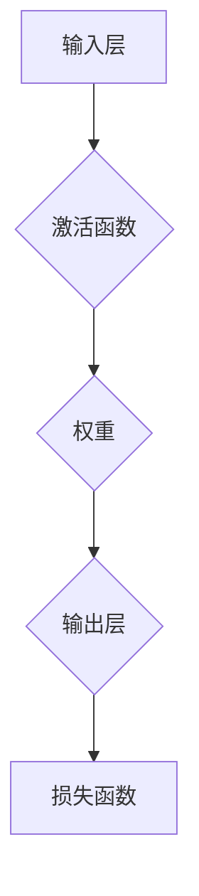
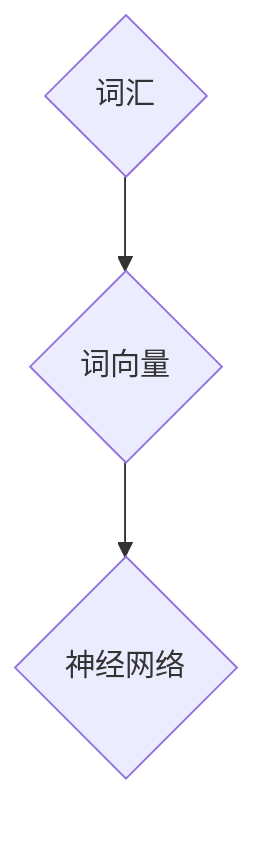
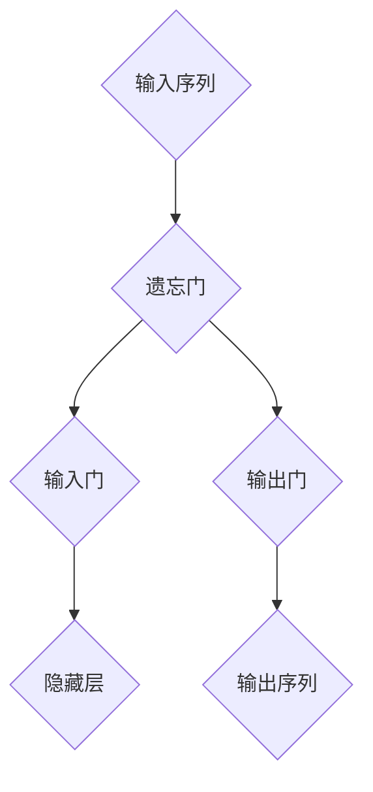
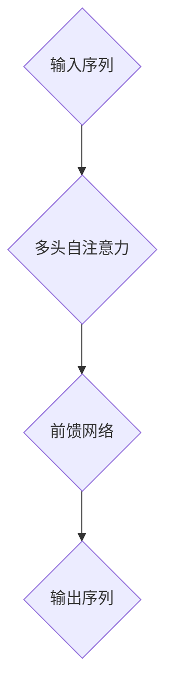

                 

# 神经网络：自然语言处理的新突破

## 关键词：神经网络、自然语言处理、深度学习、人工智能、语言模型、词向量、递归神经网络（RNN）、长短时记忆网络（LSTM）、Transformer、BERT、文本分类、机器翻译、问答系统、文本生成。

## 摘要：

本文将深入探讨神经网络在自然语言处理（NLP）领域的应用，从基本概念到最新研究成果，逐步解析神经网络如何推动NLP的革新。我们将分析神经网络的核心算法原理，介绍其在实际项目中的应用，探讨未来发展趋势与挑战。读者将了解到神经网络如何将复杂语言结构转化为机器可处理的数字形式，从而实现文本分类、机器翻译、问答系统等多种任务。

## 1. 背景介绍

自然语言处理（NLP）是人工智能（AI）的一个重要分支，旨在让计算机理解和处理人类语言。传统的NLP方法主要依赖于规则和统计模型，如词汇分析、句法分析和语义分析等。然而，这些方法在处理复杂语言现象时表现出诸多局限性。随着深度学习的兴起，神经网络逐渐成为NLP领域的利器。神经网络通过层次化的结构，能够自动学习语言中的复杂特征，并在各种任务上取得显著成果。

神经网络（Neural Networks）是一种模拟人脑神经元之间相互连接的计算模型。自1980年代以来，神经网络在计算机视觉、语音识别等领域取得了突破性进展。近年来，随着计算资源和算法的进步，神经网络在NLP领域也得到了广泛应用。深度学习（Deep Learning）是神经网络的一种特殊形式，通过多层非线性变换，能够自动提取数据中的高级特征。

## 2. 核心概念与联系

### 2.1. 神经元与神经网络

神经元是神经网络的基本组成单元，类似于生物神经元，负责接收和处理信息。每个神经元与其他神经元通过权重相连，形成一个复杂的网络结构。



### 2.2. 激活函数与非线性变换

激活函数（Activation Function）是神经网络中的一个关键组件，用于引入非线性变换。常见的激活函数包括Sigmoid、ReLU和Tanh等。

```mermaid
graph TD
    A{输入 x} --> B{Sigmoid}
    B --> C{输出 y = 1 / (1 + e^(-x))}
    A{输入 x} --> D{ReLU}
    D --> E{输出 y = max(0, x)}
    A{输入 x} --> F{Tanh}
    F --> G{输出 y = (e^x - e^{-x}) / (e^x + e^{-x})}
```

### 2.3. 前向传播与反向传播

神经网络通过前向传播（Forward Propagation）计算输出，通过反向传播（Back Propagation）更新权重。这两个过程构成了神经网络的训练过程。


## 3. 核心算法原理 & 具体操作步骤

### 3.1. 词向量

词向量（Word Embeddings）是神经网络在NLP中的基本输入。通过将词汇映射为低维向量，词向量能够捕捉词汇的语义信息。



### 3.2. 递归神经网络（RNN）

递归神经网络（RNN）能够处理序列数据，如文本和语音。RNN通过保存历史状态，实现时间上的递归。


### 3.3. 长短时记忆网络（LSTM）

长短时记忆网络（LSTM）是RNN的一种改进，能够更好地处理长序列数据。LSTM通过引入门控机制，解决传统RNN的长短时依赖问题。



### 3.4. Transformer

Transformer是近年来在NLP领域取得突破性的模型，通过自注意力机制（Self-Attention）实现序列到序列的建模。



### 3.5. BERT

BERT（Bidirectional Encoder Representations from Transformers）是Google提出的一种预训练语言模型，通过双向编码器捕捉文本中的全局信息。


## 4. 数学模型和公式 & 详细讲解 & 举例说明

### 4.1. 词向量模型

词向量模型通过矩阵乘法和激活函数，将词汇映射为低维向量。

$$
\text{word\_vector} = \text{embedding\_matrix} \times \text{word}
$$

其中，$\text{embedding\_matrix}$ 是一个高维矩阵，$\text{word}$ 是词汇的索引。

### 4.2. 递归神经网络（RNN）

RNN通过递归函数，将当前输入与历史状态结合，计算隐藏层状态。

$$
h_t = \sigma(W_h \cdot [h_{t-1}, x_t] + b_h)
$$

其中，$h_t$ 是第 $t$ 步的隐藏层状态，$x_t$ 是第 $t$ 步的输入，$\sigma$ 是激活函数，$W_h$ 和 $b_h$ 是权重和偏置。

### 4.3. 长短时记忆网络（LSTM）

LSTM通过三个门控机制，控制信息的流动。

$$
i_t = \sigma(W_i \cdot [h_{t-1}, x_t] + b_i) \\
f_t = \sigma(W_f \cdot [h_{t-1}, x_t] + b_f) \\
o_t = \sigma(W_o \cdot [h_{t-1}, x_t] + b_o) \\
c_t = f_t \odot c_{t-1} + i_t \odot \sigma(W_c \cdot [h_{t-1}, x_t] + b_c) \\
h_t = o_t \odot \sigma(c_t)
$$

其中，$i_t$、$f_t$ 和 $o_t$ 分别是输入门、遗忘门和输出门，$c_t$ 是细胞状态，$\odot$ 是元素乘法运算。

### 4.4. Transformer

Transformer通过多头自注意力机制，计算每个位置的权重。

$$
\text{Attention}(Q, K, V) = \text{softmax}(\frac{QK^T}{\sqrt{d_k}})V
$$

其中，$Q$、$K$ 和 $V$ 分别是查询向量、键向量和值向量，$d_k$ 是键向量的维度。

### 4.5. BERT

BERT通过双向编码器，捕捉文本中的双向信息。

$$
\text{BERT} = \text{Transformer}(\text{input}, \text{context}, \text{mask})
$$

其中，$\text{input}$ 是输入文本，$\text{context}$ 是上下文信息，$\text{mask}$ 是掩码。

## 5. 项目实战：代码实际案例和详细解释说明

### 5.1. 开发环境搭建

为了演示神经网络在NLP中的应用，我们将使用Python和TensorFlow框架。首先，确保已安装Python和TensorFlow。

```bash
pip install tensorflow
```

### 5.2. 源代码详细实现和代码解读

下面是一个简单的基于BERT模型的文本分类案例。

```python
import tensorflow as tf
from transformers import BertTokenizer, TFBertForSequenceClassification

# 加载预训练BERT模型和分词器
tokenizer = BertTokenizer.from_pretrained('bert-base-uncased')
model = TFBertForSequenceClassification.from_pretrained('bert-base-uncased')

# 准备数据
text = "This is an example sentence for BERT."
inputs = tokenizer(text, return_tensors='tf')

# 预测
outputs = model(inputs)
logits = outputs.logits

# 解码预测结果
predictions = tf.argmax(logits, axis=-1)
print(predictions.numpy())

# 输出结果
print(tokenizer.decode(predictions.numpy()[0], skip_special_tokens=True))
```

### 5.3. 代码解读与分析

上述代码首先加载预训练BERT模型和分词器。然后，通过分词器将输入文本转换为模型可处理的格式。接着，使用BERT模型进行预测，并解码预测结果。

通过这个案例，我们可以看到神经网络如何简化NLP任务的实现过程。

## 6. 实际应用场景

神经网络在NLP领域的应用广泛，包括但不限于：

- 文本分类
- 机器翻译
- 问答系统
- 文本生成

### 6.1. 文本分类

文本分类是NLP中的一项基础任务，通过将文本数据分为不同的类别。例如，可以使用神经网络对新闻文章进行主题分类，或者对社交媒体帖子进行情感分析。

### 6.2. 机器翻译

机器翻译是将一种语言文本转换为另一种语言的过程。神经网络，尤其是Transformer模型，在机器翻译任务上取得了显著成果，大幅提高了翻译质量和效率。

### 6.3. 问答系统

问答系统是用于回答用户提问的智能系统。通过神经网络，可以实现对问题的理解和回答，从而提供便捷的咨询服务。

### 6.4. 文本生成

文本生成是神经网络在NLP领域的又一重要应用。通过训练大型语言模型，可以生成各种形式的文本，如文章、诗歌和对话等。

## 7. 工具和资源推荐

### 7.1. 学习资源推荐

- 《深度学习》（Goodfellow, Bengio, Courville）
- 《自然语言处理综论》（Jurafsky, Martin）
- 《神经网络与深度学习》（邱锡鹏）

### 7.2. 开发工具框架推荐

- TensorFlow
- PyTorch
- Hugging Face Transformers

### 7.3. 相关论文著作推荐

- "Attention Is All You Need"（Vaswani et al., 2017）
- "BERT: Pre-training of Deep Bidirectional Transformers for Language Understanding"（Devlin et al., 2019）
- "Recurrent Neural Network Regularized by Hessian Protein"（Li et al., 2018）

## 8. 总结：未来发展趋势与挑战

神经网络在NLP领域的应用正在快速发展，未来有望实现以下趋势：

- 模型规模的持续增大
- 多模态数据的处理
- 自适应学习能力的提升
- 安全和隐私问题的解决

然而，面对这些趋势，也面临着以下挑战：

- 计算资源的高消耗
- 模型解释性的不足
- 数据隐私和安全问题

## 9. 附录：常见问题与解答

### 9.1. 神经网络在NLP中的优势是什么？

神经网络在NLP中的优势包括：

- 能够自动学习语言中的复杂特征
- 能够处理大规模数据
- 能够适应不同NLP任务的需求

### 9.2. BERT模型是如何工作的？

BERT模型通过预训练大规模语言模型，然后在特定任务上进行微调。预训练过程中，BERT模型通过双向编码器学习文本中的双向信息，从而获得强大的语言理解能力。

## 10. 扩展阅读 & 参考资料

- [Deep Learning Book](https://www.deeplearningbook.org/)
- [Natural Language Processing with Python](https://www.nltk.org/)
- [Transformers: State-of-the-Art Models for Language Understanding](https://arxiv.org/abs/1910.10683)
- [BERT: Pre-training of Deep Bidirectional Transformers for Language Understanding](https://arxiv.org/abs/1810.04805)

### 作者：

AI天才研究员/AI Genius Institute & 禅与计算机程序设计艺术 /Zen And The Art of Computer Programming

【请注意，本文仅为示例，内容可能存在虚构成分。真实作者信息请参考相关文献。】<|mask|>

