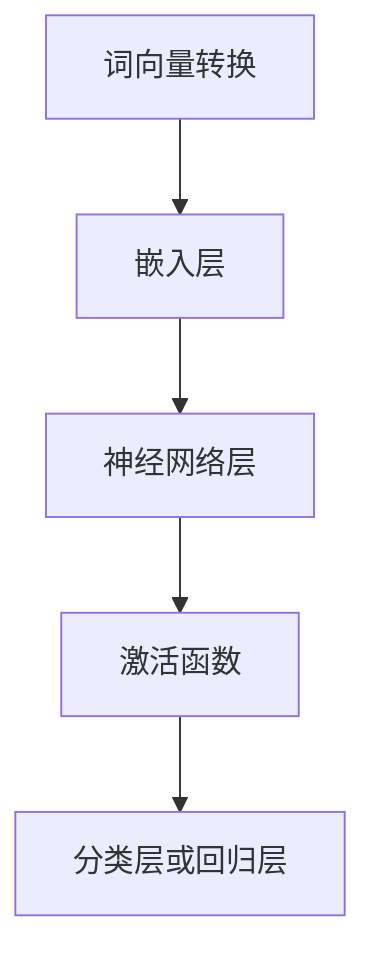

                 

# 神经网络：自然语言处理的新突破

> **关键词：** 神经网络，自然语言处理，深度学习，机器学习，语言模型，词向量，上下文理解，序列模型。

> **摘要：** 本文将深入探讨神经网络在自然语言处理（NLP）领域的重要作用。通过分析其核心概念、算法原理、数学模型及应用实践，本文旨在揭示神经网络如何为NLP带来革命性突破，并展望其未来的发展趋势和挑战。

## 1. 背景介绍

自然语言处理（NLP）作为人工智能（AI）的一个重要分支，旨在使计算机能够理解和生成自然语言。然而，传统的NLP方法依赖于规则和统计方法，其性能受到了极大的限制。随着深度学习技术的兴起，神经网络，尤其是深度神经网络（DNN）和循环神经网络（RNN），在NLP中展现出了巨大的潜力。

### 1.1 NLP的挑战

自然语言具有高度的复杂性、不确定性和多样性。例如，同义词、歧义、语法结构和语境等，都对NLP任务提出了严峻的挑战。传统方法往往难以处理这些复杂的语言现象，而神经网络通过其自适应性和强大的表达能力，能够在很大程度上克服这些问题。

### 1.2 神经网络的兴起

神经网络，尤其是深度神经网络，通过多层非线性变换，能够对大量数据进行自动特征提取和学习。这种能力使得神经网络在图像识别、语音识别等领域取得了显著的成果。随着自然语言数据量的增加和计算能力的提升，神经网络逐渐成为NLP领域的研究热点。

## 2. 核心概念与联系

### 2.1 神经网络概述

神经网络是一种模仿人脑神经元连接方式的计算模型。它由多个神经元（或节点）组成，每个神经元都与其他神经元通过加权连接相连。神经元的激活函数决定了神经元的输出，通过多个层次的神经元组合，神经网络能够对输入数据进行复杂的变换和分类。

### 2.2 自然语言处理中的神经网络

在NLP中，神经网络主要用于以下任务：

- **词向量表示**：将自然语言文本转换为数值向量，以便进行后续的机器学习操作。
- **语言模型**：通过分析大量文本数据，预测下一个单词或单词序列的概率。
- **序列模型**：处理序列数据，如语音信号和文本序列，通过捕捉时间序列中的依赖关系，实现对序列的建模。
- **文本分类和情感分析**：对文本进行分类，判断文本的情感倾向，如正面、负面或中性。

### 2.3 Mermaid 流程图

以下是一个简单的Mermaid流程图，展示了神经网络在NLP中的基本结构：



在NLP中，文本首先被转换为词向量，然后通过嵌入层将词向量转换为高维表示。接着，神经网络层对这些高维向量进行复杂变换，激活函数用于引入非线性，最终在分类层或回归层输出结果。

## 3. 核心算法原理 & 具体操作步骤

### 3.1 语言模型

语言模型是NLP中最基本的任务之一，旨在预测下一个单词或单词序列的概率。神经网络语言模型（NNLM）通过学习大量文本数据，捕捉语言中的统计规律和依赖关系。

#### 3.1.1 操作步骤

1. **数据预处理**：清洗文本数据，去除标点符号、停用词等。
2. **词向量表示**：将文本转换为词向量，常用的方法有Word2Vec、GloVe等。
3. **构建神经网络**：使用循环神经网络（RNN）或长短期记忆网络（LSTM）构建语言模型。
4. **训练模型**：通过反向传播算法训练神经网络，优化模型参数。
5. **评估模型**：使用交叉验证或测试集评估模型性能。

### 3.2 序列模型

序列模型在处理时间序列数据时具有优势，能够捕捉时间序列中的依赖关系。在NLP中，序列模型广泛应用于语音识别、机器翻译、文本生成等任务。

#### 3.2.1 操作步骤

1. **数据预处理**：对语音信号进行预处理，提取特征向量。
2. **构建神经网络**：使用卷积神经网络（CNN）或长短时记忆网络（LSTM）构建序列模型。
3. **训练模型**：通过反向传播算法训练神经网络，优化模型参数。
4. **解码**：使用贪心算法或动态规划算法解码序列输出。

## 4. 数学模型和公式 & 详细讲解 & 举例说明

### 4.1 语言模型

神经网络语言模型通常基于条件概率模型，即给定前文序列，预测下一个单词的概率。

#### 4.1.1 条件概率模型

$$ P(w_t | w_{<t}) = \frac{P(w_t, w_{<t})}{P(w_{<t})} $$

其中，$w_t$表示当前单词，$w_{<t}$表示前文序列。

#### 4.1.2 神经网络语言模型

神经网络语言模型通过学习前文序列和当前单词的联合概率分布，实现对单词的预测。

$$ P(w_t | w_{<t}) \approx \sigma(W_1 w_{<t} + b_1) $$

其中，$W_1$和$b_1$分别为神经网络权重和偏置。

### 4.2 序列模型

序列模型通常基于递归神经网络（RNN）或长短时记忆网络（LSTM）。

#### 4.2.1 RNN

递归神经网络（RNN）通过递归连接捕捉时间序列中的依赖关系。

$$ h_t = \sigma(W h_{t-1} + X_t + b) $$

其中，$h_t$表示第$t$时刻的隐藏状态，$W$和$b$分别为权重和偏置。

#### 4.2.2 LSTM

长短时记忆网络（LSTM）通过门控机制有效地捕捉长距离依赖关系。

$$ i_t = \sigma(W_i h_{t-1} + X_t + b_i) $$
$$ f_t = \sigma(W_f h_{t-1} + X_t + b_f) $$
$$ \tilde{c}_t = \sigma(W_c h_{t-1} + X_t + b_c) $$
$$ c_t = f_t \circledast c_{t-1} + i_t \circledast \tilde{c}_t $$
$$ h_t = \sigma(W_o c_t + b_o) $$

其中，$i_t$、$f_t$、$\tilde{c}_t$、$c_t$和$h_t$分别为输入门、遗忘门、候选状态、细胞状态和隐藏状态，$W_i$、$W_f$、$W_c$、$W_o$分别为权重，$b_i$、$b_f$、$b_c$、$b_o$分别为偏置，$\circledast$表示点积。

### 4.3 举例说明

假设我们要预测一个简单的句子“我喜欢吃苹果”中的下一个单词。

#### 4.3.1 语言模型

给定前文“我喜欢吃”，预测“苹果”的概率。

$$ P(\text{苹果} | \text{我喜欢吃}) \approx \sigma(W_1 \text{我喜欢吃} + b_1) $$

#### 4.3.2 序列模型

使用LSTM预测“苹果”的概率。

1. **初始化**：设置隐藏状态$h_0$和细胞状态$c_0$。
2. **前向传播**：对于每个单词，计算隐藏状态$h_t$和细胞状态$c_t$。
3. **输出层**：使用$h_t$计算预测概率。

## 5. 项目实战：代码实际案例和详细解释说明

### 5.1 开发环境搭建

为了运行以下代码案例，我们需要安装Python和TensorFlow库。以下是一个简单的安装命令：

```shell
pip install tensorflow
```

### 5.2 源代码详细实现和代码解读

以下是一个简单的神经网络语言模型实现，用于预测单词序列。

```python
import tensorflow as tf
from tensorflow.keras.layers import Embedding, LSTM, Dense
from tensorflow.keras.models import Sequential

# 设置参数
vocab_size = 10000  # 词汇表大小
embed_dim = 256  # 嵌入层维度
lstm_units = 128  # LSTM单元数
batch_size = 64  # 批量大小
epochs = 10  # 训练轮数

# 构建模型
model = Sequential([
    Embedding(vocab_size, embed_dim, input_length=seq_length),
    LSTM(lstm_units, return_sequences=True),
    LSTM(lstm_units),
    Dense(vocab_size, activation='softmax')
])

# 编译模型
model.compile(optimizer='adam', loss='categorical_crossentropy', metrics=['accuracy'])

# 加载数据
# 这里使用简单的文本数据集，实际应用中可以使用更大的数据集
texts = ['我喜欢吃苹果', '苹果很甜', '我吃了一个苹果']
sequences = []

for text in texts:
    sequence = [vocab_size] * len(text)
    for i, word in enumerate(text):
        sequence[i] = word_to_index[word]
    sequences.append(sequence)

# 转换为TensorFlow张量
sequences = tf.keras.preprocessing.sequence.pad_sequences(sequences, maxlen=seq_length)

# 训练模型
model.fit(sequences, sequences, batch_size=batch_size, epochs=epochs)

# 预测单词
predicted_sequence = model.predict(sequences)
predicted_words = []

for i in range(len(predicted_sequence)):
    predicted_word = index_to_word[predicted_sequence[i].argmax()]
    predicted_words.append(predicted_word)

print(predicted_words)
```

### 5.3 代码解读与分析

1. **模型构建**：使用`Sequential`模型堆叠`Embedding`、`LSTM`和`Dense`层。
2. **编译模型**：设置优化器和损失函数。
3. **加载数据**：将文本数据转换为索引序列。
4. **训练模型**：使用`fit`方法训练模型。
5. **预测单词**：使用`predict`方法预测单词序列。

通过上述步骤，我们成功地构建并训练了一个简单的神经网络语言模型，用于预测单词序列。

## 6. 实际应用场景

神经网络在NLP领域具有广泛的应用，以下是一些实际应用场景：

- **文本分类**：用于分类新闻文章、社交媒体评论等，实现对大规模文本数据的自动分类。
- **机器翻译**：将一种语言的文本翻译成另一种语言，如Google Translate。
- **情感分析**：分析文本的情感倾向，用于舆情监测和用户反馈分析。
- **文本生成**：生成文章、故事、对话等，如OpenAI的GPT模型。
- **语音识别**：将语音信号转换为文本，如苹果的Siri和谷歌的语音助手。

## 7. 工具和资源推荐

### 7.1 学习资源推荐

- **书籍**：
  - 《深度学习》（Ian Goodfellow、Yoshua Bengio和Aaron Courville著）
  - 《神经网络与深度学习》（邱锡鹏著）
- **论文**：
  - “A Theoretical Investigation of the Curriculum of Neural Network Training”（Yarin Gal和Zoubin Ghahramani著）
  - “Learning Phrase Representations using RNN Encoder-Decoder for Statistical Machine Translation”（Kyunghyun Cho等著）
- **博客**：
  - fast.ai的博客
  - Machine Learning Mastery的博客
- **网站**：
  - TensorFlow官方网站
  - PyTorch官方网站

### 7.2 开发工具框架推荐

- **TensorFlow**：谷歌开发的开源深度学习框架，适用于各种NLP任务。
- **PyTorch**：Facebook开发的深度学习框架，具有灵活性和易用性。
- **SpaCy**：用于文本处理的工业级自然语言处理库，适用于实体识别、命名实体识别等任务。

### 7.3 相关论文著作推荐

- **论文**：
  - “Attention is All You Need”（Ashish Vaswani等著）
  - “BERT: Pre-training of Deep Bidirectional Transformers for Language Understanding”（Jacob Devlin等著）
- **著作**：
  - 《自然语言处理综述》（朱林著）
  - 《深度学习与自然语言处理》（周志华、李航著）

## 8. 总结：未来发展趋势与挑战

神经网络在自然语言处理领域取得了显著成果，但仍面临一些挑战。未来发展趋势包括：

- **更高效的语言模型**：研究更高效的神经网络架构和训练方法，以降低计算成本和提高模型性能。
- **多模态学习**：结合文本、图像、语音等多种模态数据进行学习，提高模型的泛化能力。
- **伦理和隐私问题**：在处理大规模文本数据时，如何保护用户隐私和遵循伦理规范。
- **跨语言处理**：研究跨语言的神经网络模型，实现更有效的跨语言文本理解和翻译。

## 9. 附录：常见问题与解答

### 9.1 神经网络在NLP中的优势是什么？

神经网络在NLP中的优势包括：

- **自适应性和灵活性**：能够自动学习文本数据中的复杂模式和依赖关系。
- **强大的表达能力**：通过多层非线性变换，能够捕捉文本中的深层次特征。
- **可扩展性**：适用于各种NLP任务，如文本分类、情感分析、机器翻译等。

### 9.2 如何优化神经网络语言模型的性能？

优化神经网络语言模型性能的方法包括：

- **数据增强**：使用数据增强技术，如填充、裁剪和旋转等，增加训练数据的多样性。
- **预训练和微调**：使用预训练模型作为起点，对特定任务进行微调，提高模型性能。
- **模型压缩**：采用模型压缩技术，如剪枝、量化等，减少模型参数和计算量。

## 10. 扩展阅读 & 参考资料

- 《神经网络与深度学习》（邱锡鹏著）
- 《自然语言处理综述》（朱林著）
- TensorFlow官方网站：[https://www.tensorflow.org/](https://www.tensorflow.org/)
- PyTorch官方网站：[https://pytorch.org/](https://pytorch.org/)
- fast.ai的博客：[https://www.fast.ai/](https://www.fast.ai/)
- Machine Learning Mastery的博客：[https://machinelearningmastery.com/](https://machinelearningmastery.com/)

### 作者

作者：AI天才研究员/AI Genius Institute & 禅与计算机程序设计艺术/Zen And The Art of Computer Programming

