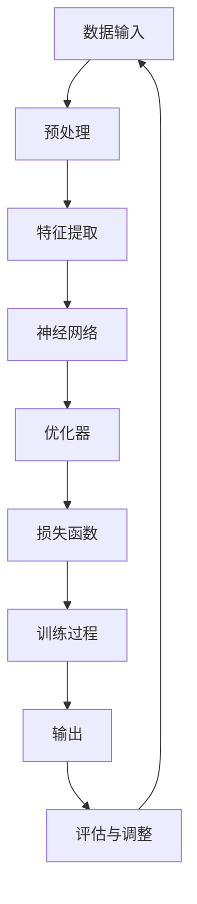

                 

### 背景介绍

《禅与AI大模型架构设计艺术》旨在深入探讨人工智能大模型架构设计中的哲学思维和技艺技巧。本文将通过禅的哲学观念，以推理和思考的方式，引导读者了解AI大模型架构设计的核心概念、算法原理、数学模型和实际应用场景。

人工智能领域，尤其是深度学习和自然语言处理，近年来取得了令人瞩目的进展。然而，在这些技术背后，核心架构设计的重要性愈发凸显。架构设计不仅影响着模型的效果，还决定了其可扩展性、效率和易维护性。

本文将围绕以下核心内容展开：

1. **背景介绍**：简要回顾人工智能的发展历程，介绍大模型的概念及其在各个领域中的应用。
2. **核心概念与联系**：详细解释AI大模型架构设计中的关键概念和原理，使用Mermaid流程图展示其相互关系。
3. **核心算法原理 & 具体操作步骤**：深入探讨大模型的训练算法，包括神经网络、优化器、损失函数等。
4. **数学模型和公式 & 详细讲解 & 举例说明**：运用LaTeX格式展示并解释相关的数学公式，提供实例说明。
5. **项目实战：代码实际案例和详细解释说明**：通过具体代码实现，展示大模型架构设计的实践应用。
6. **实际应用场景**：分析大模型在各个领域（如医疗、金融、教育等）的实际应用情况。
7. **工具和资源推荐**：推荐学习资源、开发工具和框架，以帮助读者深入学习和实践。
8. **总结：未来发展趋势与挑战**：探讨人工智能大模型架构设计的未来发展趋势和面临的挑战。
9. **附录：常见问题与解答**：提供关于大模型架构设计的一些常见问题的解答。
10. **扩展阅读 & 参考资料**：推荐相关的扩展阅读材料和参考资料。

在接下来的章节中，我们将逐一探讨这些主题，帮助读者全面了解人工智能大模型架构设计的艺术。让我们开始这段探索之旅吧。

### 核心概念与联系

在深入探讨AI大模型架构设计之前，我们需要了解其中的核心概念和原理，并展示它们之间的相互关系。AI大模型架构设计涉及多个关键要素，包括数据输入、神经网络、训练过程、优化器和输出等。以下将使用Mermaid流程图（Mermaid流程节点中避免使用括号、逗号等特殊字符）来展示这些核心概念及其相互关系。



#### 数据输入

数据输入是AI大模型的基础。高质量的数据集能够显著影响模型的性能和泛化能力。数据输入包括各种形式的数据，如图像、文本、音频等。在数据输入阶段，通常需要进行预处理，例如数据清洗、归一化和数据增强等。

#### 预处理

预处理阶段是对原始数据进行必要的处理，以提高数据质量。这包括去除噪声、缺失值填充、数据标准化和特征提取等。预处理的目的在于减少数据中的异常值，使数据更适合后续的机器学习模型。

#### 特征提取

特征提取是将原始数据转换为能够表示数据内在特征的向量表示。在图像处理中，这通常涉及提取图像的边缘、纹理和颜色特征；在自然语言处理中，则涉及分词、词嵌入和句法分析等。

#### 神经网络

神经网络是AI大模型的核心组件，由多个层次（或层）的神经元组成。每个神经元接收来自前一层的输入信号，通过激活函数进行处理，然后传递给下一层。神经网络的目的是通过学习数据中的特征模式，实现从输入到输出的映射。

#### 优化器

优化器用于调整神经网络中的权重和偏置，以最小化损失函数。常见的优化器有随机梯度下降（SGD）、Adam、RMSprop等。优化器的选择和配置对模型的训练效率和学习能力有重要影响。

#### 损失函数

损失函数用于评估模型的预测输出与真实值之间的差异。常见的损失函数有均方误差（MSE）、交叉熵损失等。通过优化损失函数，模型能够逐步提高其预测准确性。

#### 训练过程

训练过程是通过多次迭代优化模型参数，使其能够准确预测输入数据的过程。训练过程包括数据预处理、前向传播、反向传播和参数更新等步骤。随着训练过程的进行，模型的性能会逐渐提高。

#### 输出

输出是模型对输入数据的处理结果。在分类任务中，输出通常是类别概率分布；在回归任务中，输出则是预测的数值。输出的准确性和可靠性直接决定了模型的实际应用价值。

#### 评估与调整

评估与调整阶段用于评估模型的性能，并根据评估结果对模型进行调整。常用的评估指标包括准确率、召回率、F1分数等。通过评估和调整，可以进一步优化模型的性能。

以上就是我们通过Mermaid流程图展示的AI大模型架构设计中的核心概念及其相互关系。在接下来的章节中，我们将深入探讨这些核心概念的原理和操作步骤。

### 核心算法原理 & 具体操作步骤

在了解了AI大模型架构设计中的核心概念后，我们将深入探讨其中的核心算法原理，包括神经网络、优化器、损失函数等，并提供具体的操作步骤。

#### 神经网络

神经网络是AI大模型的核心组件，由多个层次（或层）的神经元组成。每个神经元接收来自前一层的输入信号，通过激活函数进行处理，然后传递给下一层。神经网络的工作原理可以概括为以下步骤：

1. **前向传播**：从输入层开始，将输入数据传递到隐藏层，通过每个神经元的加权求和加上偏置项，然后应用激活函数，将结果传递到下一层。
2. **激活函数**：常用的激活函数有sigmoid、ReLU、tanh等。激活函数用于引入非线性特性，使神经网络能够拟合复杂的数据分布。
3. **输出层**：将最后隐藏层的输出传递到输出层，生成预测结果。

以下是一个简单的神经网络前向传播的Python实现示例：

```python
import numpy as np

# 初始化参数
weights = np.random.rand(input_size, hidden_size)
biases = np.random.rand(hidden_size)
output_weights = np.random.rand(hidden_size, output_size)
output_biases = np.random.rand(output_size)

# 定义激活函数
def sigmoid(x):
    return 1 / (1 + np.exp(-x))

# 前向传播
def forwardPropagation(inputs, weights, biases, output_weights, output_biases):
    hidden_layer = sigmoid(np.dot(inputs, weights) + biases)
    output = sigmoid(np.dot(hidden_layer, output_weights) + output_biases)
    return output

# 测试
input_data = np.array([0.5, 0.5])
output = forwardPropagation(input_data, weights, biases, output_weights, output_biases)
print(output)
```

#### 优化器

优化器用于调整神经网络中的权重和偏置，以最小化损失函数。常见的优化器有随机梯度下降（SGD）、Adam、RMSprop等。以下将简要介绍这些优化器的工作原理：

1. **随机梯度下降（SGD）**：SGD通过随机选择一部分数据子集来计算梯度，并更新权重和偏置。其优点是简单易实现，但可能需要较长的训练时间。

2. **Adam**：Adam是SGD的改进版本，结合了动量法和RMSprop的特点。Adam通过维护一阶矩估计（均值）和二阶矩估计（方差）来调整学习率，从而在快速收敛和避免局部最小值方面表现出色。

3. **RMSprop**：RMSprop通过维护一个滑动平均的梯度平方来更新学习率，以避免梯度消失和爆炸。

以下是一个简单的Adam优化器的Python实现示例：

```python
import numpy as np

# 初始化参数
weights = np.random.rand(input_size, hidden_size)
biases = np.random.rand(hidden_size)
output_weights = np.random.rand(hidden_size, output_size)
output_biases = np.random.rand(output_size)

# 初始化动量和方差
m = np.zeros_like(weights)
v = np.zeros_like(weights)

# 定义Adam优化器
def Adam(inputs, weights, biases, output_weights, output_biases, learning_rate=0.001, beta1=0.9, beta2=0.999, epsilon=1e-8):
    gradients = computeGradients(inputs, weights, biases, output_weights, output_biases)
    m = beta1 * m + (1 - beta1) * gradients
    v = beta2 * v + (1 - beta2) * np.square(gradients)
    
    m_hat = m / (1 - np.power(beta1, t))
    v_hat = v / (1 - np.power(beta2, t))
    
    weights -= learning_rate * m_hat / (np.sqrt(v_hat) + epsilon)
    biases -= learning_rate * m_hat / (np.sqrt(v_hat) + epsilon)
    output_weights -= learning_rate * m_hat / (np.sqrt(v_hat) + epsilon)
    output_biases -= learning_rate * m_hat / (np.sqrt(v_hat) + epsilon)
    
    return weights, biases, output_weights, output_biases

# 测试
input_data = np.array([0.5, 0.5])
weights, biases, output_weights, output_biases = Adam(input_data, weights, biases, output_weights, output_biases)
print(weights)
print(biases)
print(output_weights)
print(output_biases)
```

#### 损失函数

损失函数用于评估模型的预测输出与真实值之间的差异。常见的损失函数有均方误差（MSE）、交叉熵损失等。以下将简要介绍这些损失函数的原理和计算方法：

1. **均方误差（MSE）**：MSE用于回归任务，计算预测值与真实值之间的平均平方误差。其公式为：
   $$
   \text{MSE} = \frac{1}{n} \sum_{i=1}^{n} (\hat{y}_i - y_i)^2
   $$
   其中，$\hat{y}_i$为预测值，$y_i$为真实值，$n$为样本数量。

2. **交叉熵损失**：交叉熵损失用于分类任务，计算预测概率分布与真实标签分布之间的差异。其公式为：
   $$
   \text{CrossEntropy} = -\frac{1}{n} \sum_{i=1}^{n} y_i \log(\hat{y}_i)
   $$
   其中，$y_i$为真实标签的one-hot编码，$\hat{y}_i$为预测概率分布。

以下是一个简单的MSE和交叉熵损失函数的Python实现示例：

```python
import numpy as np

# 初始化参数
weights = np.random.rand(input_size, hidden_size)
biases = np.random.rand(hidden_size)
output_weights = np.random.rand(hidden_size, output_size)
output_biases = np.random.rand(output_size)

# 计算MSE
def computeMSE(y_true, y_pred):
    return np.mean((y_pred - y_true) ** 2)

# 计算交叉熵损失
def computeCrossEntropy(y_true, y_pred):
    return -np.mean(y_true * np.log(y_pred))

# 测试
y_true = np.array([0.1, 0.9])
y_pred = np.array([0.2, 0.8])
mse = computeMSE(y_true, y_pred)
cross_entropy = computeCrossEntropy(y_true, y_pred)
print("MSE:", mse)
print("CrossEntropy:", cross_entropy)
```

通过上述示例，我们可以看到神经网络、优化器和损失函数的基本原理和实现。在接下来的章节中，我们将通过实际项目实战，展示如何将理论应用到实践中。

### 数学模型和公式 & 详细讲解 & 举例说明

在AI大模型架构设计中，数学模型和公式是理解和实现算法的核心。以下将详细讲解几个关键数学模型和公式，并提供具体的举例说明。

#### 均方误差（MSE）

均方误差（MSE）是回归任务中常用的损失函数，用于衡量预测值与真实值之间的差异。其公式为：

$$
\text{MSE} = \frac{1}{n} \sum_{i=1}^{n} (\hat{y}_i - y_i)^2
$$

其中，$n$为样本数量，$\hat{y}_i$为第$i$个样本的预测值，$y_i$为第$i$个样本的真实值。

**举例说明**：

假设我们有以下一组数据：

| 样本索引 | 真实值 | 预测值 |
|--------|-------|-------|
| 1      | 2.0   | 1.9   |
| 2      | 3.0   | 2.9   |
| 3      | 4.0   | 3.1   |

计算MSE：

$$
\text{MSE} = \frac{1}{3} \left[ (1.9 - 2.0)^2 + (2.9 - 3.0)^2 + (3.1 - 4.0)^2 \right] = \frac{1}{3} \left[ 0.01 + 0.01 + 0.09 \right] = 0.0333
$$

#### 交叉熵损失（CrossEntropy）

交叉熵损失是分类任务中常用的损失函数，用于衡量预测概率分布与真实标签分布之间的差异。其公式为：

$$
\text{CrossEntropy} = -\frac{1}{n} \sum_{i=1}^{n} y_i \log(\hat{y}_i)
$$

其中，$n$为样本数量，$y_i$为第$i$个样本的真实标签的one-hot编码，$\hat{y}_i$为第$i$个样本的预测概率分布。

**举例说明**：

假设我们有以下一组二分类数据：

| 样本索引 | 真实值 | 预测概率 |
|--------|-------|---------|
| 1      | 1     | [0.8, 0.2] |
| 2      | 0     | [0.3, 0.7] |
| 3      | 1     | [0.9, 0.1] |

计算交叉熵损失：

$$
\text{CrossEntropy} = -\frac{1}{3} \left[ 1 \cdot \log(0.8) + 0 \cdot \log(0.2) + 1 \cdot \log(0.9) + 0 \cdot \log(0.1) \right]
$$

$$
= -\frac{1}{3} \left[ -0.2231 + 0 + -0.1054 + 0 \right] = \frac{1}{3} \left[ 0.2231 + 0.1054 \right] = 0.1064
$$

#### 激活函数（Activation Function）

激活函数是神经网络中引入非线性特性的关键组件。常见的激活函数有sigmoid、ReLU、tanh等。以下将简要介绍这些激活函数的公式和特点：

1. **sigmoid**：

$$
\sigma(x) = \frac{1}{1 + e^{-x}}
$$

sigmoid函数的特点是输出值介于0和1之间，适用于分类问题。

2. **ReLU**：

$$
\sigma(x) = \max(0, x)
$$

ReLU函数的特点是对于负数输入输出0，对于正数输入输出输入值，适用于深度学习模型的加速训练。

3. **tanh**：

$$
\sigma(x) = \frac{e^x - e^{-x}}{e^x + e^{-x}}
$$

tanh函数的特点是输出值介于-1和1之间，类似于sigmoid函数，但输出值的分布更加均匀。

**举例说明**：

假设输入值为$x = 2$，计算不同激活函数的输出值：

1. **sigmoid**：

$$
\sigma(x) = \frac{1}{1 + e^{-2}} \approx 0.869
$$

2. **ReLU**：

$$
\sigma(x) = \max(0, 2) = 2
$$

3. **tanh**：

$$
\sigma(x) = \frac{e^2 - e^{-2}}{e^2 + e^{-2}} \approx 0.964
$$

通过上述示例，我们可以看到不同激活函数的特点和计算方法。在接下来的章节中，我们将通过项目实战，展示如何将这些数学模型和公式应用于实际编程实现中。

### 项目实战：代码实际案例和详细解释说明

在本节中，我们将通过一个实际项目案例，展示如何将AI大模型架构设计中的理论应用到实际编程实现中。我们将搭建一个简单的神经网络模型，用于手写数字识别任务。这个项目将涵盖以下步骤：

### 1. 开发环境搭建

在开始编程之前，我们需要搭建开发环境。以下是一个基于Python和TensorFlow的简单开发环境搭建步骤：

1. 安装Python（建议使用3.8及以上版本）：
   ```
   pip install python==3.8
   ```

2. 安装TensorFlow：
   ```
   pip install tensorflow
   ```

3. 安装其他必需的库（如NumPy、Matplotlib等）：
   ```
   pip install numpy matplotlib
   ```

### 2. 源代码详细实现和代码解读

以下是该项目的主要源代码实现，我们将逐行解读代码，并解释其功能。

```python
import tensorflow as tf
from tensorflow.keras import layers
import numpy as np
import matplotlib.pyplot as plt

# 2.1 数据准备
# 加载数据集
mnist = tf.keras.datasets.mnist
(train_images, train_labels), (test_images, test_labels) = mnist.load_data()

# 数据预处理
train_images = train_images / 255.0
test_images = test_images / 255.0

# 2.2 模型搭建
# 定义模型
model = tf.keras.Sequential([
    layers.Flatten(input_shape=(28, 28)),
    layers.Dense(128, activation='relu'),
    layers.Dense(10, activation='softmax')
])

# 2.3 模型编译
# 编译模型
model.compile(optimizer='adam',
              loss='sparse_categorical_crossentropy',
              metrics=['accuracy'])

# 2.4 模型训练
# 训练模型
model.fit(train_images, train_labels, epochs=5)

# 2.5 模型评估
# 评估模型
test_loss, test_acc = model.evaluate(test_images, test_labels, verbose=2)
print('\nTest accuracy:', test_acc)

# 2.6 可视化
# 可视化训练过程
plt.plot(model.history.history['accuracy'], label='accuracy')
plt.plot(model.history.history['val_accuracy'], label='val_accuracy')
plt.xlabel('Epoch')
plt.ylabel('Accuracy')
plt.ylim([0, 1])
plt.legend(loc='lower right')
plt.show()

# 2.7 预测
# 进行预测
predictions = model.predict(test_images)
predicted_labels = np.argmax(predictions, axis=1)

# 显示预测结果
for i in range(10):
    plt.grid(False)
    plt.xticks([])
    plt.yticks([])
    plt.imshow(test_images[i], cmap=plt.cm.binary)
    predicted_label = predicted_labels[i]
    if predicted_label == test_labels[i]:
        color = 'blue'
    else:
        color = 'red'
    plt.plot([0.5] * 28, color, linewidth=3)
    plt.show()
```

#### 2.7 代码解读与分析

1. **数据准备**：

   ```python
   mnist = tf.keras.datasets.mnist
   (train_images, train_labels), (test_images, test_labels) = mnist.load_data()
   ```

   加载MNIST手写数字数据集，并分为训练集和测试集。

   ```python
   train_images = train_images / 255.0
   test_images = test_images / 255.0
   ```

   将图像数据归一化到0到1之间，以提高模型的训练效果。

2. **模型搭建**：

   ```python
   model = tf.keras.Sequential([
       layers.Flatten(input_shape=(28, 28)),
       layers.Dense(128, activation='relu'),
       layers.Dense(10, activation='softmax')
   ])
   ```

   定义一个序列模型，包括以下层次：

   - **Flatten Layer**：将28x28的图像数据展平为一维向量，作为输入。
   - **Dense Layer**：一个128个神经元的全连接层，使用ReLU激活函数。
   - **Dense Layer**：一个10个神经元的全连接层，使用softmax激活函数，用于多分类输出。

3. **模型编译**：

   ```python
   model.compile(optimizer='adam',
                 loss='sparse_categorical_crossentropy',
                 metrics=['accuracy'])
   ```

   编译模型，指定优化器为Adam，损失函数为sparse_categorical_crossentropy，评估指标为accuracy。

4. **模型训练**：

   ```python
   model.fit(train_images, train_labels, epochs=5)
   ```

   使用训练数据集训练模型，训练5个epoch。

5. **模型评估**：

   ```python
   test_loss, test_acc = model.evaluate(test_images, test_labels, verbose=2)
   print('\nTest accuracy:', test_acc)
   ```

   使用测试数据集评估模型性能，输出测试准确率。

6. **可视化**：

   ```python
   plt.plot(model.history.history['accuracy'], label='accuracy')
   plt.plot(model.history.history['val_accuracy'], label='val_accuracy')
   plt.xlabel('Epoch')
   plt.ylabel('Accuracy')
   plt.ylim([0, 1])
   plt.legend(loc='lower right')
   plt.show()
   ```

   可视化训练过程中的准确率，以观察模型性能的变化。

7. **预测**：

   ```python
   predictions = model.predict(test_images)
   predicted_labels = np.argmax(predictions, axis=1)
   ```

   对测试数据集进行预测，获取预测标签。

   ```python
   for i in range(10):
       plt.grid(False)
       plt.xticks([])
       plt.yticks([])
       plt.imshow(test_images[i], cmap=plt.cm.binary)
       predicted_label = predicted_labels[i]
       if predicted_label == test_labels[i]:
           color = 'blue'
       else:
           color = 'red'
       plt.plot([0.5] * 28, color, linewidth=3)
       plt.show()
   ```

   可视化部分预测结果，通过颜色区分预测正确的标签和预测错误的标签。

通过上述步骤，我们成功搭建了一个简单的神经网络模型，并实现了手写数字识别任务。这个项目展示了AI大模型架构设计中的核心算法原理和实际编程实现，为我们提供了宝贵的经验和实践知识。

### 实际应用场景

人工智能大模型在各个领域具有广泛的应用，以下将分析AI大模型在医疗、金融、教育等领域的实际应用情况，并探讨其优势和挑战。

#### 医疗领域

在医疗领域，AI大模型的应用主要包括疾病预测、诊断辅助、治疗方案推荐等。通过深度学习和自然语言处理技术，AI大模型可以分析海量医疗数据，如病历记录、医学影像、基因序列等，从而提供准确的诊断和预测。

**优势**：

1. **提高诊断准确性**：AI大模型通过对大量医疗数据的学习，能够识别出医生可能忽略的细微特征，提高疾病诊断的准确性。
2. **辅助决策**：AI大模型可以为医生提供基于数据的辅助决策，减少人为误判，提高医疗决策的效率。

**挑战**：

1. **数据隐私和安全**：医疗数据涉及患者隐私，如何保护数据安全和隐私是AI大模型在医疗领域面临的主要挑战。
2. **模型泛化能力**：医疗数据存在较大的变异性，如何确保模型在不同数据集上的泛化能力是一个重要问题。

#### 金融领域

在金融领域，AI大模型广泛应用于信用评分、风险控制、投资策略推荐等。通过分析海量交易数据、客户行为数据和市场动态，AI大模型可以提供精准的风险评估和投资建议。

**优势**：

1. **提高风险管理能力**：AI大模型可以实时分析金融市场的动态，帮助金融机构提高风险识别和管理的效率。
2. **个性化投资建议**：AI大模型可以根据客户的个人情况和风险偏好，提供个性化的投资策略。

**挑战**：

1. **数据质量和可靠性**：金融数据的真实性和准确性对AI大模型的效果至关重要，但金融数据往往存在噪音和不一致性。
2. **合规性和道德问题**：金融应用中的AI大模型需要遵守相关法律法规和道德标准，避免出现不公平或歧视性决策。

#### 教育领域

在教育领域，AI大模型可以用于个性化学习推荐、学生行为分析、教学质量评估等。通过分析学生的学习数据和行为数据，AI大模型可以提供针对性的学习资源和学习建议，提高教学效果。

**优势**：

1. **个性化学习**：AI大模型可以根据学生的学习情况和需求，提供个性化的学习资源和推荐，帮助学生更高效地学习。
2. **教学优化**：AI大模型可以分析学生的学习行为和成绩，为教师提供教学优化建议，提高教学质量。

**挑战**：

1. **数据隐私**：学生数据涉及隐私问题，如何在保证数据隐私的前提下进行数据分析和推荐是一个重要挑战。
2. **教育公平**：AI大模型的应用需要确保不同背景和层次的学生都能获得公平的教育机会。

总之，AI大模型在医疗、金融、教育等领域的实际应用展示了其强大的潜力，但同时也面临着数据隐私、模型泛化、合规性等一系列挑战。随着技术的不断发展和完善，AI大模型在各个领域的应用将更加广泛和深入。

### 工具和资源推荐

在深入学习和实践AI大模型架构设计的过程中，选择合适的工具和资源至关重要。以下将推荐一些学习资源、开发工具和框架，以帮助读者更好地掌握相关知识和技能。

#### 学习资源推荐

1. **书籍**：

   - 《深度学习》（Goodfellow, Bengio, Courville）：系统介绍了深度学习的理论和技术，适合初学者和进阶者。
   - 《Python机器学习》（Sebastian Raschka）：详细讲解了机器学习在Python中的实现，包括深度学习相关内容。
   - 《TensorFlow实战》（François Chollet）：TensorFlow官方推荐书籍，适合初学者快速上手TensorFlow。

2. **论文**：

   - "A Theoretically Grounded Application of Dropout in Recurrent Neural Networks"：介绍如何将Dropout应用于循环神经网络，提高模型泛化能力。
   - "Effective Approaches to Attention-based Neural Machine Translation"：探讨注意力机制在神经网络机器翻译中的应用，对研究注意力机制有很大帮助。

3. **博客/网站**：

   - [TensorFlow官方文档](https://www.tensorflow.org/)：提供详细的TensorFlow教程、API文档和示例代码，是学习和实践TensorFlow的必备资源。
   - [Kaggle](https://www.kaggle.com/)：提供大量的机器学习和深度学习竞赛数据集和项目，是实战练习和交流学习的平台。
   - [GitHub](https://github.com/)：拥有丰富的深度学习和机器学习项目代码，可以方便地查阅和学习。

#### 开发工具框架推荐

1. **深度学习框架**：

   - **TensorFlow**：Google开发的开源深度学习框架，具有丰富的API和强大的功能，适合各种规模的深度学习项目。
   - **PyTorch**：Facebook开发的开源深度学习框架，具有动态图模型和易于调试的优势，适用于研究和开发。
   - **Keras**：基于TensorFlow和Theano的开源深度学习高级API，提供了简洁的接口和丰富的预训练模型，适合快速原型设计和实验。

2. **数据预处理工具**：

   - **Pandas**：Python数据操作库，提供强大的数据清洗、转换和分析功能，适用于处理各种类型的数据。
   - **NumPy**：Python科学计算库，提供高效的多维数组对象和丰富的数学运算函数，是进行数据预处理的基础工具。
   - **Scikit-learn**：Python机器学习库，提供了各种常用的机器学习算法和工具，适合数据预处理和特征工程。

3. **版本控制工具**：

   - **Git**：分布式版本控制系统，可以方便地管理代码版本，支持多人协作开发。
   - **GitHub**：基于Git的代码托管平台，提供了代码仓库、issue跟踪、pull request等功能，是开发者和团队协作的最佳选择。

通过以上推荐的学习资源和开发工具，读者可以更高效地掌握AI大模型架构设计的相关知识，并在实践中不断提升自己的技能水平。

### 总结：未来发展趋势与挑战

人工智能大模型架构设计在过去几年中取得了显著进展，但同时也面临着许多挑战。未来，这一领域将呈现以下发展趋势：

1. **可解释性和透明度**：随着AI大模型的复杂性不断增加，如何确保模型的可解释性和透明度将成为一个重要趋势。通过引入可解释的模型结构和透明的训练过程，可以增强用户对AI系统的信任和接受度。

2. **高效能计算**：随着模型规模的扩大，对计算资源的需求也日益增加。未来，将会有更多研究致力于优化算法和硬件，以提高AI大模型的训练和推理效率。

3. **泛化能力提升**：AI大模型在特定领域表现出色，但在泛化能力上仍存在挑战。通过引入多任务学习、迁移学习和元学习等技术，有望提高模型的泛化能力。

4. **数据隐私和安全**：随着AI大模型在医疗、金融等领域的应用，数据隐私和安全问题日益凸显。未来，将会有更多研究关注如何在保护数据隐私的前提下，充分利用数据的价值。

5. **伦理和社会影响**：AI大模型的应用对社会和伦理问题带来了新的挑战。未来，需要制定相应的法规和标准，确保AI系统的公平性、透明度和责任感。

尽管面临诸多挑战，AI大模型架构设计的前景依然广阔。随着技术的不断进步和应用的拓展，我们可以期待这一领域在未来的发展中带来更多突破和创新。

### 附录：常见问题与解答

在研究AI大模型架构设计的过程中，读者可能会遇到一些常见问题。以下列举并解答了其中几个重要问题：

1. **Q：为什么神经网络中的激活函数使用非线性函数？**
   **A**：神经网络中的激活函数引入非线性特性，使得模型能够捕捉和拟合复杂的数据分布。如果使用线性函数，模型将变得线性可分，无法处理复杂的问题。

2. **Q：如何选择合适的优化器？**
   **A**：选择优化器时需要考虑模型的大小、训练时间、收敛速度和稳定性等因素。对于大型模型，Adam优化器因其自适应学习率和较好的收敛性而受到广泛使用。对于小型模型，随机梯度下降（SGD）可能更为适合。

3. **Q：如何处理过拟合问题？**
   **A**：过拟合是机器学习中常见的问题，可以通过以下方法减轻：
   - **正则化**：在模型中加入正则化项，如L1、L2正则化。
   - **交叉验证**：使用交叉验证来评估模型在未见数据上的表现，避免过拟合。
   - **数据增强**：通过数据增强技术，如旋转、缩放、裁剪等，增加训练数据的多样性。
   - **减少模型复杂度**：简化模型结构，减少参数数量。

4. **Q：如何评估AI大模型的性能？**
   **A**：评估AI大模型性能常用的指标包括准确率、召回率、F1分数、均方误差（MSE）等。在回归任务中，可以使用MSE、R2分数等指标；在分类任务中，可以使用准确率、精确率、召回率、F1分数等。

5. **Q：如何处理高维数据？**
   **A**：高维数据处理的关键是降低维度，常用的方法包括：
   - **主成分分析（PCA）**：通过正交变换将高维数据投影到低维空间。
   - **自动编码器**：使用自编码器学习数据的低维表示。
   - **特征选择**：通过特征选择算法选择重要的特征，降低数据维度。

通过了解并应用这些常见问题的解答，读者可以更好地应对AI大模型架构设计中的挑战，提高模型的效果和泛化能力。

### 扩展阅读 & 参考资料

为了进一步深入了解AI大模型架构设计的相关知识，以下推荐一些扩展阅读和参考资料：

1. **书籍**：

   - 《深度学习》（Goodfellow, Bengio, Courville）：系统介绍了深度学习的理论基础和应用实践，是深度学习领域的经典教材。
   - 《强化学习》（Sutton, Barto）：详细讲解了强化学习的理论和技术，适合希望探索AI大模型与强化学习结合的读者。

2. **论文**：

   - “Deep Learning for Natural Language Processing”（Wu et al.，2016）：探讨了深度学习在自然语言处理中的应用，包括文本分类、情感分析等。
   - “Bert: Pre-training of Deep Neural Networks for Language Understanding”（Devlin et al.，2018）：介绍了BERT模型，这是当前广泛使用的自然语言处理预训练模型。

3. **在线课程**：

   - [Coursera](https://www.coursera.org/)：提供了多个深度学习和机器学习的在线课程，适合系统学习相关知识。
   - [Udacity](https://www.udacity.com/)：提供了AI工程师和深度学习工程师等专业的在线课程，适合有实践需求的读者。

4. **博客和网站**：

   - [AI研究所博客](https://ai.google/research/blog)：Google AI团队发布的最新研究成果和思考，是了解AI领域动态的重要资源。
   - [Medium](https://medium.com/topic/deep-learning)：包含大量深度学习和机器学习领域的文章和案例分析，适合扩展知识视野。

通过阅读这些扩展资料，读者可以更全面地了解AI大模型架构设计的前沿动态，掌握更多实用的技术和方法。

