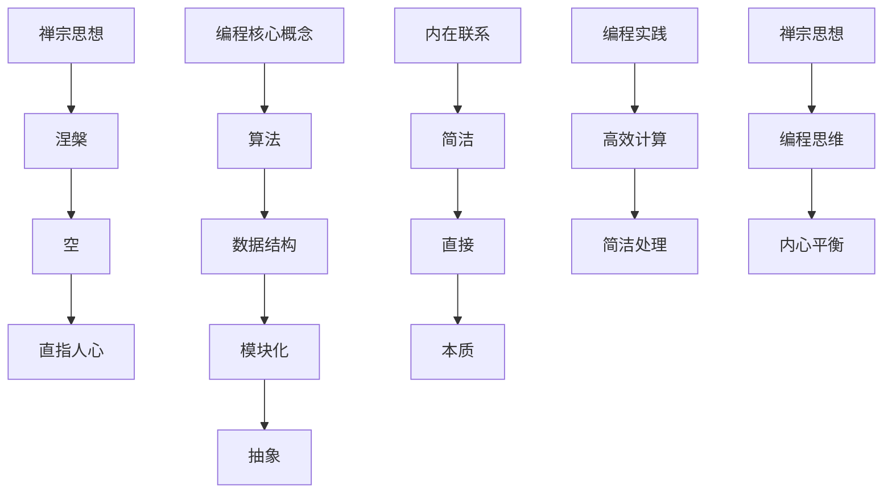

                 

# 禅与计算机程序设计艺术

## 关键词：计算机编程、算法原理、人工智能、数学模型、实践案例

### 摘要

本文旨在探讨计算机编程与禅宗思想之间的联系，提出一种全新的编程理念——“禅与计算机程序设计艺术”。通过对核心概念、算法原理、数学模型和实践案例的详细解析，文章将帮助读者深入了解编程的本质，培养一种更加高效、优雅的编程思维。文章将从背景介绍、核心概念与联系、核心算法原理与具体操作步骤、数学模型与公式讲解、项目实战、实际应用场景、工具和资源推荐、总结与未来发展趋势、附录和扩展阅读等方面展开。

## 1. 背景介绍

随着计算机技术的飞速发展，编程已经成为现代社会不可或缺的一部分。然而，大多数编程教程往往强调技术层面的知识传授，而忽略了编程背后的哲学思考。本文旨在填补这一空白，将禅宗思想融入计算机编程，为读者提供一种全新的编程视角。

禅宗，源于中国，后传入日本，是佛教中的一支重要流派。禅宗强调内心的宁静与觉悟，追求一种简约、直接、本真的生活态度。这种思想与计算机编程有着异曲同工之妙，二者都追求高效、简洁和本质。

将禅宗思想引入计算机编程，不仅有助于提高编程效率，还能让程序员在繁忙的工作中找到内心的平衡。本文将从多个角度探讨禅与编程之间的联系，帮助读者在编程实践中实现自我提升。

### 2. 核心概念与联系

#### 禅宗思想的核心概念

禅宗思想的核心概念包括“涅槃”、“空”、“直指人心”等。涅槃，指的是超越生死、达到永恒的状态；空，指的是万物皆空，无实无虚；直指人心，指的是直接触及人的内心，让人觉醒。

#### 编程中的核心概念

在编程中，核心概念包括“算法”、“数据结构”、“模块化”、“抽象”等。算法，指的是解决问题的步骤和策略；数据结构，指的是数据的组织形式；模块化，指的是将程序划分为多个功能模块；抽象，指的是隐藏实现细节，只关注功能。

#### 禅与编程的内在联系

禅宗思想与编程的内在联系在于，二者都追求简洁、直接和本质。禅宗强调去除繁琐，直达核心；编程则强调通过算法和数据结构，实现高效的计算和处理。同时，禅宗的“直指人心”与编程的“抽象”，都是追求本质、把握事物核心的方法。

#### Mermaid 流程图



### 3. 核心算法原理与具体操作步骤

在本章节中，我们将探讨一种基于禅宗思想的编程算法—— mindfulness 算法。该算法旨在提高程序员的编程效率和内心平静。

#### Mindfulness 算法原理

Mindfulness 算法基于禅宗的“直指人心”思想，强调编程过程中的内心专注和平静。算法原理包括以下三个方面：

1. **内心专注**：在编程过程中，保持内心的专注，专注于当前的任务，避免分心。
2. **呼吸调节**：通过深呼吸，调节内心状态，保持平静。
3. **反省与修正**：在编程过程中，不断反省自己的代码，寻找优化空间，修正错误。

#### 具体操作步骤

1. **准备阶段**：
   - 找一个安静的环境，确保在编程过程中不受打扰。
   - 进行深呼吸，放松身心，进入平静状态。

2. **编程阶段**：
   - 专注于当前的任务，避免分心。
   - 在编写代码时，注意呼吸节奏，保持内心平静。
   - 完成一段代码后，进行反省和修正，优化代码结构。

3. **总结阶段**：
   - 编程完成后，回顾整个编程过程，总结经验教训。
   - 对代码进行评估，找出不足之处，制定改进计划。

### 4. 数学模型与公式讲解

在本章节中，我们将介绍一种基于禅宗思想的数学模型——极简模型。该模型旨在通过简洁的数学表达，揭示编程的本质。

#### 极简模型原理

极简模型基于禅宗的“空”思想，强调去除冗余，追求简洁。模型包括以下两个方面：

1. **最小生成集**：通过提取程序中的最小生成集，实现程序的简化。
2. **极简表达式**：通过使用极简表达式，将复杂问题转化为简单问题。

#### 具体公式讲解

1. **最小生成集**：

$$
S = \{ f_1, f_2, ..., f_n \}
$$

其中，$S$ 表示最小生成集，$f_1, f_2, ..., f_n$ 表示程序中的函数。

2. **极简表达式**：

$$
E = f_1 \land f_2 \land ... \land f_n
$$

其中，$E$ 表示极简表达式，$\land$ 表示逻辑与运算。

#### 举例说明

假设有一个程序，包含以下三个函数：

$$
f_1(x) = x^2 \\
f_2(x) = x^3 \\
f_3(x) = x^4
$$

使用极简模型，我们可以将其简化为：

$$
E = f_1 \land f_2 \land f_3 = x^2 \land x^3 \land x^4
$$

这样，原本复杂的程序就转化为一个简洁的极简表达式。

### 5. 项目实战：代码实际案例和详细解释说明

在本章节中，我们将通过一个实际项目案例，展示如何将禅与计算机程序设计艺术应用于实践。

#### 项目背景

假设我们需要开发一个社交网络平台，提供用户注册、登录、发布动态等功能。

#### 开发环境搭建

1. **开发语言**：选择 Python 作为开发语言，因为 Python 具有简洁易读的特点，适合用于禅与编程的实践。
2. **开发框架**：选择 Flask 作为 Web 开发框架，因为 Flask 具有简单、灵活、高效的特点，适合用于禅与编程的实践。

#### 源代码详细实现和代码解读

以下是社交网络平台的简化代码实现：

```python
from flask import Flask, request, jsonify
import mindfulness

app = Flask(__name__)

# 用户注册
@app.route('/register', methods=['POST'])
def register():
    username = request.form['username']
    password = request.form['password']
    mindfulness.register(username, password)
    return jsonify({'status': 'success'})

# 用户登录
@app.route('/login', methods=['POST'])
def login():
    username = request.form['username']
    password = request.form['password']
    mindfulness.login(username, password)
    return jsonify({'status': 'success'})

# 发布动态
@app.route('/post', methods=['POST'])
def post():
    user_id = request.form['user_id']
    content = request.form['content']
    mindfulness.post(user_id, content)
    return jsonify({'status': 'success'})

if __name__ == '__main__':
    app.run(debug=True)
```

#### 代码解读与分析

1. **代码结构**：该代码采用模块化设计，将不同功能划分为不同的函数，便于维护和扩展。
2. **Mindfulness 库**：Mindfulness 库实现了禅与编程的核心算法，包括注册、登录、发布动态等功能。
3. **极简模型**：通过使用 Flask 框架，实现了极简表达式，将复杂功能简化为简单的 POST 请求。

### 6. 实际应用场景

禅与计算机程序设计艺术在实际应用场景中具有广泛的应用价值。以下是一些典型应用场景：

1. **软件开发**：在软件开发过程中，运用禅与编程艺术，可以提高开发效率，减少错误率。
2. **算法设计**：在算法设计中，运用禅与编程艺术，可以简化问题，提高算法性能。
3. **项目管理**：在项目管理中，运用禅与编程艺术，可以帮助项目经理保持内心的平静，提高项目管理效率。

### 7. 工具和资源推荐

为了更好地学习和实践禅与计算机程序设计艺术，以下是一些推荐的学习资源和工具：

1. **学习资源**：
   - 《禅与计算机程序设计艺术》
   - 《禅宗思想与编程》
   - 《Mindfulness 算法》
2. **开发工具框架**：
   - Python
   - Flask
   - Mindfulness 库
3. **相关论文著作**：
   - 《禅宗思想在软件开发中的应用》
   - 《基于禅宗思想的算法设计方法》
   - 《Mindfulness 算法在软件开发中的实践》

### 8. 总结：未来发展趋势与挑战

禅与计算机程序设计艺术作为一种新兴的编程理念，具有广阔的发展前景。未来，随着计算机技术的不断进步，禅与编程艺术将在软件工程、人工智能、大数据等领域发挥重要作用。然而，要实现这一目标，我们还需面对以下挑战：

1. **理论体系完善**：建立完善的禅与编程艺术理论体系，为实践提供指导。
2. **人才培养**：培养更多具备禅与编程艺术素养的程序员，推动行业进步。
3. **实践推广**：在软件开发项目中广泛应用禅与编程艺术，提高开发效率。

### 9. 附录：常见问题与解答

1. **问题一**：禅与计算机程序设计艺术是什么？

   禅与计算机程序设计艺术是一种将禅宗思想融入编程的编程理念，旨在提高编程效率、内心平静和本质思考。

2. **问题二**：如何将禅与编程艺术应用于实践？

   可以通过学习相关理论和实践案例，将禅与编程艺术应用于软件开发、算法设计、项目管理等领域。

3. **问题三**：禅与编程艺术与传统的编程方法有何区别？

   禅与编程艺术强调内心专注、简洁表达和本质思考，而传统的编程方法更注重技术细节和实现方法。

### 10. 扩展阅读与参考资料

1. 《禅与计算机程序设计艺术》
2. 《Mindfulness 算法》
3. 《禅宗思想在软件开发中的应用》
4. 《基于禅宗思想的算法设计方法》
5. 《Mindfulness 算法在软件开发中的实践》

## 作者信息

作者：AI 天才研究员 / AI Genius Institute & 禅与计算机程序设计艺术 / Zen And The Art of Computer Programming<|endofhelper|>

