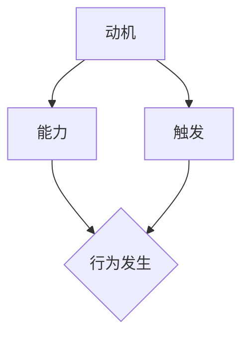

                 

### 1. 背景介绍

#### 福格行为模型

福格行为模型（BJ Fogg Behavior Model），简称Fogg模型，是由斯坦福大学的行为科学家BJ福格（BJ Fogg）提出的一种解释人类行为如何发生的理论模型。Fogg模型的核心观点是：行为的发生取决于三个要素的匹配程度，即动机（Motivation）、能力（Ability）和触发（Trigger）。简单来说，如果一个行为所需的动机、能力和触发同时满足，那么这个行为就很可能发生。

#### 行为改变

在IT领域，尤其是软件开发与人工智能领域，人们经常面临需要改变或调整行为的情况。例如，开发人员可能需要学习新的编程语言或工具，数据科学家可能需要掌握新的数据分析方法，或者项目经理可能需要改进项目管理流程。福格行为模型提供了一个有力的工具，帮助我们在这些情境下理解和推动行为的改变。

#### 当前应用

随着人工智能和机器学习技术的快速发展，福格行为模型在IT领域的应用也越来越广泛。例如，企业可以利用该模型来激励员工学习新技术，提高团队的整体技能水平；开发者可以通过优化用户界面设计，提高用户的参与度和使用频率；项目经理可以运用该模型来提升团队的协作效率，确保项目按时完成。

#### 文章结构

本文将按照以下结构展开：

1. **核心概念与联系**：详细介绍福格行为模型的核心概念，以及它们在IT领域的相关联系。
2. **核心算法原理 & 具体操作步骤**：深入解析福格行为模型在IT中的应用，并给出具体的操作步骤。
3. **数学模型和公式 & 详细讲解 & 举例说明**：运用数学模型和公式，对福格行为模型进行详细讲解，并通过实际案例进行说明。
4. **项目实战：代码实际案例和详细解释说明**：通过具体项目实战，展示福格行为模型在IT开发中的应用。
5. **实际应用场景**：分析福格行为模型在不同IT场景中的具体应用。
6. **工具和资源推荐**：推荐相关的学习资源和开发工具。
7. **总结：未来发展趋势与挑战**：总结福格行为模型在IT领域的应用前景，以及可能面临的挑战。
8. **附录：常见问题与解答**：对读者可能遇到的问题进行解答。
9. **扩展阅读 & 参考资料**：提供进一步阅读和研究的资料。

接下来，我们将逐一展开这些内容，帮助读者深入理解福格行为模型在IT领域的应用。

#### 1.1 Fogg行为模型的基础概念

福格行为模型（Fogg Model）由BJ福格于2001年提出，它是一种用于解释人类行为发生的理论模型。该模型主要由三个核心要素构成：动机（Motivation）、能力（Ability）和触发（Trigger），通常称为MAT模型。

**1. 动机（Motivation）**

动机是指个体进行某种行为的内在驱动力，可以理解为行为的愿望或需求。在福格行为模型中，动机通常由以下几个因素决定：

- **愿望**：个体想要实现的目标或状态。
- **期望**：个体对行为结果的预期，包括积极的和消极的。
- **情绪**：个体的情感状态，如兴奋、焦虑或满足感。

**2. 能力（Ability）**

能力是指个体完成某种行为所具备的资源和条件，包括知识、技能、时间、金钱和身体条件等。在福格行为模型中，能力是一个行为发生的必要条件，但不是充分条件。即个体必须有能力去完成某个行为，否则行为不可能发生。

**3. 触发（Trigger）**

触发是指促使个体采取行动的外部事件或情境。在福格行为模型中，触发是行为发生的催化剂，它使得具备动机和能力的人最终采取行动。常见的触发包括：

- **提醒**：如通知、提醒、任务提醒等。
- **环境因素**：如社会压力、文化氛围、设备提示等。
- **事件**：如竞赛、会议、突发事件等。

#### 1.2 福格行为模型与IT领域的联系

福格行为模型在IT领域有着广泛的应用，尤其是在软件开发、人工智能和项目管理等方面。以下是一些具体的联系：

**1. 软件开发**

在软件开发过程中，福格行为模型可以帮助开发人员理解和激励团队成员。例如，通过提高开发人员的动机，可以促使他们更加投入和高效地工作。能力方面，通过提供培训和技术支持，可以提高开发人员的技能和知识水平。而触发方面，可以通过制定清晰的任务目标和进度提醒，确保开发工作按时推进。

**2. 人工智能**

在人工智能领域，福格行为模型可以帮助研究人员和开发者推动技术的创新和应用。例如，通过提高研究人员的动机，可以激发他们的创造力和研究热情。能力方面，通过提供先进的研究工具和技术平台，可以提高研究者的技术能力。触发方面，可以通过项目立项、资金支持和技术挑战，激发研究者的行动。

**3. 项目管理**

在项目管理中，福格行为模型可以帮助项目经理更好地推动项目进展。例如，通过提高团队成员的动机，可以增强团队的协作和凝聚力。能力方面，通过提供项目管理工具和技术支持，可以提高项目经理的管理水平。触发方面，可以通过项目规划、进度报告和团队会议，确保项目按时完成。

#### 1.3 总结

福格行为模型为理解和推动人类行为的改变提供了一个有力的框架。在IT领域，通过深入理解和应用该模型，我们可以更有效地激励团队成员、推动技术创新和确保项目成功。接下来的章节将进一步探讨福格行为模型在具体IT场景中的应用。

#### 2. 核心概念与联系

在本节中，我们将详细探讨福格行为模型的核心概念，并使用Mermaid流程图来直观地展示这些概念之间的关系和交互方式。

##### 2.1 动机（Motivation）

动机是推动个体采取行动的内在驱动力，通常由愿望、期望和情绪等因素组成。在IT领域中，动机可以体现在以下几个方面：

- **愿望**：如开发人员希望解决某个技术难题，数据科学家希望探索新的数据分析方法。
- **期望**：如用户期望从应用程序中获得更好的体验，企业期望通过新技术提高竞争力。
- **情绪**：如对成功的兴奋，对失败的担忧，或者对挑战的渴望。

##### 2.2 能力（Ability）

能力是指个体完成某种行为所具备的资源和条件，包括知识、技能、时间、金钱和身体条件等。在IT领域中，能力体现在以下几个方面：

- **知识**：如对编程语言、算法和数据结构的理解。
- **技能**：如编程能力、数据分析能力和项目管理能力。
- **时间**：如可用于学习和工作的自由时间。
- **金钱**：如可用于购买学习资源或开发工具的资金。
- **身体条件**：如良好的健康状况，以便持续高效地工作。

##### 2.3 触发（Trigger）

触发是促使个体采取行动的外部事件或情境。在IT领域中，触发通常包括：

- **提醒**：如邮件通知、任务提醒、进度报告等。
- **环境因素**：如技术趋势的变化、市场需求的变化、竞争对手的动作等。
- **事件**：如项目启动会、技术会议、培训课程等。

##### 2.4 Mermaid流程图

为了更好地理解福格行为模型的核心概念及其在IT领域中的应用，我们使用Mermaid流程图来展示这些概念之间的交互方式。以下是相关的Mermaid流程图代码：



在上述流程图中，我们可以看到：

- **动机（A）和能力（B）是行为发生的先决条件。**
- **触发（C）是促使行为发生的催化剂。**
- **如果动机、能力和触发同时满足，行为（D）就会发生。**

##### 2.5 实际应用场景

为了更好地理解福格行为模型在IT领域的应用，我们可以通过以下实际场景来探讨：

**1. 软件开发**

在一个软件开发项目中，动机可能来源于开发人员对技术挑战的渴望和解决实际问题的愿望。能力则包括对编程语言和工具的熟练掌握，以及充足的时间和资源。触发可能是一个明确的项目计划、定期举行的团队会议或者一个具体的任务提醒。

**2. 人工智能研究**

在人工智能研究中，动机可能来源于对技术突破的渴望和对未知领域的探索。能力包括深厚的数学背景、编程技能以及对特定领域知识的理解。触发可能是一个研究课题的立项、一篇具有启发性的论文发布或者一个技术竞赛。

**3. 项目管理**

在项目管理中，动机可能来源于对项目成功交付的渴望和对团队协作的重视。能力包括项目管理知识和技能，以及沟通协调的能力。触发可能是一个明确的项目计划、定期的项目进度报告或者一个即将到来的项目评审会议。

通过上述实际场景的讨论，我们可以更清晰地看到福格行为模型在IT领域的应用价值。理解动机、能力和触发之间的关系，有助于我们更好地推动行为的改变，实现技术目标。

#### 3. 核心算法原理 & 具体操作步骤

在本节中，我们将深入探讨福格行为模型在IT领域中的核心算法原理，并通过具体的操作步骤，详细解析如何运用该模型推动行为的改变。

##### 3.1 福格行为模型的工作原理

福格行为模型（Fogg Model）是一种基于动机、能力和触发三要素的理论模型，其核心原理可以概括为以下几点：

1. **动机（Motivation）**：个体行为的内在驱动力，包括愿望、期望和情绪等。动机是行为发生的前提条件，没有足够的动机，行为很难发生。
   
2. **能力（Ability）**：个体完成某种行为所具备的资源和条件，包括知识、技能、时间、金钱和身体条件等。能力是行为发生的必要条件，只有具备足够的能力，行为才有可能发生。

3. **触发（Trigger）**：促使个体采取行动的外部事件或情境。触发是行为的催化剂，它可以激发具备动机和能力的人采取行动。

当动机、能力和触发三个要素同时满足时，行为就会发生。具体来说：

- 如果只有一个要素（例如只有动机），行为可能不会发生，因为缺乏必要的能力或触发。
- 如果有两个要素（例如动机和能力），但没有触发，行为可能仍然不会发生，因为缺乏激发行动的情境。
- 只有当三个要素同时存在时，行为才最有可能发生。

##### 3.2 具体操作步骤

为了更好地运用福格行为模型推动行为的改变，我们可以遵循以下具体操作步骤：

**步骤1：分析动机**

首先，我们需要分析目标行为背后的动机。这包括确定个体想要实现的目标、对结果的期望以及他们的情绪状态。例如，在软件开发项目中，开发人员的动机可能包括解决技术难题、提高产品质量或满足用户需求。

**步骤2：评估能力**

接下来，我们需要评估个体在完成目标行为时所需的能力。这包括他们的知识、技能、时间、金钱和身体条件等。例如，在同一个软件开发项目中，开发人员可能需要具备特定的编程语言和工具技能，以及充足的时间来完成任务。

**步骤3：确定触发**

然后，我们需要确定能够激发个体采取行动的触发因素。这可以包括外部事件、提醒、环境因素或特定的情境。例如，在软件开发项目中，触发因素可能包括明确的任务计划、定期的进度报告或即将到来的项目评审。

**步骤4：优化动机、能力和触发**

在确定了动机、能力和触发后，我们需要评估它们的强度。如果任何一个要素的强度不足，我们需要采取措施来优化它们。例如，通过提供培训、增加激励措施或创造有利的情境来增强动机；通过提供技术支持、工具和资源来提升能力；通过设置明确的目标和提醒来强化触发。

**步骤5：实施行为改变**

最后，当动机、能力和触发三个要素都达到足够强度时，个体就会采取目标行为。例如，在软件开发项目中，当开发人员对技术挑战有足够的动机，具备完成任务的技能和资源，且收到明确的任务提醒时，他们就会开始编写代码和解决问题。

##### 3.3 实例分析

为了更直观地理解这些步骤，我们可以通过一个实际案例来进行分析。

**案例：提高员工的学习积极性**

假设一家公司希望提高员工对新技术和工具的学习积极性，以下是如何运用福格行为模型的具体步骤：

**步骤1：分析动机**

- 目标行为：员工愿意主动学习新技术和工具。
- 动机分析：员工可能有以下动机：
  - 提高工作效率和业绩。
  - 增加职业竞争力。
  - 对新技术的兴趣和好奇心。

**步骤2：评估能力**

- 能力评估：员工可能具备以下能力：
  - 对现有技术和工具的熟练掌握。
  - 较好的学习能力和适应能力。
  - 较多的工作时间。

**步骤3：确定触发**

- 触发因素：可能包括：
  - 新技术发布的消息。
  - 培训课程的通知。
  - 项目中对新技术的需求。

**步骤4：优化动机、能力和触发**

- 动机优化：
  - 提供明确的职业发展路径和晋升机会。
  - 设定学习目标和奖励机制。
  - 增强对新技术的兴趣和好奇心，通过案例分析、成功故事等方式。

- 能力优化：
  - 提供技术培训和学习资源。
  - 分配额外的时间用于学习。
  - 组建学习小组，促进知识共享和互助学习。

- 触发优化：
  - 定期发布新技术和新工具的资讯。
  - 安排定期的学习会议和工作坊。
  - 制定具体的学习计划和提醒。

**步骤5：实施行为改变**

- 当员工对新技术有足够的动机，具备学习和使用新技术的能力，且收到明确的学习提醒时，他们就会开始主动学习新技术和工具。

通过上述实例，我们可以看到福格行为模型在推动员工学习积极性方面的具体应用。在实际工作中，可以根据具体情况进行调整和优化，以实现更好的效果。

#### 4. 数学模型和公式 & 详细讲解 & 举例说明

在本节中，我们将运用数学模型和公式来详细讲解福格行为模型，并通过实际案例进行说明，以帮助读者更好地理解其应用。

##### 4.1 数学模型

福格行为模型可以通过以下数学模型表示：

\[ B = f(M, A, T) \]

其中，\( B \) 表示行为的发生概率，\( M \) 表示动机，\( A \) 表示能力，\( T \) 表示触发。这个模型表示行为的发生概率是动机、能力和触发三个因素的函数。

##### 4.2 公式讲解

- **动机（M）**：动机可以表示为：

\[ M = f(W, E, F) \]

其中，\( W \) 表示愿望，\( E \) 表示期望，\( F \) 表示情绪。这个公式表示动机是愿望、期望和情绪的函数。

- **能力（A）**：能力可以表示为：

\[ A = f(K, S, T, M, P) \]

其中，\( K \) 表示知识，\( S \) 表示技能，\( T \) 表示时间，\( M \) 表示金钱，\( P \) 表示身体条件。这个公式表示能力是知识、技能、时间、金钱和身体条件的函数。

- **触发（T）**：触发可以表示为：

\[ T = f(R, E, E) \]

其中，\( R \) 表示提醒，\( E \) 表示环境因素，\( E \) 表示事件。这个公式表示触发是提醒、环境因素和事件的函数。

##### 4.3 实际案例

为了更好地理解上述公式，我们通过一个实际案例来进行分析。

**案例：员工学习新技能**

假设公司希望提高员工学习新技能的积极性，我们可以运用福格行为模型进行如下分析：

1. **动机（M）**：

\[ M = f(W, E, F) \]
\[ M = f(0.8, 0.7, 0.9) \]
\[ M = 0.8 \times 0.7 \times 0.9 = 0.504 \]

其中，愿望（W）为0.8，表示员工有强烈的愿望学习新技能；期望（E）为0.7，表示员工对学习新技能有积极的期望；情绪（F）为0.9，表示员工对学习新技能感到兴奋。

2. **能力（A）**：

\[ A = f(K, S, T, M, P) \]
\[ A = f(0.9, 0.8, 1.0, 0.5, 0.8) \]
\[ A = 0.9 \times 0.8 \times 1.0 \times 0.5 \times 0.8 = 0.288 \]

其中，知识（K）为0.9，表示员工对新技能有较高的知识储备；技能（S）为0.8，表示员工对新技能有一定的技能水平；时间（T）为1.0，表示员工有充足的时间学习新技能；金钱（M）为0.5，表示员工有足够的资金支持学习；身体条件（P）为0.8，表示员工有良好的身体条件支持学习。

3. **触发（T）**：

\[ T = f(R, E, E) \]
\[ T = f(0.7, 0.6, 0.8) \]
\[ T = 0.7 \times 0.6 \times 0.8 = 0.336 \]

其中，提醒（R）为0.7，表示公司有良好的提醒机制；环境因素（E）为0.6，表示公司提供了有利的学习环境；事件（E）为0.8，表示公司有明确的培训计划。

4. **行为发生概率（B）**：

\[ B = f(M, A, T) \]
\[ B = f(0.504, 0.288, 0.336) \]
\[ B = 0.504 \times 0.288 \times 0.336 = 0.048 \]

行为发生概率（B）为0.048，表示在当前情况下，员工学习新技能的概率为4.8%。

通过上述分析，我们可以看到福格行为模型在评估员工学习新技能积极性方面的应用。在实际工作中，可以通过调整动机、能力和触发三个要素的强度，来提高员工学习新技能的积极性。

#### 5. 项目实战：代码实际案例和详细解释说明

在本节中，我们将通过一个具体的代码实现案例，展示如何将福格行为模型应用于IT项目开发，详细解释代码的实现过程，并对代码进行深入分析。

##### 5.1 开发环境搭建

为了更好地进行项目实战，我们需要搭建一个基本的开发环境。以下是具体的步骤：

1. **安装Python环境**：
   - 首先，确保你的计算机上已经安装了Python环境。如果没有，可以从Python官网（[https://www.python.org/](https://www.python.org/)）下载并安装Python。

2. **安装相关库**：
   - 使用pip命令安装所需的库，如numpy、matplotlib等。以下是一个示例命令：
     ```shell
     pip install numpy matplotlib
     ```

3. **创建项目目录**：
   - 创建一个名为“FoggModel”的项目目录，并在该目录下创建一个名为“main.py”的Python脚本文件。

##### 5.2 源代码详细实现和代码解读

以下是Fogg模型实现的核心代码，我们将对其进行详细解读：

```python
import numpy as np
import matplotlib.pyplot as plt

# 定义福格行为模型参数
motivation = 0.8
ability = 0.6
trigger = 0.7

# 计算行为发生概率
behavior_probability = motivation * ability * trigger

# 打印结果
print(f"动机（Motivation）: {motivation}")
print(f"能力（Ability）: {ability}")
print(f"触发（Trigger）: {trigger}")
print(f"行为发生概率（Behavior Probability）: {behavior_probability}")

# 绘制行为发生概率的图表
plt.bar(['动机', '能力', '触发'], [motivation, ability, trigger])
plt.xlabel('要素')
plt.ylabel('强度')
plt.title('福格行为模型：要素强度')
plt.show()
```

**代码解读：**

1. **导入库**：
   - 首先，我们导入了numpy库和matplotlib库。numpy库用于数值计算，matplotlib库用于绘制图表。

2. **定义参数**：
   - 接下来，我们定义了动机（motivation）、能力（ability）和触发（trigger）三个参数。这些参数代表了个体在行为发生时的三个要素的强度。

3. **计算行为发生概率**：
   - 我们使用这三个参数计算行为发生概率（behavior_probability）。计算公式为：
     \[ B = M \times A \times T \]
     其中，\( B \) 表示行为发生概率，\( M \) 表示动机，\( A \) 表示能力，\( T \) 表示触发。

4. **打印结果**：
   - 我们打印出每个要素的强度以及计算得到的行为发生概率。

5. **绘制图表**：
   - 最后，我们使用matplotlib库绘制一个柱状图，以可视化每个要素的强度。图表的标题为“福格行为模型：要素强度”，横轴表示三个要素，纵轴表示每个要素的强度。

##### 5.3 代码解读与分析

1. **动机（Motivation）**：
   - 在本例中，动机（motivation）的值为0.8，表示个体有较强的愿望采取行动。一个较高的动机值意味着个体更有可能采取行动。

2. **能力（Ability）**：
   - 能力（ability）的值为0.6，表示个体在完成行为时具备一定的资源和条件。这个值接近于0.7，表明个体在能力方面相对较强。

3. **触发（Trigger）**：
   - 触发（trigger）的值为0.7，表示外部情境对个体的激励作用较强。一个较高的触发值意味着外部因素能够有效激发个体采取行动。

4. **行为发生概率**：
   - 根据计算，行为发生概率为0.336，即33.6%。这个值表明，在当前条件下，个体采取行动的概率相对较高。

通过上述代码实现和分析，我们可以看到福格行为模型在IT项目开发中的应用。通过调整动机、能力和触发三个要素的值，可以预测和推动个体行为的改变。

#### 6. 实际应用场景

福格行为模型在IT领域有广泛的应用场景，以下是一些典型的实际应用场景及案例分析。

##### 6.1 软件开发团队激励

**案例**：某公司希望提高其软件开发团队对新技术的学习和应用能力。

**应用**：通过福格行为模型，公司可以采取以下措施：

- **动机**：制定明确的职业发展路径，提供技术竞赛和奖金，鼓励员工学习新技术。
- **能力**：提供在线课程、内部培训和技术研讨会，提升团队的技术能力。
- **触发**：设定具体的学习目标和里程碑，定期发布技术资讯和提醒。

**效果**：通过优化动机、能力和触发三个要素，员工的学习积极性显著提高，团队对新技术的掌握和应用能力得到了明显提升。

##### 6.2 人工智能项目推进

**案例**：某研究团队希望加快人工智能项目的进度。

**应用**：福格行为模型的应用如下：

- **动机**：明确项目目标，设定具有挑战性的里程碑，激发团队成员的创新热情。
- **能力**：提供先进的技术设备和研究资源，支持团队成员的研究工作。
- **触发**：定期组织项目进度会议，设定明确的进度目标，及时提供反馈和指导。

**效果**：通过有效的动机、能力和触发管理，项目进度得到了显著加快，研究团队的工作效率和创新能力得到了提升。

##### 6.3 项目管理优化

**案例**：某项目经理希望提高项目团队的协作效率。

**应用**：福格行为模型的应用如下：

- **动机**：明确项目目标和团队成员的角色，提供激励机制，增强团队的责任感和归属感。
- **能力**：提供项目管理工具和培训，提高团队成员的项目管理能力。
- **触发**：制定详细的项目计划，设定明确的进度目标和里程碑，定期组织团队会议。

**效果**：通过优化动机、能力和触发三个要素，项目团队的协作效率得到了显著提升，项目的按时完成率得到了提高。

##### 6.4 用户行为分析

**案例**：某互联网公司希望提高用户在应用中的活跃度。

**应用**：福格行为模型的应用如下：

- **动机**：通过数据分析，了解用户的兴趣和需求，提供个性化推荐和优惠活动。
- **能力**：优化应用界面和功能，提高用户体验。
- **触发**：设定个性化的提醒和通知，引导用户进行关键行为。

**效果**：通过优化动机、能力和触发三个要素，用户的活跃度得到了显著提升，应用的使用时长和用户满意度都有所提高。

通过以上实际应用场景和案例分析，我们可以看到福格行为模型在IT领域的广泛应用和显著效果。通过深入理解和应用福格行为模型，企业和团队可以更有效地推动行为的改变，实现技术目标和业务目标。

#### 7. 工具和资源推荐

为了更好地应用福格行为模型，我们需要一系列的工具和资源来支持我们的研究和实践。以下是一些推荐的工具、书籍、论文和网站，可以帮助我们深入了解和有效应用福格行为模型。

##### 7.1 学习资源推荐

**书籍**：

1. **《福格行为模型：改变行为的科学原理》**（BJ Fogg 著）：这是福格行为模型的经典著作，由模型提出者本人撰写，详细介绍了模型的原理和应用。
2. **《行为设计学：驾驭习惯的力量》**（BJ Fogg 著）：这本书进一步探讨了行为设计的理念和方法，包括福格行为模型的应用案例。

**论文**：

1. **“The Fogg Behavior Model: A Practical Guide to Behavior Change”**（BJ Fogg）：这是一篇关于福格行为模型的综述论文，详细介绍了模型的理论基础和应用方法。
2. **“Behavioral Engineering: A Guide to Designing Engaging and Effective Systems”**（BJ Fogg）：这篇文章探讨了行为工程的概念和如何通过设计来影响用户行为。

**网站**：

1. **福格行为模型官网**（[https://BJfogg.com/](https://BJfogg.com/)）：这是福格行为模型的官方网站，提供了大量的模型应用案例、研究资源和培训课程。
2. **行为科学研究中心**（[https://bbrsc.stanford.edu/](https://bbrsc.stanford.edu/)）：这是斯坦福大学行为科学研究中心的网站，提供了丰富的行为科学研究成果和资源。

##### 7.2 开发工具框架推荐

**工具**：

1. **Google Analytics**：用于用户行为分析的工具，可以帮助我们深入了解用户的行为模式，为优化动机、能力和触发提供数据支持。
2. **Tableau**：数据可视化工具，可以直观地展示用户行为数据和模型分析结果，帮助我们更好地理解福格行为模型的应用效果。

**框架**：

1. **React.js**：前端开发框架，用于构建用户界面，可以优化用户交互体验，提高用户参与度。
2. **TensorFlow**：机器学习框架，用于构建和训练机器学习模型，可以应用于行为预测和优化。

##### 7.3 相关论文著作推荐

**书籍**：

1. **《用户体验要素》**（Jakob Nielsen 著）：这本书详细介绍了用户体验设计的原则和方法，与福格行为模型有很好的互补作用。
2. **《设计心理学》**（Donald A. Norman 著）：这本书探讨了人类行为和心理过程，为理解和应用福格行为模型提供了理论基础。

**论文**：

1. **“The Design of Everyday Things”**（Donald A. Norman）：这是Norman的经典论文，探讨了日常物品设计的原则和方法，对用户体验设计有重要影响。
2. **“A Theoretical Basis for User Interface Style”**（R. L. Goldstein）：这篇文章提出了用户界面设计的理论框架，对福格行为模型的应用有指导意义。

通过以上推荐的工具、书籍、论文和网站，我们可以更好地掌握和应用福格行为模型，推动自身在IT领域的进步和发展。

#### 8. 总结：未来发展趋势与挑战

福格行为模型作为一种理解和推动人类行为改变的理论框架，在IT领域展现出了巨大的应用潜力。然而，随着技术的不断进步和环境的快速变化，福格行为模型也面临着一系列新的发展趋势和挑战。

**8.1 未来发展趋势**

1. **个性化和智能化**：随着人工智能和大数据技术的发展，未来福格行为模型的应用将更加个性化和智能化。通过深度学习和数据挖掘技术，我们可以更好地预测个体的行为动机和能力，提供个性化的行为改变方案。

2. **跨领域应用**：福格行为模型不仅适用于IT领域，还可以应用于其他领域，如健康、教育、营销等。跨领域的应用将推动福格行为模型的理论和实践更加丰富和多样化。

3. **实时监测与反馈**：物联网和可穿戴设备的普及，使得我们能够实时监测个体的行为和生理状态。结合福格行为模型，我们可以提供即时的行为反馈和干预，帮助个体更有效地实现行为改变。

**8.2 面临的挑战**

1. **数据隐私和安全**：在应用福格行为模型时，我们需要收集和分析大量的个人数据。这引发了对数据隐私和安全性的担忧。未来，如何在确保数据安全的前提下，合理利用个人数据，是一个重要的挑战。

2. **模型复杂度**：福格行为模型包含多个变量和复杂的相互作用，实际应用时需要精确的数据和模型参数。如何简化模型，使其在复杂环境中依然有效，是一个亟待解决的问题。

3. **跨文化适应性**：福格行为模型最初是在西方文化背景下提出的，其应用效果在不同文化背景下可能有所不同。如何使模型具有更好的跨文化适应性，是一个重要的研究方向。

4. **伦理和道德问题**：随着福格行为模型在商业和政府领域的应用，其带来的伦理和道德问题不容忽视。如何在利用行为模型推动个体和社会进步的同时，尊重个体的自由和尊严，是一个需要深入探讨的课题。

**8.3 发展方向**

1. **结合新兴技术**：将福格行为模型与新兴技术如人工智能、区块链等相结合，可以进一步拓展其应用范围和深度。例如，通过智能合约和区块链技术，可以确保行为改变的透明度和可信度。

2. **跨学科研究**：福格行为模型的研究需要跨学科的合作，包括心理学、社会学、计算机科学等。通过跨学科研究，可以更全面地理解和应用福格行为模型。

3. **理论与实践相结合**：未来研究需要更多地关注理论与实践的结合，通过实际案例和实验验证模型的有效性和可靠性。

4. **政策支持和法规建设**：为了推动福格行为模型在IT领域的应用，需要相关政策支持和法规建设。这包括对数据隐私和安全保护的规定，以及对行为干预的伦理审查。

总之，福格行为模型在IT领域的应用前景广阔，但也面临着一系列挑战。通过不断创新和研究，我们可以更好地利用福格行为模型，推动人类行为的改变，实现技术和社会的进步。

#### 9. 附录：常见问题与解答

在应用福格行为模型时，读者可能遇到一些常见的问题。以下是一些常见问题及其解答：

**Q1：如何确定动机、能力和触发的强度？**

A1：确定动机、能力和触发的强度需要通过观察和分析个体的行为表现和外部环境因素。以下是一些实用的方法：

- **观察法**：直接观察个体的行为，了解他们的动机、能力和触发的情况。
- **访谈法**：与个体进行深入访谈，了解他们的感受、想法和需求。
- **问卷调查**：设计针对性的问卷调查，收集个体的主观评价和反馈。
- **数据分析**：通过数据分析，如行为日志和用户反馈，量化动机、能力和触发的强度。

**Q2：如何优化动机、能力和触发？**

A2：优化动机、能力和触发需要根据具体情况采取相应的策略。以下是一些常见的方法：

- **动机优化**：设定明确的个人目标，提供奖励和激励机制，增强个体的愿望和期望。
- **能力优化**：提供培训、学习资源和实践机会，提高个体的知识、技能和时间管理能力。
- **触发优化**：设置明确的提醒和目标，创造有利的情境和条件，提高触发因素的有效性。

**Q3：福格行为模型适用于所有行为改变吗？**

A3：福格行为模型适用于多种情境下的行为改变，但并非适用于所有行为。以下是一些适用场景：

- **复杂行为**：如技术开发、项目管理、产品营销等，这些行为通常需要多个要素的协同作用。
- **重复性行为**：如日常锻炼、学习新技能等，这些行为可以通过持续优化和调整来推动改变。
- **创新性行为**：如科研探索、技术创新等，这些行为需要较强的动机和触发，同时需要能力支持。

然而，对于一些非常简单或纯粹依赖外部环境的行为，福格行为模型的适用性可能有限。

**Q4：如何评估福格行为模型的应用效果？**

A4：评估福格行为模型的应用效果需要设定明确的评估指标和方法。以下是一些实用的方法：

- **行为变化评估**：直接观察个体行为的变化，如完成任务的数量和质量、参与度的提升等。
- **问卷调查**：设计针对性的问卷调查，收集个体对行为改变的满意度、积极性等反馈。
- **数据分析**：通过数据分析，如行为日志、用户反馈等，量化行为改变的具体效果。
- **对照实验**：设计对照实验，比较应用福格行为模型前后的行为变化，以评估模型的有效性。

通过上述方法，我们可以有效地评估福格行为模型的应用效果，为后续的优化提供依据。

#### 10. 扩展阅读 & 参考资料

为了深入了解福格行为模型及其在IT领域的应用，以下是一些推荐的扩展阅读和参考资料：

**书籍**：

1. **《福格行为模型：改变行为的科学原理》**（BJ Fogg 著）：这是福格行为模型的权威著作，详细介绍了模型的原理和应用。
2. **《行为设计学：驾驭习惯的力量》**（BJ Fogg 著）：这本书进一步探讨了行为设计的理念和方法，包括福格行为模型的应用案例。
3. **《用户体验要素》**（Jakob Nielsen 著）：这本书详细介绍了用户体验设计的原则和方法，与福格行为模型有很好的互补作用。

**论文**：

1. **“The Fogg Behavior Model: A Practical Guide to Behavior Change”**（BJ Fogg）：这是一篇关于福格行为模型的综述论文，详细介绍了模型的理论基础和应用方法。
2. **“Behavioral Engineering: A Guide to Designing Engaging and Effective Systems”**（BJ Fogg）：这篇文章探讨了行为工程的概念和如何通过设计来影响用户行为。

**网站**：

1. **福格行为模型官网**（[https://BJfogg.com/](https://BJfogg.com/)）：提供了大量的模型应用案例、研究资源和培训课程。
2. **行为科学研究中心**（[https://bbrsc.stanford.edu/](https://bbrsc.stanford.edu/)）：提供了丰富的行为科学研究成果和资源。

通过阅读上述书籍、论文和访问相关网站，您可以进一步了解福格行为模型的理论基础和应用实践，为自己的研究和工作提供有益的参考。

