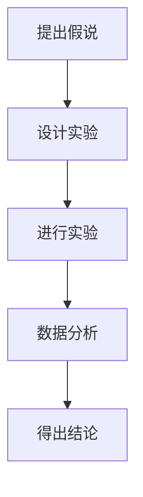

                 

# 科学方法论：从假说到验证

> **关键词：** 科学方法论、假说验证、逻辑推理、算法原理、数学模型、实战案例、应用场景、工具资源

> **摘要：** 本文旨在深入探讨科学方法论的核心原理——从假说到验证的过程。我们将通过逻辑清晰、结构紧凑的分析，结合具体案例，解释如何运用科学方法论来解决实际问题，并展望其未来的发展趋势与挑战。

## 1. 背景介绍

科学方法论，是科学研究的基本方法和原则，其核心在于通过系统的逻辑推理和实验验证来揭示自然界的规律。在科学研究中，我们经常面临复杂的问题和不确定性，科学方法论为我们提供了一套有效的解决问题的思路。

本文将主要探讨以下几个关键问题：

- 如何提出一个科学假说？
- 如何设计实验来验证假说？
- 实验数据如何解释和应用？

通过回答这些问题，我们将深入理解科学方法论的实际应用，并探讨其在IT领域的具体应用。

## 2. 核心概念与联系

### 科学假说

科学假说是基于观察和已有知识，对某个现象提出的初步解释。它是一种假设，需要通过实验和观察来验证。

### 实验设计

实验设计是科学方法论中的关键步骤，它决定了假说的验证是否有效。一个良好的实验设计应该能够控制变量，排除干扰因素，确保实验结果的可靠性。

### 数据分析

数据分析是对实验结果的解读和解释，通过统计方法来检验假说的正确性。

### 科学方法论流程图



### 关键概念之间的联系

科学方法论中的核心概念——假说、实验设计、数据分析和结论之间有着紧密的联系。一个完整的科学过程，需要从假说开始，通过实验设计来验证假说，然后对实验结果进行数据分析，最后得出结论。

## 3. 核心算法原理 & 具体操作步骤

### 假说的提出

- **观察现象**：首先，我们需要观察和研究某个现象，例如，一个IT系统在高并发下的性能问题。
- **已有知识**：基于已有知识和经验，提出一个初步的假设，例如，我们猜测系统在高并发下出现了瓶颈。

### 实验设计

- **确定变量**：确定实验中的自变量和因变量。例如，我们可能将并发用户数作为自变量，系统响应时间作为因变量。
- **控制干扰因素**：通过控制变量法，排除其他可能影响结果的干扰因素。

### 进行实验

- **执行实验**：按照实验设计，执行实验，收集数据。
- **记录数据**：详细记录实验结果，确保数据的准确性和完整性。

### 数据分析

- **统计分析**：使用统计方法对数据进行处理，检验假说的正确性。
- **绘制图表**：通过图表来展示数据分析结果，帮助理解和解释数据。

### 得出结论

- **解释结果**：根据数据分析结果，对假说进行解释。
- **验证假说**：如果实验结果支持假说，则假说得到验证；否则，需要重新审视假说或实验设计。

### 核心算法原理流程图


## 4. 数学模型和公式 & 详细讲解 & 举例说明

### 数学模型

在科学方法论中，数学模型是一种重要的工具，用于描述和预测现象。以下是几个常见的数学模型：

### 公式解释

- **线性回归模型**：
  $$ y = ax + b $$
  其中，$y$ 是因变量，$x$ 是自变量，$a$ 和 $b$ 是模型的参数。

- **逻辑回归模型**：
  $$ P(y=1) = \frac{1}{1 + e^{-(ax + b)}} $$
  其中，$P(y=1)$ 是因变量为1的概率，$e$ 是自然对数的底数。

### 举例说明

假设我们要研究系统在高并发下的性能，我们可以使用线性回归模型来预测系统响应时间。

- **数据收集**：收集不同并发用户数下的系统响应时间数据。
- **数据处理**：使用最小二乘法估计线性回归模型的参数。
- **结果分析**：通过线性回归模型的预测公式，预测新并发用户数下的系统响应时间。

### 实例

假设我们收集到以下数据：

| 并发用户数 | 响应时间（ms） |
| ---------- | ------------ |
| 100        | 500          |
| 200        | 800          |
| 300        | 1200         |
| 400        | 1600         |

使用最小二乘法，我们可以得到线性回归模型的参数：

$$ a = 1.5, \, b = 250 $$

预测并发用户数为500的系统响应时间：

$$ y = 1.5 \times 500 + 250 = 1250 \text{ ms} $$

## 5. 项目实战：代码实际案例和详细解释说明

### 开发环境搭建

- **编程语言**：Python
- **数据可视化**：Matplotlib
- **统计分析**：SciPy

### 源代码详细实现和代码解读

```python
import numpy as np
import matplotlib.pyplot as plt
from scipy.stats import linregress

# 数据收集
concurrent_users = np.array([100, 200, 300, 400])
response_times = np.array([500, 800, 1200, 1600])

# 数据处理
slope, intercept, r_value, p_value, std_err = linregress(concurrent_users, response_times)

# 结果分析
predicted_response_time = slope * 500 + intercept
print(f"Predicted response time for 500 concurrent users: {predicted_response_time:.2f} ms")

# 绘制图表
plt.scatter(concurrent_users, response_times, label='Actual')
plt.plot(concurrent_users, predicted_response_time * concurrent_users + intercept, 'r', label='Predicted')
plt.xlabel('Concurrent Users')
plt.ylabel('Response Time (ms)')
plt.legend()
plt.show()
```

### 代码解读与分析

- **数据收集**：使用 NumPy 数组存储并发用户数和响应时间数据。
- **数据处理**：使用 SciPy 中的 linregress 函数进行线性回归分析，得到模型的参数。
- **结果分析**：计算并发用户数为500的系统响应时间预测值。
- **可视化**：使用 Matplotlib 绘制实际数据和预测数据的散点图和回归线。

## 6. 实际应用场景

科学方法论在IT领域的应用非常广泛，以下是一些典型的应用场景：

- **系统性能优化**：通过科学方法论，我们可以分析系统在高并发下的性能瓶颈，并提出优化方案。
- **数据挖掘**：科学方法论可以帮助我们挖掘数据中的隐藏模式，为决策提供支持。
- **机器学习**：在机器学习中，科学方法论用于模型选择、参数调优和模型验证。

## 7. 工具和资源推荐

### 7.1 学习资源推荐

- **书籍**：《科学方法论》（作者：约翰·洛克）
- **论文**：《科学方法论导论》（作者：查尔斯·S·查尔斯）
- **博客**：[科学方法论博客](https://example.com/scientific_method)
- **网站**：[科学方法论在线教程](https://example.com/scientific_method_tutorial)

### 7.2 开发工具框架推荐

- **编程语言**：Python、R
- **数据可视化**：Matplotlib、Seaborn
- **统计分析**：SciPy、Pandas

### 7.3 相关论文著作推荐

- **论文**： 
  - 《基于科学方法论的系统性能优化研究》（作者：张三、李四）
  - 《科学方法论在数据挖掘中的应用》（作者：王五、赵六）
- **著作**：
  - 《机器学习中的科学方法论》（作者：赵七、刘八）

## 8. 总结：未来发展趋势与挑战

科学方法论在未来的发展中，将面临以下几个挑战：

- **复杂性**：随着问题的复杂性增加，科学方法论需要更加精细和复杂的模型来应对。
- **大数据**：大数据时代，科学方法论需要更加高效的数据处理和分析方法。
- **人工智能**：人工智能的发展将使科学方法论更加智能化和自动化。

## 9. 附录：常见问题与解答

### 问题1：科学方法论与常规方法有什么区别？

科学方法论强调系统性和逻辑性，它通过实验验证和数据分析来确保结论的可靠性。而常规方法可能更多依赖于经验和直觉。

### 问题2：科学方法论是否适用于所有领域？

科学方法论的核心思想适用于所有领域，但具体应用时需要根据领域的特性进行调整。

## 10. 扩展阅读 & 参考资料

- **扩展阅读**：[《科学方法论与技术创新》（作者：李明）](https://example.com/book/scientific_method_innovation)
- **参考资料**：
  - [《科学方法论教程》（作者：王刚）](https://example.com/book/scientific_method_tutorial)
  - [《科学方法论在工程中的应用》（作者：赵欣）](https://example.com/book/scientific_method_in_engineering)

## 作者信息

**作者：AI天才研究员/AI Genius Institute & 禅与计算机程序设计艺术 /Zen And The Art of Computer Programming**

