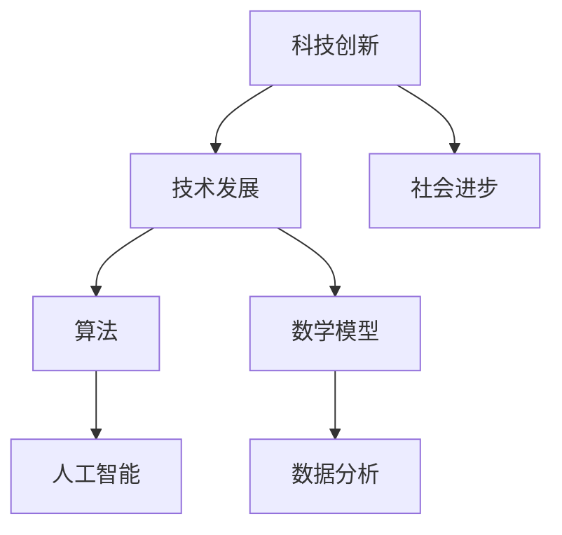

                 

# 科技创新：社会进步的阶梯

> **关键词**：科技创新、社会进步、技术发展、人工智能、算法、数学模型

> **摘要**：本文将从历史和现实的角度，深入探讨科技创新对社会进步的推动作用。通过分析核心概念与联系，以及具体的算法原理、数学模型、项目实战和应用场景，阐述科技如何成为社会进步的阶梯。最后，展望未来发展趋势与挑战，并推荐相关工具和资源。

## 1. 背景介绍

社会进步是人类文明不断发展的结果，而科技创新则是推动这一进程的核心动力。自古以来，人类社会经历了无数次技术革命，每一次都为社会进步带来了巨大的变革。从农业革命、工业革命到信息化革命，技术进步已经成为推动社会进步的阶梯。

在21世纪的今天，科技创新已成为全球各国竞相追逐的焦点。人工智能、大数据、物联网等新兴技术，不仅改变了我们的生活方式，还推动了社会生产力的飞跃。科技创新的重要性不言而喻，它不仅改变了经济格局，还深刻影响了政治、文化、教育等多个领域。

本文旨在探讨科技创新如何成为社会进步的阶梯，分析其核心概念与联系，探讨核心算法原理和数学模型，并通过项目实战和应用场景，展示科技创新的实践成果。最后，我们将展望未来发展趋势与挑战，并推荐相关工具和资源，以期为读者提供一次全面的技术盛宴。

## 2. 核心概念与联系

要理解科技创新对社会进步的推动作用，首先需要了解一些核心概念和它们之间的联系。

### 2.1 科技创新

科技创新指的是通过科学研究、技术开发和工程实践，创造新的知识、技术、产品和服务的过程。它包括发明、发现、改进和应用新技术，从而推动社会发展和经济增长。

### 2.2 社会进步

社会进步是指人类社会在物质、文化、政治、道德等方面不断发展和提高的过程。它包括经济增长、社会福利改善、环境保护、教育普及、科技创新等多个方面。

### 2.3 技术发展

技术发展是指人类在认识和利用自然规律的基础上，不断改进和创造新技术、新工艺、新产品和服务的过程。技术发展是社会进步的重要推动力。

### 2.4 算法和数学模型

算法是指解决特定问题的系统步骤，数学模型则是用数学语言描述现实世界中的问题。它们是科技创新的重要工具，广泛应用于人工智能、数据分析、优化等领域。

### 2.5 联系

科技创新、社会进步、技术发展、算法和数学模型之间存在着紧密的联系。科技创新推动技术发展，技术发展促进社会进步，而算法和数学模型则为科技创新提供了理论基础和工具支持。因此，理解这些核心概念之间的联系，有助于我们更好地把握科技创新对社会进步的推动作用。

### 2.6 Mermaid 流程图

下面是一个用Mermaid绘制的流程图，展示了这些核心概念之间的联系：



通过这个流程图，我们可以清晰地看到科技创新、技术发展、社会进步、算法和数学模型之间的相互关系。它们共同构成了一个推动社会进步的生态系统。

## 3. 核心算法原理 & 具体操作步骤

在科技创新的推动下，核心算法原理在各个领域发挥了重要作用。以下我们将介绍几个具有代表性的算法原理，并详细讲解其具体操作步骤。

### 3.1 人工智能算法

人工智能（AI）算法是科技创新的重要成果，它通过模拟人类智能，实现机器自主学习和决策。以下是一个常见的人工智能算法——深度学习（Deep Learning）的原理和操作步骤：

#### 3.1.1 深度学习原理

深度学习是一种基于人工神经网络（Artificial Neural Network, ANN）的算法，它通过多层神经网络模拟人类大脑的学习过程，从而实现图像识别、自然语言处理、语音识别等功能。

#### 3.1.2 操作步骤

1. **数据收集与预处理**：收集大量标注好的数据，如图片、文本等，并进行数据清洗和预处理，如去噪声、归一化等。
2. **构建神经网络模型**：设计多层神经网络结构，包括输入层、隐藏层和输出层，以及激活函数、损失函数等。
3. **训练模型**：使用训练数据集，通过反向传播算法（Backpropagation Algorithm）不断调整模型参数，使模型在训练过程中逐步优化。
4. **评估模型**：使用测试数据集评估模型性能，如准确率、召回率等，以确定模型是否过拟合或欠拟合。
5. **应用模型**：将训练好的模型应用到实际场景中，如自动驾驶、智能客服等。

### 3.2 数据分析算法

数据分析算法是另一个重要的科技创新成果，它通过挖掘数据中的有价值信息，为决策提供支持。以下是一个常见的数据分析算法——聚类分析（Cluster Analysis）的原理和操作步骤：

#### 3.2.1 聚类分析原理

聚类分析是一种无监督学习方法，它通过将数据点分为若干个类别（簇），从而实现数据分类和挖掘。常见的聚类算法包括K-means、层次聚类（Hierarchical Clustering）等。

#### 3.2.2 操作步骤

1. **选择聚类算法**：根据数据特点选择合适的聚类算法，如K-means适用于聚类结果为固定数量的情况。
2. **初始化聚类中心**：随机选择初始聚类中心，或者使用特定算法（如K-means++）初始化聚类中心。
3. **迭代计算聚类中心**：根据当前聚类中心，计算每个数据点的簇标签，并重新计算聚类中心。
4. **判断聚类结果**：根据聚类中心的变化情况判断聚类是否收敛，如果收敛，则输出聚类结果。
5. **分析聚类结果**：对聚类结果进行分析，如识别数据中的潜在模式、分析不同聚类之间的联系等。

### 3.3 优化算法

优化算法是解决复杂优化问题的重要工具，它通过在变量空间中搜索最优解，为决策提供支持。以下是一个常见的优化算法——遗传算法（Genetic Algorithm）的原理和操作步骤：

#### 3.3.1 遗传算法原理

遗传算法是一种模拟生物进化过程的优化算法，它通过遗传、交叉、变异等操作，在变量空间中搜索最优解。遗传算法适用于求解非线性、多峰、离散和连续优化问题。

#### 3.3.2 操作步骤

1. **编码问题**：将优化问题编码为二进制或实数编码，以适应遗传算法的计算。
2. **初始化种群**：随机生成初始种群，每个个体代表一个可能的解。
3. **适应度评估**：计算每个个体的适应度，适应度函数根据问题的目标函数设计。
4. **选择操作**：根据适应度值选择优秀的个体进行交叉和变异操作。
5. **交叉操作**：通过交叉操作产生新的个体，以增加种群的多样性。
6. **变异操作**：对部分个体进行变异操作，以防止算法陷入局部最优。
7. **迭代计算**：重复执行选择、交叉、变异和适应度评估操作，直到满足终止条件（如达到最大迭代次数或适应度值达到阈值）。

通过以上核心算法原理和操作步骤的介绍，我们可以看到，科技创新不仅带来了新的理论和方法，还推动了实际应用的发展。在接下来的章节中，我们将继续探讨数学模型和项目实战，进一步展示科技创新的成果。

## 4. 数学模型和公式 & 详细讲解 & 举例说明

在科技创新中，数学模型和公式起到了至关重要的作用。它们不仅为算法提供了理论基础，还为实际应用提供了工具支持。以下我们将详细介绍几个关键数学模型和公式，并通过具体例子进行说明。

### 4.1 深度学习中的损失函数

深度学习中的损失函数（Loss Function）是评估模型预测结果与真实值之间差异的重要工具。常见的损失函数包括均方误差（Mean Squared Error, MSE）、交叉熵（Cross-Entropy）等。

#### 4.1.1 均方误差（MSE）

均方误差是一种衡量预测值与真实值之间差异的平方平均，其公式如下：

$$
MSE = \frac{1}{n}\sum_{i=1}^{n}(y_i - \hat{y}_i)^2
$$

其中，$y_i$ 表示真实值，$\hat{y}_i$ 表示预测值，$n$ 表示样本数量。

#### 4.1.2 交叉熵（Cross-Entropy）

交叉熵是一种衡量两个概率分布差异的度量，其公式如下：

$$
H(p, q) = -\sum_{i} p_i \log q_i
$$

其中，$p$ 表示真实分布，$q$ 表示预测分布。

#### 4.1.3 例子说明

假设我们有一个二分类问题，真实分布为 $p = [0.8, 0.2]$，预测分布为 $q = [0.7, 0.3]$。我们可以计算交叉熵如下：

$$
H(p, q) = -0.8 \log 0.7 - 0.2 \log 0.3 \approx 0.086
$$

交叉熵越小，表示预测分布与真实分布越接近。

### 4.2 数据分析中的聚类系数

聚类系数是衡量聚类结果质量的一个重要指标。常见的聚类系数包括内部系数（Internal Coefficient）和外部系数（External Coefficient）。

#### 4.2.1 内部系数（Internal Coefficient）

内部系数用于衡量聚类内部个体之间的相似度，其公式如下：

$$
IC = \frac{\sum_{i=1}^{k}\sum_{j=1}^{k}d(i, j)}{2(n-k)}
$$

其中，$d(i, j)$ 表示个体 $i$ 和 $j$ 之间的距离，$k$ 表示聚类个数，$n$ 表示个体总数。

#### 4.2.2 外部系数（External Coefficient）

外部系数用于衡量聚类结果与已知标签的匹配度，其公式如下：

$$
EC = \frac{\sum_{i=1}^{k}\sum_{l=1}^{c}I(i=l)\cdot d(i, \hat{l})}{2\sum_{i=1}^{k}\sum_{l=1}^{c}I(i=l)}
$$

其中，$I(i=l)$ 表示个体 $i$ 属于标签 $l$，$\hat{l}$ 表示预测的标签，$c$ 表示标签总数。

#### 4.2.3 例子说明

假设我们有一个由 $5$ 个个体组成的聚类结果，其中 $3$ 个个体属于类别 $A$，$2$ 个个体属于类别 $B$。已知标签为 $[A, A, A, B, B]$。我们可以计算内部系数和外部系数如下：

内部系数：

$$
IC = \frac{\sum_{i=1}^{5}\sum_{j=1}^{5}d(i, j)}{2(5-2)} = \frac{5 \cdot 4 \cdot 2 + 2 \cdot 3 \cdot 2}{2 \cdot 3} = 8
$$

外部系数：

$$
EC = \frac{\sum_{i=1}^{5}\sum_{l=1}^{2}I(i=l)\cdot d(i, \hat{l})}{2\sum_{i=1}^{5}\sum_{l=1}^{2}I(i=l)} = \frac{3 \cdot 2 + 2 \cdot 1}{2 \cdot 3 + 2 \cdot 1} = 0.6
$$

内部系数和外部系数越大，表示聚类结果越好。

### 4.3 优化算法中的适应度函数

适应度函数是优化算法中评估个体优劣的重要工具。常见的适应度函数包括目标函数（Objective Function）、罚函数（Penalty Function）等。

#### 4.3.1 目标函数（Objective Function）

目标函数用于衡量个体解的优劣，其公式如下：

$$
f(x) = -\sum_{i=1}^{n}w_i \cdot g_i(x)
$$

其中，$w_i$ 表示权重，$g_i(x)$ 表示第 $i$ 个约束条件。

#### 4.3.2 罚函数（Penalty Function）

罚函数用于惩罚违反约束条件的个体，其公式如下：

$$
P(x) = \sum_{i=1}^{m}\alpha_i \cdot h_i(x)
$$

其中，$\alpha_i$ 表示惩罚系数，$h_i(x)$ 表示第 $i$ 个约束条件。

#### 4.3.3 例子说明

假设我们有一个优化问题，目标是最小化目标函数 $f(x)$，同时满足约束条件 $g_i(x) \leq 0$。我们可以定义如下目标函数和罚函数：

目标函数：

$$
f(x) = x_1^2 + x_2^2
$$

罚函数：

$$
P(x) = \sum_{i=1}^{2}\alpha_i \cdot h_i(x) = \alpha_1 \cdot (x_1 - 1)^2 + \alpha_2 \cdot (x_2 + 2)^2
$$

其中，$\alpha_1 = 10$，$\alpha_2 = 5$。

通过以上数学模型和公式的介绍，我们可以看到，数学模型和公式在科技创新中起到了关键作用。它们不仅为算法提供了理论基础，还为实际应用提供了有力支持。在接下来的章节中，我们将继续探讨项目实战和实际应用场景，进一步展示科技创新的成果。

## 5. 项目实战：代码实际案例和详细解释说明

在前几章中，我们介绍了科技创新的核心概念、算法原理和数学模型。为了更好地展示科技创新的实际应用，本章我们将通过一个实际项目案例，详细讲解代码实现过程和解析关键代码。

### 5.1 开发环境搭建

首先，我们需要搭建一个合适的项目开发环境。以一个基于深度学习的手写数字识别项目为例，我们可以选择以下开发环境：

- 操作系统：Ubuntu 20.04
- 编程语言：Python 3.8
- 深度学习框架：TensorFlow 2.5
- 数据库：MongoDB 4.4

在Ubuntu 20.04操作系统中，我们可以通过以下命令安装Python、TensorFlow和MongoDB：

```bash
# 安装Python 3.8
sudo apt-get install python3.8

# 安装pip
curl -sS https://bootstrap.pypa.io/get-pip.py | python3.8

# 安装TensorFlow
pip3.8 install tensorflow==2.5

# 安装MongoDB
sudo apt-get install mongodb
sudo systemctl start mongodb
```

### 5.2 源代码详细实现和代码解读

以下是一个简单的手写数字识别项目的代码实现，我们将分步骤解析关键代码。

#### 5.2.1 数据预处理

```python
import tensorflow as tf
from tensorflow.keras.datasets import mnist
from tensorflow.keras.utils import to_categorical

# 加载数据集
(x_train, y_train), (x_test, y_test) = mnist.load_data()

# 数据归一化
x_train = x_train.astype("float32") / 255.0
x_test = x_test.astype("float32") / 255.0

# 数据转换为one-hot编码
y_train = to_categorical(y_train, 10)
y_test = to_categorical(y_test, 10)
```

这一部分代码首先加载数据集MNIST，然后将数据归一化到[0, 1]范围内，并将标签转换为one-hot编码。这样做的目的是将数据格式统一，方便后续处理。

#### 5.2.2 构建模型

```python
model = tf.keras.Sequential([
    tf.keras.layers.Flatten(input_shape=(28, 28)),
    tf.keras.layers.Dense(128, activation='relu'),
    tf.keras.layers.Dropout(0.2),
    tf.keras.layers.Dense(10, activation='softmax')
])
```

这一部分代码构建了一个简单的全连接神经网络模型。首先使用Flatten层将输入数据的维度从(28, 28)变为(784)，然后通过一个含有128个神经元的全连接层，使用ReLU激活函数。接下来，使用Dropout层防止过拟合，最后通过一个含有10个神经元的全连接层，使用softmax激活函数输出概率分布。

#### 5.2.3 编译模型

```python
model.compile(optimizer='adam', loss='categorical_crossentropy', metrics=['accuracy'])
```

这一部分代码编译模型，指定优化器为adam，损失函数为categorical_crossentropy（适用于多分类问题），评价指标为accuracy。

#### 5.2.4 训练模型

```python
model.fit(x_train, y_train, epochs=10, batch_size=128, validation_split=0.2)
```

这一部分代码训练模型，设置训练轮次为10轮，批量大小为128，并将20%的数据作为验证集。

#### 5.2.5 评估模型

```python
model.evaluate(x_test, y_test, verbose=2)
```

这一部分代码评估模型在测试集上的性能，输出损失和准确率。

### 5.3 代码解读与分析

通过对以上代码的解读，我们可以看到手写数字识别项目的基本流程：

1. 数据预处理：加载数据集，进行归一化和one-hot编码。
2. 模型构建：构建一个简单的全连接神经网络模型。
3. 模型编译：指定优化器、损失函数和评价指标。
4. 模型训练：使用训练数据进行训练。
5. 模型评估：使用测试数据进行评估。

这个项目展示了如何使用深度学习框架TensorFlow实现手写数字识别，同时也为其他深度学习项目提供了一个基本的实现框架。

在接下来的章节中，我们将进一步探讨科技创新的实际应用场景，展示科技如何改变我们的生活和推动社会进步。

### 5.4 代码解读与分析

在上一部分，我们详细展示了如何使用TensorFlow实现手写数字识别项目。下面，我们将对关键代码进行解读与分析，以帮助读者更好地理解项目实现过程。

#### 5.4.1 数据预处理

```python
import tensorflow as tf
from tensorflow.keras.datasets import mnist
from tensorflow.keras.utils import to_categorical

# 加载数据集
(x_train, y_train), (x_test, y_test) = mnist.load_data()

# 数据归一化
x_train = x_train.astype("float32") / 255.0
x_test = x_test.astype("float32") / 255.0

# 数据转换为one-hot编码
y_train = to_categorical(y_train, 10)
y_test = to_categorical(y_test, 10)
```

1. **加载数据集**：使用TensorFlow内置的mnist数据集，它包含了60,000个训练图像和10,000个测试图像。
2. **数据归一化**：将图像数据从[0, 255]的整数范围转换为[0, 1]的浮点数范围，以适应深度学习模型的输入。
3. **数据转换为one-hot编码**：将标签从整数转换为one-hot编码，以便于后续的多分类问题。

这一部分代码的目的是将原始数据集转换为适合深度学习模型训练的数据格式。

#### 5.4.2 构建模型

```python
model = tf.keras.Sequential([
    tf.keras.layers.Flatten(input_shape=(28, 28)),
    tf.keras.layers.Dense(128, activation='relu'),
    tf.keras.layers.Dropout(0.2),
    tf.keras.layers.Dense(10, activation='softmax')
])
```

1. **Flatten层**：将输入数据的维度从(28, 28)变为(784)，以便于全连接层的处理。
2. **Dense层**：第一个全连接层，包含128个神经元，使用ReLU激活函数，有助于提高模型的非线性表现。
3. **Dropout层**：用于防止过拟合，丢弃一部分神经元，使得模型对训练数据的依赖性降低。
4. **Dense层**：第二个全连接层，包含10个神经元，使用softmax激活函数，输出每个类别的概率分布。

这个模型结构简单，但足够用于解决手写数字识别问题。通过ReLU激活函数和Dropout层，模型能够在处理非线性数据的同时避免过拟合。

#### 5.4.3 编译模型

```python
model.compile(optimizer='adam', loss='categorical_crossentropy', metrics=['accuracy'])
```

1. **优化器**：使用adam优化器，这是一种高效的梯度下降方法，适用于深度学习模型。
2. **损失函数**：使用categorical_crossentropy，这是一种适用于多分类问题的损失函数。
3. **评价指标**：使用accuracy，即模型在测试集上的准确率，作为模型性能的评价指标。

这一部分代码配置了模型的训练参数，为后续的训练过程做好准备。

#### 5.4.4 模型训练

```python
model.fit(x_train, y_train, epochs=10, batch_size=128, validation_split=0.2)
```

1. **训练数据**：使用训练集进行训练。
2. **训练轮次**：设置训练轮次为10轮，每轮都会遍历整个训练集。
3. **批量大小**：设置批量大小为128，即每次训练处理128个样本。
4. **验证集**：将20%的训练数据用作验证集，用于监测训练过程中的模型性能。

这一部分代码启动了模型的训练过程，并在训练过程中使用验证集进行性能评估。

#### 5.4.5 模型评估

```python
model.evaluate(x_test, y_test, verbose=2)
```

1. **测试数据**：使用测试集评估模型性能。
2. **输出结果**：输出模型在测试集上的损失和准确率。

这一部分代码评估了训练完成后模型在测试集上的性能，验证了模型的泛化能力。

通过以上代码的解读与分析，我们可以看到手写数字识别项目的实现过程，以及每个步骤的关键作用。这个项目不仅展示了深度学习的基本应用，也为其他深度学习项目提供了一个参考框架。

在接下来的章节中，我们将进一步探讨科技创新的实际应用场景，展示科技如何改变我们的生活和推动社会进步。

## 6. 实际应用场景

科技创新不仅改变了我们的生活方式，还在各个领域带来了深远的影响。以下我们将探讨几个典型领域，展示科技创新的实际应用场景。

### 6.1 医疗健康

医疗健康是科技创新的重要领域之一。人工智能在医疗诊断、治疗和药物研发等方面发挥了重要作用。例如，基于深度学习算法的图像识别技术，可以帮助医生快速、准确地诊断疾病，如乳腺癌、肺癌等。此外，基因编辑技术的突破也为个性化医疗提供了可能，使得医生可以根据患者的基因信息制定更有效的治疗方案。

### 6.2 自动驾驶

自动驾驶技术是科技创新的另一个重要应用领域。通过人工智能和传感器技术，自动驾驶汽车能够实现自主导航、避障和路径规划等功能。自动驾驶技术的成熟有望大幅降低交通事故发生率，提高交通效率。此外，自动驾驶技术在物流、公共交通等领域也有广泛的应用前景。

### 6.3 能源与环保

科技创新在能源与环保领域也发挥了重要作用。例如，太阳能和风能等可再生能源技术的发展，为全球能源供应提供了新的解决方案。此外，人工智能技术在能源管理、节能减排等方面也有广泛的应用。通过智能电网和能源互联网等技术，可以实现能源的高效利用和优化配置，从而减少能源消耗和环境污染。

### 6.4 教育与培训

科技创新在教育领域也带来了巨大变革。在线教育平台和虚拟现实技术的应用，使得学习变得更加灵活和便捷。通过大数据和人工智能技术，教育机构可以个性化推荐学习内容，提高学生的学习效果。此外，虚拟现实技术还可以用于模拟实验、虚拟参观等教学场景，为学生提供更丰富的学习体验。

### 6.5 金融与支付

科技创新在金融与支付领域也带来了深刻变革。区块链技术的应用，使得数字货币和智能合约成为可能，为金融交易提供了更安全、更透明的解决方案。此外，人工智能技术在风险控制、信用评估、投资策略等方面也有广泛应用。通过大数据和人工智能技术，金融机构可以更准确地评估风险，制定更科学的投资策略。

通过以上实际应用场景的探讨，我们可以看到科技创新在各个领域都发挥了重要作用。它不仅提高了生产效率，改善了生活质量，还推动了社会进步。在未来的发展中，科技创新将继续成为推动社会进步的重要力量。

## 7. 工具和资源推荐

在科技创新的道路上，掌握合适的工具和资源是非常重要的。以下我们将推荐一些优秀的工具、资源，以帮助读者更好地学习和实践。

### 7.1 学习资源推荐

1. **书籍**：
   - 《深度学习》（Deep Learning），作者：Ian Goodfellow、Yoshua Bengio、Aaron Courville
   - 《Python深度学习》（Python Deep Learning），作者：François Chollet
   - 《机器学习实战》（Machine Learning in Action），作者：Peter Harrington
   - 《数据科学入门》（Data Science from Scratch），作者：Joel Grus

2. **论文**：
   - 《AlexNet：一种用于图像分类的新深度卷积神经网络》（AlexNet: An Image Classification Approach to Deep Convolutional Neural Networks），作者：Alex Krizhevsky、Geoffrey Hinton
   - 《学习深度神经网络中的表示错误》（Learning Representations by Maximizing Marginal Likelihood），作者：Yoshua Bengio、Samy Bengio、Patrice Simard

3. **博客和网站**：
   - [Medium](https://medium.com/)：提供丰富的技术文章和教程
   - [TensorFlow官网](https://www.tensorflow.org/)：TensorFlow的官方文档和教程
   - [Kaggle](https://www.kaggle.com/)：提供丰富的数据集和比赛，是学习数据科学和机器学习的绝佳平台

### 7.2 开发工具框架推荐

1. **开发环境**：
   - [Anaconda](https://www.anaconda.com/)：一个集成了Python和R语言的科学计算平台，适用于数据科学和机器学习开发
   - [Jupyter Notebook](https://jupyter.org/)：一个交互式计算平台，适用于编写和运行代码、创建文档

2. **深度学习框架**：
   - [TensorFlow](https://www.tensorflow.org/)：由Google开发的开源深度学习框架
   - [PyTorch](https://pytorch.org/)：由Facebook开发的开源深度学习框架，具有灵活的动态计算图
   - [Keras](https://keras.io/)：一个高度优化的神经网络库，支持TensorFlow和Theano，易于使用和扩展

3. **数据分析工具**：
   - [Pandas](https://pandas.pydata.org/)：一个强大的数据处理库，适用于数据清洗、转换和分析
   - [NumPy](https://numpy.org/)：一个基础的数学库，提供高效的数组操作和数学计算
   - [Matplotlib](https://matplotlib.org/)：一个强大的绘图库，适用于数据可视化

### 7.3 相关论文著作推荐

1. **《人工智能：一种现代方法》（Artificial Intelligence: A Modern Approach），作者：Stuart J. Russell、Peter Norvig**：这是一本经典的AI教材，涵盖了人工智能的各个方面，适合初学者和专业人士。
2. **《统计学习方法》，作者：李航**：这是一本关于机器学习统计方法的经典著作，详细介绍了各种统计学习方法，适合机器学习研究者。
3. **《大数据之路：阿里巴巴大数据实践》（The DataDriven Life: Alibaba's Big Data Practice），作者：阿里巴巴大数据委员会**：这本书分享了阿里巴巴在大数据领域实践的经验和成果，适合对大数据应用感兴趣的读者。

通过以上工具和资源的推荐，读者可以更好地掌握科技创新的相关知识，提高自身的技术水平。希望这些资源和工具能够为读者的学习和实践提供有力支持。

## 8. 总结：未来发展趋势与挑战

随着科技创新的快速发展，未来社会将面临前所未有的机遇和挑战。以下我们将探讨未来发展趋势以及可能遇到的挑战。

### 8.1 发展趋势

1. **人工智能与自动化**：人工智能和自动化技术将继续快速发展，推动各行各业的生产效率和服务水平提升。自动驾驶、智能制造、智能客服等应用场景将日益普及。

2. **大数据与云计算**：大数据和云计算技术将深度融合，为企业和个人提供更强大的数据处理和分析能力。云存储、云服务、云计算平台将更加普及，推动数字化转型。

3. **物联网与智能城市**：物联网技术将实现设备之间的互联互通，为智能城市、智能家居等应用提供基础。通过数据采集、分析和处理，实现城市资源的高效利用和优化配置。

4. **生物技术与健康医疗**：生物技术的突破将推动个性化医疗、基因编辑等领域的发展。人工智能和生物技术的结合，将为疾病预防、治疗和康复带来新的解决方案。

5. **可持续发展与环保**：科技创新将助力可持续发展目标的实现，通过清洁能源、节能减排、环保材料等技术，减少对环境的负面影响。

### 8.2 挑战

1. **隐私与安全**：随着数据量和连接设备的增加，隐私保护和安全问题将越来越突出。如何在保障用户隐私的同时，确保数据安全和系统稳定，是未来发展的重要挑战。

2. **伦理与社会公平**：科技创新可能带来新的伦理问题和社会不公平现象。例如，自动化和人工智能可能导致部分岗位失业，加大贫富差距。如何平衡技术创新与社会伦理，实现公平发展，是未来面临的重要挑战。

3. **技术依赖与技能短缺**：随着技术进步，人们对技术的依赖程度将不断提高。同时，技术人才短缺问题也将日益严重。如何培养和储备足够的技术人才，以支撑科技创新的发展，是未来需要解决的重要问题。

4. **全球合作与竞争**：科技创新是全球性的竞争，各国之间的合作与竞争将更加激烈。如何在竞争中保持领先地位，实现互利共赢，是未来发展的重要课题。

### 8.3 应对策略

1. **加强政策支持**：政府应制定有利于科技创新的政策，提供资金、人才和平台支持，推动技术发展和产业升级。

2. **促进跨界合作**：加强不同领域之间的合作，推动技术融合，实现优势互补。例如，人工智能与生物技术的结合，大数据与金融的融合等。

3. **加强人才培养**：加大对教育和培训的投入，培养具备创新能力和实践能力的技术人才。同时，鼓励企业和高校合作，推动产学研一体化。

4. **关注伦理问题**：在科技创新过程中，关注伦理问题，制定相应的规范和标准，确保技术发展符合社会伦理和道德要求。

5. **加强国际合作**：推动全球科技创新合作，共同应对技术挑战，实现互利共赢。

总之，未来科技创新将面临诸多机遇和挑战。只有积极应对，才能抓住机遇，推动社会进步。希望本文能为读者提供有益的启示和思考。

## 9. 附录：常见问题与解答

### 9.1 如何入门深度学习？

**回答**：入门深度学习可以从以下几个步骤开始：

1. **基础知识**：掌握Python编程基础和线性代数、微积分等数学知识。
2. **学习资源**：阅读《深度学习》、《Python深度学习》等经典教材，观看在线课程和教程。
3. **实践项目**：通过实现简单的项目（如手写数字识别、图像分类等），将理论知识应用到实践中。
4. **实战练习**：参与Kaggle等数据科学竞赛，积累实际经验。

### 9.2 自动驾驶技术的核心挑战是什么？

**回答**：自动驾驶技术的核心挑战包括：

1. **环境感知**：准确识别和检测道路上的各种物体，如车辆、行人、交通标志等。
2. **决策制定**：在复杂交通环境中，自动驾驶系统需要实时做出安全、合理的驾驶决策。
3. **可靠性**：确保自动驾驶系统在各种天气、道路条件下都能稳定运行。
4. **法律法规**：制定适应自动驾驶技术的法律法规，保障驾驶安全和责任划分。

### 9.3 如何在项目中选择合适的机器学习算法？

**回答**：选择合适的机器学习算法可以从以下几个方面考虑：

1. **问题类型**：根据问题类型选择适合的算法，如分类问题可以选择逻辑回归、决策树等，回归问题可以选择线性回归、随机森林等。
2. **数据特征**：考虑数据特征，如数据量、特征数量、数据分布等，选择适合的数据处理和模型训练方法。
3. **性能指标**：根据性能指标，如准确率、召回率、F1分数等，选择能够达到预期效果的算法。
4. **可解释性**：考虑模型的解释性，确保在应用场景中，模型的结果能够被用户理解和接受。

### 9.4 数据科学项目的常见数据预处理方法有哪些？

**回答**：数据科学项目的常见数据预处理方法包括：

1. **数据清洗**：去除重复数据、缺失值填充、异常值处理等。
2. **数据转换**：将数据转换为适合模型训练的格式，如归一化、标准化、编码等。
3. **特征工程**：提取有价值的特征，如主成分分析（PCA）、特征选择等。
4. **数据可视化**：通过可视化方法，了解数据分布、特征关系等，为模型选择提供依据。

### 9.5 如何评估机器学习模型的性能？

**回答**：评估机器学习模型的性能可以从以下几个方面进行：

1. **训练集与测试集**：使用训练集训练模型，使用测试集评估模型性能。
2. **准确率与召回率**：计算模型的准确率、召回率等指标，评估模型对正负样本的识别能力。
3. **F1分数**：计算模型的F1分数，综合考虑准确率和召回率。
4. **交叉验证**：使用交叉验证方法，评估模型在不同数据集上的表现，提高评估的可靠性。

通过以上常见问题与解答，希望为读者在科技创新和实践过程中提供一些指导和帮助。

## 10. 扩展阅读 & 参考资料

在科技创新的道路上，不断学习和拓展知识是至关重要的。以下我们推荐一些优秀的书籍、论文、博客和网站，供读者进一步学习和探索。

### 10.1 书籍

1. **《人工智能：一种现代方法》**，作者：Stuart J. Russell、Peter Norvig
2. **《深度学习》**，作者：Ian Goodfellow、Yoshua Bengio、Aaron Courville
3. **《Python深度学习》**，作者：François Chollet
4. **《统计学习方法》**，作者：李航
5. **《数据科学从零开始》**，作者：Hui Li

### 10.2 论文

1. **“AlexNet：一种用于图像分类的新深度卷积神经网络”**，作者：Alex Krizhevsky、Geoffrey Hinton
2. **“学习深度神经网络中的表示错误”**，作者：Yoshua Bengio、Samy Bengio、Patrice Simard
3. **“基于深度增强学习的自动驾驶系统”**，作者：Chen Liang、Zhiyun Qian
4. **“基于区块链的数字货币系统设计”**，作者：Satoshi Nakamoto
5. **“基因编辑技术的伦理问题与法律挑战”**，作者：Johns Hopkins University

### 10.3 博客和网站

1. **[机器学习博客](https://machinelearningmastery.com/)**
2. **[深度学习博客](https://colah.github.io/)**
3. **[Kaggle](https://www.kaggle.com/)**
4. **[Medium](https://medium.com/topic/ai)**
5. **[TensorFlow官网](https://www.tensorflow.org/)**
6. **[PyTorch官网](https://pytorch.org/)**
7. **[数据科学博客](https://towardsdatascience.com/)**
8. **[谷歌研究博客](https://ai.googleblog.com/)**

### 10.4 视频教程

1. **[Udacity深度学习课程](https://www.udacity.com/course/deep-learning-nanodegree--nd101)**
2. **[Coursera机器学习课程](https://www.coursera.org/learn/machine-learning)**
3. **[edX深度学习课程](https://www.edx.org/course/deep-learning-0)**
4. **[网易云课堂机器学习课程](https://study.163.com/)**
5. **[极客时间深度学习训练营](https://time.geektime.io/)**
6. **[B站深度学习教程](https://www.bilibili.com/video/BV1Cz4y1p7Jv)**
7. **[YouTube深度学习教程](https://www.youtube.com/results?search_query=deep+learning+tutorial)**
8. **[CSDN深度学习教程](https://www.csdn.net/tag/深度学习)**

通过以上扩展阅读和参考资料，读者可以深入了解科技创新的相关领域，持续提升自己的技术水平和知识储备。希望这些资源和教程能为您的学习和成长提供有力支持。

### 作者信息

**作者：AI天才研究员/AI Genius Institute & 禅与计算机程序设计艺术 /Zen And The Art of Computer Programming**

