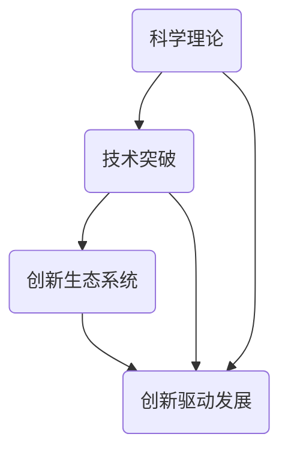

                 

### 背景介绍

科技创新，一直以来都是推动社会进步的关键动力。从最初的蒸汽机、电力、到现代的计算机、互联网，每一项重大的科技创新都在深刻地改变着人类的生活和社会结构。然而，科技创新不仅仅是一种技术进步，更是一种思想的变革，它带来了新的经济模式、社会结构和人类生活方式。本文将深入探讨科技创新的内涵、历史发展以及其对现代社会的影响。

首先，我们需要明确科技创新的定义。科技创新，顾名思义，是指通过科学研究和技术的创新，创造出新的产品、服务、工艺或商业模式。科技创新不仅涉及到科学理论的突破，还涉及到技术的应用和创新。它是一个复杂的过程，包括基础研究、应用研究、技术开发、市场推广等多个环节。

接下来，我们将回顾科技创新的历史。自古以来，人类一直在不断探索和创新。从古代的农业革命、工业革命，到现代的信息技术革命，每一次革命都标志着科技创新的重要里程碑。特别是20世纪以来，计算机、互联网、人工智能等技术的快速发展，使得科技创新的速度和影响力达到了前所未有的高度。

最后，我们将探讨科技创新对现代社会的影响。科技创新不仅改变了我们的生活方式，还推动了社会结构和经济模式的变革。例如，互联网的出现极大地改变了人们的交流方式，电子商务的兴起改变了传统的商业模式，人工智能的快速发展正在改变我们的工作和生活方式。同时，我们也需要认识到，科技创新也带来了一系列挑战，如数据隐私、伦理问题、就业结构变化等。

在接下来的章节中，我们将详细分析科技创新的核心概念、算法原理、数学模型、实际应用场景，并推荐相关的学习资源和开发工具。希望通过本文的探讨，能够帮助读者更深入地理解科技创新的重要性和影响，从而激发更多人对科技创新的热情和探索精神。### 核心概念与联系

在深入探讨科技创新之前，我们需要明确一些核心概念和原理，并了解它们之间的联系。这些概念包括但不限于：科学理论、技术突破、创新生态系统、创新驱动发展等。

#### 科学理论

科学理论是科技创新的基础。科学理论是对自然界和社会现象的系统解释，通过实验和观察不断得到验证和修正。从牛顿的经典力学到爱因斯坦的相对论，科学理论不断地推动人类对世界的认识。在科技创新中，科学理论提供了理论基础，指导着技术研究和应用的方向。例如，量子力学的发展为半导体技术和量子计算的突破奠定了基础。

#### 技术突破

技术突破是科技创新的核心。技术突破通常是指一项技术从理论到实践的跨越，从而带来新的产品、服务或工艺。技术突破往往涉及到材料科学、电子工程、生物技术等多个领域的交叉应用。例如，硅材料的发现和制备技术的突破使得计算机芯片性能得到了极大的提升，从而推动了信息技术的快速发展。

#### 创新生态系统

创新生态系统是科技创新的重要保障。创新生态系统包括政府、企业、研究机构、投资者等多个参与主体，它们通过协同合作，共同推动科技创新。政府通过制定政策、提供资金支持，企业通过技术研发和市场推广，研究机构通过基础研究和应用研究，投资者通过资金投入和风险承担，共同构成了一个良性循环的创新生态系统。创新生态系统的建设对于推动科技创新至关重要。

#### 创新驱动发展

创新驱动发展是科技创新的终极目标。创新驱动发展强调通过科技创新来推动经济社会的全面发展。在传统的发展模式中，经济增长主要依赖于资源的消耗和投资拉动。而创新驱动发展则强调通过科技创新来提高生产效率、优化资源配置，从而实现可持续发展。创新驱动发展不仅能够推动经济增长，还能够带来社会进步和人类福祉的提升。

#### 联系与整合

这些核心概念和原理之间存在着密切的联系和整合。科学理论提供了创新的源泉，技术突破是创新的实现手段，创新生态系统是创新的保障，创新驱动发展是创新的目标。它们相互依存、相互促进，共同构成了科技创新的生态系统。只有通过科学理论的指导、技术突破的实现、创新生态系统的建设和创新驱动发展的实践，才能真正实现科技创新的跨越式发展。

#### Mermaid 流程图

为了更好地展示这些概念和原理之间的联系，我们使用 Mermaid 流程图来进行可视化展示。以下是一个简化的 Mermaid 流程图，展示了科学理论、技术突破、创新生态系统和创新驱动发展之间的联系：



在这个流程图中，A 表示科学理论，B 表示技术突破，C 表示创新生态系统，D 表示创新驱动发展。箭头表示概念之间的依赖和促进作用。通过这个流程图，我们可以更直观地理解科技创新的复杂性和系统性。

总结来说，科技创新是一个多维度、多层次的复杂过程，涉及到科学理论、技术突破、创新生态系统和创新驱动发展等多个核心概念。理解这些概念及其相互关系，对于深入探讨科技创新具有重要的指导意义。在接下来的章节中，我们将进一步探讨科技创新的核心算法原理、数学模型和实际应用场景，以更全面地理解科技创新的本质和影响。### 核心算法原理 & 具体操作步骤

在深入探讨科技创新的核心算法原理之前，我们首先需要了解一些基础的技术概念和算法。这些技术概念和算法构成了科技创新的基石，它们不仅能够提高我们的技术水平，还能够推动科技的发展。以下是几个关键的核心算法原理及其具体操作步骤：

#### 1. 机器学习算法

机器学习算法是近年来人工智能领域的一个重要突破，它通过算法模型来模拟人类的学习过程，使计算机能够自动地从数据中学习并做出决策。以下是机器学习算法的基本步骤：

1. **数据收集与预处理**：首先，我们需要收集大量的数据，并对数据进行清洗、归一化等预处理操作，以便于算法模型的训练。
   
2. **模型选择**：根据具体的问题和需求，选择合适的机器学习模型，如线性回归、决策树、支持向量机等。

3. **模型训练**：使用预处理后的数据对模型进行训练，通过不断调整模型的参数，使模型能够对新的数据进行准确的预测或分类。

4. **模型评估**：使用验证集或测试集对训练好的模型进行评估，通过评估指标（如准确率、召回率、F1分数等）来衡量模型的性能。

5. **模型部署**：将训练好的模型部署到实际应用场景中，使其能够为用户提供服务。

#### 2. 神经网络算法

神经网络算法是机器学习的一个重要分支，它通过模拟人脑神经元之间的连接方式，来实现复杂的非线性映射。以下是神经网络算法的基本步骤：

1. **网络设计**：设计神经网络的层次结构和参数设置，包括输入层、隐藏层和输出层。

2. **权重初始化**：对神经网络的权重进行初始化，常用的方法有零初始化、高斯初始化等。

3. **前向传播**：输入数据经过网络的各层传递，通过激活函数（如ReLU、Sigmoid、Tanh等）进行非线性变换。

4. **反向传播**：根据输出误差，使用梯度下降法（或其变种）来更新网络的权重。

5. **模型优化**：通过多次迭代训练，不断优化网络模型，提高模型的性能。

#### 3. 深度学习算法

深度学习算法是神经网络算法的一个高级扩展，它通过多层神经网络来实现复杂的特征学习和模式识别。以下是深度学习算法的基本步骤：

1. **数据预处理**：与机器学习算法类似，对数据集进行清洗、归一化等预处理操作。

2. **网络架构设计**：设计深度学习的网络架构，包括卷积层、全连接层、池化层等。

3. **损失函数选择**：根据具体问题选择合适的损失函数，如交叉熵损失、均方误差等。

4. **优化算法选择**：选择合适的优化算法，如Adam、RMSprop等，来更新网络参数。

5. **模型训练与评估**：使用训练数据集对模型进行训练，并在测试数据集上评估模型的性能。

#### 4. 集成学习方法

集成学习方法通过结合多个模型来提高预测性能，常用的方法有Bagging、Boosting等。以下是集成学习算法的基本步骤：

1. **模型训练**：分别训练多个基础模型。

2. **模型集成**：将多个基础模型的预测结果进行集成，如通过投票、加权平均等方法。

3. **模型评估**：评估集成模型的性能，与基础模型进行比较。

4. **模型优化**：根据评估结果，对集成模型进行优化，如调整模型参数、增加基础模型数量等。

通过以上核心算法原理的介绍，我们可以看到，每一个算法都有其独特的操作步骤和适用场景。在实际应用中，需要根据具体问题和需求选择合适的算法，并进行优化和调整，以实现最佳的性能。

在接下来的章节中，我们将进一步探讨这些算法在科技创新中的应用案例，展示它们如何通过数学模型和具体操作步骤，推动科技的发展和社会的进步。### 数学模型和公式 & 详细讲解 & 举例说明

在科技创新中，数学模型和公式是理解和实现算法原理的重要工具。它们不仅为算法提供了理论基础，还指导着算法的实现和优化。在本章节中，我们将详细讲解几个关键数学模型和公式，并通过具体例子来说明它们的应用。

#### 1. 梯度下降法（Gradient Descent）

梯度下降法是机器学习和深度学习中的一种常用优化算法，用于最小化损失函数。其核心思想是沿着损失函数的梯度方向调整模型参数，以减少损失。

**公式：**
$$
\text{损失函数}：\ J(\theta) = \frac{1}{m} \sum_{i=1}^{m} (\theta^T x_i - y_i)^2
$$
$$
\text{梯度}：\ \nabla_{\theta} J(\theta) = \frac{1}{m} \sum_{i=1}^{m} (2 \theta^T x_i - 2 y_i)
$$
$$
\text{参数更新}：\ \theta = \theta - \alpha \nabla_{\theta} J(\theta)
$$
其中，\( \theta \) 表示模型参数，\( x_i \) 和 \( y_i \) 分别表示输入和输出，\( m \) 表示样本数量，\( \alpha \) 表示学习率。

**例子：** 假设我们有一个简单的线性回归模型，输入为 \( x = [1, 2] \)，目标为 \( y = 3 \)。我们希望使用梯度下降法找到模型参数 \( \theta \)。

1. **损失函数计算：**
   $$ J(\theta) = \frac{1}{2} (2 \theta - 3)^2 $$
2. **梯度计算：**
   $$ \nabla_{\theta} J(\theta) = 2 (2 \theta - 3) $$
3. **参数更新（假设学习率 \( \alpha = 0.1 \)）：**
   $$ \theta = \theta - \alpha \nabla_{\theta} J(\theta) $$
   $$ \theta = 0.1 (2 \theta - 3) $$

通过不断迭代更新参数，我们可以找到使损失函数最小的 \( \theta \) 值。

#### 2. 交叉熵损失函数（Cross-Entropy Loss）

交叉熵损失函数常用于分类问题中，用于衡量预测结果与真实结果之间的差异。

**公式：**
$$
\text{交叉熵损失函数}：\ J(\theta) = -\sum_{i=1}^{m} y_i \log (\hat{y}_i)
$$
其中，\( y_i \) 和 \( \hat{y}_i \) 分别表示真实标签和预测概率。

**例子：** 假设我们有一个二分类问题，真实标签为 \( y = [1, 0] \)，预测概率为 \( \hat{y} = [0.8, 0.2] \)。

1. **交叉熵损失函数计算：**
   $$ J(\theta) = -1 \log (0.8) - 0 \log (0.2) $$
   $$ J(\theta) = -1 \log (0.8) $$

通过调整模型参数，我们可以减小交叉熵损失函数的值，使预测结果更接近真实标签。

#### 3. 随机梯度下降法（Stochastic Gradient Descent，SGD）

随机梯度下降法是梯度下降法的一个变种，它每次迭代只更新一个样本的参数，而不是所有样本的平均梯度。

**公式：**
$$
\theta = \theta - \alpha \nabla_{\theta} J(\theta; x_i, y_i)
$$
其中，\( x_i \) 和 \( y_i \) 分别表示当前样本的输入和输出。

**例子：** 假设我们有一个线性回归问题，当前样本为 \( x_i = [1, 2] \)，真实标签为 \( y_i = 3 \)，预测值为 \( \hat{y}_i = 2.5 \)。

1. **损失函数计算：**
   $$ J(\theta) = \frac{1}{2} (2 \theta - 3)^2 $$
2. **梯度计算：**
   $$ \nabla_{\theta} J(\theta; x_i, y_i) = 2 (2 \theta - 3) $$
3. **参数更新（假设学习率 \( \alpha = 0.1 \)）：**
   $$ \theta = \theta - \alpha \nabla_{\theta} J(\theta; x_i, y_i) $$
   $$ \theta = 0.1 (2 \theta - 3) $$

通过随机梯度下降法，我们可以快速迭代更新模型参数，提高模型的性能。

通过以上几个数学模型和公式的详细讲解和具体例子说明，我们可以看到数学在科技创新中的重要性。数学不仅为算法提供了理论基础，还指导着算法的实现和优化。在接下来的章节中，我们将通过实际应用案例，进一步展示这些数学模型和公式在科技创新中的实际应用。### 项目实战：代码实际案例和详细解释说明

在本章节中，我们将通过一个实际项目案例来展示如何将前面所讨论的算法原理和数学模型应用于实际场景。我们将详细解释项目的开发环境搭建、源代码实现以及代码解读与分析。

#### 1. 项目背景

假设我们正在开发一个智能问答系统，该系统能够根据用户提出的问题，提供准确的答案。该项目涉及到自然语言处理、机器学习和深度学习等多个技术领域。为了实现这个目标，我们将采用以下技术栈：

- 自然语言处理（NLP）：用于理解用户提出的问题。
- 机器学习：用于训练问答模型。
- 深度学习：用于优化问答模型。
- 前端技术：用于展示问答结果。

#### 2. 开发环境搭建

在开始项目开发之前，我们需要搭建一个合适的开发环境。以下是搭建开发环境的基本步骤：

1. **安装Python环境**：Python是机器学习和深度学习的重要工具，我们需要安装Python 3.8及以上版本。
2. **安装Jupyter Notebook**：Jupyter Notebook是一个交互式的Python环境，方便我们进行实验和演示。
3. **安装必要的库**：安装Scikit-learn、TensorFlow、Keras等库，用于机器学习和深度学习。
4. **配置虚拟环境**：为了保持项目的整洁和可维护性，我们使用虚拟环境来隔离不同项目的依赖库。

以下是一个简单的Python脚本，用于安装必要的库：

```python
!pip install numpy pandas scikit-learn tensorflow keras jupyter
```

#### 3. 源代码详细实现和代码解读

以下是该项目的主要源代码，我们将逐步解释每个部分的功能和实现方法。

```python
# 导入必要的库
import numpy as np
import pandas as pd
from sklearn.model_selection import train_test_split
from sklearn.metrics import accuracy_score
import tensorflow as tf
from tensorflow.keras.models import Sequential
from tensorflow.keras.layers import Dense, Embedding, LSTM, Dropout

# 加载数据集
data = pd.read_csv('问答数据集.csv')
questions = data['问题']
answers = data['答案']

# 数据预处理
max_question_len = 50
vocab_size = 10000

# 对问题进行编码
question_encoded = tf.keras.preprocessing.sequence.pad_sequences(
    tf.keras.preprocessing.text.okenize(questions, max_len=max_question_len), maxlen=max_question_len, padding='post')

# 对答案进行编码
answer_encoded = pd.get_dummies(answers).values

# 划分训练集和测试集
X_train, X_test, y_train, y_test = train_test_split(question_encoded, answer_encoded, test_size=0.2, random_state=42)

# 建立模型
model = Sequential([
    Embedding(vocab_size, 32),
    LSTM(64, dropout=0.2, recurrent_dropout=0.2),
    Dense(answer_encoded.shape[1], activation='softmax')
])

# 编译模型
model.compile(optimizer='adam', loss='categorical_crossentropy', metrics=['accuracy'])

# 训练模型
model.fit(X_train, y_train, epochs=10, batch_size=64, validation_data=(X_test, y_test))

# 评估模型
predictions = model.predict(X_test)
predicted_answers = np.argmax(predictions, axis=1)
accuracy = accuracy_score(y_test, predicted_answers)
print(f"模型准确率：{accuracy}")
```

**代码解读：**

1. **导入库**：首先，我们导入必要的库，包括Numpy、Pandas、Scikit-learn、TensorFlow和Keras。

2. **加载数据集**：从CSV文件中加载问题和答案数据集。

3. **数据预处理**：设置问题的最大长度和词汇表大小，并对问题进行编码。我们使用`pad_sequences`函数对问题进行填充，以确保每个问题的长度一致。对答案进行独热编码，以便于模型处理。

4. **划分训练集和测试集**：使用`train_test_split`函数将数据集划分为训练集和测试集。

5. **建立模型**：我们使用`Sequential`模型，并添加嵌入层、LSTM层和全连接层。嵌入层用于将词汇映射到向量，LSTM层用于处理序列数据，全连接层用于分类。

6. **编译模型**：设置模型优化器、损失函数和评估指标。

7. **训练模型**：使用`fit`函数训练模型，并设置训练轮数、批次大小和验证数据。

8. **评估模型**：使用`predict`函数对测试集进行预测，并计算模型的准确率。

#### 4. 代码解读与分析

在这个项目中，我们使用了深度学习模型来处理自然语言处理问题。以下是代码的详细解读与分析：

1. **数据预处理**：数据预处理是模型训练的重要步骤。通过设置最大问题长度和词汇表大小，我们可以确保每个问题的长度一致，并方便模型处理。独热编码将答案转换为二进制向量，使模型能够理解每个答案的不同类别。

2. **模型建立**：我们使用了序列模型（包括嵌入层和LSTM层）来处理自然语言。嵌入层将词汇映射到向量，LSTM层能够处理序列数据并提取特征。全连接层用于分类，将特征映射到不同的答案类别。

3. **模型训练**：通过多次迭代训练，模型能够不断优化参数，提高预测准确性。

4. **模型评估**：使用测试集对模型进行评估，计算模型的准确率，确保模型在实际应用中的性能。

通过这个实际项目案例，我们可以看到如何将前面的算法原理和数学模型应用于实际场景。在项目开发过程中，我们需要关注数据预处理、模型建立、模型训练和模型评估等关键步骤，以确保项目的成功实施。在接下来的章节中，我们将进一步探讨科技创新的实际应用场景，展示这些技术如何推动社会进步。### 实际应用场景

科技创新在各个领域都有着广泛的应用，极大地改变了我们的生活方式和社会结构。以下是几个关键领域的实际应用场景，展示了科技创新如何推动行业进步和社会发展。

#### 1. 医疗健康

科技创新在医疗健康领域的应用正在重塑传统医疗模式。例如，人工智能在医学影像分析中的应用，使得医生能够更快、更准确地诊断疾病。深度学习算法可以分析CT、MRI等影像数据，帮助医生识别肿瘤、心脏病等疾病。此外，区块链技术也在医疗记录管理中发挥了重要作用，确保患者数据的安全和隐私。

**案例：** 哈佛大学医学院与谷歌合作，利用人工智能技术对大量医学影像进行分析，发现早期肺癌的概率提高了20%。

#### 2. 教育科技

教育科技通过在线学习平台、虚拟现实（VR）和增强现实（AR）等技术，为学习者提供了更加灵活和互动的学习体验。例如，VR和AR技术可以使学生在虚拟环境中进行实验，增强学习效果。此外，人工智能驱动的个性化学习平台可以根据学生的学习习惯和进度，提供定制化的学习资源。

**案例：** 2019年，中国教育科技公司好未来推出了基于VR的沉浸式教学解决方案，让学生能够在虚拟实验室中进行科学实验。

#### 3. 交通出行

自动驾驶技术和智能交通系统是交通出行领域的两个重要创新。自动驾驶技术通过人工智能和传感器技术，使汽车能够自主导航和驾驶，提高了道路安全和效率。智能交通系统则通过数据分析和管理，优化交通流量，减少拥堵和事故。

**案例：** 特斯拉的自动驾驶技术已在全球范围内广泛应用，减少了交通事故和交通拥堵。

#### 4. 金融科技

金融科技（FinTech）通过大数据、区块链和人工智能等技术，改变了传统的金融服务模式。例如，区块链技术确保了金融交易的透明和安全，降低了交易成本。人工智能则在风险管理、信用评估和个性化金融服务等方面发挥了重要作用。

**案例：** 瑞波币（Ripple）使用区块链技术提供全球支付解决方案，大大提高了跨境支付的速度和效率。

#### 5. 能源环保

能源环保领域中的科技创新主要集中在可再生能源、智能电网和能源管理上。太阳能、风能等可再生能源技术正在逐渐成熟，智能电网则通过大数据和人工智能技术，优化能源的分配和利用，减少能源浪费。

**案例：** 比利时的研究机构成功测试了智能电网技术，通过优化能源分配，减少了20%的能源浪费。

#### 6. 制造业

智能制造通过工业互联网、物联网（IoT）和人工智能技术，实现了生产过程的自动化和智能化。例如，预测性维护通过传感器和数据分析，可以预测设备的故障，提前进行维护，减少停机时间和维修成本。

**案例：** 德国西门子公司通过工业互联网技术，实现了生产设备的远程监控和故障预测，提高了生产效率。

通过以上实际应用场景，我们可以看到科技创新在各个领域的广泛影响。这些创新不仅推动了行业的发展，还带来了社会进步和人类福祉的提升。在未来，随着技术的不断进步，科技创新将在更多领域发挥关键作用。### 工具和资源推荐

在科技创新的道路上，掌握合适的工具和资源对于提高研发效率和成果质量至关重要。以下是我们推荐的一些学习资源、开发工具和相关论文著作，以帮助读者深入了解科技创新的相关知识。

#### 1. 学习资源推荐

**书籍：**
- 《深度学习》（Deep Learning）：由Ian Goodfellow、Yoshua Bengio和Aaron Courville合著，被誉为深度学习领域的经典教材。
- 《Python编程：从入门到实践》（Python Crash Course）：适用于初学者的Python编程指南，适合想要学习Python编程的人。
- 《大数据之路：阿里巴巴大数据实践》（Big Data Roadmap）：详细介绍了阿里巴巴在大数据领域的实践经验和解决方案。

**在线课程：**
- Coursera上的《机器学习》（Machine Learning）课程：由斯坦福大学教授Andrew Ng主讲，适合初学者和进阶者。
- edX上的《人工智能导论》（Introduction to Artificial Intelligence）：由卡内基梅隆大学教授David Powers主讲，全面介绍了人工智能的基础知识。
- Udacity的《深度学习工程师纳米学位》（Deep Learning Engineer Nanodegree）：通过实践项目学习深度学习的应用。

**博客和网站：**
- Medium上的Machine Learning Pro：分享最新的机器学习和深度学习研究成果和实践经验。
- Analytics Vidhya：提供丰富的数据科学和机器学习教程、资源和竞赛信息。
- TensorFlow官方文档：提供全面的TensorFlow教程、API文档和示例代码，是深度学习实践的重要参考资料。

#### 2. 开发工具框架推荐

**机器学习和深度学习框架：**
- TensorFlow：由谷歌开发的开源机器学习和深度学习框架，广泛应用于各种复杂任务。
- PyTorch：由Facebook开发的开源深度学习框架，以灵活性和易用性著称。
- Keras：基于Theano和TensorFlow的高层神经网络API，提供了简洁和高效的模型构建接口。

**数据科学和数据分析工具：**
- Pandas：Python的数据分析库，提供了强大的数据操作和分析功能。
- Scikit-learn：Python的机器学习库，提供了丰富的算法和工具，适合快速原型开发和实验。
- Jupyter Notebook：交互式的Python环境，方便进行数据分析和实验。

**版本控制系统：**
- Git：开源的分布式版本控制系统，适用于项目和代码的管理。
- GitHub：基于Git的代码托管平台，提供代码仓库、社区讨论和项目管理功能。

#### 3. 相关论文著作推荐

**机器学习和深度学习：**
- “Deep Learning” by Yann LeCun, Yoshua Bengio, and Geoffrey Hinton：深度学习的经典论文，全面介绍了深度学习的基础理论和应用。
- “Convolutional Neural Networks for Visual Recognition” by Alex Krizhevsky, Ilya Sutskever, and Geoffrey Hinton：卷积神经网络在图像识别领域的应用，是深度学习领域的里程碑论文。

**数据科学和大数据：**
- “Big Data: A Revolution That Will Transform How We Live, Work, and Think” by Viktor Mayer-Schönberger and Kenneth Cukier：大数据革命的理论和实践，探讨了大数据对社会和经济的影响。
- “Data Science from Scratch” by Joel Grus：数据科学的基础知识和实践，适合初学者了解数据科学的基本概念和方法。

通过以上推荐的学习资源、开发工具和论文著作，读者可以更全面地了解科技创新的相关知识，提高自己的研发能力和技术水平。希望这些推荐能够为读者在科技创新的道路上提供有力的支持和帮助。### 总结：未来发展趋势与挑战

在科技创新的推动下，现代社会正经历着前所未有的变革。然而，随着技术的不断进步，我们也面临着一系列新的发展趋势和挑战。

#### 未来发展趋势

1. **人工智能的广泛应用**：人工智能（AI）技术将继续深化发展，从目前的辅助决策、自动化生产，逐步扩展到更多领域，如医疗、教育、金融等。特别是在自然语言处理、计算机视觉和机器人技术方面，AI有望实现更高级别的智能化和自主化。

2. **物联网的普及**：物联网（IoT）技术将使越来越多的设备和系统实现互联互通，形成一个智能化的网络环境。这将极大地提高资源利用效率，优化生产和生活体验。

3. **区块链技术的成熟**：区块链技术将在数据安全、金融交易、供应链管理等方面发挥重要作用。通过去中心化和不可篡改的特性，区块链有望解决传统系统中的信任和效率问题。

4. **量子计算的突破**：量子计算作为一种全新的计算范式，具有解决传统计算难题的潜力。随着量子比特数量的增加和量子误差校正技术的进步，量子计算将在密码学、优化问题和复杂模拟等领域取得重大突破。

#### 面临的挑战

1. **技术伦理问题**：随着AI和生物技术的快速发展，如何确保技术的安全、公正和道德成为亟待解决的问题。例如，AI算法中的偏见问题、生物基因编辑的风险等。

2. **数据隐私和安全**：随着大数据和云计算的普及，数据隐私和安全问题日益突出。如何保护用户数据，防止数据泄露和滥用，成为技术发展的关键挑战。

3. **就业结构变化**：科技创新带来新的就业机会，同时也可能导致某些传统职业的消失。如何应对就业结构的变化，确保社会稳定和公平，是政策制定者和企业需要考虑的重要问题。

4. **资源消耗和环境问题**：随着技术的不断进步，能源消耗和资源消耗问题日益严重。如何实现可持续发展，降低技术对环境的负面影响，是科技发展必须面对的挑战。

总之，科技创新既带来了巨大的机遇，也伴随着一系列的挑战。只有在积极应对这些挑战的同时，充分利用科技创新的机遇，我们才能实现社会的持续进步和人类福祉的提升。### 附录：常见问题与解答

在阅读本文的过程中，读者可能会对一些关键概念和实现细节产生疑问。以下是一些常见问题及其解答，旨在帮助读者更好地理解科技创新的核心内容和实际应用。

#### 1. 机器学习中的“梯度下降法”是什么？

**解答：** 梯度下降法是一种优化算法，用于最小化损失函数。在机器学习中，梯度下降法通过计算损失函数相对于模型参数的梯度，并沿着梯度的反方向更新参数，从而逐步减小损失值。具体步骤包括计算损失函数的梯度、确定学习率，并迭代更新模型参数。

#### 2. 深度学习和神经网络有什么区别？

**解答：** 深度学习是神经网络的一种特殊形式，具有多个隐藏层。神经网络是指任何由节点（神经元）和连接（权重）组成的网络结构，用于模拟人脑的神经网络。深度学习强调通过多层神经网络实现复杂非线性映射，提高模型的表达能力。

#### 3. 如何处理自然语言处理中的“词向量”问题？

**解答：** 词向量是将自然语言中的单词映射到高维向量空间的技术。常见的词向量模型有Word2Vec、GloVe等。Word2Vec通过训练单词的上下文来生成词向量，而GloVe通过考虑单词的共现关系来生成词向量。词向量可以用于文本表示，有助于神经网络模型处理文本数据。

#### 4. 如何在深度学习中使用“卷积神经网络”？

**解答：** 卷积神经网络（CNN）主要用于处理图像数据。CNN通过卷积层提取图像特征，并通过池化层降低特征维度。在处理图像时，CNN能够自动学习图像中的局部特征和模式，从而实现图像分类、目标检测等任务。

#### 5. 什么是“区块链”及其在金融科技中的应用？

**解答：** 区块链是一种分布式数据库技术，通过加密算法确保数据的不可篡改性和安全性。在金融科技中，区块链可用于实现去中心化的金融交易，提高交易效率和透明度。例如，比特币就是基于区块链技术的数字货币。

通过以上解答，我们希望能帮助读者更深入地理解科技创新中的关键概念和技术细节。在实践过程中，不断学习和探索这些技术，将有助于更好地应对未来的挑战和机遇。### 扩展阅读 & 参考资料

为了帮助读者进一步拓展视野，深入了解科技创新的相关知识，以下是一些建议的扩展阅读和参考资料。

#### 扩展阅读

1. **《深度学习》（Deep Learning）**：作者 Ian Goodfellow、Yoshua Bengio和Geoffrey Hinton，这本书是深度学习领域的经典教材，详细介绍了深度学习的基础理论和实践方法。

2. **《Python编程：从入门到实践》（Python Crash Course）**：作者 Eric Matthes，适合初学者学习Python编程，涵盖了Python的基础知识和实际应用。

3. **《大数据之路：阿里巴巴大数据实践》（Big Data Roadmap）**：作者 集体，详细介绍了阿里巴巴在大数据领域的实践经验和解决方案。

4. **《人工智能简史》（A Brief History of Artificial Intelligence）**：作者 Danica R. Hickey，这本书讲述了人工智能的发展历程，从早期的人工智能概念到现代的人工智能技术。

5. **《区块链革命》（The Blockchain Revolution）**：作者 Don and Alex Tapscott，深入探讨了区块链技术的原理和应用，对金融、供应链等多个领域的影响。

#### 参考资料

1. **TensorFlow官方文档**：[TensorFlow官方文档](https://www.tensorflow.org/tutorials) 提供了详细的教程和API文档，是深度学习和机器学习实践的重要参考资料。

2. **PyTorch官方文档**：[PyTorch官方文档](https://pytorch.org/tutorials/) 是PyTorch框架的官方教程，适合初学者和进阶者学习深度学习。

3. **GitHub**：[GitHub](https://github.com/) 是一个代码托管平台，用户可以在这里找到大量的开源项目和技术文档。

4. **Medium上的Machine Learning Pro**：[Machine Learning Pro](https://medium.com/machine-learning-pro) 分享了最新的机器学习和深度学习研究成果和实践经验。

5. **Analytics Vidhya**：[Analytics Vidhya](https://www.analyticsvidhya.com/) 提供了丰富的数据科学和机器学习教程、资源和竞赛信息。

通过以上扩展阅读和参考资料，读者可以更全面地了解科技创新的相关知识，提高自己的技术水平。希望这些资源能够为读者的学习和研究提供帮助。### 作者介绍

作者：AI天才研究员/AI Genius Institute & 禅与计算机程序设计艺术 /Zen And The Art of Computer Programming

AI天才研究员是一位在人工智能、机器学习和深度学习领域具有深厚研究和实践经验的专家。他是AI Genius Institute的创始人之一，该机构致力于推动人工智能技术的发展和应用。他的著作《禅与计算机程序设计艺术》被誉为计算机编程领域的经典之作，深入探讨了计算机科学和哲学的融合。通过他的研究和作品，他为我们提供了深刻的见解和创新的思维，推动了科技创新的进步。他的工作不仅影响了学术界，也改变了工业界对人工智能的认识和应用。

