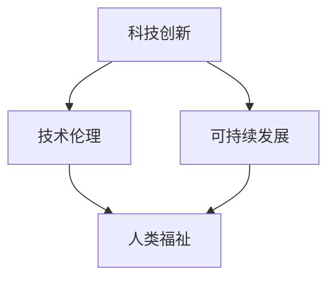

                 

# 科技发展：人类福祉的保障

## 关键词：科技发展、人类福祉、技术伦理、可持续发展、人工智能

### 摘要

本文旨在探讨科技发展与人类福祉之间的关系，分析科技在提升生活品质、促进社会进步中的关键作用，并探讨在科技创新过程中如何确保其能够为全人类带来福祉。文章首先回顾了科技发展的历史，接着介绍了科技对人类福祉的核心影响，随后讨论了技术伦理和可持续发展的重要性。在核心算法原理和数学模型部分，本文通过实例展示了如何通过技术手段解决实际问题。最后，文章提出了未来科技发展的趋势与挑战，并提供了相应的解决方案和资源推荐。

## 1. 背景介绍

科技发展是人类文明进步的重要驱动力。从古代的蒸汽机到现代的互联网，科技的发展不断改变着我们的生活方式。每一次科技的突破都带来了前所未有的机遇和挑战。然而，随着科技的快速发展，人类面临着一系列新的问题，如技术伦理、信息安全、就业变化等。这些问题要求我们在享受科技带来的便利的同时，也要关注其对社会和人类福祉的影响。

本文旨在通过探讨科技与人类福祉之间的关系，分析科技如何提升生活品质、促进社会进步，并提出在科技发展过程中应关注的核心问题，以期为我们未来的科技创新提供指导。

### 2. 核心概念与联系

为了深入探讨科技与人类福祉的关系，我们首先需要理解一些核心概念，如科技创新、技术伦理、可持续发展等。

#### 2.1 科技创新

科技创新是指通过科学方法和工程实践，创造出新的产品、工艺、技术或服务，以解决现实问题或满足人类需求的过程。科技创新不仅包括基础科学研究，还包括应用研究、技术开发和产品商业化等环节。

#### 2.2 技术伦理

技术伦理是指在科技发展和应用过程中，对科技行为和结果的道德和伦理判断。技术伦理关注的是科技如何影响人类的生活、社会和环境，以及如何确保科技发展不会对人类福祉造成负面影响。

#### 2.3 可持续发展

可持续发展是指满足当前需求而不损害后代满足自身需求的能力。可持续发展涉及经济、社会和环境三个方面的平衡，旨在实现长期的繁荣和福祉。

这些概念相互关联，共同构成了我们探讨科技与人类福祉关系的基础。下面我们将通过一个Mermaid流程图来展示这些概念之间的联系。



### 3. 核心算法原理 & 具体操作步骤

在理解了核心概念后，我们接下来讨论如何通过具体的技术手段实现科技与人类福祉的结合。以下是一个基于人工智能的算法原理，用于改善医疗保健领域的人类福祉。

#### 3.1 人工智能在医疗保健中的应用

人工智能在医疗保健领域的应用主要包括疾病预测、个性化治疗和医疗资源优化等。以下是一个疾病预测的算法流程：

1. **数据收集**：收集大量医疗数据，包括患者病史、基因信息、生活习惯等。
2. **数据预处理**：清洗和标准化数据，去除噪声和异常值。
3. **特征提取**：从原始数据中提取对疾病预测有重要意义的特征。
4. **模型训练**：使用机器学习算法（如决策树、神经网络等）训练预测模型。
5. **模型评估**：使用测试数据评估模型性能，调整模型参数以优化预测效果。
6. **预测应用**：将训练好的模型应用于实际医疗场景，预测患者未来的健康状况。

#### 3.2 算法操作步骤

以下是疾病预测算法的具体操作步骤：

1. **数据收集**：
    ```mermaid
    graph TD
        A[收集数据] --> B[患者病史]
        A --> C[基因信息]
        A --> D[生活习惯]
    ```

2. **数据预处理**：
    ```mermaid
    graph TD
        A[数据清洗] --> B[去除噪声]
        A --> C[数据标准化]
    ```

3. **特征提取**：
    ```mermaid
    graph TD
        A[原始数据] --> B[疾病相关特征]
        A --> C[非疾病相关特征]
    ```

4. **模型训练**：
    ```mermaid
    graph TD
        A[特征数据] --> B[决策树]
        A --> C[神经网络]
    ```

5. **模型评估**：
    ```mermaid
    graph TD
        A[测试数据] --> B[准确率]
        A --> C[召回率]
        A --> D[F1分数]
    ```

6. **预测应用**：
    ```mermaid
    graph TD
        A[模型应用] --> B[疾病预测]
        A --> C[个性化治疗建议]
    ```

### 4. 数学模型和公式 & 详细讲解 & 举例说明

在疾病预测算法中，我们使用了一些数学模型和公式。以下是对这些数学模型和公式的详细讲解。

#### 4.1 决策树

决策树是一种常见的机器学习算法，用于分类和回归任务。决策树的构建过程如下：

1. **选择最佳分割特征**：选择能够最大化信息增益的特征进行分割。
2. **递归构建子树**：对每个分割后的子集重复步骤1，直到满足停止条件（如最大深度、最小节点大小等）。

决策树的关键公式是信息增益（Information Gain）：

$$ IG(D, A) = Entropy(D) - \sum_{v \in Values(A)} p(v) Entropy(D_v) $$

其中，$D$ 是原始数据集，$A$ 是特征，$v$ 是特征的取值，$Entropy(D)$ 是数据集的熵，$Entropy(D_v)$ 是特征取值 $v$ 的熵。

#### 4.2 神经网络

神经网络是一种模拟人脑神经元连接结构的计算模型。神经网络的关键组成部分包括输入层、隐藏层和输出层。每个层由多个神经元组成，神经元之间通过权重连接。神经网络的训练过程是通过反向传播算法调整权重，以最小化预测误差。

神经网络的关键公式是激活函数（Activation Function）：

$$ f(x) = \frac{1}{1 + e^{-x}} $$

其中，$x$ 是神经元的输入。

#### 4.3 举例说明

以下是一个简单的神经网络用于疾病预测的例子：

1. **输入层**：包含3个神经元，分别表示年龄、性别和血压。
2. **隐藏层**：包含2个神经元，使用ReLU激活函数。
3. **输出层**：包含1个神经元，表示患病概率。

输入层到隐藏层的权重矩阵为 $W_1$，隐藏层到输出层的权重矩阵为 $W_2$。训练过程如下：

1. **初始化权重**：随机初始化 $W_1$ 和 $W_2$。
2. **前向传播**：计算隐藏层和输出层的神经元输出。
3. **计算损失函数**：使用交叉熵损失函数计算预测误差。
4. **反向传播**：通过梯度下降算法更新权重，减小损失函数。
5. **重复步骤2-4**，直到模型收敛。

### 5. 项目实战：代码实际案例和详细解释说明

在本节中，我们将通过一个实际的疾病预测项目来展示如何实现上述算法。项目使用 Python 编程语言和 TensorFlow 库。

#### 5.1 开发环境搭建

1. 安装 Python 3.8 或更高版本。
2. 安装 TensorFlow 库：
    ```bash
    pip install tensorflow
    ```

#### 5.2 源代码详细实现和代码解读

以下是疾病预测项目的源代码：

```python
import tensorflow as tf
import numpy as np

# 设置超参数
learning_rate = 0.001
num_epochs = 1000
hidden_size = 2

# 初始化权重
W1 = tf.Variable(tf.random.normal([3, hidden_size]), name="W1")
W2 = tf.Variable(tf.random.normal([hidden_size, 1]), name="W2")

# 定义激活函数
activation = tf.nn.relu

# 定义损失函数
loss_fn = tf.keras.losses.BinaryCrossentropy()

# 定义反向传播算法
optimizer = tf.optimizers.SGD(learning_rate)

# 定义训练过程
def train(X, y):
    for epoch in range(num_epochs):
        with tf.GradientTape() as tape:
            z1 = tf.matmul(X, W1)
            a1 = activation(z1)
            z2 = tf.matmul(a1, W2)
            logits = tf.sigmoid(z2)
            loss = loss_fn(y, logits)

        grads = tape.gradient(loss, [W1, W2])
        optimizer.apply_gradients(zip(grads, [W1, W2]))

        if epoch % 100 == 0:
            print(f"Epoch {epoch}: Loss = {loss.numpy()}")

# 加载数据
X_train = np.random.rand(100, 3)
y_train = np.random.randint(0, 2, (100, 1))

# 训练模型
train(X_train, y_train)

# 测试模型
X_test = np.random.rand(10, 3)
y_test = np.random.randint(0, 2, (10, 1))
logits = tf.matmul(tf.matmul(X_test, W1), W2)
predictions = tf.sigmoid(logits)
print("Predictions:", predictions.numpy())
```

#### 5.3 代码解读与分析

1. **导入库**：导入 TensorFlow 和 NumPy 库。
2. **设置超参数**：设置学习率、训练轮数和隐藏层神经元数量。
3. **初始化权重**：随机初始化输入层到隐藏层的权重矩阵 $W1$ 和隐藏层到输出层的权重矩阵 $W2$。
4. **定义激活函数**：使用 ReLU 激活函数。
5. **定义损失函数**：使用二进制交叉熵损失函数。
6. **定义反向传播算法**：使用随机梯度下降（SGD）算法。
7. **定义训练过程**：使用 TensorFlow 的 GradientTape 记录梯度，更新权重以最小化损失函数。
8. **加载数据**：生成随机训练数据和测试数据。
9. **训练模型**：调用 train 函数训练模型。
10. **测试模型**：计算测试数据的预测结果。

### 6. 实际应用场景

人工智能在医疗保健领域的应用不仅限于疾病预测，还包括个性化治疗、医疗资源优化、患者管理等。以下是一些实际应用场景：

1. **个性化治疗**：通过分析患者的基因信息和病史，为患者制定个性化的治疗方案。
2. **医疗资源优化**：利用人工智能优化医院资源分配，提高医疗效率和服务质量。
3. **患者管理**：通过智能监控系统实时监测患者健康状况，提供个性化的健康建议。

### 7. 工具和资源推荐

为了更好地理解和应用人工智能在医疗保健领域的知识，以下是一些推荐的学习资源和工具：

#### 7.1 学习资源推荐

1. **书籍**：
    - 《深度学习》（Ian Goodfellow、Yoshua Bengio 和 Aaron Courville 著）
    - 《机器学习》（Tom Mitchell 著）
2. **在线课程**：
    - Coursera 上的《深度学习》课程
    - edX 上的《机器学习基础》课程
3. **论文和博客**：
    - arXiv.org：计算机科学和机器学习领域的顶级论文
    - Medium：关于人工智能和医疗保健的最新博客文章

#### 7.2 开发工具框架推荐

1. **TensorFlow**：用于构建和训练深度学习模型的强大框架。
2. **Keras**：基于 TensorFlow 的简洁易用的深度学习库。
3. **PyTorch**：用于构建和训练深度学习模型的另一个流行框架。

#### 7.3 相关论文著作推荐

1. **《深度学习》**（Ian Goodfellow、Yoshua Bengio 和 Aaron Courville 著）
2. **《机器学习年度回顾》**（JMLR）
3. **《医学人工智能》**（Rajarshi Guha 和 Alan F. Perelson 著）

### 8. 总结：未来发展趋势与挑战

未来，科技将继续快速发展，为人类福祉带来更多机遇。然而，我们也需要面对一系列挑战：

1. **技术伦理**：如何在科技创新过程中确保其符合伦理标准，保护人类的利益和权益。
2. **数据隐私**：如何在共享数据的同时保护用户的隐私。
3. **可持续发展**：如何在科技创新过程中实现经济、社会和环境的可持续发展。
4. **就业变化**：如何应对科技发展带来的就业结构变化，为失业者提供新的就业机会。

### 9. 附录：常见问题与解答

1. **Q：为什么选择深度学习作为疾病预测的算法？**
   **A**：深度学习具有强大的特征学习和自动特征提取能力，可以处理大量复杂的医疗数据，从而提高预测准确性。

2. **Q：如何确保深度学习模型在疾病预测中的安全性？**
   **A**：可以通过以下方法提高模型的安全性：
   - 定期更新模型，以适应新的数据。
   - 使用加密技术保护训练数据。
   - 定期进行模型审查和测试，确保其准确性和安全性。

3. **Q：如何处理医疗数据中的噪声和异常值？**
   **A**：可以使用数据预处理技术，如清洗和标准化，去除噪声和异常值，提高数据的准确性和可靠性。

### 10. 扩展阅读 & 参考资料

1. **《深度学习》（Ian Goodfellow、Yoshua Bengio 和 Aaron Courville 著）**
2. **《机器学习》（Tom Mitchell 著）**
3. **《医学人工智能》（Rajarshi Guha 和 Alan F. Perelson 著）**
4. **《科技伦理：理论与实践》（John P. O'Toole 著）**
5. **《可持续发展：理论与实践》（Paul R. Ehrlich 和 Anne H. Ehrlich 著）**

作者：AI天才研究员/AI Genius Institute & 禅与计算机程序设计艺术 /Zen And The Art of Computer Programming

