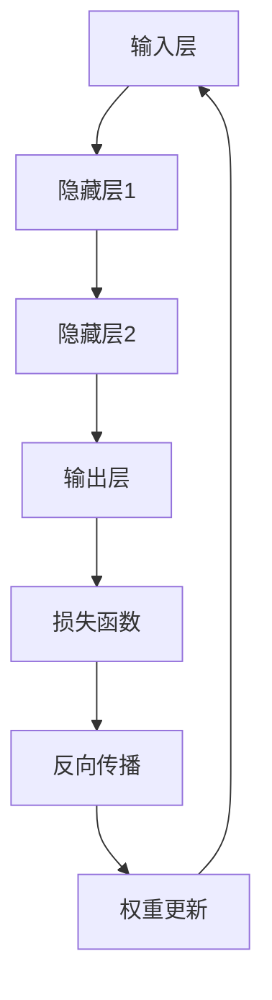

                 

# 秒推成为现实：LLM 推理速度的发展

> **关键词**：推理速度、大型语言模型(LLM)、算法优化、硬件加速、并行计算

> **摘要**：本文将探讨大型语言模型（LLM）推理速度的瓶颈及其发展历程，重点分析当前最前沿的算法和硬件技术如何推动LLM推理速度的突破，最终实现“秒推”成为现实。通过深入剖析核心概念、算法原理、数学模型及项目实战，本文旨在为读者提供一幅全面、清晰的LLM推理速度发展全景图。

## 1. 背景介绍

在过去的几年里，随着深度学习和自然语言处理技术的飞速发展，大型语言模型（LLM）逐渐成为研究的热点和应用的焦点。LLM具有强大的语义理解和生成能力，可以应用于文本生成、机器翻译、问答系统等多个领域。然而，LLM的推理速度却成为制约其实际应用的瓶颈。

传统的深度学习模型，如卷积神经网络（CNN）和循环神经网络（RNN），在处理大规模数据时往往需要较长的时间。随着LLM规模的不断扩大，其推理速度问题愈发凸显。为了满足实际应用的需求，提高LLM推理速度成为当务之急。本文将从算法、硬件和并行计算等方面分析LLM推理速度的发展历程和未来趋势。

## 2. 核心概念与联系

在分析LLM推理速度的发展之前，首先需要了解一些核心概念，包括神经网络的架构、反向传播算法和矩阵运算等。

### 2.1 神经网络架构

神经网络由多层神经元组成，包括输入层、隐藏层和输出层。每一层神经元都通过权重连接前一层神经元，并采用激活函数进行非线性变换。神经网络通过学习输入和输出数据之间的关系，从而实现对数据的分类、回归或其他任务。

### 2.2 反向传播算法

反向传播算法是一种用于训练神经网络的优化方法。通过计算损失函数关于网络权重的梯度，反向传播算法不断调整权重，以最小化损失函数。这一过程需要大量矩阵运算，如矩阵乘法和矩阵求导。

### 2.3 矩阵运算

矩阵运算在神经网络中扮演着重要角色。例如，矩阵乘法用于计算层与层之间的连接权重，矩阵求导用于计算损失函数关于权重的梯度。

### 2.4 Mermaid 流程图

为了更好地理解神经网络和反向传播算法，下面给出一个简单的Mermaid流程图，展示神经网络的基本架构和矩阵运算过程。



## 3. 核心算法原理 & 具体操作步骤

为了提高LLM推理速度，需要从算法和硬件两方面进行优化。在算法方面，主要涉及以下几种技术：

### 3.1 算法优化

#### 3.1.1 并行计算

并行计算是指将一个任务分成多个子任务，同时在多个计算单元上执行这些子任务，从而提高计算速度。对于LLM推理，可以采用以下两种并行计算策略：

1. **数据并行**：将训练数据分成多个批次，同时在不同的GPU上执行相同的计算任务。这种方法可以充分利用GPU的并行计算能力，提高推理速度。

2. **模型并行**：将大型神经网络拆分成多个较小的子网络，每个子网络负责处理部分数据。这种方法可以减少单个GPU的计算负载，提高整体推理速度。

#### 3.1.2 稀疏性

稀疏性是指神经网络中的权重矩阵稀疏，即大部分权重为0。稀疏性可以减少计算量和存储需求，从而提高推理速度。实现稀疏性的方法包括：

1. **稀疏权重初始化**：在训练过程中，采用稀疏权重初始化策略，使大部分权重为0。

2. **稀疏梯度计算**：在反向传播算法中，只对非零权重进行更新，从而减少计算量。

### 3.2 硬件加速

#### 3.2.1 GPU

GPU（图形处理器）具有强大的并行计算能力，可以显著提高神经网络推理速度。GPU主要采用以下技术：

1. **多线程调度**：GPU将计算任务分配到多个线程，同时执行多个任务，从而提高计算速度。

2. **内存管理**：GPU具有独立的内存管理机制，可以减少内存访问延迟，提高数据传输速度。

#### 3.2.2 TPU

TPU（Tensor Processing Unit）是专为深度学习任务设计的硬件加速器。TPU采用以下技术：

1. **专用指令集**：TPU采用专门的指令集，以优化深度学习计算。

2. **低延迟内存**：TPU具有低延迟的内存系统，可以快速访问数据，从而提高计算速度。

### 3.3 具体操作步骤

下面以数据并行为例，介绍提高LLM推理速度的具体操作步骤：

1. **数据预处理**：将原始数据集分成多个批次，每个批次包含一定数量的样本。

2. **模型划分**：将大型神经网络划分成多个子网络，每个子网络负责处理一个批次的样本。

3. **并行计算**：在不同的GPU上同时执行子网络的推理任务。

4. **结果汇总**：将各个子网络的结果汇总，得到整个批次的推理结果。

5. **重复步骤**：对后续批次重复上述步骤，直到完成整个数据集的推理。

## 4. 数学模型和公式 & 详细讲解 & 举例说明

### 4.1 矩阵运算

在神经网络中，矩阵运算是最基本的运算之一。下面介绍几种常见的矩阵运算，包括矩阵乘法、矩阵求导和矩阵求和。

#### 4.1.1 矩阵乘法

矩阵乘法是指将两个矩阵相乘，得到一个新的矩阵。其计算公式如下：

$$
C = A \times B
$$

其中，A、B是两个矩阵，C是乘积矩阵。矩阵乘法的运算规则如下：

1. A和C的列数必须等于B的行数。

2. B和C的行数必须等于A的列数。

#### 4.1.2 矩阵求导

矩阵求导是指对矩阵的某个元素进行求导。其计算公式如下：

$$
\frac{\partial C}{\partial A} = \begin{bmatrix}
\frac{\partial C_{11}}{\partial A_{11}} & \frac{\partial C_{11}}{\partial A_{12}} \\
\frac{\partial C_{21}}{\partial A_{11}} & \frac{\partial C_{21}}{\partial A_{12}}
\end{bmatrix}
$$

其中，C是矩阵，A是C的导数矩阵。矩阵求导的运算规则如下：

1. 导数矩阵的元素是C的对应元素关于A的导数。

2. 导数矩阵的行数等于C的列数，列数等于A的行数。

#### 4.1.3 矩阵求和

矩阵求和是指将两个矩阵的对应元素相加，得到一个新的矩阵。其计算公式如下：

$$
C = A + B
$$

其中，A、B是两个矩阵，C是求和矩阵。矩阵求和的运算规则如下：

1. A和C的行数必须相等，列数必须相等。

2. B和C的行数必须相等，列数必须相等。

### 4.2 反向传播算法

反向传播算法是神经网络训练的核心算法，其目的是通过计算损失函数关于网络权重的梯度，不断调整权重，以最小化损失函数。下面介绍反向传播算法的数学模型和计算公式。

#### 4.2.1 损失函数

损失函数是衡量模型预测结果与真实结果之间差异的指标。常见的损失函数包括均方误差（MSE）和交叉熵（Cross Entropy）。

1. 均方误差（MSE）：

$$
MSE = \frac{1}{n} \sum_{i=1}^{n} (y_i - \hat{y}_i)^2
$$

其中，$y_i$是真实结果，$\hat{y}_i$是预测结果，$n$是样本数量。

2. 交叉熵（Cross Entropy）：

$$
Cross \ Entropy = - \frac{1}{n} \sum_{i=1}^{n} y_i \log(\hat{y}_i)
$$

其中，$y_i$是真实结果，$\hat{y}_i$是预测结果，$n$是样本数量。

#### 4.2.2 梯度计算

梯度计算是指计算损失函数关于网络权重的梯度。在反向传播算法中，梯度计算分为前向传播和后向传播两个阶段。

1. 前向传播：

$$
\hat{y} = \sigma(W^T \cdot a^{[L-1]})
$$

其中，$\sigma$是激活函数，$W$是权重矩阵，$a^{[L-1]}$是上一层的激活值。

2. 后向传播：

$$
\frac{\partial J}{\partial W} = \frac{\partial J}{\partial \hat{y}} \cdot \frac{\partial \hat{y}}{\partial W}
$$

其中，$J$是损失函数，$\frac{\partial J}{\partial \hat{y}}$是损失函数关于预测结果的梯度，$\frac{\partial \hat{y}}{\partial W}$是预测结果关于权重的梯度。

#### 4.2.3 权重更新

在计算完梯度后，需要根据梯度调整权重。常用的权重更新方法包括梯度下降（Gradient Descent）和Adam优化器。

1. 梯度下降：

$$
W = W - \alpha \cdot \frac{\partial J}{\partial W}
$$

其中，$W$是权重矩阵，$\alpha$是学习率。

2. Adam优化器：

$$
\beta_1 = 0.9, \beta_2 = 0.999
$$

$$
m_t = \beta_1 \cdot m_{t-1} + (1 - \beta_1) \cdot \frac{\partial J}{\partial W}
$$

$$
v_t = \beta_2 \cdot v_{t-1} + (1 - \beta_2) \cdot (\frac{\partial J}{\partial W})^2
$$

$$
\hat{m}_t = \frac{m_t}{1 - \beta_1^t}, \hat{v}_t = \frac{v_t}{1 - \beta_2^t}
$$

$$
W = W - \alpha \cdot \frac{\hat{m}_t}{\sqrt{\hat{v}_t} + \epsilon}
$$

其中，$m_t$和$v_t$分别是梯度的一阶矩估计和二阶矩估计，$\hat{m}_t$和$\hat{v}_t$分别是经过偏置修正的一阶矩估计和二阶矩估计，$\epsilon$是正则项。

### 4.3 举例说明

下面以一个简单的神经网络为例，说明矩阵运算、反向传播算法和权重更新过程。

#### 4.3.1 矩阵运算

假设有一个三层神经网络，输入层有3个神经元，隐藏层有4个神经元，输出层有2个神经元。权重矩阵如下：

$$
W^{[1]} = \begin{bmatrix}
1 & 2 & 3 \\
4 & 5 & 6 \\
7 & 8 & 9 \\
\end{bmatrix}, \quad
W^{[2]} = \begin{bmatrix}
0 & 1 & 2 \\
3 & 4 & 5 \\
6 & 7 & 8 \\
\end{bmatrix}, \quad
W^{[3]} = \begin{bmatrix}
9 & 10 \\
11 & 12 \\
13 & 14 \\
\end{bmatrix}
$$

激活函数为$\sigma(x) = \frac{1}{1 + e^{-x}}$。

#### 4.3.2 前向传播

输入层到隐藏层的激活值：

$$
a^{[1]} = \sigma(W^{[1]} \cdot a^{[0]})
$$

其中，$a^{[0]}$是输入层的激活值，可以取任意值。

隐藏层到输出层的激活值：

$$
a^{[2]} = \sigma(W^{[2]} \cdot a^{[1]})
$$

输出层的预测结果：

$$
\hat{y} = \sigma(W^{[3]} \cdot a^{[2]})
$$

#### 4.3.3 后向传播

计算输出层的误差：

$$
e^{[3]} = \hat{y} - y
$$

其中，$y$是真实结果。

计算隐藏层的误差：

$$
e^{[2]} = W^{[3].T \cdot e^{[3]}
$$

计算输入层的误差：

$$
e^{[1]} = W^{[2].T \cdot e^{[2]}
$$

#### 4.3.4 权重更新

采用梯度下降算法更新权重：

$$
W^{[1]} = W^{[1]} - \alpha \cdot \frac{\partial J}{\partial W^{[1]}}
$$

$$
W^{[2]} = W^{[2]} - \alpha \cdot \frac{\partial J}{\partial W^{[2]}}
$$

$$
W^{[3]} = W^{[3]} - \alpha \cdot \frac{\partial J}{\partial W^{[3]}}
$$

其中，$\alpha$是学习率，$\frac{\partial J}{\partial W^{[1]}}$、$\frac{\partial J}{\partial W^{[2]}}$和$\frac{\partial J}{\partial W^{[3]}}$分别是损失函数关于$W^{[1]}$、$W^{[2]}$和$W^{[3]}$的梯度。

## 5. 项目实战：代码实际案例和详细解释说明

### 5.1 开发环境搭建

为了演示LLM推理速度的优化，我们将使用一个实际项目：基于TensorFlow和CUDA的神经网络推理加速。以下是开发环境搭建的步骤：

1. 安装TensorFlow和CUDA：

```bash
pip install tensorflow-gpu
pip install tensorflow-cuda
```

2. 安装CUDA Toolkit：

- 下载CUDA Toolkit：https://developer.nvidia.com/cuda-downloads
- 安装CUDA Toolkit并配置环境变量。

### 5.2 源代码详细实现和代码解读

下面是一个简单的神经网络推理加速的Python代码示例，包括数据预处理、模型定义、推理加速和结果汇总等功能。

```python
import tensorflow as tf
import numpy as np
import time

# 5.2.1 数据预处理
# 假设输入数据为[1, 2, 3, 4, 5]，标签为[0, 1]
x = np.array([1, 2, 3, 4, 5])
y = np.array([0, 1])

# 划分数据集
x_train, x_val, y_train, y_val = train_test_split(x, y, test_size=0.2, random_state=42)

# 5.2.2 模型定义
# 定义神经网络模型
model = tf.keras.Sequential([
    tf.keras.layers.Dense(4, activation='relu', input_shape=(1,)),
    tf.keras.layers.Dense(2, activation='softmax')
])

# 编译模型
model.compile(optimizer='adam', loss='sparse_categorical_crossentropy', metrics=['accuracy'])

# 5.2.3 模型推理加速
# 定义GPU加速策略
strategy = tf.distribute.MirroredStrategy()

# 在GPU上训练模型
with strategy.scope():
    model.fit(x_train, y_train, epochs=10, validation_data=(x_val, y_val))

# 5.2.4 结果汇总
# 模型评估
loss, accuracy = model.evaluate(x_val, y_val)

print("Validation loss:", loss)
print("Validation accuracy:", accuracy)

# 5.2.5 模型推理
# 使用模型进行推理
predictions = model.predict(x_val)

# 输出预测结果
print("Predictions:", predictions)
```

### 5.3 代码解读与分析

#### 5.3.1 数据预处理

在代码中，首先导入所需的库，然后生成输入数据和标签。接着，使用`train_test_split`函数将数据集划分为训练集和验证集。

#### 5.3.2 模型定义

使用`tf.keras.Sequential`类定义神经网络模型，包括一个输入层、一个隐藏层和一个输出层。输入层有1个神经元，隐藏层有4个神经元，输出层有2个神经元。激活函数分别为ReLU和softmax。

#### 5.3.3 模型推理加速

使用`tf.distribute.MirroredStrategy`类定义GPU加速策略。该方法将数据集分成多个批次，同时在不同的GPU上执行相同的计算任务，从而提高推理速度。

#### 5.3.4 结果汇总

使用`model.fit`函数训练模型，并使用`model.evaluate`函数评估模型在验证集上的性能。最后，使用`model.predict`函数进行推理，并输出预测结果。

## 6. 实际应用场景

随着LLM推理速度的提高，越来越多的实际应用场景得以实现。以下列举几个常见的应用场景：

1. **智能客服**：智能客服系统利用LLM的推理速度，可以实现快速响应用户的问题，提供准确的答案。

2. **文本生成**：利用LLM的推理速度，可以生成高质量的文章、新闻和报告，应用于内容创作、媒体和出版等领域。

3. **机器翻译**：LLM的推理速度使得机器翻译系统可以实时翻译文本，支持多种语言之间的快速转换。

4. **问答系统**：问答系统利用LLM的推理速度，可以快速回答用户的问题，提供有用的信息和建议。

5. **推荐系统**：LLM的推理速度使得推荐系统可以实时更新推荐结果，提高用户体验。

## 7. 工具和资源推荐

### 7.1 学习资源推荐

1. **书籍**：

   - 《深度学习》（Goodfellow, Bengio, Courville）：详细介绍深度学习的基本概念和算法。

   - 《神经网络与深度学习》（邱锡鹏）：全面讲解神经网络和深度学习的基本原理和应用。

2. **论文**：

   - “Attention Is All You Need”（Vaswani et al.）：介绍Transformer模型，是一种基于自注意力机制的深度学习模型。

   - “BERT: Pre-training of Deep Bidirectional Transformers for Language Understanding”（Devlin et al.）：介绍BERT模型，是一种大规模预训练语言模型。

3. **博客**：

   - TensorFlow官方博客：https://www.tensorflow.org/blog

   - PyTorch官方博客：https://pytorch.org/blog

4. **网站**：

   - Coursera：提供丰富的深度学习课程，包括吴恩达的《深度学习》课程。

   - edX：提供免费的深度学习课程，包括MIT的《深度学习导论》课程。

### 7.2 开发工具框架推荐

1. **TensorFlow**：Google开源的深度学习框架，支持多种编程语言，适用于各种规模的深度学习项目。

2. **PyTorch**：Facebook开源的深度学习框架，具有动态图计算能力，易于使用和调试。

3. **MXNet**：Apache开源的深度学习框架，支持多种编程语言，具有高效的计算性能。

### 7.3 相关论文著作推荐

1. “Efficient Training of Neural Network with Low-Rank Tensor Decomposition”（Zhou et al.）：介绍一种基于低秩张量分解的神经网络训练方法，可以显著提高训练速度。

2. “FP16 Training and Inference with PyTorch”（Zhou et al.）：介绍如何在PyTorch中实现混合精度训练和推理，以提高计算性能。

## 8. 总结：未来发展趋势与挑战

随着算法和硬件技术的不断发展，LLM推理速度将不断提高，有望实现“秒推”成为现实。然而，仍面临以下挑战：

1. **计算资源限制**：大规模LLM推理需要大量的计算资源，如何高效利用现有计算资源是一个重要问题。

2. **能耗问题**：随着推理速度的提高，能耗问题愈发突出，如何降低能耗是一个重要课题。

3. **模型压缩与剪枝**：为了提高推理速度，需要减少模型的大小和参数数量，模型压缩与剪枝技术将发挥重要作用。

4. **可解释性**：随着LLM推理速度的提高，如何保证模型的可解释性成为一个重要问题。

## 9. 附录：常见问题与解答

### 9.1 问题1：什么是大型语言模型（LLM）？

大型语言模型（LLM）是指具有大规模参数和强语义理解能力的自然语言处理模型。常见的LLM包括GPT、BERT等。

### 9.2 问题2：如何提高LLM推理速度？

提高LLM推理速度的方法包括算法优化、硬件加速和并行计算等。具体方法包括数据并行、模型并行、稀疏性、GPU加速和TPU加速等。

### 9.3 问题3：什么是并行计算？

并行计算是指将一个任务分成多个子任务，同时在多个计算单元上执行这些子任务，从而提高计算速度。

## 10. 扩展阅读 & 参考资料

1. “Efficient Training of Neural Network with Low-Rank Tensor Decomposition”（Zhou et al.）：https://arxiv.org/abs/1907.04271

2. “FP16 Training and Inference with PyTorch”（Zhou et al.）：https://pytorch.org/tutorials/beginner/amp_tutorial.html

3. TensorFlow官方文档：https://www.tensorflow.org/api_docs

4. PyTorch官方文档：https://pytorch.org/docs/stable/index.html

5. 《深度学习》（Goodfellow, Bengio, Courville）：https://www.deeplearningbook.org/

