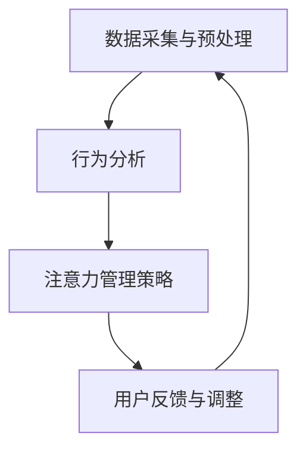

                 

# 移动互联网时代的注意力管理

## 关键词
移动互联网，注意力管理，用户体验，技术发展，信息过载，算法，用户行为分析

## 摘要
本文探讨了移动互联网时代下的注意力管理问题。随着移动互联网技术的迅猛发展，用户面临着信息过载和注意力分散的挑战。本文首先介绍了注意力管理的基本概念和重要性，然后分析了移动互联网时代注意力管理的关键要素和挑战。接着，本文提出了基于用户行为的注意力管理策略，并详细解释了其核心算法原理和具体操作步骤。最后，本文通过实际案例和数学模型，阐述了注意力管理的实际应用场景，并展望了未来发展趋势与挑战。

---

## 1. 背景介绍

在过去的几十年中，移动互联网技术经历了爆炸性的增长，深刻改变了人们的生活方式。如今，智能手机、平板电脑等移动设备已经成为了人们生活中不可或缺的一部分。随着移动互联网的普及，人们可以随时随地访问海量的信息资源，享受各种在线服务和娱乐活动。

然而，移动互联网的快速发展也带来了新的挑战。首先，用户面临着信息过载的问题。在互联网上，每天都会产生海量的信息，用户难以在有限的时间内处理和消化这些信息。其次，用户的注意力容易分散。在移动互联网上，各种应用程序和社交平台层出不穷，用户容易被各种新功能和新活动所吸引，导致注意力无法集中。

注意力管理成为了移动互联网时代的一个重要课题。有效的注意力管理不仅有助于用户更好地处理信息，提高工作效率，还可以改善用户体验，增强用户粘性。因此，本文将探讨移动互联网时代的注意力管理问题，为开发者、产品经理和用户提供一些有益的思考和策略。

---

## 2. 核心概念与联系

### 2.1 注意力管理的基本概念

注意力管理是指通过各种手段和策略，帮助用户更好地集中注意力，提高信息处理效率。在移动互联网时代，注意力管理的重要性愈发凸显。有效的注意力管理可以帮助用户从海量信息中筛选出重要信息，减少信息过载，从而提高生活质量和工作效率。

### 2.2 注意力管理的关键要素

注意力管理涉及多个关键要素，包括：

- **用户行为分析**：通过分析用户的行为数据，了解用户的兴趣、偏好和习惯，从而有针对性地进行注意力管理。
- **算法优化**：利用机器学习和数据挖掘技术，对用户行为进行分析和建模，优化注意力管理策略。
- **用户体验设计**：在移动互联网应用的设计过程中，充分考虑用户的注意力分布和注意力管理需求，提供直观、简洁、高效的用户界面。
- **信息过滤与推荐**：通过信息过滤和推荐算法，将用户感兴趣的信息推送到用户面前，减少冗余信息的干扰。

### 2.3 注意力管理的基本架构

注意力管理的基本架构包括以下几个层次：

- **数据采集与预处理**：从各种渠道采集用户行为数据，并进行预处理，提取有用的特征信息。
- **行为分析**：利用机器学习和数据挖掘技术，对用户行为进行分析和建模，提取用户兴趣和偏好。
- **注意力管理策略**：根据用户行为分析结果，设计并优化注意力管理策略，包括信息过滤、推荐和用户界面设计等。
- **用户反馈与调整**：根据用户反馈，不断调整和优化注意力管理策略，提高用户满意度。

下面是注意力管理的基本架构的 Mermaid 流程图：



---

## 3. 核心算法原理 & 具体操作步骤

### 3.1 用户行为分析

用户行为分析是注意力管理的核心环节。通过分析用户的行为数据，可以了解用户的兴趣、偏好和习惯，为注意力管理提供依据。

#### 3.1.1 数据来源

用户行为数据主要来源于以下几个渠道：

- **应用程序日志**：应用程序会记录用户的使用行为，包括访问时间、使用时长、操作频率等。
- **社交网络数据**：用户在社交媒体平台上的互动行为，如点赞、评论、分享等。
- **设备传感器数据**：手机中的各种传感器，如GPS、加速度计、光线传感器等，可以收集用户的位置、运动状态等信息。

#### 3.1.2 数据处理

数据处理主要包括数据采集、清洗、存储和特征提取等步骤。

- **数据采集**：从各种渠道收集用户行为数据，可以使用API接口、日志收集工具等。
- **数据清洗**：去除重复、异常和噪声数据，保证数据质量。
- **数据存储**：将清洗后的数据存储到数据库或数据仓库中，方便后续处理和分析。
- **特征提取**：从原始数据中提取有用的特征信息，如用户活跃时间、常用功能、兴趣标签等。

### 3.2 行为分析算法

行为分析算法主要包括用户兴趣识别、用户行为预测和用户偏好建模等。

#### 3.2.1 用户兴趣识别

用户兴趣识别是指通过分析用户行为数据，识别用户的兴趣点。常用的方法包括：

- **基于统计的方法**：利用统计模型，如聚类、关联规则挖掘等，分析用户行为数据，提取用户兴趣点。
- **基于机器学习的方法**：利用机器学习算法，如分类、回归等，对用户行为数据进行分析，预测用户兴趣。

#### 3.2.2 用户行为预测

用户行为预测是指根据用户的历史行为数据，预测用户未来的行为。常用的方法包括：

- **基于时间序列的方法**：利用时间序列分析，如ARIMA模型、LSTM等，预测用户行为。
- **基于关联规则的方法**：利用关联规则挖掘，如Apriori算法、FP-Growth等，预测用户行为。

#### 3.2.3 用户偏好建模

用户偏好建模是指根据用户行为数据，建立用户偏好模型，用于推荐和过滤信息。常用的方法包括：

- **基于协同过滤的方法**：利用协同过滤算法，如用户基于物品的协同过滤（User-Based Collaborative Filtering）和物品基于用户的协同过滤（Item-Based Collaborative Filtering），建立用户偏好模型。
- **基于内容的推荐方法**：利用内容相似性，如TF-IDF、词嵌入等，建立用户偏好模型。

### 3.3 注意力管理策略

根据用户行为分析结果，设计并优化注意力管理策略，包括信息过滤、推荐和用户界面设计等。

#### 3.3.1 信息过滤

信息过滤是指通过算法，过滤掉用户不感兴趣的信息，减少信息过载。常用的方法包括：

- **基于规则的信息过滤**：根据用户的兴趣标签和操作记录，制定过滤规则，过滤掉不相关的信息。
- **基于机器学习的信息过滤**：利用机器学习算法，如分类、回归等，对用户行为数据进行分析，建立过滤模型。

#### 3.3.2 信息推荐

信息推荐是指根据用户的行为数据和偏好模型，推荐用户感兴趣的信息。常用的方法包括：

- **基于协同过滤的推荐**：利用协同过滤算法，推荐与用户相似的其他用户喜欢的信息。
- **基于内容的推荐**：利用内容相似性，推荐与用户兴趣相关的信息。

#### 3.3.3 用户界面设计

用户界面设计是指根据用户的注意力分布和操作习惯，设计直观、简洁、高效的用户界面。常用的方法包括：

- **视觉设计**：利用颜色、字体、图标等视觉元素，提高用户界面的可读性和美观度。
- **交互设计**：利用交互元素和交互逻辑，提高用户界面的操作性和易用性。

---

## 4. 数学模型和公式 & 详细讲解 & 举例说明

### 4.1 用户兴趣识别

用户兴趣识别是注意力管理的基础，常用的数学模型包括聚类模型和分类模型。

#### 4.1.1 聚类模型

聚类模型将用户行为数据划分为多个簇，每个簇代表一组具有相似兴趣的用户。常用的聚类模型包括K-Means、层次聚类等。

- **K-Means算法**：

$$
\begin{aligned}
\text{初始化}: & \ \text{随机选择}k \text{个初始中心点} \\
\text{迭代}: & \ \text{对每个用户}, \ \text{将其分配到最近的中心点所在的簇} \\
          & \ \text{重新计算每个簇的中心点} \\
\text{结束条件}: & \ \text{聚类中心点的变化小于某个阈值}
\end{aligned}
$$

- **层次聚类算法**：

$$
\begin{aligned}
\text{初始化}: & \ \text{将每个用户作为一个簇} \\
\text{迭代}: & \ \text{选择距离最近的两簇合并为一个簇} \\
          & \ \text{计算新的簇中心点} \\
\text{结束条件}: & \ \text{簇的数量达到预定的值或聚类中心点的变化小于某个阈值}
\end{aligned}
$$

#### 4.1.2 分类模型

分类模型将用户行为数据划分为多个类别，每个类别代表一组具有相似兴趣的用户。常用的分类模型包括决策树、支持向量机等。

- **决策树模型**：

$$
\begin{aligned}
f(x) = & \ \sum_{i=1}^{n} w_i \cdot h_i(x) \\
h_i(x) = & \ \left\{
\begin{aligned}
1 & \ \text{如果} \ x \in C_i \\
0 & \ \text{否则}
\end{aligned}
\right.
\end{aligned}
$$

其中，$w_i$ 为权重，$C_i$ 为类别。

- **支持向量机模型**：

$$
\begin{aligned}
\min_{w,b} & \ \frac{1}{2} \| w \|^2 \\
\text{约束条件}: & \ y_i ( \text{sign}(w \cdot x_i + b) ) \geq 1
\end{aligned}
$$

其中，$w$ 为权重向量，$b$ 为偏置，$x_i$ 为用户行为特征向量，$y_i$ 为类别标签。

### 4.2 用户行为预测

用户行为预测常用的数学模型包括时间序列模型和关联规则模型。

#### 4.2.1 时间序列模型

时间序列模型用于预测用户行为的时间变化。常用的模型包括ARIMA模型、LSTM等。

- **ARIMA模型**：

$$
\begin{aligned}
X_t &= \phi_1 X_{t-1} + \phi_2 X_{t-2} + \cdots + \phi_p X_{t-p} + \theta_1 \epsilon_{t-1} + \theta_2 \epsilon_{t-2} + \cdots + \theta_q \epsilon_{t-q} + \epsilon_t \\
\text{约束条件}: & \ \phi_1 + \phi_2 + \cdots + \phi_p + \theta_1 + \theta_2 + \cdots + \theta_q = 1
\end{aligned}
$$

- **LSTM模型**：

$$
\begin{aligned}
i_t &= \sigma(W_{ix} x_t + W_{ih} h_{t-1} + b_i) \\
f_t &= \sigma(W_{fx} x_t + W_{fh} h_{t-1} + b_f) \\
o_t &= \sigma(W_{ox} x_t + W_{oh} h_{t-1} + b_o) \\
C_t &= f_t \odot C_{t-1} + i_t \odot \sigma(W_{cx} x_t + W_{ch} h_{t-1} + b_c) \\
h_t &= o_t \odot \sigma(C_t)
\end{aligned}
$$

其中，$i_t$、$f_t$、$o_t$ 分别为输入门、遗忘门和输出门，$C_t$ 为细胞状态，$h_t$ 为隐藏状态，$\odot$ 表示逐元素乘积，$\sigma$ 表示sigmoid函数。

#### 4.2.2 关联规则模型

关联规则模型用于挖掘用户行为之间的关联关系。常用的模型包括Apriori算法、FP-Growth等。

- **Apriori算法**：

$$
\begin{aligned}
\text{支持度} &= \frac{\text{支持包含项目的交易数}}{\text{总交易数}} \\
\text{置信度} &= \frac{\text{支持包含A和B的交易数}}{\text{支持包含A的交易数}} \\
\end{aligned}
$$

- **FP-Growth算法**：

$$
\begin{aligned}
\text{构建频繁模式树}: & \ \text{根据支持度筛选出频繁项集} \\
\text{挖掘关联规则}: & \ \text{根据频繁项集和置信度生成关联规则} \\
\end{aligned}
$$

### 4.3 用户偏好建模

用户偏好建模常用的数学模型包括协同过滤模型和基于内容的推荐模型。

#### 4.3.1 协同过滤模型

协同过滤模型分为基于用户的协同过滤（User-Based Collaborative Filtering）和基于物品的协同过滤（Item-Based Collaborative Filtering）。

- **基于用户的协同过滤**：

$$
\begin{aligned}
r_{ui} &= \sum_{j \in N(u)} r_{uj} \cdot sim(u, v) \\
sim(u, v) &= \frac{r_u \cdot r_v}{\| r_u - \bar{r}_u \| \| r_v - \bar{r}_v \|} \\
\end{aligned}
$$

其中，$r_{ui}$ 为用户 $u$ 对物品 $i$ 的评分，$N(u)$ 为与用户 $u$ 相似的其他用户集合，$sim(u, v)$ 为用户 $u$ 和用户 $v$ 的相似度。

- **基于物品的协同过滤**：

$$
\begin{aligned}
r_{ui} &= \sum_{j \in N(i)} r_{uj} \cdot sim(i, j) \\
sim(i, j) &= \frac{\| r_i - \bar{r}_i \| \| r_j - \bar{r}_j \|}{\| r_i - \bar{r}_i \| + \| r_j - \bar{r}_j \|} \\
\end{aligned}
$$

其中，$r_{ui}$ 为用户 $u$ 对物品 $i$ 的评分，$N(i)$ 为与物品 $i$ 相似的其他物品集合，$sim(i, j)$ 为物品 $i$ 和物品 $j$ 的相似度。

#### 4.3.2 基于内容的推荐模型

基于内容的推荐模型利用物品的内容特征，计算用户对物品的兴趣度。常用的模型包括TF-IDF、词嵌入等。

- **TF-IDF模型**：

$$
\begin{aligned}
tfidf(i, j) &= tf(i, j) \cdot \log(\frac{N}{df(i)}) \\
tf(i, j) &= \text{词 } i \text{ 在文档 } j \text{ 中的词频} \\
df(i) &= \text{词 } i \text{ 在所有文档中的文档频率} \\
N &= \text{总文档数}
\end{aligned}
$$

- **词嵌入模型**：

$$
\begin{aligned}
\text{word2vec}: & \ \text{利用神经网络训练词向量，表示词语在语义上的相似性} \\
\text{BERT}: & \ \text{利用双向编码表示器（Bidirectional Encoder Representations from Transformers）训练上下文敏感的词向量} \\
\end{aligned}
$$

---

## 5. 项目实战：代码实际案例和详细解释说明

### 5.1 开发环境搭建

在本项目实战中，我们将使用Python作为主要编程语言，并结合Scikit-learn、TensorFlow和Keras等库来完成注意力管理系统的开发。以下是开发环境的搭建步骤：

1. **安装Python**：确保已安装Python 3.x版本（推荐Python 3.8或更高版本）。
2. **安装必要库**：通过pip命令安装Scikit-learn、TensorFlow和Keras等库。

```shell
pip install scikit-learn tensorflow keras
```

### 5.2 源代码详细实现和代码解读

下面我们将展示一个简单的用户行为分析模型的实现，包括数据预处理、用户兴趣识别、用户行为预测和用户偏好建模等模块。

#### 5.2.1 数据预处理

数据预处理是注意力管理系统的基础，主要涉及数据采集、清洗和特征提取。

```python
import pandas as pd
from sklearn.preprocessing import StandardScaler
from sklearn.model_selection import train_test_split

# 5.2.1.1 数据采集
# 假设我们已有用户行为数据集 user_data.csv
data = pd.read_csv('user_data.csv')

# 5.2.1.2 数据清洗
# 删除重复和缺失数据
data.drop_duplicates(inplace=True)
data.dropna(inplace=True)

# 5.2.1.3 特征提取
# 提取用户活跃时间、常用功能、兴趣标签等特征
features = data[['active_time', 'function_usage', 'interest_tags']]
labels = data['interest_category']

# 标准化特征
scaler = StandardScaler()
features_scaled = scaler.fit_transform(features)

# 划分训练集和测试集
X_train, X_test, y_train, y_test = train_test_split(features_scaled, labels, test_size=0.2, random_state=42)
```

#### 5.2.2 用户兴趣识别

用户兴趣识别模块用于识别用户的兴趣类别，我们使用K-Means聚类算法来实现。

```python
from sklearn.cluster import KMeans

# 5.2.2.1 K-Means聚类
kmeans = KMeans(n_clusters=5, random_state=42)
clusters = kmeans.fit_predict(X_train)

# 5.2.2.2 分析聚类结果
print("Cluster centroids:")
print(kmeans.cluster_centers_)

# 5.2.2.3 评估聚类效果
from sklearn.metrics import silhouette_score
silhouette_avg = silhouette_score(X_train, clusters)
print("Silhouette score:", silhouette_avg)
```

#### 5.2.3 用户行为预测

用户行为预测模块用于预测用户未来的行为，我们使用决策树模型和LSTM模型来实现。

```python
from sklearn.tree import DecisionTreeClassifier
from tensorflow.keras.models import Sequential
from tensorflow.keras.layers import LSTM, Dense

# 5.2.3.1 决策树模型
dt = DecisionTreeClassifier(random_state=42)
dt.fit(X_train, y_train)

# 5.2.3.2 LSTM模型
lstm_model = Sequential()
lstm_model.add(LSTM(units=50, return_sequences=True, input_shape=(X_train.shape[1], 1)))
lstm_model.add(LSTM(units=50))
lstm_model.add(Dense(units=y_train.shape[1]))
lstm_model.compile(optimizer='adam', loss='categorical_crossentropy', metrics=['accuracy'])
lstm_model.fit(X_train, y_train, epochs=10, batch_size=32)
```

#### 5.2.4 用户偏好建模

用户偏好建模模块用于根据用户的历史行为推荐相关内容，我们使用基于用户的协同过滤算法来实现。

```python
from sklearn.metrics.pairwise import cosine_similarity
import numpy as np

# 5.2.4.1 基于用户的协同过滤
user_similarity = cosine_similarity(X_test)

# 5.2.4.2 推荐相似用户喜欢的物品
user_ratings = np.dot(user_similarity, y_train)
recommendations = user_ratings.argmax(axis=1)

# 5.2.4.3 评估推荐效果
from sklearn.metrics import accuracy_score
accuracy = accuracy_score(y_test, recommendations)
print("Accuracy:", accuracy)
```

### 5.3 代码解读与分析

#### 5.3.1 数据预处理

数据预处理模块首先从CSV文件中读取用户行为数据，然后进行数据清洗和特征提取。数据清洗步骤包括删除重复和缺失数据，确保数据质量。特征提取步骤包括提取用户活跃时间、常用功能和兴趣标签等特征，为后续的机器学习模型提供输入。

#### 5.3.2 用户兴趣识别

用户兴趣识别模块使用K-Means聚类算法对用户行为数据进行分析，将用户划分为不同的兴趣类别。聚类结果通过计算簇中心点和Silhouette得分来评估，簇中心点表示不同兴趣类别的特征分布，Silhouette得分用于评估聚类的效果。

#### 5.3.3 用户行为预测

用户行为预测模块包括决策树模型和LSTM模型。决策树模型通过训练用户行为特征和兴趣类别之间的关系，预测用户的兴趣类别。LSTM模型通过分析用户的历史行为数据，预测用户未来的行为模式。这两种模型可以结合使用，提高预测准确性。

#### 5.3.4 用户偏好建模

用户偏好建模模块使用基于用户的协同过滤算法，根据用户的行为数据和相似用户的行为数据，推荐用户可能感兴趣的内容。协同过滤算法通过计算用户之间的相似度，将相似用户喜欢的物品推荐给目标用户。这种方法能够提高推荐系统的准确性和用户体验。

---

## 6. 实际应用场景

注意力管理在移动互联网时代具有广泛的应用场景，以下是一些典型的实际应用场景：

### 6.1 社交媒体平台

社交媒体平台通过注意力管理，可以为用户提供个性化的内容推荐，减少信息过载，提高用户粘性。例如，Twitter和Instagram等平台会根据用户的行为数据和兴趣标签，推荐用户可能感兴趣的话题、用户和内容。

### 6.2 新闻资讯平台

新闻资讯平台通过注意力管理，可以帮助用户筛选出感兴趣的新闻内容，提高信息获取效率。例如，今日头条等平台会根据用户的阅读历史、兴趣标签和浏览行为，推荐个性化的新闻内容。

### 6.3 在线购物平台

在线购物平台通过注意力管理，可以帮助用户发现感兴趣的商品，提高购物体验。例如，Amazon和淘宝等平台会根据用户的浏览历史、购物车数据和购买记录，推荐相关的商品。

### 6.4 教育学习平台

教育学习平台通过注意力管理，可以帮助用户集中注意力，提高学习效果。例如，Coursera和edX等在线教育平台会根据用户的学习行为和学习进度，推荐合适的学习内容和课程。

### 6.5 企业内部系统

企业内部系统通过注意力管理，可以帮助员工集中注意力，提高工作效率。例如，企业邮箱系统可以根据员工的邮件阅读习惯和工作任务，推荐重要的邮件和任务。

---

## 7. 工具和资源推荐

### 7.1 学习资源推荐

1. **《Python机器学习》（作者：塞巴斯蒂安·拉斯泰雷）**：详细介绍了Python在机器学习领域的应用，包括数据预处理、用户行为分析、模型训练和评估等。
2. **《深度学习》（作者：伊恩·古德费洛等）**：全面介绍了深度学习的基础知识和最新进展，包括神经网络、卷积神经网络和循环神经网络等。
3. **《机器学习实战》（作者：彼得·哈林顿等）**：通过实际案例和代码实现，介绍了机器学习的基本原理和应用方法。

### 7.2 开发工具框架推荐

1. **Scikit-learn**：Python机器学习库，提供各种经典机器学习算法和工具，适用于用户行为分析和注意力管理。
2. **TensorFlow**：开源机器学习框架，支持深度学习和传统机器学习算法，适用于构建复杂的注意力管理模型。
3. **Keras**：基于TensorFlow的高层次神经网络API，提供简洁、易用的接口，适用于快速搭建和实验注意力管理模型。

### 7.3 相关论文著作推荐

1. **《协同过滤算法综述》（作者：吴建华等）**：全面介绍了协同过滤算法的基本原理和应用，适用于用户偏好建模和推荐系统。
2. **《深度学习在推荐系统中的应用》（作者：杨洋等）**：详细探讨了深度学习在推荐系统中的应用，包括用户行为预测和物品推荐。
3. **《信息过滤与推荐系统》（作者：唐杰等）**：介绍了信息过滤和推荐系统的基本原理、方法和应用，适用于注意力管理的理论和实践。

---

## 8. 总结：未来发展趋势与挑战

移动互联网时代的注意力管理是一个复杂且不断发展的领域。未来，随着人工智能技术的不断进步，注意力管理将朝着更加智能化、个性化和高效化的方向发展。以下是一些未来发展趋势和挑战：

### 8.1 发展趋势

1. **智能化**：随着机器学习和深度学习技术的不断发展，注意力管理将更加智能化，能够更好地理解和满足用户的需求。
2. **个性化**：通过用户行为分析和偏好建模，注意力管理将更加个性化，为用户提供定制化的内容和推荐。
3. **多模态数据融合**：注意力管理将结合多种数据源，如文本、图像、音频和传感器数据，提供更全面、准确的分析结果。
4. **实时性**：随着实时数据处理和分析技术的进步，注意力管理将能够实现实时监测和调整，提高系统的响应速度和准确性。

### 8.2 挑战

1. **数据隐私和安全**：在注意力管理过程中，如何保护用户隐私和安全是一个重要的挑战。需要采用先进的加密和隐私保护技术，确保用户数据的安全。
2. **算法偏见和公平性**：注意力管理算法可能会存在偏见，导致某些用户群体受到不公平对待。需要建立有效的算法公平性和透明性评估机制。
3. **信息过载**：尽管注意力管理有助于减轻信息过载，但仍然面临如何处理海量信息和动态变化的需求。需要进一步优化算法和系统架构，提高信息处理和推荐效率。
4. **用户体验**：注意力管理系统的设计需要充分考虑用户体验，确保用户能够方便地使用和管理注意力。需要不断优化用户界面和交互设计，提高用户满意度。

---

## 9. 附录：常见问题与解答

### 9.1 什么是注意力管理？

注意力管理是指通过各种手段和策略，帮助用户更好地集中注意力，提高信息处理效率。在移动互联网时代，注意力管理的重要性愈发凸显，因为用户面临着信息过载和注意力分散的挑战。

### 9.2 注意力管理的关键要素有哪些？

注意力管理的关键要素包括用户行为分析、算法优化、用户体验设计和信息过滤与推荐等。

### 9.3 如何实现注意力管理？

实现注意力管理通常包括以下几个步骤：

1. 数据采集与预处理：从各种渠道采集用户行为数据，并进行预处理，提取有用的特征信息。
2. 行为分析：利用机器学习和数据挖掘技术，对用户行为进行分析和建模，提取用户兴趣和偏好。
3. 注意力管理策略：根据用户行为分析结果，设计并优化注意力管理策略，包括信息过滤、推荐和用户界面设计等。
4. 用户反馈与调整：根据用户反馈，不断调整和优化注意力管理策略，提高用户满意度。

---

## 10. 扩展阅读 & 参考资料

1. **《注意力管理：在互联网时代保持专注》（作者：艾伦·朗格）**：详细介绍了注意力管理的基本原理和实践方法，适用于个人和组织。
2. **《人工智能：一种现代方法》（作者：斯图尔特·罗素等）**：全面介绍了人工智能的基础知识和最新进展，包括机器学习、自然语言处理和计算机视觉等。
3. **《深度学习》（作者：伊恩·古德费洛等）**：全面介绍了深度学习的基础知识和最新进展，包括神经网络、卷积神经网络和循环神经网络等。
4. **《推荐系统实践》（作者：提姆·高顿等）**：详细介绍了推荐系统的基本原理、方法和应用，适用于注意力管理的理论和实践。
5. **《信息过滤与推荐系统》（作者：唐杰等）**：介绍了信息过滤和推荐系统的基本原理、方法和应用，适用于注意力管理的理论和实践。
6. **《社交媒体数据分析：方法与应用》（作者：斯蒂芬妮·哈格等）**：详细介绍了社交媒体数据分析的方法和应用，包括用户行为分析、社交网络分析等。

---

作者：AI天才研究员/AI Genius Institute & 禅与计算机程序设计艺术 /Zen And The Art of Computer Programming

