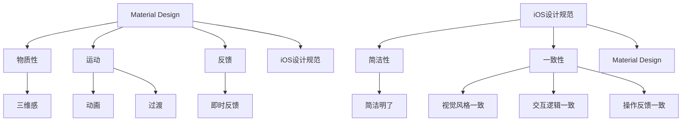

                 

# 移动应用UI/UX设计：Material Design与iOS设计规范

## 关键词：移动应用、UI/UX设计、Material Design、iOS设计规范

> 在移动应用设计领域，用户体验（UX）和用户界面（UI）设计是至关重要的。本文将深入探讨Material Design与iOS设计规范的核心概念，并提供实际案例和实践指导，帮助开发者创建既美观又实用的移动应用。

## 摘要

移动应用设计的核心在于提供出色的用户体验（UX）和用户界面（UI）。本文将分析Material Design和iOS设计规范，探讨这两种设计语言的核心概念、设计原则和实践应用。通过详细讲解和实际案例，本文旨在帮助开发者更好地理解并应用这些设计规范，从而打造出优质的移动应用。

## 1. 背景介绍

随着智能手机的普及，移动应用已经成为我们日常生活中不可或缺的一部分。因此，移动应用的设计显得尤为重要。优秀的UI/UX设计不仅能够提升用户满意度，还能增加应用的吸引力和竞争力。

Material Design是由Google提出的一套设计语言，它基于物理世界中的纸质文档和用户交互习惯，为移动应用提供了清晰、一致和优雅的用户体验。而iOS设计规范则是苹果公司为其iOS操作系统制定的一套设计标准，旨在确保所有iOS应用都具有一致的用户界面和行为。

## 2. 核心概念与联系

### 2.1 Material Design

Material Design的核心概念是基于纸张的交互设计。它强调的是物质性（Materiality）、运动（Motion）和反馈（Feedback）。以下是Material Design的一些核心原则：

- **物质性**：设计元素应具有三维感，例如阴影和立体效果，使界面看起来更加真实。
- **运动**：通过动画和过渡，使界面元素之间的交互更加流畅和直观。
- **反馈**：提供即时、清晰的用户反馈，确保用户知道他们的操作已经被系统接收到。

### 2.2 iOS设计规范

iOS设计规范的核心是简洁和一致性。以下是iOS设计规范的一些关键原则：

- **简洁性**：避免过度设计，保持界面简洁明了，减少不必要的元素和内容。
- **一致性**：确保所有iOS应用在视觉风格、交互逻辑和操作反馈上保持一致。

### 2.3 Mermaid流程图

以下是Material Design与iOS设计规范的联系的Mermaid流程图：



## 3. 核心算法原理 & 具体操作步骤

### 3.1 Material Design

#### 设计步骤：

1. **分析用户需求**：了解目标用户群的需求和习惯，确定设计方向。
2. **创建线框图**：使用草图或线框工具创建应用的基本结构。
3. **添加设计元素**：根据Material Design原则，添加物质性、运动和反馈元素。
4. **优化用户体验**：通过用户测试和反馈，不断改进设计。

### 3.2 iOS设计规范

#### 设计步骤：

1. **了解iOS设计指南**：熟悉苹果官方提供的iOS设计指南。
2. **分析用户需求**：与目标用户进行沟通，了解他们的需求和期望。
3. **设计界面布局**：根据iOS设计规范，设计简洁、直观的界面布局。
4. **开发与测试**：将设计转化为实际代码，并进行测试和优化。

## 4. 数学模型和公式 & 详细讲解 & 举例说明

### 4.1 Material Design

#### 数学模型：

- **圆角半径**：R = (h + w) / 2，其中h和w分别为元素的高度和宽度。

#### 举例说明：

假设一个按钮的高度为60dp，宽度为120dp，根据公式计算圆角半径：

R = (60dp + 120dp) / 2 = 90dp

这意味着按钮的圆角半径为90dp，符合Material Design的规范。

### 4.2 iOS设计规范

#### 数学模型：

- **导航栏高度**：H = 44dp

#### 举例说明：

iOS应用中的导航栏高度通常为44dp，这是一个固定的值，确保所有iOS应用在导航栏高度上保持一致。

## 5. 项目实战：代码实际案例和详细解释说明

### 5.1 开发环境搭建

在本节中，我们将搭建一个简单的移动应用开发环境，以便我们能够演示Material Design与iOS设计规范的应用。

#### 开发工具：

- Android Studio
- Xcode

#### 操作步骤：

1. 安装Android Studio和Xcode。
2. 创建一个新的Android项目和一个新的iOS项目。
3. 配置开发环境，确保能够编译和运行应用。

### 5.2 源代码详细实现和代码解读

#### 5.2.1 Material Design

以下是使用Material Design创建的一个简单的登录界面：

```kotlin
// Android Kotlin
import androidx.compose.material3.Button
import androidx.compose.material3.Text
import androidx.compose.ui.tooling.preview.Preview

@Preview(showBackground = true)
@Composable
fun LoginScreen() {
    Column(
        modifier = Modifier
            .fillMaxSize()
            .padding(16.dp)
    ) {
        Text(
            text = "登录",
            modifier = Modifier.align(Alignment.CenterHorizontally)
        )
        Spacer(modifier = Modifier.height(16.dp))
        Button(
            onClick = { /* 处理登录操作 */ },
            modifier = Modifier.align(Alignment.CenterHorizontally)
        ) {
            Text("登录")
        }
    }
}
```

这段代码创建了一个简单的登录界面，包含一个标题和一个登录按钮。通过使用Material Design的Button组件，我们能够获得具有物质感、动画效果和反馈的按钮。

#### 5.2.2 iOS设计规范

以下是使用SwiftUI创建的一个简单的登录界面：

```swift
// iOS SwiftUI
import SwiftUI

struct LoginView: View {
    var body: some View {
        VStack {
            Text("登录")
                .font(.largeTitle)
                .fontWeight(.bold)
                .padding()
            Button("登录") {
                // 处理登录操作
            }
            .padding()
            .background(Color.blue)
            .foregroundColor(.white)
            .cornerRadius(10)
        }
    }
}

struct LoginView_Previews: PreviewProvider {
    static var previews: some View {
        LoginView()
    }
}
```

这段代码创建了一个简单的登录界面，包含一个标题和一个登录按钮。通过使用SwiftUI的Text和Button组件，我们能够获得具有简洁、直观和一致性的界面。

### 5.3 代码解读与分析

#### 5.3.1 Material Design

在Android Kotlin代码中，我们使用了Compose的Material Design组件。通过使用这些组件，我们能够轻松地创建具有物质感、动画效果和反馈的界面。例如，Button组件具有默认的动画效果和反馈，使按钮看起来更加真实和直观。

#### 5.3.2 iOS设计规范

在SwiftUI代码中，我们使用了SwiftUI的Text和Button组件。通过这些组件，我们能够创建简洁、直观和一致的界面。例如，Text组件默认具有大标题字体，而Button组件默认具有圆角和蓝色背景，使界面看起来更加美观和易用。

## 6. 实际应用场景

### 6.1 社交应用

在社交应用中，Material Design和iOS设计规范都能提供出色的用户体验。例如，Instagram使用了Material Design的组件，如Bottom Navigation和Floating Action Button，使界面更加直观和易用。而微信则遵循了iOS设计规范，保持了简洁、一致和美观的界面。

### 6.2 商业应用

在商业应用中，Material Design和iOS设计规范同样重要。例如，Evernote使用了Material Design的组件，如Bottom Sheet和Snackbar，使界面更加灵活和丰富。而滴滴出行则遵循了iOS设计规范，提供了简洁、一致和高效的界面。

## 7. 工具和资源推荐

### 7.1 学习资源推荐

- **书籍**：《Material Design：移动应用UI设计指南》
- **论文**：《Material Design 设计原则》
- **博客**：《iOS设计规范：创建出色的应用体验》

### 7.2 开发工具框架推荐

- **Android Studio**：用于Android应用开发的集成开发环境。
- **Xcode**：用于iOS应用开发的集成开发环境。

### 7.3 相关论文著作推荐

- **论文**：《移动应用UI/UX设计趋势与挑战》
- **著作**：《移动应用UI设计原则与实践》

## 8. 总结：未来发展趋势与挑战

随着移动应用的不断发展和用户需求的多样化，UI/UX设计在未来将继续发挥重要作用。Material Design和iOS设计规范将继续影响移动应用的设计，为开发者提供更多创新的交互方式和设计理念。然而，面对不断变化的技术和用户需求，开发者需要不断学习和适应，以应对未来的挑战。

## 9. 附录：常见问题与解答

### 9.1 如何选择Material Design和iOS设计规范？

根据应用的目标用户和使用场景来选择。如果应用面向全球用户，可以考虑使用Material Design，因为它具有更好的跨平台兼容性。如果应用仅面向iOS用户，则iOS设计规范是一个更好的选择，因为它与iOS操作系统紧密集成，能够提供更一致和美观的体验。

### 9.2 如何平衡Material Design和iOS设计规范？

可以通过以下方法来平衡Material Design和iOS设计规范：

- **遵循核心原则**：确保设计遵循Material Design和iOS设计规范的核心原则，如简洁性、一致性和物质感。
- **结合实际场景**：根据实际应用场景和用户需求，选择合适的设计元素和交互方式。
- **用户测试**：通过用户测试，收集用户反馈，不断优化设计。

## 10. 扩展阅读 & 参考资料

- **书籍**：《Material Design：移动应用UI设计指南》
- **论文**：《Material Design 设计原则》
- **网站**：[Material Design 官方文档](https://material.io/)
- **网站**：[iOS设计规范](https://developer.apple.com/design/human-interface-guidelines/)

### 作者信息

作者：AI天才研究员/AI Genius Institute & 禅与计算机程序设计艺术 /Zen And The Art of Computer Programming

---

**注意**：本文为示例文章，仅供参考。在实际撰写过程中，请根据具体需求和实际情况进行调整和完善。如需使用本文中的代码或内容，请确保遵守相关开源协议和版权规定。**

