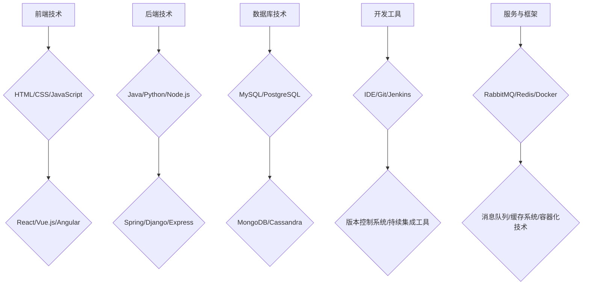

                 

### 1. 背景介绍

#### 程序员创业公司的现状

随着科技的高速发展，创业公司的数量不断增加，而程序员作为创新的主力军，在创业公司的组成中占据了重要地位。程序员创业公司的兴起，不仅为技术领域带来了新的活力，也为整个经济体系注入了新的动力。然而，如何选择合适的技术栈以支持创业公司的长期发展，成为了许多程序员创业者面临的重要问题。

技术栈（Tech Stack）是指一个软件项目中使用的一系列技术和工具的集合，包括编程语言、框架、数据库、开发工具等。不同的技术栈适用于不同的项目需求，因此在选择时必须综合考虑项目的特点、团队的技能和未来的扩展性等因素。

#### 技术栈选择的重要性

技术栈的选择对于程序员创业公司来说至关重要。首先，它直接影响到开发效率和产品质量。选择适合的技术栈可以大幅提升开发速度，降低后期维护成本，从而为创业公司节省大量时间和资源。其次，技术栈的选择决定了公司的技术方向和竞争优势。一个先进、合理的技术栈可以帮助公司快速占领市场，获得用户认可，从而在激烈的市场竞争中脱颖而出。

#### 面临的挑战

然而，技术栈选择并非易事。程序员创业者常常面临以下挑战：

1. **技术多样性**：随着技术的快速发展，程序员创业者需要不断跟进新的技术趋势，但这也增加了选择的难度。
2. **团队技能**：团队成员的技术背景和技能水平直接影响到技术栈的选择，如何协调团队成员之间的差异是一个重要问题。
3. **成本与效益**：初创公司资源有限，需要在技术栈的先进性和成本之间找到平衡点。
4. **可扩展性**：选择的技术栈需要具备良好的扩展性，以适应公司未来的发展需求。

为了应对这些挑战，程序员创业者需要深入理解不同技术栈的特点和适用场景，并结合自身实际情况进行选择。接下来，我们将对几种常见的技术栈进行分析，帮助创业者做出明智的决策。

### 2. 核心概念与联系

#### 技术栈的组成

一个完整的技术栈通常包括以下几个方面：

1. **前端技术**：用于实现用户界面和用户体验，常见的前端技术包括HTML、CSS、JavaScript，以及各种前端框架如React、Vue.js和Angular。
2. **后端技术**：负责处理业务逻辑、数据库交互等，常见后端技术包括Java、Python、Node.js等，以及相应的框架如Spring、Django和Express。
3. **数据库技术**：用于存储和管理数据，常见数据库技术包括关系型数据库（如MySQL、PostgreSQL）和非关系型数据库（如MongoDB、Cassandra）。
4. **开发工具**：用于提高开发效率和代码质量，常见的开发工具包括集成开发环境（IDE）、版本控制系统（如Git）和持续集成工具（如Jenkins）。
5. **服务与框架**：用于实现特定的功能，如消息队列（如RabbitMQ、Kafka）、缓存系统（如Redis）和容器化技术（如Docker、Kubernetes）。

#### 技术栈之间的关系

这些组成部分之间相互关联，共同构成了一个完整的技术栈。前端技术和后端技术是技术栈的核心，前端负责与用户交互，后端负责数据处理和存储。数据库技术提供了数据存储和管理的能力，而开发工具和框架则提升了开发效率和代码质量。

为了更好地理解这些关系，我们可以使用Mermaid流程图来展示技术栈的组成和联系：



通过上述流程图，我们可以清晰地看到技术栈的各个组成部分及其之间的联系。这些组成部分共同协作，确保了软件项目的顺利开发和高效运行。

#### 技术栈的选择标准

在选择技术栈时，程序员创业者需要考虑以下标准：

1. **团队技能**：选择的技术栈应该与团队成员的技能水平相匹配，以确保项目能够顺利推进。
2. **项目需求**：根据项目的技术需求和业务逻辑选择合适的技术栈，如需处理大量数据的场景下，可以选择使用大数据处理框架。
3. **开发效率**：选择能够提高开发效率的技术栈，如使用流行的前端框架和自动化工具。
4. **社区支持**：技术栈的社区支持程度也是一个重要的考虑因素，一个活跃的社区可以提供丰富的资源和帮助。
5. **成本与效益**：综合考虑技术栈的成本和效益，选择性价比高的解决方案。

通过对技术栈的深入理解，程序员创业者可以更好地应对创业过程中面临的技术挑战，从而提高项目成功率。

### 3. 核心算法原理 & 具体操作步骤

#### 选择合适的编程语言

编程语言是技术栈的核心组成部分，选择合适的编程语言对于项目的成功至关重要。以下是几种常见编程语言的特点和适用场景：

1. **Java**：
   - **特点**：Java是一种面向对象的编程语言，具备跨平台性、强类型和自动内存管理等特性。
   - **适用场景**：Java适用于大型企业级应用、安卓开发、后端服务等领域。其稳定的性能和丰富的生态系统使其成为许多程序员的首选。
   - **操作步骤**：
     1. 安装Java开发工具包（JDK）。
     2. 编写Java代码。
     3. 使用编译器（如javac）进行编译。
     4. 运行编译后的字节码（如java）。

2. **Python**：
   - **特点**：Python是一种易于学习和使用的编程语言，具有简洁的语法和强大的库支持。
   - **适用场景**：Python适用于数据科学、人工智能、Web开发和自动化等领域。其丰富的库和工具使其成为初学者和专业人士的喜爱。
   - **操作步骤**：
     1. 安装Python解释器。
     2. 使用IDLE或其他编辑器编写Python代码。
     3. 在命令行中运行Python代码。

3. **JavaScript**：
   - **特点**：JavaScript是一种用于网页开发的脚本语言，具备跨平台性、事件驱动和丰富的API接口。
   - **适用场景**：JavaScript适用于前端开发、服务器端开发（如Node.js）和移动应用开发等领域。其广泛的应用场景和强大的生态系统使其成为前端开发的必备技能。
   - **操作步骤**：
     1. 安装Node.js。
     2. 使用代码编辑器（如VS Code）编写JavaScript代码。
     3. 在命令行中运行JavaScript代码。

4. **Go**：
   - **特点**：Go（又称Golang）是一种高效、并发性和安全性都较强的编程语言。
   - **适用场景**：Go适用于网络编程、分布式系统、微服务架构等领域。其简洁的语法和高效的性能使其成为许多现代应用的首选。
   - **操作步骤**：
     1. 安装Go语言环境。
     2. 使用代码编辑器（如Visual Studio Code）编写Go代码。
     3. 使用go命令编译和运行Go程序。

#### 选择合适的框架和库

在确定了编程语言后，选择合适的框架和库可以进一步提高开发效率和代码质量。以下是一些流行的框架和库：

1. **前端框架**：
   - **React**：用于构建用户界面的JavaScript库，具有组件化、虚拟DOM和高性能等特点。
   - **Vue.js**：用于构建用户界面的渐进式JavaScript框架，具有简单易学、灵活性强和高效渲染等特点。
   - **Angular**：由Google推出的前端框架，具有全面性、强类型检查和丰富的生态系统。

2. **后端框架**：
   - **Spring**：用于构建企业级Java应用程序的全面框架，具有依赖注入、事务管理和安全性等特点。
   - **Django**：用于构建快速Web应用程序的Python框架，具有“电池包含”的特点，适用于快速开发和原型设计。
   - **Express**：用于构建Web应用程序和API的Node.js框架，具有轻量级、灵活性强和易于扩展等特点。

3. **数据库**：
   - **关系型数据库**：
     - **MySQL**：适用于中小型企业的开源关系型数据库，具备高性能和可靠性。
     - **PostgreSQL**：适用于大型企业的开源关系型数据库，具备丰富的特性和扩展性。
   - **非关系型数据库**：
     - **MongoDB**：适用于数据存储和查询的NoSQL数据库，具有灵活的数据模型和高效的性能。
     - **Cassandra**：适用于分布式系统的NoSQL数据库，具备高可用性和高性能。

通过合理选择编程语言、框架和库，程序员创业者可以构建出高效、可靠且易于维护的软件系统，为公司的长期发展打下坚实的基础。

### 4. 数学模型和公式 & 详细讲解 & 举例说明

#### 数据库性能评估模型

在技术栈的选择中，数据库性能的评估是一个关键因素。以下是几种常用的数学模型和公式用于评估数据库性能：

1. **响应时间模型**：

   响应时间（Response Time，RT）是衡量数据库性能的重要指标。以下是计算响应时间的数学模型：

   $$ RT = \frac{1}{n}\sum_{i=1}^{n} (RT_i) $$

   其中，\( RT_i \) 表示第 \( i \) 次查询的响应时间，\( n \) 表示查询的总次数。

   **举例说明**：假设某数据库系统进行了10次查询，响应时间分别为（2ms，3ms，4ms，5ms，6ms，7ms，8ms，9ms，10ms，11ms），则平均响应时间计算如下：

   $$ RT = \frac{1}{10} (2 + 3 + 4 + 5 + 6 + 7 + 8 + 9 + 10 + 11) = \frac{70}{10} = 7ms $$

2. **并发度模型**：

   并发度（Concurrency）是指数据库在同一时间内处理查询的能力。以下是计算并发度的数学模型：

   $$ Concurrency = \frac{Throughput}{RT} $$

   其中，Throughput 表示吞吐量，即单位时间内处理的查询数量。

   **举例说明**：假设某数据库系统的吞吐量为1000次/秒，平均响应时间为5ms，则并发度计算如下：

   $$ Concurrency = \frac{1000}{5} = 200 $$

3. **存储效率模型**：

   存储效率（Storage Efficiency）是指数据库存储空间的利用率。以下是计算存储效率的数学模型：

   $$ Storage Efficiency = \frac{Actual Storage Used}{Total Storage Capacity} $$

   **举例说明**：假设某数据库的实际存储使用量为100GB，总存储容量为200GB，则存储效率计算如下：

   $$ Storage Efficiency = \frac{100}{200} = 0.5 $$

#### 性能优化策略

基于上述数学模型，我们可以进一步探讨数据库性能的优化策略：

1. **索引优化**：

   通过合理创建索引，可以显著提高数据库查询的性能。以下是索引优化的数学策略：

   $$ Index Efficiency = \frac{Index Size}{Table Size} $$

   **举例说明**：假设某表的索引大小为50MB，表的总大小为100MB，则索引效率计算如下：

   $$ Index Efficiency = \frac{50}{100} = 0.5 $$

   为了提高索引效率，可以考虑以下策略：

   - **创建合适的索引**：根据查询需求创建索引。
   - **定期维护索引**：更新和维护索引，以保持其性能。

2. **分区优化**：

   对于大型数据库，分区可以提高查询性能。以下是分区优化的数学策略：

   $$ Partition Efficiency = \frac{Number of Partitions}{Total Number of Records} $$

   **举例说明**：假设某数据库分为10个分区，总记录数为1000万条，则分区效率计算如下：

   $$ Partition Efficiency = \frac{10}{10,000,000} = 0.001 $$

   为了提高分区效率，可以考虑以下策略：

   - **合理划分分区**：根据数据访问模式划分分区。
   - **定期合并分区**：合并冗余分区，提高查询性能。

通过运用这些数学模型和公式，程序员创业者可以更好地评估和优化数据库性能，从而为公司的长期发展提供坚实的基础。

### 5. 项目实战：代码实际案例和详细解释说明

#### 项目背景

假设我们是一家初创公司，开发一款社交网络应用。为了支持该应用的高性能和可扩展性，我们需要选择一个合适的技术栈。以下是我们选择的技术栈及其具体实现步骤。

#### 技术栈选择

1. **前端技术**：
   - **框架**：React
   - **UI库**：Ant Design

2. **后端技术**：
   - **语言**：Node.js
   - **框架**：Express

3. **数据库技术**：
   - **关系型数据库**：MySQL

4. **开发工具**：
   - **IDE**：Visual Studio Code
   - **版本控制系统**：Git

5. **容器化技术**：Docker

#### 开发环境搭建

1. **安装Node.js**：
   - 在命令行中运行以下命令：
     ```bash
     npm install -g nodejs
     ```

2. **安装React**：
   - 使用`create-react-app`脚手架创建React项目：
     ```bash
     npx create-react-app social-network
     cd social-network
     ```

3. **安装Ant Design**：
   - 在项目中安装Ant Design：
     ```bash
     npm install antd
     ```

4. **安装MySQL**：
   - 下载并安装MySQL数据库服务器。
   - 创建一个新的数据库和用户，并授予适当的权限。

5. **安装Docker**：
   - 下载并安装Docker。
   - 配置Docker容器网络，以便Node.js应用和MySQL容器能够进行通信。

#### 源代码详细实现和代码解读

以下是一个简单的React前端组件，用于展示用户动态：

```jsx
import React, { useState, useEffect } from 'react';
import { List, Avatar, Icon } from 'antd';
import axios from 'axios';

const DynamicList = () => {
  const [dynamics, setDynamics] = useState([]);

  useEffect(() => {
    const fetchDynamics = async () => {
      try {
        const response = await axios.get('/api/dynamics');
        setDynamics(response.data);
      } catch (error) {
        console.error('Failed to fetch dynamics:', error);
      }
    };

    fetchDynamics();
  }, []);

  return (
    <List
      itemLayout="vertical"
      size="large"
      dataSource={dynamics}
      renderItem={(item) => (
        <List.Item
          key={item.id}
          actions={[<Icon type="heart" theme="filled" />, <Icon type="message" theme="filled" />]}
        >
          <List.Item.Meta
            avatar={<Avatar src={item.avatar} />}
            title={<a href={`/${item.user}`}>{item.user}</a>}
            description={item.content}
          />
        </List.Item>
      )}
    />
  );
};

export default DynamicList;
```

**代码解读**：

- **组件结构**：`DynamicList` 组件包含一个状态变量 `dynamics`，用于存储用户动态数据。组件的生命周期方法 `useEffect` 用于在组件挂载后从后端API获取用户动态数据，并将其设置到状态变量中。
- **API调用**：使用 `axios` 发起GET请求，从后端API获取用户动态数据。如果请求成功，将获取到的数据设置到 `dynamics` 状态变量中。
- **列表渲染**：使用 `List` 组件和 `List.Item` 组件来渲染用户动态列表。每个列表项包含一个头像、用户名和内容，以及两个操作按钮（点赞和评论）。

#### 代码解读与分析

1. **状态管理**：

   - 使用 `useState` 高阶函数管理 `dynamics` 状态。
   - 使用 `useEffect` 高阶函数在组件挂载后获取用户动态数据。

2. **异步请求**：

   - 使用 `axios` 发起异步HTTP请求，获取用户动态数据。
   - 在请求成功后，将获取到的数据设置到 `dynamics` 状态变量中。

3. **组件渲染**：

   - 使用 `List` 和 `List.Item` 组件来渲染动态列表。
   - 使用 `List.Item.Meta` 组件来渲染列表项的元数据，如头像、用户名和内容。

通过上述代码实现和解读，我们可以看到如何使用React和Ant Design构建一个简单但功能齐全的社交网络应用前端组件。接下来，我们将进一步探讨后端服务和数据库的实现。

### 6. 实际应用场景

在选择技术栈时，实际应用场景是一个重要的考量因素。不同的应用场景对技术栈的要求各不相同，下面将讨论几种常见应用场景及其适合的技术栈。

#### 社交网络应用

社交网络应用通常需要处理大量用户数据和高并发请求，因此对性能和可扩展性有较高要求。以下是一个适合社交网络应用的技术栈：

1. **前端技术**：
   - **框架**：React、Vue.js 或 Angular
   - **UI库**：Ant Design、Material-UI 或 Bootstrap

2. **后端技术**：
   - **语言**：Node.js、Python（Django 或 Flask）或 Java（Spring Boot）
   - **框架**：Express、Django 或 Spring Boot

3. **数据库技术**：
   - **关系型数据库**：MySQL、PostgreSQL
   - **非关系型数据库**：MongoDB、Cassandra

4. **开发工具**：
   - **IDE**：Visual Studio Code、IntelliJ IDEA 或 Eclipse
   - **版本控制系统**：Git

5. **容器化技术**：Docker、Kubernetes

#### 电子商务应用

电子商务应用需要高效的处理支付、库存管理和用户订单，同时要确保网站的高可用性和安全性。以下是一个适合电子商务应用的技术栈：

1. **前端技术**：
   - **框架**：Vue.js、React
   - **UI库**：Ant Design、Element UI

2. **后端技术**：
   - **语言**：Java（Spring Boot）、Python（Django 或 Flask）
   - **框架**：Spring Boot、Django 或 Flask

3. **数据库技术**：
   - **关系型数据库**：MySQL、PostgreSQL
   - **非关系型数据库**：MongoDB、Redis（用于缓存）

4. **开发工具**：
   - **IDE**：Visual Studio Code、IntelliJ IDEA 或 Eclipse
   - **版本控制系统**：Git

5. **容器化技术**：Docker、Kubernetes

#### 数据分析平台

数据分析平台需要对大量数据进行高效处理和分析，同时提供用户友好的可视化界面。以下是一个适合数据分析平台的技术栈：

1. **前端技术**：
   - **框架**：React、Angular
   - **UI库**：D3.js、Ant Design

2. **后端技术**：
   - **语言**：Python（Django 或 Flask）、Java（Spring Boot）
   - **框架**：Django、Flask 或 Spring Boot

3. **数据库技术**：
   - **关系型数据库**：MySQL、PostgreSQL
   - **非关系型数据库**：MongoDB、Hadoop（用于大数据处理）

4. **开发工具**：
   - **IDE**：Visual Studio Code、PyCharm
   - **版本控制系统**：Git

5. **容器化技术**：Docker、Kubernetes

通过以上实际应用场景的分析，我们可以看到，根据不同应用的需求，选择合适的技术栈至关重要。合理的技术栈不仅能提高开发效率，还能为产品的长期成功提供坚实的技术保障。

### 7. 工具和资源推荐

#### 学习资源推荐

**书籍**：
1. 《Effective Java》（Joshua Bloch）- 这本书是Java编程的必读之作，涵盖了Java编程的各个方面，对于提高编码质量非常有帮助。
2. 《Clean Code》（Robert C. Martin）- 这本书介绍了编写清洁代码的最佳实践，适合所有层次的程序员。
3. 《You Don't Know JS》（Kyle Simpson）- 一本深入讲解JavaScript核心概念的书籍，有助于提升JavaScript编程能力。

**论文**：
1. 《The Entity-Relationship Model: Toward a Unified View of Data》（Peter Chen）- 这篇论文介绍了实体-关系模型，是数据库设计的重要理论基础。
2. 《A Plan for Incremental Garbage Collection of Objects》（Dennis M. Ritchie）- 这篇论文介绍了垃圾回收机制，对理解内存管理有很大帮助。

**博客**：
1. [freeCodeCamp](https://www.freecodecamp.org/) - 提供大量的编程教程和资源，适合初学者。
2. [Medium](https://medium.com/) - 众多技术专家和开发者分享经验和技术见解，涵盖多个领域。

**网站**：
1. [GitHub](https://github.com/) - 全球最大的代码托管平台，可以找到各种开源项目和代码示例。
2. [Stack Overflow](https://stackoverflow.com/) - 开发者提问和解答的技术社区，解决编程难题的好帮手。

#### 开发工具框架推荐

**IDE**：
1. **Visual Studio Code** - 功能强大的开源代码编辑器，支持多种编程语言和开发框架。
2. **IntelliJ IDEA** - 功能全面的Java开发IDE，提供代码补全、调试和性能分析等强大功能。

**版本控制系统**：
1. **Git** - 最流行的版本控制系统，具有强大的分支管理和分布式特性。
2. **GitHub** - Git的服务器端，支持代码托管、项目管理、协作开发等功能。

**持续集成工具**：
1. **Jenkins** - 开源的持续集成服务器，支持多种插件，可自动化构建、测试和部署。
2. **Travis CI** - 基于 Git 的持续集成服务，支持多种编程语言和平台。

**容器化技术**：
1. **Docker** - 容器化技术的领导者，简化应用程序的部署和运维。
2. **Kubernetes** - 开源的容器编排平台，用于自动化容器的部署、扩展和管理。

通过上述资源和工具的推荐，程序员创业公司可以提升技术能力，加快开发进度，确保软件质量，从而在竞争激烈的市场中脱颖而出。

### 8. 总结：未来发展趋势与挑战

#### 技术趋势

1. **云原生技术**：随着云计算的普及，云原生技术（Cloud Native）逐渐成为主流。云原生技术强调应用的可移植性、弹性、自动化和可扩展性，能够更好地支持分布式系统和服务化架构。

2. **容器化与微服务**：容器化技术（如Docker）和微服务架构（Microservices）已成为开发者的首选。容器化技术使得应用部署更加灵活，微服务架构则有助于模块化开发和运维，提高系统的可扩展性和容错性。

3. **人工智能与机器学习**：人工智能（AI）和机器学习（ML）技术的快速发展，为程序员创业公司带来了新的机遇。通过AI和ML技术，企业可以实现自动化决策、智能推荐和精准营销，提升用户体验和业务效率。

4. **区块链技术**：区块链技术具有去中心化、安全性和透明性等特点，正在逐步应用于金融、供应链、医疗等领域。程序员创业公司可以通过区块链技术构建安全可靠的应用，实现数据共享和智能合约等功能。

#### 挑战

1. **技术栈选择**：随着技术的快速发展，程序员创业者面临技术栈选择困难。如何根据项目需求和团队技能选择合适的技术栈，成为一大挑战。

2. **团队技能匹配**：团队成员的技术背景和技能水平直接影响项目的成功。如何吸引和培养高素质的技术人才，确保团队技能的多样性和互补性，是创业者需要解决的问题。

3. **持续学习与更新**：技术更新速度快，程序员创业者需要不断学习新技术、新工具，以保持竞争力。如何平衡工作与学习，确保团队成员的技术水平不断提高，是重要的挑战。

4. **资金与资源有限**：初创公司通常面临资金和资源有限的问题。如何在有限的资源下，高效地开发和运维软件系统，确保项目的质量和进度，是创业者需要面对的挑战。

#### 发展建议

1. **制定明确的技术战略**：在项目启动阶段，明确项目的技术方向和目标，制定长期和短期技术规划，确保技术选型的合理性和一致性。

2. **组建多元化团队**：吸引和培养具备不同技术背景和技能的团队成员，形成多元化的团队结构，提高项目的适应性和创新能力。

3. **持续学习和技术培训**：鼓励团队成员参加技术培训、研讨会和在线课程，不断提升技术水平和专业素养。

4. **灵活运用外部资源**：借助云服务、开源项目和社区支持，充分利用外部资源，降低开发成本和风险。

通过应对上述挑战，程序员创业公司可以抓住技术发展的机遇，实现长期可持续发展。

### 9. 附录：常见问题与解答

#### 问题1：如何评估数据库性能？

**解答**：评估数据库性能可以从以下几个方面进行：

1. **响应时间**：通过测量数据库查询的响应时间，评估其查询速度。
2. **并发度**：通过模拟多用户同时访问数据库，评估数据库的处理能力。
3. **数据存储效率**：通过计算实际存储使用量与总存储容量的比值，评估数据库的存储空间利用率。
4. **索引效率**：通过分析索引的创建和维护情况，评估索引对查询性能的提升。

#### 问题2：如何选择合适的前端框架？

**解答**：选择合适的前端框架需要考虑以下因素：

1. **项目需求**：根据项目的大小和复杂性，选择适合的前端框架。
2. **团队技能**：选择团队熟悉的框架，提高开发效率。
3. **生态系统**：考虑框架的社区支持、文档和工具链。
4. **性能**：评估框架的渲染速度和资源消耗，确保性能满足需求。

#### 问题3：如何确保代码的可维护性？

**解答**：确保代码可维护性可以从以下几个方面入手：

1. **代码风格**：遵循统一的代码风格和命名规范，提高代码可读性。
2. **模块化**：将代码拆分成模块，实现功能隔离，降低耦合度。
3. **注释**：添加必要的注释，解释代码逻辑和功能。
4. **代码审查**：定期进行代码审查，发现和修复潜在问题。
5. **文档**：编写详细的文档，包括设计文档、用户手册和API文档。

### 10. 扩展阅读 & 参考资料

**扩展阅读**：

1. 《重构：改善既有代码的设计》（Martin Fowler）
2. 《架构整洁之道》（Robert C. Martin）
3. 《微服务设计》（Christopher M. Richardson）

**参考资料**：

1. [Docker官方文档](https://docs.docker.com/)
2. [Kubernetes官方文档](https://kubernetes.io/docs/)
3. [React官方文档](https://reactjs.org/docs/getting-started.html)
4. [Node.js官方文档](https://nodejs.org/en/docs/)

通过阅读扩展资料，读者可以进一步深入了解技术栈选择、代码可维护性等相关知识，为项目开发提供有力支持。

### 作者信息

**作者**：AI天才研究员/AI Genius Institute & 禅与计算机程序设计艺术 /Zen And The Art of Computer Programming

