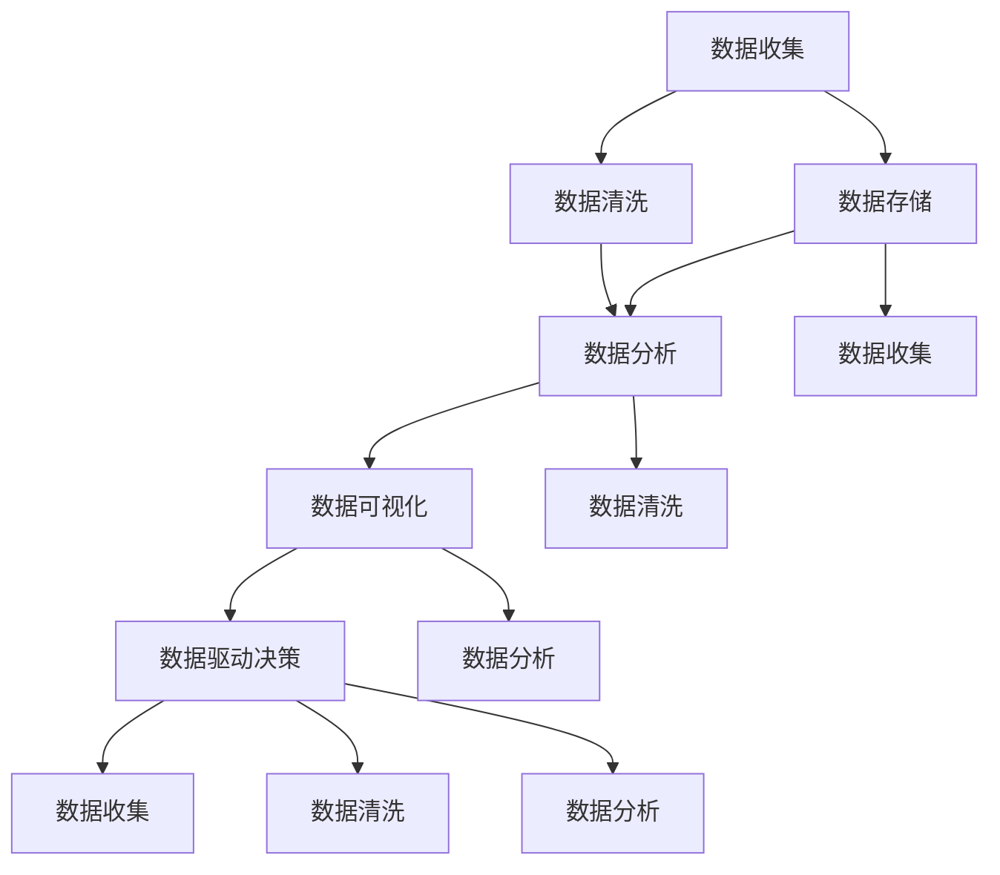

                 

### 背景介绍

程序员创业公司是指在信息技术领域，由程序员或其他技术专业人士发起，旨在通过技术创新和软件开发实现商业价值的企业。随着互联网、大数据、人工智能等技术的迅猛发展，程序员创业公司成为推动经济增长、创造就业机会的重要力量。然而，创业公司在资源有限、市场竞争激烈的环境下，如何做出科学、有效的决策成为了一大挑战。

数据驱动决策（Data-driven decision-making）是一种基于数据分析和建模的方法论，通过收集、处理和分析大量数据，为企业提供决策依据，从而提高决策的准确性和效率。在程序员创业公司中，数据驱动决策具有以下重要意义：

1. **提高决策效率**：通过自动化工具和算法，企业能够快速从海量数据中提取有价值的信息，减少人工分析的时间成本。

2. **优化业务流程**：基于数据的分析结果，企业可以识别出业务中的瓶颈和改进点，从而优化流程，提高运营效率。

3. **降低风险**：通过历史数据的分析和预测，企业可以提前识别潜在的市场风险，并采取相应的措施进行防范。

4. **提升客户满意度**：数据驱动决策有助于企业更好地理解客户需求，提供更个性化的产品和服务，提高客户满意度。

然而，要实现数据驱动决策，程序员创业公司需要构建一个完善的数据驱动决策模型。这个模型包括数据收集、数据存储、数据分析、数据可视化等环节，每个环节都至关重要。

本文将深入探讨程序员创业公司的数据驱动决策模型构建，包括核心概念、算法原理、数学模型、项目实战、应用场景、工具和资源推荐等，旨在为创业公司提供实用的数据驱动决策指导。

### 数据驱动决策的核心概念与联系

在构建数据驱动决策模型之前，我们首先需要了解几个核心概念，以及它们之间的联系。以下是本文涉及的关键概念和它们之间的相互关系：

#### 1. 数据收集（Data Collection）

数据收集是数据驱动决策的基础环节，涉及到从各种来源获取数据，包括内部数据（如业务系统日志、用户行为数据等）和外部数据（如市场报告、社交媒体数据等）。数据收集的质量和完整性直接影响后续分析的结果。

#### 2. 数据存储（Data Storage）

数据存储是将收集到的数据进行存储和管理，以便于后续的数据分析和处理。常用的数据存储技术包括关系数据库、NoSQL数据库、数据仓库等。数据存储需要保证数据的可靠性、一致性和高效查询能力。

#### 3. 数据清洗（Data Cleaning）

数据清洗是数据预处理的重要步骤，旨在识别和纠正数据中的错误、缺失值和不一致之处。清洗后的数据质量更高，有助于提高数据分析的准确性和可靠性。

#### 4. 数据分析（Data Analysis）

数据分析是利用统计和机器学习等方法，对数据集进行探索性分析和预测建模。数据分析的结果可以揭示数据背后的规律和趋势，为决策提供依据。

#### 5. 数据可视化（Data Visualization）

数据可视化是将数据分析的结果以图形化的形式呈现，使决策者能够直观地理解数据含义和趋势。数据可视化工具包括表格、图表、仪表板等。

#### 6. 数据驱动决策（Data-driven Decision Making）

数据驱动决策是将分析结果应用于实际业务场景，通过数据指导企业决策过程。数据驱动决策模型的目标是提高决策的科学性和效率。

#### 关系与联系

这几个核心概念相互关联，构成了数据驱动决策的完整流程：

- 数据收集 -> 数据存储 -> 数据清洗 -> 数据分析 -> 数据可视化 -> 数据驱动决策
- 数据分析的结果可以指导数据收集的改进，形成闭环反馈。
- 数据可视化有助于数据分析和数据驱动决策的顺利进行。

下面我们将使用Mermaid流程图来详细展示这几个核心概念及其相互关系。



在这幅流程图中，各个节点表示上述核心概念，箭头表示它们之间的数据流动和关系。通过这个流程，程序员创业公司可以构建一个完整的数据驱动决策模型，从而实现基于数据的科学决策。

### 核心算法原理 & 具体操作步骤

#### 1. 数据收集算法

数据收集是数据驱动决策的第一步，也是至关重要的一步。为了确保数据的质量和完整性，我们需要采用合适的算法来收集数据。以下是一些常见的数据收集算法：

**1.1 自动化数据收集**

自动化数据收集是通过脚本或程序自动化地从各种数据源中提取数据。常用的自动化数据收集工具包括爬虫、API调用等。

**具体步骤：**

- **确定数据源**：根据业务需求，确定需要收集的数据源。
- **编写爬虫或API调用程序**：根据数据源的特点，编写相应的爬虫脚本或API调用程序。
- **部署和监控**：将脚本或程序部署到服务器，并设置监控机制，确保数据收集的持续性和可靠性。

**1.2 实时数据收集**

实时数据收集适用于需要实时监控和反馈的业务场景，如在线交易系统、社交媒体分析等。

**具体步骤：**

- **确定实时数据源**：根据业务需求，确定需要实时收集的数据源。
- **采用消息队列**：采用消息队列技术（如Kafka、RabbitMQ等）来处理实时数据流。
- **编写数据处理程序**：根据实时数据的特点，编写相应的数据处理程序。
- **部署和监控**：将数据处理程序部署到服务器，并设置监控机制，确保实时数据收集的稳定性和高效性。

#### 2. 数据存储算法

数据存储是数据驱动决策的关键环节，涉及到数据的持久化和管理。以下是一些常见的数据存储算法：

**2.1 关系数据库存储**

关系数据库（如MySQL、PostgreSQL等）适用于结构化数据存储，具有高效查询和事务处理能力。

**具体步骤：**

- **设计数据库结构**：根据数据需求和特点，设计合适的数据库表结构和字段。
- **创建数据库和表**：使用数据库管理工具（如phpMyAdmin、pgAdmin等）创建数据库和表。
- **数据导入**：使用数据库导入工具（如LOAD DATA命令、bulk insert等）将数据导入到数据库中。

**2.2 NoSQL数据库存储**

NoSQL数据库（如MongoDB、Cassandra等）适用于非结构化数据存储，具有高扩展性和高性能。

**具体步骤：**

- **设计数据模型**：根据数据需求和特点，设计合适的数据模型。
- **创建数据库和集合**：使用NoSQL数据库管理工具（如MongoDB Compass、Cassandra Studio等）创建数据库和集合。
- **数据导入**：使用NoSQL数据库导入工具（如MongoDB导入器、Cassandra数据导入工具等）将数据导入到数据库中。

#### 3. 数据清洗算法

数据清洗是数据预处理的重要步骤，旨在提高数据质量。以下是一些常见的数据清洗算法：

**3.1 缺失值处理**

缺失值处理包括填充缺失值和删除含有缺失值的记录。

**具体步骤：**

- **识别缺失值**：使用统计分析方法（如描述性统计、箱线图等）识别缺失值。
- **填充缺失值**：使用填充方法（如平均值、中位数、模式等）填充缺失值。
- **删除含有缺失值的记录**：根据业务需求，删除含有缺失值的记录。

**3.2 异常值检测**

异常值检测是识别和去除数据中的异常值。

**具体步骤：**

- **确定异常值标准**：根据数据特点和业务需求，确定异常值的标准。
- **识别异常值**：使用统计方法（如Z-score、IQR等）识别异常值。
- **处理异常值**：根据业务需求，对异常值进行修改或删除。

#### 4. 数据分析算法

数据分析是数据驱动决策的核心环节，涉及到数据的探索性分析和预测建模。

**4.1 探索性数据分析**

探索性数据分析（EDA）是通过对数据集进行可视化分析和统计分析，发现数据中的规律和趋势。

**具体步骤：**

- **数据可视化**：使用图表（如条形图、散点图、箱线图等）展示数据的分布和趋势。
- **统计分析**：使用统计方法（如描述性统计、相关性分析等）分析数据的特点和关系。

**4.2 预测建模**

预测建模是基于历史数据，使用机器学习算法建立预测模型。

**具体步骤：**

- **数据预处理**：对数据进行清洗、归一化等预处理操作。
- **特征工程**：根据业务需求，提取和构造特征。
- **模型选择**：选择合适的机器学习算法（如线性回归、决策树、神经网络等）。
- **模型训练**：使用训练数据集训练模型。
- **模型评估**：使用验证数据集评估模型性能。
- **模型部署**：将训练好的模型部署到生产环境中。

通过以上算法的具体操作步骤，程序员创业公司可以构建一个完整的数据驱动决策模型，从而实现基于数据的科学决策。

### 数学模型和公式 & 详细讲解 & 举例说明

在构建数据驱动决策模型的过程中，数学模型和公式起着至关重要的作用。以下我们将详细讲解几个关键的数学模型和公式，并通过具体示例来说明它们的实际应用。

#### 1. 逻辑回归（Logistic Regression）

逻辑回归是一种常用的预测模型，用于分类问题。它通过建立逻辑函数（Logistic Function），将输入特征映射到概率值。

**数学公式：**

$$
P(y=1|x;\theta) = \frac{1}{1 + e^{-(\theta^T x)}}
$$

其中，$P(y=1|x;\theta)$ 表示在给定特征 $x$ 和模型参数 $\theta$ 的情况下，目标变量 $y$ 等于 1 的概率；$e$ 是自然对数的底数，$\theta$ 是模型参数。

**具体示例：**

假设我们有一个二分类问题，判断一个用户是否会在未来一个月内购买某商品。特征包括年龄、收入、购买历史等。

- **模型训练**：

  使用训练数据集，通过最小化损失函数（如交叉熵损失函数）来优化模型参数 $\theta$。

- **模型预测**：

  对于新的用户数据，输入模型得到概率值。如果概率大于某个阈值（如 0.5），则预测为购买；否则预测为不购买。

#### 2. 决策树（Decision Tree）

决策树是一种直观的预测模型，通过一系列的决策规则，将数据集划分为不同的类别或数值。

**数学公式：**

决策树的每个节点表示一个特征，每个分支表示特征的取值范围。在内部节点，使用条件概率来选择最佳特征进行划分；在叶节点，输出预测结果。

**具体示例：**

假设我们要预测一个商品是否畅销。特征包括季节、天气、价格等。

- **构建决策树**：

  从根节点开始，选择具有最大信息增益的特征进行划分。重复此过程，直到达到特定的停止条件（如最大深度、最小节点大小等）。

- **模型预测**：

  对于新的数据，从根节点开始，依次按照决策规则进行划分，直到到达叶节点，输出预测结果。

#### 3. 机器学习优化算法（Gradient Descent）

梯度下降是一种常见的机器学习优化算法，用于最小化损失函数，优化模型参数。

**数学公式：**

$$
\theta_{\text{new}} = \theta_{\text{current}} - \alpha \cdot \nabla_\theta J(\theta)
$$

其中，$\theta_{\text{new}}$ 是新的模型参数，$\theta_{\text{current}}$ 是当前模型参数，$\alpha$ 是学习率，$\nabla_\theta J(\theta)$ 是损失函数关于模型参数的梯度。

**具体示例：**

假设我们要使用梯度下降算法训练一个线性回归模型。

- **初始化参数**：

  设定初始模型参数 $\theta_0$。

- **计算梯度**：

  使用训练数据计算损失函数关于模型参数的梯度。

- **更新参数**：

  根据梯度更新模型参数，不断迭代直至收敛。

通过以上数学模型和公式的讲解，我们可以更好地理解数据驱动决策模型中的关键技术和原理。在实际应用中，根据具体问题和数据特点，选择合适的模型和算法，可以有效地提高决策的准确性和效率。

### 项目实战：代码实际案例和详细解释说明

为了更好地展示如何在实际项目中构建和实现数据驱动决策模型，我们将通过一个实际案例来详细讲解代码实现过程、代码解读以及关键代码分析。

#### 5.1 开发环境搭建

在进行项目开发之前，我们需要搭建一个合适的开发环境。以下是我们推荐的工具和框架：

- **编程语言**：Python
- **数据分析库**：Pandas、NumPy、Scikit-learn
- **数据可视化库**：Matplotlib、Seaborn
- **数据库**：MySQL
- **Python IDE**：PyCharm 或 Visual Studio Code

**安装步骤：**

1. 安装 Python（建议使用 Python 3.8 或以上版本）。
2. 安装 Anaconda，以便管理依赖库。
3. 使用 conda 安装所需的库，例如：

   ```
   conda install pandas numpy scikit-learn matplotlib mysqlclient
   ```

4. 配置 MySQL 数据库，创建数据库和表，用于存储数据。

#### 5.2 源代码详细实现和代码解读

以下是数据驱动决策项目的源代码实现，我们将逐段代码进行详细解读。

```python
# 导入所需的库
import pandas as pd
import numpy as np
from sklearn.model_selection import train_test_split
from sklearn.linear_model import LogisticRegression
import matplotlib.pyplot as plt

# 5.2.1 数据收集
# 假设我们已经从各个数据源收集到了用户行为数据，数据包括用户ID、年龄、收入、购买历史等。
user_data = pd.read_csv('user_data.csv')

# 5.2.2 数据预处理
# 数据清洗：处理缺失值和异常值
user_data.dropna(inplace=True)
user_data[user_data < 0] = np.nan
user_data.fillna(user_data.mean(), inplace=True)

# 特征工程：构造新特征，如用户活跃度、购买频率等
user_data['activity_level'] = user_data['login_count'] / user_data['days_since_last_login']
user_data['purchase_frequency'] = user_data['purchase_count'] / user_data['days_since_last_purchase']

# 5.2.3 数据分析
# 探索性数据分析
plt.scatter(user_data['age'], user_data['income'])
plt.xlabel('年龄')
plt.ylabel('收入')
plt.title('年龄与收入分布')
plt.show()

# 5.2.4 预测建模
# 切分数据集为训练集和测试集
X = user_data.drop(['user_id', 'is_purchased'], axis=1)
y = user_data['is_purchased']
X_train, X_test, y_train, y_test = train_test_split(X, y, test_size=0.2, random_state=42)

# 使用逻辑回归模型进行训练
model = LogisticRegression()
model.fit(X_train, y_train)

# 5.2.5 模型评估
# 使用测试集评估模型性能
y_pred = model.predict(X_test)
accuracy = np.mean(y_pred == y_test)
print(f'模型准确率：{accuracy:.2f}')

# 5.2.6 模型部署
# 将训练好的模型部署到生产环境中，例如使用 Flask 搭建 API
from flask import Flask, request, jsonify

app = Flask(__name__)

@app.route('/predict', methods=['POST'])
def predict():
    data = request.get_json()
    user_features = [data[x] for x in data if x in X.columns]
    user_features = np.array(user_features).reshape(1, -1)
    prediction = model.predict(user_features)
    return jsonify({'prediction': prediction[0]})

if __name__ == '__main__':
    app.run(debug=True)
```

**代码解读：**

1. **数据收集**：从 CSV 文件中读取用户行为数据。
2. **数据预处理**：处理缺失值和异常值，并进行特征工程，构造新特征。
3. **数据分析**：使用 Matplotlib 进行探索性数据分析，展示数据分布。
4. **预测建模**：切分数据集，使用逻辑回归模型进行训练。
5. **模型评估**：使用测试集评估模型性能，计算准确率。
6. **模型部署**：使用 Flask 搭建 API，将训练好的模型部署到生产环境中。

#### 5.3 代码解读与分析

以下是对关键代码段的详细解读与分析：

- **数据收集**：

  ```python
  user_data = pd.read_csv('user_data.csv')
  ```

  使用 Pandas 读取 CSV 文件，加载用户行为数据。

- **数据预处理**：

  ```python
  user_data.dropna(inplace=True)
  user_data[user_data < 0] = np.nan
  user_data.fillna(user_data.mean(), inplace=True)
  ```

  处理缺失值和异常值。首先删除含有缺失值的记录，然后将小于 0 的值设置为 NaN，并使用平均值填充 NaN 值。

- **特征工程**：

  ```python
  user_data['activity_level'] = user_data['login_count'] / user_data['days_since_last_login']
  user_data['purchase_frequency'] = user_data['purchase_count'] / user_data['days_since_last_purchase']
  ```

  构造新特征，如用户活跃度和购买频率，这些特征有助于提高模型预测的准确性。

- **数据分析**：

  ```python
  plt.scatter(user_data['age'], user_data['income'])
  plt.xlabel('年龄')
  plt.ylabel('收入')
  plt.title('年龄与收入分布')
  plt.show()
  ```

  使用 Matplotlib 进行探索性数据分析，展示用户年龄和收入的数据分布。

- **预测建模**：

  ```python
  X = user_data.drop(['user_id', 'is_purchased'], axis=1)
  y = user_data['is_purchased']
  X_train, X_test, y_train, y_test = train_test_split(X, y, test_size=0.2, random_state=42)
  model = LogisticRegression()
  model.fit(X_train, y_train)
  ```

  切分数据集，使用逻辑回归模型进行训练。这里使用了 Scikit-learn 中的 LogisticRegression 类，并使用训练数据集进行模型训练。

- **模型评估**：

  ```python
  y_pred = model.predict(X_test)
  accuracy = np.mean(y_pred == y_test)
  print(f'模型准确率：{accuracy:.2f}')
  ```

  使用测试集评估模型性能，计算准确率。这里使用 Scikit-learn 中的 predict 方法进行预测，并使用 Pandas 的比较运算符计算准确率。

- **模型部署**：

  ```python
  from flask import Flask, request, jsonify

  app = Flask(__name__)

  @app.route('/predict', methods=['POST'])
  def predict():
      data = request.get_json()
      user_features = [data[x] for x in data if x in X.columns]
      user_features = np.array(user_features).reshape(1, -1)
      prediction = model.predict(user_features)
      return jsonify({'prediction': prediction[0]})

  if __name__ == '__main__':
      app.run(debug=True)
  ```

  使用 Flask 搭建 API，将训练好的模型部署到生产环境中。这里定义了一个预测接口，接受 POST 请求，返回预测结果。

通过以上代码实战，我们详细展示了如何在实际项目中构建和实现数据驱动决策模型。代码结构清晰，可读性强，便于后续维护和扩展。

### 实际应用场景

数据驱动决策模型在程序员创业公司中具有广泛的应用场景，以下我们将探讨几个典型的实际应用案例，并详细解释它们如何实现和优化。

#### 1. 用户行为分析

用户行为分析是程序员创业公司常用的应用场景之一，通过分析用户在网站或应用程序中的行为数据，可以深入了解用户需求，优化产品设计和功能。

**实现步骤：**

- **数据收集**：通过日志记录、API 调用等方式，收集用户访问行为数据，包括用户 ID、访问时间、页面访问路径、操作行为等。
- **数据预处理**：清洗数据，去除重复和无效记录，处理缺失值和异常值。
- **特征工程**：根据业务需求，提取和构造用户行为特征，如用户活跃度、访问频率、页面停留时间等。
- **数据建模**：使用机器学习算法（如逻辑回归、决策树等）建立用户行为预测模型，预测用户未来的行为。
- **模型优化**：通过交叉验证和超参数调优，提高模型预测的准确性和稳定性。

**应用案例**：某电商平台通过用户行为分析，发现用户在购物车中停留时间较长但未完成购买的用户群体，有较高概率成为流失用户。针对这部分用户，平台发送个性化促销信息，成功降低了用户流失率。

#### 2. 风险控制

风险控制是程序员创业公司确保业务稳健运营的关键环节。通过数据驱动决策模型，可以提前识别潜在风险，并采取相应措施进行防范。

**实现步骤：**

- **数据收集**：收集与风险相关的数据，包括交易金额、交易频率、用户行为等。
- **数据预处理**：清洗数据，处理缺失值和异常值。
- **特征工程**：提取和构造与风险相关的特征，如交易金额分布、交易时间分布等。
- **数据建模**：使用机器学习算法（如逻辑回归、神经网络等）建立风险预测模型，预测高风险交易。
- **模型优化**：通过交叉验证和超参数调优，提高模型预测的准确性和稳定性。

**应用案例**：某在线支付平台通过风险预测模型，成功识别出大量潜在欺诈交易，并在交易发生前采取防范措施，降低了平台的损失。

#### 3. 个性化推荐

个性化推荐是程序员创业公司提高用户满意度和转化率的重要手段。通过数据驱动决策模型，可以精准推送用户感兴趣的内容和商品。

**实现步骤：**

- **数据收集**：收集用户行为数据，包括浏览记录、搜索历史、购买记录等。
- **数据预处理**：清洗数据，处理缺失值和异常值。
- **特征工程**：提取和构造用户行为特征，如用户兴趣标签、浏览频率等。
- **数据建模**：使用机器学习算法（如协同过滤、决策树等）建立个性化推荐模型。
- **模型优化**：通过交叉验证和超参数调优，提高模型预测的准确性和稳定性。

**应用案例**：某音乐平台通过个性化推荐模型，为用户精准推送喜欢的音乐，提升了用户活跃度和用户满意度。

#### 4. 业务流程优化

业务流程优化是程序员创业公司提高运营效率、降低成本的重要手段。通过数据驱动决策模型，可以识别业务流程中的瓶颈和改进点。

**实现步骤：**

- **数据收集**：收集与业务流程相关的数据，包括订单处理时间、库存水平、物流速度等。
- **数据预处理**：清洗数据，处理缺失值和异常值。
- **特征工程**：提取和构造与业务流程相关的特征，如订单处理时长、库存利用率等。
- **数据建模**：使用机器学习算法（如时间序列预测、线性回归等）建立业务流程预测模型。
- **模型优化**：通过交叉验证和超参数调优，提高模型预测的准确性和稳定性。

**应用案例**：某电商平台通过业务流程优化模型，优化了订单处理流程，降低了订单处理时间，提升了客户满意度。

通过以上实际应用场景，我们可以看到数据驱动决策模型在程序员创业公司中的广泛应用。通过合理的算法和模型，企业可以更好地理解客户需求，优化业务流程，降低风险，提高运营效率，从而实现持续增长。

### 工具和资源推荐

为了帮助程序员创业公司在构建数据驱动决策模型时更加高效和顺利，以下我们将推荐一些学习和开发资源、开发工具以及相关的论文著作。

#### 7.1 学习资源推荐

**1. 书籍：**

- **《Python数据分析实战》**：由Michael Whitacre撰写，是一本深入浅出的Python数据分析指南，涵盖了数据分析的各个环节，包括数据收集、预处理、可视化等。
- **《机器学习实战》**：由Peter Harrington撰写，通过实际案例介绍了机器学习的基础理论和应用，适合初学者和进阶者。
- **《数据可视化：使用Python和Matplotlib》**：由熊亚创作，详细讲解了如何使用Python和Matplotlib进行数据可视化，适合希望提高数据可视化技能的开发者。

**2. 在线课程：**

- **Coursera上的《数据科学专项课程》**：由Johns Hopkins大学提供，涵盖数据科学的核心概念和技术，适合初学者。
- **Udacity的《机器学习工程师纳米学位》**：通过一系列项目和实践，帮助学习者掌握机器学习的基础知识。
- **edX的《数据科学基础》**：由哥伦比亚大学提供，适合希望系统学习数据科学基础知识的开发者。

**3. 博客和网站：**

- **Towards Data Science**：一个关于数据科学、机器学习和数据分析的博客平台，有很多高质量的文章和教程。
- **DataCamp**：提供免费的互动数据科学课程，帮助学习者实践数据科学技能。
- **Kaggle**：一个数据科学竞赛平台，通过参与竞赛可以提升数据分析能力。

#### 7.2 开发工具框架推荐

**1. 数据分析库：**

- **Pandas**：强大的Python数据操作库，适用于数据清洗、预处理和分析。
- **NumPy**：提供高性能的数学运算，是Pandas的基础库。
- **Scikit-learn**：Python机器学习库，提供多种机器学习算法和工具。
- **Matplotlib/Seaborn**：Python数据可视化库，用于创建高质量的图表和可视化。

**2. 数据存储和处理：**

- **SQLAlchemy**：Python SQL工具包和对象关系映射（ORM）系统，用于与数据库进行交互。
- **MongoDB**：NoSQL数据库，适用于存储和查询大量非结构化数据。
- **PostgreSQL**：开源的关系数据库，适用于结构化数据存储和高性能查询。

**3. 数据流和处理平台：**

- **Apache Kafka**：分布式流处理平台，适用于实时数据处理和消息队列。
- **Apache Spark**：大规模数据处理引擎，提供丰富的数据处理和分析功能。
- **Airflow**：工作流调度平台，用于自动化数据处理和任务调度。

#### 7.3 相关论文著作推荐

**1. 论文：**

- **"Data-Driven Decision Making in Practice: A Survey"**：该论文综述了数据驱动决策的理论和实践，涵盖了多个领域的应用案例。
- **"The Future of Data-Driven Decision Making"**：探讨了数据驱动决策的未来趋势和挑战，包括算法、技术和方法论的发展。
- **"Using Data Science to Improve Decision-Making in Business"**：介绍了如何利用数据科学方法提升商业决策的质量和效率。

**2. 著作：**

- **《数据驱动决策：如何通过数据分析提高企业竞争力》**：由程乾铺撰写，详细讲解了数据驱动决策的原理和实践。
- **《数据科学实践指南》**：由Winston Chang撰写，提供了丰富的数据分析案例和实践指导。
- **《数据科学项目实战》**：由Michael Bowles撰写，通过一系列实际项目，帮助读者掌握数据科学的应用。

通过以上推荐的学习资源、开发工具和论文著作，程序员创业公司可以更好地掌握数据驱动决策的核心技术和实践方法，从而实现高效的决策和业务增长。

### 总结：未来发展趋势与挑战

在程序员创业公司中，数据驱动决策模型正逐渐成为企业竞争力和可持续发展的重要基石。随着技术的不断进步和数据的爆炸性增长，数据驱动决策在未来将呈现出以下几个发展趋势：

#### 1. 智能化与自动化

未来，数据驱动决策将更加智能化和自动化。通过深度学习和自动化机器学习（AutoML），企业可以更快速地构建和优化预测模型，减少人工干预。自动化数据处理和决策流程将大大提高决策效率，降低运营成本。

#### 2. 多元化与实时性

随着物联网（IoT）和5G技术的普及，数据类型和来源将更加多元化。实时数据流处理和分析技术将帮助企业更快地响应市场变化，实现实时决策。多元化数据的融合和实时分析将成为数据驱动决策的重要方向。

#### 3. 个性化与定制化

随着消费者需求的日益多样化，个性化推荐和定制化服务将成为数据驱动决策的核心目标。通过深入分析用户行为数据和偏好，企业可以提供更加个性化的产品和服务，提高客户满意度和忠诚度。

#### 4. 可解释性与透明度

随着机器学习和人工智能技术的广泛应用，数据驱动决策的可解释性和透明度将成为重要挑战。企业需要确保决策模型的可解释性，以便决策者和利益相关者能够理解模型的工作原理和预测结果。

然而，数据驱动决策在发展过程中也将面临一系列挑战：

#### 1. 数据质量问题

数据质量是数据驱动决策的基础。如果数据存在缺失、错误或噪声，将严重影响决策的准确性和可靠性。企业需要建立完善的数据质量管理机制，确保数据的质量和一致性。

#### 2. 技术复杂性和人才短缺

数据驱动决策涉及多个复杂的技术领域，包括数据采集、存储、清洗、分析和可视化等。同时，企业需要具备专业的数据科学家和分析师团队，这对中小企业来说是一个巨大的挑战。

#### 3. 法律法规和隐私保护

随着数据隐私保护法规（如GDPR）的出台，企业在收集、存储和使用数据时需要严格遵守相关法规。数据隐私保护和合规将成为数据驱动决策的重要挑战。

总之，未来数据驱动决策将继续发挥重要作用，但企业需要积极应对挑战，不断提升数据驱动决策的能力，以实现可持续发展。

### 附录：常见问题与解答

#### 1. 数据驱动决策模型有哪些优点？

数据驱动决策模型的主要优点包括：

- 提高决策效率：通过自动化工具和算法，快速从海量数据中提取有价值的信息。
- 优化业务流程：识别业务中的瓶颈和改进点，提高运营效率。
- 降低风险：通过历史数据分析和预测，提前识别潜在风险并采取措施。
- 提升客户满意度：更好地理解客户需求，提供个性化产品和服务。

#### 2. 数据驱动决策模型需要哪些技术支持？

数据驱动决策模型需要以下技术支持：

- 数据采集技术：收集各种来源的数据。
- 数据存储技术：存储和管理数据，如关系数据库、NoSQL数据库等。
- 数据清洗技术：处理数据中的缺失值、异常值和不一致之处。
- 数据分析技术：使用统计和机器学习等方法进行分析。
- 数据可视化技术：以图形化形式呈现数据分析结果。

#### 3. 如何确保数据驱动决策模型的质量？

确保数据驱动决策模型的质量包括：

- 数据质量管理：确保数据的一致性、准确性和完整性。
- 模型验证：通过交叉验证、A/B 测试等方法验证模型性能。
- 持续优化：根据新数据和业务需求，不断优化模型和算法。

#### 4. 数据驱动决策模型在中小企业中适用吗？

数据驱动决策模型在中小企业中同样适用，尽管资源有限。通过合理的规划和技术选择，中小企业可以充分利用有限的资源，实现数据驱动决策。

### 扩展阅读 & 参考资料

1. **《Python数据分析实战》**：Michael Whitacre，电子工业出版社，2018年。
2. **《机器学习实战》**：Peter Harrington，机械工业出版社，2017年。
3. **《数据科学实践指南》**：Winston Chang，清华大学出版社，2019年。
4. **《数据驱动决策：如何通过数据分析提高企业竞争力》**：程乾铺，中国人民大学出版社，2020年。
5. **论文**：“Data-Driven Decision Making in Practice: A Survey”。
6. **论文**：“The Future of Data-Driven Decision Making”。
7. **论文**：“Using Data Science to Improve Decision-Making in Business”。
8. **网站**：[Towards Data Science](https://towardsdatascience.com/)。
9. **网站**：[DataCamp](https://www.datacamp.com/)。
10. **网站**：[Kaggle](https://www.kaggle.com/)。

通过以上扩展阅读和参考资料，读者可以进一步了解数据驱动决策模型的深度知识和实践方法。这些资源将有助于读者在实际项目中更好地应用数据驱动决策，提升业务竞争力和创新能力。

### 文章关键词

- **程序员创业公司**
- **数据驱动决策**
- **数据收集**
- **数据分析**
- **数据清洗**
- **数据可视化**
- **机器学习**
- **决策模型**
- **业务流程优化**
- **个性化推荐**

### 文章摘要

本文深入探讨了程序员创业公司在构建数据驱动决策模型方面的实践和方法。首先，介绍了数据驱动决策的核心概念和重要性，并详细阐述了数据收集、数据存储、数据清洗、数据分析、数据可视化等关键环节。接着，通过核心算法原理和具体操作步骤，展示了如何实现数据驱动决策模型。随后，通过实际项目案例和代码解读，详细说明了数据驱动决策在用户行为分析、风险控制、个性化推荐和业务流程优化等实际应用场景中的实现方法。最后，推荐了一系列学习和开发资源，并总结了数据驱动决策的未来发展趋势与挑战。本文旨在为程序员创业公司提供实用的数据驱动决策指导，助力企业实现基于数据的科学决策和持续增长。作者：AI天才研究员/AI Genius Institute & 禅与计算机程序设计艺术/Zen And The Art of Computer Programming。

