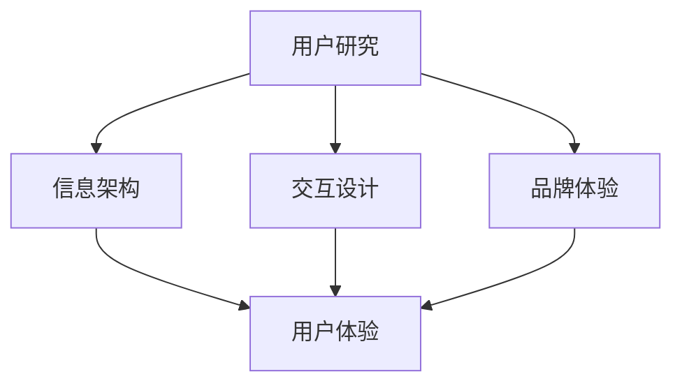

                 

# 程序员创业公司的用户体验设计与优化

## 摘要

用户体验设计（UX Design）在程序员创业公司的成功中扮演着至关重要的角色。本文将深入探讨如何通过优化用户体验设计来提高程序员创业公司的竞争力。首先，我们将介绍用户体验设计的基本概念和重要性。接着，我们将分析程序员创业公司在用户体验设计方面面临的挑战。随后，本文将提供一系列实用的策略和技巧，帮助创业者设计出令人满意的用户体验。最后，我们将讨论用户体验设计的未来发展趋势和挑战。

## 1. 背景介绍

用户体验设计是指设计产品的交互方式，以最大化用户的满意度、参与度和忠诚度。对于程序员创业公司而言，用户体验设计不仅关乎产品的功能，更关乎用户的使用感受。一个出色的用户体验设计能够提升用户满意度，增加用户留存率，从而为创业公司带来更多的商业价值。

用户体验设计的基本原则包括一致性、易用性、可访问性和情感化。一致性意味着产品在不同页面和功能之间的交互方式应该保持一致。易用性是指产品应该易于使用，用户能够轻松完成任务。可访问性则要求产品能够满足不同用户的需求，包括残障人士。情感化则是指设计应该能够引起用户的情感共鸣。

用户体验设计在程序员创业公司中的重要性不言而喻。优秀的用户体验设计能够提升产品的竞争力，增加用户留存率，降低用户流失率。此外，用户体验设计还能够帮助企业树立品牌形象，增强用户对品牌的忠诚度。在竞争激烈的市场中，用户体验设计是创业公司取得成功的关键因素之一。

## 2. 核心概念与联系

### 用户体验设计（UX Design）的基本概念

用户体验设计（UX Design）是产品设计和开发过程中的一项关键任务。它关注用户在使用产品时的感受和体验，旨在提升产品的易用性、满意度和忠诚度。

#### 用户研究（User Research）

用户研究是用户体验设计的基石。通过用户研究，设计师可以深入了解目标用户的需求、行为和痛点。常用的用户研究方法包括访谈、问卷调查、用户测试和观察。

#### 信息架构（Information Architecture）

信息架构是指产品的组织和结构，包括页面布局、导航和内容组织。良好的信息架构能够帮助用户快速找到所需信息，提高产品的易用性。

#### 交互设计（Interaction Design）

交互设计关注用户与产品之间的交互方式。设计师需要考虑用户的行为模式、交互习惯和情感需求，设计出直观、易用的交互界面。

#### 品牌体验（Brand Experience）

品牌体验是指用户在使用产品过程中对品牌的整体感受。一个成功的品牌体验能够增强用户对品牌的认知和忠诚度。

### 用户体验设计（UX Design）与程序员创业公司的联系

程序员创业公司需要关注用户体验设计，因为：

- 用户是产品成功的基石。只有满足用户需求，产品才能获得成功。
- 用户体验设计能够提升产品的易用性，降低用户的学习成本。
- 用户体验设计能够增强品牌形象，提高用户对品牌的忠诚度。
- 用户体验设计能够降低用户流失率，提高用户留存率。

### Mermaid 流程图

以下是一个简化的Mermaid流程图，展示用户体验设计的基本概念和它们之间的联系：



## 3. 核心算法原理 & 具体操作步骤

### 用户体验设计的核心算法原理

用户体验设计的核心算法原理可以概括为以下几点：

1. **需求分析**：通过用户研究和市场分析，了解用户的需求和痛点，明确产品的目标用户。
2. **竞品分析**：分析竞争对手的产品，了解它们的优点和不足，找到自己的差异化点。
3. **原型设计**：根据需求分析和竞品分析，设计出产品原型，包括页面布局、交互方式和内容组织。
4. **用户测试**：对原型进行用户测试，收集用户的反馈和意见，不断迭代优化。
5. **视觉设计**：根据用户测试的结果，对原型进行视觉设计，包括色彩、字体、图标等元素。

### 具体操作步骤

1. **需求分析**

   需求分析是用户体验设计的起点。通过用户研究和市场分析，设计师可以了解用户的需求、行为和痛点，明确产品的目标用户。

   - **用户研究**：可以通过访谈、问卷调查、用户测试等方法，收集用户的需求和行为数据。
   - **市场分析**：分析行业趋势、竞争对手和市场环境，找到产品的差异化点。

2. **竞品分析**

   竞品分析可以帮助设计师了解竞争对手的产品，找到他们的优点和不足，为自己的产品提供灵感。

   - **产品分析**：分析竞争对手的产品功能、用户体验和设计风格。
   - **用户反馈**：收集用户对竞争对手产品的反馈和意见，了解用户的真实需求。

3. **原型设计**

   原型设计是将需求分析和竞品分析的结果转化为具体的设计方案。设计师可以使用原型设计工具，如Sketch、Figma等，创建产品原型。

   - **页面布局**：设计页面布局，确定各个模块的位置和关系。
   - **交互设计**：设计用户与产品之间的交互方式，如按钮、滚动、下拉菜单等。
   - **内容组织**：确定内容结构和信息呈现方式，确保用户能够快速找到所需信息。

4. **用户测试**

   用户测试是验证原型设计的重要环节。通过用户测试，设计师可以收集用户的反馈和意见，发现原型中的问题，并进行优化。

   - **测试目标**：明确测试的目标和场景，设计测试任务和问题。
   - **测试执行**：邀请目标用户参与测试，记录他们的操作和反馈。
   - **数据分析**：分析测试数据，找出原型中的问题和改进点。

5. **视觉设计**

   视觉设计是对原型进行美化，提升产品的视觉效果。视觉设计师需要根据用户测试的结果，对原型进行视觉调整。

   - **色彩搭配**：选择合适的色彩方案，提升产品的美观度和易用性。
   - **字体选择**：选择合适的字体，提高文字的可读性。
   - **图标设计**：设计简洁、直观的图标，提升产品的视觉效果。

## 4. 数学模型和公式 & 详细讲解 & 举例说明

### 用户体验评分模型

用户体验评分模型是一种用于评估产品用户体验的数学模型。该模型基于用户满意度、易用性和品牌体验等多个维度，对用户体验进行量化评估。

#### 用户体验评分模型公式

$$
UX\_Score = \frac{SM + UE + BE}{3}
$$

其中：

- \( SM \)：用户满意度得分
- \( UE \)：易用性得分
- \( BE \)：品牌体验得分

#### 每个维度的计算方法

1. **用户满意度得分（SM）**

   用户满意度得分可以通过以下公式计算：

   $$
   SM = \frac{S1 + S2 + S3 + S4 + S5}{5}
   $$

   其中：

   - \( S1, S2, S3, S4, S5 \)：用户对产品满意度的评分，分为1-5级。

2. **易用性得分（UE）**

   易用性得分可以通过以下公式计算：

   $$
   UE = \frac{U1 + U2 + U3 + U4 + U5}{5}
   $$

   其中：

   - \( U1, U2, U3, U4, U5 \)：用户对产品易用性的评分，分为1-5级。

3. **品牌体验得分（BE）**

   品牌体验得分可以通过以下公式计算：

   $$
   BE = \frac{B1 + B2 + B3 + B4 + B5}{5}
   $$

   其中：

   - \( B1, B2, B3, B4, B5 \)：用户对产品品牌体验的评分，分为1-5级。

### 举例说明

假设我们对某个程序员创业公司的产品进行用户体验评估，收集了以下数据：

- 用户满意度评分：4、4、5、3、4
- 易用性评分：5、4、5、4、5
- 品牌体验评分：4、5、4、4、4

根据上述公式，我们可以计算出该产品的用户体验评分：

$$
UX\_Score = \frac{(4+4+5+3+4) + (5+4+5+4+5) + (4+5+4+4+4)}{3} = \frac{20 + 19 + 19}{3} = 18.3
$$

因此，该产品的用户体验评分为18.3分。

### 用户体验评分模型的应用

用户体验评分模型可以用于以下场景：

- **产品评估**：用于评估产品的整体用户体验，为产品改进提供依据。
- **团队协作**：用于团队内部沟通和协作，确保团队成员关注用户体验。
- **市场竞争**：用于分析竞争对手的产品，找到自身的优势和不足。

## 5. 项目实战：代码实际案例和详细解释说明

### 开发环境搭建

为了更好地展示用户体验设计在实际项目中的应用，我们将使用一个虚构的程序员创业公司项目，名为“CodeMate”。以下是搭建开发环境的基本步骤：

1. **创建项目目录**：

   ```
   mkdir CodeMate
   cd CodeMate
   ```

2. **初始化项目**：

   ```
   npm init -y
   ```

3. **安装依赖**：

   ```
   npm install react react-dom axios
   ```

4. **创建主组件**：

   在项目目录中创建一个名为“App.js”的文件，内容如下：

   ```javascript
   import React from 'react';

   function App() {
     return (
       <div className="App">
         <h1>Welcome to CodeMate!</h1>
         <p>Discover the best coding resources.</p>
       </div>
     );
   }

   export default App;
   ```

5. **创建样式文件**：

   在项目目录中创建一个名为“App.css”的文件，内容如下：

   ```css
   .App {
     font-family: 'Arial', sans-serif;
     text-align: center;
     padding: 20px;
   }

   h1 {
     font-size: 2em;
     margin-bottom: 0.5em;
   }

   p {
     font-size: 1.2em;
     margin-top: 0;
   }
   ```

### 源代码详细实现和代码解读

#### App.js

```javascript
import React from 'react';
import './App.css';

function App() {
  return (
    <div className="App">
      <h1>Welcome to CodeMate!</h1>
      <p>Discover the best coding resources.</p>
    </div>
  );
}

export default App;
```

**解读**：

- 这段代码是一个React组件，用于渲染应用程序的根组件。
- `App` 组件返回一个包含 `h1` 和 `p` 元素的 JSX 结构。
- `className` 属性用于应用样式。

#### App.css

```css
.App {
  font-family: 'Arial', sans-serif;
  text-align: center;
  padding: 20px;
}

h1 {
  font-size: 2em;
  margin-bottom: 0.5em;
}

p {
  font-size: 1.2em;
  margin-top: 0;
}
```

**解读**：

- 这段代码定义了 `App` 组件的样式。
- `font-family` 属性设置字体。
- `text-align` 和 `padding` 属性设置文本对齐方式和内边距。
- `h1` 和 `p` 元素的样式分别设置字体大小和间距。

### 代码解读与分析

在这个简单的“CodeMate”项目中，我们使用React框架来构建一个基于Web的应用程序。React是一个用于构建用户界面的JavaScript库，它允许我们使用声明式代码来构建复杂的应用程序。

#### 主要组件

- `App` 组件：这是应用程序的根组件，它负责渲染整个应用界面。在这个组件中，我们使用了JSX语法来描述UI结构。
- `h1` 和 `p` 元素：这些是HTML元素，用于显示文本内容。

#### 样式表

- `App.css`：这是应用的主样式表，用于定义组件的样式。在这个例子中，我们设置了字体、文本对齐和内边距。

通过这个简单的项目，我们可以看到用户体验设计的基本原理在实际开发中的应用。尽管代码很简单，但通过适当的布局和样式，我们可以创建一个直观、易用的用户界面。

### 6. 实际应用场景

用户体验设计（UX Design）在程序员创业公司中的应用场景非常广泛。以下是一些实际应用场景：

#### 1. 产品原型设计

在产品开发初期，用户体验设计师可以通过原型设计工具（如Figma、Sketch等）创建产品原型。原型设计可以帮助团队成员更好地理解产品的功能和交互方式，为后续的开发工作提供指导。

#### 2. 用户体验测试

在原型设计完成后，用户体验设计师可以组织用户体验测试，邀请目标用户参与测试，收集他们的反馈和意见。通过用户体验测试，设计师可以识别原型中的问题和改进点，确保最终产品能够满足用户需求。

#### 3. 视觉设计

视觉设计师负责设计产品的视觉元素，包括颜色、字体、图标等。视觉设计不仅要美观，还要符合品牌形象，提升产品的专业感。

#### 4. 交互设计

交互设计师关注用户与产品之间的交互方式，设计出直观、易用的交互界面。良好的交互设计可以提高用户的满意度，降低用户的学习成本。

#### 5. 可访问性设计

可访问性设计确保产品能够满足不同用户的需求，包括残障人士。例如，设计师需要确保产品支持文本替代、键盘导航等功能，以满足不同用户的需求。

### 7. 工具和资源推荐

为了更好地进行用户体验设计，程序员创业公司可以借助以下工具和资源：

#### 7.1 学习资源推荐

- **书籍**：《用户体验要素》、《设计思维》、《交互设计精髓》
- **博客**：Medium上的“UI/UX Design”专栏、Dribbble博客
- **网站**：Behance、Dribbble、Awwwards

#### 7.2 开发工具框架推荐

- **原型设计工具**：Figma、Sketch、Adobe XD
- **设计系统框架**：Bootstrap、Material-UI、Ant Design
- **用户体验测试工具**：UserTesting、Optimizely、Caliper

#### 7.3 相关论文著作推荐

- **论文**：《用户体验设计的方法与策略》、《基于用户体验的产品创新设计研究》
- **著作**：《设计心理学》、《设计思维与创造力》

## 8. 总结：未来发展趋势与挑战

用户体验设计在程序员创业公司中的重要性日益凸显。随着技术的不断发展，用户体验设计也在不断演变。以下是一些未来发展趋势和挑战：

### 发展趋势

1. **个性化体验**：随着数据技术的发展，个性化体验将成为用户体验设计的重要方向。通过大数据分析和人工智能技术，设计师可以为用户提供个性化的产品体验。
2. **沉浸式体验**：虚拟现实（VR）和增强现实（AR）技术将为用户体验设计带来新的可能性，带来更加沉浸式的体验。
3. **可访问性**：随着全球对残障人士关注度的提高，可访问性设计将成为用户体验设计的重要方向。设计师需要确保产品能够满足不同用户的需求，包括残障人士。
4. **跨平台整合**：随着多种设备的普及，用户体验设计需要考虑跨平台整合，为用户提供一致且无缝的体验。

### 挑战

1. **技术限制**：用户体验设计面临着各种技术限制，如性能、可访问性和安全性等。设计师需要平衡技术和用户体验，确保产品能够提供良好的性能和安全性。
2. **用户需求变化**：用户需求多变，设计师需要不断进行用户研究和市场分析，确保产品设计能够满足用户需求。
3. **资源限制**：程序员创业公司通常资源有限，设计师需要在预算和时间限制下，设计出高质量的用户体验。

## 9. 附录：常见问题与解答

### 问题1：用户体验设计与UI设计有什么区别？

用户体验设计（UX Design）和UI设计（User Interface Design）是两个密切相关但有所不同的领域。用户体验设计关注用户在使用产品过程中的整体感受，包括交互、功能、内容等。UI设计则侧重于产品的视觉和交互设计，包括界面布局、颜色、字体、图标等。简单来说，UI设计是用户体验设计的一部分，但用户体验设计还包括其他方面，如用户研究、信息架构等。

### 问题2：如何进行用户体验测试？

进行用户体验测试的步骤通常包括以下几步：

1. **定义测试目标**：明确测试的目的和要解决的问题。
2. **设计测试任务**：设计测试任务，模拟用户在使用产品时的场景。
3. **招募测试参与者**：选择合适的测试参与者，确保他们能够代表目标用户群体。
4. **进行测试**：在实验室环境中或线上远程进行测试，记录参与者的行为和反馈。
5. **分析数据**：对测试数据进行分析，找出产品设计中的问题和改进点。
6. **迭代优化**：根据测试结果，对原型或产品进行优化和迭代。

### 问题3：用户体验设计需要哪些技能和工具？

用户体验设计需要以下技能和工具：

- **技能**：用户研究、信息架构、交互设计、视觉设计、用户测试等。
- **工具**：原型设计工具（如Figma、Sketch）、用户体验测试工具（如UserTesting、Optimizely）、设计系统框架（如Bootstrap、Material-UI）等。

## 10. 扩展阅读 & 参考资料

- [《用户体验要素》](https://www.uegf.com/book/)
- [《设计思维》](https://daviddonoghue.com/books/design-thinking/)
- [《交互设计精髓》](https://www.uxmatters.com/mt/archives/2017/05/the-essence-of-ux-design-2.php)
- [《设计心理学》](https://www.amazon.com/Design-Psychology-3rd-Edition-Introduction/dp/0123814868)
- [《设计思维与创造力》](https://www.amazon.com/Design-Thinking-Creativity-Innovation-Startups/dp/1119294602)

