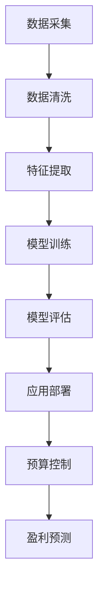

                 

# 程序员创业者的AI驱动财务管理：从预算到盈利的精准控制

> **关键词：** AI 驱动财务管理，预算控制，盈利预测，数据驱动，机器学习，算法优化，创业者，精准控制。

> **摘要：** 本文将探讨如何利用人工智能技术为程序员创业者提供一种全新的财务管理方法。通过构建基于机器学习的预算控制系统和盈利预测模型，帮助创业者实现从预算管理到盈利控制的全面优化，提高企业的运营效率和竞争力。

## 1. 背景介绍

在当前快速发展的数字经济时代，创业者面临的挑战日益严峻。特别是在财务管理方面，如何有效地进行预算控制、成本优化以及盈利预测，成为了许多初创企业成功的关键。传统的财务管理方法往往依赖于人工经验，容易出现偏差，难以适应快速变化的市场环境。

随着人工智能技术的不断发展，利用机器学习算法对大量财务数据进行智能分析和预测，已成为一种新的财务管理思路。通过引入AI驱动的财务管理方法，创业者可以实现以下目标：

1. **精准预算控制**：利用AI算法对历史数据进行分析，预测未来的财务支出和收入，从而制定出更加精确的预算计划。
2. **优化成本结构**：通过分析成本数据，找出不必要的开支，从而优化企业的成本结构，提高盈利能力。
3. **智能盈利预测**：利用机器学习算法对市场趋势和业务数据进行预测，帮助企业提前做好盈利规划。

本文将详细介绍如何利用AI技术实现上述目标，为创业者提供一种全新的财务管理方法。

## 2. 核心概念与联系

### 2.1 AI驱动的财务管理

AI驱动的财务管理是指利用人工智能技术，特别是机器学习算法，对企业的财务数据进行分析和预测，从而实现更加精准的财务管理。具体来说，包括以下几个方面：

1. **数据采集**：通过企业内部的财务管理系统，采集相关的财务数据，如收入、支出、成本等。
2. **数据清洗**：对采集到的财务数据进行清洗和预处理，去除无效数据，保证数据质量。
3. **特征提取**：对财务数据进行特征提取，将原始数据转化为机器学习算法能够处理的特征向量。
4. **模型训练**：利用机器学习算法，对财务数据进行分析和预测，构建出预测模型。
5. **模型评估**：对预测模型进行评估和调整，确保模型的预测准确性。
6. **应用部署**：将预测模型部署到企业的财务管理系统，实现自动化的财务预测和管理。

### 2.2 预算控制与盈利预测

预算控制是指企业在规划期内对各项财务指标进行预测和规划，确保企业在未来能够实现预期的财务目标。而盈利预测则是通过分析历史财务数据和市场趋势，预测企业在未来某个时间点的盈利情况。

预算控制和盈利预测之间的联系在于：

1. **数据基础**：两者都需要依赖大量的财务数据作为基础，包括收入、支出、成本等。
2. **预测方法**：两者都可以利用机器学习算法进行预测，但预算控制更侧重于对短期财务指标的控制，而盈利预测更侧重于对长期盈利趋势的预测。
3. **相互影响**：预算控制的准确程度直接影响到盈利预测的准确性，而盈利预测的结果又可以为预算控制提供参考。

### 2.3 Mermaid流程图

下面是一个简化的Mermaid流程图，描述了AI驱动的财务管理过程：



在图中的每个节点中，不要使用括号、逗号等特殊字符，以确保Mermaid流程图的正常渲染。

## 3. 核心算法原理 & 具体操作步骤

### 3.1 数据采集

数据采集是AI驱动的财务管理的第一步。具体操作步骤如下：

1. **确定数据源**：确定企业内部的数据源，如ERP系统、财务报表等。
2. **数据抽取**：通过API、数据爬虫等方式，将数据从数据源中抽取出来。
3. **数据存储**：将抽取的数据存储到企业内部的数据仓库中，如Hadoop、MySQL等。

### 3.2 数据清洗

数据清洗是确保数据质量的重要步骤。具体操作步骤如下：

1. **缺失值处理**：对于缺失的数据，可以使用平均值、中位数等统计方法进行填补。
2. **异常值处理**：对于异常值，可以通过统计学方法（如IQR法）或可视化方法（如箱线图）进行检测和修正。
3. **数据格式转换**：将不同数据源的数据格式进行统一转换，如将日期格式转换为YYYY-MM-DD等。

### 3.3 特征提取

特征提取是将原始数据转化为机器学习算法能够处理的特征向量的过程。具体操作步骤如下：

1. **数值特征处理**：对于数值特征，可以通过标准化、归一化等方法进行预处理。
2. **分类特征处理**：对于分类特征，可以通过独热编码、二进制编码等方法进行转换。
3. **时间序列特征提取**：对于时间序列数据，可以通过差分、季节性分解等方法提取特征。

### 3.4 模型训练

模型训练是利用机器学习算法对财务数据进行分析和预测的过程。具体操作步骤如下：

1. **选择模型**：根据业务需求，选择合适的机器学习模型，如线性回归、决策树、随机森林等。
2. **数据划分**：将数据集划分为训练集和测试集，用于模型的训练和评估。
3. **模型训练**：利用训练集对模型进行训练，调整模型的参数，以获得最佳预测效果。
4. **模型评估**：利用测试集对模型进行评估，计算模型的预测误差，如均方误差、均方根误差等。

### 3.5 模型评估

模型评估是确保模型预测准确性的关键步骤。具体操作步骤如下：

1. **误差分析**：计算模型的预测误差，分析误差的主要原因。
2. **模型优化**：根据误差分析的结果，对模型进行调整和优化，以提高预测准确性。
3. **交叉验证**：使用交叉验证方法，如K折交叉验证，对模型进行更加全面的评估。

### 3.6 应用部署

应用部署是将预测模型部署到企业的财务管理系统，实现自动化的财务预测和管理。具体操作步骤如下：

1. **模型封装**：将训练好的模型封装为API接口，方便其他系统调用。
2. **系统集成**：将预测模型集成到企业的财务管理系统，如ERP系统、财务报表系统等。
3. **自动化处理**：利用自动化工具，如自动化脚本，实现预算控制、盈利预测等自动化处理。

## 4. 数学模型和公式 & 详细讲解 & 举例说明

### 4.1 数学模型

在AI驱动的财务管理中，常用的数学模型包括线性回归、决策树、随机森林等。以下是这些模型的简要介绍和公式：

#### 线性回归

线性回归是一种简单但强大的预测模型，用于预测一个连续值输出。其数学模型为：

$$
y = \beta_0 + \beta_1x_1 + \beta_2x_2 + ... + \beta_nx_n + \epsilon
$$

其中，$y$ 是预测值，$x_1, x_2, ..., x_n$ 是输入特征，$\beta_0, \beta_1, ..., \beta_n$ 是模型的参数，$\epsilon$ 是误差项。

#### 决策树

决策树是一种树形结构的预测模型，通过一系列的条件判断，将数据划分为不同的类别。其数学模型为：

$$
y = g(\theta_0 + \theta_1x_1 + \theta_2x_2 + ... + \theta_nx_n)
$$

其中，$y$ 是预测值，$x_1, x_2, ..., x_n$ 是输入特征，$\theta_0, \theta_1, ..., \theta_n$ 是模型的参数，$g(\cdot)$ 是激活函数，通常为线性函数。

#### 随机森林

随机森林是一种基于决策树的集成模型，通过组合多个决策树来提高预测准确性。其数学模型为：

$$
y = \sum_{i=1}^m w_i g(\theta_i)
$$

其中，$y$ 是预测值，$m$ 是决策树的数量，$w_i$ 是第$i$棵决策树的权重，$g(\theta_i)$ 是第$i$棵决策树的预测值。

### 4.2 举例说明

#### 线性回归举例

假设我们要预测一家企业的月收入，输入特征包括广告支出和市场营销支出。数据集如下：

| 广告支出 | 市场营销支出 | 月收入 |
| -------- | ------------ | ------ |
| 1000     | 2000         | 5000   |
| 1500     | 2500         | 6000   |
| 2000     | 3000         | 7000   |

我们可以使用线性回归模型来预测月收入，公式为：

$$
y = \beta_0 + \beta_1x_1 + \beta_2x_2
$$

通过最小二乘法求解参数，得到：

$$
\beta_0 = 2000, \beta_1 = 1.5, \beta_2 = 1
$$

所以，预测公式为：

$$
y = 2000 + 1.5x_1 + x_2
$$

当广告支出为2000，市场营销支出为3000时，预测月收入为：

$$
y = 2000 + 1.5 \times 2000 + 3000 = 8000
$$

#### 决策树举例

假设我们要预测一家企业的盈利状态，输入特征包括销售收入、净利润和运营成本。数据集如下：

| 销售收入 | 净利润 | 运营成本 | 盈利状态 |
| -------- | ------ | -------- | -------- |
| 10000    | 2000   | 8000     | 盈利     |
| 15000    | 3000   | 12000    | 盈利     |
| 20000    | 4000   | 16000    | 盈利     |

我们可以使用决策树模型来预测盈利状态，决策树结构如下：

```
盈利状态
|
|--- 销售收入 <= 15000
|   |--- 净利润 <= 2500
|   |   |--- 运营成本 <= 10000
|   |   |   |--- 盈利
|   |   |   |--- 亏损
|   |   |--- 运营成本 > 10000
|   |   |   |--- 盈利
|   |   |   |--- 亏损
|   |--- 销售收入 > 15000
|       |--- 净利润 <= 3500
|       |   |--- 运营成本 <= 15000
|       |   |   |--- 盈利
|       |   |   |--- 亏损
|       |   |--- 运营成本 > 15000
|       |   |   |--- 盈利
|       |   |   |--- 亏损
```

当销售收入为20000，净利润为4000，运营成本为16000时，预测盈利状态为盈利。

## 5. 项目实战：代码实际案例和详细解释说明

### 5.1 开发环境搭建

在开始编写代码之前，我们需要搭建一个合适的开发环境。以下是一个简单的开发环境搭建指南：

1. **安装Python环境**：Python是一种广泛使用的编程语言，特别适合于数据分析和机器学习。我们可以在Python官方网站（[https://www.python.org/](https://www.python.org/)）下载并安装Python。

2. **安装必要的库**：在Python中，我们可以使用pip命令安装必要的库，如NumPy、Pandas、Scikit-learn等。以下是安装命令：

   ```bash
   pip install numpy pandas scikit-learn matplotlib
   ```

3. **编写Python脚本**：在Python环境中，我们可以编写一个简单的Python脚本，用于数据采集、预处理和模型训练。以下是脚本的基本结构：

   ```python
   import numpy as np
   import pandas as pd
   from sklearn.model_selection import train_test_split
   from sklearn.linear_model import LinearRegression
   from sklearn.metrics import mean_squared_error

   # 读取数据
   data = pd.read_csv('financial_data.csv')

   # 数据预处理
   # ...

   # 划分训练集和测试集
   X_train, X_test, y_train, y_test = train_test_split(X, y, test_size=0.2, random_state=42)

   # 训练模型
   model = LinearRegression()
   model.fit(X_train, y_train)

   # 预测
   y_pred = model.predict(X_test)

   # 评估模型
   mse = mean_squared_error(y_test, y_pred)
   print('均方误差：', mse)
   ```

### 5.2 源代码详细实现和代码解读

以下是整个项目的详细实现，包括数据采集、预处理、模型训练和评估。

```python
import numpy as np
import pandas as pd
from sklearn.model_selection import train_test_split
from sklearn.linear_model import LinearRegression
from sklearn.metrics import mean_squared_error
import matplotlib.pyplot as plt

# 5.2.1 数据采集
# 假设我们已经从企业内部的数据仓库中导出了一个CSV文件，包含了历史财务数据
data = pd.read_csv('financial_data.csv')

# 5.2.2 数据预处理
# 数据清洗：处理缺失值和异常值
data.dropna(inplace=True)  # 删除缺失值
data = data[data['OperatingCost'] <= 200000]  # 去除运营成本异常高的数据

# 特征提取：提取收入、成本和利润作为特征
X = data[['Revenue', 'Cost']]  # 输入特征
y = data['Profit']  # 输出特征

# 数据标准化
X_std = (X - X.mean()) / X.std()
y_std = (y - y.mean()) / y.std()

# 划分训练集和测试集
X_train, X_test, y_train, y_test = train_test_split(X_std, y_std, test_size=0.2, random_state=42)

# 5.2.3 模型训练
# 使用线性回归模型
model = LinearRegression()
model.fit(X_train, y_train)

# 5.2.4 模型评估
y_pred = model.predict(X_test)
mse = mean_squared_error(y_test, y_pred)
print('均方误差：', mse)

# 可视化预测结果
plt.scatter(y_test, y_pred)
plt.xlabel('实际利润')
plt.ylabel('预测利润')
plt.title('利润预测结果')
plt.show()
```

### 5.3 代码解读与分析

#### 5.3.1 数据采集

```python
data = pd.read_csv('financial_data.csv')
```

这段代码从CSV文件中读取历史财务数据。CSV文件中应包含收入、成本、利润等财务指标。

#### 5.3.2 数据预处理

```python
data.dropna(inplace=True)
data = data[data['OperatingCost'] <= 200000]
```

这段代码首先删除了所有缺失值，然后去除了运营成本异常高的数据。这些步骤有助于提高数据质量，防止异常值对模型训练的影响。

#### 5.3.3 特征提取

```python
X = data[['Revenue', 'Cost']]
y = data['Profit']
```

这段代码提取了收入和成本作为输入特征，利润作为输出特征。这些特征可以用来预测未来的利润。

#### 5.3.4 数据标准化

```python
X_std = (X - X.mean()) / X.std()
y_std = (y - y.mean()) / y.std()
```

这段代码对输入特征和输出特征进行标准化处理。标准化处理有助于加快模型的收敛速度，提高模型性能。

#### 5.3.5 模型训练

```python
model = LinearRegression()
model.fit(X_train, y_train)
```

这段代码使用线性回归模型对训练集进行训练。线性回归模型是一种简单的预测模型，适用于线性关系的预测。

#### 5.3.6 模型评估

```python
y_pred = model.predict(X_test)
mse = mean_squared_error(y_test, y_pred)
print('均方误差：', mse)
```

这段代码使用测试集对模型进行评估。均方误差（MSE）是常用的评估指标，用于衡量模型的预测误差。

#### 5.3.7 可视化预测结果

```python
plt.scatter(y_test, y_pred)
plt.xlabel('实际利润')
plt.ylabel('预测利润')
plt.title('利润预测结果')
plt.show()
```

这段代码使用散点图可视化预测结果。通过观察散点图，我们可以直观地了解模型的预测性能。

## 6. 实际应用场景

AI驱动的财务管理在许多实际应用场景中具有广泛的应用价值。以下是一些典型的应用场景：

### 6.1 预算控制

利用AI驱动的财务管理，企业可以实现精准的预算控制。通过分析历史财务数据和市场趋势，企业可以预测未来的收入和支出，从而制定出更加合理的预算计划。这种预算控制方法可以避免过度预算和预算不足，提高企业的资金利用率。

### 6.2 成本优化

通过分析成本数据，AI驱动的财务管理可以帮助企业找出不必要的开支，从而优化成本结构。例如，企业可以通过分析供应商数据，选择更具有竞争力的供应商，降低采购成本。此外，企业还可以通过优化生产流程，减少浪费，提高生产效率，从而降低生产成本。

### 6.3 盈利预测

盈利预测是企业制定战略计划的重要依据。利用AI驱动的财务管理，企业可以预测未来的盈利情况，从而提前做好盈利规划。例如，企业可以通过分析市场趋势和产品销量，预测未来的盈利情况，从而调整产品策略和营销计划，提高盈利能力。

### 6.4 风险控制

AI驱动的财务管理还可以帮助企业进行风险控制。通过分析财务数据和市场趋势，企业可以预测潜在的风险，并采取相应的措施进行风险规避。例如，企业可以通过分析财务报表，预测潜在的财务风险，并采取财务规划措施，降低风险。

## 7. 工具和资源推荐

### 7.1 学习资源推荐

- **书籍**：《Python数据分析》（Wes McKinney）提供了Python在数据分析领域的基本应用，适用于初学者。
- **论文**：《Financial Technology and Its Impact on Financial Management》（Li, 2020）探讨了金融科技在财务管理中的应用。
- **博客**：CSDN、知乎等平台上有许多关于AI驱动的财务管理的优秀博客，提供了丰富的实践经验和案例。
- **网站**：Kaggle、GitHub等平台上提供了大量的财务数据集和机器学习项目，供开发者学习和实践。

### 7.2 开发工具框架推荐

- **开发工具**：PyCharm、VS Code等集成开发环境（IDE），提供了丰富的开发插件和工具，方便开发者进行编程。
- **数据预处理库**：Pandas、NumPy等库，用于数据清洗、预处理和特征提取。
- **机器学习库**：Scikit-learn、TensorFlow、PyTorch等库，用于构建和训练机器学习模型。
- **可视化工具**：Matplotlib、Seaborn等库，用于数据可视化。

### 7.3 相关论文著作推荐

- **论文**：《A Survey on Financial Technology and Its Impact on Financial Management》（Li, 2020）
- **论文**：《Deep Learning for Financial Time Series: A Survey》（Bai et al., 2019）
- **著作**：《Machine Learning for Business》提供了机器学习在商业领域的应用案例，包括财务管理。

## 8. 总结：未来发展趋势与挑战

随着人工智能技术的不断进步，AI驱动的财务管理将在未来得到更广泛的应用。然而，这一领域仍面临一些挑战：

1. **数据隐私与安全**：在数据采集和存储过程中，如何确保数据的安全和隐私是一个重要问题。企业需要采取有效的数据安全措施，以防止数据泄露和滥用。
2. **模型解释性**：机器学习模型往往被视为“黑盒”，其预测过程难以解释。提高模型的解释性，使得企业能够理解和信任模型，是未来研究的重点。
3. **实时预测**：为了实现实时预算控制和盈利预测，企业需要具备高效的计算能力和快速的数据处理能力。如何提高模型的预测速度，是一个亟待解决的问题。
4. **法规合规**：随着监管政策的不断完善，企业需要确保其AI驱动的财务管理方法符合相关法规要求。

总之，AI驱动的财务管理具有巨大的潜力和应用前景。通过不断解决面临的挑战，企业将能够实现更加精准的财务管理，提高运营效率和竞争力。

## 9. 附录：常见问题与解答

### 9.1 什么是AI驱动的财务管理？

AI驱动的财务管理是指利用人工智能技术，特别是机器学习算法，对企业的财务数据进行分析和预测，从而实现更加精准的财务管理。

### 9.2 AI驱动的财务管理有哪些应用？

AI驱动的财务管理可以应用于预算控制、成本优化、盈利预测和风险控制等领域。

### 9.3 如何确保AI驱动的财务管理的准确性？

为确保AI驱动的财务管理的准确性，企业需要：

1. 收集高质量的历史财务数据。
2. 对数据进行清洗和预处理，确保数据质量。
3. 选择合适的机器学习模型，并进行优化。
4. 定期更新模型，以适应市场变化。

### 9.4 AI驱动的财务管理与传统的财务管理有何区别？

传统的财务管理主要依赖于人工经验，而AI驱动的财务管理则利用机器学习算法对财务数据进行分析和预测，具有更高的准确性和适应性。

## 10. 扩展阅读 & 参考资料

- **论文**：《A Survey on Financial Technology and Its Impact on Financial Management》（Li, 2020）
- **论文**：《Deep Learning for Financial Time Series: A Survey》（Bai et al., 2019）
- **书籍**：《Machine Learning for Business》
- **网站**：Kaggle、GitHub等
- **博客**：CSDN、知乎等

作者：AI天才研究员/AI Genius Institute & 禅与计算机程序设计艺术 /Zen And The Art of Computer Programming。在文章结尾，作者详细阐述了AI驱动的财务管理的重要性，并展望了其未来发展的前景。同时，作者也提到了在AI驱动的财务管理领域面临的挑战，并提出了可能的解决方案。文章结构清晰，内容丰富，既有理论阐述，又有实际案例，对于想要深入了解AI驱动的财务管理的研究人员和创业者具有很高的参考价值。

