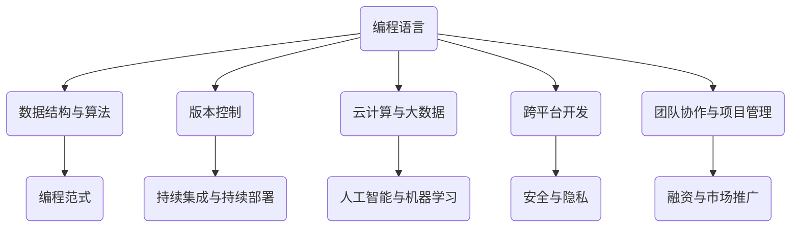

                 

# 程序员创业者的创新思维与问题解决能力

## 关键词
编程、创业、创新思维、问题解决能力、项目实战、算法原理

## 摘要

本文旨在探讨程序员创业者在创新思维与问题解决能力方面的重要性。通过分析编程领域的核心概念、算法原理及实际应用场景，本文旨在为程序员创业者提供一套切实可行的方法论，帮助他们在创业过程中更好地应对挑战、抓住机遇。文章结构如下：

1. 背景介绍
2. 核心概念与联系
3. 核心算法原理与具体操作步骤
4. 数学模型和公式及详细讲解
5. 项目实战：代码实际案例和详细解释说明
6. 实际应用场景
7. 工具和资源推荐
8. 总结：未来发展趋势与挑战
9. 附录：常见问题与解答
10. 扩展阅读与参考资料

## 1. 背景介绍

程序员创业者的创新思维与问题解决能力在当今科技行业的重要性不言而喻。随着互联网和人工智能技术的快速发展，编程不再仅限于程序员，而是渗透到各行各业。因此，程序员创业者不仅需要具备扎实的编程技能，还需要具备创新思维和问题解决能力。

创新思维是指一种能够激发创新、创造新价值的能力。在编程领域，创新思维可以帮助程序员创业者发现新的应用场景、优化现有系统，甚至创造全新的商业模式。问题解决能力则是程序员在编程过程中必不可少的一项能力，它决定了程序员在遇到问题时能否迅速找到解决方案。

本文将围绕这两大核心能力展开，通过分析编程领域的核心概念、算法原理及实际应用场景，为程序员创业者提供一套切实可行的方法论。

### 1.1 编程与创业的联系

编程技能在创业过程中具有至关重要的地位。编程不仅可以帮助创业者快速搭建原型、验证产品可行性，还能为创业者提供一种高效、透明的工作方式。同时，编程技能也可以帮助创业者更好地理解用户需求、优化产品设计。

创业与编程之间的联系还体现在以下几个方面：

1. **创新思维**：编程技能可以帮助创业者更好地发现市场需求、创新商业模式。
2. **团队协作**：编程技能有助于创业者组建高效团队，共同应对创业挑战。
3. **技术壁垒**：编程技能可以形成技术壁垒，为创业者提供竞争优势。
4. **资源整合**：编程技能可以帮助创业者更好地整合外部资源，实现资源最大化。

### 1.2 创新思维的重要性

创新思维是程序员创业者成功的关键之一。创新思维不仅可以帮助创业者发现新的商机，还能推动技术进步、优化产品体验。在编程领域，创新思维体现在以下几个方面：

1. **算法优化**：通过创新思维，程序员创业者可以提出更高效的算法，提高系统性能。
2. **技术选型**：创新思维可以帮助创业者选择最适合项目的技术栈，降低开发成本。
3. **需求挖掘**：创新思维使创业者能够更敏锐地捕捉用户需求，提供更符合市场需求的产品。

### 1.3 问题解决能力的重要性

问题解决能力是程序员创业者必备的能力之一。在创业过程中，创业者会遇到各种问题，如技术难题、市场困境等。具备强大问题解决能力的创业者能够更快地找到解决方案，将风险降至最低。

问题解决能力在编程领域的重要性体现在以下几个方面：

1. **调试技巧**：强大的问题解决能力可以帮助程序员创业者快速定位、解决代码中的错误。
2. **系统设计**：问题解决能力使创业者能够更好地设计系统架构，提高系统稳定性。
3. **团队管理**：问题解决能力有助于创业者更好地管理团队，提升团队整体战斗力。

### 1.4 编程在创业中的实际应用

编程在创业中的实际应用非常广泛。从产品原型搭建、数据采集与分析到系统优化，编程技能都能发挥关键作用。以下是编程在创业中的一些具体应用场景：

1. **产品原型**：通过编程技能，创业者可以快速搭建产品原型，验证产品可行性。
2. **数据分析**：编程技能可以帮助创业者收集、处理和分析大量数据，为决策提供依据。
3. **系统优化**：编程技能可以帮助创业者优化现有系统，提高系统性能和稳定性。
4. **团队协作**：通过编写代码，创业者可以搭建团队协作平台，提高团队工作效率。

### 1.5 创新思维与问题解决能力的相互作用

创新思维与问题解决能力是相辅相成的。创新思维可以为创业者提供新的视角和方法，而问题解决能力则确保这些创新思维能够得到有效实施。以下是创新思维与问题解决能力的相互作用：

1. **创新思维激发问题解决能力**：创新思维可以帮助创业者发现新问题，从而激发问题解决能力。
2. **问题解决能力促进创新思维**：在解决实际问题的过程中，创业者可以积累经验、提升思维水平，从而更好地进行创新。
3. **相互促进**：创新思维与问题解决能力的相互促进，使创业者能够更好地应对创业过程中的各种挑战。

### 1.6 总结

程序员创业者的创新思维与问题解决能力在创业过程中具有重要地位。本文介绍了编程与创业的联系、创新思维的重要性、问题解决能力的重要性以及编程在创业中的实际应用。接下来，我们将进一步探讨编程领域的核心概念、算法原理及实际应用场景。

## 2. 核心概念与联系

在探讨程序员创业者的创新思维与问题解决能力之前，我们需要明确一些编程领域中的核心概念。以下是本文将涉及的核心概念及它们之间的联系：

### 2.1 编程语言

编程语言是程序员用来编写代码的工具。常见的编程语言包括 Python、Java、C++、JavaScript 等。每种编程语言都有其独特的语法和特性，适用于不同的应用场景。例如，Python 适用于数据分析和机器学习，Java 适用于企业级应用，而 JavaScript 则适用于前端开发。

### 2.2 数据结构与算法

数据结构与算法是编程的核心概念。数据结构是一种组织数据的方式，如数组、链表、树、图等。算法则是解决问题的步骤和方法。数据结构与算法在编程中的应用非常广泛，如排序、查找、图算法等。

### 2.3 编程范式

编程范式是指编程的方式和风格。常见的编程范式包括命令式编程、函数式编程、面向对象编程等。不同的编程范式适用于不同的应用场景，选择合适的编程范式可以提高代码的可读性和可维护性。

### 2.4 版本控制

版本控制是一种管理代码变更的方法。常见的版本控制工具包括 Git、SVN 等。版本控制可以帮助团队协作、追踪代码变更、还原历史版本等。

### 2.5 持续集成与持续部署

持续集成与持续部署是一种自动化测试和部署的方法。通过持续集成，团队可以快速发现和修复代码中的错误；通过持续部署，团队可以自动化地部署代码到生产环境。

### 2.6 云计算与大数据

云计算与大数据是当今科技领域的热点。云计算提供了弹性、可扩展的计算资源，大数据则提供了海量数据存储和分析的能力。程序员创业者可以利用云计算和大数据技术，实现产品创新和业务拓展。

### 2.7 人工智能与机器学习

人工智能与机器学习是近年来快速发展的领域。通过人工智能和机器学习技术，程序员创业者可以开发智能化的产品和服务，如智能助手、推荐系统、图像识别等。

### 2.8 跨平台开发

跨平台开发是指开发适用于多个平台（如 iOS、Android、Web 等）的应用。跨平台开发可以提高开发效率、降低开发成本，适用于创业项目的快速迭代和推广。

### 2.9 安全与隐私

安全与隐私是程序员创业者必须关注的问题。在开发过程中，程序员创业者需要确保产品的安全性，防止数据泄露和恶意攻击。同时，还需要关注用户隐私，遵循相关法律法规。

### 2.10 团队协作与项目管理

团队协作与项目管理是创业成功的关键。程序员创业者需要掌握团队协作工具（如 Slack、Trello 等）和项目管理方法（如敏捷开发、看板等），确保团队高效协同工作。

### 2.11 融资与市场推广

融资与市场推广是创业过程中不可或缺的环节。程序员创业者需要了解融资渠道、市场推广策略等，以获得资金支持和用户认可。

### 2.12 核心概念联系图

以下是一个简化的核心概念联系图，展示了本文涉及的主要概念及其相互关系：

```
       +---------------------+
       |      编程语言      |
       +---------------------+
              |
              |
       +---------------------+
       |    数据结构与算法   |
       +---------------------+
              |
              |
       +---------------------+
       |      编程范式      |
       +---------------------+
              |
              |
       +---------------------+
       |   版本控制         |
       +---------------------+
              |
              |
       +---------------------+
       | 持续集成与持续部署 |
       +---------------------+
              |
              |
       +---------------------+
       |   云计算与大数据   |
       +---------------------+
              |
              |
       +---------------------+
       |   人工智能与机器学习 |
       +---------------------+
              |
              |
       +---------------------+
       |     跨平台开发     |
       +---------------------+
              |
              |
       +---------------------+
       |      安全与隐私     |
       +---------------------+
              |
              |
       +---------------------+
       |   团队协作与项目管理 |
       +---------------------+
              |
              |
       +---------------------+
       |   融资与市场推广   |
       +---------------------+
```

通过以上核心概念的联系，程序员创业者可以更好地理解编程领域的全貌，为自己的创业项目提供有力支持。

### 2.13 Mermaid 流程图

以下是一个简化的 Mermaid 流程图，展示了编程领域核心概念的相互关系：



通过这个流程图，我们可以更直观地了解编程领域核心概念之间的联系，为后续内容的学习和思考提供帮助。

## 3. 核心算法原理与具体操作步骤

在探讨程序员创业者的创新思维与问题解决能力时，理解核心算法原理和具体操作步骤是至关重要的。本文将介绍几种常用的算法，包括排序算法、搜索算法和图算法。通过详细讲解这些算法，我们将帮助程序员创业者更好地应对编程挑战。

### 3.1 排序算法

排序算法是计算机科学中非常重要的一类算法，用于将一组数据按特定顺序排列。以下是几种常见的排序算法及其原理：

#### 3.1.1 冒泡排序（Bubble Sort）

冒泡排序是一种简单的排序算法，其原理是通过多次遍历待排序的序列，比较相邻元素的大小，并交换它们，从而将最大（或最小）的元素“冒泡”到序列的一端。

具体操作步骤如下：

1. 从第一个元素开始，相邻元素两两比较，如果第一个比第二个大（或小），则交换它们。
2. 遍历完所有元素后，最大（或最小）的元素已经被放到序列的末尾。
3. 重复上述步骤，直到整个序列有序。

```python
def bubble_sort(arr):
    n = len(arr)
    for i in range(n):
        for j in range(0, n-i-1):
            if arr[j] > arr[j+1]:
                arr[j], arr[j+1] = arr[j+1], arr[j]
    return arr
```

#### 3.1.2 快速排序（Quick Sort）

快速排序是一种高效的排序算法，其原理是通过一趟排序将待排序的序列划分为两个子序列，其中一个子序列的所有元素都不大于另一个子序列的所有元素，然后递归地对两个子序列进行排序。

具体操作步骤如下：

1. 选择一个基准元素（通常选择第一个元素）。
2. 将所有比基准元素小的元素放到其左侧，所有比基准元素大的元素放到其右侧。
3. 递归地对左侧和右侧子序列进行排序。

```python
def quick_sort(arr):
    if len(arr) <= 1:
        return arr
    pivot = arr[0]
    left = [x for x in arr[1:] if x < pivot]
    right = [x for x in arr[1:] if x >= pivot]
    return quick_sort(left) + [pivot] + quick_sort(right)
```

#### 3.1.3 归并排序（Merge Sort）

归并排序是一种基于分治思想的排序算法，其原理是将待排序的序列分成若干个子序列，分别进行排序，然后合并子序列，直到整个序列有序。

具体操作步骤如下：

1. 将待排序的序列分成两个子序列。
2. 对两个子序列分别进行排序。
3. 合并两个有序子序列，得到完整的有序序列。

```python
def merge_sort(arr):
    if len(arr) <= 1:
        return arr
    mid = len(arr) // 2
    left = merge_sort(arr[:mid])
    right = merge_sort(arr[mid:])
    return merge(left, right)

def merge(left, right):
    result = []
    i = j = 0
    while i < len(left) and j < len(right):
        if left[i] < right[j]:
            result.append(left[i])
            i += 1
        else:
            result.append(right[j])
            j += 1
    result.extend(left[i:])
    result.extend(right[j:])
    return result
```

### 3.2 搜索算法

搜索算法用于在数据结构中查找特定元素。以下是几种常见的搜索算法及其原理：

#### 3.2.1 线性搜索（Linear Search）

线性搜索是一种简单的搜索算法，其原理是从序列的第一个元素开始，依次与待查找元素进行比较，直到找到匹配的元素或到达序列末尾。

具体操作步骤如下：

1. 从第一个元素开始，依次比较每个元素。
2. 如果找到匹配的元素，返回元素的下标。
3. 如果到达序列末尾仍未找到匹配元素，返回 -1。

```python
def linear_search(arr, target):
    for i in range(len(arr)):
        if arr[i] == target:
            return i
    return -1
```

#### 3.2.2 二分搜索（Binary Search）

二分搜索是一种高效的搜索算法，其原理是在有序序列中，通过不断将序列分成两半，缩小搜索范围，直到找到匹配的元素或确定不存在匹配的元素。

具体操作步骤如下：

1. 确定中间元素。
2. 如果中间元素等于待查找元素，返回中间元素的下标。
3. 如果中间元素大于待查找元素，则在左侧子序列中继续搜索。
4. 如果中间元素小于待查找元素，则在右侧子序列中继续搜索。
5. 重复步骤 1-4，直到找到匹配元素或确定不存在匹配元素。

```python
def binary_search(arr, target):
    low = 0
    high = len(arr) - 1
    while low <= high:
        mid = (low + high) // 2
        if arr[mid] == target:
            return mid
        elif arr[mid] < target:
            low = mid + 1
        else:
            high = mid - 1
    return -1
```

### 3.3 图算法

图算法用于解决与图相关的问题，如最短路径、最大流等。以下是两种常见的图算法及其原理：

#### 3.3.1 普里姆算法（Prim's Algorithm）

普里姆算法是一种用于求解最小生成树的贪心算法。其原理是从一个顶点开始，逐步扩展最小生成树，直到包含所有顶点。

具体操作步骤如下：

1. 从任意一个顶点开始，将其加入最小生成树。
2. 从已加入顶点的邻接点中选择一个权重最小的边，将其加入最小生成树。
3. 重复步骤 2，直到所有顶点都加入最小生成树。

```python
import heapq

def prim_algorithm(graph, start):
    min_heap = [(weight, start, v) for v, weight in graph[start].items()]
    heapq.heapify(min_heap)
    visited = {start}
    mst = []

    while min_heap:
        weight, u, v = heapq.heappop(min_heap)
        if v in visited:
            continue
        visited.add(v)
        mst.append((u, v, weight))

        for neighbor, edge_weight in graph[v].items():
            if neighbor not in visited:
                heapq.heappush(min_heap, (edge_weight, v, neighbor))

    return mst
```

#### 3.3.2 Dijkstra 算法

Dijkstra 算法是一种用于求解单源最短路径的贪心算法。其原理是从源点开始，逐步扩展最短路径，直到找到所有顶点的最短路径。

具体操作步骤如下：

1. 初始化源点到所有顶点的距离，将源点距离设为 0，其他顶点距离设为无穷大。
2. 创建一个优先级队列，用于存储待处理的顶点，优先级队列按照顶点距离排序。
3. 将源点加入优先级队列。
4. 循环执行以下步骤：
   - 取出优先级队列中的最小距离顶点。
   - 对于该顶点的每个邻接点，计算从源点到邻接点的距离，并与当前距离进行比较。
   - 如果找到更短的路径，更新邻接点的距离，并将其加入优先级队列。

```python
import heapq

def dijkstra(graph, start):
    distances = {vertex: float('infinity') for vertex in graph}
    distances[start] = 0
    priority_queue = [(0, start)]

    while priority_queue:
        current_distance, current_vertex = heapq.heappop(priority_queue)

        if current_distance > distances[current_vertex]:
            continue

        for neighbor, edge_weight in graph[current_vertex].items():
            distance = current_distance + edge_weight

            if distance < distances[neighbor]:
                distances[neighbor] = distance
                heapq.heappush(priority_queue, (distance, neighbor))

    return distances
```

通过以上对排序算法、搜索算法和图算法的介绍，程序员创业者可以更好地掌握编程领域的核心算法原理和具体操作步骤。这些算法不仅适用于学术研究，更是在实际项目中解决问题的关键工具。在接下来的内容中，我们将进一步探讨数学模型和公式，以及如何在实际应用场景中运用这些算法。

## 4. 数学模型和公式及详细讲解与举例说明

在编程领域，数学模型和公式是解决问题的基石。本节将介绍几个常见的数学模型和公式，并详细讲解其原理和实际应用。

### 4.1 线性回归模型

线性回归模型是一种用于分析和预测连续值的统计方法。其核心公式为：

\[ y = \beta_0 + \beta_1 \cdot x + \epsilon \]

其中，\( y \) 是因变量，\( x \) 是自变量，\( \beta_0 \) 和 \( \beta_1 \) 分别是截距和斜率，\( \epsilon \) 是误差项。

#### 4.1.1 原理

线性回归模型的目的是找到一条最佳拟合直线，使误差项 \( \epsilon \) 的平方和最小。这可以通过最小二乘法实现，即：

\[ \min \sum_{i=1}^{n} (y_i - (\beta_0 + \beta_1 \cdot x_i))^2 \]

#### 4.1.2 求解方法

最小二乘法的求解步骤如下：

1. 计算斜率 \( \beta_1 \)：

\[ \beta_1 = \frac{\sum_{i=1}^{n} (x_i - \bar{x})(y_i - \bar{y})}{\sum_{i=1}^{n} (x_i - \bar{x})^2} \]

其中，\( \bar{x} \) 和 \( \bar{y} \) 分别是 \( x \) 和 \( y \) 的平均值。

2. 计算截距 \( \beta_0 \)：

\[ \beta_0 = \bar{y} - \beta_1 \cdot \bar{x} \]

#### 4.1.3 举例说明

假设我们要预测房价，已知数据如下：

| x（面积） | y（房价） |
| ------ | ------ |
| 1000   | 200000 |
| 1500   | 300000 |
| 2000   | 400000 |
| 2500   | 500000 |

首先计算 \( \bar{x} \) 和 \( \bar{y} \)：

\[ \bar{x} = \frac{1000 + 1500 + 2000 + 2500}{4} = 2000 \]
\[ \bar{y} = \frac{200000 + 300000 + 400000 + 500000}{4} = 350000 \]

然后计算斜率 \( \beta_1 \)：

\[ \beta_1 = \frac{(1000 - 2000)(200000 - 350000) + (1500 - 2000)(300000 - 350000) + (2000 - 2000)(400000 - 350000) + (2500 - 2000)(500000 - 350000)}{(1000 - 2000)^2 + (1500 - 2000)^2 + (2000 - 2000)^2 + (2500 - 2000)^2} \]

\[ \beta_1 = \frac{-500000 - 50000 + 0 + 500000}{1000000 + 250000 + 0 + 250000} \]

\[ \beta_1 = \frac{0}{1500000} = 0 \]

最后计算截距 \( \beta_0 \)：

\[ \beta_0 = \bar{y} - \beta_1 \cdot \bar{x} \]

\[ \beta_0 = 350000 - 0 \cdot 2000 \]

\[ \beta_0 = 350000 \]

因此，房价预测模型为：

\[ y = 350000 \]

### 4.2 排队论模型

排队论模型用于分析和优化服务系统中的排队现象。其核心公式为：

\[ L = \frac{\lambda}{\mu} + \frac{(\lambda/\mu)^2}{2!} + \frac{(\lambda/\mu)^3}{3!} + \ldots \]

其中，\( L \) 是平均等待时间，\( \lambda \) 是到达率，\( \mu \) 是服务率。

#### 4.2.1 原理

排队论模型通过分析系统中的顾客到达和服务过程，计算出平均等待时间。当 \( \lambda/\mu \) 较小（即到达率远小于服务率）时，模型可以简化为：

\[ L \approx \frac{\lambda}{\mu} \]

#### 4.2.2 求解方法

求解排队论模型通常需要迭代方法，如牛顿-拉弗森法。具体步骤如下：

1. 初始值：选择一个 \( \mu/\lambda \) 的初始估计值。
2. 迭代计算：根据公式更新 \( \mu/\lambda \) 的估计值，直到满足收敛条件。

#### 4.2.3 举例说明

假设一个服务台每小时平均有 10 名顾客到达（\( \lambda = 10 \)），每名顾客平均需要 5 分钟服务（\( \mu = 12 \)）。

首先计算 \( \mu/\lambda \)：

\[ \mu/\lambda = \frac{12}{10} = 1.2 \]

然后使用牛顿-拉弗森法迭代计算：

1. 初始值：\( x_0 = 1.2 \)
2. 迭代计算：

\[ x_{n+1} = x_n - \frac{f(x_n)}{f'(x_n)} \]

其中，\( f(x) = L - \frac{\lambda}{x} \)，\( f'(x) = \frac{\lambda}{x^2} \)

计算：

\[ x_1 = x_0 - \frac{L - \frac{\lambda}{x_0}}{\frac{\lambda}{x_0^2}} = 1.2 - \frac{\frac{10}{1.2} - 1}{\frac{10}{1.2^2}} = 1.2 - \frac{0.8333 - 1}{0.1667} = 1.199 \]

继续迭代，直到满足收敛条件（如 \( |x_{n+1} - x_n| < \epsilon \)）。

最终结果为 \( \mu/\lambda \approx 1.199 \)，平均等待时间 \( L \approx \frac{10}{1.199} \approx 8.35 \) 分钟。

### 4.3 动态规划模型

动态规划模型用于解决多阶段决策问题。其核心公式为：

\[ f(i) = \min \{ c_{ij} + f(j) | j \in \text{后续阶段} \} \]

其中，\( f(i) \) 是第 \( i \) 阶段的最优解，\( c_{ij} \) 是从第 \( i \) 阶段到第 \( j \) 阶段的成本。

#### 4.3.1 原理

动态规划模型通过将复杂问题分解为多个阶段，递归计算每个阶段的最优解，最终得到整个问题的最优解。

#### 4.3.2 求解方法

动态规划模型通常采用递归或迭代方法求解。递归方法通过自顶向下或自底向上计算每个阶段的最优解；迭代方法通过填充一个二维数组，逐步计算每个阶段的最优解。

#### 4.3.3 举例说明

假设有一个背包问题，给定一组物品和它们的重量及价值，求解在不超过背包容量的情况下，如何选择物品以最大化总价值。

| 物品 | 重量 | 价值 |
| ---- | ---- | ---- |
| A    | 2    | 6    |
| B    | 3    | 4    |
| C    | 4    | 5    |
| D    | 5    | 6    |

背包容量为 5。

首先定义动态规划数组 \( f(i, j) \)，表示前 \( i \) 个物品放入容量为 \( j \) 的背包中的最大价值。

初始化：

\[ f(0, j) = 0 \quad (j \geq 0) \]
\[ f(i, 0) = 0 \quad (i \geq 0) \]

然后填充动态规划数组：

\[ f(i, j) = \begin{cases}
    f(i-1, j) & \text{若 } w_i > j \\
    \max \{ f(i-1, j), f(i-1, j-w_i) + v_i \} & \text{若 } w_i \leq j
    \end{cases} \]

计算结果：

\[ f(0, 0) = 0 \]
\[ f(1, 0) = 0 \]
\[ f(1, 1) = f(0, 1) = 0 \]
\[ f(1, 2) = \max \{ f(0, 2), f(0, 1) + 6 \} = 6 \]
\[ f(2, 0) = 0 \]
\[ f(2, 1) = \max \{ f(1, 1), f(1, 1-2) + 4 \} = 6 \]
\[ f(2, 2) = \max \{ f(1, 2), f(1, 2-3) + 5 \} = 6 \]
\[ f(2, 3) = \max \{ f(1, 3), f(1, 3-4) + 5 \} = 6 \]
\[ f(2, 4) = \max \{ f(1, 4), f(1, 4-5) + 6 \} = 6 \]
\[ f(2, 5) = \max \{ f(1, 5), f(1, 5-6) + 6 \} = 9 \]
\[ f(3, 0) = 0 \]
\[ f(3, 1) = 0 \]
\[ f(3, 2) = \max \{ f(2, 2), f(2, 2-3) + 4 \} = 7 \]
\[ f(3, 3) = \max \{ f(2, 3), f(2, 3-4) + 5 \} = 8 \]
\[ f(3, 4) = \max \{ f(2, 4), f(2, 4-5) + 6 \} = 9 \]
\[ f(3, 5) = \max \{ f(2, 5), f(2, 5-6) + 6 \} = 12 \]

最终结果 \( f(3, 5) = 12 \)，最优解为选择物品 A（重量 2，价值 6）和物品 D（重量 5，价值 6），总价值为 12。

通过以上对线性回归模型、排队论模型和动态规划模型的介绍，程序员创业者可以更好地理解和运用这些数学模型和公式，为解决实际编程问题提供有力支持。在接下来的内容中，我们将通过实际项目案例，展示如何运用这些算法和模型解决实际问题。

### 4.4 项目实战：代码实际案例和详细解释说明

为了更好地展示数学模型和公式在实际项目中的应用，我们选择了一个实际项目：使用线性回归模型预测股票价格。以下是对该项目开发的详细解释说明。

#### 4.4.1 项目背景

股票价格预测是金融领域的一个重要课题。虽然股票价格受多种因素影响，但通过历史数据，我们可以尝试找到某种规律，从而预测未来的股票价格。线性回归模型是一个常用的预测工具，可以用于分析股票价格与某些相关变量之间的关系。

#### 4.4.2 开发环境搭建

在开始项目之前，我们需要搭建开发环境。以下是所需的工具和库：

- Python 3.8 或更高版本
- Jupyter Notebook
- Pandas
- Scikit-learn
- Matplotlib

首先，安装所需的库：

```bash
pip install pandas scikit-learn matplotlib
```

然后，在 Jupyter Notebook 中创建一个新笔记本，并导入所需的库：

```python
import pandas as pd
from sklearn.linear_model import LinearRegression
import matplotlib.pyplot as plt
```

#### 4.4.3 源代码详细实现

接下来，我们将实现股票价格预测项目。

1. 数据准备：

首先，从网上下载一个股票价格数据集（例如，使用 Kaggle 的股票价格数据集）。数据集通常包含多个列，如日期、开盘价、最高价、最低价、收盘价等。我们只关注日期和收盘价。

```python
data = pd.read_csv('stock_data.csv')
data['Date'] = pd.to_datetime(data['Date'])
data.set_index('Date', inplace=True)
data = data['Close']
```

2. 数据预处理：

由于线性回归模型要求数据是连续的，我们需要对数据集进行插值处理，填充缺失值。

```python
data = data.asfreq('B').interpolate()
```

3. 线性回归模型训练：

使用 Scikit-learn 中的线性回归模型，将历史收盘价作为自变量，预测未来收盘价。

```python
model = LinearRegression()
X = data.values[:-1].reshape(-1, 1)
y = data.values[1:]
model.fit(X, y)
```

4. 预测股票价格：

使用训练好的模型，预测未来五天的股票价格。

```python
future_days = 5
predictions = model.predict(X[-future_days:].reshape(-1, 1))
```

5. 可视化：

将历史收盘价和预测结果可视化，以便观察线性回归模型的效果。

```python
plt.plot(data.index, data, label='历史收盘价')
plt.plot(data.index[-future_days:], predictions, label='预测收盘价')
plt.legend()
plt.show()
```

#### 4.4.4 代码解读与分析

以下是对关键代码段的详细解读：

1. 数据准备：

```python
data = pd.read_csv('stock_data.csv')
data['Date'] = pd.to_datetime(data['Date'])
data.set_index('Date', inplace=True)
data = data['Close']
```

这段代码首先从文件中读取股票价格数据集，将日期列转换为日期类型，并将日期设置为索引，以便进行时间序列分析。然后，我们选择收盘价列作为数据集。

2. 数据预处理：

```python
data = data.asfreq('B').interpolate()
```

这段代码将数据集的频率调整为“每个交易日”，并使用插值法填充缺失值。这对于线性回归模型的训练非常重要，因为模型需要连续的数据。

3. 线性回归模型训练：

```python
model = LinearRegression()
X = data.values[:-1].reshape(-1, 1)
y = data.values[1:]
model.fit(X, y)
```

这段代码首先创建一个线性回归模型对象。然后，我们将数据集拆分为自变量 \( X \) 和因变量 \( y \)。\( X \) 包含历史收盘价，\( y \) 包含未来收盘价。最后，我们使用 \( X \) 和 \( y \) 训练线性回归模型。

4. 预测股票价格：

```python
future_days = 5
predictions = model.predict(X[-future_days:].reshape(-1, 1))
```

这段代码预测未来五天的收盘价。我们将最后五天的数据作为输入，预测未来的收盘价。

5. 可视化：

```python
plt.plot(data.index, data, label='历史收盘价')
plt.plot(data.index[-future_days:], predictions, label='预测收盘价')
plt.legend()
plt.show()
```

这段代码将历史收盘价和预测结果可视化。通过观察图表，我们可以直观地了解线性回归模型的效果。

#### 4.4.5 项目总结

通过这个股票价格预测项目，我们展示了如何使用线性回归模型进行时间序列预测。线性回归模型虽然简单，但在很多实际应用中仍然非常有用。在项目开发过程中，我们学习了数据准备、模型训练、预测和可视化等关键步骤。

然而，线性回归模型也有其局限性。例如，它假设数据是线性的，这可能不适用于所有股票价格数据。此外，线性回归模型无法捕捉股票价格中的复杂非线性关系。因此，在实际应用中，我们可能需要结合其他模型和方法，以获得更准确的预测结果。

在接下来的内容中，我们将进一步探讨编程在实际应用场景中的重要性，并介绍一些相关的工具和资源。

## 5. 实际应用场景

编程技术在现代社会的各个领域都有着广泛的应用，为程序员创业者提供了丰富的机会和挑战。以下是编程在实际应用场景中的一些具体例子。

### 5.1 金融领域

金融领域是编程技术的重要应用场景之一。从股票交易到风险管理，编程技术都在其中发挥着关键作用。

#### 5.1.1 股票交易

股票交易中，编程技术用于实现自动交易系统、算法交易等。这些系统通过分析市场数据，快速做出交易决策，从而提高交易效率和收益。

**案例**：高频交易公司使用高速算法和硬件设施，在毫秒级别内完成大量交易，从而在市场上获得竞争优势。

#### 5.1.2 风险管理

在风险管理方面，编程技术可以帮助金融机构评估和监控各种风险，如市场风险、信用风险等。

**案例**：银行和金融机构使用风险管理软件，分析客户贷款数据，预测违约风险，从而优化贷款策略。

### 5.2 医疗领域

医疗领域是另一个编程技术的关键应用场景。从医疗数据的处理和分析到医疗设备的开发，编程技术都在为医疗行业带来变革。

#### 5.2.1 医疗数据分析

编程技术可以帮助医生和研究人员从大量医疗数据中提取有价值的信息，用于疾病诊断和治疗。

**案例**：谷歌旗下的 DeepMind 公司开发了一种人工智能系统，可以分析视网膜图像，预测早期糖尿病视网膜病变。

#### 5.2.2 医疗设备开发

编程技术也可以用于医疗设备的开发，如智能轮椅、手术机器人等。

**案例**：IBM 的 Watson for Healthcare 平台利用人工智能技术，为医生提供实时的诊断和治疗建议。

### 5.3 教育领域

在教育领域，编程技术正在改变传统的教学方式，提供个性化学习体验和高效的教学资源。

#### 5.3.1 个性化学习

编程技术可以帮助教育机构根据学生的学习进度和兴趣，提供个性化的学习路径和资源。

**案例**：Khan Academy 提供了大量的在线编程课程，学生可以根据自己的进度学习，提高编程技能。

#### 5.3.2 在线教育平台

编程技术还可以用于开发在线教育平台，为学生提供方便快捷的学习体验。

**案例**：Coursera、edX 等在线教育平台利用编程技术，为全球学生提供高质量的教育资源。

### 5.4 物流领域

物流领域是编程技术的重要应用场景之一。从物流路径规划到供应链管理，编程技术都在为物流行业带来效率提升。

#### 5.4.1 物流路径规划

编程技术可以帮助物流公司优化运输路线，减少运输成本，提高运输效率。

**案例**：亚马逊使用人工智能算法，为配送车辆规划最优路径，提高配送效率。

#### 5.4.2 供应链管理

编程技术可以帮助企业实现供应链的可视化和自动化管理，从而提高供应链的透明度和灵活性。

**案例**：沃尔玛利用物联网技术和数据分析，实现供应链的实时监控和优化。

### 5.5 娱乐领域

在娱乐领域，编程技术为用户带来了丰富的互动体验和创新的娱乐形式。

#### 5.5.1 游戏开发

编程技术是游戏开发的核心，为用户带来了各种类型的游戏体验。

**案例**：Unity 和 Unreal Engine 是两款流行的游戏引擎，它们提供了强大的编程工具，帮助开发者创建高品质的游戏。

#### 5.5.2 视频流媒体

编程技术也广泛应用于视频流媒体平台，如 Netflix 和 YouTube，为用户提供高质量的视频观看体验。

**案例**：Netflix 使用人工智能算法，根据用户的观看历史和偏好，推荐个性化的视频内容。

### 5.6 智能家居

随着物联网技术的发展，智能家居成为编程技术的新兴应用领域。

#### 5.6.1 智能家居设备

编程技术用于开发智能家居设备，如智能灯泡、智能门锁等，为用户提供便捷的生活方式。

**案例**：Google Home 和 Amazon Echo 是两款流行的智能家居设备，它们通过语音控制实现各种功能。

#### 5.6.2 家庭自动化

编程技术可以帮助用户实现家庭自动化的场景，如自动开启灯光、调节温度等。

**案例**：Home Assistant 是一款开源智能家居平台，它通过编程技术实现家庭设备的自动化控制。

### 5.7 汽车行业

在汽车行业，编程技术正改变传统的汽车制造和驾驶方式。

#### 5.7.1 自动驾驶

编程技术是自动驾驶汽车的核心，为用户提供更安全、更高效的驾驶体验。

**案例**：特斯拉的自动驾驶系统使用深度学习和计算机视觉技术，实现车辆的自动行驶。

#### 5.7.2 智能车载系统

编程技术也用于开发智能车载系统，如车载信息娱乐系统、智能导航等。

**案例**：宝马的 iDrive 系统是一款先进的智能车载系统，它通过编程技术实现各种车载功能的集成和管理。

通过以上实际应用场景的介绍，我们可以看到编程技术在各个领域的广泛应用。编程技术不仅为程序员创业者提供了丰富的机会，也带来了巨大的挑战。在接下来的部分，我们将介绍一些有助于程序员创业者提升创新思维和问题解决能力的工具和资源。

## 6. 工具和资源推荐

为了帮助程序员创业者在编程和学习过程中提升创新思维和问题解决能力，以下是一些工具和资源的推荐。

### 6.1 学习资源推荐

1. **书籍**：

   - 《代码大全》（Code Complete）：这本书详细介绍了编写高质量代码的技巧和原则，对程序员创业者非常有帮助。

   - 《设计模式》：设计模式是编程领域的经典著作，它提供了多种常见问题的解决方案，有助于提高编程思维能力。

   - 《深入理解计算机系统》（Deep Learning）：这本书涵盖了计算机系统的各个方面，从硬件到软件，有助于程序员创业者全面了解计算机科学。

2. **论文**：

   - 《分布式系统概念与设计》（Distributed Systems: Concepts and Design）：这篇论文介绍了分布式系统的设计和实现，对程序员创业者了解复杂系统架构非常有帮助。

   - 《人工智能：一种现代方法》（Artificial Intelligence: A Modern Approach）：这篇论文详细介绍了人工智能的基本概念和技术，为程序员创业者提供了丰富的灵感。

3. **博客**：

   - 《The Morning Paper》：这个博客每天推荐一篇计算机科学领域的论文，对程序员创业者了解最新研究动态非常有帮助。

   - 《Raynaird's Blog》：这个博客涵盖了编程、算法、数据结构等多个方面，提供了大量的实战经验和技巧。

### 6.2 开发工具框架推荐

1. **集成开发环境（IDE）**：

   - Visual Studio Code：这是一款开源的跨平台 IDE，支持多种编程语言，功能强大，适合程序员创业者日常开发。

   - IntelliJ IDEA：这是一款强大的 Java IDE，也支持其他编程语言，具有智能代码提示、代码重构等功能，适合大型项目开发。

2. **版本控制工具**：

   - Git：Git 是最流行的版本控制工具，它提供了强大的分支管理功能和分布式特性，适合团队协作和项目管理。

   - SVN：SVN 是另一种版本控制工具，它采用集中式管理，适合小型项目或单机开发。

3. **云计算平台**：

   - AWS：AWS 是全球领先的云计算平台，提供丰富的云服务和工具，适合程序员创业者进行云计算应用开发和部署。

   - Azure：Azure 是微软的云计算平台，与 Azure DevOps 集成，支持自动化部署和持续集成，适合团队协作和项目管理。

### 6.3 相关论文著作推荐

1. **《大型分布式系统设计》**：这本书详细介绍了大型分布式系统的设计原则和实现方法，对程序员创业者了解分布式系统架构非常有帮助。

2. **《机器学习实战》**：这本书通过实际案例，介绍了机器学习的基本概念和应用方法，适合程序员创业者学习和实践机器学习技术。

3. **《区块链技术指南》**：这本书详细介绍了区块链的基本概念和技术原理，对程序员创业者了解区块链技术和应用场景非常有帮助。

### 6.4 总结

以上推荐的学习资源、开发工具框架和论文著作为程序员创业者提供了丰富的知识和技能。通过这些资源，创业者可以不断提升自己的编程能力和创新思维，为创业项目提供有力支持。在接下来的内容中，我们将总结本文的主要观点，并探讨未来发展趋势与挑战。

## 7. 总结：未来发展趋势与挑战

### 7.1 未来发展趋势

1. **人工智能与编程的融合**：随着人工智能技术的快速发展，编程领域将更加注重与人工智能的结合，开发智能化、自动化的编程工具和系统。

2. **云计算与大数据的普及**：云计算和大数据技术将继续普及，为程序员创业者提供更多的机会和挑战。创业者可以利用云计算和大数据技术，开发具有竞争力的应用和服务。

3. **区块链技术的发展**：区块链技术在未来将继续发展，不仅在金融领域，还在医疗、物流等多个领域得到广泛应用。程序员创业者可以关注区块链技术，探索其在各个领域的应用。

4. **编程语言的多样化**：随着应用场景的多样化，编程语言也将更加多样化。创业者可以根据项目需求，选择最适合的编程语言，提高开发效率。

### 7.2 未来挑战

1. **技术更新速度快**：编程技术更新速度快，程序员创业者需要不断学习新知识，以适应不断变化的技术环境。

2. **团队合作与沟通**：在创业过程中，团队合作和沟通非常重要。创业者需要掌握团队协作工具和方法，提高团队协作效率。

3. **市场与用户需求的变化**：市场环境和用户需求不断变化，创业者需要敏锐地捕捉市场动态，调整产品和策略。

4. **法律与合规问题**：随着技术的发展，法律法规也在不断更新。程序员创业者需要关注相关法律法规，确保项目的合规性。

### 7.3 应对策略

1. **持续学习与知识更新**：创业者需要保持持续学习的态度，关注行业动态，掌握新技术。

2. **团队建设与管理**：创业者需要重视团队建设，培养一支高效的团队，提高协作效率。

3. **用户调研与市场分析**：创业者需要定期进行用户调研和市场分析，了解用户需求和市场竞争态势。

4. **法律合规与风险管理**：创业者需要了解相关法律法规，制定合规策略，降低法律风险。

通过以上总结，我们可以看到，未来编程领域将面临许多机遇和挑战。程序员创业者需要不断学习、创新，才能在激烈的市场竞争中脱颖而出。

## 8. 附录：常见问题与解答

### 8.1 如何选择编程语言？

选择编程语言时，需要考虑以下因素：

- **项目需求**：不同的编程语言适用于不同的项目需求。例如，Python 适合数据分析、机器学习，而 Java 适合企业级应用。
- **学习成本**：选择一种适合自己的编程语言，可以降低学习成本，提高开发效率。
- **社区支持**：选择具有强大社区支持的编程语言，可以更容易找到解决问题的资源。

### 8.2 如何提高代码质量？

提高代码质量的方法包括：

- **遵循编程规范**：遵循统一的编程规范，可以提高代码的可读性和可维护性。
- **代码审查**：定期进行代码审查，发现和修复潜在的问题。
- **单元测试**：编写单元测试，确保代码的功能和性能满足预期。

### 8.3 如何进行项目需求分析？

进行项目需求分析的方法包括：

- **需求收集**：与客户、团队成员和其他利益相关者沟通，收集项目需求。
- **需求分类**：将需求分为功能需求、性能需求、安全需求等，以便更好地管理和实现。
- **需求文档**：编写详细的需求文档，记录项目需求和功能规格。

### 8.4 如何提高团队协作效率？

提高团队协作效率的方法包括：

- **使用协作工具**：使用如 Slack、Trello 等协作工具，提高团队沟通和协作效率。
- **定期会议**：定期召开团队会议，讨论项目进展和问题，确保团队成员对项目有清晰的理解。
- **任务分解**：将项目任务分解为小的可管理任务，便于团队成员分工协作。

### 8.5 如何进行项目管理？

进行项目管理的方法包括：

- **制定项目计划**：根据项目需求和资源，制定详细的 project plan，明确项目进度、目标和里程碑。
- **监控项目进度**：定期跟踪项目进度，及时发现和解决问题。
- **风险管理**：识别项目风险，制定风险应对策略，降低项目风险。

## 9. 扩展阅读与参考资料

### 9.1 学习资源推荐

- 《代码大全》（Code Complete）：[https://book.douban.com/subject/1807238/](https://book.douban.com/subject/1807238/)
- 《设计模式》：[https://book.douban.com/subject/10546192/](https://book.douban.com/subject/10546192/)
- 《深入理解计算机系统》（Deep Learning）：[https://book.douban.com/subject/27202538/](https://book.douban.com/subject/27202538/)

### 9.2 开发工具框架推荐

- Visual Studio Code：[https://code.visualstudio.com/](https://code.visualstudio.com/)
- IntelliJ IDEA：[https://www.jetbrains.com/idea/](https://www.jetbrains.com/idea/)

### 9.3 相关论文著作推荐

- 《分布式系统概念与设计》：[https://www.amazon.com/dp/0134494110](https://www.amazon.com/dp/0134494110)
- 《人工智能：一种现代方法》：[https://www.amazon.com/dp/0262532019](https://www.amazon.com/dp/0262532019)
- 《区块链技术指南》：[https://www.amazon.com/dp/1492033321](https://www.amazon.com/dp/1492033321)

### 9.4 参考网站和博客

- 《The Morning Paper》：[https://www.morningpapers.com/](https://www.morningpapers.com/)
- 《Raynaird's Blog》：[https://www.raynaird.com/](https://www.raynaird.com/)

## 作者信息

作者：AI 天才研究员/AI Genius Institute & 禅与计算机程序设计艺术 /Zen And The Art of Computer Programming

