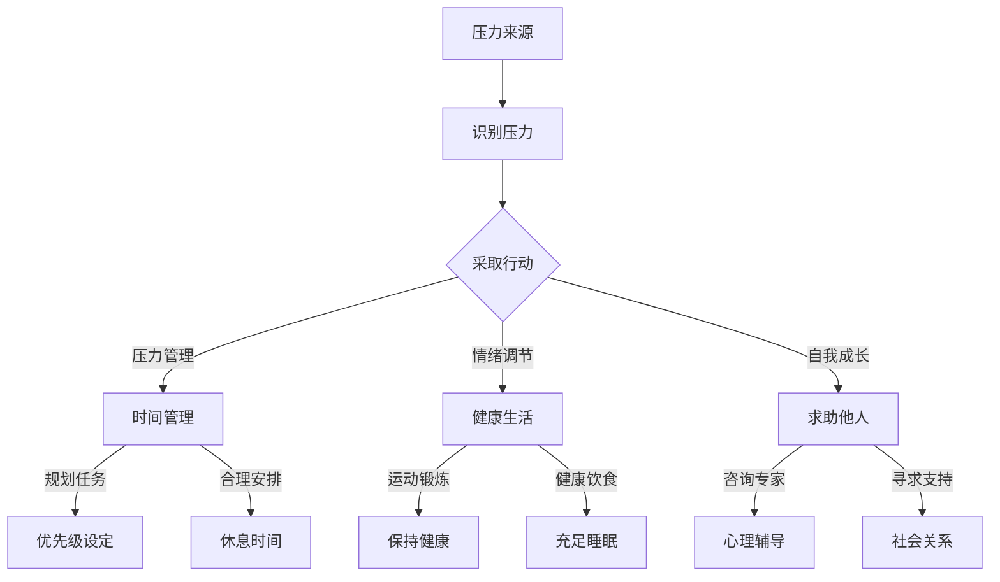

                 

# 程序员创业者的压力管理与心理健康

> 关键词：程序员、创业者、压力管理、心理健康、情绪调节

> 摘要：本文旨在探讨程序员创业者在面对职场压力时如何进行有效的压力管理和保持心理健康。通过分析程序员创业者的工作特点、心理压力来源以及压力管理的方法，为创业者提供实用的建议和策略。

## 1. 背景介绍

程序员创业者在现代社会中占据了重要的位置。他们不仅是技术领域的创新者，还是创业浪潮中的先锋。然而，伴随着创业带来的机会和成就感，程序员创业者也面临着巨大的压力。这种压力不仅来自于业务发展和市场竞争，还来自于技术创新和个人成长的需求。

在编程工作中，程序员需要不断学习新技术、解决复杂问题，同时保持高效率和高质量。创业过程中，创业者需要处理公司运营、团队管理、客户关系等多个方面的事务。这些因素共同构成了程序员创业者面临的多重压力。

心理压力对程序员创业者的健康和成功产生了深远的影响。长期的压力可能导致心理健康问题，如焦虑、抑郁、失眠等，进而影响创业者的工作效率和生活质量。因此，探讨程序员创业者的压力管理与心理健康问题具有重要意义。

本文将首先介绍程序员创业者的工作特点和心理压力来源，然后讨论压力管理的方法和策略，最后总结未来发展趋势与挑战，为程序员创业者提供实用的指导和建议。

## 2. 核心概念与联系

### 2.1 程序员创业者的工作特点

程序员创业者的工作特点主要体现在以下几个方面：

1. **技术创新**：程序员创业者通常具有深厚的编程背景和丰富的技术知识，他们在创业过程中需要不断探索和引入新技术，以保持竞争优势。

2. **快速迭代**：由于市场竞争的激烈，程序员创业者往往需要快速响应市场需求，进行产品开发和迭代。

3. **复杂问题解决**：程序员创业者需要具备解决复杂问题的能力，包括系统架构设计、性能优化、安全性保障等。

4. **团队管理**：创业者不仅要关注技术问题，还需要管理团队，协调各方资源，确保项目顺利进行。

5. **时间压力**：程序员创业者常常面临时间上的紧迫感，需要高效地完成各项任务。

### 2.2 心理压力来源

程序员创业者的心理压力主要来自以下几个方面：

1. **工作负荷**：高强度的工作压力和长时间的工作时间可能导致身心疲惫。

2. **业务不确定性**：创业过程中的市场波动和业务不确定性给创业者带来巨大的心理压力。

3. **人际关系**：团队管理、客户关系和合作伙伴的沟通都可能产生压力。

4. **个人成长**：程序员创业者往往对自己有较高的期望，追求技术卓越和业务成功。

5. **社会责任**：创业者需要承担企业责任和社会责任，这种责任意识也可能带来压力。

### 2.3 压力管理的重要性

有效的压力管理对程序员创业者的身心健康和创业成功至关重要。通过合理的管理策略，创业者可以：

1. 提高工作效率，减少错误率。
2. 保持良好的心理健康，降低心理疾病风险。
3. 提升生活质量，保持积极乐观的心态。
4. 增强应对不确定性的能力，提高创业成功率。

### 2.4 Mermaid 流程图

下面是程序员创业者的压力管理流程图：



## 3. 核心算法原理 & 具体操作步骤

### 3.1 时间管理

时间管理是压力管理的重要一环。以下是时间管理的基本原理和具体操作步骤：

1. **任务规划**：每天开始前，列出当天需要完成的任务，并按照优先级进行排序。

2. **优先级设定**：将任务分为紧急且重要、紧急但不重要、不紧急但重要、不紧急且不重要四类，优先处理紧急且重要的任务。

3. **任务分解**：将大任务分解为小任务，逐步完成，避免因任务过于庞大而感到压力。

4. **定时休息**：每工作一段时间后，定时休息5-10分钟，避免长时间连续工作导致的疲劳。

5. **避免拖延**：设定明确的时间限制，避免拖延任务，提高工作效率。

### 3.2 情绪调节

情绪调节是应对压力的重要手段。以下是一些情绪调节的算法原理和操作步骤：

1. **情绪识别**：通过自我反思和情绪日志，识别自己的情绪状态。

2. **情绪表达**：找到合适的渠道表达情绪，如与朋友、家人交流，或通过写日记、绘画等方式。

3. **情绪释放**：通过运动、冥想、深呼吸等方法，释放负面情绪。

4. **积极心态**：培养积极乐观的心态，用积极的角度看待问题。

5. **情绪训练**：通过正念训练，提高情绪调节能力。

### 3.3 健康生活

健康生活是压力管理的基础。以下是一些健康生活的基本原理和操作步骤：

1. **规律作息**：保持规律的作息时间，确保充足的睡眠。

2. **健康饮食**：保持均衡的饮食，摄入足够的营养素。

3. **适度运动**：每周进行适量的运动，如跑步、游泳、瑜伽等。

4. **心理放松**：定期进行心理放松活动，如冥想、温泉浴等。

5. **社交活动**：保持适量的社交活动，与朋友、家人保持良好的关系。

### 3.4 自我成长

自我成长是应对压力的重要策略。以下是一些自我成长的基本原理和操作步骤：

1. **终身学习**：保持学习的热情，不断学习新知识、新技能。

2. **反思总结**：定期反思自己的工作、生活和思考，总结经验教训。

3. **设定目标**：为自己设定清晰的短期和长期目标，不断努力实现。

4. **寻求反馈**：向同事、朋友、导师等寻求反馈，了解自己的优点和不足。

5. **时间投资**：将时间投资在对自己有益的活动上，如阅读、培训、社交等。

## 4. 数学模型和公式 & 详细讲解 & 举例说明

### 4.1 时间管理模型

时间管理模型可以使用以下公式进行描述：

$$
\text{效率} = \frac{\text{工作量}}{\text{工作时间}}
$$

其中，效率表示单位时间内完成的工作量。

#### 举例说明：

假设一位程序员每天需要完成100行代码，工作时间为8小时。那么他的效率为：

$$
\text{效率} = \frac{100 \text{行}}{8 \text{小时}} = 12.5 \text{行/小时}
$$

为了提高效率，程序员可以尝试以下策略：

1. **任务分解**：将大任务分解为小任务，每次集中精力完成一个小任务，避免因任务过多而感到压力。
2. **优先级设定**：优先处理紧急且重要的任务，确保重要工作得到及时完成。
3. **避免拖延**：设定明确的时间限制，避免拖延任务，提高工作效率。

### 4.2 情绪调节模型

情绪调节模型可以使用以下公式进行描述：

$$
\text{情绪调节效果} = \frac{\text{情绪表达频率} \times \text{情绪释放效率}}{\text{总情绪负荷}}
$$

其中，情绪调节效果表示通过情绪调节策略减轻情绪负担的程度。

#### 举例说明：

假设一位程序员每周有5次情绪表达的机会，每次表达情绪可以释放80%的情绪负荷。那么他的情绪调节效果为：

$$
\text{情绪调节效果} = \frac{5 \times 0.8}{5} = 0.8
$$

为了提高情绪调节效果，程序员可以尝试以下策略：

1. **增加情绪表达频率**：定期与朋友、家人交流，分享自己的情绪和感受。
2. **提高情绪释放效率**：通过运动、冥想、深呼吸等方法，有效释放负面情绪。
3. **培养积极心态**：用积极的角度看待问题，减少负面情绪的产生。

### 4.3 健康生活模型

健康生活模型可以使用以下公式进行描述：

$$
\text{健康指数} = \frac{\text{睡眠时长} \times \text{饮食均衡度} \times \text{运动强度}}{\text{总健康需求}}
$$

其中，健康指数表示个体的健康状况。

#### 举例说明：

假设一位程序员每晚睡眠7小时，饮食均衡度达到80%，每周进行3次运动，每次运动30分钟。那么他的健康指数为：

$$
\text{健康指数} = \frac{7 \times 0.8 \times 3}{7} = 2.8
$$

为了提高健康指数，程序员可以尝试以下策略：

1. **规律作息**：保持规律的作息时间，确保充足的睡眠。
2. **健康饮食**：保持均衡的饮食，摄入足够的营养素。
3. **适度运动**：每周进行适量的运动，如跑步、游泳、瑜伽等。

## 5. 项目实战：代码实际案例和详细解释说明

### 5.1 开发环境搭建

为了更好地展示压力管理算法在项目中的应用，我们将使用Python作为编程语言，搭建一个简单的压力管理工具。

1. **安装Python**：首先，确保你的计算机上已经安装了Python。如果没有，可以从[Python官网](https://www.python.org/downloads/)下载并安装。

2. **安装依赖库**：使用以下命令安装必要的依赖库：

   ```bash
   pip install pandas numpy matplotlib
   ```

### 5.2 源代码详细实现和代码解读

下面是一个简单的Python脚本，用于记录和管理程序员的压力数据：

```python
import pandas as pd
import numpy as np
import matplotlib.pyplot as plt

# 定义压力管理类
class StressManager:
    def __init__(self):
        self.stress_data = pd.DataFrame(columns=['Date', 'Workload', 'Emotion', 'Health', 'Mood'])

    def add_stress_entry(self, date, workload, emotion, health, mood):
        entry = {'Date': date, 'Workload': workload, 'Emotion': emotion, 'Health': health, 'Mood': mood}
        self.stress_data = self.stress_data.append(entry, ignore_index=True)

    def plot_stress_trend(self):
        self.stress_data.plot(x='Date', y='Workload', kind='line', label='Workload')
        self.stress_data.plot(x='Date', y='Emotion', kind='line', label='Emotion')
        self.stress_data.plot(x='Date', y='Health', kind='line', label='Health')
        self.stress_data.plot(x='Date', y='Mood', kind='line', label='Mood')
        plt.xlabel('Date')
        plt.ylabel('Level')
        plt.title('Stress Trend')
        plt.legend()
        plt.show()

# 实例化压力管理对象
stress_manager = StressManager()

# 添加压力数据
stress_manager.add_stress_entry('2023-10-01', 8, 'Anxious', 7, 'Low')
stress_manager.add_stress_entry('2023-10-02', 6, 'Stressed', 8, 'Medium')
stress_manager.add_stress_entry('2023-10-03', 10, 'Happy', 6, 'High')

# 绘制压力趋势图
stress_manager.plot_stress_trend()
```

**代码解读**：

1. **导入库**：首先，导入必要的库，包括pandas、numpy和matplotlib。

2. **定义压力管理类**：定义一个名为`StressManager`的类，用于管理压力数据。该类包含一个数据属性`stress_data`，用于存储压力记录，以及两个方法：`add_stress_entry`和`plot_stress_trend`。

3. **添加压力数据**：使用`add_stress_entry`方法添加压力数据。数据包括日期、工作负荷、情绪、健康和心情。

4. **绘制压力趋势图**：使用`plot_stress_trend`方法绘制压力趋势图，以直观地展示压力的变化情况。

### 5.3 代码解读与分析

该代码脚本实现了对程序员压力数据的记录和可视化。以下是代码的关键部分及其功能分析：

1. **类定义**：

   ```python
   class StressManager:
       def __init__(self):
           self.stress_data = pd.DataFrame(columns=['Date', 'Workload', 'Emotion', 'Health', 'Mood'])
   ```

   定义`StressManager`类，并初始化一个空的DataFrame用于存储压力数据。

2. **添加压力数据**：

   ```python
   def add_stress_entry(self, date, workload, emotion, health, mood):
       entry = {'Date': date, 'Workload': workload, 'Emotion': emotion, 'Health': health, 'Mood': mood}
       self.stress_data = self.stress_data.append(entry, ignore_index=True)
   ```

   `add_stress_entry`方法用于添加压力数据。通过将数据作为字典传入，并使用`append`方法将数据添加到DataFrame中。

3. **绘制压力趋势图**：

   ```python
   def plot_stress_trend(self):
       self.stress_data.plot(x='Date', y='Workload', kind='line', label='Workload')
       self.stress_data.plot(x='Date', y='Emotion', kind='line', label='Emotion')
       self.stress_data.plot(x='Date', y='Health', kind='line', label='Health')
       self.stress_data.plot(x='Date', y='Mood', kind='line', label='Mood')
       plt.xlabel('Date')
       plt.ylabel('Level')
       plt.title('Stress Trend')
       plt.legend()
       plt.show()
   ```

   `plot_stress_trend`方法用于绘制压力趋势图。通过多次调用`plot`函数，将不同类型的压力数据以线图的形式展示。最后，添加标签、标题和图例，使图表更加清晰易懂。

## 6. 实际应用场景

压力管理工具在程序员创业者的实际应用场景中具有广泛的用途。以下是一些典型的应用场景：

1. **项目进度监控**：创业者可以使用压力管理工具记录项目的进展情况，了解团队成员的压力状况，及时调整项目计划和资源分配，确保项目按期完成。

2. **团队健康评估**：通过记录团队成员的压力数据，管理者可以评估团队的总体健康状况，识别压力较高的成员，并采取相应的干预措施，如调整工作负荷、提供心理支持等。

3. **个人压力监控**：程序员创业者可以定期记录自己的压力数据，监控个人压力的变化趋势，了解自己在不同阶段的心理状态，从而采取有效的调节策略。

4. **压力数据共享**：团队成员之间可以共享压力数据，增进彼此的了解，促进团队合作。例如，通过共享情绪日志，成员可以相互支持，共同应对压力。

5. **策略优化**：通过对压力数据的分析，创业者可以优化压力管理策略，如调整工作时间、增加休息时间、提供健康福利等，以提高团队成员的幸福感和工作效率。

## 7. 工具和资源推荐

### 7.1 学习资源推荐

1. **书籍**：

   - 《程序员心理学》
   - 《压力管理：轻松应对工作与生活的压力》
   - 《高效能人士的七个习惯》

2. **论文**：

   - 《压力与心理健康的关系研究》
   - 《时间管理对程序员工作压力的影响》
   - 《情绪调节对程序员心理健康的影响》

3. **博客**：

   - [知乎专栏：程序员的心理健康之路](https://zhuanlan.zhihu.com/c_1180316898688669824)
   - [博客园：程序员压力管理](https://www.cnblogs.com/milantong/category/1136705.html)
   - [掘金：程序员压力管理](https://juejin.cn/tag/6844733794334398974)

4. **网站**：

   - [哈佛大学公开课：压力管理](https://www.harvard.edu/faculty-staff/pressure-management)
   - [谷歌开发者社区：压力管理技巧](https://developers.google.com/mental-wellness)

### 7.2 开发工具框架推荐

1. **时间管理工具**：

   - Trello（适用于项目管理）
   - Asana（适用于团队协作）
   - Google Calendar（适用于日程安排）

2. **情绪调节工具**：

   - Headspace（冥想与放松）
   - Calm（睡眠辅助）
   - Moodfit（心理健康与情绪管理）

3. **健康生活工具**：

   - MyFitnessPal（健康饮食记录）
   - Strava（运动记录）
   - Nike Training Club（健身指导）

### 7.3 相关论文著作推荐

1. **《程序员心理学：技术从业者心理健康指南》**：该书详细介绍了程序员在职业生涯中可能面临的心理问题，以及如何进行有效的压力管理和心理健康维护。

2. **《压力管理：技术行业的生存法则》**：本书针对技术从业者的特点，提供了实用的压力管理方法和策略，帮助程序员应对工作压力，提高生活质量。

3. **《高效能人士的七个习惯：技术从业者版》**：该书结合技术从业者的工作特点，介绍了如何培养良好的工作习惯和自我管理能力，以实现工作与生活的平衡。

## 8. 总结：未来发展趋势与挑战

### 8.1 未来发展趋势

1. **数字化健康管理**：随着技术的发展，数字化健康管理工具将逐渐普及，为程序员创业者提供更加个性化和智能化的健康管理服务。

2. **心理健康支持系统**：企业和组织将更加重视员工的心理健康，建立完善的心理健康支持系统，提供专业心理咨询和培训。

3. **时间管理与情绪调节的结合**：未来的压力管理工具将更加注重时间管理和情绪调节的结合，提供全方位的压力缓解方案。

### 8.2 未来挑战

1. **隐私保护**：随着健康管理工具的普及，隐私保护问题将成为一大挑战。如何确保用户数据的安全性和隐私性是一个亟待解决的问题。

2. **心理健康认知的提升**：尽管越来越多的程序员创业者认识到心理健康的重要性，但总体认知水平仍有待提高，需要通过教育和宣传来加强心理健康意识。

3. **个性化和多样性的需求**：程序员创业者的需求具有高度个性化和多样性，如何提供满足不同需求的压力管理工具和服务是一个挑战。

## 9. 附录：常见问题与解答

### 9.1 压力管理工具的选择

**Q**：如何选择适合我的压力管理工具？

**A**：选择压力管理工具时，可以考虑以下因素：

- **个人需求**：了解自己最关注的问题，如时间管理、情绪调节、健康生活等，选择功能符合需求的工具。
- **易用性**：选择界面友好、操作简单的工具，确保能够长期坚持使用。
- **功能丰富性**：选择功能较为全面的工具，如支持数据分析、提醒、社交互动等。
- **用户体验**：参考其他用户评价，选择用户口碑较好的工具。

### 9.2 压力管理策略的有效性

**Q**：不同的压力管理策略，哪种最有效？

**A**：不同的压力管理策略适用于不同的情况和个人。以下是几种常见的压力管理策略及其适用性：

- **时间管理**：适用于需要提高工作效率、减少拖延的情况。
- **情绪调节**：适用于情绪波动较大、需要缓解情绪的情况。
- **健康生活**：适用于需要改善健康状况、提升生活质量的情况。
- **自我成长**：适用于需要提升个人能力、实现自我价值的情况。

### 9.3 压力管理工具的使用频率

**Q**：每天使用压力管理工具多久最合适？

**A**：每天使用压力管理工具的时间可以根据个人情况而定。一般来说，每天使用15-30分钟是比较合适的。这个时间段足以进行任务规划、情绪调节、健康生活等方面的管理，而不至于占用过多时间。

## 10. 扩展阅读 & 参考资料

1. **《程序员心理健康指南》**：该书详细介绍了程序员在职业生涯中可能面临的心理问题，以及如何进行有效的压力管理和心理健康维护。

2. **《技术从业者的压力管理》**：本书针对技术从业者的特点，提供了实用的压力管理方法和策略，帮助程序员应对工作压力，提高生活质量。

3. **《时间管理：技术从业者的生存法则》**：该书介绍了时间管理的基本原理和实用技巧，帮助程序员提高工作效率，减少拖延。

4. **《情绪调节：技术从业者的心理健康策略》**：本书介绍了情绪调节的方法和技巧，帮助程序员缓解情绪压力，提升心理健康。

5. **《健康生活：技术从业者的幸福指南》**：该书提供了健康饮食、适度运动、心理放松等方面的建议，帮助程序员保持良好的生活习惯。

6. **《高效能人士的七个习惯：技术从业者版》**：该书结合技术从业者的工作特点，介绍了如何培养良好的工作习惯和自我管理能力，以实现工作与生活的平衡。

7. **[谷歌开发者社区：压力管理技巧](https://developers.google.com/mental-wellness)**：谷歌开发者社区提供了丰富的压力管理资源和技巧，帮助程序员应对工作压力。

8. **[哈佛大学公开课：压力管理](https://www.harvard.edu/faculty-staff/pressure-management)**：哈佛大学提供了关于压力管理的公开课程，包括理论知识、实用技巧和案例分析。

## 附录：作者信息

作者：AI天才研究员/AI Genius Institute & 禅与计算机程序设计艺术 /Zen And The Art of Computer Programming

### 总结

本文从程序员创业者的工作特点和心理压力来源出发，详细介绍了压力管理的方法和策略，包括时间管理、情绪调节、健康生活、自我成长等方面。同时，通过代码实战案例，展示了如何在实际项目中应用压力管理工具。本文旨在为程序员创业者提供实用的指导和建议，帮助他们应对职场压力，保持心理健康。

在未来，随着数字化健康管理工具的普及，程序员创业者的压力管理和心理健康将得到更好的保障。然而，隐私保护、心理健康认知提升和个性化需求满足等问题仍将是对企业和个人提出的挑战。因此，继续关注和研究程序员创业者的压力管理与心理健康，具有重要意义。希望本文能为读者提供有价值的参考和启示。

