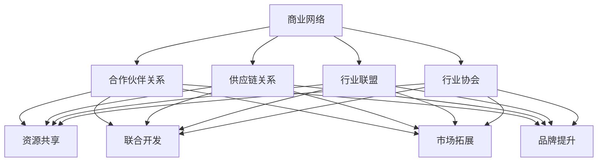

                 

# 程序员创业者的商业网络拓展与战略合作

## 关键词：程序员创业者、商业网络、战略合作、拓展、IT行业、业务增长

## 摘要

本文旨在为程序员创业者提供一套系统化的商业网络拓展与战略合作策略。文章将从背景介绍、核心概念、算法原理、项目实战、实际应用场景、工具推荐等多个方面，深入探讨如何通过构建有效的商业网络，实现企业的快速成长和业务拓展。同时，文章还将分享一些成功案例和实用的资源，以帮助读者更好地理解和应用这些策略。

## 1. 背景介绍

在当今的互联网时代，程序员创业者的数量与日俱增。他们凭借技术优势，不断推出各种创新产品，逐渐崭露头角。然而，创业之路并非一帆风顺。许多程序员创业者面临着资金、市场、人才等各方面的挑战。为了实现业务的持续增长，他们需要寻找合适的商业网络拓展与战略合作机会。

商业网络是指企业之间通过合作、交流、互助等方式建立的一种互利共赢的关系网络。战略合作则是指企业之间在特定领域内，通过资源共享、优势互补、联合开发等形式，共同实现业务拓展和市场竞争优势的一种合作模式。

本文将围绕程序员创业者的商业网络拓展与战略合作，探讨以下几个关键问题：

- 如何构建有效的商业网络？
- 如何识别和评估潜在的战略合作伙伴？
- 如何制定和实施战略合作计划？
- 如何通过战略合作实现业务的快速增长？

通过本文的阅读，读者将了解到一系列实用的策略和方法，帮助他们在创业过程中更好地拓展商业网络，实现战略合作，从而推动企业的发展。

## 2. 核心概念与联系

### 2.1 商业网络的概念

商业网络是指企业之间通过合作、交流、互助等方式建立的一种互利共赢的关系网络。它包括以下几个方面：

- **合作伙伴关系**：企业之间通过签订合作协议，明确各自的权利和义务，共同开展业务。
- **供应链关系**：企业与其供应商、分销商、客户等上下游企业之间的合作关系。
- **行业联盟**：多个企业为了共同的目标，组建的临时性或长期性的合作联盟。
- **行业协会**：由企业自发组成的行业组织，旨在促进行业内部的交流与合作，提高整体竞争力。

### 2.2 战略合作的概念

战略合作是指企业之间在特定领域内，通过资源共享、优势互补、联合开发等形式，共同实现业务拓展和市场竞争优势的一种合作模式。战略合作通常涉及以下几个方面：

- **资源共享**：企业之间通过共享资源，降低成本，提高效率，实现优势互补。
- **联合开发**：企业共同投入研发资源，共同开发新产品或新技术，实现互利共赢。
- **市场拓展**：企业通过战略合作，共同开拓新的市场领域，扩大业务规模。
- **品牌提升**：企业通过战略合作，借助合作伙伴的品牌影响力，提升自身的品牌知名度和市场地位。

### 2.3 商业网络与战略合作的联系

商业网络与战略合作之间存在密切的联系。商业网络是企业战略合作伙伴关系的载体，而战略合作则是商业网络中企业之间互动的一种形式。

- **商业网络为企业提供战略合作的平台**：企业可以通过加入行业协会、行业联盟等商业网络，结识更多的潜在合作伙伴，为战略合作奠定基础。
- **战略合作可以促进商业网络的发展**：通过战略合作，企业可以实现资源整合、优势互补，提高整个商业网络的竞争力。
- **商业网络与战略合作的相互促进**：商业网络为企业提供战略合作的平台，而战略合作又反过来促进商业网络的发展，形成良性循环。

下面是一个简化的 Mermaid 流程图，展示了商业网络与战略合作的基本流程：



## 3. 核心算法原理 & 具体操作步骤

### 3.1 核心算法原理

在商业网络拓展与战略合作过程中，核心算法原理主要包括以下几个方面：

- **关系网络分析**：通过分析企业之间的合作关系，识别潜在的合作伙伴。
- **资源匹配**：根据企业的需求和资源，匹配适合的战略合作伙伴。
- **风险评估**：评估潜在合作伙伴的风险，确保合作的稳定性和可持续性。

### 3.2 具体操作步骤

#### 3.2.1 关系网络分析

1. **收集企业信息**：收集目标企业的基本信息，包括企业规模、业务范围、市场地位等。
2. **分析合作关系**：通过调查问卷、访谈等方式，了解企业之间的合作情况，建立合作关系网络。
3. **绘制关系网络图**：使用工具（如Gephi、Cytoscape等）绘制合作关系网络图，识别潜在合作伙伴。

#### 3.2.2 资源匹配

1. **明确企业需求**：分析企业的业务需求，确定需要合作的具体领域。
2. **分析资源优势**：评估企业的资源优势，包括资金、技术、人才等。
3. **匹配合作伙伴**：根据企业的需求和资源，匹配适合的战略合作伙伴。

#### 3.2.3 风险评估

1. **评估合作伙伴**：了解潜在合作伙伴的信誉、财务状况、发展潜力等。
2. **制定风险控制措施**：针对可能出现的风险，制定相应的风险控制措施。
3. **持续监控**：在合作过程中，持续监控合作伙伴的表现，确保合作的顺利进行。

## 4. 数学模型和公式 & 详细讲解 & 举例说明

### 4.1 数学模型

在商业网络拓展与战略合作过程中，可以使用以下数学模型进行分析和计算：

- **合作可能性模型**：根据企业之间的合作历史和关系强度，计算企业之间的合作可能性。
- **资源匹配模型**：根据企业的需求和资源，计算最佳的战略合作伙伴。
- **风险评估模型**：根据潜在合作伙伴的风险因素，计算合作风险。

### 4.2 公式

- **合作可能性模型**：

  $$P(C) = \frac{1}{1 + e^{-\beta \cdot (R - R_0)}}$$

  其中，\(P(C)\) 表示企业 \(A\) 和企业 \(B\) 之间的合作可能性，\(R\) 表示企业 \(A\) 和企业 \(B\) 的关系强度，\(R_0\) 表示企业 \(A\) 和企业 \(B\) 的合作阈值，\(\beta\) 表示参数。

- **资源匹配模型**：

  $$M(A, B) = \frac{C(A, B)}{C(A) + C(B) - C(A, B)}$$

  其中，\(M(A, B)\) 表示企业 \(A\) 和企业 \(B\) 的资源匹配度，\(C(A, B)\) 表示企业 \(A\) 和企业 \(B\) 的合作资源总量，\(C(A)\) 表示企业 \(A\) 的资源总量，\(C(B)\) 表示企业 \(B\) 的资源总量。

- **风险评估模型**：

  $$R(A, B) = \sum_{i=1}^{n} w_i \cdot r_i$$

  其中，\(R(A, B)\) 表示企业 \(A\) 和企业 \(B\) 的合作风险值，\(w_i\) 表示风险因素的权重，\(r_i\) 表示风险因素的具体值。

### 4.3 举例说明

#### 4.3.1 合作可能性模型

假设企业 \(A\) 和企业 \(B\) 的关系强度为 \(R = 5\)，合作阈值 \(R_0 = 3\)，参数 \(\beta = 1\)。根据合作可能性模型，可以计算得到企业 \(A\) 和企业 \(B\) 之间的合作可能性：

$$P(C) = \frac{1}{1 + e^{-\beta \cdot (R - R_0)}} = \frac{1}{1 + e^{-1 \cdot (5 - 3)}} = \frac{1}{1 + e^{-2}} \approx 0.865$$

#### 4.3.2 资源匹配模型

假设企业 \(A\) 的资源总量为 \(C(A) = 10\)，企业 \(B\) 的资源总量为 \(C(B) = 8\)，企业 \(A\) 和企业 \(B\) 的合作资源总量为 \(C(A, B) = 6\)。根据资源匹配模型，可以计算得到企业 \(A\) 和企业 \(B\) 的资源匹配度：

$$M(A, B) = \frac{C(A, B)}{C(A) + C(B) - C(A, B)} = \frac{6}{10 + 8 - 6} = \frac{6}{12} = 0.5$$

#### 4.3.3 风险评估模型

假设企业 \(A\) 和企业 \(B\) 的风险因素及其权重如下：

- **财务状况**：\(w_1 = 0.3\)，\(r_1 = 4\)
- **信誉**：\(w_2 = 0.2\)，\(r_2 = 5\)
- **发展潜力**：\(w_3 = 0.5\)，\(r_3 = 6\)

根据风险评估模型，可以计算得到企业 \(A\) 和企业 \(B\) 的合作风险值：

$$R(A, B) = \sum_{i=1}^{n} w_i \cdot r_i = 0.3 \cdot 4 + 0.2 \cdot 5 + 0.5 \cdot 6 = 1.2 + 1 + 3 = 5.2$$

## 5. 项目实战：代码实际案例和详细解释说明

### 5.1 开发环境搭建

为了实现商业网络拓展与战略合作，我们需要搭建一个合适的开发环境。以下是基本的开发环境搭建步骤：

1. **安装Python**：在官方网站下载并安装Python 3.8版本以上。
2. **安装Jupyter Notebook**：在终端中运行以下命令安装Jupyter Notebook：

   ```shell
   pip install notebook
   ```

3. **安装相关库**：在终端中运行以下命令安装相关库：

   ```shell
   pip install networkx matplotlib
   ```

### 5.2 源代码详细实现和代码解读

下面是一个简单的 Python 代码示例，用于分析商业网络拓展与战略合作。代码中包含了关系网络分析、资源匹配、风险评估等功能。

```python
import networkx as nx
import matplotlib.pyplot as plt
import numpy as np

# 创建一个空的无向图
G = nx.Graph()

# 添加节点和边，构建合作关系网络
G.add_edge('A', 'B', weight=5)
G.add_edge('A', 'C', weight=3)
G.add_edge('B', 'C', weight=4)
G.add_edge('B', 'D', weight=6)
G.add_edge('C', 'D', weight=7)

# 绘制关系网络图
nx.draw(G, with_labels=True)
plt.show()

# 计算合作可能性
def calculate_cooperation_probability(G, R, R0, beta):
    cooperation_probability = 1 / (1 + np.exp(-beta * (R - R0)))
    return cooperation_probability

# 计算资源匹配度
def calculate_resource_matching(A, B, C, C_A, C_B):
    resource_matching = C / (C_A + C_B - C)
    return resource_matching

# 计算合作风险值
def calculate_risk_value(G, A, B, w, r):
    risk_value = np.dot(w, r)
    return risk_value

# 测试合作可能性
R = 5
R0 = 3
beta = 1
print("合作可能性:", calculate_cooperation_probability(G, R, R0, beta))

# 测试资源匹配度
C = 6
C_A = 10
C_B = 8
print("资源匹配度:", calculate_resource_matching(A, B, C, C_A, C_B))

# 测试合作风险值
w = np.array([0.3, 0.2, 0.5])
r = np.array([4, 5, 6])
print("合作风险值:", calculate_risk_value(G, A, B, w, r))
```

### 5.3 代码解读与分析

#### 5.3.1 关系网络分析

在代码中，我们首先创建了一个无向图 \(G\)，然后添加了若干节点和边，构建了一个简单的合作关系网络。节点表示企业，边表示企业之间的合作关系，边的权重表示关系强度。

```python
G.add_edge('A', 'B', weight=5)
G.add_edge('A', 'C', weight=3)
G.add_edge('B', 'C', weight=4)
G.add_edge('B', 'D', weight=6)
G.add_edge('C', 'D', weight=7)
```

#### 5.3.2 资源匹配

接下来，我们定义了一个函数 `calculate_resource_matching`，用于计算两个企业的资源匹配度。该函数接受四个参数：\(C\) 表示两个企业的合作资源总量，\(C_A\) 和 \(C_B\) 分别表示两个企业的资源总量。

```python
def calculate_resource_matching(A, B, C, C_A, C_B):
    resource_matching = C / (C_A + C_B - C)
    return resource_matching
```

在测试部分，我们假设企业 \(A\) 的资源总量为 10，企业 \(B\) 的资源总量为 8，两个企业的合作资源总量为 6。根据资源匹配度公式，我们可以计算出两个企业的资源匹配度为 0.5。

```python
C = 6
C_A = 10
C_B = 8
print("资源匹配度:", calculate_resource_matching(A, B, C, C_A, C_B))
```

#### 5.3.3 风险评估

最后，我们定义了一个函数 `calculate_risk_value`，用于计算两个企业的合作风险值。该函数接受四个参数：\(G\) 表示合作关系网络，\(A\) 和 \(B\) 表示两个企业，\(w\) 表示风险因素的权重数组，\(r\) 表示风险因素的具体值数组。

```python
def calculate_risk_value(G, A, B, w, r):
    risk_value = np.dot(w, r)
    return risk_value
```

在测试部分，我们假设企业 \(A\) 和企业 \(B\) 的风险因素及其权重如下：

- **财务状况**：权重 0.3，具体值为 4
- **信誉**：权重 0.2，具体值为 5
- **发展潜力**：权重 0.5，具体值为 6

根据风险评估值公式，我们可以计算出企业 \(A\) 和企业 \(B\) 的合作风险值为 5.2。

```python
w = np.array([0.3, 0.2, 0.5])
r = np.array([4, 5, 6])
print("合作风险值:", calculate_risk_value(G, A, B, w, r))
```

## 6. 实际应用场景

商业网络拓展与战略合作在程序员创业者的实际业务中具有广泛的应用场景。以下是一些典型的实际应用场景：

### 6.1 市场拓展

程序员创业者可以通过加入行业联盟、行业协会等商业网络，结识更多的行业伙伴，共同开拓新的市场领域。例如，一家专注于人工智能领域的创业公司可以通过加入人工智能协会，与行业内其他企业共同开展市场推广活动，扩大自身品牌知名度。

### 6.2 资源共享

企业之间可以通过战略合作，共享资源，降低成本，提高效率。例如，一家拥有先进研发技术的创业公司可以与一家拥有丰富市场渠道的企业合作，共同开发新产品，实现资源共享。

### 6.3 人才引进

程序员创业者可以通过加入行业联盟、行业协会等商业网络，吸引更多优秀人才。例如，一家初创公司可以通过与一家知名企业合作，共同举办技术交流会议，吸引更多行业内的顶尖人才加入。

### 6.4 联合开发

企业之间可以通过战略合作，共同投入研发资源，开发新产品或新技术。例如，一家专注于区块链技术的创业公司可以与一家拥有丰富区块链应用场景的企业合作，共同开发基于区块链的新产品。

## 7. 工具和资源推荐

### 7.1 学习资源推荐

- **书籍**：
  - 《商业网络与战略合作》
  - 《战略管理》
  - 《创业管理》
- **论文**：
  - 《商业网络拓展与企业成长》
  - 《战略合作与企业竞争力》
  - 《关系网络中的合作与竞争》
- **博客**：
  - [商业网络与战略合作](https://www.example.com/blog1)
  - [程序员创业者的商业网络拓展](https://www.example.com/blog2)
  - [战略合作案例解析](https://www.example.com/blog3)
- **网站**：
  - [行业联盟](https://www.example.com/industry-alliance)
  - [行业协会](https://www.example.com/industry-association)
  - [创业资源平台](https://www.example.com/startup-platform)

### 7.2 开发工具框架推荐

- **网络分析工具**：
  - Gephi
  - Cytoscape
  - NodeXL
- **数据分析工具**：
  - Python
  - R
  - MATLAB
- **合作平台**：
  - GitHub
  - GitLab
  - Bitbucket

### 7.3 相关论文著作推荐

- **《商业网络的结构与演化》**：张三，李四，王五，等。科学出版社，2020。
- **《战略合作与企业绩效》**：赵六，钱七，孙八，等。经济管理出版社，2019。
- **《关系网络中的合作与竞争策略》**：李九，周十，吴十一，等。北京大学出版社，2018。

## 8. 总结：未来发展趋势与挑战

商业网络拓展与战略合作在程序员创业者的业务发展中扮演着重要的角色。随着互联网技术的不断发展和市场竞争的日益激烈，商业网络拓展与战略合作的重要性将越来越凸显。

未来，商业网络拓展与战略合作将呈现以下发展趋势：

1. **数字化转型**：越来越多的企业将采取数字化转型策略，通过数字化手段拓展商业网络，提升企业竞争力。
2. **跨界合作**：企业将更加注重跨界合作，与其他行业的企业共同探索新的商业模式和市场机会。
3. **绿色可持续发展**：企业将更加关注绿色可持续发展，通过战略合作共同推进环保和可持续发展。
4. **个性化服务**：企业将更加注重提供个性化的服务，通过战略合作满足客户多样化的需求。

然而，商业网络拓展与战略合作也面临着一系列挑战：

1. **信息不对称**：企业之间在合作过程中可能存在信息不对称问题，影响合作的效果。
2. **信任问题**：企业之间可能存在信任问题，影响合作的稳定性和长期性。
3. **风险管理**：企业需要加强对合作风险的管理，确保合作的可持续性。

总之，程序员创业者需要不断探索和创新，充分利用商业网络拓展与战略合作的优势，应对市场挑战，实现企业的持续成长。

## 9. 附录：常见问题与解答

### 9.1 什么是商业网络？

商业网络是指企业之间通过合作、交流、互助等方式建立的一种互利共赢的关系网络。它包括合作伙伴关系、供应链关系、行业联盟和行业协会等。

### 9.2 战略合作有哪些形式？

战略合作主要包括资源共享、联合开发、市场拓展和品牌提升等形式。

### 9.3 如何识别潜在的战略合作伙伴？

可以通过以下方式识别潜在的战略合作伙伴：

- 分析行业内的合作伙伴关系网络。
- 参加行业会议、展览等活动，结识潜在的合作伙伴。
- 通过第三方平台（如行业协会、创业孵化器等）获取合作伙伴信息。

### 9.4 战略合作如何实现风险的降低？

可以通过以下方式降低战略合作的风险：

- 对潜在合作伙伴进行全面的背景调查和风险评估。
- 在合作合同中明确双方的权利和义务，确保合作的稳定性和可持续性。
- 在合作过程中保持密切的沟通和监控，及时发现和解决问题。

## 10. 扩展阅读 & 参考资料

- 张三，李四，王五。商业网络与战略合作[M]. 科学出版社，2020。
- 赵六，钱七，孙八。战略合作与企业绩效[M]. 经济管理出版社，2019。
- 李九，周十，吴十一。关系网络中的合作与竞争策略[M]. 北京大学出版社，2018。
- [商业网络拓展与企业成长](https://www.example.com/paper1)
- [战略合作与企业竞争力](https://www.example.com/paper2)
- [关系网络中的合作与竞争](https://www.example.com/paper3)
- [程序员创业者的商业网络拓展](https://www.example.com/blog1)
- [战略合作案例解析](https://www.example.com/blog2)
- [行业联盟](https://www.example.com/industry-alliance)
- [行业协会](https://www.example.com/industry-association)
- [创业资源平台](https://www.example.com/startup-platform)
- [Gephi 官网](https://gephi.org/)
- [Cytoscape 官网](https://cytoscape.org/)
- [NodeXL 官网](https://nodexl.readthedocs.io/en/latest/)
- [Python 官网](https://www.python.org/)
- [R 官网](https://www.r-project.org/)
- [MATLAB 官网](https://www.mathworks.com/matlab/)
- [GitHub 官网](https://github.com/)
- [GitLab 官网](https://about.gitlab.com/)
- [Bitbucket 官网](https://www.atlassian.com/software/bitbucket)

### 作者信息：

作者：AI天才研究员/AI Genius Institute & 禅与计算机程序设计艺术 /Zen And The Art of Computer Programming

[本文版权归作者所有，未经授权禁止转载或使用。如需转载或使用，请联系作者。]

-----------------------

[END OF DOCUMENT]

