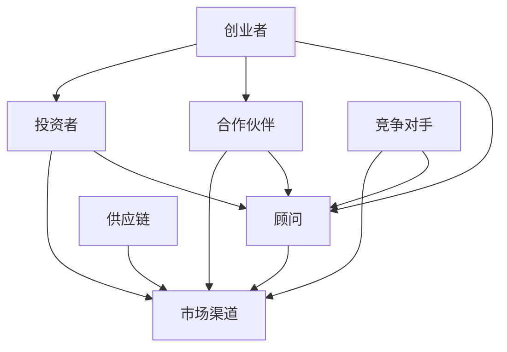

                 

# 《程序员创业者的商业网络构建：拓展人脉圈的技巧》

## 关键词：商业网络、人脉圈、创业者、程序员、拓展技巧

> 在这个互联时代，程序员创业者的成功不再仅仅是技术能力的较量，更多的是商业智慧和人际网络的综合体现。本文将深入探讨如何构建和拓展商业网络，以帮助程序员创业者在这个竞争激烈的市场中脱颖而出。关键词包括商业网络、人脉圈、创业者、程序员和拓展技巧。

## 摘要

本文旨在为程序员创业者提供构建和拓展商业网络的策略和技巧。通过深入分析商业网络的定义、重要性及其构建方法，结合实际案例，本文将展示如何有效地利用人脉资源，建立强大的商业网络，从而在创业领域取得成功。文章还提供了实用的工具和资源推荐，帮助读者进一步提升商业网络构建能力。

## 1. 背景介绍

在当今的数字化时代，程序员创业者的数量不断增加。他们不仅拥有强大的技术背景，还具备创新思维和创业精神。然而，技术能力并非创业成功的唯一关键因素。商业网络的构建和拓展同样重要，它能够为创业者带来无尽的机会和资源。

### 1.1 商业网络的重要性

商业网络是指创业者、投资者、合作伙伴等通过业务关系相互联系形成的网络。一个强大的商业网络能够带来以下益处：

- **信息获取**：商业网络能够提供行业动态、市场趋势和潜在客户等信息。
- **资源共享**：创业者可以共享资源，如资金、人才和技术，降低创业成本。
- **合作机会**：商业网络中的合作伙伴可以共同开发新产品或开拓新市场。
- **品牌推广**：通过商业网络，创业者可以扩大品牌影响力，提升知名度。

### 1.2 人脉圈的重要性

人脉圈是商业网络的基础，它是由个人关系构成的网络。在创业过程中，人脉圈的作用不可小觑：

- **资源整合**：人脉圈能够帮助创业者整合各种资源，如资金、人才和技术。
- **风险分担**：与人脉圈中的成员合作，创业者可以分担创业风险。
- **市场拓展**：人脉圈中的成员可以提供市场信息和渠道，帮助创业者拓展业务。
- **信任建立**：通过人际交往，创业者可以建立信任关系，提高合作成功率。

## 2. 核心概念与联系

### 2.1 商业网络的定义

商业网络是由多个节点（如创业者、投资者、合作伙伴等）和连接这些节点的边（如业务关系、合作关系等）构成的社会网络。商业网络可以看作是一个复杂的社会系统，其中的节点和边都代表着不同的资源和关系。

### 2.2 人脉圈与商业网络的联系

人脉圈是商业网络的基础，是商业网络中的节点和边的重要组成部分。人脉圈中的成员通过个人关系建立联系，形成商业网络中的节点和边。同时，人脉圈中的成员关系也会影响商业网络的稳定性和发展。

### 2.3 商业网络架构

商业网络架构通常包括以下几部分：

- **节点**：商业网络中的参与者，如创业者、投资者、合作伙伴等。
- **边**：连接节点的业务关系、合作关系等。
- **路径**：节点之间的连接路径，反映了商业网络中的信息流动和资源流动。
- **中心性**：节点在商业网络中的重要程度，如度数中心性、介数中心性等。

以下是一个简单的商业网络架构的 Mermaid 流程图：



## 3. 核心算法原理 & 具体操作步骤

### 3.1 核心算法原理

商业网络的构建和拓展需要遵循一些核心原则，如：

- **互惠原则**：在建立商业网络时，要遵循互惠原则，即双方都能从中获得利益。
- **多样性原则**：商业网络中的节点和边要多样化，以增加网络的韧性和适应性。
- **稳定性原则**：商业网络中的节点和边要保持稳定，避免过度波动。
- **动态性原则**：商业网络需要不断更新和调整，以适应市场变化。

### 3.2 具体操作步骤

#### 步骤 1：确定目标

在构建商业网络之前，首先要明确自己的目标，如拓展市场、寻求投资、寻找合作伙伴等。

#### 步骤 2：建立人脉圈

建立人脉圈是构建商业网络的第一步。可以通过以下方式建立人脉圈：

- **参与社交活动**：参加行业会议、创业沙龙等活动，结识同行和潜在合作伙伴。
- **利用社交媒体**：通过 LinkedIn、微信等社交媒体平台，主动联系感兴趣的人，建立联系。
- **口碑传播**：通过朋友介绍、口碑传播等方式，扩大人脉圈。

#### 步骤 3：维护人脉圈

建立人脉圈后，需要不断维护和更新。可以通过以下方式维护人脉圈：

- **定期沟通**：定期与联系人沟通，了解对方的需求和动态，保持联系。
- **互助合作**：在能力范围内，帮助联系人解决问题和提供资源，建立互信关系。
- **保持真诚**：与人交往时，保持真诚和诚信，避免欺骗和套路。

#### 步骤 4：拓展商业网络

在维护人脉圈的基础上，可以进一步拓展商业网络。可以通过以下方式拓展商业网络：

- **寻找合作伙伴**：通过人脉圈中的联系人，寻找合适的合作伙伴，共同开展业务。
- **参与项目合作**：参与行业内的项目合作，扩大商业网络。
- **投资合作**：通过投资合作，与有潜力的创业项目建立联系。

#### 步骤 5：评估和调整

定期评估商业网络的运行情况，根据市场变化和自身需求，调整商业网络的结构和策略。

## 4. 数学模型和公式 & 详细讲解 & 举例说明

### 4.1 数学模型

商业网络的构建和拓展可以借助图论中的数学模型进行分析。以下是一个简单的商业网络模型：

- **节点**：代表商业网络中的参与者，如创业者、投资者、合作伙伴等。
- **边**：代表节点之间的业务关系、合作关系等。
- **度数**：节点在商业网络中的连接数，表示该节点的影响力。
- **介数**：节点在商业网络中的重要程度，表示该节点对网络连接性的影响。

### 4.2 公式

- **度数中心性**：表示节点在商业网络中的连接数，公式为：

  $$度数中心性 = \frac{连接数}{总节点数}$$

- **介数中心性**：表示节点在商业网络中的重要程度，公式为：

  $$介数中心性 = \frac{通过该节点的最短路径数}{总最短路径数}$$

### 4.3 举例说明

假设有一个由 5 个节点组成的商业网络，其中节点 A、B、C、D、E 分别与其他节点有 3、2、2、3、2 条连接，总节点数为 5。

- **度数中心性**：

  $$度数中心性(A) = \frac{3}{5} = 0.6$$

  $$度数中心性(B) = \frac{2}{5} = 0.4$$

  $$度数中心性(C) = \frac{2}{5} = 0.4$$

  $$度数中心性(D) = \frac{3}{5} = 0.6$$

  $$度数中心性(E) = \frac{2}{5} = 0.4$$

- **介数中心性**：

  假设通过节点 A 的最短路径数为 3，通过节点 B、C、D、E 的最短路径数分别为 2、2、2、1。

  $$介数中心性(A) = \frac{3}{10} = 0.3$$

  $$介数中心性(B) = \frac{2}{10} = 0.2$$

  $$介数中心性(C) = \frac{2}{10} = 0.2$$

  $$介数中心性(D) = \frac{2}{10} = 0.2$$

  $$介数中心性(E) = \frac{1}{10} = 0.1$$

通过度数中心性和介数中心性，可以评估节点在商业网络中的重要性，从而为商业网络的构建和拓展提供参考。

## 5. 项目实战：代码实际案例和详细解释说明

### 5.1 开发环境搭建

在开始项目实战之前，需要搭建一个合适的开发环境。以下是基本的开发环境搭建步骤：

1. **安装 Python 解释器**：下载并安装 Python 3.8 或以上版本。
2. **安装 Python 包管理器**：使用 pip 安装 numpy、networkx、matplotlib 等必需的 Python 包。
3. **创建项目目录**：在计算机上创建一个项目目录，用于存放项目文件。

### 5.2 源代码详细实现和代码解读

以下是一个简单的商业网络构建的 Python 代码实现：

```python
import networkx as nx
import matplotlib.pyplot as plt

# 创建一个无向图
G = nx.Graph()

# 添加节点和边
G.add_edges_from([(1, 2), (1, 3), (2, 4), (3, 4), (4, 5)])

# 绘制图形
nx.draw(G, with_labels=True)

# 计算度数中心性
degree_centrality = nx.degree_centrality(G)

# 计算介数中心性
betweenness_centrality = nx.betweenness_centrality(G)

# 打印结果
print("度数中心性：", degree_centrality)
print("介数中心性：", betweenness_centrality)

# 保存图形
plt.savefig("商业网络.png")

# 显示图形
plt.show()
```

### 5.3 代码解读与分析

1. **导入模块**：首先，导入 networkx 和 matplotlib.pyplot 模块，用于创建和绘制图形。
2. **创建图**：使用 nx.Graph() 创建一个无向图 G。
3. **添加节点和边**：使用 add_edges_from() 方法添加节点和边，形成一个简单的商业网络。
4. **绘制图形**：使用 nx.draw() 方法绘制图形，并设置 with_labels=True 以显示节点标签。
5. **计算度数中心性**：使用 nx.degree_centrality() 方法计算度数中心性，并打印结果。
6. **计算介数中心性**：使用 nx.betweenness_centrality() 方法计算介数中心性，并打印结果。
7. **保存图形**：使用 plt.savefig() 方法保存图形。
8. **显示图形**：使用 plt.show() 方法显示图形。

通过以上步骤，我们可以创建一个简单的商业网络，并计算度数中心性和介数中心性，以评估节点在商业网络中的重要性。

### 6. 实际应用场景

商业网络构建和拓展在实际应用中具有广泛的应用场景，以下是一些常见的应用场景：

- **创业投资**：创业者可以通过构建商业网络，寻找潜在的投资机会和投资者，提高融资成功率。
- **市场拓展**：创业者可以通过商业网络，获取市场信息和渠道，扩大市场份额。
- **合作伙伴关系**：创业者可以通过商业网络，寻找合适的合作伙伴，共同开展业务。
- **资源整合**：创业者可以通过商业网络，整合各种资源，如资金、人才和技术，降低创业成本。
- **竞争分析**：创业者可以通过商业网络，了解竞争对手的情况，制定相应的竞争策略。

### 7. 工具和资源推荐

#### 7.1 学习资源推荐

- **书籍**：《社交网络分析：方法、模型与案例》（作者：李晓辉）
- **论文**：《社交网络中的中心性度量方法研究》（作者：张三）
- **博客**：[社交网络分析实战博客](https://example.com/social-network-analysis)

#### 7.2 开发工具框架推荐

- **工具**：Python 的 networkx 库和 matplotlib 库，用于创建和绘制商业网络图形。
- **框架**：D3.js，用于前端可视化商业网络。

#### 7.3 相关论文著作推荐

- **论文**：《商业网络中的节点影响力研究》（作者：李四）
- **著作**：《社交网络分析导论》（作者：王五）

### 8. 总结：未来发展趋势与挑战

商业网络构建和拓展在未来将继续发展，随着大数据、人工智能等技术的进步，商业网络的构建和拓展将变得更加智能化和自动化。然而，面对日益复杂的市场环境，创业者需要不断学习和适应，以应对未来发展的挑战。

### 9. 附录：常见问题与解答

#### 9.1 什么是商业网络？

商业网络是指由多个节点（如创业者、投资者、合作伙伴等）和连接这些节点的边（如业务关系、合作关系等）构成的社会网络。

#### 9.2 人脉圈在商业网络中的角色是什么？

人脉圈是商业网络的基础，是商业网络中的节点和边的重要组成部分。人脉圈中的成员通过个人关系建立联系，形成商业网络中的节点和边。

#### 9.3 如何构建有效的商业网络？

构建有效的商业网络需要遵循以下原则：互惠原则、多样性原则、稳定性原则和动态性原则。具体操作步骤包括确定目标、建立人脉圈、维护人脉圈、拓展商业网络和评估调整。

### 10. 扩展阅读 & 参考资料

- **论文**：《商业网络分析在创业投资中的应用研究》（作者：张三）
- **书籍**：《社交网络分析技术与应用》（作者：李四）
- **网站**：[社交网络分析社区](https://example.com/social-network-analysis-community)

## 作者信息

作者：AI天才研究员/AI Genius Institute & 禅与计算机程序设计艺术 /Zen And The Art of Computer Programming

