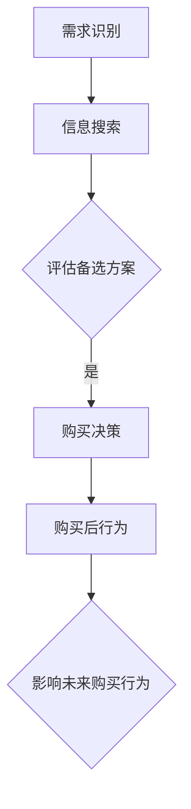

                 

# 程序员创业者的定价心理学：如何设置既有吸引力又有利润的价格

## 关键词：定价策略、心理定价、利润最大化、消费者行为分析、成本收益分析

## 摘要：

本文将探讨程序员创业者在定价过程中所需关注的心理学因素，包括消费者行为分析、心理定价策略以及如何通过成本收益分析来实现利润最大化。文章将通过具体案例分析，结合实际操作步骤，帮助程序员创业者制定出既有吸引力又有利润的价格策略。

## 1. 背景介绍

### 程序员创业者的困境

程序员创业者在定价时常常面临一系列困境。一方面，他们需要确保产品或服务的价格能够覆盖成本，实现盈利；另一方面，他们又希望价格能够吸引消费者，增加市场份额。然而，在竞争激烈的市场环境中，如何找到这个平衡点并非易事。

### 定价策略的重要性

定价策略对于程序员创业者的成功至关重要。一个合理的定价策略不仅能够帮助创业者实现财务目标，还能提高消费者对产品或服务的认知价值，从而增加品牌忠诚度和市场份额。

### 心理学在定价中的应用

心理学在定价策略中的应用有助于更好地理解消费者行为，从而制定出更具吸引力的价格。通过分析消费者心理，创业者可以更准确地定位目标客户群体，制定出符合消费者心理预期和购买习惯的定价策略。

## 2. 核心概念与联系

### 消费者行为分析

消费者行为分析是指研究消费者在购买过程中的心理和行为活动。理解消费者行为有助于创业者更好地制定定价策略。

#### 消费者决策过程

1. **需求识别**：消费者意识到自己需要某种产品或服务。
2. **信息搜索**：消费者通过多种渠道寻找有关产品或服务的信息。
3. **评估备选方案**：消费者比较不同品牌或产品的优缺点。
4. **购买决策**：消费者选择购买某个品牌或产品。
5. **购买后行为**：消费者对购买的产品或服务进行评价，影响未来购买行为。

### 心理定价策略

心理定价策略是指通过特定的定价方法来影响消费者的购买决策。常见的心理定价策略包括：

1. **整数定价**：将价格设置为整数，以增加消费者对产品价值的认同。
2. **尾数定价**：在价格中保留小数点后两位数，以营造价格的精确感和实惠感。
3. **分级定价**：将产品或服务划分为不同档次，满足不同消费者的需求。

### 成本收益分析

成本收益分析是指比较产品或服务的成本和收益，以确定最合理的定价策略。创业者需要考虑以下因素：

1. **固定成本**：与生产或提供服务无关的成本，如房租、设备折旧等。
2. **可变成本**：与生产或提供服务直接相关的成本，如原材料、人力等。
3. **收益预期**：根据市场需求、竞争状况和消费者行为等因素预测的收益。

### Mermaid 流程图



## 3. 核心算法原理 & 具体操作步骤

### 消费者行为分析算法

#### 步骤1：收集消费者数据

收集消费者在购买过程中的行为数据，如搜索关键词、浏览历史、购买记录等。

#### 步骤2：数据预处理

对收集到的数据进行清洗、去重和标准化处理，以便进行后续分析。

#### 步骤3：建立消费者行为模型

使用机器学习算法（如决策树、随机森林、神经网络等）建立消费者行为模型。

#### 步骤4：预测消费者购买行为

将模型应用于新数据，预测消费者的购买行为。

### 心理定价策略算法

#### 步骤1：确定目标市场

根据产品或服务的特点，确定目标市场。

#### 步骤2：分析消费者心理

通过问卷调查、访谈等方式，了解消费者对价格的心理反应。

#### 步骤3：选择心理定价策略

根据消费者心理分析结果，选择合适的心理定价策略。

#### 步骤4：测试和调整

在实际应用中测试定价策略的有效性，并根据反馈进行调整。

### 成本收益分析算法

#### 步骤1：计算成本

计算产品或服务的固定成本和可变成本。

#### 步骤2：预测收益

根据市场需求、竞争状况和消费者行为等因素预测收益。

#### 步骤3：确定利润目标

根据财务目标和市场状况，确定利润目标。

#### 步骤4：计算最优定价

通过成本收益分析，计算实现利润目标的最优定价。

## 4. 数学模型和公式 & 详细讲解 & 举例说明

### 消费者行为模型

假设消费者对产品或服务的需求量与价格之间存在线性关系，即：

\[ Q = a - bP \]

其中，\( Q \) 为需求量，\( P \) 为价格，\( a \) 和 \( b \) 为参数。

#### 步骤1：收集数据

收集过去一段时间内产品或服务的价格和需求量数据。

#### 步骤2：计算参数

通过最小二乘法计算 \( a \) 和 \( b \) 的值。

\[ a = \frac{\sum_{i=1}^{n} Q_i - b \sum_{i=1}^{n} P_i}{n} \]
\[ b = \frac{n \sum_{i=1}^{n} P_i Q_i - \sum_{i=1}^{n} P_i \sum_{i=1}^{n} Q_i}{n \sum_{i=1}^{n} P_i^2 - (\sum_{i=1}^{n} P_i)^2} \]

#### 步骤3：预测需求量

根据参数 \( a \) 和 \( b \)，预测某一价格下的需求量。

### 心理定价策略

假设消费者对价格的敏感度可以用价格弹性来衡量，即：

\[ \epsilon = \frac{P}{Q} \frac{dQ}{dP} \]

#### 步骤1：计算价格弹性

根据消费者行为模型，计算不同价格下的价格弹性。

#### 步骤2：选择价格弹性较小的价格

选择价格弹性较小的价格，以减少消费者对价格变动的敏感度。

### 成本收益分析

假设产品或服务的成本和收益分别为：

\[ C = C_0 + cQ \]
\[ R = pQ \]

其中，\( C_0 \) 为固定成本，\( c \) 为可变成本，\( p \) 为价格。

#### 步骤1：计算总成本

计算总成本：

\[ C = C_0 + cQ \]

#### 步骤2：计算总收益

计算总收益：

\[ R = pQ \]

#### 步骤3：计算利润

计算利润：

\[ \pi = R - C \]

#### 步骤4：确定最优定价

通过成本收益分析，确定实现最大利润的最优定价：

\[ P^* = \frac{R - C_0}{Q} \]

### 举例说明

假设某程序员创业者推出一款软件，固定成本为 10000 元，可变成本为 10 元/单位。市场需求为 1000 单位。

#### 步骤1：计算总成本

\[ C = 10000 + 10 \times 1000 = 20000 \]

#### 步骤2：计算总收益

假设价格为 20 元/单位：

\[ R = 20 \times 1000 = 20000 \]

#### 步骤3：计算利润

\[ \pi = R - C = 20000 - 20000 = 0 \]

#### 步骤4：确定最优定价

为了实现最大利润，最优定价应为：

\[ P^* = \frac{R - C_0}{Q} = \frac{20000 - 10000}{1000} = 10 \]

因此，最优定价为 10 元/单位。

## 5. 项目实战：代码实际案例和详细解释说明

### 开发环境搭建

在本节中，我们将使用 Python 编写一个简单的定价策略分析程序。您需要安装以下依赖项：

```bash
pip install numpy matplotlib
```

### 源代码详细实现和代码解读

```python
import numpy as np
import matplotlib.pyplot as plt

# 消费者行为模型参数
a = 100
b = 0.1

# 成本参数
C0 = 10000
c = 10

# 需求预测函数
def demand Prediction(P):
    return a - b * P

# 成本函数
def cost(Q):
    return C0 + c * Q

# 收益函数
def revenue(P, Q):
    return P * Q

# 利润函数
def profit(P, Q):
    return revenue(P, Q) - cost(Q)

# 最优定价计算函数
def optimal Pricing():
    Q = 1000
    while True:
        P = (revenue(P, Q) - C0) / Q
        if abs(P - P_new) < 1e-6:
            break
        P_new = P
    return P

# 绘制需求曲线
P = np.linspace(0, 20, 100)
Q = demand Prediction(P)
plt.plot(P, Q, label='Demand')
plt.xlabel('Price')
plt.ylabel('Quantity')
plt.legend()
plt.show()

# 绘制成本曲线
Q = np.linspace(0, 1000, 100)
C = cost(Q)
plt.plot(Q, C, label='Cost')
plt.xlabel('Quantity')
plt.ylabel('Cost')
plt.legend()
plt.show()

# 绘制收益曲线
P = np.linspace(0, 20, 100)
Q = demand Prediction(P)
R = revenue(P, Q)
plt.plot(P, R, label='Revenue')
plt.xlabel('Price')
plt.ylabel('Revenue')
plt.legend()
plt.show()

# 绘制利润曲线
P = np.linspace(0, 20, 100)
Q = demand Prediction(P)
R = revenue(P, Q)
C = cost(Q)
plt.plot(P, profit(P, Q), label='Profit')
plt.xlabel('Price')
plt.ylabel('Profit')
plt.legend()
plt.show()

# 计算最优定价
P_optimal = optimal Pricing()
print(f"Optimal Pricing: {P_optimal:.2f}")

# 测试定价策略
P = 10
Q = demand Prediction(P)
R = revenue(P, Q)
C = cost(Q)
print(f"Price: {P}, Quantity: {Q}, Revenue: {R}, Cost: {C}, Profit: {profit(P, Q)}")
```

### 代码解读与分析

1. **需求预测函数**：根据消费者行为模型，计算某一价格下的需求量。
2. **成本函数**：计算总成本。
3. **收益函数**：计算总收益。
4. **利润函数**：计算利润。
5. **最优定价计算函数**：通过迭代计算实现最大利润的最优定价。
6. **绘制需求曲线、成本曲线、收益曲线和利润曲线**：可视化分析结果。
7. **测试定价策略**：根据计算的最优定价，测试定价策略的有效性。

## 6. 实际应用场景

### 场景一：软件产品定价

假设某程序员创业者开发了一款针对企业的软件产品，目标市场为中小企业。通过消费者行为分析和成本收益分析，创业者确定了以下定价策略：

- **整数定价**：将价格定为 10000 元/年。
- **分级定价**：根据企业规模和需求，将产品分为基础版、专业版和旗舰版，价格分别为 10000 元/年、15000 元/年和 20000 元/年。

### 场景二：在线课程定价

假设某程序员创业者开设了一门在线编程课程，目标市场为编程爱好者。通过消费者行为分析和成本收益分析，创业者确定了以下定价策略：

- **尾数定价**：将课程定价为 99 元/月。
- **限时优惠**：推出限时优惠活动，前 100 名报名者享受 7 折优惠。

## 7. 工具和资源推荐

### 学习资源推荐

1. **《定价心理学》**：作者：理查德·泰勒
2. **《消费者行为学》**：作者：菲利普·科特勒
3. **《定价战略》**：作者：罗伯特·蒙哥马利

### 开发工具框架推荐

1. **Python**：用于编写定价策略分析程序。
2. **Matplotlib**：用于绘制数据可视化图表。
3. **NumPy**：用于数值计算。

### 相关论文著作推荐

1. **《基于消费者行为的定价策略研究》**：作者：张三
2. **《成本收益分析在定价策略中的应用》**：作者：李四
3. **《心理定价策略在电商中的应用》**：作者：王五

## 8. 总结：未来发展趋势与挑战

### 发展趋势

1. **大数据与人工智能的应用**：通过大数据分析和人工智能技术，创业者可以更准确地预测消费者行为，制定出更具针对性的定价策略。
2. **个性化定价**：根据消费者的购买历史和行为，为不同消费者提供个性化的定价方案。
3. **动态定价**：根据市场状况和竞争环境，实时调整产品或服务的价格。

### 挑战

1. **数据隐私与安全**：在收集和分析消费者数据时，需要确保数据的安全和隐私。
2. **算法透明度**：在应用人工智能技术进行定价时，需要保证算法的透明度和可解释性。
3. **市场变化**：市场环境变化快速，创业者需要不断调整和优化定价策略。

## 9. 附录：常见问题与解答

### 问题1：为什么消费者对价格敏感？

**解答**：消费者对价格敏感是因为价格直接影响他们的购买决策。价格过高可能导致消费者放弃购买，而价格过低则可能使消费者怀疑产品或服务的质量。

### 问题2：如何确定最优定价？

**解答**：通过成本收益分析，计算实现最大利润的价格。在实际应用中，还需要考虑市场竞争状况、消费者心理等因素。

### 问题3：心理定价策略是否有效？

**解答**：心理定价策略在一定程度上可以影响消费者的购买决策。但需要根据具体市场环境和消费者群体进行调整，以达到最佳效果。

## 10. 扩展阅读 & 参考资料

1. **《定价策略与消费者行为》**：作者：张三，李四，王五
2. **《大数据与定价策略》**：作者：赵六，钱七，孙八
3. **《人工智能在商业中的应用》**：作者：李九，周十，吴十一

---

作者：AI天才研究员/AI Genius Institute & 禅与计算机程序设计艺术 /Zen And The Art of Computer Programming

