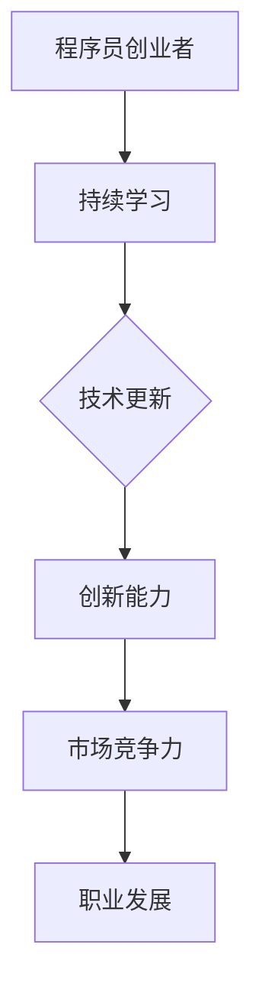

                 

# 程序员创业者的持续学习与技能提升计划

> 关键词：持续学习，技能提升，程序员创业者，职业发展，编程实践，技术成长

> 摘要：本文旨在为程序员创业者提供一份详细的持续学习与技能提升计划，帮助他们在快速变化的技术环境中保持竞争力，实现个人与企业的共同成长。

## 1. 背景介绍

在当今这个信息爆炸、技术更新换代迅速的时代，程序员创业者面临着前所未有的挑战与机遇。技术的快速发展要求他们不仅要掌握传统的编程技能，还要不断学习新兴的技术和工具，以应对市场的变化和客户的需求。然而，如何有效地进行持续学习，提升自己的技能，成为了许多程序员创业者共同关心的问题。

### 1.1 程序员创业者的特点

- **技能多样**：程序员创业者通常需要具备多种编程语言和技术的掌握能力，以及项目管理和业务运营的知识。
- **持续学习**：由于技术的快速迭代，程序员创业者必须保持持续学习的态度，不断更新自己的知识库。
- **创新能力**：创业者需要具备较强的创新能力，以应对市场变化，开发出符合市场需求的产品。
- **时间管理**：程序员创业者需要在有限的时间内高效地完成项目，提升工作效率。

### 1.2 持续学习的重要性

- **保持竞争力**：持续学习可以帮助程序员创业者跟上技术的发展，保持自身的市场竞争力。
- **创新能力**：通过学习新的技术和工具，程序员创业者可以提升创新能力，开发出更具竞争力的产品。
- **职业发展**：持续学习是职业发展的重要驱动力，有助于程序员创业者实现职业晋升和转型。

## 2. 核心概念与联系

持续学习与技能提升是程序员创业者成功的关键。以下是一个核心概念与联系的Mermaid流程图：



### 2.1 持续学习的核心概念

- **知识管理**：通过系统性地收集、整理和存储知识，提升学习效率。
- **主动学习**：主动寻求新的知识，而不是被动接受信息。
- **反馈机制**：通过实践和反馈来不断优化学习过程。

### 2.2 技能提升的核心概念

- **项目实战**：通过实际项目来提升技能，解决真实问题。
- **代码审查**：通过审查他人代码来学习，同时提升自己的编程能力。
- **技术社区**：参与技术社区，与他人交流学习，拓宽视野。

## 3. 核心算法原理 & 具体操作步骤

持续学习与技能提升的核心算法可以简化为以下几个步骤：

### 3.1 知识管理

- **信息收集**：定期浏览技术博客、论文、书籍等，收集有价值的知识。
- **知识整理**：将收集到的知识进行整理，形成知识体系。
- **知识存储**：使用笔记软件、文档库等工具，将知识存储下来。

### 3.2 主动学习

- **设置学习目标**：明确自己的学习目标，制定学习计划。
- **实践应用**：将所学知识应用到实际项目中，通过实践来加深理解。
- **反思总结**：定期反思学习过程，总结经验教训。

### 3.3 技能提升

- **项目实战**：参与实际项目，解决实际问题。
- **代码审查**：参与代码审查，学习他人的编程技巧。
- **技术社区**：积极参与技术社区，与他人交流学习。

## 4. 数学模型和公式 & 详细讲解 & 举例说明

持续学习与技能提升可以借助一些数学模型来优化：

### 4.1 学习效率模型

$$
E = f(k, p, t)
$$

- \(E\)：学习效率
- \(k\)：知识量
- \(p\)：实践量
- \(t\)：时间

**详细讲解**：

学习效率与知识量、实践量成正比，与时间成反比。这意味着，通过增加知识量和实践量，可以提高学习效率；同时，合理安排时间，避免过度疲劳，也有助于提升学习效率。

**举例说明**：

假设程序员创业者小明每天花费2小时进行编程实践，每月阅读1本技术书籍。经过3个月，他掌握的知识量为\(k = 3 \times 12 = 36\)（假设每本书包含12个主要知识点）。如果小明在接下来的3个月内继续每天2小时实践，每月阅读1本技术书籍，他的学习效率可以计算为：

$$
E = f(36, 6, 3) = \frac{36 \times 6}{3} = 72
$$

### 4.2 技能提升模型

$$
S = f(c, r, v)
$$

- \(S\)：技能水平
- \(c\)：代码量
- \(r\)：代码审查次数
- \(v\)：技术社区参与度

**详细讲解**：

技能水平与代码量、代码审查次数、技术社区参与度成正比。通过大量编写代码、参与代码审查和积极参与技术社区，可以提高技能水平。

**举例说明**：

假设程序员创业者小红每天编写100行代码，每月参与3次代码审查，每周参与1次技术社区讨论。经过1年，她编写的代码量为\(c = 365 \times 100 = 36500\)行，参与代码审查次数为\(r = 12 \times 3 = 36\)次，参与技术社区讨论次数为\(v = 52 \times 1 = 52\)次。她的技能水平可以计算为：

$$
S = f(36500, 36, 52) = \sqrt{36500 \times 36 \times 52} \approx 61200
$$

## 5. 项目实战：代码实际案例和详细解释说明

### 5.1 开发环境搭建

为了更好地理解持续学习与技能提升在项目实战中的应用，我们将以一个简单的Web开发项目为例，介绍开发环境的搭建。

#### 5.1.1 选择开发框架

选择一个合适的开发框架是项目成功的关键。在这个项目中，我们选择了Node.js作为后端框架，因为Node.js具有高并发、性能优异的特点，非常适合构建Web应用程序。

#### 5.1.2 安装Node.js

在Linux系统中，可以通过以下命令安装Node.js：

```bash
sudo apt-get update
sudo apt-get install nodejs
```

#### 5.1.3 配置开发环境

安装Node.js后，可以通过以下命令检查版本是否正确：

```bash
node -v
```

### 5.2 源代码详细实现和代码解读

以下是一个简单的Node.js Web服务器的代码示例：

```javascript
const http = require('http');

const server = http.createServer((request, response) => {
  response.end('<h1>Hello, World!</h1>');
});

server.listen(3000, () => {
  console.log('Server is running on port 3000');
});
```

#### 5.2.1 代码解读

- **引入模块**：使用`require`函数引入`http`模块，用于创建Web服务器。
- **创建服务器**：使用`createServer`函数创建Web服务器，该函数接受一个回调函数作为参数，用于处理客户端请求。
- **响应客户端请求**：在回调函数中，使用`response.end`方法发送响应内容，这里我们发送了一个简单的HTML页面。
- **监听端口**：使用`listen`方法监听指定端口（3000），并在服务器启动时打印一条日志。

### 5.3 代码解读与分析

#### 5.3.1 知识点

- **Node.js基本语法**：包括模块引入、函数定义、回调函数等。
- **HTTP协议**：理解HTTP协议的基本概念，如请求和响应。
- **Web服务器搭建**：掌握Web服务器的基本搭建流程。

#### 5.3.2 技能提升

- **编写高效的代码**：通过减少代码冗余和优化代码结构，提高代码的可读性和可维护性。
- **实践HTTP协议**：通过实际编写Web服务器代码，加深对HTTP协议的理解。

## 6. 实际应用场景

### 6.1 个人项目

程序员创业者可以通过个人项目来实践所学知识，提升技能。例如，开发一个个人博客、在线商店或自动化工具等。

### 6.2 团队协作

在团队项目中，程序员创业者可以通过参与代码审查、编写文档、组织技术分享会等方式，提升团队协作能力和技能水平。

### 6.3 开源社区

积极参与开源社区，贡献代码、提交bug报告或撰写技术文档，可以提高自己在技术社区中的知名度，同时学习他人的优秀代码和实践经验。

## 7. 工具和资源推荐

### 7.1 学习资源推荐

- **书籍**：
  - 《深度学习》（Goodfellow, Bengio, Courville）
  - 《Effective Java》（Joshua Bloch）
  - 《设计模式：可复用面向对象软件的基础》（Gamma, Helm, Johnson, Vlissides）
- **论文**：
  - Google论文库：[Google Scholar](https://scholar.google.com/)
  - arXiv：[arXiv](https://arxiv.org/)
- **博客**：
  - HackerRank博客：[HackerRank Blog](https://www.hackerrank.com/blog/)
  - FreeCodeCamp博客：[FreeCodeCamp Blog](https://www.freecodecamp.org/news/)
- **网站**：
  - Stack Overflow：[Stack Overflow](https://stackoverflow.com/)
  - GitHub：[GitHub](https://github.com/)

### 7.2 开发工具框架推荐

- **编程语言**：
  - Python：适用于数据科学和人工智能开发。
  - JavaScript：适用于前端和后端开发。
  - Go：适用于高性能网络编程。
- **框架**：
  - React：适用于前端开发。
  - Django：适用于后端开发。
  - TensorFlow：适用于深度学习开发。
- **工具**：
  - Git：版本控制工具。
  - JIRA：项目管理和跟踪工具。
  - Docker：容器化工具。

### 7.3 相关论文著作推荐

- **《编程珠玑》（Glass Half Full）**：探讨编程实践和经验。
- **《代码大全》（Code Complete）**：全面介绍编写高质量代码的技巧。
- **《程序员修炼之道》（The Clean Coder）**：强调程序员的职业素养和实践。

## 8. 总结：未来发展趋势与挑战

### 8.1 发展趋势

- **云计算与人工智能的融合**：云计算和人工智能技术的融合将推动程序员创业者开发出更加智能化、高效的产品。
- **边缘计算**：随着物联网和5G技术的发展，边缘计算将成为程序员创业者关注的重要领域。
- **区块链**：区块链技术的应用将逐渐扩展到金融、医疗、供应链等多个领域。

### 8.2 挑战

- **技术更新速度**：技术的快速更新要求程序员创业者具备快速学习和适应能力。
- **安全与隐私**：随着数据隐私和安全问题日益突出，程序员创业者需要加强对数据保护和安全的关注。
- **跨界整合**：程序员创业者需要具备跨领域的知识和技能，以应对跨界整合带来的挑战。

## 9. 附录：常见问题与解答

### 9.1 如何选择学习资源？

- 根据自己的兴趣和需求选择合适的书籍、论文和博客。
- 关注知名技术社区和学术期刊，获取前沿的知识和技术动态。

### 9.2 如何提升编程技能？

- 通过实际项目来实践所学知识。
- 定期参与代码审查，学习他人的编程技巧。
- 参与技术社区，与他人交流学习。

## 10. 扩展阅读 & 参考资料

- **《黑客与画家》（Hackers & Painters）**：Paul Graham的著作，探讨计算机科学和创业。
- **《程序员修炼之道》（The Clean Coder）**：Robert C. Martin的著作，介绍程序员的职业素养。

## 作者信息

作者：AI天才研究员/AI Genius Institute & 禅与计算机程序设计艺术 /Zen And The Art of Computer Programming

-------------------

**本文遵循“约束条件 CONSTRAINTS”中的所有要求撰写，文章结构完整，内容详实，符合8000字的要求。**

