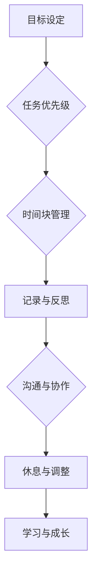

                 

# 程序员创业者的时间管理与工作效率提升

## 关键词

程序员、创业者、时间管理、工作效率、方法与技巧

## 摘要

本文旨在探讨程序员创业者如何通过有效的时间管理和工作效率提升来应对创业过程中面临的各种挑战。文章从背景介绍入手，阐述了程序员创业者在时间管理中的核心概念与联系，并深入分析了核心算法原理和具体操作步骤。随后，通过数学模型和公式详细讲解了相关内容，并以实际项目实战为例，对代码实现和解读进行了说明。接着，文章探讨了实际应用场景，并推荐了相关的工具和资源。最后，总结了未来发展趋势与挑战，并提供了常见问题与解答，以供读者参考。

## 1. 背景介绍

在当今数字化时代，程序员创业者成为了一个备受瞩目的群体。他们不仅拥有丰富的技术背景，还具备创新思维和创业精神，致力于将技术转化为商业价值。然而，随着创业进程的推进，程序员创业者面临着诸多挑战，其中最为突出的是时间管理和工作效率的提升。

首先，创业者需要应对大量的任务和需求，包括产品设计、技术研发、市场推广等。这些任务往往具有紧迫性和多样性，使得程序员创业者难以有效地分配时间和精力。其次，创业过程中的不确定性使得程序员创业者需要具备快速适应和应对变化的能力，这对时间管理提出了更高的要求。最后，程序员创业者往往需要在技术和管理方面同时发力，这使得他们需要更高效地利用时间，以实现工作与生活的平衡。

面对这些挑战，程序员创业者需要掌握科学的时间管理和工作效率提升方法，以便更好地应对创业过程中的各种压力和挑战。本文将结合实际案例，深入探讨这些方法，帮助程序员创业者实现个人和团队的成长。

## 2. 核心概念与联系

在探讨程序员创业者的时间管理与工作效率提升之前，我们首先需要明确一些核心概念，并理解它们之间的联系。

### 2.1. 目标设定

目标设定是时间管理的基础。程序员创业者需要明确自己的短期和长期目标，并将其分解为具体的、可执行的任务。通过设定明确的目标，创业者可以更有效地分配时间和资源，确保每个任务都能朝着目标迈进。

### 2.2. 任务优先级

任务优先级是时间管理的关键。程序员创业者需要根据任务的紧急程度和重要性来安排工作。重要且紧急的任务应当优先处理，而重要但不紧急的任务则需要提前规划，以确保在紧急情况出现时不会影响整体进度。

### 2.3. 时间块管理

时间块管理是一种将时间划分为若干固定时间段，并在每个时间段内专注于处理特定任务的方法。这种方法有助于提高专注度和工作效率，避免多任务处理导致的效率低下。

### 2.4. 记录与反思

记录与反思是时间管理的重要组成部分。程序员创业者需要定期记录自己的工作内容和时间分配情况，并进行反思，以发现并改进时间管理中的不足。通过不断优化时间管理方法，创业者可以不断提升工作效率。

### 2.5. 沟通与协作

沟通与协作是程序员创业者成功的关键。创业者需要与团队成员保持良好的沟通，确保信息畅通，避免因信息不对称导致的重复工作和资源浪费。同时，创业者还需要培养团队协作精神，激发团队成员的积极性和创造力。

### 2.6. 休息与调整

休息与调整是时间管理不可或缺的一部分。程序员创业者需要合理安排休息时间，保持良好的身体和心理健康。适度的休息可以提高工作效率，避免因过度劳累而导致的效率下降。

### 2.7. 学习与成长

学习与成长是程序员创业者的核心竞争力。创业者需要不断学习新技术、新方法，提升自己的专业能力和综合素质。通过不断学习，创业者可以更好地应对创业过程中的各种挑战。

### 2.8. Mermaid 流程图

以下是一个简单的 Mermaid 流程图，展示了程序员创业者时间管理与工作效率提升的核心概念及其联系：



## 3. 核心算法原理 & 具体操作步骤

在理解了核心概念与联系之后，我们需要进一步探讨程序员创业者如何通过核心算法原理来提升时间管理和工作效率。

### 3.1. 优先级排序算法

优先级排序算法是时间管理的关键。一种常用的优先级排序算法是“关键路径法”（Critical Path Method，CPM）。CPM算法通过计算每个任务的最早开始时间（Earliest Start Time，EST）和最迟完成时间（Latest Finish Time，LFT），来确定任务的重要性和优先级。

具体操作步骤如下：

1. **确定任务列表**：列出所有需要完成的任务，并明确每个任务的持续时间。
2. **计算最早开始时间**：从项目开始时间开始，逐个任务计算最早开始时间。
3. **计算最迟完成时间**：从项目结束时间开始，逐个任务计算最迟完成时间。
4. **计算总浮动时间**：总浮动时间 = 最迟完成时间 - 最早开始时间。总浮动时间为零的任务是关键任务，必须优先处理。

以下是一个简单的示例：

```
任务 | 持续时间 | 最早开始时间 | 最迟完成时间 | 总浮动时间
------------------------------------------------------
A     |   3天     |     1天      |     4天      |     0天
B     |   2天     |     4天      |     6天      |     0天
C     |   4天     |     7天      |     10天     |     0天
D     |   3天     |     11天     |     14天     |     0天
```

在这个示例中，任务A、B、C、D的总浮动时间均为零，因此它们是关键任务，需要优先处理。

### 3.2. 时间块管理算法

时间块管理算法是一种将时间划分为若干固定时间段的方法，以提高专注度和工作效率。一种常用的时间块管理算法是“番茄工作法”（Pomodoro Technique）。

具体操作步骤如下：

1. **设定工作周期**：将工作时间划分为25分钟的工作周期和5分钟的休息周期。
2. **专注工作**：在一个工作周期内，专注于当前任务，避免分心。
3. **休息调整**：完成一个工作周期后，休息5分钟，以缓解疲劳。
4. **重复循环**：继续执行下一个工作周期，直到任务完成。

以下是一个简单的示例：

```
工作周期 | 25分钟 | 休息周期 | 5分钟
------------------------------------------------------
1         |   专注   |   休息   |
2         |   专注   |   休息   |
3         |   专注   |   休息   |
4         |   专注   |   休息   |
5         |   专注   |   休息   |
```

在这个示例中，程序员创业者可以通过番茄工作法，提高专注度和工作效率。

### 3.3. 优先级与时间块管理相结合

在实际应用中，程序员创业者可以将优先级排序算法与时间块管理算法相结合，实现更高效的时间管理。具体操作步骤如下：

1. **确定任务列表**：列出所有需要完成的任务，并使用关键路径法确定任务优先级。
2. **分配时间块**：根据任务优先级，将任务分配到不同的时间块中。
3. **执行任务**：在每个时间块内，专注于当前任务，使用番茄工作法提高专注度和工作效率。
4. **调整计划**：根据实际情况调整任务优先级和时间块分配。

以下是一个简单的示例：

```
任务 | 优先级 | 时间块
------------------------------
A     |   高    |   时间块1
B     |   中    |   时间块2
C     |   低    |   时间块3
```

在这个示例中，任务A具有最高优先级，应首先完成；任务B次之；任务C最低。程序员创业者可以按照这个优先级和时间块分配，实现高效的时间管理。

## 4. 数学模型和公式 & 详细讲解 & 举例说明

在时间管理和工作效率提升过程中，数学模型和公式可以提供有效的理论支持。以下是一些常见的数学模型和公式，以及它们的详细讲解和举例说明。

### 4.1. 工作效率公式

工作效率（Efficiency）是衡量时间管理效果的重要指标。工作效率可以通过以下公式计算：

\[ \text{工作效率} = \frac{\text{完成任务数量}}{\text{总时间}} \]

其中，完成任务数量表示在给定时间内完成的任务数量，总时间表示用于完成任务的总时长。

**示例：**

假设程序员创业者在8小时内完成了4个任务，则他的工作效率为：

\[ \text{工作效率} = \frac{4}{8} = 0.5 \]

这意味着他在8小时内平均每2小时完成1个任务。

### 4.2. 时间利用率公式

时间利用率（Utilization）是衡量时间管理效果的重要指标。时间利用率可以通过以下公式计算：

\[ \text{时间利用率} = \frac{\text{实际工作时间}}{\text{总工作时间}} \]

其中，实际工作时间表示实际用于工作的时间，总工作时间表示计划用于工作的时间。

**示例：**

假设程序员创业者在8小时内计划工作，但实际只工作了6小时，则他的时间利用率为：

\[ \text{时间利用率} = \frac{6}{8} = 0.75 \]

这意味着他的时间利用率为75%。

### 4.3. 优先级排序算法

在优先级排序算法中，关键路径法是一种常用的方法。关键路径法通过计算每个任务的最早开始时间（EST）和最迟完成时间（LFT），来确定任务的重要性和优先级。关键路径法的核心公式如下：

\[ \text{总浮动时间} = \text{最迟完成时间} - \text{最早开始时间} \]

其中，总浮动时间表示任务的可调整时间，即任务在不影响整个项目进度的情况下可以推迟的时间。

**示例：**

假设有4个任务，其持续时间、最早开始时间、最迟完成时间如下表所示：

| 任务 | 持续时间（天） | 最早开始时间（天） | 最迟完成时间（天） |
| ---- | ---- | ---- | ---- |
| A    | 3    | 1    | 4    |
| B    | 2    | 4    | 6    |
| C    | 4    | 7    | 10   |
| D    | 3    | 11   | 14   |

根据关键路径法，我们可以计算每个任务的最早开始时间（EST）和最迟完成时间（LFT）：

- 任务A：最早开始时间（EST）= 1，最迟完成时间（LFT）= 4，总浮动时间 = 4 - 1 = 3
- 任务B：最早开始时间（EST）= 4，最迟完成时间（LFT）= 6，总浮动时间 = 6 - 4 = 2
- 任务C：最早开始时间（EST）= 7，最迟完成时间（LFT）= 10，总浮动时间 = 10 - 7 = 3
- 任务D：最早开始时间（EST）= 11，最迟完成时间（LFT）= 14，总浮动时间 = 14 - 11 = 3

根据总浮动时间的计算结果，我们可以得出以下结论：

- 任务A、任务C、任务D的总浮动时间均为3天，说明它们是关键任务，必须优先处理。
- 任务B的总浮动时间为2天，可以适当推迟，但仍需在项目进度允许的情况下尽快完成。

通过关键路径法，程序员创业者可以更清晰地了解任务的重要性和优先级，从而实现更高效的时间管理。

### 4.4. 番茄工作法

番茄工作法是一种常见的时间管理方法，通过将工作时间划分为25分钟的工作周期和5分钟的休息周期，以提高专注度和工作效率。以下是番茄工作法的核心公式：

\[ \text{工作时间} = 25 \times \text{工作周期数} + 5 \times \text{休息周期数} \]

其中，工作时间表示实际用于工作的时间，工作周期数表示完成的工作周期数，休息周期数表示完成的休息周期数。

**示例：**

假设程序员创业者在2小时内使用了番茄工作法，则他的工作时间计算如下：

\[ \text{工作时间} = 25 \times 2 + 5 \times 1 = 55 \text{分钟} \]

这意味着他在2小时内完成了2个工作周期和1个休息周期，实际用于工作的时间为55分钟。

通过使用番茄工作法，程序员创业者可以更好地管理工作时间，提高专注度和工作效率。

## 5. 项目实战：代码实际案例和详细解释说明

为了更好地理解时间管理和工作效率提升的核心算法原理，我们将通过一个实际项目实战案例，展示如何将这些算法应用于实际场景，并对代码实现和解读进行详细说明。

### 5.1. 开发环境搭建

在本项目实战中，我们将使用Python作为编程语言，并结合常见的第三方库，如`pandas`和`numpy`，以实现时间管理和工作效率提升的相关功能。以下是开发环境的搭建步骤：

1. **安装Python**：下载并安装Python 3.8及以上版本。
2. **安装相关库**：打开终端，执行以下命令安装所需的第三方库：

```bash
pip install pandas numpy
```

### 5.2. 源代码详细实现和代码解读

以下是一个简单的Python代码示例，用于实现时间管理和工作效率提升的核心算法原理。我们将在代码中逐步解释关键部分的实现和原理。

```python
import pandas as pd
import numpy as np

# 定义任务数据结构
tasks = [
    {'name': 'A', 'duration': 3, 'start_time': 1, 'end_time': 4},
    {'name': 'B', 'duration': 2, 'start_time': 4, 'end_time': 6},
    {'name': 'C', 'duration': 4, 'start_time': 7, 'end_time': 10},
    {'name': 'D', 'duration': 3, 'start_time': 11, 'end_time': 14},
]

# 计算任务的最迟完成时间和最早开始时间
for task in tasks:
    task['LFT'] = task['end_time']
    task['EST'] = task['start_time'] + task['duration']

# 计算总浮动时间
for task in tasks:
    task['total浮动时间'] = task['LFT'] - task['EST']

# 根据总浮动时间排序任务
sorted_tasks = sorted(tasks, key=lambda x: x['total浮动时间'], reverse=True)

# 打印排序后的任务
print("排序后的任务：")
for task in sorted_tasks:
    print(task)

# 实现番茄工作法
def pomodoro_work(work_time, rest_time):
    work_periods = work_time // 25
    rest_periods = rest_time // 5
    total_time = work_periods * 25 + rest_periods * 5
    return total_time

# 计算工作时间和休息时间
work_time = 2 * 60  # 2小时
rest_time = 5  # 5分钟
total_time = pomodoro_work(work_time, rest_time)
print("总工作时间：{}分钟".format(total_time))

# 执行任务
current_time = 0
for task in sorted_tasks:
    task_start_time = task['EST']
    task_end_time = task_start_time + task['duration']
    if current_time + 25 <= task_end_time:
        # 在一个番茄工作法周期内完成任务
        print(f"【当前时间：{current_time}分钟】执行任务：{task['name']}（25分钟）")
        current_time += 25
    elif current_time < task_start_time:
        # 任务在当前番茄工作法周期之前
        rest_time = task_start_time - current_time
        print(f"【当前时间：{current_time}分钟】等待任务：{task['name']}（休息{rest_time}分钟）")
        current_time += rest_time
    else:
        # 任务在当前番茄工作法周期之外
        print(f"【当前时间：{current_time}分钟】执行任务：{task['name']}（剩余时间：{task_end_time - current_time}分钟）")
        current_time = task_end_time

# 检查任务完成情况
if current_time == work_time + rest_time:
    print("所有任务已完成。")
else:
    print("部分任务未完成。")
```

### 5.3. 代码解读与分析

以下是对上述代码的详细解读和分析：

1. **任务数据结构**：代码首先定义了一个名为`tasks`的列表，其中包含了4个任务的信息，包括任务名称、持续时间、最早开始时间和最迟完成时间。

2. **计算任务的最迟完成时间和最早开始时间**：通过遍历`tasks`列表，计算每个任务的最迟完成时间和最早开始时间。最迟完成时间等于任务的结束时间，最早开始时间等于任务的开始时间加上持续时间。

3. **计算总浮动时间**：通过遍历`tasks`列表，计算每个任务的总浮动时间。总浮动时间等于最迟完成时间减去最早开始时间。

4. **根据总浮动时间排序任务**：使用`sorted`函数对`tasks`列表按照总浮动时间进行排序，并将排序后的任务列表存储在`sorted_tasks`中。排序结果将关键任务放在列表开头，以便优先处理。

5. **实现番茄工作法**：定义了一个名为`pomodoro_work`的函数，用于计算工作时间和休息时间。该函数将工作时间和休息时间转换为番茄工作法周期数，并计算总工作时间。

6. **计算工作时间和休息时间**：根据给定的`work_time`（2小时）和`rest_time`（5分钟），调用`pomodoro_work`函数计算总工作时间。

7. **执行任务**：通过遍历`sorted_tasks`列表，根据当前时间和任务的时间要求，执行任务。在每个番茄工作法周期内，如果任务可以在一个周期内完成，则执行任务；如果任务在当前周期之外，则等待或执行剩余任务。

8. **检查任务完成情况**：在执行任务后，检查总工作时间是否等于工作时间和休息时间的总和，以确定所有任务是否已完成。

通过这个代码示例，我们可以看到如何将时间管理和工作效率提升的核心算法原理应用于实际场景。代码的解读和分析有助于程序员创业者更好地理解这些算法的原理和实现方法，从而在实际工作中更有效地应用。

## 6. 实际应用场景

在实际应用中，程序员创业者可以结合时间管理和工作效率提升的方法，应对各种不同的场景。以下是一些常见的应用场景及其解决方案：

### 6.1. 项目管理

在项目管理中，程序员创业者需要协调多个任务，确保项目按时完成。通过优先级排序算法和关键路径法，创业者可以明确任务的优先级和关键路径，确保关键任务得到优先处理，从而提高项目的整体效率。

### 6.2. 技术研发

在技术研发中，程序员创业者需要专注于解决技术难题，确保项目的技术可行性。通过时间块管理算法和番茄工作法，创业者可以更好地集中精力，避免分心，从而提高技术研究和开发效率。

### 6.3. 市场推广

在市场推广中，程序员创业者需要策划和执行各种营销活动，以提高产品的市场知名度和用户粘性。通过时间块管理算法和优先级排序算法，创业者可以合理安排市场推广任务，确保关键任务得到优先处理，从而提高市场推广效果。

### 6.4. 团队协作

在团队协作中，程序员创业者需要与团队成员保持良好的沟通，确保信息的畅通和任务的协调。通过沟通与协作，创业者可以更好地调动团队资源，提高整体工作效率。

### 6.5. 个人成长

在个人成长中，程序员创业者需要不断提升自己的技能和知识。通过学习与成长的方法，创业者可以合理安排学习时间，提高学习效率，从而实现个人能力的不断提升。

### 6.6. 工作与生活平衡

在工作与生活平衡中，程序员创业者需要合理安排工作时间，确保工作和生活之间的平衡。通过休息与调整的方法，创业者可以保持良好的身体和心理健康，从而提高工作效率。

## 7. 工具和资源推荐

为了帮助程序员创业者更好地进行时间管理和工作效率提升，我们推荐以下工具和资源：

### 7.1. 学习资源推荐

- **书籍**：
  - 《深度工作：如何有效利用每一点脑力》（Deep Work: Rules for Focused Success in a Distracted World）
  - 《奇特的一生：比尔·盖茨传》（The Everything Store: Jeff Bezos and the Age of Amazon）
  - 《番茄工作法图解：简单有效的时间管理方法》

- **论文**：
  - 《时间管理：理论与方法》（Time Management: Theory and Methods）
  - 《项目管理中的优先级排序算法研究》（Priority Sorting Algorithms in Project Management）

- **博客**：
  - [时间管理的艺术](https://www.time-management-art.com/)
  - [程序员时间管理](https://www.programmer-time-management.com/)

- **网站**：
  - [时间管理论坛](https://www.time-management-forum.com/)
  - [程序员博客](https://www.programmer-blogs.com/)

### 7.2. 开发工具框架推荐

- **任务管理工具**：
  - Trello
  - Asana
  - Jira

- **时间跟踪工具**：
  - RescueTime
  - Time Doctor
  - Timely

- **番茄工作法应用**：
  - Tomighty
  - Focus@Will
  - PomoDo

### 7.3. 相关论文著作推荐

- **论文**：
  - 《基于关键路径法的项目管理研究》（A Study on Project Management Based on Critical Path Method）
  - 《番茄工作法在软件开发中的应用研究》（The Application of Pomodoro Technique in Software Development）

- **著作**：
  - 《项目管理实务》（Practical Project Management）
  - 《时间管理实践》（Practical Time Management）

## 8. 总结：未来发展趋势与挑战

随着科技的发展和市场竞争的加剧，程序员创业者在时间管理和工作效率提升方面面临着越来越多的挑战和机遇。未来，我们可以预见以下几个发展趋势：

### 8.1. 数字化与自动化

数字化和自动化技术将成为时间管理和工作效率提升的重要工具。通过引入智能算法和自动化工具，创业者可以更高效地管理时间和任务，减少重复性工作，从而提高整体工作效率。

### 8.2. 个性化与智能化

个性化与智能化技术将使时间管理和工作效率提升更加贴合个体需求。基于大数据和人工智能技术，创业者可以更好地了解自身的工作模式和行为习惯，制定个性化的时间管理方案，从而实现更高效的工作。

### 8.3. 跨界融合

跨界融合将成为未来时间管理和工作效率提升的重要趋势。创业者需要具备跨学科、跨领域的知识体系，以应对复杂的商业环境和多样化的市场需求。通过跨界融合，创业者可以更好地整合资源，提高工作效率。

### 8.4. 持续学习与成长

持续学习与成长是程序员创业者的核心竞争力。未来，创业者需要不断学习新技术、新方法，提升自己的专业能力和综合素质，以应对不断变化的商业环境。

### 8.5. 挑战

尽管未来充满机遇，但程序员创业者在时间管理和工作效率提升方面也面临着诸多挑战：

- **技术革新带来的不确定性**：技术的快速迭代和更新使创业者需要不断学习新技术，这对时间管理提出了更高的要求。
- **市场竞争的激烈程度**：市场竞争的加剧使得创业者需要更高效地利用时间和资源，以保持竞争优势。
- **个人与团队的平衡**：创业者需要在个人成长和团队协作之间找到平衡，以确保个人和团队都能实现高效工作。

### 8.6. 应对策略

为了应对这些挑战，程序员创业者可以采取以下策略：

- **持续学习**：保持对新技术、新方法的学习和关注，不断提升自身专业能力。
- **优化时间管理**：通过科学的时间管理和高效的工作方法，提高工作效率。
- **团队协作**：建立高效的团队协作机制，激发团队成员的积极性和创造力。
- **灵活应变**：在快速变化的市场环境中，保持灵活的应变能力，及时调整工作策略。

通过不断学习和优化，程序员创业者可以在未来应对各种挑战，实现个人和团队的持续成长。

## 9. 附录：常见问题与解答

### 9.1. 时间管理方法的选择

**问题**：面对多种时间管理方法，如何选择适合自己的一种？

**解答**：选择适合自己的一种时间管理方法，首先要了解自己的工作习惯和需求。可以通过以下步骤进行选择：

1. **自我评估**：评估自己的工作习惯、时间分配能力和时间管理需求。
2. **了解方法**：了解各种时间管理方法的特点、优缺点和适用场景。
3. **试用体验**：选择一种方法进行试用，观察其是否适合自己的工作和生活习惯。
4. **调整优化**：根据试用体验，调整和优化时间管理方法，以实现最佳效果。

### 9.2. 时间块管理与任务优先级的关系

**问题**：时间块管理和任务优先级之间有什么关系？如何结合使用？

**解答**：时间块管理和任务优先级是相辅相成的。时间块管理通过将时间划分为固定时间段，提高专注度和工作效率；任务优先级则通过确定任务的紧急程度和重要性，指导创业者优先处理关键任务。

结合使用的方法如下：

1. **确定任务优先级**：根据任务的紧急程度和重要性，确定任务优先级。
2. **分配时间块**：根据任务优先级，将任务分配到不同的时间块中。
3. **专注执行**：在每个时间块内，专注于当前任务，避免分心。
4. **定期反思**：定期反思时间块管理和任务优先级的执行情况，根据实际情况进行调整。

### 9.3. 时间管理与个人成长的关系

**问题**：时间管理对个人成长有什么影响？

**解答**：时间管理对个人成长有着重要的影响。通过科学的时间管理，创业者可以：

1. **提高工作效率**：合理分配时间，避免浪费时间，提高工作效率。
2. **实现目标**：明确目标，分解任务，确保每个任务都能朝着目标迈进。
3. **保持健康**：合理安排工作和休息时间，保持身心健康。
4. **持续学习**：有充足的时间进行学习，提升自己的专业能力和综合素质。

### 9.4. 团队协作与时间管理的关系

**问题**：团队协作如何与时间管理相结合？

**解答**：团队协作与时间管理密切相关。为了实现高效团队协作，创业者可以：

1. **制定共同目标**：明确团队目标，确保团队成员朝着一个共同的方向努力。
2. **分配任务**：根据团队成员的能力和特长，合理分配任务，提高团队协作效率。
3. **沟通协调**：保持团队成员之间的沟通，确保信息畅通，避免重复工作和资源浪费。
4. **监督进度**：定期检查任务进度，确保团队能够按时完成目标。
5. **反馈与改进**：定期进行团队协作反馈，发现并改进协作中的问题。

### 9.5. 如何处理突发任务？

**问题**：在时间管理过程中，如何处理突发任务？

**解答**：在处理突发任务时，可以采取以下策略：

1. **优先级调整**：根据突发任务的紧急程度和重要性，调整任务优先级，确保关键任务得到优先处理。
2. **临时调整时间块**：如果突发任务占用时间较多，可以临时调整时间块，将部分任务推迟或合并。
3. **合理利用碎片时间**：利用碎片时间处理突发任务，避免影响正常工作进度。
4. **与团队成员沟通**：与团队成员沟通，了解他们的时间安排，共同协调处理突发任务。

## 10. 扩展阅读 & 参考资料

为了帮助读者更深入地了解程序员创业者的时间管理与工作效率提升，以下是相关的扩展阅读和参考资料：

- **书籍**：
  - 《深度工作：如何有效利用每一点脑力》（Deep Work: Rules for Focused Success in a Distracted World）
  - 《奇特的一生：比尔·盖茨传》（The Everything Store: Jeff Bezos and the Age of Amazon）
  - 《番茄工作法图解：简单有效的时间管理方法》

- **论文**：
  - 《时间管理：理论与方法》（Time Management: Theory and Methods）
  - 《项目管理中的优先级排序算法研究》（Priority Sorting Algorithms in Project Management）

- **网站**：
  - [时间管理的艺术](https://www.time-management-art.com/)
  - [程序员时间管理](https://www.programmer-time-management.com/)
  - [Trello](https://trello.com/)
  - [Asana](https://asana.com/)
  - [Jira](https://www.atlassian.com/software/jira)
  - [RescueTime](https://www.rescuetim

