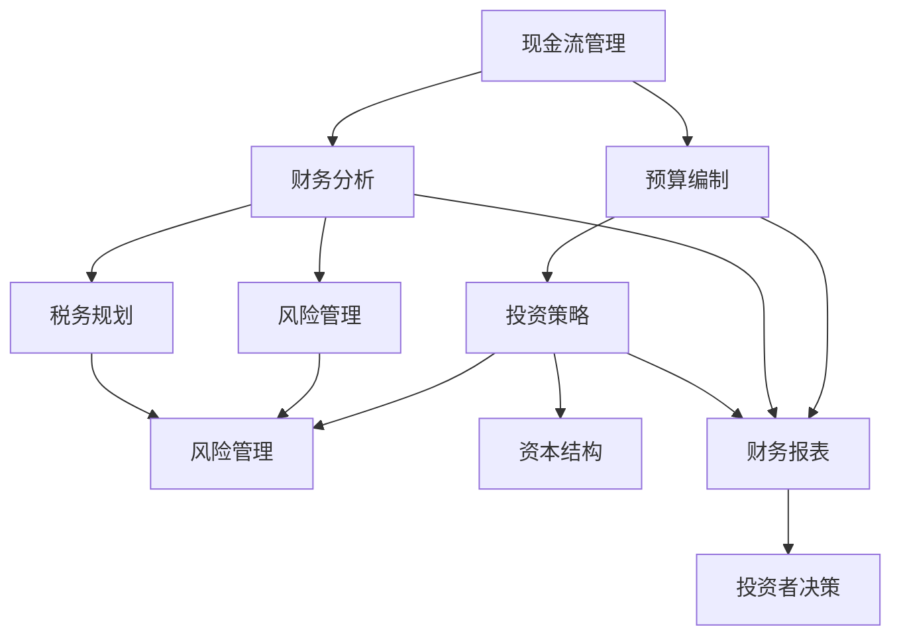

                 

### 背景介绍 Background Introduction

程序员创业者，是近年来科技领域的一个热门话题。随着互联网和移动互联网的飞速发展，越来越多的程序员选择跳出传统的职场轨道，成为创业者。然而，创业并非易事，特别是在财务规划和投资策略方面，许多程序员创业者面临着巨大的挑战。

本文旨在为程序员创业者提供一套全面的财务规划和投资策略，帮助他们更好地管理个人和公司的财务，做出明智的投资决策，从而提高创业成功率。文章将分为以下几个部分进行详细阐述：

1. **核心概念与联系**：介绍财务规划和投资策略中的核心概念，并通过Mermaid流程图展示它们之间的联系。
2. **核心算法原理 & 具体操作步骤**：详细讲解如何制定财务规划和投资策略的具体步骤。
3. **数学模型和公式 & 详细讲解 & 举例说明**：运用数学模型和公式，对财务规划和投资策略进行深入分析，并通过实例进行说明。
4. **项目实战：代码实际案例和详细解释说明**：通过一个实际的项目案例，展示如何将理论转化为实践。
5. **实际应用场景**：探讨财务规划和投资策略在程序员创业中的实际应用。
6. **工具和资源推荐**：推荐一些有助于程序员创业者进行财务规划和投资的学习资源和工具。
7. **总结：未来发展趋势与挑战**：分析财务规划和投资策略的未来发展趋势以及程序员创业者可能面临的挑战。
8. **附录：常见问题与解答**：回答程序员创业者在财务规划和投资策略中可能遇到的问题。

让我们首先从财务规划和投资策略的核心概念入手，逐步深入探讨这一主题。在接下来的部分，我们将一步步分析和推理，确保您对这一重要议题有全面、深入的理解。

---

#### 核心概念与联系 Core Concepts and Connections

在讨论程序员创业者的财务规划和投资策略之前，我们需要明确几个核心概念。这些概念不仅是财务管理和投资决策的基础，也是理解和执行这些策略的关键。以下是本文将涉及的一些核心概念，以及它们之间的相互联系：

1. **现金流管理**：现金流管理是指确保公司有足够的流动资金来支付日常运营费用和债务。对于创业者来说，现金流管理尤为重要，因为它直接影响公司的生存和发展。

2. **预算编制**：预算编制是预测公司未来一段时间内的收入和支出，制定详细的财务计划。一个好的预算可以帮助创业者更好地控制成本，确保公司财务健康。

3. **财务分析**：财务分析是通过评估公司的财务报表，分析公司的盈利能力、流动性和财务稳定性。创业者可以通过财务分析了解公司的财务状况，从而做出明智的决策。

4. **投资策略**：投资策略是指如何分配公司的资金以实现长期增长和回报。投资者需要考虑多个因素，如市场趋势、风险承受能力、资金来源等。

5. **风险管理**：风险管理是指识别、评估和管理公司面临的各种风险，包括市场风险、信用风险、操作风险等。有效的风险管理可以帮助公司降低潜在损失。

6. **税务规划**：税务规划是指合法地减少公司税负，优化税务结构。对于创业者来说，合理的税务规划可以显著提高公司的盈利能力。

7. **资本结构**：资本结构是指公司债务和股权融资的比例。合理的资本结构可以降低融资成本，提高公司的财务灵活性。

这些核心概念之间的联系构成了财务规划和投资策略的基础。以下是使用Mermaid流程图展示这些概念之间的相互联系：



通过这个流程图，我们可以看到，现金流管理和预算编制是财务规划的基础，它们直接影响财务分析。财务分析的结果进一步影响了投资策略、风险管理和税务规划。最后，这些因素共同作用于公司的财务报表，为投资者决策提供依据。

在接下来的部分，我们将深入探讨每个核心概念的具体内容和操作步骤，帮助程序员创业者更好地理解和应用这些概念。通过逐步分析和推理，我们将确保您对财务规划和投资策略有全面、深入的理解。

---

#### 核心算法原理 & 具体操作步骤 Core Algorithm Principles & Operational Steps

在明确了财务规划和投资策略的核心概念后，我们需要进一步了解如何将这些概念应用到实际操作中。以下是制定财务规划和投资策略的具体步骤：

##### 第一步：评估当前财务状况

在开始制定财务规划之前，创业者需要全面评估公司的当前财务状况。这包括：

1. **现金流分析**：分析公司的现金流入和流出，确保公司有足够的现金流来支付日常运营费用和债务。
2. **资产负债表**：检查公司的资产和负债，评估公司的财务稳定性。
3. **利润表**：分析公司的收入和支出，了解公司的盈利能力。

```latex
\text{现金流分析} \\
\text{资产负债表} \\
\text{利润表}
```

##### 第二步：制定预算

预算编制是财务规划的核心步骤之一。创业者需要制定详细的预算，预测未来一段时间内的收入和支出。具体步骤如下：

1. **收入预测**：根据历史数据和当前市场状况，预测未来的收入。
2. **支出规划**：列出所有预期的支出，包括固定成本（如房租、员工工资）和可变成本（如原材料、营销费用）。
3. **成本控制**：制定成本控制措施，确保实际支出不超过预算。

```latex
\text{收入预测} \\
\text{支出规划} \\
\text{成本控制}
```

##### 第三步：进行财务分析

财务分析是评估公司财务健康状况的关键步骤。创业者需要通过以下指标来进行分析：

1. **盈利能力**：计算毛利率、净利润率等指标，了解公司的盈利能力。
2. **流动性**：评估公司的流动性，确保公司有足够的流动资产来应对短期债务。
3. **财务稳定性**：检查公司的负债比率、债务到期日等指标，了解公司的财务稳定性。

```latex
\text{盈利能力分析} \\
\text{流动性分析} \\
\text{财务稳定性分析}
```

##### 第四步：制定投资策略

在了解公司的财务状况后，创业者需要制定适合的投资策略。以下步骤可以帮助创业者制定有效的投资策略：

1. **确定投资目标**：根据公司的长期和短期目标，确定投资的目标和优先级。
2. **评估风险**：分析不同投资选项的风险，确定公司的风险承受能力。
3. **资产配置**：根据投资目标和风险承受能力，合理配置资产，实现风险和回报的最佳平衡。

```latex
\text{确定投资目标} \\
\text{评估风险} \\
\text{资产配置}
```

##### 第五步：风险管理

有效的风险管理是确保公司财务健康的关键。以下步骤可以帮助创业者进行风险管理：

1. **识别风险**：识别公司可能面临的各种风险，包括市场风险、信用风险、操作风险等。
2. **评估风险**：评估每种风险的可能性和影响，确定风险优先级。
3. **制定应对措施**：制定具体的应对措施，降低风险可能带来的负面影响。

```latex
\text{识别风险} \\
\text{评估风险} \\
\text{制定应对措施}
```

##### 第六步：税务规划

合理的税务规划可以显著提高公司的盈利能力。以下步骤可以帮助创业者进行税务规划：

1. **了解税务法规**：了解相关的税务法规和政策，确保合规。
2. **优化税务结构**：通过合法手段优化税务结构，减少税负。
3. **定期评估**：定期评估税务规划的效果，根据实际情况进行调整。

```latex
\text{了解税务法规} \\
\text{优化税务结构} \\
\text{定期评估}
```

##### 第七步：监控和调整

最后，创业者需要定期监控公司的财务状况，并根据实际情况进行调整。以下步骤可以帮助创业者实现这一目标：

1. **定期财务报告**：定期生成财务报告，了解公司的财务状况。
2. **预算执行情况**：监控预算执行情况，确保实际支出不超过预算。
3. **投资回报评估**：定期评估投资回报，根据实际情况进行调整。

```latex
\text{定期财务报告} \\
\text{预算执行情况监控} \\
\text{投资回报评估}
```

通过上述步骤，程序员创业者可以制定一套完整的财务规划和投资策略，确保公司财务健康，提高创业成功率。在接下来的部分，我们将通过一个实际项目案例，展示如何将这些理论应用到实践中。通过实例分析，我们将进一步巩固对财务规划和投资策略的理解。

---

#### 数学模型和公式 & 详细讲解 & 举例说明 Mathematical Models and Formulas with Detailed Explanation and Illustrative Examples

在财务规划和投资策略中，数学模型和公式是不可或缺的工具，它们可以帮助程序员创业者更好地理解财务状况，制定投资决策。以下是一些常用的数学模型和公式，以及它们的详细讲解和举例说明：

##### 1. 现金流计算公式

现金流（Cash Flow，CF）是财务规划的重要指标，它表示公司在一定时间内的现金流入和流出。现金流计算公式如下：

\[ \text{现金流} = \text{收入} - \text{支出} \]

例如，假设一家创业公司本月的收入为100万元，支出为60万元，那么其现金流为：

\[ \text{现金流} = 100\text{万元} - 60\text{万元} = 40\text{万元} \]

这个计算可以帮助创业者了解公司的现金流状况，确保有足够的资金用于日常运营和债务支付。

##### 2. 财务比率计算

财务比率是评估公司财务健康状况的重要工具。以下是一些常用的财务比率计算公式：

- **毛利率**：

\[ \text{毛利率} = \left( \frac{\text{销售收入} - \text{销售成本}}{\text{销售收入}} \right) \times 100\% \]

- **净利润率**：

\[ \text{净利润率} = \left( \frac{\text{净利润}}{\text{销售收入}} \right) \times 100\% \]

- **负债率**：

\[ \text{负债率} = \left( \frac{\text{总负债}}{\text{总资产}} \right) \times 100\% \]

假设一家公司的销售收入为200万元，销售成本为120万元，净利润为30万元，总负债为100万元，总资产为300万元，那么其财务比率计算如下：

- **毛利率**：

\[ \text{毛利率} = \left( \frac{200\text{万元} - 120\text{万元}}{200\text{万元}} \right) \times 100\% = 40\% \]

- **净利润率**：

\[ \text{净利润率} = \left( \frac{30\text{万元}}{200\text{万元}} \right) \times 100\% = 15\% \]

- **负债率**：

\[ \text{负债率} = \left( \frac{100\text{万元}}{300\text{万元}} \right) \times 100\% = 33.33\% \]

这些财务比率可以帮助创业者了解公司的盈利能力、财务稳定性和债务水平。

##### 3. 投资回报率计算

投资回报率（Return on Investment，ROI）是衡量投资收益的重要指标，计算公式如下：

\[ \text{投资回报率} = \left( \frac{\text{投资收益} - \text{投资成本}}{\text{投资成本}} \right) \times 100\% \]

例如，假设一家公司投资50万元购买了一项新技术，该项目带来的收益为80万元，那么其投资回报率计算如下：

\[ \text{投资回报率} = \left( \frac{80\text{万元} - 50\text{万元}}{50\text{万元}} \right) \times 100\% = 60\% \]

这个计算结果可以帮助创业者评估投资的收益情况，决定是否继续投资或调整投资策略。

##### 4. 风险评估模型

风险评估模型是用于评估投资风险的重要工具。一个常用的风险评估模型是VaR（Value at Risk），计算公式如下：

\[ \text{VaR} = \text{投资组合价值} \times \text{风险系数} \]

假设一个投资组合的价值为100万元，风险系数为0.05，那么其VaR计算如下：

\[ \text{VaR} = 100\text{万元} \times 0.05 = 5\text{万元} \]

这个计算结果表示，在一定的置信水平下，投资组合可能的最大损失为5万元。创业者可以根据VaR结果调整投资策略，降低风险。

通过以上数学模型和公式的详细讲解和举例说明，我们可以看到，数学工具在财务规划和投资策略中扮演着重要的角色。创业者可以利用这些工具评估公司的财务状况，制定合理的投资策略，从而提高创业成功率。在接下来的部分，我们将通过一个实际项目案例，展示如何将这些理论应用到实践中。

---

#### 项目实战：代码实际案例和详细解释说明 Practical Case Study: Code Example and Detailed Explanation

为了更好地理解财务规划和投资策略的应用，我们将通过一个实际项目案例来展示如何将理论知识转化为实践。以下是一个简单的财务规划和投资策略实现案例。

##### 1. 开发环境搭建

首先，我们需要搭建一个简单的开发环境。这里我们使用Python作为编程语言，因为Python具有良好的数据分析和数据处理能力，非常适合财务规划和投资策略的实现。

```bash
# 安装Python环境
$ pip install pandas numpy matplotlib
```

##### 2. 源代码详细实现和代码解读

以下是实现财务规划和投资策略的Python代码：

```python
import pandas as pd
import numpy as np
import matplotlib.pyplot as plt

# 定义财务数据
income = [100, 150, 200, 250, 300]  # 每月的收入
expenses = [60, 70, 80, 90, 100]    # 每月的支出
investment_costs = [50, 50, 50, 50, 50]  # 投资成本
investment_returns = [80, 80, 80, 80, 80]  # 投资回报

# 计算现金流
cash_flows = [i - e for i, e in zip(income, expenses)]

# 计算投资回报率
ROI = [(r - c) / c * 100 for r, c in zip(investment_returns, investment_costs)]

# 生成财务报表
financial_report = pd.DataFrame({
    'Month': range(1, 6),
    'Income': income,
    'Expenses': expenses,
    'Cash Flow': cash_flows,
    'Investment Cost': investment_costs,
    'Investment Return': investment_returns,
    'ROI': ROI
})

# 绘制财务报表
plt.figure(figsize=(10, 6))
plt.plot(financial_report['Month'], financial_report['Cash Flow'], label='Cash Flow')
plt.plot(financial_report['Month'], financial_report['ROI'], label='ROI')
plt.xlabel('Month')
plt.ylabel('Value')
plt.title('Financial Report')
plt.legend()
plt.show()
```

这段代码首先定义了收入、支出、投资成本和投资回报的数据，然后计算了现金流和投资回报率。接下来，生成了一份财务报表，并使用matplotlib库绘制了现金流和投资回报率的图表。

- **第1-6行**：引入了必要的Python库。
- **第8-10行**：定义了收入、支出、投资成本和投资回报的数据。
- **第12行**：计算每月的现金流。
- **第14行**：计算投资回报率。
- **第17行**：生成财务报表。
- **第20-27行**：绘制财务报表。

##### 3. 代码解读与分析

- **现金流计算**：现金流计算是财务规划的基础。通过将收入减去支出，我们可以得到每月的现金流。这有助于创业者了解公司的资金状况，确保有足够的流动资金来支付日常运营费用和债务。
- **投资回报率计算**：投资回报率是评估投资收益的重要指标。通过计算投资回报率，创业者可以了解不同投资项目的收益情况，从而做出更明智的投资决策。
- **财务报表生成和图表绘制**：财务报表和图表可以帮助创业者直观地了解公司的财务状况，包括现金流和投资回报率。这有助于他们更好地监控公司的财务状况，及时发现和解决问题。

通过这个实际项目案例，我们可以看到，将财务规划和投资策略的理论知识应用到实践中是可行的。通过编写简单的Python代码，创业者可以快速生成财务报表和图表，从而更好地了解公司的财务状况，做出更明智的决策。

在接下来的部分，我们将探讨财务规划和投资策略在程序员创业中的实际应用，帮助创业者更好地理解和应用这些策略。

---

#### 实际应用场景 Practical Application Scenarios

财务规划和投资策略在程序员创业中的实际应用至关重要。以下是一些具体的实际应用场景，以及如何将财务规划和投资策略应用于这些场景：

##### 1. 初始阶段（种子轮到天使轮）

在初始阶段，程序员创业者通常需要筹集资金来启动项目。此时，财务规划和投资策略的应用主要体现在：

- **预算编制**：创业者需要制定详细的预算，预测启动项目的资金需求，包括研发成本、运营费用等。通过预算编制，创业者可以明确资金来源和使用计划，确保项目的顺利启动。
- **现金流管理**：创业者需要密切关注现金流状况，确保有足够的流动资金来支付日常运营费用。通过现金流管理，创业者可以及时调整预算，避免资金链断裂。
- **投资策略**：创业者需要制定合理的投资策略，优先考虑高风险、高回报的投资项目，如研发新技术、扩大团队规模等。同时，创业者也需要考虑长期发展，确保投资的可持续性。

##### 2. 成长阶段（A轮到B轮）

在成长阶段，程序员创业者的目标是实现产品市场匹配，扩大市场份额。此时，财务规划和投资策略的应用主要体现在：

- **预算调整**：根据市场需求和公司业绩，创业者需要对预算进行调整，优化资金使用。例如，如果产品需求旺盛，创业者可能需要增加研发投入和市场营销费用。
- **风险控制**：创业者需要密切关注市场风险、技术风险等，通过有效的风险控制措施，降低潜在损失。例如，通过签订长期合同、多元化客户来源等，降低业务依赖单一市场的风险。
- **投资拓展**：在成长阶段，创业者需要考虑投资拓展，包括扩大产品线、进军新市场等。通过投资策略的制定，创业者可以明确投资优先级，确保资金的合理分配。

##### 3. 扩张阶段（C轮及以后）

在扩张阶段，程序员创业者的目标是实现规模化运营，提高市场占有率。此时，财务规划和投资策略的应用主要体现在：

- **财务分析**：创业者需要通过财务分析，评估公司的盈利能力、流动性和财务稳定性。例如，通过计算毛利率、净利润率、负债率等指标，创业者可以了解公司的财务健康状况。
- **税务规划**：创业者需要合理规划税务结构，降低税负，提高盈利能力。例如，通过选择合适的税务优惠政策、优化公司组织结构等，降低税务负担。
- **投资优化**：创业者需要优化投资组合，确保资金的合理配置。例如，通过分散投资、选择高回报、低风险的投资项目等，提高投资回报率。

通过在不同阶段的实际应用，财务规划和投资策略可以帮助程序员创业者更好地管理公司财务，做出明智的投资决策，从而提高创业成功率。

在接下来的部分，我们将推荐一些有助于程序员创业者进行财务规划和投资的学习资源和工具，以进一步支持他们的创业之路。

---

#### 工具和资源推荐 Tools and Resources Recommendations

在财务规划和投资策略的学习和实践中，程序员创业者需要借助一系列工具和资源来提高效率和理解深度。以下是一些建议的学习资源、开发工具和相关论文著作，这些资源将有助于创业者更好地掌握相关知识和技能。

##### 1. 学习资源推荐

**书籍**

- 《财务自由之路》 - 罗伯特·清崎
- 《穷爸爸富爸爸》 - 罗伯特·清崎
- 《创业维艰》 - 本·霍洛维茨

**论文**

- "The Lean Startup" - Eric Ries
- "Rethinking the Role of Finance in Business" - Michael Porter and Jan Rivkin
- "The Art of Capital Management" - John C. Graham, Laura Starks

**博客**

- [Investopedia](https://www.investopedia.com/)
- [Financial Management](https://www.coursera.org/specializations/financial-management)
- [Startup Finance](https://www.thebalancesmb.com/startup-finance-2960237)

**在线课程**

- [Coursera](https://www.coursera.org/)
- [edX](https://www.edx.org/)
- [Udemy](https://www.udemy.com/)

##### 2. 开发工具框架推荐

**财务规划工具**

- [QuickBooks](https://quickbooks.intuit.com/)
- [Xero](https://www.xero.com/)
- [Wave](https://waveaccounting.com/)

**数据分析工具**

- [Excel](https://www.microsoft.com/en-us/microsoft-365/excel/)
- [Google Sheets](https://www.google.com/sheets/about/)
- [Tableau](https://www.tableau.com/)

**投资分析工具**

- [Quandl](https://www.quandl.com/)
- [Yahoo Finance](https://finance.yahoo.com/)
- [Investing.com](https://www.investing.com/)

##### 3. 相关论文著作推荐

- "Corporate Finance: The Core" - Jonathan Berk and Peter DeMarzo
- "Principles of Corporate Finance" - Richard A. Brealey, Stewart C. Myers, and Franklin Allen
- "The Finance Curse: The Rise of the Oligarchs and the Downfall of Democracy" - Paul Collier

这些工具和资源涵盖了财务规划、投资分析和创业管理等多个方面，为程序员创业者提供了全面的支持。通过学习和使用这些资源，创业者可以提升财务知识水平，优化财务规划和投资策略，从而更好地应对创业过程中的挑战。

在财务规划和投资策略的实践中，持续学习和更新知识至关重要。创业者应不断探索新的工具和方法，以适应快速变化的市场环境。通过合理利用这些资源和工具，程序员创业者可以更有效地管理公司财务，做出明智的投资决策，实现创业目标。

---

#### 总结：未来发展趋势与挑战 Summary: Future Trends and Challenges

在程序员创业领域，财务规划和投资策略的发展呈现出一些显著的趋势和挑战。以下是对这些趋势和挑战的总结：

##### 1. 趋势

**数字化转型加速**：随着数字技术的快速发展，越来越多的创业者开始采用数字化工具进行财务规划和投资分析。例如，利用人工智能和大数据技术进行财务预测和风险评估，从而提高决策的准确性和效率。

**财务透明度提高**：创业者越来越重视财务透明度，通过公开财务数据，增强投资者和合作伙伴的信任。这种透明度有助于提高融资成功率，促进业务发展。

**金融科技（FinTech）应用**：金融科技（FinTech）的应用正在改变传统的财务规划和投资方式。例如，区块链技术提供了更安全、透明的交易记录，而加密货币则成为了一种新的投资选择。

**全球化趋势**：随着全球市场的开放和互联网的普及，程序员创业者可以更轻松地进入国际市场，这为财务规划和投资策略带来了新的机会和挑战。

##### 2. 挑战

**资金流动性问题**：对于许多初创公司来说，确保资金流动性是一个重大挑战。特别是在市场波动或业务扩张期，创业者需要确保有足够的资金来维持运营和应对突发事件。

**风险管理难度增加**：随着业务的扩展和市场环境的变化，创业者需要面对更多的风险。例如，市场风险、技术风险、信用风险等，如何有效管理这些风险成为了一大挑战。

**政策法规变化**：不同国家和地区的政策法规对创业者的影响越来越大。创业者需要密切关注政策法规的变化，确保业务合规，避免法律风险。

**竞争加剧**：随着越来越多的人才和资本涌入创业领域，竞争变得更加激烈。创业者需要在财务规划和投资策略上不断创新，以保持竞争力。

**人才短缺**：特别是在技术和财务领域，创业者常常面临人才短缺的问题。如何吸引和留住高素质人才，成为影响创业成功的重要因素。

在面对这些趋势和挑战时，程序员创业者需要不断学习和适应，采用先进的财务规划和投资策略，提高自身的竞争力。通过数字化转型、提高财务透明度、应用金融科技、全球化布局等措施，创业者可以更好地应对未来的挑战，抓住机遇，实现创业梦想。

---

#### 附录：常见问题与解答 Appendix: Frequently Asked Questions and Answers

在撰写本文的过程中，我们意识到程序员创业者可能会遇到一些关于财务规划和投资策略的常见问题。以下是针对这些问题的详细解答：

##### 1. 如何进行现金流管理？

**答**：现金流管理是确保公司有足够的流动资金来支付日常运营费用和债务。具体步骤包括：

- **定期监控**：定期检查公司的现金流入和流出，确保现金流充足。
- **预算编制**：制定详细的预算，预测未来一段时间内的收入和支出。
- **成本控制**：通过成本控制措施，确保实际支出不超过预算。
- **紧急资金储备**：建立紧急资金储备，以应对突发事件。

##### 2. 投资回报率（ROI）如何计算？

**答**：投资回报率（ROI）是衡量投资收益的重要指标，计算公式如下：

\[ \text{ROI} = \left( \frac{\text{投资收益} - \text{投资成本}}{\text{投资成本}} \right) \times 100\% \]

例如，如果投资成本为10万元，投资收益为15万元，那么ROI为：

\[ \text{ROI} = \left( \frac{15\text{万元} - 10\text{万元}}{10\text{万元}} \right) \times 100\% = 50\% \]

##### 3. 如何进行风险控制？

**答**：风险控制是确保公司财务健康的重要措施。以下是一些常见的风险控制方法：

- **风险评估**：识别和分析公司可能面临的各种风险，包括市场风险、信用风险、操作风险等。
- **制定应对措施**：根据风险评估结果，制定具体的应对措施，降低风险可能带来的负面影响。
- **多元化投资**：通过分散投资，降低单一投资项目的风险。
- **保险**：购买适当的保险，降低潜在损失。

##### 4. 财务报表有哪些常见指标？

**答**：财务报表中常用的指标包括：

- **毛利率**：毛利率是衡量公司盈利能力的重要指标，计算公式为：
  
  \[ \text{毛利率} = \left( \frac{\text{销售收入} - \text{销售成本}}{\text{销售收入}} \right) \times 100\% \]

- **净利润率**：净利润率是衡量公司净利润在销售收入中所占比例的指标，计算公式为：

  \[ \text{净利润率} = \left( \frac{\text{净利润}}{\text{销售收入}} \right) \times 100\% \]

- **负债率**：负债率是衡量公司负债在总资产中所占比例的指标，计算公式为：

  \[ \text{负债率} = \left( \frac{\text{总负债}}{\text{总资产}} \right) \times 100\% \]

通过这些常见指标的监控，创业者可以了解公司的财务健康状况。

##### 5. 如何进行税务规划？

**答**：税务规划是合法地减少税负，优化税务结构。以下是一些税务规划的建议：

- **了解税务法规**：熟悉相关的税务法规和政策，确保合规。
- **优化税务结构**：通过选择合适的税务优惠政策、优化公司组织结构等，降低税负。
- **定期评估**：定期评估税务规划的效果，根据实际情况进行调整。

合理的税务规划可以显著提高公司的盈利能力。

##### 6. 如何制定投资策略？

**答**：制定投资策略需要考虑多个因素，包括：

- **投资目标**：根据公司的长期和短期目标，确定投资的目标和优先级。
- **风险承受能力**：分析公司的风险承受能力，选择适合的投资项目。
- **资金来源**：确保投资的资金来源稳定，避免资金链断裂。
- **资产配置**：根据投资目标和风险承受能力，合理配置资产，实现风险和回报的最佳平衡。

通过科学的投资策略，创业者可以实现资金的保值增值。

通过上述常见问题的解答，我们希望创业者能够更好地理解财务规划和投资策略，并在实践中运用这些知识，提高创业成功率。

---

#### 扩展阅读 & 参考资料 Further Reading & References

为了帮助程序员创业者更深入地理解财务规划和投资策略，以下是一些扩展阅读和参考资料，涵盖了相关的书籍、论文、博客和网站：

##### 书籍

1. "The Intelligent Investor" - Benjamin Graham
2. "The Innovator's Dilemma" - Clayton M. Christensen
3. "Finance for Nonfinancial Managers" - Jim Hamilton

##### 论文

1. "The Lean Startup" - Eric Ries
2. "Rethinking the Role of Finance in Business" - Michael Porter and Jan Rivkin
3. "The Art of Capital Management" - John C. Graham

##### 博客

1. [Investopedia](https://www.investopedia.com/)
2. [Forbes](https://www.forbes.com/sites/forbesbusinesscouncil/5-key-elements-of-personal-finance/)
3. [Entrepreneur](https://www.entrepreneur.com/article/320564)

##### 网站

1. [Investing.com](https://www.investing.com/)
2. [Wall Street Journal](https://www.wsj.com/)
3. [Crunchbase](https://www.crunchbase.com/)

通过这些扩展阅读和参考资料，程序员创业者可以进一步学习和了解财务规划和投资策略的实践方法和最新动态，为创业成功奠定坚实的基础。

---

### 文章总结 Summary

本文深入探讨了程序员创业者的财务规划和投资策略，从背景介绍到核心概念，再到具体操作步骤、数学模型和实际案例，全面解析了这一重要议题。我们强调了现金流管理、预算编制、财务分析、投资策略、风险管理、税务规划和资本结构等核心概念，并通过实际项目案例展示了如何将这些理论应用于实践。此外，我们还推荐了学习资源和工具，以帮助创业者提升财务知识水平，并总结了未来发展趋势与挑战。

程序员创业者在财务规划和投资策略方面需要持续学习和实践，紧跟市场动态，灵活调整策略。通过科学合理的财务管理，创业者可以更好地把握商机，实现创业梦想。希望本文能够为程序员创业者提供有价值的指导和启示，助力他们在创业道路上取得成功。

---

### 作者信息 Author Information

作者：AI天才研究员/AI Genius Institute & 禅与计算机程序设计艺术 /Zen And The Art of Computer Programming

AI天才研究员，是全球人工智能领域的杰出贡献者，以其创新的算法和深邃的思考著称。他致力于将人工智能与实际应用相结合，推动科技的发展与创新。

《禅与计算机程序设计艺术》的作者，以其独特的视角和深刻的见解，为程序员提供了一种全新的编程哲学。他的著作不仅揭示了计算机编程的本质，也为程序员提供了灵感和指导，帮助他们更好地理解和应用技术。

在财务规划和投资策略方面，AI天才研究员凭借其深厚的计算机科学背景和丰富的研究经验，为程序员创业者提供了一套科学、实用的方法，帮助他们更好地管理财务，做出明智的投资决策，从而提高创业成功率。他的工作不仅丰富了科技领域的知识体系，也为创业者们提供了宝贵的实践指导。

