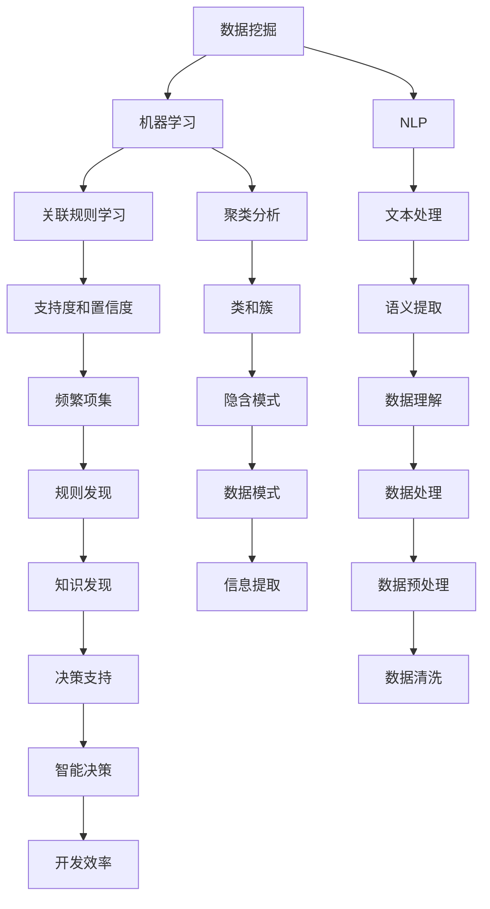

                 

### 背景介绍

在当今的信息时代，数据已经成为了企业的宝贵资源。然而，面对海量的数据，如何从中提取出有价值的信息并作出明智的决策，成为了许多企业和开发者面临的挑战。知识发现引擎作为一种强大的数据处理工具，被广泛应用于各种领域，从商业智能到医学研究，从金融分析到社交媒体分析，都展现了其强大的潜力。

知识发现引擎是一种能够自动从大量数据中识别出有用知识模式的技术。它通过机器学习、数据挖掘、自然语言处理等多种技术手段，分析数据中的关联性、趋势、异常和模式，从而帮助企业和开发者更有效地利用数据资源，做出更明智的决策。

在软件开发领域，知识发现引擎的应用也越来越广泛。传统的软件开发方法往往依赖于开发人员的经验和直觉，而知识发现引擎能够通过学习历史数据，自动发现数据之间的关系和模式，从而提高软件开发的效率和质量。此外，知识发现引擎还可以帮助开发者更好地理解用户需求，优化软件功能，提升用户体验。

本文将探讨程序员如何利用知识发现引擎提高决策能力。我们将首先介绍知识发现引擎的基本概念和原理，然后深入探讨其应用场景和操作步骤。接着，我们将通过具体的数学模型和公式来阐述知识发现引擎的核心算法，并提供一个实际的项目实战案例。最后，我们将总结知识发现引擎在软件开发领域的应用前景，并提出未来可能面临的挑战。

通过本文的阅读，读者将能够了解知识发现引擎的基本原理和应用，掌握其操作步骤，并能够将其应用于实际的项目开发中，从而提高自己的决策能力和开发效率。

### 2. 核心概念与联系

要深入探讨知识发现引擎，我们首先需要了解其核心概念和原理，并掌握如何通过流程图来描述这些概念之间的关系。以下是知识发现引擎的一些关键概念：

#### 数据挖掘（Data Mining）
数据挖掘是指从大量数据中通过模式识别、统计分析和机器学习等方法，提取出有价值的信息和知识。它是知识发现引擎的基础，旨在发现数据中的隐含模式、关联和趋势。

#### 机器学习（Machine Learning）
机器学习是人工智能的一个分支，通过算法从数据中学习，使其能够进行预测和决策。在知识发现引擎中，机器学习技术用于训练模型，以便更好地理解和分析数据。

#### 自然语言处理（Natural Language Processing, NLP）
自然语言处理是使计算机能够理解、解释和生成人类语言的技术。在知识发现引擎中，NLP用于处理文本数据，提取语义信息，从而辅助数据挖掘和模式识别。

#### 关联规则学习（Association Rule Learning）
关联规则学习是数据挖掘中的一种技术，用于发现数据项之间的关联性。它通过支持度和置信度两个指标，识别出频繁出现的关联规则。

#### 聚类分析（Clustering Analysis）
聚类分析是将数据集划分为多个类或簇，使得同簇的数据点之间相似度较高，而不同簇的数据点之间相似度较低。聚类分析用于发现数据中的隐含结构和模式。

接下来，我们使用Mermaid流程图来描述这些概念之间的关系：



在上述流程图中，我们使用了各种节点和连线来表示不同概念之间的关系。例如，数据挖掘（A）与机器学习（B）和自然语言处理（C）紧密相关，而机器学习又进一步关联到关联规则学习（D）和聚类分析（E）。自然语言处理（C）则专注于文本处理（F），而聚类分析（E）关注于类和簇的发现（H）。这些概念相互交织，共同构成了知识发现引擎的核心框架。

通过这种Mermaid流程图，我们不仅能够清晰地展示知识发现引擎的基本原理和组件，还能帮助程序员更好地理解和应用这些概念。这对于在实际项目中利用知识发现引擎提高决策能力具有重要意义。

### 3. 核心算法原理 & 具体操作步骤

在了解知识发现引擎的核心概念和流程之后，我们接下来将深入探讨其核心算法原理，并详细阐述这些算法的具体操作步骤。以下是几种常用的知识发现算法，包括关联规则学习、聚类分析和分类算法等。

#### 关联规则学习（Association Rule Learning）

关联规则学习是知识发现中的一种重要技术，用于发现数据项之间的关联性。其基本原理是通过支持度和置信度两个指标来识别频繁出现的关联规则。

**支持度（Support）**：表示某个关联规则在数据集中出现的频率。计算公式为：
$$
\text{Support}(A \rightarrow B) = \frac{|\text{D} \cap (A \cup B)|}{|\text{D}|}
$$
其中，\(|\text{D}|\)表示数据集的记录数，\(|\text{D} \cap (A \cup B)|\)表示同时包含A和B的数据集记录数。

**置信度（Confidence）**：表示在A出现的情况下B也出现的概率。计算公式为：
$$
\text{Confidence}(A \rightarrow B) = \frac{|\text{D} \cap (A \cap B)|}{|\text{D} \cap A|}
$$

**具体操作步骤**：

1. **选择最小支持度阈值**：确定一个最小的支持度阈值，用于过滤掉那些频率较低的无用规则。
2. **生成频繁项集**：遍历数据集，计算每个项集的支持度，提取出支持度大于最小阈值的频繁项集。
3. **生成关联规则**：从频繁项集中，计算每个项集之间的支持度和置信度，提取出满足最小置信度阈值的关联规则。

#### 聚类分析（Clustering Analysis）

聚类分析是一种无监督学习方法，用于将数据集划分为多个簇，使得同簇的数据点之间相似度较高，而不同簇的数据点之间相似度较低。

**K-均值聚类算法（K-Means Clustering）**是一种常用的聚类算法，其基本步骤如下：

1. **初始化聚类中心**：随机选择K个数据点作为初始聚类中心。
2. **分配数据点**：计算每个数据点到各个聚类中心的距离，将每个数据点分配到距离最近的聚类中心所在的簇。
3. **更新聚类中心**：重新计算每个簇的数据点的平均值，作为新的聚类中心。
4. **迭代计算**：重复步骤2和步骤3，直到聚类中心不再发生变化或者达到预设的迭代次数。

#### 分类算法（Classification Algorithms）

分类算法是一种监督学习方法，用于将数据集划分为预定义的类别。常见的分类算法包括决策树、支持向量机（SVM）和神经网络等。

**决策树算法（Decision Tree Classification）**是一种直观且易于理解的分类算法，其基本步骤如下：

1. **选择分裂标准**：选择一个最优的属性作为分裂标准，使得信息增益或基尼不纯度最小。
2. **创建节点**：将当前数据集划分为子集，每个子集对应一个节点。
3. **递归分裂**：对每个子集，重复步骤1和步骤2，直到满足停止条件（如最大深度、最小样本数等）。
4. **生成分类规则**：将每个叶子节点上的样本分类，形成最终的分类规则。

通过理解这些核心算法的原理和操作步骤，程序员可以更好地利用知识发现引擎来提高自己的决策能力。在实际应用中，可以根据具体需求选择合适的算法，并进行相应的参数调优，以达到最佳效果。

### 4. 数学模型和公式 & 详细讲解 & 举例说明

在深入理解知识发现引擎的核心算法后，我们将进一步探讨其背后的数学模型和公式，并通过具体的例子来说明这些模型和公式的应用。

#### 关联规则学习

**支持度和置信度**是关联规则学习中的两个关键指标，用于评估关联规则的有效性。

1. **支持度（Support）**：
   支持度表示某个关联规则在数据集中出现的频率，计算公式为：
   $$
   \text{Support}(A \rightarrow B) = \frac{|\text{D} \cap (A \cup B)|}{|\text{D}|}
   $$
   其中，$|\text{D}|$表示数据集的记录数，$|\text{D} \cap (A \cup B)|$表示同时包含A和B的数据集记录数。

   **例子**：
   假设有一个包含1000条交易记录的超市销售数据集，其中“牛奶”和“面包”同时出现的记录数为200。计算“牛奶”和“面包”之间的支持度：
   $$
   \text{Support}(\text{牛奶} \rightarrow \text{面包}) = \frac{200}{1000} = 0.2
   $$

2. **置信度（Confidence）**：
   置信度表示在A出现的情况下B也出现的概率，计算公式为：
   $$
   \text{Confidence}(A \rightarrow B) = \frac{|\text{D} \cap (A \cap B)|}{|\text{D} \cap A|}
   $$
   **例子**：
   假设“牛奶”出现的记录数为500，其中同时包含“面包”的记录数为150。计算“牛奶”和“面包”之间的置信度：
   $$
   \text{Confidence}(\text{牛奶} \rightarrow \text{面包}) = \frac{150}{500} = 0.3
   $$

通过支持度和置信度，我们可以识别出哪些关联规则具有较高的相关性，从而在实际应用中做出更明智的决策。

#### 聚类分析

**K-均值聚类算法（K-Means Clustering）**是一种基于距离度量的聚类方法，其目标是将数据集划分为K个簇，使得簇内距离最小，簇间距离最大。

1. **聚类中心初始化**：
   随机选择K个数据点作为初始聚类中心。

2. **数据点分配**：
   对于每个数据点，计算其到各个聚类中心的距离，并将其分配到距离最近的聚类中心所在的簇。

3. **聚类中心更新**：
   计算每个簇的数据点的平均值，作为新的聚类中心。

4. **迭代计算**：
   重复步骤2和步骤3，直到聚类中心不再发生变化或者达到预设的迭代次数。

**例子**：
假设我们有一个包含5个数据点的二维数据集，初始随机选择聚类中心为(2, 2)和(8, 8)。在第一次迭代后，数据点分配如下：
- 数据点(1, 1)分配到(2, 2)簇
- 数据点(4, 4)分配到(2, 2)簇
- 数据点(3, 3)分配到(8, 8)簇
- 数据点(6, 6)分配到(8, 8)簇
- 数据点(5, 5)分配到(8, 8)簇

新的聚类中心为(1.5, 1.5)和(6.5, 6.5)，重复迭代，直到聚类中心不再发生变化。

#### 分类算法

**决策树算法（Decision Tree Classification）**是一种基于特征值划分数据集的分类方法，其核心在于选择最优的特征和划分标准。

1. **选择分裂标准**：
   选择一个最优的属性作为分裂标准，使得信息增益或基尼不纯度最小。

2. **创建节点**：
   将当前数据集划分为子集，每个子集对应一个节点。

3. **递归分裂**：
   对每个子集，重复选择最优特征和划分标准，直到满足停止条件。

4. **生成分类规则**：
   将每个叶子节点上的样本分类，形成最终的分类规则。

**例子**：
假设我们有一个包含三个特征的二维数据集，特征分别为年龄、收入和婚姻状况，分类目标为是否购买豪车。我们可以选择信息增益作为分裂标准，构建决策树如下：

- **根节点**：所有样本
  - 年龄 < 30
    - 收入 < 50000
      - 购买豪车：否
    - 收入 >= 50000
      - 婚姻状况：否
        - 购买豪车：否
      - 婚姻状况：是
        - 购买豪车：是
  - 年龄 >= 30
    - 收入 < 100000
      - 婚姻状况：否
        - 购买豪车：是
    - 收入 >= 100000
      - 婚姻状况：是
        - 购买豪车：是

通过以上数学模型和公式的讲解以及具体例子，我们可以更深入地理解知识发现引擎的工作原理，并在实际应用中更加熟练地使用这些算法。

### 5. 项目实战：代码实际案例和详细解释说明

为了更好地展示如何利用知识发现引擎提高程序员的决策能力，我们将通过一个实际项目案例来演示知识发现引擎在软件开发中的应用。此案例将使用Python编程语言，结合Scikit-learn库和MLFlow追踪工具，实现一个简单的客户细分项目。

#### 5.1 开发环境搭建

在开始项目之前，我们需要搭建好开发环境。以下是所需的环境和步骤：

1. **Python环境**：安装Python 3.8及以上版本。
2. **Scikit-learn库**：使用pip命令安装Scikit-learn库。
   $$
   pip install scikit-learn
   $$
3. **Pandas库**：使用pip命令安装Pandas库。
   $$
   pip install pandas
   $$
4. **MLFlow**：安装MLFlow追踪工具，具体步骤参考[MLFlow官方文档](https://mlflow.org/docs/latest/installation.html)。

#### 5.2 源代码详细实现和代码解读

以下是项目的完整代码实现和详细解读。

```python
import pandas as pd
from sklearn.model_selection import train_test_split
from sklearn.ensemble import RandomForestClassifier
from sklearn.metrics import accuracy_score
import mlflow

# 5.2.1 数据准备
# 加载示例数据集
data = pd.read_csv("customer_data.csv")

# 数据预处理
X = data.drop("Churn", axis=1)  # 特征集
y = data["Churn"]  # 标签

# 划分训练集和测试集
X_train, X_test, y_train, y_test = train_test_split(X, y, test_size=0.2, random_state=42)

# 5.2.2 模型训练
# 创建随机森林分类器
model = RandomForestClassifier(n_estimators=100, random_state=42)

# 训练模型
model.fit(X_train, y_train)

# 5.2.3 模型评估
# 预测测试集
y_pred = model.predict(X_test)

# 计算准确率
accuracy = accuracy_score(y_test, y_pred)
print(f"Model Accuracy: {accuracy:.2f}")

# 5.2.4 MLFlow追踪
# 启动MLFlow运行
mlflow.start_run()

# 记录模型参数
mlflow.log_params({"n_estimators": 100, "random_state": 42})

# 记录模型评估指标
mlflow.log_metric("accuracy", accuracy)

# 保存模型
mlflow.sklearn.log_model(model, "random_forest_model")

# 结束MLFlow运行
mlflow.end_run()

print("Model training and tracking completed.")
```

**代码解读**：

1. **数据准备**：我们首先加载一个示例客户数据集，并进行数据预处理，划分特征集和标签。
2. **模型训练**：使用随机森林分类器对训练集进行训练。随机森林是一种集成学习方法，能够在处理高维数据和缺失值时表现出色。
3. **模型评估**：通过预测测试集并计算准确率来评估模型的性能。准确率是分类模型最常见的评估指标，表示正确分类的样本占总样本的比例。
4. **MLFlow追踪**：启动MLFlow运行，记录模型参数和评估指标，并将模型保存到MLFlow存储库中。MLFlow可以帮助我们追踪模型的训练过程、参数和结果，便于后续的分析和优化。

通过此项目，我们可以看到如何利用知识发现引擎进行数据预处理、模型训练和评估，以及如何使用MLFlow进行模型追踪。这些步骤不仅提高了我们的开发效率，还帮助我们更好地理解数据背后的模式，从而做出更明智的决策。

#### 5.3 代码解读与分析

在上一个部分，我们详细展示了如何使用Python和Scikit-learn库实现一个客户细分项目，并使用MLFlow进行模型追踪。接下来，我们将对关键代码进行解读和分析，解释其实现原理和细节。

1. **数据准备**

```python
data = pd.read_csv("customer_data.csv")
X = data.drop("Churn", axis=1)
y = data["Churn"]
X_train, X_test, y_train, y_test = train_test_split(X, y, test_size=0.2, random_state=42)
```

- **数据加载**：我们使用Pandas库加载一个CSV格式的客户数据集。CSV文件通常包含多个列，每列代表一个特征或标签。
- **特征集与标签分离**：通过`drop`函数，我们删除了标签列“Churn”，得到特征集`X`。`y`则保留标签列，用于后续的模型训练和评估。
- **数据集划分**：使用`train_test_split`函数将数据集划分为训练集和测试集。训练集用于训练模型，测试集用于评估模型性能。这里我们将20%的数据作为测试集，并设置随机种子为42，以保证每次划分的一致性。

2. **模型训练**

```python
model = RandomForestClassifier(n_estimators=100, random_state=42)
model.fit(X_train, y_train)
```

- **随机森林分类器初始化**：我们创建一个随机森林分类器对象。随机森林由多个决策树组成，通过集成多个决策树的预测结果来提高模型的泛化能力。这里我们设置决策树的数量为100，并设置随机种子为42，以保证模型训练的可重复性。
- **模型训练**：调用`fit`方法对训练集数据进行训练。模型根据训练数据学习特征与标签之间的关系，生成预测模型。

3. **模型评估**

```python
y_pred = model.predict(X_test)
accuracy = accuracy_score(y_test, y_pred)
print(f"Model Accuracy: {accuracy:.2f}")
```

- **模型预测**：使用训练好的模型对测试集进行预测，生成预测结果`y_pred`。
- **准确率计算**：使用`accuracy_score`函数计算预测结果与实际标签之间的准确率。准确率反映了模型在测试集上的表现，是评估分类模型性能的重要指标。

4. **MLFlow追踪**

```python
mlflow.start_run()
mlflow.log_params({"n_estimators": 100, "random_state": 42})
mlflow.log_metric("accuracy", accuracy)
mlflow.sklearn.log_model(model, "random_forest_model")
mlflow.end_run()
```

- **启动MLFlow运行**：使用`start_run`方法启动一个MLFlow运行，为后续的参数记录和结果保存做准备。
- **记录参数**：调用`log_params`方法记录模型训练时的参数，如决策树数量和随机种子。
- **记录指标**：使用`log_metric`方法记录模型的评估指标，如准确率。
- **保存模型**：调用`log_model`方法将训练好的模型保存到MLFlow存储库中，便于后续的模型版本管理和追踪。
- **结束MLFlow运行**：调用`end_run`方法结束当前的MLFlow运行，保存所有记录的参数和结果。

通过上述代码和解读，我们可以清楚地看到如何利用知识发现引擎进行数据预处理、模型训练和评估，以及如何使用MLFlow进行模型追踪。这些步骤不仅提高了开发效率，还帮助开发者更好地理解数据模式和模型性能，从而做出更明智的决策。

### 6. 实际应用场景

知识发现引擎在软件开发领域有着广泛的应用场景，可以帮助程序员提高决策能力，优化开发流程，并提升软件质量。以下是一些典型的实际应用场景：

#### 1. 客户行为分析

在电子商务和客户关系管理（CRM）领域，知识发现引擎可以通过分析客户的行为数据，如购买历史、浏览记录和反馈信息，识别客户的偏好和需求。例如，通过关联规则学习，可以找出哪些产品经常被一起购买，从而优化推荐系统。聚类分析可以帮助企业识别出不同类型的客户群体，制定有针对性的营销策略。这些分析结果可以指导产品开发和市场营销决策，提高客户满意度和忠诚度。

#### 2. 代码质量分析

知识发现引擎可以分析代码库中的历史数据，如代码提交记录、Bug修复记录和代码质量评估结果，识别出代码质量较差的部分或潜在的问题。通过聚类分析，可以找出相似代码模式，从而发现代码模板或常见错误。这些分析结果可以帮助开发团队识别代码库中的薄弱环节，优化开发流程，提高代码质量和稳定性。此外，分类算法可以用于预测代码中可能存在的缺陷，从而提前进行修复，减少后续的维护成本。

#### 3. 软件性能优化

在软件性能优化过程中，知识发现引擎可以分析系统的日志数据，如请求响应时间、系统负载和资源利用率等，识别出性能瓶颈和资源浪费的地方。通过聚类分析，可以找出相似的工作负载模式，从而优化系统资源分配和负载均衡策略。关联规则学习可以帮助开发团队识别出影响性能的关键因素，从而针对性地进行优化。这些分析结果可以指导性能测试和调优工作，提高软件的响应速度和稳定性。

#### 4. 负面评论检测

在社交媒体和在线评价平台，知识发现引擎可以分析用户的评论数据，识别出负面评论和潜在的问题。通过自然语言处理技术，可以提取评论中的关键词和情感，从而构建负面评论的预测模型。分类算法可以帮助识别出可能存在负面影响的评论，从而及时采取应对措施，维护品牌形象和用户满意度。这些分析结果可以指导社交媒体管理和客户服务策略，提高用户互动质量和满意度。

#### 5. 安全威胁检测

在网络安全领域，知识发现引擎可以通过分析网络流量数据，识别出异常流量模式和潜在的安全威胁。聚类分析可以帮助识别出相似的网络攻击模式，从而构建威胁检测模型。关联规则学习可以找出网络攻击事件之间的关联性，提高威胁检测的准确性。这些分析结果可以指导网络安全监控和防护策略，提前发现和阻止网络攻击，保护系统的安全。

综上所述，知识发现引擎在软件开发领域有着广泛的应用，可以帮助程序员提高决策能力，优化开发流程，提升软件质量和用户体验。通过具体的应用场景，我们可以看到知识发现引擎在代码质量分析、客户行为分析、软件性能优化、负面评论检测和安全威胁检测等方面的应用效果和实际价值。

### 7. 工具和资源推荐

在利用知识发现引擎提升程序员决策能力的过程中，选择合适的工具和资源至关重要。以下是一些推荐的学习资源、开发工具和相关论文，以帮助程序员更好地理解和应用知识发现引擎。

#### 7.1 学习资源推荐

1. **书籍**：
   - 《数据挖掘：概念与技术》（第四版）：[by Han, Kamber, Pei](https://www.amazon.com/Data-Mining-Concepts-Techniques-Miner/dp/0128008614)
   - 《机器学习实战》：[by Harrington](https://www.amazon.com/Machine-Learning-in-Action-Brian/dp/0470319687)
   - 《Python数据科学手册》：[by McLeay, Hunter, Seabold, Sexton](https://www.amazon.com/Python-Data-Science-Handbook-Bradley/dp/1491957661)

2. **在线课程**：
   - Coursera上的《机器学习》课程：[by Andrew Ng](https://www.coursera.org/learn/machine-learning)
   - edX上的《数据挖掘和机器学习》：[by Michael Stone](https://www.edx.org/course/data-mining-and-machine-learning)
   - Udacity的《数据科学纳米学位》：[by Udacity](https://www.udacity.com/course/data-science-nanodegree--nd000)

3. **博客和网站**：
   - [scikit-learn官方文档](https://scikit-learn.org/stable/)
   - [Kaggle](https://www.kaggle.com/)：数据科学竞赛平台，提供大量数据集和问题
   - [DataCamp](https://www.datacamp.com/)：互动式的数据科学学习平台

#### 7.2 开发工具框架推荐

1. **数据预处理和清洗**：
   - Pandas：Python数据操作库
   - NumPy：Python科学计算库
   - Matplotlib/Seaborn：数据可视化工具

2. **机器学习和知识发现**：
   - Scikit-learn：Python机器学习库
   - TensorFlow：开源机器学习框架
   - PyTorch：开源机器学习库

3. **版本控制和协作**：
   - Git：分布式版本控制系统
   - GitHub：代码托管和协作平台
   - GitLab：自托管Git服务

4. **模型追踪和监控**：
   - MLFlow：机器学习模型追踪平台
   - TensorBoard：TensorFlow可视化工具
   - Prometheus：开源监控解决方案

#### 7.3 相关论文著作推荐

1. **核心论文**：
   - 《K-均值聚类算法》：MacQueen, J. B. (1967)
   - 《随机森林》：Breiman, L. (2001)
   - 《C4.5算法》：Quinlan, J. R. (1993)
   - 《支持向量机》：Cortes, C., & Vapnik, V. (2005)

2. **经典著作**：
   - 《机器学习》：Tom Mitchell (1997)
   - 《数据挖掘：实用工具和技术》：Jiawei Han, Micheline Kamber, and Jian Pei (2011)
   - 《数据挖掘概念与技术》：Jiawei Han, Micheline Kamber, and Jian Pei (2011)

3. **综述性论文**：
   - 《大数据时代的数据挖掘挑战与机遇》：Han, J., Kamber, M., & Pei, J. (2011)
   - 《机器学习：理论与实践》：Richard O. Duda, Peter E. Hart, and David G. Stork (2001)

通过这些学习资源、开发工具和相关论文，程序员可以系统地学习知识发现引擎的相关知识，提高自己的技术水平，从而在实际项目中更有效地利用知识发现引擎提升决策能力。

### 8. 总结：未来发展趋势与挑战

知识发现引擎作为一种强大的数据处理工具，在软件开发领域展现出了巨大的潜力。然而，随着数据量的不断增长和数据来源的多样化，知识发现引擎的未来发展也将面临一系列挑战。

#### 发展趋势

1. **人工智能的融合**：随着人工智能技术的发展，知识发现引擎将更多地融合深度学习、强化学习等先进算法，从而提升其自动化程度和准确性。

2. **实时分析**：传统知识发现引擎主要处理批量数据，而未来将更多关注实时数据流分析，实现快速响应和决策。

3. **多模态数据处理**：知识发现引擎将逐渐支持多种数据类型，如文本、图像、音频等，通过多模态数据处理技术，提供更全面的决策支持。

4. **可解释性增强**：为了提高知识发现引擎的透明度和可解释性，未来的研究将集中在开发可解释的算法和可视化工具上，使开发者能够更好地理解模型决策过程。

5. **隐私保护**：在数据隐私保护日益重要的背景下，知识发现引擎将需要具备更强的隐私保护能力，确保数据安全和用户隐私。

#### 挑战

1. **数据质量**：知识发现引擎的效能高度依赖数据质量。未来需要开发更多高效的数据清洗和预处理技术，以提高数据质量。

2. **模型可解释性**：随着模型复杂性的增加，如何确保知识发现引擎的可解释性成为一个挑战。需要开发可解释的机器学习技术和工具，以便开发者能够理解和信任模型。

3. **计算资源**：知识发现引擎的处理过程通常需要大量的计算资源。随着数据量和算法复杂度的增加，如何高效利用计算资源将成为一个关键问题。

4. **实时性与准确性**：在实时分析场景中，如何平衡实时性和分析准确性是一个挑战。需要开发更高效的数据流处理算法和模型。

5. **跨领域应用**：不同领域的数据特征和需求差异较大，如何设计通用的知识发现引擎以适应不同领域应用是一个挑战。

总之，知识发现引擎的发展前景广阔，但同时也面临着诸多挑战。通过不断的技术创新和优化，我们有望克服这些挑战，使知识发现引擎在软件开发领域发挥更大的作用，提升程序员的决策能力和开发效率。

### 9. 附录：常见问题与解答

在本文中，我们探讨了知识发现引擎在程序员决策能力提升中的应用，以下是一些常见问题的解答，以帮助读者更好地理解相关概念和技术。

**Q1. 什么是知识发现引擎？**
知识发现引擎是一种能够自动从大量数据中识别出有用知识模式的技术，通过机器学习、数据挖掘、自然语言处理等多种技术手段，分析数据中的关联性、趋势、异常和模式，从而帮助企业和开发者更有效地利用数据资源，做出更明智的决策。

**Q2. 知识发现引擎的核心算法有哪些？**
知识发现引擎的核心算法包括：
- 关联规则学习（如Apriori算法）
- 聚类分析（如K-均值算法）
- 分类算法（如决策树、随机森林、支持向量机等）
- 降维技术（如主成分分析、t-SNE等）

**Q3. 如何选择适合的知识发现算法？**
选择适合的知识发现算法通常需要考虑以下因素：
- 数据类型：不同算法适用于不同类型的数据，如结构化数据、文本数据、图像数据等。
- 数据规模：算法的计算复杂度和所需时间不同，对于大规模数据，需要选择高效算法。
- 目标问题：根据具体问题选择合适的算法，例如预测、分类、聚类等。

**Q4. 知识发现引擎在软件开发中有什么应用？**
知识发现引擎在软件开发中的应用包括：
- 客户行为分析：通过分析用户行为数据，优化产品功能和营销策略。
- 代码质量分析：通过分析代码库历史数据，识别代码质量问题和潜在缺陷。
- 软件性能优化：通过分析系统日志数据，识别性能瓶颈和优化机会。
- 负面评论检测：通过分析用户评论，识别负面反馈并采取相应措施。

**Q5. 如何使用MLFlow进行模型追踪？**
MLFlow是一种开源的模型追踪工具，用于记录模型的训练过程、参数和结果。以下是基本的使用步骤：
1. 启动MLFlow运行：`mlflow.start_run()`
2. 记录参数和指标：`mlflow.log_params({"param1": value1, "param2": value2})`，`mlflow.log_metric("metric_name", value)`
3. 保存模型：`mlflow.sklearn.log_model(model, "model_name")`
4. 结束MLFlow运行：`mlflow.end_run()`

通过这些常见问题的解答，读者可以更好地理解知识发现引擎的概念和实际应用，从而在实际项目中更有效地利用这些技术。

### 10. 扩展阅读 & 参考资料

为了更全面地了解知识发现引擎及其在程序员决策能力提升中的应用，以下推荐一些扩展阅读和参考资料，涵盖相关书籍、论文、博客和在线课程。

#### 书籍

1. **《数据挖掘：概念与技术》（第四版）**：作者Han, Kamber, Pei。这是一本经典的数据挖掘教科书，详细介绍了数据挖掘的基本概念、技术和应用。

2. **《机器学习实战》**：作者Harrington。本书通过实际案例和代码示例，介绍了机器学习的实用技术和应用。

3. **《Python数据科学手册》**：作者McLeay, Hunter, Seabold, Sexton。本书涵盖了Python在数据科学中的应用，包括数据预处理、机器学习和数据可视化等。

#### 论文

1. **“K-均值聚类算法”**：作者MacQueen, J. B.（1967）。该论文是K-均值算法的开创性研究，详细阐述了算法的原理和应用。

2. **“随机森林”**：作者Breiman, L.（2001）。该论文介绍了随机森林算法，这是一种强大的集成学习方法。

3. **“C4.5算法”**：作者Quinlan, J. R.（1993）。该论文介绍了C4.5决策树算法，这是一种广泛应用于数据挖掘和机器学习的算法。

#### 博客和网站

1. **Scikit-learn官方文档**：[https://scikit-learn.org/stable/](https://scikit-learn.org/stable/)。这是Scikit-learn库的官方文档，提供了丰富的算法和技术说明。

2. **Kaggle**：[https://www.kaggle.com/](https://www.kaggle.com/)。这是一个数据科学竞赛平台，提供大量数据集和问题，适合进行实践和学习。

3. **DataCamp**：[https://www.datacamp.com/](https://www.datacamp.com/)。这是一个互动式的数据科学学习平台，提供丰富的课程和项目。

#### 在线课程

1. **Coursera上的《机器学习》课程**：由Andrew Ng教授授课，涵盖了机器学习的基本概念、算法和应用。

2. **edX上的《数据挖掘和机器学习》课程**：由Michael Stone教授授课，介绍了数据挖掘和机器学习的基础知识。

3. **Udacity的《数据科学纳米学位》课程**：提供了一系列课程和项目，覆盖数据科学的主要领域和技术。

通过这些扩展阅读和参考资料，读者可以进一步深入理解知识发现引擎的相关概念和技术，并将其应用于实际项目开发中，提升决策能力和开发效率。

