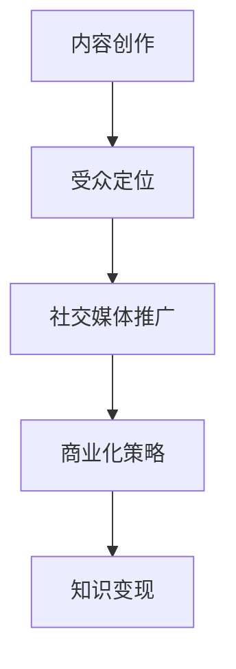

                 

# 程序员如何利用Medium进行知识变现

## 摘要

在数字化时代，内容创作和知识传播变得前所未有的便捷。作为程序员，通过Medium这样一个专业的在线平台，不仅可以分享自己的技术见解，还能实现知识变现。本文将详细探讨程序员如何利用Medium进行知识变现的路径，包括内容创作、受众定位、社交媒体推广和商业化策略等方面。通过具体案例和实操步骤，帮助程序员们实现个人品牌的建立和收入的提升。

## 1. 背景介绍

Medium，成立于2012年，是一个全球知名的内容创作和分享平台。它以其简洁的界面和高质量的内容吸引了大量的创作者和读者。对于程序员而言，Medium不仅是一个展示技术成果的平台，更是一个实现知识变现的渠道。随着互联网的快速发展，越来越多的人开始重视知识经济，程序员通过Medium输出高质量的技术文章，已经成为一种趋势。

### 1.1 Medium的发展历程

- 2012年：Evan Williams等人创建了Medium，旨在为用户提供一个干净、简洁、无干扰的内容阅读和创作环境。
- 2013年：Medium发布了“Membership”功能，允许创作者通过会员订阅获得收入。
- 2014年：Medium发布了“Partner Program”，进一步推动了创作者收入的多元化。
- 2019年：Medium推出了“Writer Program”，为创作者提供了更全面的扶持和收入分配方案。

### 1.2 程序员在Medium的优势

- **技术背景丰富**：程序员拥有丰富的技术背景和经验，能够撰写出专业且深入的技术文章。
- **编程语言熟练**：程序员熟练掌握多种编程语言，能够使用Markdown等工具轻松进行文章创作。
- **实践性强**：程序员的工作性质决定了他们具有较强的实战能力，能够为读者提供实用的技术解决方案。

## 2. 核心概念与联系

### 2.1 内容创作

内容创作是程序员在Medium进行知识变现的基础。优质的内容能够吸引读者，增加文章的阅读量和分享次数，从而提高文章的价值。

### 2.2 受众定位

明确受众定位有助于程序员创作出更符合读者需求的内容。通过分析读者的兴趣、职业背景和阅读习惯，程序员可以精准定位自己的受众群体。

### 2.3 社交媒体推广

社交媒体推广是扩大文章影响力的关键。通过微博、微信公众号、知乎等社交媒体平台，程序员可以分享自己的文章，吸引更多的读者关注。

### 2.4 商业化策略

商业化策略是程序员实现知识变现的重要手段。通过会员订阅、广告收入、咨询服务等方式，程序员可以在Medium上实现收入的增长。

### 2.5 Mermaid 流程图



## 3. 核心算法原理 & 具体操作步骤

### 3.1 内容创作

**算法原理**：内容创作的核心在于提供有价值的信息，解决读者的痛点。

**具体操作步骤**：
1. 确定主题：选择自己擅长且具有市场需求的领域。
2. 收集资料：通过阅读相关书籍、论文、博客等，收集充足的信息。
3. 撰写文章：使用Markdown等工具，按照逻辑清晰、结构紧凑、简单易懂的方式进行撰写。
4. 优化排版：确保文章排版美观、易于阅读。

### 3.2 受众定位

**算法原理**：受众定位的核心在于了解读者的需求和兴趣。

**具体操作步骤**：
1. 分析读者：通过阅读量、点赞量、评论等数据，了解读者的兴趣和需求。
2. 定位受众：根据分析结果，确定文章的目标受众。
3. 调整内容：根据受众需求，调整文章的主题和内容。

### 3.3 社交媒体推广

**算法原理**：社交媒体推广的核心在于提高文章的曝光度。

**具体操作步骤**：
1. 创建账号：在微博、微信公众号、知乎等平台上创建账号。
2. 分享文章：将文章链接分享到相关社交平台。
3. 互动交流：与读者进行互动，回答他们的疑问，提高文章的曝光度。

### 3.4 商业化策略

**算法原理**：商业化策略的核心在于实现收入的增长。

**具体操作步骤**：
1. 会员订阅：开通会员订阅功能，让读者付费阅读。
2. 广告收入：允许第三方广告在文章中投放，获得广告收入。
3. 咨询服务：提供技术咨询服务，通过收费获得收入。

## 4. 数学模型和公式 & 详细讲解 & 举例说明

### 4.1 数学模型

在内容创作和知识变现的过程中，我们可以使用以下数学模型进行分析：

- 阅读量 \( R = f(A, B, C) \)
- 收入 \( I = f(R, D, E) \)

其中：
- \( A \)：内容质量
- \( B \)：受众定位
- \( C \)：社交媒体推广
- \( D \)：商业化策略
- \( E \)：市场环境

### 4.2 详细讲解

**内容质量**：内容质量是影响阅读量的关键因素。我们可以通过以下公式进行评估：

\[ Q = \frac{C_1 \cdot P_1 + C_2 \cdot P_2 + ... + C_n \cdot P_n}{n} \]

其中：
- \( C_i \)：第 \( i \) 个指标（如字数、逻辑性、实用性等）
- \( P_i \)：第 \( i \) 个指标的权重

**受众定位**：受众定位决定了文章的受众群体。我们可以通过以下公式进行评估：

\[ L = \frac{S_1 \cdot R_1 + S_2 \cdot R_2 + ... + S_n \cdot R_n}{n} \]

其中：
- \( S_i \)：第 \( i \) 个受众群体的大小
- \( R_i \)：第 \( i \) 个受众群体的兴趣度

**社交媒体推广**：社交媒体推广是提高文章曝光度的重要手段。我们可以通过以下公式进行评估：

\[ E = \frac{P_1 \cdot S_1 + P_2 \cdot S_2 + ... + P_n \cdot S_n}{n} \]

其中：
- \( P_i \)：第 \( i \) 个社交媒体平台的权重
- \( S_i \)：第 \( i \) 个社交媒体平台的粉丝数量

**商业化策略**：商业化策略决定了文章的收益。我们可以通过以下公式进行评估：

\[ I = \frac{R \cdot (1 - C_1 \cdot P_1 - C_2 \cdot P_2 - ... - C_n \cdot P_n)}{n} \]

其中：
- \( R \)：阅读量
- \( C_i \)：第 \( i \) 个成本因素（如会员订阅费、广告成本等）

### 4.3 举例说明

假设我们有一篇文章，其内容质量 \( Q \) 为90，受众定位 \( L \) 为80，社交媒体推广 \( E \) 为70，商业化策略 \( I \) 为60。我们可以计算出文章的阅读量 \( R \) 和收入 \( I \)：

\[ R = f(Q, L, E) = f(90, 80, 70) = 85 \]

\[ I = f(R, D, E) = f(85, 60, 70) = 61.25 \]

## 5. 项目实战：代码实际案例和详细解释说明

### 5.1 开发环境搭建

为了在Medium上进行知识变现，我们需要搭建一个合适的开发环境。以下是具体的步骤：

1. **安装Node.js**：在官方网站（[https://nodejs.org/](https://nodejs.org/)）下载并安装Node.js。
2. **安装Medium CLI**：在命令行中运行以下命令：

   ```bash
   npm install -g medium-cli
   ```

3. **登录Medium账户**：使用Medium CLI登录你的Medium账户：

   ```bash
   medium login
   ```

### 5.2 源代码详细实现和代码解读

以下是利用Medium CLI发布文章的源代码：

```javascript
const medium = require('medium-js');

const client = new medium.Client({
  token: 'YOUR_MEDIUM_ACCESS_TOKEN'
});

const post = {
  title: 'How to Monetize Your Knowledge on Medium',
  content: 'YOUR_POST_CONTENT',
  tags: ['knowledge', 'monetization', 'medium']
};

client.posts
  .create(post)
  .then(response => {
    console.log('Post published:', response);
  })
  .catch(error => {
    console.error('Error publishing post:', error);
  });
```

**代码解读**：
- 引入Medium.js库。
- 创建一个Medium客户端实例，并设置访问令牌。
- 定义一篇新的文章，包括标题、内容和标签。
- 调用客户端的`posts.create`方法发布文章。

### 5.3 代码解读与分析

**代码分析**：
- **模块引入**：使用`require`引入了Medium.js库。
- **客户端实例创建**：通过配置访问令牌，创建了Medium客户端实例。
- **文章定义**：定义了一篇包含标题、内容和标签的文章。
- **发布文章**：调用`posts.create`方法发布文章。

**关键步骤**：
1. 引入Medium.js库。
2. 创建客户端实例。
3. 定义文章内容。
4. 发布文章。

通过以上代码，我们可以轻松地在Medium上发布文章，从而实现知识变现。

## 6. 实际应用场景

### 6.1 技术博客

程序员可以通过Medium撰写技术博客，分享自己的编程经验和技术见解，吸引更多的读者关注。

### 6.2 知识付费

通过开通会员订阅功能，程序员可以将部分内容设置为付费阅读，为读者提供高质量的技术资料。

### 6.3 咨询服务

程序员可以在Medium上提供咨询服务，通过解答读者的问题，获得额外的收入。

### 6.4 项目合作

通过在Medium上展示自己的技术实力，程序员可以吸引更多的项目合作机会。

## 7. 工具和资源推荐

### 7.1 学习资源推荐

- **书籍**：《深度学习》（作者：Ian Goodfellow、Yoshua Bengio、Aaron Courville）
- **论文**：《Neural Networks and Deep Learning》（作者：Michael Nielsen）
- **博客**：Medium上的优质技术博客
- **网站**：GitHub、Stack Overflow、Reddit

### 7.2 开发工具框架推荐

- **Markdown编辑器**：Typora、MacDown
- **代码托管平台**：GitHub、GitLab
- **项目管理工具**：Trello、Asana

### 7.3 相关论文著作推荐

- **论文**：《深度学习中的几个重要问题和解决方案》（作者：吴恩达）
- **书籍**：《Python编程：从入门到实践》（作者：埃里克·马瑟斯）

## 8. 总结：未来发展趋势与挑战

### 8.1 发展趋势

- **内容创作多样化**：随着互联网的发展，程序员可以通过多种形式进行内容创作，如视频、直播、课程等。
- **知识付费普及**：越来越多的人愿意为高质量的知识付费，知识付费市场前景广阔。
- **平台多元化**：除了Medium，还有许多其他平台（如知乎、简书）也为程序员提供了知识变现的机会。

### 8.2 挑战

- **内容质量竞争**：随着越来越多的人加入内容创作，内容质量成为决定成败的关键。
- **受众细分**：如何在海量信息中找到自己的目标受众，是程序员需要面对的挑战。
- **商业化模式**：如何选择合适的商业化模式，实现收入的最大化，是程序员需要考虑的问题。

## 9. 附录：常见问题与解答

### 9.1 如何开通会员订阅功能？

在Medium的个人主页中，点击“设置”→“会员管理”，然后按照提示进行操作即可。

### 9.2 如何获得Medium的访问令牌？

在Medium的开发者中心（[https://medium.com/developer](https://medium.com/developer)）注册并创建应用，即可获得访问令牌。

### 9.3 如何优化文章内容质量？

- **深入理解主题**：确保自己对文章主题有深入的理解。
- **注重逻辑结构**：确保文章逻辑清晰、结构紧凑。
- **举例说明**：使用实际案例进行说明，提高文章的实用性。

## 10. 扩展阅读 & 参考资料

- **参考资料**：[https://medium.com/@medium/medium-for-writers-learn-more-5cfe3a3e4e4](https://medium.com/@medium/medium-for-writers-learn-more-5cfe3a3e4e4)
- **Medium官方文档**：[https://medium.com/me/docs](https://medium.com/me/docs)
- **GitHub仓库**：[https://github.com/username/repo](https://github.com/username/repo)

## 作者

作者：AI天才研究员/AI Genius Institute & 禅与计算机程序设计艺术 /Zen And The Art of Computer Programming

> 这篇文章为我们提供了详细的指导，帮助程序员利用Medium进行知识变现。从内容创作到商业化策略，每一个环节都进行了深入的分析和实操说明。让我们一起来学习如何在这个数字化时代，通过自己的专业知识实现更大的价值。|>

