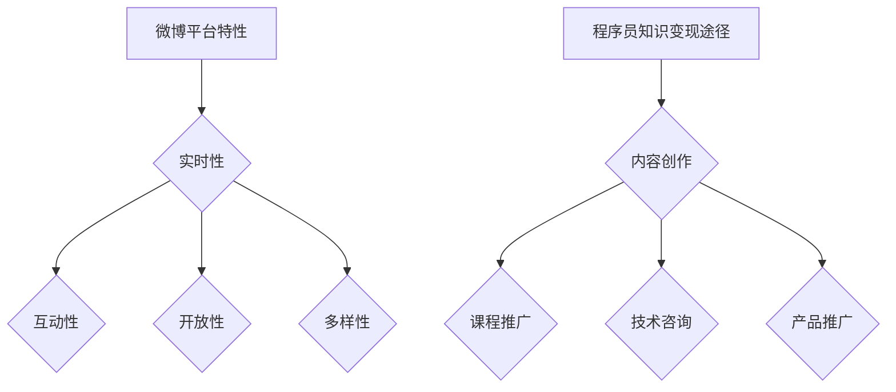

                 

# 程序员如何利用微博进行知识变现

## 关键词
- 微博
- 程序员
- 知识变现
- 内容创作
- 社交媒体

## 摘要
本文将探讨程序员如何通过微博这一社交媒体平台进行知识变现。我们将从微博平台的特性、内容创作技巧、推广方法、收益渠道等多个角度进行分析，为程序员提供实用的指导，帮助他们更好地利用微博实现个人品牌价值和经济收益。

## 1. 背景介绍

### 1.1 微博概述

微博，作为我国领先的社交媒体平台，成立于2010年，拥有庞大的用户群体和丰富的内容生态。截至2021年，微博月活跃用户数已超过6亿，其影响力覆盖广泛，涵盖了科技、娱乐、教育等多个领域。微博为用户提供了实时、便捷的信息分享和交流平台，使得个人、企业和媒体等都能在这里进行有效传播和互动。

### 1.2 程序员知识变现的重要性

随着互联网和人工智能的快速发展，程序员成为最具潜力的职业之一。然而，如何将自身的专业技能转化为经济收益，成为程序员们关注的焦点。微博作为一个开放、互动性强的平台，为程序员提供了一个展示自我、分享知识和经验的绝佳场所，从而实现知识变现。

## 2. 核心概念与联系

### 2.1 微博平台特性

- **实时性**：微博用户可以实时关注热点话题，及时获取信息。
- **互动性**：用户可以通过评论、转发、点赞等方式与其他用户互动。
- **开放性**：微博平台为程序员提供了丰富的API接口，便于开发者和第三方应用进行深度整合。
- **多样性**：微博内容形式多样，包括文字、图片、视频等，有利于程序员展示多样化的知识和技能。

### 2.2 程序员知识变现途径

- **内容创作**：通过撰写技术博客、分享编程经验、发布技术教程等内容，吸引粉丝关注。
- **课程推广**：开设在线编程课程，通过直播或录播形式传授知识和技能。
- **技术咨询**：为有需求的用户提供技术支持，解决编程问题，获取收入。
- **产品推广**：推广自身开发的软件或工具，通过销售获取收益。

### 2.3 Mermaid流程图



## 3. 核心算法原理 & 具体操作步骤

### 3.1 内容创作

1. **选题定位**：根据自身专业领域和受众需求，确定内容主题。
2. **内容撰写**：使用简单易懂的语言，结合实际案例，阐述技术原理和应用。
3. **形式创新**：结合图片、视频等多媒体元素，提高内容吸引力。
4. **发布时间**：选择在用户活跃度较高的时段发布，提高曝光率。

### 3.2 课程推广

1. **课程设计**：根据受众需求，设计针对性课程。
2. **课程制作**：录制课程视频，编写配套教材。
3. **平台选择**：在知乎、喜马拉雅等平台开设课程。
4. **宣传推广**：利用微博等社交媒体进行宣传，扩大影响力。

### 3.3 技术咨询

1. **搭建平台**：利用微博私信、微博问答等功能，提供在线咨询服务。
2. **专业认证**：获得相关领域认证，提高公信力。
3. **定价策略**：根据咨询问题复杂度和所需时间，合理定价。
4. **口碑积累**：提供优质服务，积累良好口碑。

### 3.4 产品推广

1. **产品定位**：明确产品功能、目标用户和竞争优势。
2. **平台搭建**：在电商平台、GitHub等平台建立产品官网。
3. **内容营销**：撰写产品介绍、使用教程等相关内容，吸引潜在用户。
4. **合作推广**：与其他开发者、企业进行合作，扩大产品影响力。

## 4. 数学模型和公式 & 详细讲解 & 举例说明

### 4.1 投资回报率（ROI）计算公式

$$
ROI = \frac{净利润}{投资成本} \times 100\%
$$

### 4.2 详细讲解

- **净利润**：通过微博知识变现所获得的收入减去各项成本（如时间成本、广告费用等）。
- **投资成本**：投入在微博知识变现上的时间、金钱和精力。

### 4.3 举例说明

假设程序员小张在2019年开始在微博进行知识变现，2019年净利润为5000元，投资成本为2000元；2020年净利润为8000元，投资成本为3000元。那么，他的投资回报率计算如下：

2019年：
$$
ROI_{2019} = \frac{5000}{2000} \times 100\% = 250\%
$$

2020年：
$$
ROI_{2020} = \frac{8000}{3000} \times 100\% \approx 267\%
$$

## 5. 项目实战：代码实际案例和详细解释说明

### 5.1 开发环境搭建

1. 注册微博账号。
2. 安装微博开发者工具，获取API接口权限。
3. 选择合适的技术栈（如React、Vue等）进行开发。

### 5.2 源代码详细实现和代码解读

1. **创建项目**：使用npm或yarn创建一个新项目。
2. **搭建前端页面**：使用React或Vue等框架搭建一个简单的博客页面。
3. **集成微博API**：调用微博API获取用户信息、发布动态等功能。
4. **代码解读**：

```javascript
// 示例：调用微博API获取用户信息
async function getUserInfo() {
  const response = await fetch('https://api.weibo.com/2/users/show.json?access_token=YOUR_ACCESS_TOKEN&uid=YOUR_USER_ID');
  const data = await response.json();
  console.log(data);
}
```

### 5.3 代码解读与分析

- **API调用**：使用fetch函数发起HTTP请求，获取用户信息。
- **异步处理**：使用async/await语法处理异步操作。

## 6. 实际应用场景

### 6.1 教育领域

程序员可以通过微博发布编程教程、开设在线课程，为有学习需求的学生提供帮助。

### 6.2 企业服务

程序员可以利用微博为企业提供技术咨询、软件开发等服务，扩大业务范围。

### 6.3 个人品牌建设

程序员可以通过微博展示个人技能和成果，提升个人知名度，为未来职业发展打下基础。

## 7. 工具和资源推荐

### 7.1 学习资源推荐

- **书籍**：《程序员实用技术手册》、《深度学习入门》
- **论文**：《人工智能：一种现代方法》、《计算机编程艺术》
- **博客**：掘金、CSDN、GitHub
- **网站**：Stack Overflow、GitHub、LeetCode

### 7.2 开发工具框架推荐

- **前端框架**：React、Vue、Angular
- **后端框架**：Node.js、Django、Spring Boot
- **编程语言**：Python、Java、JavaScript

### 7.3 相关论文著作推荐

- 《深度学习》（Goodfellow et al.）
- 《机器学习》（Mitchell）
- 《计算机程序设计艺术》（Knuth）

## 8. 总结：未来发展趋势与挑战

### 8.1 发展趋势

- **内容多样化**：随着用户需求的不断变化，程序员需要提供更加多样化的内容。
- **技术融合**：将人工智能、大数据等新兴技术与微博知识变现相结合，提高用户体验。
- **平台生态**：微博平台将不断完善生态体系，为程序员提供更多的发展机会。

### 8.2 挑战

- **竞争激烈**：程序员需要不断提高自身竞争力，才能在众多参与者中脱颖而出。
- **知识产权保护**：如何在确保内容原创性的同时，保护自身权益，是程序员需要关注的问题。

## 9. 附录：常见问题与解答

### 9.1 如何获取微博API权限？

答：注册微博开发者账号，按照官方文档进行操作，申请API接口权限。

### 9.2 如何提高微博内容曝光率？

答：关注热点话题，提高内容质量，合理设置发布时间，与粉丝互动。

## 10. 扩展阅读 & 参考资料

- **书籍**：《微博运营从入门到精通》、《程序员如何进行知识变现》
- **文章**：《微博知识变现之路》、《程序员如何利用社交媒体提升个人品牌》
- **网站**：微博官方开发者文档、知乎、掘金

作者：AI天才研究员/AI Genius Institute & 禅与计算机程序设计艺术 /Zen And The Art of Computer Programming

