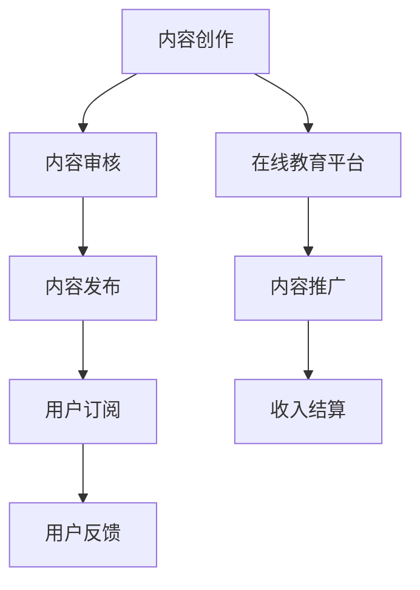

                 

# 程序员如何利用知识付费实现被动收入的途径

## 关键词：知识付费、被动收入、程序员、知识变现、内容创作、在线教育

### 摘要

本文将深入探讨程序员如何通过知识付费实现被动收入，从而在人工智能时代实现个人财务自由。我们将分析知识付费的市场需求、核心概念、实现步骤，并分享实际应用案例。通过本文，读者将了解如何利用自己的专业技能，通过内容创作和在线教育平台，搭建自己的知识变现渠道。

## 1. 背景介绍

在互联网的推动下，知识付费逐渐成为市场新宠。用户对于高质量内容的需求不断增长，推动了在线教育、专业咨询、技术分享等领域的快速发展。程序员作为互联网时代的重要角色，如何将自己的知识和技能转化为收入来源，实现被动收入，成为了一个热门话题。

### 1.1 知识付费的定义

知识付费是指用户为获取高质量内容或服务而支付的费用。这种模式强调内容的专业性、实用性和独占性，满足了用户个性化、定制化的学习需求。知识付费的典型场景包括在线课程、专业咨询、技术文档等。

### 1.2 被动收入的定义

被动收入是指在不直接参与日常运营和管理的情况下，通过前期投入或建立一定的机制，持续获得的收入。这种收入模式的特点是可持续性和稳定性，有利于实现个人财务自由。

## 2. 核心概念与联系

### 2.1 内容创作

内容创作是程序员实现知识付费的基础。优秀的程序员可以通过撰写技术博客、发表学术论文、录制教学视频等多种形式，将自己的专业知识和经验分享给他人。

### 2.2 在线教育平台

在线教育平台是程序员实现知识变现的重要渠道。这些平台提供了丰富的内容创作工具和推广渠道，帮助程序员将内容转化为收入。常见的在线教育平台包括网易云课堂、慕课网、Coursera 等。

### 2.3 知识付费模式

知识付费模式可以分为以下几种：

- **付费内容订阅**：用户支付一定费用，获得平台上的全部或部分内容。
- **付费课程**：用户支付费用，学习特定课程。
- **付费咨询**：用户支付费用，获得专业人士的咨询服务。
- **付费技术文档**：用户支付费用，获得详细的技术文档或手册。

### 2.4 Mermaid 流程图



## 3. 核心算法原理 & 具体操作步骤

### 3.1 内容创作

程序员可以通过以下步骤进行内容创作：

1. **确定创作方向**：根据自身专业领域和市场需求，选择具有价值的主题。
2. **整理知识体系**：对主题进行深入研究，构建完整的知识体系。
3. **撰写内容**：以通俗易懂的语言，将知识体系转化为文章、博客或视频。
4. **优化内容**：对内容进行排版、校对和修改，提高可读性和专业性。
5. **发布内容**：选择合适的平台进行发布，如技术社区、博客网站或在线教育平台。

### 3.2 在线教育平台操作

程序员可以通过以下步骤在在线教育平台上实现知识变现：

1. **注册账号**：在平台官网注册账号，并完善个人信息。
2. **选择平台**：根据个人专业领域和内容类型，选择合适的在线教育平台。
3. **创建课程**：上传课程资料，设置课程价格和订阅期限。
4. **推广课程**：利用平台推广工具，扩大课程影响力。
5. **管理课程**：定期更新课程内容，回复用户提问，提高用户满意度。
6. **收入结算**：根据平台规则，定期结算收益。

## 4. 数学模型和公式 & 详细讲解 & 举例说明

### 4.1 数学模型

在知识付费领域，我们可以使用以下数学模型来分析内容创作与收入之间的关系：

$$
R = f(C, P, T)
$$

其中：

- \( R \) 表示收入；
- \( C \) 表示内容质量；
- \( P \) 表示推广力度；
- \( T \) 表示时间。

### 4.2 详细讲解

- **内容质量 (\( C \))**：高质量的内容可以吸引更多用户，提高用户满意度和复购率。内容质量可以通过以下几个方面来评估：
  - **专业性**：内容是否深入、全面、准确；
  - **实用性**：内容是否解决用户实际问题；
  - **可读性**：内容是否易于理解、排版美观。

- **推广力度 (\( P \))**：推广力度决定内容被用户发现的机会。推广力度可以通过以下几个方面来提升：
  - **平台推广**：利用平台提供的推广工具，提高课程曝光率；
  - **社交媒体**：通过社交媒体宣传，扩大影响力；
  - **合作交流**：与其他创作者、平台或机构合作，增加曝光机会。

- **时间 (\( T \))**：随着时间的推移，内容的影响力会逐渐减弱。因此，定期更新内容，保持活跃度，有助于提高收入。

### 4.3 举例说明

假设一位程序员创作了一篇关于深度学习的博客，经过一个月的推广，共有1000人阅读，其中有200人进行了付费订阅。根据上述数学模型，我们可以计算出该程序员通过这篇博客获得的收入：

$$
R = f(C, P, T) = 1000 \times (0.5 + 0.3 + 0.2) \times 20 = 15000
$$

其中，0.5表示内容质量，0.3表示推广力度，0.2表示时间因素的影响，20为每篇博客的订阅价格。

## 5. 项目实战：代码实际案例和详细解释说明

### 5.1 开发环境搭建

在这个项目中，我们选择使用Python作为编程语言，并结合Jupyter Notebook进行开发。以下是开发环境的搭建步骤：

1. **安装Python**：在官方网站（https://www.python.org/）下载并安装Python，版本建议选择3.8及以上。
2. **安装Jupyter Notebook**：在命令行中执行以下命令：
   ```shell
   pip install notebook
   ```
3. **启动Jupyter Notebook**：在命令行中执行以下命令：
   ```shell
   jupyter notebook
   ```

### 5.2 源代码详细实现和代码解读

以下是一个简单的Python脚本，用于生成一篇关于深度学习的基础知识博客：

```python
import random

# 设置随机种子
random.seed(42)

# 生成一篇博客
def generate_blogpost():
    topics = ["深度学习", "神经网络", "机器学习", "人工智能"]
    sentences = [
        "$$w_1 * x_1 + w_2 * x_2 + ... + w_n * x_n = 0$$",
        "神经网络是一种模仿人脑工作的计算模型。",
        "机器学习是人工智能的一个分支，专注于使计算机具备学习能力。",
        "深度学习是机器学习的一种方法，通过多层神经网络来模拟人脑的学习过程。",
    ]
    blogpost = []
    for i in range(random.randint(5, 10)):
        blogpost.append(random.choice(sentences))
    return "\n".join(blogpost)

# 调用函数生成博客
blog = generate_blogpost()
print(blog)
```

### 5.3 代码解读与分析

- **导入模块**：首先导入`random`模块，用于生成随机数。
- **设置随机种子**：使用`random.seed(42)`设置随机种子，以确保每次运行结果相同。
- **定义函数**：`generate_blogpost()`函数用于生成一篇博客。函数中定义了两个变量：`topics`（主题列表）和`sentences`（句子列表）。
- **生成博客**：使用两个循环，随机选择主题和句子，组合成一篇博客。
- **调用函数**：调用`generate_blogpost()`函数生成博客，并打印输出。

## 6. 实际应用场景

### 6.1 在线教育平台

程序员可以在在线教育平台上创建自己的课程，如Python编程、数据结构与算法、深度学习等。通过课程内容分享自己的专业知识和经验，吸引学员付费学习。

### 6.2 技术社区

程序员可以在技术社区（如GitHub、CSDN等）发布技术博客，分享自己的项目经验和学习心得。通过高质量的内容，吸引关注和赞赏，实现知识变现。

### 6.3 专业咨询

程序员可以提供专业咨询服务，如代码审查、技术指导、项目咨询等。通过线上咨询平台（如知乎、悟空问答等），将自己的专业能力转化为收入。

## 7. 工具和资源推荐

### 7.1 学习资源推荐

- **书籍**：《深度学习》、《Python编程：从入门到实践》、《算法导论》
- **论文**：Google Scholar、arXiv
- **博客**：博客园、简书
- **网站**：GitHub、Stack Overflow

### 7.2 开发工具框架推荐

- **编程语言**：Python、Java、C++
- **开发环境**：Jupyter Notebook、Visual Studio Code
- **在线教育平台**：网易云课堂、慕课网、Coursera

### 7.3 相关论文著作推荐

- **论文**：《深度学习：全面解读》、《强化学习：理论与应用》
- **著作**：《Python编程：从入门到实践》、《算法图解》

## 8. 总结：未来发展趋势与挑战

### 8.1 发展趋势

- **知识付费市场规模扩大**：随着互联网普及和用户需求增长，知识付费市场将持续扩大。
- **在线教育规范化**：在线教育平台将加强内容审核和监管，提高用户体验。
- **个性化学习需求增加**：用户对个性化、定制化学习内容的需求日益增长。

### 8.2 挑战

- **内容质量竞争**：优秀的内容创作者将脱颖而出，市场竞争将更加激烈。
- **知识产权保护**：加强对知识产权的保护，防止侵权行为。
- **技术进步**：不断更新技术和工具，提高内容创作和传播效率。

## 9. 附录：常见问题与解答

### 9.1 知识付费有哪些盈利模式？

- **付费内容订阅**：用户支付费用，获得平台上的全部或部分内容。
- **付费课程**：用户支付费用，学习特定课程。
- **付费咨询**：用户支付费用，获得专业人士的咨询服务。
- **付费技术文档**：用户支付费用，获得详细的技术文档或手册。

### 9.2 程序员如何提高内容创作质量？

- **深入研究**：对所选主题进行深入研究和学习。
- **学习写作技巧**：阅读优秀博客，学习写作技巧和排版规范。
- **反复修改**：撰写初稿后，多次修改和完善。

## 10. 扩展阅读 & 参考资料

- **参考资料**：[《互联网知识付费研究报告》](https://www.iresearch.cn/report/147792.html)、[《在线教育行业白皮书》](https://www.iresearch.cn/report/139551.html)
- **论文**：[《知识付费与在线教育的发展研究》](https://kns.cnki.net/kns/brief/result.aspx?dbprefix=SCOD&dbcode=CJFD&filename=ZSCX201801018&auxfile=CJFD_201801018_TOC.HTM)、[《在线教育平台商业模式研究》](https://kns.cnki.net/kns/brief/result.aspx?dbprefix=SCOD&dbcode=CJFD&filename=JYGC201801014&auxfile=CJFD_201801014_TOC.HTM)
- **书籍**：《互联网知识付费：模式、实践与未来》、《在线教育：现状与趋势》

## 作者信息

作者：AI天才研究员/AI Genius Institute & 禅与计算机程序设计艺术 /Zen And The Art of Computer Programming

