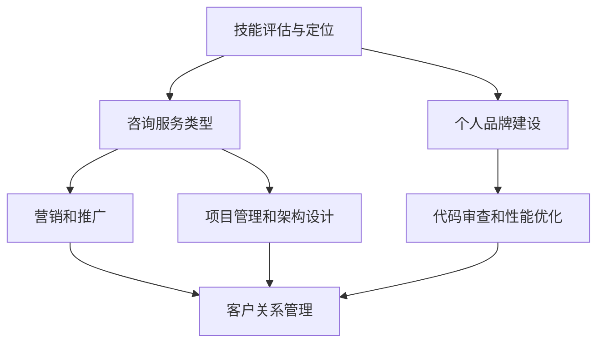
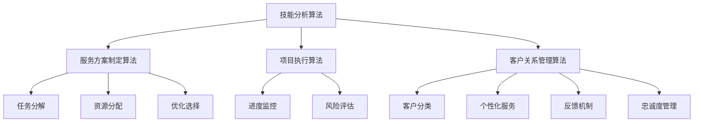

                 

### 背景介绍

在当今这个快速发展的数字时代，程序员不再仅仅是编写代码、解决技术问题的专业人士。他们逐渐成为了解决复杂业务需求的战略伙伴，提供创新的解决方案。随着技术的不断演进，越来越多的程序员开始将自己的专业技能转化为高端咨询服务，这不仅为他们带来了额外的收入，还为他们提供了一个展示才华和影响力的平台。

程序员向外界提供咨询服务的方式多种多样，从一对一的技术指导，到为企业定制软件开发，再到参与项目管理和架构设计，每一种方式都有其独特的价值。然而，如何有效地包装和推广个人技能，使其成为一个高端且具有吸引力的咨询服务，这是一个值得深入探讨的问题。

本文将围绕这一核心主题展开讨论。我们将首先介绍程序员如何评估和定位自己的技能，然后探讨如何将这些技能转化为有价值的咨询服务。接着，我们会深入分析如何制定专业的服务方案、打造个人品牌，以及如何通过营销和推广来吸引潜在客户。最后，我们会探讨如何在服务过程中保持高效和客户满意度，以及如何根据市场变化调整服务策略。

通过这一系列的探讨，希望能够帮助程序员们更好地理解如何将自己的技术专长转化为高端咨询服务，从而在竞争激烈的市场中脱颖而出。

### 核心概念与联系

在深入了解如何将程序员技能包装成高端咨询服务之前，我们有必要先了解一些核心概念和它们之间的联系。这些概念不仅为我们提供了理论基础，还为我们提供了实际操作中的指导。

**1. 技能评估与定位**

技能评估和定位是程序员成功提供咨询服务的基础。程序员需要对自己现有的技能进行全面的评估，包括技术能力、项目经验、解决问题的能力等。通过这种自我评估，程序员可以明确自己的强项和优势，从而在市场上找到精准的定位。

**2. 咨询服务类型**

程序员可以提供多种类型的咨询服务，包括但不限于以下几种：

- **技术指导**：为其他程序员或开发团队提供技术疑难解答和技术培训。
- **定制软件开发**：根据客户需求，为企业或个人定制开发软件解决方案。
- **项目管理和架构设计**：协助客户管理项目，提供系统架构设计建议。
- **代码审查和性能优化**：审查客户代码，提供优化建议，提升软件性能。

**3. 个人品牌建设**

个人品牌建设是提高咨询服务价值的重要因素。通过建立个人品牌，程序员可以在行业内树立自己的专业形象，吸引更多的客户。个人品牌包括技术博客、公开演讲、参与开源项目等。

**4. 营销和推广**

营销和推广是让潜在客户了解和信任程序员服务的关键环节。有效的营销策略包括社交媒体推广、内容营销、网络广告等。通过这些手段，程序员可以扩大自己的影响力，吸引更多的潜在客户。

**5. 客户关系管理**

在提供服务的过程中，良好的客户关系管理至关重要。这包括及时响应客户需求、提供高质量的解决方案、保持沟通畅通等。通过良好的客户关系管理，程序员不仅可以保持客户满意度，还可以通过口碑效应吸引更多的新客户。

下面是一个使用Mermaid绘制的流程图，展示了这些核心概念之间的联系：



通过这个流程图，我们可以清晰地看到，从技能评估与定位开始，程序员需要不断进行个人品牌建设，并通过营销和推广扩大影响力。在提供服务的过程中，还需要进行客户关系管理，确保服务质量和客户满意度。这些核心概念相互关联，共同构成了一个完整的咨询服务体系。

### 核心算法原理 & 具体操作步骤

在将程序员技能包装成高端咨询服务的过程中，核心算法原理的掌握和具体操作步骤的执行至关重要。这不仅能够确保服务的专业性和高质量，还能提高服务效率，从而在激烈的市场竞争中脱颖而出。

**1. 技能分析算法**

首先，程序员需要对自身的技能进行详细分析。这个步骤可以通过以下算法来实现：

- **技能清单生成**：程序员可以使用一个多维度的技能清单，将技能分为基础技能、高级技能和专项技能。基础技能包括编程语言、数据库管理、版本控制等，高级技能则包括算法设计、架构设计、性能优化等，专项技能则更加具体，如区块链、人工智能、大数据处理等。

- **技能评分算法**：对于每个技能维度，程序员可以设定一个评分标准，如使用5分制对技能水平进行评分。评分可以根据项目的经验、解决过的问题数量以及参与的项目质量等多个因素来决定。

- **技能权重分配**：不同的技能在咨询服务中的重要性不同，程序员可以设定权重系数，以便在技能评估中考虑这些差异。例如，对于技术指导服务，编程语言和算法设计的权重可能更高，而对于架构设计服务，系统设计和性能优化的权重则更为重要。

**2. 服务方案制定算法**

在明确了自身技能后，程序员需要根据客户需求制定合适的服务方案。以下是一个服务方案制定的算法框架：

- **需求分析**：通过与客户的交流，程序员需要明确客户的需求，包括项目的目标、预算、时间限制以及优先级等。

- **方案生成**：根据客户需求和自身的技能评分，程序员可以生成多个可能的解决方案。使用评分算法，每个方案都可以根据其可行性、成本、风险等因素进行评分。

- **优化选择**：通过迭代优化算法，程序员可以从多个方案中筛选出最优方案。优化算法可以基于目标函数，如最大化收益、最小化风险或最大化客户满意度等。

**3. 项目执行算法**

在服务方案确定后，项目执行是关键步骤。以下是一个项目执行的基本算法：

- **任务分解**：将项目任务分解为若干个子任务，每个子任务都对应特定的技能需求。

- **资源分配**：根据每个子任务的技能需求，将合适的资源（如程序员、开发环境、工具等）分配给每个子任务。

- **进度监控**：使用进度跟踪算法，如关键路径法（CPM）或项目评估与审查技术（PERT），来监控项目进度，及时发现和解决问题。

- **风险评估**：在项目执行过程中，定期进行风险评估，识别潜在的风险点，并制定相应的应对策略。

**4. 客户关系管理算法**

为了确保客户满意度和忠诚度，程序员需要使用客户关系管理算法：

- **客户分类**：根据客户的特点，如行业、公司规模、历史订单等，将客户进行分类。

- **个性化服务**：为不同类型的客户提供个性化的服务和解决方案，以满足他们的特定需求。

- **反馈机制**：建立客户反馈机制，定期收集客户对服务的反馈，并根据反馈进行改进。

- **忠诚度管理**：通过积分奖励、会员计划等方式，提高客户忠诚度，增加复购率。

下面是一个简化的Mermaid流程图，展示了核心算法原理和具体操作步骤的关联：



通过这个流程图，我们可以看到，从技能分析到服务方案制定，再到项目执行和客户关系管理，每一个步骤都紧密相连，共同构成了一个完整的咨询服务体系。程序员需要熟练掌握这些核心算法原理和操作步骤，才能提供高质量的服务，并在市场上建立竞争优势。

### 数学模型和公式 & 详细讲解 & 举例说明

在程序员提供咨询服务的过程中，掌握并运用数学模型和公式可以帮助他们更精确地分析和解决问题，提高服务质量和效率。以下是一些常见的数学模型和公式，以及它们的详细讲解和实际应用举例。

**1. 关键路径法（Critical Path Method, CPM）**

关键路径法是一种用于项目时间管理的数学模型，用于确定项目的最短完成时间和关键任务。

**公式：**
\[ \text{CPM} = \sum_{i=1}^{n} (\text{任务持续时间}) \]
其中，\( n \) 是项目中的任务数量。

**应用举例：**
假设有一个软件开发项目，包含以下任务：
- 任务A：需求分析，需2天完成
- 任务B：设计，需3天完成
- 任务C：编码，需5天完成
- 任务D：测试，需2天完成

使用CPM计算项目的最短完成时间：
\[ \text{CPM} = 2 + 3 + 5 + 2 = 12 \]
因此，项目的最短完成时间是12天。

**2. 佩特里网（Petri Net）**

佩特里网是一种用于系统建模和性能分析的数学模型，常用于分析并发系统和分布式系统的行为。

**公式：**
\[ \text{Token} = \sum_{i=1}^{n} (\text{输入变迁} \times \text{输入库所}) - \sum_{i=1}^{m} (\text{输出变迁} \times \text{输出库所}) \]
其中，\( n \) 是输入变迁的数量，\( m \) 是输出变迁的数量。

**应用举例：**
假设有一个并发系统，包含以下库所和变迁：
- 库所1：任务提交
- 库所2：任务分配
- 库所3：任务完成
- 变迁1：任务提交
- 变迁2：任务分配
- 变迁3：任务完成

初始时，库所1和库所2中都有1个Token。使用佩特里网分析系统的行为：
\[ \text{Token} = (1 \times 1) - (1 \times 0) = 1 \]
每次变迁发生时，Token在库所之间转移。例如，任务提交（变迁1）发生后，库所1中的Token减少，库所2中的Token增加。

**3. 决策树（Decision Tree）**

决策树是一种用于决策分析的数学模型，常用于风险评估和决策制定。

**公式：**
\[ \text{决策树} = \sum_{i=1}^{n} (\text{条件} \times \text{概率}) \]
其中，\( n \) 是决策树中的条件数量。

**应用举例：**
假设有一个风险评估决策树，包含以下条件：
- 条件1：风险高，概率为0.6
- 条件2：风险中，概率为0.3
- 条件3：风险低，概率为0.1

使用决策树计算总风险：
\[ \text{决策树} = (0.6 \times \text{高风险损失}) + (0.3 \times \text{中风险损失}) + (0.1 \times \text{低风险损失}) \]
根据具体的损失值，可以得到总风险。

**4. 贝叶斯网络（Bayesian Network）**

贝叶斯网络是一种用于概率推理和决策制定的数学模型，适用于不确定性问题。

**公式：**
\[ P(\text{事件}|\text{条件}) = \frac{P(\text{条件}|\text{事件}) \times P(\text{事件})}{P(\text{条件})} \]
其中，\( P(\text{事件}|\text{条件}) \) 是在给定条件下事件发生的概率，\( P(\text{条件}|\text{事件}) \) 是在事件发生的条件下条件发生的概率。

**应用举例：**
假设有一个天气预报的贝叶斯网络，包含以下事件和条件：
- 事件1：下雨
- 条件1：气温高
- 条件2：湿度高

使用贝叶斯网络计算下雨的概率：
\[ P(\text{下雨}|\text{气温高，湿度高}) = \frac{P(\text{气温高，湿度高}|\text{下雨}) \times P(\text{下雨})}{P(\text{气温高，湿度高})} \]
根据历史数据和条件概率表，可以得到下雨的概率。

通过这些数学模型和公式的运用，程序员可以在咨询服务中更准确地分析和解决问题，提供高质量的服务。这不仅能够提高客户满意度，还能在竞争激烈的市场中树立专业形象，赢得更多的客户信任。

### 项目实战：代码实际案例和详细解释说明

为了更好地展示如何将程序员技能转化为高端咨询服务，下面我们将通过一个实际项目案例来详细解释代码的实现过程、代码解读以及关键步骤的分析。

**项目背景：**

一个初创公司需要一个基于Python的自动化测试工具，用于其新开发的应用程序。该工具需要能够执行多个测试用例，记录测试结果，并生成测试报告。程序员作为咨询顾问，被委托来完成这个项目。

**开发环境搭建：**

为了搭建开发环境，程序员首先选择了Python作为主要编程语言，并安装了Python 3.8环境。接着，安装了以下必要的库和工具：

- `pip install pytest`：安装pytest库，用于编写和执行测试用例。
- `pip install selenium`：安装selenium库，用于Web应用的自动化测试。
- `pip install reportgenerator`：安装报告生成工具，用于生成测试报告。

**源代码详细实现：**

以下是自动化测试工具的核心代码实现：

```python
import pytest
from selenium import webdriver
from reportgenerator import generate_report

# 测试用例1：登录功能测试
def test_login():
    driver = webdriver.Chrome()
    driver.get("https://example.com/login")
    driver.find_element_by_name("username").send_keys("testuser")
    driver.find_element_by_name("password").send_keys("testpass")
    driver.find_element_by_css_selector(".login-btn").click()
    assert "Dashboard" in driver.title
    driver.quit()

# 测试用例2：搜索功能测试
def test_search():
    driver = webdriver.Chrome()
    driver.get("https://example.com/dashboard")
    search_box = driver.find_element_by_css_selector("#search-box")
    search_box.send_keys("example")
    search_box.submit()
    assert "example" in driver.title
    driver.quit()

# 测试用例3：注册功能测试
def test_register():
    driver = webdriver.Chrome()
    driver.get("https://example.com/register")
    driver.find_element_by_name("username").send_keys("newuser")
    driver.find_element_by_name("email").send_keys("newuser@example.com")
    driver.find_element_by_name("password").send_keys("newpass")
    driver.find_element_by_css_selector(".register-btn").click()
    assert "Registration Successful" in driver.page_source
    driver.quit()

# 测试用例汇总
def test_suite():
    pytest.main(["-v", "test_tests.py"])

# 生成测试报告
def generate_report():
    report_file = "test_report.html"
    pytest.main(["--html", report_file, "test_tests.py"])
    generate_report(report_file)

if __name__ == "__main__":
    generate_report()
```

**代码解读与分析：**

1. **测试用例编写**：
   代码中包含了三个测试用例，分别是登录功能测试、搜索功能测试和注册功能测试。每个测试用例都使用`pytest`库进行编写，通过`webdriver`库控制浏览器执行操作，并使用断言（`assert`）来验证预期结果。

2. **浏览器控制**：
   使用`selenium`库来控制浏览器，该库支持多种浏览器，如Chrome、Firefox等。在本例中，选择使用Chrome浏览器。在每个测试用例中，都创建了`webdriver.Chrome()`对象，并在测试结束后调用`driver.quit()`关闭浏览器。

3. **报告生成**：
   `generate_report()`函数用于生成测试报告。通过调用`pytest.main()`函数，执行测试用例，并生成HTML格式的测试报告。报告生成后，可以使用浏览器直接查看。

**关键步骤分析：**

1. **测试环境配置**：
   程序员需要确保开发环境和测试环境的配置一致，包括浏览器驱动程序的安装和配置。本例中，通过安装`chromedriver`作为Chrome浏览器的驱动程序，确保浏览器可以正常工作。

2. **测试用例执行**：
   使用`pytest`库编写测试用例，并通过`pytest.main()`函数执行。`pytest`是一个流行的测试框架，支持多种测试功能，如断言、参数化测试等。

3. **结果验证与报告生成**：
   在每个测试用例中，通过断言来验证测试结果。测试完成后，生成详细的测试报告，便于开发团队了解测试结果。

通过这个实际项目案例，我们可以看到程序员是如何利用其技能开发出高质量的自动化测试工具，并通过详细的代码解读和分析，为客户提供专业的咨询服务。这不仅展示了程序员的技术能力，也为客户提供了可靠的解决方案。

### 实际应用场景

在实际应用中，程序员将个人技能包装成高端咨询服务可以涵盖多个领域，每种服务都有其独特的需求和操作步骤。以下是一些典型的应用场景及其对应的操作步骤：

**1. 企业技术咨询服务**

**需求分析：**
- **第一步**：与客户进行初步沟通，了解企业的业务背景、技术现状和面临的挑战。
- **第二步**：通过问卷调查或访谈，收集详细的需求信息。

**服务方案制定：**
- **第三步**：根据客户需求，制定详细的服务方案，包括技术架构设计、开发计划、资源需求等。
- **第四步**：与客户确认服务方案，并签订合同。

**项目执行：**
- **第五步**：组建团队，明确任务分工和进度计划。
- **第六步**：按照计划开展项目开发，进行代码审查和性能优化。
- **第七步**：定期与客户沟通，汇报项目进度和成果。

**客户关系管理：**
- **第八步**：在项目完成后，进行客户满意度调查，收集反馈。
- **第九步**：根据反馈进行改进，并持续提供技术支持和服务。

**2. 个人技术指导与培训服务**

**需求分析：**
- **第一步**：通过在线平台或个人网站，发布培训课程或咨询服务的介绍和案例。
- **第二步**：根据学员的背景和需求，提供定制化的培训计划。

**服务方案制定：**
- **第三步**：确定培训课程的内容、时间安排和培训方式。
- **第四步**：与学员确认培训计划，并安排授课时间。

**项目执行：**
- **第五步**：按照计划开展培训课程，使用教学工具和案例进行讲解。
- **第六步**：定期进行学员反馈收集，并根据反馈进行调整。

**客户关系管理：**
- **第七步**：培训结束后，提供学习资料和后续支持。
- **第八步**：通过社交媒体、在线论坛等渠道，与学员保持联系，建立长期合作关系。

**3. 软件定制开发服务**

**需求分析：**
- **第一步**：与客户进行深入交流，了解软件的具体功能和需求。
- **第二步**：编写详细的软件需求规格说明书。

**服务方案制定：**
- **第三步**：根据需求规格，制定软件开发方案，包括技术选型、开发周期和预算等。
- **第四步**：与客户确认开发方案，并签订合同。

**项目执行：**
- **第五步**：组建开发团队，明确任务分工和进度计划。
- **第六步**：按照计划进行软件设计、编码和测试。
- **第七步**：定期与客户沟通，提供进度更新和成果展示。

**客户关系管理：**
- **第八步**：软件交付后，进行客户验收测试，并根据客户反馈进行修改。
- **第九步**：提供长期的技术支持和服务，确保软件稳定运行。

**4. 项目管理与架构设计服务**

**需求分析：**
- **第一步**：了解项目的背景、目标和现有架构。
- **第二步**：与项目团队成员沟通，了解项目现状和挑战。

**服务方案制定：**
- **第三步**：制定项目管理和架构设计方案，包括技术选型、团队组织结构和项目管理流程。
- **第四步**：与客户确认方案，并签订合同。

**项目执行：**
- **第五步**：按照计划开展项目管理和架构设计工作，确保项目按期完成。
- **第六步**：定期与项目团队成员和客户沟通，解决项目中遇到的问题。

**客户关系管理：**
- **第七步**：项目完成后，进行项目回顾和总结，收集客户反馈。
- **第八步**：根据反馈进行改进，提供持续的技术支持和服务。

通过这些实际应用场景的详细描述，程序员可以更好地理解如何在不同的服务类型中操作，从而为客户提供高质量、高价值的咨询服务。

### 工具和资源推荐

为了有效地包装和推广个人技能，程序员需要依赖一系列工具和资源。以下是一些推荐的工具和资源，包括学习资源、开发工具框架以及相关论文和著作。

**1. 学习资源推荐**

- **书籍：**
  - 《深度学习》（Deep Learning）——Ian Goodfellow、Yoshua Bengio和Aaron Courville著，适合学习人工智能和深度学习的基本概念。
  - 《设计模式：可复用面向对象软件的基础》（Design Patterns: Elements of Reusable Object-Oriented Software）——Erich Gamma、Richard Helm、Ralph Johnson和John Vlissides著，适合学习软件设计和架构设计。
  - 《Effective Java》——Joshua Bloch著，适合提高Java编程技能。

- **论文：**
  - “A Framework for Retrospective Memory in Neural Networks” ——Hanson and Burr (1989)，探讨了神经网络中的记忆机制。
  - “The Mythical Man-Month” ——Frederick P. Brooks Jr.著，讨论了软件项目管理和团队协作。

- **博客和网站：**
  - PyTorch官方文档（pytorch.org）——提供了丰富的深度学习资源。
  - GitHub（github.com）——用于查找和参与开源项目，提升编程技能。
  - Stack Overflow（stackoverflow.com）——在线编程问答社区，适合解决编程问题。

**2. 开发工具框架推荐**

- **版本控制：**
  - Git：用于代码版本控制和团队协作。
  - GitHub Actions：自动化的持续集成和持续部署工具。

- **编程环境：**
  - PyCharm：一款强大的Python IDE，支持多种编程语言。
  - Jupyter Notebook：用于数据科学和机器学习的交互式开发环境。

- **测试工具：**
  - pytest：Python的测试框架，用于自动化测试。
  - Selenium：Web应用的自动化测试工具。

- **容器化技术：**
  - Docker：用于容器化应用，简化部署和扩展。
  - Kubernetes：用于容器编排和管理。

**3. 相关论文著作推荐**

- **“Learning to Learn: Introduction to Machine Learning Algorithms”** ——Andreas C. Müller和Sarah Guido著，适合初学者了解机器学习算法。
- **“Big Data: A Revolution That Will Transform How We Live, Work, and Think”** —— Viktor Mayer-Schönberger和Kenneth Cukier著，探讨大数据对社会的影响。
- **“Clean Code: A Handbook of Agile Software Craftsmanship”** ——Robert C. Martin著，提供了编写高质量代码的指导。

通过这些工具和资源的支持，程序员可以不断提升自己的技能，并在市场上提供更具竞争力的高端咨询服务。

### 总结：未来发展趋势与挑战

随着技术的不断进步，程序员提供的高端咨询服务也将面临新的发展趋势和挑战。首先，人工智能和机器学习技术的快速发展，为程序员提供了更多的机会，例如自动化测试、智能数据分析等领域的应用。然而，这也带来了巨大的挑战，程序员需要不断学习最新的技术，以保持自身的竞争力。

其次，云计算和容器化技术的普及，使得程序员可以更灵活地提供服务。例如，通过容器化技术，程序员可以快速部署和扩展应用程序，满足不同客户的需求。但是，这也要求程序员掌握更多的云计算和容器化工具，如Docker和Kubernetes。

此外，随着远程工作和远程协作的普及，程序员需要具备更强的沟通能力和团队合作精神。如何有效地管理远程团队，确保项目按时交付，是一个新的挑战。

最后，程序员在提供高端咨询服务时，需要关注客户需求的变化和市场趋势。只有不断调整服务策略，才能在激烈的市场竞争中保持领先地位。

总之，未来程序员提供的高端咨询服务将更加多元化、专业化，同时也面临更多的技术挑战和管理挑战。只有不断学习和适应，才能在市场中脱颖而出。

### 附录：常见问题与解答

**Q1：如何评估和定位自己的技能？**
**A1：** 评估和定位技能的第一步是创建一个详细的技能清单，包括编程语言、数据库管理、算法设计等。接下来，可以通过项目经验、解决问题的能力以及参与的开源项目来为每个技能评分。最后，根据评分和市场需求，确定自己的专业技能和优势领域。

**Q2：如何制定专业的服务方案？**
**A2：** 制定服务方案需要详细了解客户需求，包括项目的目标、预算和时间限制。然后，可以根据自身的技能和经验，设计多种可能的解决方案，并使用评分算法选择最优方案。最后，与服务方案进行确认，确保满足客户需求。

**Q3：如何通过营销和推广吸引潜在客户？**
**A3：** 营销和推广可以通过社交媒体、内容营销、网络广告等多种渠道进行。建立个人品牌，如发布技术博客、参与开源项目、参与行业会议等，可以提升知名度。此外，提供免费试用或优惠活动，可以吸引潜在客户。

**Q4：如何在服务过程中保持高效和客户满意度？**
**A4：** 保持高效和客户满意度需要良好的项目管理技巧和沟通能力。使用项目管理工具，如Jira或Trello，来跟踪任务和进度。定期与客户沟通，及时解决出现的问题，并收集客户反馈，进行服务改进。

**Q5：如何根据市场变化调整服务策略？**
**A5：** 需要定期分析市场趋势和客户需求，了解技术发展方向。通过市场调研、客户反馈和行业报告，可以获取有价值的信息。根据这些信息，调整服务内容、价格策略和营销手段，以适应市场变化。

### 扩展阅读 & 参考资料

为了帮助读者进一步深入了解本文讨论的主题，以下是一些扩展阅读和参考资料，涵盖了程序员将个人技能包装成高端咨询服务的各个方面：

1. **技术书籍推荐：**
   - 《程序员代码面试指南：IT名企算法与数据结构题目最优解》——何海涛著，详细介绍了面试中常见的数据结构和算法问题及其解决方案。
   - 《数据结构与算法分析》——Mark Allen Weiss著，深入讲解了数据结构和算法的基本原理。
   - 《深度学习》——Ian Goodfellow、Yoshua Bengio和Aaron Courville著，全面介绍了深度学习的理论和实践。

2. **学术论文推荐：**
   - “Learning to Learn: Introduction to Machine Learning Algorithms” ——Andreas C. Müller和Sarah Guido著，适合初学者了解机器学习算法。
   - “A Framework for Retrospective Memory in Neural Networks” ——Hanson and Burr (1989)，探讨了神经网络中的记忆机制。
   - “The Mythical Man-Month” ——Frederick P. Brooks Jr.著，讨论了软件项目管理和团队协作。

3. **技术博客和网站推荐：**
   - PyTorch官方文档（pytorch.org）：提供深度学习技术的详细文档和教程。
   - GitHub（github.com）：查找和参与开源项目，提升编程技能。
   - Stack Overflow（stackoverflow.com）：在线编程问答社区，解决编程问题。

4. **在线课程和培训推荐：**
   - Coursera（coursera.org）：提供各种技术领域的在线课程，如人工智能、机器学习等。
   - Udemy（udemy.com）：提供大量技术培训和教程，涵盖编程语言、数据结构等。

5. **行业报告和研究：**
   - Gartner（gartner.com）：提供有关技术趋势和市场分析的行业报告。
   - IEEE（ieee.org）：发布关于计算机科学和工程领域的研究论文和报告。

通过这些扩展阅读和参考资料，读者可以深入了解程序员如何将个人技能包装成高端咨询服务，并在实践中不断提升自己的专业水平。

