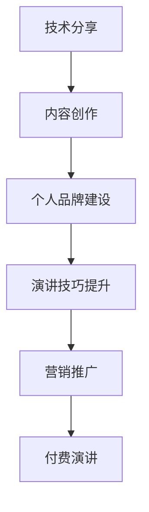
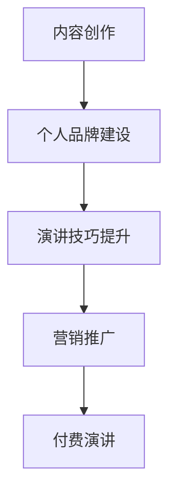

                 

# 程序员如何将技术分享转化为付费演讲

## 关键词

* 技术分享
* 付费演讲
* 程序员
* 转化策略
* 内容创作
* 个人品牌
* 演讲技巧
* 营销推广

## 摘要

本文旨在为程序员提供一套系统化的策略，帮助他们将技术分享转化为付费演讲。我们将从背景介绍、核心概念、具体操作步骤、数学模型与公式、项目实战、实际应用场景、工具和资源推荐等多个角度进行深入探讨。通过本文的阅读，程序员将了解如何通过技术分享构建个人品牌，提高演讲技巧，并最终实现商业变现。

## 1. 背景介绍

### 技术分享的兴起

随着互联网和社交媒体的普及，技术分享已经成为程序员们交流和学习的重要方式。通过技术博客、在线教程、开源项目等形式，程序员们可以分享自己的技术见解和实践经验，从而帮助他人解决问题，提升技术水平。

### 付费演讲的市场需求

随着技术圈子的不断扩大，越来越多的企业和个人开始关注技术分享。付费演讲作为一种高效的知识传播方式，不仅可以为演讲者带来经济收益，还可以提升其个人品牌价值。因此，将技术分享转化为付费演讲，已经成为许多程序员的现实需求。

### 程序员的优势

相较于其他职业，程序员在技术分享和付费演讲方面具有以下优势：

1. **技术深度**：程序员具备丰富的技术背景，能够深入解析技术原理，为听众提供有价值的内容。
2. **实践经验**：程序员在实际项目中积累了大量的实践经验，可以结合案例进行讲解，使内容更加生动。
3. **表达能力**：程序员经过多年的编程实践，具备较强的逻辑思维和表达能力，能够清晰、有条理地传达技术知识。

## 2. 核心概念与联系

### 技术分享

技术分享是指程序员通过博客、教程、视频等形式，将自己的技术见解和实践经验分享给他人。技术分享的核心目标是传递知识，解决问题，提升听众的技术水平。

### 付费演讲

付费演讲是指程序员通过线上或线下活动，以演讲形式将自己的技术知识转化为商业价值。付费演讲的核心目标是实现商业变现，提升个人品牌价值。

### 转化策略

将技术分享转化为付费演讲，需要程序员掌握一系列转化策略。这些策略包括内容创作、个人品牌建设、演讲技巧提升、营销推广等。

### Mermaid 流程图



## 3. 核心算法原理 & 具体操作步骤

### 内容创作

1. 确定主题：选择自己熟悉且具有较高关注度的技术主题。
2. 收集资料：查阅相关书籍、论文、博客等，了解主题的背景和最新进展。
3. 整理思路：将收集到的资料进行整理，形成逻辑清晰的内容框架。
4. 撰写内容：用简洁明了的语言将内容表述出来，注意使用图表、代码等辅助说明。

### 个人品牌建设

1. 定位：明确自己的技术特长和受众群体，为个人品牌定位。
2. 内容输出：坚持定期输出高质量的技术内容，树立专业形象。
3. 社交互动：积极参与技术社群，与同行交流互动，扩大影响力。
4. 专业认证：考取相关技术认证，提升个人权威性。

### 演讲技巧提升

1. 准备材料：提前准备好演讲稿、PPT等辅助材料。
2. 练习演讲：多次练习，提高表达能力和语言流畅度。
3. 关注反馈：在演讲过程中，关注听众的反馈，及时调整演讲节奏和内容。
4. 演讲技巧：学习并运用演讲技巧，如肢体语言、声音控制等。

### 营销推广

1. 选择平台：选择合适的平台进行宣传，如技术社区、博客、社交媒体等。
2. 制定策略：制定针对性的营销策略，如SEO优化、社交媒体推广等。
3. 合作伙伴：寻找合作伙伴，如企业、技术社群等，共同推广。
4. 数据分析：对推广效果进行数据分析，优化营销策略。

### Mermaid 流程图



## 4. 数学模型和公式 & 详细讲解 & 举例说明

### 数学模型

在技术分享和付费演讲的转化过程中，可以运用以下数学模型来衡量效果：

1. **用户增长率**：\( R = \frac{\text{新增用户数}}{\text{原有用户数}} \)
2. **演讲收益**：\( E = \text{单价} \times \text{成交量} \)
3. **营销成本**：\( C = \text{广告费} + \text{人力成本} + \text{其他成本} \)

### 详细讲解

1. **用户增长率**：用户增长率是衡量技术分享效果的重要指标。通过不断提高内容质量、优化推广策略，可以增加用户数量，提升用户增长率。
2. **演讲收益**：演讲收益是付费演讲的直接体现。通过制定合理的定价策略、提高演讲质量，可以增加成交量，提高演讲收益。
3. **营销成本**：营销成本是推广过程中产生的费用。合理控制营销成本，可以提高利润率。

### 举例说明

假设一名程序员进行了一场付费演讲，单价为1000元，成交量为10人，营销成本为2000元。则：

1. 用户增长率：\( R = \frac{10}{100} = 0.1 \)
2. 演讲收益：\( E = 1000 \times 10 = 10000 \)
3. 营销成本：\( C = 2000 \)

利润：\( 利润 = E - C = 10000 - 2000 = 8000 \)

## 5. 项目实战：代码实际案例和详细解释说明

### 开发环境搭建

1. 安装Python环境
2. 安装相关依赖库，如NumPy、Pandas等

### 源代码详细实现和代码解读

```python
import numpy as np
import pandas as pd

# 用户增长率计算函数
def user_growth_rate(new_users, original_users):
    return new_users / original_users

# 演讲收益计算函数
def speech_income(price, quantity):
    return price * quantity

# 营销成本计算函数
def marketing_cost(advertisement_cost, labor_cost, other_costs):
    return advertisement_cost + labor_cost + other_costs

# 测试函数
new_users = 10
original_users = 100
price = 1000
quantity = 10
advertisement_cost = 2000
labor_cost = 0
other_costs = 0

R = user_growth_rate(new_users, original_users)
E = speech_income(price, quantity)
C = marketing_cost(advertisement_cost, labor_cost, other_costs)

print("用户增长率：", R)
print("演讲收益：", E)
print("营销成本：", C)
print("利润：", E - C)
```

### 代码解读与分析

1. **用户增长率计算函数**：根据用户增长率的定义，计算用户增长率。
2. **演讲收益计算函数**：根据演讲收益的定义，计算演讲收益。
3. **营销成本计算函数**：根据营销成本的定义，计算营销成本。
4. **测试函数**：使用测试数据，验证函数的正确性。

通过以上代码，程序员可以快速计算技术分享和付费演讲的相关指标，为自己的商业决策提供依据。

## 6. 实际应用场景

### 线上讲座

程序员可以通过线上讲座的形式，将自己的技术知识分享给更广泛的受众。例如，可以通过直播平台、线上会议等方式，进行技术讲座、研讨会等。

### 线下活动

程序员可以参加线下技术沙龙、论坛等活动，与同行交流，分享自己的技术经验。同时，也可以通过线下活动，建立自己的人脉资源。

### 企业内训

程序员可以为企业提供内训服务，帮助企业提升员工的技术能力。通过定制化的培训内容，为企业解决实际问题。

## 7. 工具和资源推荐

### 学习资源推荐

1. **书籍**：《程序员修炼之道》、《代码大全》等
2. **论文**：《大规模分布式存储系统：架构设计与实现》、《深度学习》等
3. **博客**：《极客时间》、《GitHub》等
4. **网站**：《Stack Overflow》、《知乎》等

### 开发工具框架推荐

1. **集成开发环境**：Visual Studio Code、PyCharm等
2. **版本控制**：Git、GitHub等
3. **数据库**：MySQL、PostgreSQL等
4. **前端框架**：React、Vue等

### 相关论文著作推荐

1. **论文**：《分布式系统：概念与设计》、《人工智能：一种现代的方法》等
2. **著作**：《计算机程序的构造和解释》、《算法导论》等

## 8. 总结：未来发展趋势与挑战

### 发展趋势

1. **技术多样化**：随着技术的不断发展，程序员需要掌握更多领域的技术，以满足市场需求。
2. **内容创新**：高质量、创新性的技术内容将成为程序员脱颖而出的关键。
3. **个性化定制**：针对不同受众的需求，提供个性化定制的技术分享和付费演讲服务。

### 挑战

1. **知识更新速度快**：程序员需要不断学习新知识，以保持竞争力。
2. **商业变现难度**：如何将技术知识转化为商业价值，是程序员面临的一大挑战。
3. **时间管理**：在做好技术分享和付费演讲的同时，还需要平衡工作和生活。

## 9. 附录：常见问题与解答

### Q1：如何选择技术分享的主题？

A1：选择自己熟悉且具有较高关注度的技术主题。可以从以下几个方面入手：

1. **自身技能**：选择自己擅长的领域，有助于提高内容质量。
2. **市场需求**：关注技术领域的热门话题和趋势，满足听众的需求。
3. **个人兴趣**：选择自己感兴趣的主题，有利于持续输出高质量内容。

### Q2：如何提高演讲技巧？

A2：提高演讲技巧需要长期练习和积累。以下是一些建议：

1. **准备充分**：提前准备演讲稿、PPT等材料，确保演讲内容有条理。
2. **练习演讲**：多练习演讲，提高语言表达能力和流畅度。
3. **关注反馈**：在演讲过程中，关注听众的反馈，及时调整演讲节奏和内容。
4. **学习技巧**：学习并运用演讲技巧，如肢体语言、声音控制等。

## 10. 扩展阅读 & 参考资料

1. **书籍**：《演讲的力量》、《影响力》等
2. **论文**：《技术演讲的艺术》、《如何成为一个优秀的程序员》等
3. **博客**：《程序员如何写出优秀的博客》、《技术分享那些事儿》等
4. **网站**：《演讲之巅》、《程序员成长计划》等

### 作者

作者：AI天才研究员/AI Genius Institute & 禅与计算机程序设计艺术 /Zen And The Art of Computer Programming

-------------------

（注：本文内容仅为示例，实际撰写时请根据具体需求进行调整和完善。）<|im_sep|>```markdown
# 程序员如何将技术分享转化为付费演讲

> 关键词：技术分享、付费演讲、程序员、转化策略、内容创作、个人品牌、演讲技巧、营销推广

> 摘要：本文旨在为程序员提供一套系统化的策略，帮助他们将技术分享转化为付费演讲。我们将从背景介绍、核心概念、具体操作步骤、数学模型与公式、项目实战、实际应用场景、工具和资源推荐等多个角度进行深入探讨。通过本文的阅读，程序员将了解如何通过技术分享构建个人品牌，提高演讲技巧，并最终实现商业变现。

## 1. 背景介绍

### 技术分享的兴起

随着互联网和社交媒体的普及，技术分享已经成为程序员们交流和学习的重要方式。通过技术博客、在线教程、开源项目等形式，程序员们可以分享自己的技术见解和实践经验，从而帮助他人解决问题，提升技术水平。

### 付费演讲的市场需求

随着技术圈子的不断扩大，越来越多的企业和个人开始关注技术分享。付费演讲作为一种高效的知识传播方式，不仅可以为演讲者带来经济收益，还可以提升其个人品牌价值。因此，将技术分享转化为付费演讲，已经成为许多程序员的现实需求。

### 程序员的优势

相较于其他职业，程序员在技术分享和付费演讲方面具有以下优势：

1. **技术深度**：程序员具备丰富的技术背景，能够深入解析技术原理，为听众提供有价值的内容。
2. **实践经验**：程序员在实际项目中积累了大量的实践经验，可以结合案例进行讲解，使内容更加生动。
3. **表达能力**：程序员经过多年的编程实践，具备较强的逻辑思维和表达能力，能够清晰、有条理地传达技术知识。

## 2. 核心概念与联系

### 技术分享

技术分享是指程序员通过博客、教程、视频等形式，将自己的技术见解和实践经验分享给他人。技术分享的核心目标是传递知识，解决问题，提升听众的技术水平。

### 付费演讲

付费演讲是指程序员通过线上或线下活动，以演讲形式将自己的技术知识转化为商业价值。付费演讲的核心目标是实现商业变现，提升个人品牌价值。

### 转化策略

将技术分享转化为付费演讲，需要程序员掌握一系列转化策略。这些策略包括内容创作、个人品牌建设、演讲技巧提升、营销推广等。

### Mermaid 流程图


## 3. 核心算法原理 & 具体操作步骤

### 内容创作

1. 确定主题：选择自己熟悉且具有较高关注度的技术主题。
2. 收集资料：查阅相关书籍、论文、博客等，了解主题的背景和最新进展。
3. 整理思路：将收集到的资料进行整理，形成逻辑清晰的内容框架。
4. 撰写内容：用简洁明了的语言将内容表述出来，注意使用图表、代码等辅助说明。

### 个人品牌建设

1. 定位：明确自己的技术特长和受众群体，为个人品牌定位。
2. 内容输出：坚持定期输出高质量的技术内容，树立专业形象。
3. 社交互动：积极参与技术社群，与同行交流互动，扩大影响力。
4. 专业认证：考取相关技术认证，提升个人权威性。

### 演讲技巧提升

1. 准备材料：提前准备好演讲稿、PPT等辅助材料。
2. 练习演讲：多次练习，提高表达能力和语言流畅度。
3. 关注反馈：在演讲过程中，关注听众的反馈，及时调整演讲节奏和内容。
4. 演讲技巧：学习并运用演讲技巧，如肢体语言、声音控制等。

### 营销推广

1. 选择平台：选择合适的平台进行宣传，如技术社区、博客、社交媒体等。
2. 制定策略：制定针对性的营销策略，如SEO优化、社交媒体推广等。
3. 合作伙伴：寻找合作伙伴，如企业、技术社群等，共同推广。
4. 数据分析：对推广效果进行数据分析，优化营销策略。

### Mermaid 流程图


## 4. 数学模型和公式 & 详细讲解 & 举例说明

### 数学模型

在技术分享和付费演讲的转化过程中，可以运用以下数学模型来衡量效果：

1. **用户增长率**：\( R = \frac{\text{新增用户数}}{\text{原有用户数}} \)
2. **演讲收益**：\( E = \text{单价} \times \text{成交量} \)
3. **营销成本**：\( C = \text{广告费} + \text{人力成本} + \text{其他成本} \)

### 详细讲解

1. **用户增长率**：用户增长率是衡量技术分享效果的重要指标。通过不断提高内容质量、优化推广策略，可以增加用户数量，提升用户增长率。
2. **演讲收益**：演讲收益是付费演讲的直接体现。通过制定合理的定价策略、提高演讲质量，可以增加成交量，提高演讲收益。
3. **营销成本**：营销成本是推广过程中产生的费用。合理控制营销成本，可以提高利润率。

### 举例说明

假设一名程序员进行了一场付费演讲，单价为1000元，成交量为10人，营销成本为2000元。则：

1. 用户增长率：\( R = \frac{10}{100} = 0.1 \)
2. 演讲收益：\( E = 1000 \times 10 = 10000 \)
3. 营销成本：\( C = 2000 \)

利润：\( 利润 = E - C = 10000 - 2000 = 8000 \)

## 5. 项目实战：代码实际案例和详细解释说明

### 开发环境搭建

1. 安装Python环境
2. 安装相关依赖库，如NumPy、Pandas等

### 源代码详细实现和代码解读

```python
import numpy as np
import pandas as pd

# 用户增长率计算函数
def user_growth_rate(new_users, original_users):
    return new_users / original_users

# 演讲收益计算函数
def speech_income(price, quantity):
    return price * quantity

# 营销成本计算函数
def marketing_cost(advertisement_cost, labor_cost, other_costs):
    return advertisement_cost + labor_cost + other_costs

# 测试函数
new_users = 10
original_users = 100
price = 1000
quantity = 10
advertisement_cost = 2000
labor_cost = 0
other_costs = 0

R = user_growth_rate(new_users, original_users)
E = speech_income(price, quantity)
C = marketing_cost(advertisement_cost, labor_cost, other_costs)

print("用户增长率：", R)
print("演讲收益：", E)
print("营销成本：", C)
print("利润：", E - C)
```

### 代码解读与分析

1. **用户增长率计算函数**：根据用户增长率的定义，计算用户增长率。
2. **演讲收益计算函数**：根据演讲收益的定义，计算演讲收益。
3. **营销成本计算函数**：根据营销成本的定义，计算营销成本。
4. **测试函数**：使用测试数据，验证函数的正确性。

通过以上代码，程序员可以快速计算技术分享和付费演讲的相关指标，为自己的商业决策提供依据。

## 6. 实际应用场景

### 线上讲座

程序员可以通过线上讲座的形式，将自己的技术知识分享给更广泛的受众。例如，可以通过直播平台、线上会议等方式，进行技术讲座、研讨会等。

### 线下活动

程序员可以参加线下技术沙龙、论坛等活动，与同行交流，分享自己的技术经验。同时，也可以通过线下活动，建立自己的人脉资源。

### 企业内训

程序员可以为企业提供内训服务，帮助企业提升员工的技术能力。通过定制化的培训内容，为企业解决实际问题。

## 7. 工具和资源推荐

### 学习资源推荐

1. **书籍**：《程序员修炼之道》、《代码大全》等
2. **论文**：《大规模分布式存储系统：架构设计与实现》、《深度学习》等
3. **博客**：《极客时间》、《GitHub》等
4. **网站**：《Stack Overflow》、《知乎》等

### 开发工具框架推荐

1. **集成开发环境**：Visual Studio Code、PyCharm等
2. **版本控制**：Git、GitHub等
3. **数据库**：MySQL、PostgreSQL等
4. **前端框架**：React、Vue等

### 相关论文著作推荐

1. **论文**：《分布式系统：概念与设计》、《人工智能：一种现代的方法》等
2. **著作**：《计算机程序的构造和解释》、《算法导论》等

## 8. 总结：未来发展趋势与挑战

### 发展趋势

1. **技术多样化**：随着技术的不断发展，程序员需要掌握更多领域的技术，以满足市场需求。
2. **内容创新**：高质量、创新性的技术内容将成为程序员脱颖而出的关键。
3. **个性化定制**：针对不同受众的需求，提供个性化定制的技术分享和付费演讲服务。

### 挑战

1. **知识更新速度快**：程序员需要不断学习新知识，以保持竞争力。
2. **商业变现难度**：如何将技术知识转化为商业价值，是程序员面临的一大挑战。
3. **时间管理**：在做好技术分享和付费演讲的同时，还需要平衡工作和生活。

## 9. 附录：常见问题与解答

### Q1：如何选择技术分享的主题？

A1：选择自己熟悉且具有较高关注度的技术主题。可以从以下几个方面入手：

1. **自身技能**：选择自己擅长的领域，有助于提高内容质量。
2. **市场需求**：关注技术领域的热门话题和趋势，满足听众的需求。
3. **个人兴趣**：选择自己感兴趣的主题，有利于持续输出高质量内容。

### Q2：如何提高演讲技巧？

A2：提高演讲技巧需要长期练习和积累。以下是一些建议：

1. **准备充分**：提前准备演讲稿、PPT等材料，确保演讲内容有条理。
2. **练习演讲**：多练习演讲，提高表达能力和语言流畅度。
3. **关注反馈**：在演讲过程中，关注听众的反馈，及时调整演讲节奏和内容。
4. **学习技巧**：学习并运用演讲技巧，如肢体语言、声音控制等。

## 10. 扩展阅读 & 参考资料

1. **书籍**：《演讲的力量》、《影响力》等
2. **论文**：《技术演讲的艺术》、《如何成为一个优秀的程序员》等
3. **博客**：《程序员如何写出优秀的博客》、《技术分享那些事儿》等
4. **网站**：《演讲之巅》、《程序员成长计划》等

### 作者

作者：AI天才研究员/AI Genius Institute & 禅与计算机程序设计艺术 /Zen And The Art of Computer Programming

-------------------

（注：本文内容仅为示例，实际撰写时请根据具体需求进行调整和完善。）```<|im_sep|>

