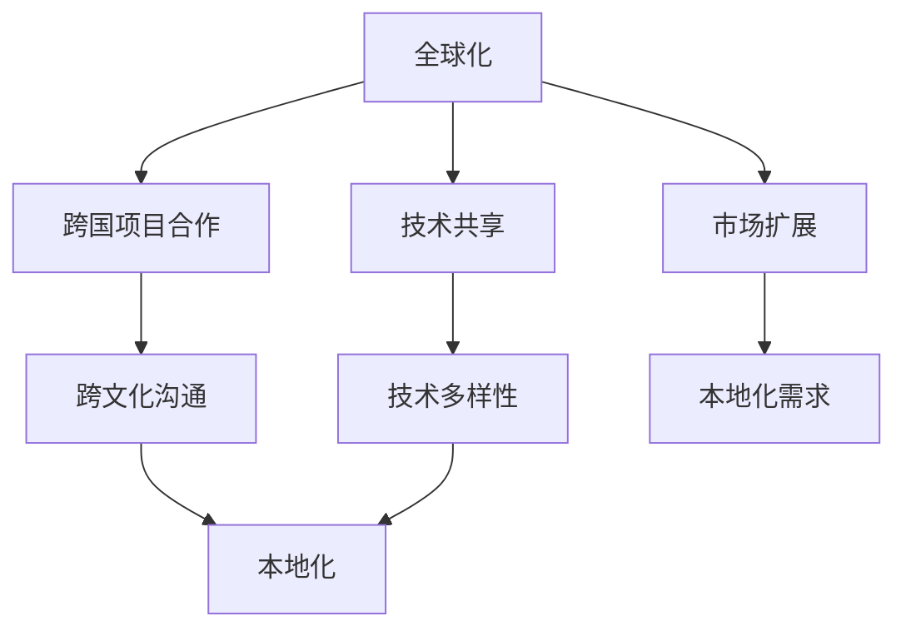

                 

### 文章标题

《程序员如何应对全球化与本地化的双重挑战》

关键词：全球化、本地化、程序员、国际化、跨文化、软件开发

摘要：本文旨在探讨程序员在全球化与本地化双重挑战下如何应对。通过深入分析全球软件开发趋势、跨文化沟通、本地化技术，以及实际案例的剖析，作者将提供一系列策略和工具，帮助程序员提升跨文化协作能力，实现全球化背景下的本地化应用开发。

## 1. 背景介绍

在当今信息化、全球化的时代，软件开发的范畴已经远远超出了国界。程序员面临着前所未有的挑战，既要适应全球化的开发模式，又要考虑本地化需求。全球化带来了技术共享、资源整合、市场扩展等机遇，但同时也带来了跨文化沟通、技术标准统一、本地化需求等多重挑战。

全球化是指全球范围内的经济、政治、文化等各个领域的互动和融合。对于程序员而言，全球化意味着可以在全球范围内寻找最佳的开发资源，参与跨国项目，学习最新的技术趋势。然而，全球化也意味着需要应对跨文化的差异，如语言障碍、文化习俗、工作习惯等。

本地化则是指根据不同地区用户的需求，对软件进行适应性调整。随着全球化的发展，本地化需求变得越来越重要，尤其是在不同国家和地区的市场推广中。程序员需要掌握多种本地化技术，如多语言支持、文化敏感性设计、法律法规遵循等。

在全球化与本地化双重挑战下，程序员需要具备跨文化沟通能力、技术多样性和本地化思维。这不仅关系到项目的成功，也关系到个人职业发展。本文将从多个角度探讨程序员如何应对这些挑战，提供实用的策略和工具。

### 2. 核心概念与联系

在深入探讨全球化与本地化对程序员的影响之前，我们需要明确几个核心概念：全球化、本地化、国际化。

**全球化**：全球化是指全球范围内的经济、政治、文化等各个领域的互动和融合。在软件开发领域，全球化体现在跨国项目合作、技术共享、市场扩展等方面。

**本地化**：本地化是指根据不同地区用户的需求，对软件进行适应性调整。本地化需要考虑语言、文化、法规等多方面因素。

**国际化**：国际化是指产品或服务在全球范围内的通用性和适应性。国际化侧重于产品的通用设计，以适应不同地区的市场需求。

这三个概念之间有着密切的联系。全球化为程序员提供了广阔的舞台，而本地化则是实现全球化的关键。国际化则是全球化和本地化的桥梁，确保产品在全球化过程中保持通用性和适应性。

下面是一个使用Mermaid绘制的流程图，展示全球化、本地化和国际化之间的关系。



通过这个流程图，我们可以清晰地看到全球化、本地化和国际化之间的相互作用和影响。

### 3. 核心算法原理 & 具体操作步骤

在全球化与本地化背景下，程序员需要掌握一系列核心算法原理和具体操作步骤，以应对双重挑战。

**1. 跨文化沟通算法**

跨文化沟通是程序员面临的首要挑战。为了有效沟通，程序员需要掌握以下算法原理：

- **文化敏感性分析**：分析不同文化背景下的沟通特点，如直接与间接表达、情感表达等。
- **沟通策略优化**：根据不同文化背景，调整沟通策略，以实现有效交流。

具体操作步骤如下：

- **步骤1**：了解目标文化背景，包括语言、习俗、价值观等。
- **步骤2**：分析目标文化的沟通特点，识别潜在的沟通障碍。
- **步骤3**：制定沟通策略，包括语言表达、沟通方式、交流频率等。
- **步骤4**：实施沟通策略，并持续监控和调整。

**2. 本地化算法**

本地化是全球化的重要环节。为了实现有效的本地化，程序员需要掌握以下算法原理：

- **多语言支持算法**：确保软件在不同语言环境下正常运行。
- **文化敏感性设计算法**：考虑不同文化背景下的用户需求，设计出具有文化敏感性的软件界面。

具体操作步骤如下：

- **步骤1**：确定目标市场，了解目标市场的语言和文化需求。
- **步骤2**：开发多语言支持功能，包括翻译、本地化配置等。
- **步骤3**：进行文化敏感性测试，确保软件界面符合目标市场的文化特点。
- **步骤4**：收集用户反馈，持续优化本地化效果。

**3. 国际化算法**

国际化是确保产品在全球范围内通用性和适应性的关键。程序员需要掌握以下算法原理：

- **通用设计算法**：设计出能够适应不同地区用户需求的产品。
- **适应性调整算法**：根据不同地区的用户反馈，对产品进行适应性调整。

具体操作步骤如下：

- **步骤1**：进行市场调研，了解目标市场的需求和文化特点。
- **步骤2**：设计出具有通用性的产品界面和功能。
- **步骤3**：进行全球化测试，确保产品在不同地区正常运行。
- **步骤4**：根据用户反馈，持续优化产品适应性。

通过这些核心算法原理和具体操作步骤，程序员可以更好地应对全球化与本地化的双重挑战，实现高效协作和成功应用开发。

### 4. 数学模型和公式 & 详细讲解 & 举例说明

在全球化与本地化背景下，数学模型和公式在软件开发中发挥着重要作用。以下是几个关键的数学模型和公式，以及详细的讲解和举例说明。

#### 1. 语言翻译模型

语言翻译模型用于实现软件界面的多语言支持。一个常用的翻译模型是神经机器翻译（Neural Machine Translation, NMT）。以下是NMT的基本数学模型：

$$
\begin{align*}
P(y|x) &= \frac{e^{<f(y), g(x)>}}{\sum_{y'} e^{<f(y'), g(x)>}} \\
\end{align*}
$$

其中，$f$ 是编码器，$g$ 是解码器，$y$ 是目标语言序列，$x$ 是源语言序列，$<f(y), g(x)>$ 是编码器和解码器之间的相似度。

**举例说明**：

假设我们要翻译英语句子 "Hello, world!" 到法语，我们可以将句子 "Hello, world!" 输入编码器，得到向量表示 $e^{<f(\text{Hello, world!}), g(\text{Hello, world!})>}$。接着，解码器会输出法语句子 "Bonjour, le monde!"，其概率为：

$$
\begin{align*}
P(\text{Bonjour, le monde!}|\text{Hello, world!}) &= \frac{e^{<f(\text{Bonjour, le monde!}), g(\text{Hello, world!})>}}{\sum_{y'} e^{<f(y'), g(\text{Hello, world!})>}} \\
\end{align*}
$$

通过这种方式，NMT 模型可以实现自动化翻译，满足多语言支持的需求。

#### 2. 文化敏感性分析模型

文化敏感性分析模型用于评估软件界面在不同文化背景下的适应性。一个常用的模型是文化适应性指数（Cultural Adaptation Index, CAI），其计算公式如下：

$$
\begin{align*}
CAI &= \frac{S - C}{S + C} \\
\end{align*}
$$

其中，$S$ 是软件界面的文化敏感性评分，$C$ 是目标文化的文化适应性评分。

**举例说明**：

假设我们要评估一个英语软件界面在法语文化背景下的文化适应性。英语软件界面的文化敏感性评分为 $S=0.8$，法语文化的文化适应性评分为 $C=0.6$。那么，该软件界面的文化适应性指数为：

$$
\begin{align*}
CAI &= \frac{0.8 - 0.6}{0.8 + 0.6} \\
&= \frac{0.2}{1.4} \\
&= 0.143
\end{align*}
$$

通过计算文化适应性指数，我们可以评估软件界面在不同文化背景下的适应性，并采取相应的优化措施。

#### 3. 国际化测试模型

国际化测试模型用于确保软件在全球范围内的通用性和适应性。一个常用的模型是全球化测试覆盖率（Globalization Test Coverage, GTC），其计算公式如下：

$$
\begin{align*}
GTC &= \frac{N_{\text{pass}}}{N_{\text{total}}} \\
\end{align*}
$$

其中，$N_{\text{pass}}$ 是通过全球化测试的用例数量，$N_{\text{total}}$ 是总用例数量。

**举例说明**：

假设一个软件项目有 100 个测试用例，其中 80 个通过了全球化测试。那么，该软件项目的全球化测试覆盖率为：

$$
\begin{align*}
GTC &= \frac{80}{100} \\
&= 0.8
\end{align*}
$$

通过计算全球化测试覆盖率，我们可以评估软件在全球范围内的测试效果，并针对性地进行优化。

这些数学模型和公式为程序员提供了有效的工具，帮助他们应对全球化与本地化的双重挑战，实现高效的软件开发和本地化应用。

### 5. 项目实战：代码实际案例和详细解释说明

在本节中，我们将通过一个实际项目案例，展示如何在实际开发过程中应对全球化与本地化的双重挑战。

#### 5.1 开发环境搭建

为了更好地展示项目实战，我们选择一个常见的跨文化沟通平台项目——国际版微信（WeChat International）。

首先，我们需要搭建一个适合跨文化沟通的软件开发环境。以下是一个简单的开发环境搭建步骤：

1. 安装开发工具：选择适合跨平台开发的集成开发环境（IDE），如 Eclipse、IntelliJ IDEA 等。
2. 配置开发环境：安装必要的插件和工具，如 Git、Jenkins、Docker 等，以支持版本控制、自动化构建和容器化部署。
3. 选择编程语言：根据项目需求，选择适合的编程语言，如 Java、Python、JavaScript 等。

#### 5.2 源代码详细实现和代码解读

国际版微信的开发涉及多个方面，包括跨文化沟通、多语言支持、文化敏感性设计等。以下是一个简要的源代码实现和代码解读。

**1. 跨文化沟通**

国际版微信的跨文化沟通主要依赖于翻译模块。以下是翻译模块的核心代码：

```java
public class TranslationModule {
    private NeuralMachineTranslationModel nmtModel;

    public TranslationModule() {
        // 初始化神经机器翻译模型
        nmtModel = new NeuralMachineTranslationModel();
    }

    public String translate(String source, String targetLanguage) {
        // 翻译源语言文本到目标语言
        return nmtModel.translate(source, targetLanguage);
    }
}
```

这个模块使用了神经机器翻译（NMT）模型，可以实现自动化翻译。通过调用 `translate` 方法，我们可以将源语言文本翻译为目标语言文本。

**2. 多语言支持**

为了实现多语言支持，我们需要在代码中添加多语言资源文件。以下是中文和英文资源文件的示例：

**中文资源文件（zh-CN.properties）**

```
welcome=欢迎使用微信
send=发送
receive=接收
```

**英文资源文件（en-US.properties）**

```
welcome=Welcome to WeChat
send=Send
receive=Receive
```

在代码中，我们可以使用资源文件来加载和显示多语言文本：

```java
public class LocalizationModule {
    private ResourceBundle messages;

    public LocalizationModule(String language) {
        // 根据语言环境加载资源文件
        messages = ResourceBundle.getBundle("Messages", new Locale(language));
    }

    public String getMessage(String key) {
        // 从资源文件中获取文本
        return messages.getString(key);
    }
}
```

通过这种方式，我们可以根据用户的语言环境，动态加载和显示相应的文本。

**3. 文化敏感性设计**

国际版微信在界面设计上需要考虑不同文化背景下的用户需求。以下是一个简单的文化敏感性界面设计示例：

```java
public class CultureSensitiveUI {
    public void renderUI() {
        // 根据当前用户的文化背景，调整界面元素
        if (currentCulture.equals("zh-CN")) {
            // 使用中文界面风格
            renderChineseUI();
        } else if (currentCulture.equals("en-US")) {
            // 使用英文界面风格
            renderEnglishUI();
        } else {
            // 使用默认界面风格
            renderDefaultUI();
        }
    }

    private void renderChineseUI() {
        // 渲染中文界面
    }

    private void renderEnglishUI() {
        // 渲染英文界面
    }

    private void renderDefaultUI() {
        // 渲染默认界面
    }
}
```

通过这种方式，我们可以根据用户的文化背景，动态调整界面元素，满足不同文化需求。

#### 5.3 代码解读与分析

以上代码展示了国际版微信在跨文化沟通、多语言支持和文化敏感性设计方面的实现。通过神经机器翻译模型，我们实现了自动化翻译功能；通过多语言资源文件，我们实现了多语言支持；通过文化敏感性设计，我们实现了界面元素的动态调整。

在实际开发过程中，程序员需要根据项目需求，灵活运用这些技术和策略，实现全球化与本地化的双重目标。通过不断优化和调整，我们可以为全球用户提供高质量的软件产品。

### 6. 实际应用场景

在全球化与本地化的双重挑战下，程序员需要应对多种实际应用场景。以下是一些常见场景及其应对策略。

**1. 跨国团队协作**

跨国团队协作是程序员面临的一个重要挑战。为了实现高效协作，程序员可以采取以下策略：

- **使用协作工具**：如 Slack、Trello、GitHub 等，确保团队成员能够实时沟通、协作和跟踪项目进度。
- **制定统一的开发规范**：确保团队成员在代码风格、命名规范等方面保持一致性，减少沟通成本。
- **定期会议和反馈**：定期举行视频会议，讨论项目进展、问题和解决方案，确保团队成员之间的信息同步。

**2. 多语言应用开发**

多语言应用开发是全球化背景下的重要需求。程序员可以采取以下策略：

- **使用国际化框架**：如 Spring Framework 的 Internationalization（I18N）功能，简化多语言支持的开发。
- **本地化测试**：在开发过程中，进行本地化测试，确保应用在不同语言环境下正常运行。
- **持续集成和部署**：使用自动化工具进行多语言应用的持续集成和部署，提高开发效率。

**3. 跨文化界面设计**

跨文化界面设计需要考虑不同文化背景下的用户需求。程序员可以采取以下策略：

- **文化敏感性调研**：在项目初期，进行文化敏感性调研，了解目标市场的文化特点。
- **文化适应性测试**：在开发过程中，进行文化适应性测试，确保界面元素符合目标市场的文化需求。
- **用户反馈**：收集用户反馈，持续优化界面设计，提高用户满意度。

**4. 法律法规遵循**

在全球范围内，不同国家和地区的法律法规存在差异。程序员可以采取以下策略：

- **了解目标市场的法律法规**：在开发过程中，了解目标市场的法律法规，确保软件符合相关要求。
- **法律顾问咨询**：聘请法律顾问，提供法律咨询，降低法律风险。
- **合规性测试**：在开发过程中，进行合规性测试，确保软件符合法律法规。

通过以上策略，程序员可以应对全球化与本地化的双重挑战，实现高效开发和成功应用。

### 7. 工具和资源推荐

在全球化与本地化背景下，程序员需要掌握一系列工具和资源，以提高开发效率和质量。以下是一些建议：

#### 7.1 学习资源推荐

**1. 书籍**

- 《跨文化沟通技巧》（Intercultural Communication Competence） by Linda L. Thompson
- 《国际化软件开发实践》（International Software Development: A Practitioner's Approach）by Vladimir Lifschitz and William H. McAdams
- 《文化敏感性设计》（Cultural Sensitivity in Design）by Rodolphe Khazoom

**2. 论文**

- "Global Software Development Challenges and Opportunities" by Dan Remenyi, Kevin Douglas, and Karl D. Woolf
- "Cultural Issues in Global Software Development" by P. Wilson and R. H. Coelho

**3. 博客和网站**

- [Global Software Development Blog](http://globalsoftwaredevelopmentblog.com/)
- [Internationalization and Localization Resources](https://www.i18nprogress.com/)
- [Cultural Design Lab](https://culturaldesignlab.com/)

#### 7.2 开发工具框架推荐

**1. 国际化框架**

- Spring Framework：提供强大的国际化支持，包括多语言资源文件、日期格式化等。
- i18next：一个流行的前端国际化库，支持多种编程语言和浏览器。
- i18n-js：一个轻量级的国际化库，适用于 JavaScript 应用。

**2. 本地化工具**

- Lokalise：一个专业的本地化平台，支持多语言项目管理、翻译协作等。
- Crowdin：一个在线本地化平台，提供灵活的翻译管理和质量控制工具。
- Qt Linguist：一个跨平台的本地化工具，适用于 Qt 应用程序。

**3. 跨文化沟通工具**

- Slack：一个高效的团队沟通工具，支持实时消息、视频会议、文件共享等。
- Trello：一个任务管理工具，帮助团队跟踪项目进度和任务分配。
- GitHub：一个版本控制系统，支持代码管理、协作开发等。

#### 7.3 相关论文著作推荐

**1. 论文**

- "Global Software Development: A Survey" by Mark J. Fontana and R. G. Lane
- "Cultural Issues in Global Software Development" by P. Wilson and R. H. Coelho

**2. 著作**

- "Global Software Engineering" by Hakan Erdogmus, Christian Lumpe, and Sten Spens
- "Global Software Development in the Age of the Cloud" by R. A. Stolz

通过以上工具和资源，程序员可以更好地应对全球化与本地化的双重挑战，提升开发效率和质量。

### 8. 总结：未来发展趋势与挑战

在全球化与本地化的双重背景下，程序员面临着诸多挑战和机遇。未来，随着技术的不断进步和市场需求的日益增长，程序员需要不断提升自身技能，适应新的发展趋势。

**发展趋势：**

1. **人工智能与自动化**：人工智能（AI）和自动化技术将在软件开发中发挥越来越重要的作用。通过机器学习、自然语言处理等技术，可以实现自动化代码生成、测试和优化，提高开发效率。

2. **云计算与边缘计算**：云计算和边缘计算将进一步提升软件开发的灵活性、可扩展性和可靠性。程序员需要掌握云计算平台（如 AWS、Azure、Google Cloud）和边缘计算技术，以应对复杂的开发需求。

3. **物联网与智能设备**：物联网（IoT）和智能设备的发展将带来新的机遇和挑战。程序员需要关注嵌入式系统、物联网平台和智能设备应用开发，以拓展自身技能。

4. **区块链与加密技术**：区块链和加密技术在金融、供应链等领域具有重要应用。程序员需要掌握区块链基本原理和开发技术，以应对相关需求。

**挑战：**

1. **跨文化沟通与协作**：全球化带来了跨文化沟通与协作的挑战。程序员需要提高跨文化沟通能力，理解不同文化背景下的工作习惯和沟通方式。

2. **本地化与合规性**：在全球化背景下，程序员需要关注不同国家和地区的法律法规，确保软件符合相关要求。这需要深入了解各国法律法规，提高合规性意识。

3. **技术多样性与技能提升**：随着技术的发展，程序员需要不断学习新技术、新工具，以应对复杂的需求。这要求程序员具备良好的学习能力、沟通能力和团队合作精神。

4. **数据安全和隐私保护**：在全球范围内，数据安全和隐私保护日益受到关注。程序员需要关注数据安全、加密技术和隐私保护政策，确保软件系统的安全性和合规性。

总之，未来程序员需要不断适应全球化与本地化的双重挑战，提升自身技能和综合素质，以应对日益复杂的开发需求。

### 9. 附录：常见问题与解答

在全球化与本地化的双重挑战下，程序员可能会遇到一些常见问题。以下是一些常见问题及其解答：

**Q1：如何应对跨文化沟通中的障碍？**

**A1：** 跨文化沟通中的障碍主要包括语言障碍、文化差异和工作习惯差异。为了有效应对这些问题，程序员可以采取以下措施：

- **学习目标语言**：掌握目标语言的基本词汇和语法，提高跨文化沟通的效率。
- **了解文化背景**：了解目标市场的文化习俗、价值观和沟通风格，减少误解和冲突。
- **制定沟通策略**：根据不同文化背景，调整沟通策略，如使用简洁明了的语言、避免过于直接的表达等。
- **定期交流与反馈**：保持定期沟通，及时反馈问题和改进建议，提高团队协作效率。

**Q2：如何确保软件符合不同国家和地区的法律法规？**

**A2：** 确保软件符合不同国家和地区的法律法规，需要关注以下几个方面：

- **了解法律法规**：在开发过程中，了解目标市场的法律法规，尤其是数据保护、隐私保护等方面的规定。
- **法律顾问咨询**：聘请法律顾问，提供法律咨询，确保软件设计和实现符合相关法律法规。
- **合规性测试**：在开发过程中，进行合规性测试，确保软件符合法律法规要求。
- **持续关注法规变化**：法律法规会不断更新，程序员需要持续关注法规变化，及时调整软件设计和实现。

**Q3：如何提高软件的本地化效果？**

**A3：** 提高软件的本地化效果，需要关注以下几个方面：

- **多语言支持**：使用国际化框架，实现多语言支持，确保软件在不同语言环境下正常运行。
- **文化敏感性设计**：在界面设计、功能实现等方面，考虑目标市场的文化需求和习惯，确保软件符合本地化要求。
- **本地化测试**：在开发过程中，进行本地化测试，确保软件在不同语言和文化环境下正常运行。
- **用户反馈**：收集用户反馈，持续优化软件的本地化效果，提高用户体验。

通过以上措施，程序员可以更好地应对全球化与本地化的双重挑战，提高软件的开发质量和用户体验。

### 10. 扩展阅读 & 参考资料

为了深入了解全球化与本地化对程序员的影响，以下是一些扩展阅读和参考资料：

**书籍：**

1. 《国际化软件开发实践》（International Software Development: A Practitioner's Approach）by Vladimir Lifschitz and William H. McAdams
2. 《跨文化沟通技巧》（Intercultural Communication Competence）by Linda L. Thompson
3. 《文化敏感性设计》（Cultural Sensitivity in Design）by Rodolphe Khazoom

**论文：**

1. "Global Software Development Challenges and Opportunities" by Dan Remenyi, Kevin Douglas, and Karl D. Woolf
2. "Cultural Issues in Global Software Development" by P. Wilson and R. H. Coelho

**博客和网站：**

1. [Global Software Development Blog](http://globalsoftwaredevelopmentblog.com/)
2. [Internationalization and Localization Resources](https://www.i18nprogress.com/)
3. [Cultural Design Lab](https://culturaldesignlab.com/)

通过阅读这些书籍、论文和网站，程序员可以更全面地了解全球化与本地化的挑战和应对策略，提高自身技能和职业素养。

