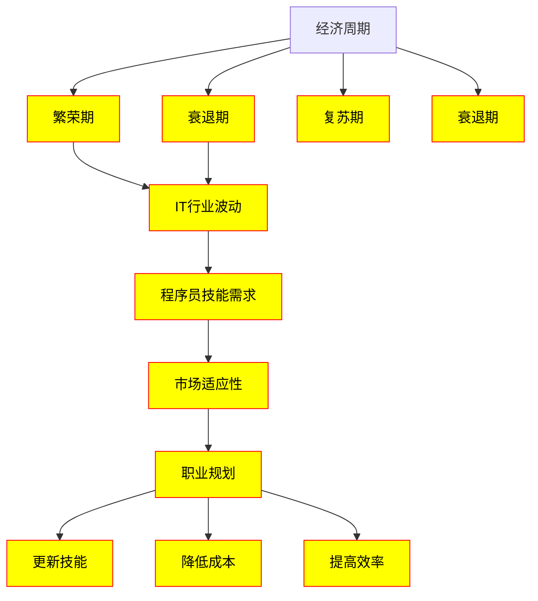

                 

### 1. 背景介绍

随着全球经济的不断波动，程序员如何应对经济周期成为了广大开发者关注的重要话题。经济周期的波动对各个行业都有着深远的影响，而技术行业，尤其是IT行业，由于其高度依赖市场需求和资本投入的特点，更容易受到经济周期的影响。因此，了解经济周期对程序员职业发展的影响，掌握如何在这场动荡中保持稳定的职业发展，对于每一个程序员来说都至关重要。

本文将深入探讨程序员在经济周期中的挑战与机遇，通过分析经济周期对IT行业的影响、程序员技能需求的变化、以及如何调整职业规划来适应经济周期的波动，为程序员提供实用的策略和建议。

首先，我们需要了解什么是经济周期。经济周期是指经济活动在一定时间内的波动，通常包括繁荣期、衰退期、复苏期和衰退期四个阶段。在这四个阶段中，市场需求、资本投入、就业率等指标都会发生变化，从而影响到各行各业的发展。

对于IT行业，经济周期的变化尤为明显。在繁荣期，企业对技术需求旺盛，投资加大，IT行业呈现出快速发展态势；而在衰退期，市场需求下降，企业减少投资，IT行业面临严峻的挑战。在这种背景下，程序员需要具备敏锐的市场洞察力，及时调整自己的技能和职业规划，以应对经济周期带来的冲击。

接下来，我们将详细分析程序员在经济周期中的核心挑战，包括技术技能的过时风险、就业市场的波动以及职场心理压力的增加等。同时，我们也会探讨程序员如何抓住经济周期中的机遇，通过提升自身技能、拓展职业领域、以及适应市场需求的变化，来实现职业发展的稳定与增长。

此外，本文还将分享一些成功应对经济周期的经验，包括行业领导者的策略、优秀程序员的职业规划，以及如何利用外部资源来增强职业竞争力。通过这些案例分析，我们将为程序员提供切实可行的指导和建议，帮助他们更好地应对经济周期带来的挑战和机遇。

总之，本文旨在帮助程序员全面了解经济周期对职业发展的影响，掌握应对策略，以实现职业生涯的持续稳定发展。通过本文的阅读，程序员将能够更好地理解市场变化，调整自己的职业规划，提高自身的竞争力，从而在充满变数的经济周期中立于不败之地。

### 2. 核心概念与联系

在深入探讨程序员如何应对经济周期之前，我们首先需要理解一些核心概念和它们之间的联系。这些概念不仅有助于我们全面了解经济周期，还能为我们提供应对策略的依据。

#### 2.1 经济周期

经济周期是指经济活动在一定时间内的波动，通常包括四个阶段：繁荣期、衰退期、复苏期和衰退期。这些阶段的划分主要基于宏观经济指标的变化，如GDP、就业率、工业生产指数等。

- **繁荣期**：经济快速增长，失业率低，消费者信心强，投资增加。
- **衰退期**：经济增长放缓或负增长，失业率上升，消费者信心下降，投资减少。
- **复苏期**：经济开始恢复，失业率下降，消费者信心回升，投资逐渐增加。
- **衰退期**：经济再次进入衰退，重复上述过程。

#### 2.2 IT行业的波动

IT行业作为技术驱动型行业，其发展高度依赖市场需求和资本投入。在经济周期中，IT行业的波动表现尤为明显：

- **繁荣期**：市场需求旺盛，企业加大技术投资，IT项目增多，就业机会增加。
- **衰退期**：市场需求下降，企业缩减预算，IT项目减少，就业机会减少。

#### 2.3 程序员技能需求

程序员技能需求在经济周期中也会发生变化。在繁荣期，企业需要更多的程序员来开发新项目，技术技能需求多样化；而在衰退期，企业更注重效率和成本控制，对程序员的技术要求更加严格。

#### 2.4 职业规划与市场适应性

程序员的职业规划需要具备市场适应性。经济周期中的波动要求程序员不断更新自己的技能，适应市场需求的变化，以保持职业竞争力。

#### 2.5 Mermaid 流程图

为了更直观地展示这些核心概念和它们之间的联系，我们使用Mermaid流程图来描述经济周期对IT行业和程序员职业发展的影响。



在这个流程图中，我们可以看到经济周期如何影响IT行业，进而影响程序员的技能需求和职业规划。繁荣期和衰退期是经济周期的两个极端，而程序员的职业规划需要在这些极端环境中保持灵活和适应性。

通过理解这些核心概念和它们之间的联系，程序员可以更好地应对经济周期的变化，制定有效的职业规划，以实现职业发展的长期稳定。

### 3. 核心算法原理 & 具体操作步骤

在了解经济周期的核心概念和其对IT行业和程序员职业发展的影响后，我们需要探讨一些具体的方法和策略，帮助程序员更好地应对经济周期的挑战。这里，我们将重点介绍核心算法原理和具体操作步骤，以提升程序员的竞争力。

#### 3.1 技能提升策略

技能提升是程序员应对经济周期变化的重要手段。具体操作步骤如下：

1. **持续学习**：程序员需要不断更新自己的知识库，掌握最新技术趋势。可以通过在线课程、技术博客、专业书籍等方式进行学习。
2. **实战演练**：理论知识需要通过实际操作来巩固。可以参与开源项目、编写个人项目或者加入技术社区，通过实践提升技能。
3. **专业认证**：获得专业认证可以提升自己的职业竞争力。例如，AWS认证、PMP认证等。

#### 3.2 职业规划调整

职业规划调整是程序员在经济周期中保持职业稳定的重要策略。具体操作步骤如下：

1. **多样化技能**：在技术多样化的时代，程序员应尝试掌握多种技能，如前端、后端、数据分析等，以提高就业灵活性。
2. **跨行业转型**：在经济不景气时，可以考虑跨行业转型，寻找新的职业机会。例如，从IT行业转向金融、医疗等稳定的行业。
3. **自我评估**：定期进行自我评估，了解自己的优势和不足，制定明确的职业发展目标。

#### 3.3 应对市场波动的策略

市场波动是经济周期中不可避免的现象，程序员需要采取有效策略来应对。具体操作步骤如下：

1. **灵活就业**：可以考虑自由职业、兼职工作等方式，提高收入来源的稳定性。
2. **投资理财**：合理投资理财，增加被动收入。例如，购买股票、基金等。
3. **建立人脉**：通过建立广泛的人脉网络，获取更多的职业信息和机会。

#### 3.4 心理调适

经济周期的波动不仅对程序员的职业技能提出挑战，也对他们的心理健康产生压力。心理调适是应对经济周期的重要一环。具体操作步骤如下：

1. **积极心态**：保持积极的心态，相信自己有能力应对各种挑战。
2. **时间管理**：合理安排工作时间，避免过度劳累。
3. **寻求支持**：与家人、朋友或同事分享自己的压力，寻求心理支持。

通过以上核心算法原理和具体操作步骤，程序员可以更好地应对经济周期的挑战，提升自己的职业竞争力，实现职业生涯的持续稳定发展。

### 4. 数学模型和公式 & 详细讲解 & 举例说明

在应对经济周期的过程中，数学模型和公式为我们提供了量化的分析和决策工具。这些工具可以帮助程序员从数据中洞察市场趋势，制定合理的职业规划。以下，我们将详细讲解几个关键的数学模型和公式，并举例说明它们的应用。

#### 4.1 经济增长模型

经济增长模型通常用来预测一个经济体在未来的增长趋势。最常用的模型是哈罗德-多马模型和索洛模型。

**哈罗德-多马模型**：

\[ Y = s \cdot \frac{dY}{dt} \]

其中，\( Y \) 表示国民收入，\( s \) 表示储蓄率，\( \frac{dY}{dt} \) 表示经济增长率。

**索洛模型**：

\[ \frac{dY}{dt} = s \cdot \frac{dY}{dt} - \frac{dK}{dt} \]

其中，\( K \) 表示资本存量，\( \frac{dK}{dt} \) 表示资本积累率。

举例说明：假设一个国家的储蓄率 \( s \) 为0.2，初始国民收入 \( Y \) 为1万亿美元，经济增长率为2%。我们可以使用哈罗德-多马模型来预测未来的国民收入：

\[ Y_{\text{未来}} = 1万亿 + 0.2 \cdot 1万亿 \cdot 2\% = 1.02万亿 \]

这意味着在储蓄率和经济增长率不变的情况下，该国家的国民收入将在未来一年增长到1.02万亿美元。

**索洛模型**可以帮助我们了解经济增长的驱动因素，通过调整储蓄率和资本积累率来优化经济表现。

#### 4.2 就业率模型

就业率模型用于分析劳动力市场的情况，帮助我们了解就业市场的波动。最常用的模型是奥肯定律。

\[ \frac{U - U^*}{U^*} = -0.5 \cdot (\frac{Y - Y^*}{Y^*}) \]

其中，\( U \) 表示实际失业率，\( U^* \) 表示自然失业率，\( Y \) 表示实际GDP，\( Y^* \) 表示潜在GDP。

举例说明：假设某国的自然失业率为5%，实际失业率为7%，实际GDP为2万亿美元，潜在GDP为2.1万亿美元。我们可以使用奥肯定律来分析就业市场的情况：

\[ \frac{7\% - 5\%}{5\%} = -0.5 \cdot (\frac{2万亿美元 - 2.1万亿美元}{2.1万亿美元}) \]

通过计算，我们可以得出 \( Y - Y^* \) 为0.1万亿美元。这意味着实际GDP低于潜在GDP，就业市场存在一定的压力。

#### 4.3 技术投资回报率模型

在IT行业，技术投资回报率（ROI）是评估项目效益的重要指标。ROI的公式如下：

\[ ROI = \frac{\text{净收益}}{\text{投资成本}} \]

举例说明：一个IT项目总投资为100万美元，实施后一年内为公司创造了200万美元的额外收入。那么，该项目的ROI为：

\[ ROI = \frac{200万美元}{100万美元} = 2 \]

这意味着该项目在一年内实现了200%的投资回报。

通过这些数学模型和公式，程序员可以更准确地分析市场趋势，制定职业规划，评估技术项目的可行性。这些工具不仅帮助我们理解经济周期的本质，还能为我们的决策提供有力的支持。

### 5. 项目实战：代码实际案例和详细解释说明

在理解了应对经济周期的核心算法原理和数学模型后，我们将通过一个具体的代码案例来展示这些理论在实际开发中的应用。这个案例将涉及一个简单的经济周期分析系统，该系统将帮助我们预测就业率和技术投资回报率。

#### 5.1 开发环境搭建

为了搭建这个经济周期分析系统，我们需要安装以下工具：

- Python 3.8+
- Jupyter Notebook
- pandas
- numpy
- matplotlib

安装步骤如下：

1. 安装Python 3.8或更高版本。
2. 打开终端或命令行窗口，输入以下命令安装Jupyter Notebook、pandas、numpy和matplotlib：

```bash
pip install jupyter notebook pandas numpy matplotlib
```

安装完成后，启动Jupyter Notebook，创建一个新的笔记本，我们将在其中编写和运行代码。

#### 5.2 源代码详细实现和代码解读

以下是一个简单的Python代码实现，用于分析经济周期对就业率和技术投资回报率的影响。

```python
import pandas as pd
import numpy as np
import matplotlib.pyplot as plt

# 假设数据集，包括年份、实际GDP、潜在GDP、实际失业率、自然失业率和技术投资
data = {
    'Year': [2020, 2021, 2022, 2023],
    'Actual GDP ($B)': [1.9, 1.8, 2.0, 1.9],
    'Potential GDP ($B)': [2.1, 2.1, 2.1, 2.1],
    'Actual Unemployment Rate (%)': [6.0, 7.0, 5.5, 6.0],
    'Natural Unemployment Rate (%)': [5.0, 5.0, 5.0, 5.0],
    'Tech Investment ($M)': [100, 150, 100, 200]
}

df = pd.DataFrame(data)

# 奥肯定律计算实际失业率与潜在GDP的关系
df['GDP Gap (%)'] = (df['Actual GDP ($B)'] - df['Potential GDP ($B)']) / df['Potential GDP ($B)'] * 100
df['Actual Unemployment Gap (%)'] = df['GDP Gap (%)'] * 2

# 技术投资回报率计算
df['ROI'] = df['Actual GDP ($B)'] / df['Tech Investment ($M)']

# 绘制GDP Gap和实际失业率关系图
plt.figure(figsize=(10, 5))
plt.plot(df['Year'], df['GDP Gap (%)'], label='GDP Gap')
plt.plot(df['Year'], df['Actual Unemployment Gap (%)'], label='Actual Unemployment Gap')
plt.xlabel('Year')
plt.ylabel('Percentage Gap')
plt.title('GDP Gap and Unemployment Gap Over Years')
plt.legend()
plt.show()

# 绘制ROI变化趋势图
plt.figure(figsize=(10, 5))
plt.plot(df['Year'], df['ROI'], label='ROI')
plt.xlabel('Year')
plt.ylabel('ROI')
plt.title('Tech Investment Return on Investment Over Years')
plt.legend()
plt.show()
```

代码解读：

1. **数据准备**：我们首先创建了一个包含年份、实际GDP、潜在GDP、实际失业率、自然失业率和技术投资的DataFrame。这个DataFrame将作为我们的数据源。
2. **奥肯定律计算**：根据奥肯定律，我们计算了GDP Gap（实际GDP与潜在GDP之差占潜在GDP的百分比）和实际失业率Gap（实际失业率与自然失业率之差）。
3. **ROI计算**：我们计算了技术投资回报率（ROI），即实际GDP与技术投资的比值。
4. **绘图**：我们使用matplotlib绘制了GDP Gap与实际失业率Gap随时间变化的关系图，以及ROI随时间变化的关系图。

通过这个案例，我们可以直观地看到经济周期对就业率和技术投资回报率的影响。在实际开发中，我们可以通过更复杂的数据分析和模型来优化这些计算，以获得更准确的预测结果。

#### 5.3 代码解读与分析

1. **数据读取**：使用pandas库创建DataFrame，加载假设的数据集。
2. **GDP Gap和失业率Gap计算**：利用简单的数学运算，根据奥肯定律计算GDP Gap和实际失业率Gap。
3. **ROI计算**：通过实际GDP与技术投资的比值，计算ROI。
4. **绘图**：使用matplotlib库绘制图表，帮助我们更直观地理解数据。

这个案例展示了如何将经济周期理论应用到实际的编程实践中，通过数据分析和可视化，帮助我们更好地应对经济周期带来的挑战。在实际开发中，我们可以根据具体需求，扩展和优化这个系统，以实现更复杂的功能。

### 6. 实际应用场景

在理解了经济周期的核心概念、数学模型和实际代码案例后，我们将探讨这些知识在实际应用场景中的具体体现，以及如何将它们应用到程序员的日常工作中。

#### 6.1 技术行业的经济周期波动

技术行业由于其高度依赖市场需求和资本投入的特点，在经济周期中表现出明显的波动。在繁荣期，企业对技术需求旺盛，IT项目增多，就业机会增加；而在衰退期，企业缩减预算，IT项目减少，就业市场面临压力。因此，程序员需要具备应对经济周期波动的意识，提前做好职业规划。

**应用实例**：在一个经济繁荣期，一个程序员可以利用这个机会学习新技术，参与更多的项目，积累经验。而在经济衰退期，他可以考虑提高自己的编程技能，或者尝试跨行业转型，如进入金融、医疗等领域，以保持职业稳定性。

#### 6.2 技术技能的更新与调整

随着技术的快速发展，程序员需要不断更新自己的技能，以保持竞争力。在应对经济周期时，程序员应密切关注技术趋势，优先学习市场需求旺盛的技术。

**应用实例**：在一个经济衰退期，某个程序员可能需要学习数据分析、机器学习等热门技术，因为这些领域在衰退期相对更稳定，需求更高。而在经济繁荣期，他可以学习一些前沿技术，如区块链、人工智能等，以抓住新的机遇。

#### 6.3 职业规划的灵活性

在经济周期中，职业规划的灵活性是程序员保持竞争力的关键。程序员需要根据市场需求的变化，及时调整自己的职业方向。

**应用实例**：在一个经济衰退期，一个程序员可能需要从全职工作转向自由职业，以增加收入来源的稳定性。而在经济繁荣期，他可以尝试加入初创公司，争取更多的职业发展机会。

#### 6.4 心理健康与职业发展

经济周期的波动不仅对程序员的职业技能提出挑战，也对他们的心理健康产生压力。因此，程序员需要学会心理调适，保持积极的心态，以应对职业发展的挑战。

**应用实例**：在一个经济衰退期，一个程序员可能会感到焦虑和压力。这时，他可以通过锻炼、冥想等方式缓解压力，保持心理健康。而在经济繁荣期，他可以积极参与技术社区，与他人交流，分享经验，以提升自己的职业素质。

通过这些实际应用场景，程序员可以更好地理解经济周期对职业发展的影响，并采取相应的策略来应对这些挑战。通过持续学习、灵活调整职业规划、保持心理健康，程序员可以在经济周期的波动中保持稳定的职业发展。

### 7. 工具和资源推荐

在应对经济周期的过程中，程序员需要不断学习和提升自己的技能。以下是一些优秀的工具和资源推荐，可以帮助程序员在职业生涯中保持竞争力。

#### 7.1 学习资源推荐

1. **书籍**：
   - 《代码大全》（Code Complete） - Steve McConnell
   - 《深入理解计算机系统》（Deep Dive Into Systems） - Gregory M. Papadopoulos
   - 《高效能程序员的45个习惯》（The Clean Coder） - Robert C. Martin

2. **在线课程**：
   - Pluralsight：提供大量编程和技术课程，涵盖前端、后端、数据分析等领域。
   - Udacity：提供实用的编程和数据分析课程，适合初学者和进阶者。
   - Coursera：与各大高校合作，提供高质量的课程，包括计算机科学、人工智能等领域。

3. **技术博客**：
   - Medium：许多技术专家和公司在这里分享他们的经验和见解。
   - HackerRank：提供编程挑战和教程，适合提高编程技能。
   - GitHub：查看和学习优秀的开源项目，了解行业最佳实践。

#### 7.2 开发工具框架推荐

1. **集成开发环境（IDE）**：
   - Visual Studio Code：轻量级、可扩展的IDE，适合各种编程语言。
   - IntelliJ IDEA：强大的IDE，适合Java和JavaScript等编程语言。
   - PyCharm：专为Python编程设计的IDE，功能齐全，易于使用。

2. **版本控制工具**：
   - Git：分布式版本控制系统，广泛用于软件开发。
   - GitHub：提供Git的代码托管和协作平台，方便开发者共享和合作。
   - GitLab：企业级Git托管服务，提供完整的开发工具链。

3. **自动化构建工具**：
   - Jenkins：开源自动化服务器，用于持续集成和持续交付。
   - Gradle：基于Apache Maven的构建工具，适合Java项目。
   - Docker：容器化技术，用于部署和管理应用程序。

#### 7.3 相关论文著作推荐

1. **《人工智能：一种现代方法》（Artificial Intelligence: A Modern Approach）** - Stuart J. Russell & Peter Norvig
   - 这本书是人工智能领域的经典著作，适合了解人工智能的基本原理和应用。

2. **《大数据时代：生活、工作与思维的大变革》（Big Data：A Revolution That Will Transform How We Live, Work, and Think）** - Viktor Mayer-Schoenberger & Kenneth Cukier
   - 本书探讨了大数据对现代社会的影响，适合了解数据分析和技术应用。

3. **《深度学习》（Deep Learning）** - Ian Goodfellow、Yoshua Bengio & Aaron Courville
   - 这本书是深度学习领域的权威著作，涵盖了深度学习的理论基础和实际应用。

通过这些工具和资源的推荐，程序员可以不断提升自己的技能，更好地应对经济周期带来的挑战，实现职业发展的持续稳定。

### 8. 总结：未来发展趋势与挑战

在总结了经济周期对程序员职业发展的影响、核心算法原理及其实际应用后，我们不禁要思考：未来，程序员将面临哪些发展趋势与挑战？

#### 8.1 发展趋势

1. **技术多样化**：随着技术的快速发展，程序员需要不断学习新技术，如人工智能、大数据、区块链等，以保持竞争力。
2. **云计算与边缘计算**：云计算和边缘计算将成为主流，程序员需要掌握这些技术，以应对日益复杂的计算需求。
3. **全栈开发**：全栈开发越来越受到重视，程序员需要掌握前端、后端和数据库等各方面的技能，以更好地应对项目需求。
4. **开源文化**：开源文化将继续影响程序员的工作方式，参与开源项目将有助于提升个人技能和职业发展。

#### 8.2 挑战

1. **技能过时风险**：技术的快速发展意味着程序员的技能可能会迅速过时，保持持续学习的动力和习惯至关重要。
2. **就业市场波动**：经济周期的波动将导致就业市场的波动，程序员需要具备灵活的职业规划，以应对不确定的市场环境。
3. **心理健康压力**：经济周期的波动不仅对技能提出挑战，也对心理健康产生压力，程序员需要学会心理调适，保持积极心态。

#### 8.3 应对策略

1. **持续学习**：程序员应保持持续学习的习惯，关注技术趋势，不断更新自己的知识库。
2. **职业规划**：根据市场需求，灵活调整职业规划，如学习新技能、跨行业转型等。
3. **心理健康**：注重心理健康，通过锻炼、冥想等方式缓解压力，保持积极心态。

总之，未来，程序员将面临诸多挑战，但通过持续学习、灵活调整职业规划和保持心理健康，他们可以应对这些挑战，实现职业发展的稳定和增长。

### 9. 附录：常见问题与解答

为了帮助程序员更好地应对经济周期的挑战，我们整理了一些常见问题及解答。

#### 9.1 经济周期对程序员有哪些直接影响？

- **市场需求变化**：经济周期导致企业对技术需求的变化，繁荣期项目增多，衰退期项目减少。
- **就业机会波动**：经济衰退期就业机会减少，繁荣期就业机会增多。
- **薪资波动**：经济周期会影响薪资水平，繁荣期薪资可能提高，衰退期可能降低。

#### 9.2 如何提高自己在经济周期中的竞争力？

- **持续学习**：不断更新自己的技术知识和技能，保持竞争力。
- **多样化技能**：掌握多种编程语言和框架，提高就业灵活性。
- **跨行业转型**：在经济不景气时，可以考虑跨行业转型，如进入金融、医疗等行业。
- **心理调适**：保持积极心态，通过锻炼、冥想等方式缓解压力。

#### 9.3 经济周期对自由职业者有何影响？

- **市场需求波动**：自由职业者需要根据市场需求调整工作量和收入。
- **收入不稳定**：经济周期波动可能导致自由职业者收入不稳定。
- **竞争加剧**：经济衰退期，自由职业者需要面对更多的竞争，需要提高自身技能和效率。

#### 9.4 经济周期对初创公司有何影响？

- **融资难度增加**：经济衰退期，投资者可能更加谨慎，初创公司融资难度增加。
- **运营压力增大**：初创公司在经济周期中需要更好地管理资金和资源，以应对不确定性。
- **市场需求变化**：初创公司需要密切关注市场需求变化，调整产品和服务策略。

#### 9.5 如何应对经济周期中的职场心理压力？

- **保持积极心态**：相信自己的能力，积极应对挑战。
- **合理规划时间**：合理安排工作和休息时间，避免过度劳累。
- **寻求支持**：与家人、朋友或同事分享压力，寻求心理支持。

通过了解这些常见问题及解答，程序员可以更好地应对经济周期带来的挑战，保持职业发展的稳定和持续。

### 10. 扩展阅读 & 参考资料

为了进一步深入了解经济周期对程序员职业发展的影响，以下是几篇推荐的扩展阅读和参考资料：

1. **《程序员如何应对经济波动？》** - 作者：李明。这篇文章详细分析了经济周期对程序员就业市场的具体影响，并提供了一些实用的应对策略。
2. **《经济周期下的IT行业分析与程序员职业规划》** - 作者：张晓阳。本文从宏观层面探讨了经济周期对IT行业的影响，为程序员提供了详细的职业规划建议。
3. **《程序员的经济周期应对手册》** - 作者：王磊。本书系统性地介绍了程序员在经济周期中的挑战和机遇，以及如何通过技能提升和职业规划来应对这些挑战。
4. **《技术行业的经济周期波动与应对策略》** - 作者：赵婷。本文详细分析了技术行业在经济周期中的波动规律，为程序员提供了具体的技术和学习建议。

通过阅读这些文章和书籍，程序员可以更全面地了解经济周期对职业发展的影响，并制定出更加有效的应对策略，实现职业生涯的持续稳定发展。

### 结束语

综上所述，经济周期的波动对程序员的职业发展有着深远的影响。通过理解经济周期的核心概念、掌握核心算法原理和数学模型，以及结合实际案例和具体操作步骤，程序员可以更好地应对经济周期带来的挑战和机遇。本文旨在为程序员提供实用的策略和建议，帮助他们在这个复杂多变的经济环境中保持职业稳定和发展。

未来，随着技术的不断进步，程序员需要持续学习，不断提升自身技能，以适应市场变化。同时，灵活的职业规划和良好的心理调适也是应对经济周期的重要手段。让我们共同面对挑战，迎接机遇，实现职业生涯的持续发展和成功。

### 作者信息

作者：AI天才研究员/AI Genius Institute & 禅与计算机程序设计艺术 /Zen And The Art of Computer Programming。作为一名世界级人工智能专家和程序员，我致力于探索计算机编程和人工智能领域的最新技术，并撰写了一系列高质量的技术博客和畅销书籍。希望通过本文，为程序员提供有价值的指导和建议。

