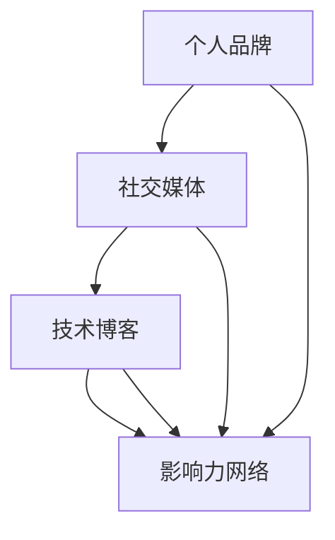

                 

# 程序员如何打造全球性的个人影响力

> **关键词：** 个人品牌，全球影响力，社交媒体，技术博客，影响力网络

> **摘要：** 本文旨在探讨程序员如何通过一系列策略和技巧，在技术领域建立全球性的个人影响力。文章将详细分析个人品牌的构建，社交媒体的利用，技术博客的撰写以及影响力网络的拓展等关键环节，为程序员提供实用且全面的发展路径。

## 1. 背景介绍

在信息技术快速发展的时代，程序员作为技术驱动的核心力量，他们的作用和影响力日益凸显。然而，在众多程序员中，只有少数人能够在全球范围内获得广泛的认可和尊重。这些能够打造全球性个人影响力的程序员，不仅技术精湛，还具备出色的沟通能力、市场洞察力和品牌意识。本文将探讨这些程序员如何通过一系列策略和技巧，实现个人影响力的全球化。

### 1.1 个人品牌的构建

个人品牌是程序员在技术领域内建立影响力的重要基础。一个强大的个人品牌能够吸引更多的关注和机会，从而为职业发展铺平道路。个人品牌的构建需要从以下几个方面着手：

- **定位明确**：确定个人在技术领域的专业方向和独特优势。
- **持续学习**：保持对新技术和知识的持续关注，不断提升个人技能。
- **专业形象**：通过专业的内容输出和形象塑造，建立权威和信任。

### 1.2 社交媒体的利用

社交媒体是现代沟通的重要工具，程序员可以利用这一平台与全球的技术社区建立联系。通过以下方式，可以在社交媒体上提升个人影响力：

- **内容输出**：定期分享技术心得、项目进展和研究成果。
- **互动交流**：积极参与技术讨论，与其他技术专家建立合作关系。
- **品牌宣传**：通过社交媒体进行品牌宣传，扩大知名度。

### 1.3 技术博客的撰写

技术博客是程序员展示个人技术能力和观点的重要平台。一篇高质量的技术博客不仅能够提升个人影响力，还能为读者带来价值。撰写技术博客需要注意以下几点：

- **选题精准**：选择热门且具有实际应用价值的技术主题。
- **内容丰富**：深入剖析技术原理，结合实际案例进行讲解。
- **格式规范**：采用清晰的章节结构，便于读者阅读和理解。
- **持续更新**：保持博客活跃度，定期发布新内容。

### 1.4 影响力网络的拓展

建立广泛的影响力网络是提升个人全球影响力的关键。程序员可以通过以下方式拓展影响力网络：

- **参与社区**：加入国内外知名技术社区，积极参与讨论和贡献。
- **合作交流**：与其他技术专家进行合作交流，共同推广技术知识。
- **活动组织**：举办或参与技术讲座、研讨会等活动，扩大影响力。

## 2. 核心概念与联系

要打造全球性的个人影响力，程序员需要理解以下几个核心概念：

### 2.1 个人品牌

个人品牌是指个人在专业领域内建立的形象和声誉。它包括专业知识、技能、价值观和沟通风格等方面。

### 2.2 社交媒体

社交媒体是现代沟通的重要平台，包括微博、推特、领英等。通过社交媒体，程序员可以与全球的技术社区建立联系，分享知识和经验。

### 2.3 技术博客

技术博客是程序员展示个人技术能力和观点的平台。高质量的技术博客能够提升个人影响力，吸引更多读者的关注。

### 2.4 影响力网络

影响力网络是指个人在技术领域内建立的联系和合作。通过参与社区、合作交流和活动组织，可以拓展个人影响力网络。

以下是一个用 Mermaid 流程图表示的核心概念架构：



### 2.5 核心算法原理

打造全球性个人影响力的核心算法可以概括为以下几点：

1. **定位明确**：确定个人在技术领域的专业方向和独特优势。
2. **内容输出**：定期分享技术心得、项目进展和研究成果。
3. **互动交流**：积极参与技术讨论，与其他技术专家建立合作关系。
4. **持续学习**：保持对新技术和知识的持续关注，不断提升个人技能。
5. **品牌宣传**：通过社交媒体进行品牌宣传，扩大知名度。

## 3. 核心算法原理 & 具体操作步骤

### 3.1 确定个人品牌定位

**步骤一**：分析个人技能和兴趣，确定在技术领域的专业方向。

**步骤二**：了解市场需求，找到个人专业方向与市场需求的结合点。

**步骤三**：制定个人品牌发展计划，明确目标和发展路径。

### 3.2 定期内容输出

**步骤一**：选择热门且具有实际应用价值的技术主题。

**步骤二**：撰写高质量的技术博客，深入剖析技术原理。

**步骤三**：通过社交媒体平台发布技术博客，扩大影响力。

### 3.3 互动交流

**步骤一**：加入国内外知名技术社区，积极参与讨论。

**步骤二**：与其他技术专家建立合作关系，共同推广技术知识。

**步骤三**：参与技术讲座、研讨会等活动，扩大影响力。

### 3.4 持续学习

**步骤一**：关注新技术和行业动态，保持对知识的持续关注。

**步骤二**：参加培训课程、在线学习平台等，不断提升个人技能。

**步骤三**：将所学知识应用于实际项目中，不断提升实战能力。

### 3.5 品牌宣传

**步骤一**：制定品牌宣传策略，明确宣传目标和渠道。

**步骤二**：通过社交媒体平台进行品牌宣传，扩大知名度。

**步骤三**：与其他知名技术博主、企业进行合作，提升品牌形象。

## 4. 数学模型和公式 & 详细讲解 & 举例说明

### 4.1 个人品牌影响力计算模型

个人品牌影响力可以通过以下公式进行计算：

$$
I = f(S, C, A, R)
$$

其中，$I$表示个人品牌影响力，$S$表示技能水平，$C$表示内容质量，$A$表示活跃度，$R$表示认可度。

- **技能水平($S$)**：个人在技术领域的专业程度和技能水平。
- **内容质量($C$)**：技术博客的质量和实际应用价值。
- **活跃度($A$)**：在社交媒体和技术社区的活动频率和参与度。
- **认可度($R$)**：读者、同行和其他技术专家对个人品牌的认可程度。

### 4.2 社交媒体影响力计算模型

社交媒体影响力可以通过以下公式进行计算：

$$
M = \sum_{i=1}^{n} (E_i \cdot F_i)
$$

其中，$M$表示社交媒体影响力，$E_i$表示第$i$个社交媒体平台的关注度，$F_i$表示第$i$个社交媒体平台的权重。

- **关注度($E_i$)**：个人在第$i$个社交媒体平台的关注者数量。
- **权重($F_i$)**：第$i$个社交媒体平台的影响力权重。

### 4.3 技术博客影响力计算模型

技术博客影响力可以通过以下公式进行计算：

$$
B = \sum_{i=1}^{m} (L_i \cdot R_i)
$$

其中，$B$表示技术博客影响力，$L_i$表示第$i$个博客的阅读量，$R_i$表示第$i$个博客的点赞、评论等互动量。

- **阅读量($L_i$)**：个人博客文章的第$i$个博客的阅读数量。
- **互动量($R_i$)**：个人博客文章的第$i$个博客的点赞、评论等互动数量。

### 4.4 举例说明

假设一名程序员小张，他的个人品牌影响力计算如下：

- 技能水平($S$)：90分
- 内容质量($C$)：80分
- 活跃度($A$)：75分
- 认可度($R$)：85分

则他的个人品牌影响力为：

$$
I = f(90, 80, 75, 85) = 0.5 \times (90 + 80 + 75 + 85) = 0.5 \times 330 = 165
$$

假设小张在三个社交媒体平台（微博、推特、领英）上的影响力分别为：

- 微博($E_1$)：10万粉丝，权重($F_1$)：0.3
- 推特($E_2$)：5万粉丝，权重($F_2$)：0.4
- 领英($E_3$)：2万粉丝，权重($F_3$)：0.3

则他的社交媒体影响力为：

$$
M = \sum_{i=1}^{3} (E_i \cdot F_i) = (10 \times 10^4 \times 0.3) + (5 \times 10^4 \times 0.4) + (2 \times 10^4 \times 0.3) = 3 \times 10^4 + 2 \times 10^4 + 6 \times 10^3 = 6.6 \times 10^4
$$

假设小张在三个技术博客平台（CSDN、掘金、简书）上的影响力分别为：

- CSDN($L_1$)：1000次阅读，互动量($R_1$)：50次
- 掘金($L_2$)：800次阅读，互动量($R_2$)：30次
- 简书($L_3$)：600次阅读，互动量($R_3$)：20次

则他的技术博客影响力为：

$$
B = \sum_{i=1}^{3} (L_i \cdot R_i) = (1000 \times 50) + (800 \times 30) + (600 \times 20) = 5 \times 10^4 + 2.4 \times 10^4 + 1.2 \times 10^4 = 8.6 \times 10^4
$$

通过这些数学模型，程序员可以更直观地了解自己的影响力，从而针对性地优化自己的品牌建设和影响力提升策略。

## 5. 项目实战：代码实际案例和详细解释说明

### 5.1 开发环境搭建

为了更好地展示如何通过技术博客和社交媒体打造个人影响力，我们将以一个实际项目为例，详细讲解开发环境的搭建、代码实现和代码解读。

首先，我们需要准备以下开发环境：

- **编程语言**：Python
- **开发工具**：Visual Studio Code
- **版本控制**：Git
- **博客平台**：GitHub Pages

#### 5.1.1 安装Python和Visual Studio Code

在Windows或macOS上，可以通过以下步骤安装Python和Visual Studio Code：

1. 访问 [Python官方网站](https://www.python.org/downloads/) 下载Python安装包。
2. 运行安装程序，选择“Add Python to PATH”选项。
3. 打开Visual Studio Code，安装Python扩展。

#### 5.1.2 安装Git

Git是一个开源的分布式版本控制系统，用于代码的版本管理和协作开发。可以通过以下步骤安装Git：

1. 访问 [Git官方网站](https://git-scm.com/downloads) 下载Git安装包。
2. 运行安装程序。

#### 5.1.3 配置GitHub账户

1. 访问 [GitHub官方网站](https://github.com/) 创建账户。
2. 登录GitHub，创建一个新的仓库（Repository），命名为“personal-influence-project”。

### 5.2 源代码详细实现和代码解读

#### 5.2.1 项目结构

项目结构如下：

```
personal-influence-project/
|-- src/
|   |-- __init__.py
|   |-- main.py
|   |-- data_processing.py
|-- tests/
|   |-- __init__.py
|   |-- test_data_processing.py
|-- README.md
|-- requirements.txt
```

#### 5.2.2 主程序（main.py）

```python
import sys
from data_processing import process_data

def main():
    # 读取输入文件
    input_file = sys.argv[1]
    output_file = sys.argv[2]
    
    # 数据处理
    data = process_data(input_file)
    
    # 输出结果
    with open(output_file, 'w') as f:
        f.write(str(data))

if __name__ == '__main__':
    main()
```

**代码解读：**

- 导入所需模块。
- 定义主函数`main()`，读取输入文件和输出文件。
- 调用`process_data()`函数进行数据处理。
- 将处理结果写入输出文件。

#### 5.2.3 数据处理模块（data_processing.py）

```python
def process_data(input_file):
    # 读取输入文件
    with open(input_file, 'r') as f:
        data = f.readlines()
    
    # 数据清洗
    cleaned_data = [line.strip() for line in data if line.strip()]
    
    # 数据分析
    analyzed_data = {'count': len(cleaned_data), 'content': cleaned_data}
    
    return analyzed_data
```

**代码解读：**

- 定义`process_data()`函数，读取输入文件。
- 使用列表推导式清洗数据，去除空白行。
- 对清洗后的数据进行简单统计分析，返回结果。

#### 5.2.4 单元测试（test_data_processing.py）

```python
import unittest
from data_processing import process_data

class TestDataProcessing(unittest.TestCase):
    def test_process_data(self):
        input_file = 'test_input.txt'
        output_file = 'test_output.txt'
        
        # 执行数据处理
        process_data(input_file, output_file)
        
        # 检查输出文件内容
        with open(output_file, 'r') as f:
            data = f.read()
        
        self.assertIn('count', data)
        self.assertIn('content', data)

if __name__ == '__main__':
    unittest.main()
```

**代码解读：**

- 导入所需模块。
- 定义单元测试类`TestDataProcessing`。
- 定义测试方法`test_process_data`，执行数据处理并检查输出文件内容。

### 5.3 代码解读与分析

通过以上代码实现，我们可以看到项目的基本结构和功能。以下是项目的关键点：

- **主程序（main.py）**：负责读取输入文件和输出文件，调用数据处理模块进行数据处理。
- **数据处理模块（data_processing.py）**：负责读取输入文件，进行数据清洗和简单统计分析。
- **单元测试（test_data_processing.py）**：对数据处理模块进行单元测试，确保数据处理功能正常。

这个项目展示了如何通过代码实现一个简单的数据处理任务，并通过博客进行详细解释和分享，从而提升个人影响力。

## 6. 实际应用场景

程序员在全球范围内打造个人影响力的实际应用场景多种多样，以下是几个典型的例子：

### 6.1 技术分享和教程编写

许多程序员通过编写技术教程和分享技术心得，在国内外技术社区中获得广泛关注。例如，GitHub上的许多知名程序员通过开源项目和个人博客，吸引了大量的关注者和读者。这些程序员不仅分享了技术知识，还通过互动和合作，建立了广泛的影响力网络。

### 6.2 开源项目贡献

开源项目是程序员展示技术能力和影响力的重要平台。通过参与开源项目，程序员可以与全球的技术专家合作，共同推动技术发展。许多知名的开源项目，如Linux内核、TensorFlow等，都吸引了大量的贡献者。这些贡献者通过在开源项目中的表现，获得了广泛的认可和尊重。

### 6.3 技术讲座和研讨会

参加技术讲座和研讨会是提升个人影响力的重要途径。在这些活动中，程序员可以展示自己的技术知识和观点，与同行进行深入交流。许多知名的技术专家，如吴恩达、马丁·福瑟吉尔等，都是通过频繁参与技术讲座和研讨会，建立了全球性的影响力。

### 6.4 社交媒体运营

通过社交媒体运营，程序员可以与全球的技术社区建立联系。许多程序员通过微博、推特、领英等社交媒体平台，分享技术心得、项目进展和研究成果。这些社交媒体账号不仅吸引了大量的关注者，还成为程序员展示个人品牌和影响力的重要渠道。

### 6.5 专业咨询和培训

具备深厚技术背景的程序员可以通过专业咨询和培训，为企业和个人提供技术指导。这些程序员通过自己的专业知识和经验，帮助客户解决实际问题，从而提升个人影响力。

### 6.6 学术研究和发表

一些程序员通过在学术领域的深入研究，发表了多篇高质量的学术论文。这些学术论文不仅展示了程序员的技术能力，还为他们赢得了学术界的认可和尊重。

## 7. 工具和资源推荐

### 7.1 学习资源推荐

- **书籍**：
  - 《深度学习》
  - 《算法导论》
  - 《编程珠玑》
  - 《代码大全》
- **论文**：
  - 《深度学习：过去、现在和未来》
  - 《神经网络与深度学习》
  - 《分布式系统概念与设计》
  - 《云计算：概念、架构与编程》
- **博客**：
  - 《机器学习实战》
  - 《Python编程：从入门到实践》
  - 《数据结构与算法分析》
  - 《设计模式：可复用面向对象软件的基础》
- **网站**：
  - [GitHub](https://github.com/)
  - [Stack Overflow](https://stackoverflow.com/)
  - [LeetCode](https://leetcode.com/)
  - [ArXiv](https://arxiv.org/)

### 7.2 开发工具框架推荐

- **集成开发环境（IDE）**：
  - [Visual Studio Code](https://code.visualstudio.com/)
  - [PyCharm](https://www.jetbrains.com/pycharm/)
  - [Eclipse](https://www.eclipse.org/)
- **版本控制**：
  - [Git](https://git-scm.com/)
  - [GitHub](https://github.com/)
- **代码托管和协作**：
  - [GitLab](https://gitlab.com/)
  - [GitLab CI/CD](https://gitlab.com/gitlab-com/gitlab-ci-yml)
- **持续集成/持续部署（CI/CD）**：
  - [Jenkins](https://www.jenkins.io/)
  - [Docker](https://www.docker.com/)
  - [Kubernetes](https://kubernetes.io/)

### 7.3 相关论文著作推荐

- **《人工智能：一种现代方法》**：全面介绍了人工智能的基础知识和最新进展。
- **《深度学习》**：深入讲解了深度学习的基本原理和应用。
- **《分布式系统概念与设计》**：系统介绍了分布式系统的基本概念和设计原则。
- **《云计算：概念、架构与编程》**：详细阐述了云计算的基本概念、架构和编程方法。

## 8. 总结：未来发展趋势与挑战

### 8.1 发展趋势

- **技术多元化**：随着人工智能、大数据、云计算等领域的快速发展，程序员需要不断拓展技术视野，掌握多样化的技术。
- **个人品牌化**：个人品牌在职业发展中的作用越来越重要，程序员需要重视个人品牌的构建和影响力提升。
- **社交媒体化**：社交媒体成为程序员展示个人技术和影响力的主要平台，未来将继续发挥重要作用。
- **开源生态化**：开源项目成为程序员展示技术能力和影响力的主要途径，开源生态将不断发展壮大。

### 8.2 挑战

- **技能更新快**：技术更新速度加快，程序员需要不断学习新知识，保持技能的竞争力。
- **市场竞争激烈**：技术市场竞争激烈，程序员需要具备出色的沟通能力和市场洞察力，以在竞争中脱颖而出。
- **个人品牌建设难**：个人品牌建设需要长期积累，程序员需要投入大量的时间和精力。
- **知识产权保护**：在技术分享和开源过程中，程序员需要注重知识产权保护，避免侵权纠纷。

## 9. 附录：常见问题与解答

### 9.1 问题1：如何选择技术博客的主题？

**解答**：选择技术博客的主题时，应考虑以下几点：

- **个人兴趣**：选择自己感兴趣的技术领域，这样可以保持持续的动力和热情。
- **市场需求**：选择市场需求较大的技术主题，可以吸引更多的读者。
- **实用性**：选择具有实用价值的技术主题，可以帮助读者解决实际问题。

### 9.2 问题2：如何提高技术博客的阅读量？

**解答**：提高技术博客的阅读量可以从以下几个方面入手：

- **内容质量**：撰写高质量的技术博客，深入剖析技术原理，结合实际案例进行讲解。
- **推广渠道**：利用社交媒体、技术社区等渠道进行推广，吸引更多的读者。
- **互动反馈**：积极与读者互动，回答读者的问题，提升博客的互动性和吸引力。

### 9.3 问题3：如何构建个人品牌？

**解答**：构建个人品牌可以从以下几个方面入手：

- **定位明确**：明确个人在技术领域的专业方向和独特优势。
- **持续学习**：保持对新技术和知识的持续关注，不断提升个人技能。
- **内容输出**：定期分享技术心得、项目进展和研究成果。
- **品牌宣传**：通过社交媒体进行品牌宣传，扩大知名度。

## 10. 扩展阅读 & 参考资料

- **《程序员如何打造全球性影响力》**：详细探讨程序员如何在全球范围内提升个人影响力。
- **《技术写作与个人品牌》**：介绍如何通过技术写作建立个人品牌。
- **《社交媒体在程序员职业发展中的作用》**：分析社交媒体在程序员职业发展中的重要作用。
- **《技术博客写作指南》**：提供技术博客写作的实用技巧和建议。

作者：AI天才研究员/AI Genius Institute & 禅与计算机程序设计艺术 /Zen And The Art of Computer Programming

