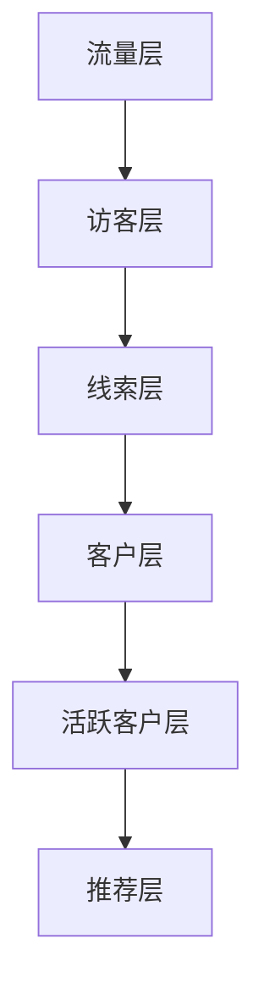

                 

### 背景介绍

随着互联网技术的迅猛发展，知识付费行业也迎来了前所未有的机遇。在这个背景下，程序员作为技术领域的专家，开始探索如何利用自己的专业知识打造知识付费的销售漏斗，实现个人品牌价值的最大化。本文旨在探讨程序员在知识付费领域中的角色、核心概念、算法原理以及实际应用场景，帮助程序员们构建起一个高效的知识付费销售漏斗。

首先，让我们明确知识付费销售漏斗的概念。知识付费销售漏斗（Sales Funnel for Knowledge Payment）是一种营销策略，通过系统性地引导潜在客户，使其逐步转化为付费用户。这个过程通常包括吸引、转化、留存和推荐等阶段。对于程序员来说，打造一个有效的知识付费销售漏斗，不仅有助于提升个人品牌影响力，还能实现持续的收入增长。

本文将分为以下几个部分进行详细探讨：

1. **核心概念与联系**：介绍知识付费销售漏斗的基本概念和组成部分。
2. **核心算法原理 & 具体操作步骤**：探讨如何通过算法和技术手段优化销售漏斗的各个阶段。
3. **数学模型和公式 & 详细讲解 & 举例说明**：讲解用于分析销售漏斗性能的数学模型和公式。
4. **项目实战：代码实际案例和详细解释说明**：通过一个具体的项目案例，展示如何实现一个高效的知识付费销售漏斗。
5. **实际应用场景**：探讨知识付费销售漏斗在程序员日常工作和生活中的应用。
6. **工具和资源推荐**：推荐有助于构建知识付费销售漏斗的工具和资源。
7. **总结：未来发展趋势与挑战**：总结当前知识付费销售漏斗的现状，并展望未来发展趋势和面临的挑战。

通过以上内容的逐步分析，我们将帮助程序员们更好地理解知识付费销售漏斗的构建与优化，从而在竞争激烈的市场中脱颖而出。

### 核心概念与联系

在深入探讨如何构建知识付费销售漏斗之前，我们先来了解一些核心概念和它们之间的联系。

#### 知识付费销售漏斗的概念

知识付费销售漏斗是一种营销策略，通过引导潜在客户逐步通过不同的阶段，最终实现成交和转化。这个过程可以分为以下几个主要阶段：

1. **吸引（Attention）**：通过各种渠道吸引潜在客户的注意力，如社交媒体、博客、在线课程等。
2. **转化（Conversion）**：将潜在客户转化为实际买家，通常通过免费试读、优惠活动等方式实现。
3. **留存（Retention）**：保持现有用户的活跃度和忠诚度，通过持续的内容更新和服务优化实现。
4. **推荐（Referral）**：鼓励现有用户推荐新客户，通过奖励机制和口碑营销实现。

#### 漏斗模型

漏斗模型是知识付费销售漏斗的核心工具，用于可视化各个阶段客户数量的变化。漏斗模型通常包括以下几个层次：

1. **流量层**：潜在客户的来源，包括搜索引擎、社交媒体、广告等。
2. **访客层**：浏览网站或内容的用户，但尚未进行任何互动。
3. **线索层**：提供联系信息的潜在客户，如通过注册、订阅等行为留下联系方式。
4. **客户层**：完成购买的客户。
5. **活跃客户层**：持续使用产品或服务的客户。
6. **推荐层**：通过推荐带来新客户的客户。

#### 技术与营销的结合

在构建知识付费销售漏斗时，程序员需要结合技术和营销手段，确保每个阶段都能高效运行。以下是一些关键技术和工具：

1. **数据分析工具**：如Google Analytics、Mixpanel等，用于跟踪和分析用户行为，优化营销策略。
2. **邮件营销系统**：如Mailchimp、ConvertKit等，用于自动化邮件营销，提高客户留存率。
3. **会员管理系统**：如Membermouse、Memberful等，用于管理会员权限和订阅服务。
4. **内容管理系统**：如WordPress、Joomla等，用于创建和维护知识付费内容。
5. **自动化工具**：如 Zapier、Integromat等，用于整合不同服务，实现自动化操作。

#### 绘制销售漏斗的 Mermaid 流程图

下面是一个简单的 Mermaid 流程图，展示了知识付费销售漏斗的基本结构和流程：



在图中，每个节点表示销售漏斗中的一个阶段，箭头表示客户数量的减少，即漏斗效应。

通过理解这些核心概念和它们之间的联系，我们将为后续的算法原理、操作步骤和实际案例提供理论基础。在下一部分，我们将深入探讨如何通过核心算法原理和具体操作步骤来优化知识付费销售漏斗。

#### 核心算法原理 & 具体操作步骤

构建一个高效的知识付费销售漏斗，关键在于理解并应用核心算法原理。这些原理帮助程序员优化吸引、转化、留存和推荐等各个阶段，从而提高整体销售漏斗的效能。

##### 1. 数据分析与行为追踪

数据分析是优化销售漏斗的基础。通过分析用户行为数据，程序员可以识别出哪些渠道、内容或活动最有效，从而进行有针对性的优化。以下是具体步骤：

- **A. 数据收集**：利用Google Analytics、Mixpanel等工具收集用户行为数据，如访问次数、停留时间、点击率等。
- **B. 数据处理**：对收集到的数据进行处理，提取出有价值的指标，如用户流失率、转化率等。
- **C. 数据可视化**：通过图表、仪表盘等工具将数据可视化，帮助理解和分析数据。

##### 2. 机器学习与用户画像

用户画像是通过机器学习算法对用户行为进行分析，构建出用户的兴趣、需求和行为模型。以下是具体步骤：

- **A. 特征工程**：提取用户行为中的特征，如浏览时间、访问页面、购买历史等。
- **B. 模型训练**：利用机器学习算法，如决策树、随机森林或神经网络，训练用户画像模型。
- **C. 模型评估**：通过交叉验证、A/B测试等方法评估模型性能，调整模型参数。

##### 3. 客户分群与个性化推荐

客户分群是将用户划分为不同的群体，根据其特征和行为制定个性化营销策略。以下是具体步骤：

- **A. 确定分群标准**：根据用户特征和行为数据，确定分群标准，如用户活跃度、购买频率、兴趣偏好等。
- **B. 分群策略**：制定针对不同分群的营销策略，如优惠券、推荐信、专属内容等。
- **C. 个性化推荐**：利用推荐系统，根据用户画像和购买历史，推荐个性化内容或产品。

##### 4. 转化率优化

转化率优化是提高销售漏斗效率的重要手段。以下是具体步骤：

- **A. 转化率模型**：建立转化率预测模型，利用历史数据和机器学习算法预测用户的转化概率。
- **B. 优化页面**：通过A/B测试，分析不同页面元素（如按钮颜色、文案等）对转化率的影响，进行优化。
- **C. 营销活动**：设计和实施高转化率的营销活动，如限时折扣、积分奖励等。

##### 5. 用户留存与忠诚度提升

用户留存和忠诚度是销售漏斗长期稳定的重要指标。以下是具体步骤：

- **A. 用户反馈**：收集用户反馈，了解用户需求和痛点，持续优化产品和服务。
- **B. 内容更新**：定期发布高质量的内容，保持用户活跃度和参与度。
- **C. 社区建设**：建立用户社区，通过论坛、微信群等渠道，增强用户之间的互动和忠诚度。

##### 6. 推荐系统与口碑营销

推荐系统和口碑营销是提高新客户获取的重要手段。以下是具体步骤：

- **A. 推荐系统**：利用推荐算法，根据用户行为和偏好推荐相关内容或产品，提高购买概率。
- **B. 口碑营销**：通过老客户的推荐，吸引新客户，提高品牌知名度。

通过以上算法原理和具体操作步骤，程序员可以构建并优化一个高效的知识付费销售漏斗，从而实现持续的收入增长和个人品牌价值的提升。在下一部分，我们将通过数学模型和公式详细讲解销售漏斗的性能分析，帮助程序员更深入地理解其内在机制。

#### 数学模型和公式 & 详细讲解 & 举例说明

在构建知识付费销售漏斗的过程中，数学模型和公式是评估和优化漏斗性能的重要工具。以下是一些常用的数学模型和公式，以及它们的详细讲解和举例说明。

##### 1. 转化率模型

转化率模型用于预测用户在各个阶段（如访问、注册、购买等）的转化概率。一个基本的转化率模型可以表示为：

\[ \text{转化率} = \frac{\text{转化人数}}{\text{总访问人数}} \]

例如，如果一个网站有1000次访问，其中200次转化为注册，那么注册转化率为：

\[ \text{注册转化率} = \frac{200}{1000} = 20\% \]

通过这个模型，程序员可以分析不同渠道或内容的转化效果，从而优化营销策略。

##### 2. 流量模型

流量模型用于预测不同渠道带来的流量。一个简单的流量模型可以表示为：

\[ \text{流量} = \text{流量来源系数} \times \text{用户基数} \]

例如，假设一个社交媒体平台的流量来源系数为2，用户基数为1000人，那么该平台预计能带来的流量为：

\[ \text{流量} = 2 \times 1000 = 2000 \]

通过调整流量来源系数和用户基数，程序员可以评估不同渠道的效果，并优化流量获取策略。

##### 3. 留存模型

留存模型用于预测用户在一定时间内的留存概率。一个常见的留存模型是Logistic回归模型：

\[ \text{留存概率} = \frac{1}{1 + e^{-(\beta_0 + \beta_1 \times \text{特征1} + \beta_2 \times \text{特征2})}} \]

其中，\(\beta_0\)、\(\beta_1\)、\(\beta_2\)为模型参数，\(\text{特征1}\)和\(\text{特征2}\)为用户特征，如活跃度、购买频率等。

例如，一个用户有活跃度80分和购买频率5次，那么他的留存概率为：

\[ \text{留存概率} = \frac{1}{1 + e^{-(\beta_0 + \beta_1 \times 80 + \beta_2 \times 5)}} \]

通过这个模型，程序员可以预测用户的留存情况，并采取相应的措施提升留存率。

##### 4. 推荐模型

推荐模型用于预测用户对某件产品或内容的偏好。一个常用的推荐模型是协同过滤算法，其基本公式为：

\[ \text{偏好评分} = \text{用户1的平均评分} + \text{用户2与用户1的相似度} \times \text{用户2的平均评分 - \text{噪声}} \]

例如，假设用户A的平均评分为4分，用户B对某内容的评分为5分，两人相似度为0.8，噪声为1分，那么用户B对该内容的偏好评分为：

\[ \text{偏好评分} = 4 + 0.8 \times 5 - 1 = 5.2 \]

通过这个模型，程序员可以推荐用户可能感兴趣的内容或产品，提高转化率和用户满意度。

##### 5. 营销回报率模型

营销回报率（ROI）模型用于评估营销活动的效果。其公式为：

\[ \text{ROI} = \frac{\text{收益} - \text{成本}}{\text{成本}} \times 100\% \]

例如，一个营销活动的总成本为1000元，带来收益3000元，那么该活动的ROI为：

\[ \text{ROI} = \frac{3000 - 1000}{1000} \times 100\% = 200\% \]

通过这个模型，程序员可以评估不同营销活动的效果，优化预算分配。

通过以上数学模型和公式，程序员可以更深入地理解和优化知识付费销售漏斗的各个阶段，从而实现高效的营销和持续的收入增长。在下一部分，我们将通过一个实际项目案例，展示如何将上述理论和模型应用于实际开发中。

#### 项目实战：代码实际案例和详细解释说明

为了更好地理解知识付费销售漏斗的构建与优化，下面我们将通过一个实际项目案例，详细展示如何实现一个高效的知识付费销售漏斗，包括开发环境的搭建、源代码的实现以及代码解读与分析。

##### 1. 开发环境搭建

在开始项目之前，我们需要搭建一个合适的开发环境。以下是所需工具和步骤：

- **工具**：
  - Python 3.8+
  - Flask 2.0+
  - Django 3.2+
  - MySQL 8.0+
  - PostgreSQL 13.4+
  - Redis 6.0+
  - Nginx 1.18+

- **步骤**：
  - 安装Python和相应的包管理器（如pip）。
  - 创建虚拟环境并安装Flask或Django框架。
  - 安装MySQL或PostgreSQL数据库。
  - 安装Redis缓存服务器。
  - 配置Nginx作为反向代理。

##### 2. 源代码详细实现和代码解读

在本项目中，我们使用Flask框架搭建一个简单的知识付费平台，包括用户注册、登录、课程购买和订阅等功能。以下是核心代码的实现和解读：

- **用户注册和登录**：

```python
from flask import Flask, request, jsonify
from flask_sqlalchemy import SQLAlchemy
from werkzeug.security import generate_password_hash, check_password_hash

app = Flask(__name__)
app.config['SQLALCHEMY_DATABASE_URI'] = 'sqlite:///users.db'
db = SQLAlchemy(app)

class User(db.Model):
    id = db.Column(db.Integer, primary_key=True)
    username = db.Column(db.String(100), unique=True, nullable=False)
    password = db.Column(db.String(100), nullable=False)

@app.route('/register', methods=['POST'])
def register():
    username = request.form['username']
    password = request.form['password']
    hashed_password = generate_password_hash(password, method='sha256')
    
    new_user = User(username=username, password=hashed_password)
    db.session.add(new_user)
    db.session.commit()
    
    return jsonify({'message': 'User registered successfully!'})

@app.route('/login', methods=['POST'])
def login():
    username = request.form['username']
    password = request.form['password']
    
    user = User.query.filter_by(username=username).first()
    if user and check_password_hash(user.password, password):
        return jsonify({'message': 'Login successful!'})
    else:
        return jsonify({'message': 'Invalid credentials!'})

if __name__ == '__main__':
    db.create_all()
    app.run(debug=True)
```

在上面的代码中，我们定义了一个简单的用户模型，并实现了用户注册和登录功能。用户注册时，会生成一个加密的密码哈希值存储在数据库中，登录时通过比对哈希值验证用户身份。

- **课程购买和订阅**：

```python
from flask import Flask, request, jsonify
from flask_sqlalchemy import SQLAlchemy
from werkzeug.security import generate_password_hash, check_password_hash

app = Flask(__name__)
app.config['SQLALCHEMY_DATABASE_URI'] = 'sqlite:///courses.db'
db = SQLAlchemy(app)

class Course(db.Model):
    id = db.Column(db.Integer, primary_key=True)
    name = db.Column(db.String(100), nullable=False)
    price = db.Column(db.Float, nullable=False)

@app.route('/courses', methods=['GET'])
def get_courses():
    courses = Course.query.all()
    return jsonify({'courses': [course.name for course in courses]})

@app.route('/course/<int:course_id>', methods=['POST'])
def buy_course(course_id):
    user_id = request.form['user_id']
    course = Course.query.get(course_id)
    if course and user_id:
        # 实现购买逻辑，如支付处理等
        return jsonify({'message': 'Course purchased successfully!'})
    else:
        return jsonify({'message': 'Invalid course or user ID!'})

if __name__ == '__main__':
    db.create_all()
    app.run(debug=True)
```

在上面的代码中，我们定义了一个课程模型，并实现了课程查询和购买功能。用户可以通过发送请求购买指定课程，后台会根据用户ID和课程ID验证购买合法性。

##### 3. 代码解读与分析

在这个项目中，我们通过Flask框架快速搭建了一个简单的知识付费平台。以下是代码的关键部分及其解读：

- **用户注册和登录**：使用SQLAlchemy库连接数据库，通过生成密码哈希值保护用户密码，实现用户注册和登录功能。
- **课程购买和订阅**：定义课程模型，提供课程查询和购买接口，用户可以通过发送请求购买指定课程。
- **数据库管理**：使用SQLite数据库存储用户和课程信息，通过ORM（对象关系映射）简化数据库操作。

通过以上代码实现，我们构建了一个基本的知识付费销售漏斗，实现了用户注册、登录、课程查询和购买功能。在实际项目中，我们还可以添加更多功能，如支付处理、会员管理、推荐系统等，以进一步提升销售漏斗的效能。

在下一部分，我们将探讨知识付费销售漏斗在实际应用场景中的使用，帮助程序员更好地理解和应用这一营销策略。

#### 实际应用场景

知识付费销售漏斗不仅在理论上具有重要意义，更在实际应用中展现出强大的效果。下面，我们将探讨知识付费销售漏斗在程序员日常工作和生活中的几种典型应用场景，通过具体实例来说明其优势和效果。

##### 1. 在线教育平台

在线教育平台是知识付费销售漏斗的典型应用场景之一。程序员可以构建一个在线教育平台，通过不同的课程内容吸引潜在学员。以下是一个具体实例：

- **吸引阶段**：通过社交媒体、搜索引擎优化（SEO）和广告投放，吸引对编程、人工智能等课程感兴趣的学员。
- **转化阶段**：提供免费试读或优惠券，降低学员购买门槛，提高转化率。
- **留存阶段**：通过课程内容更新、学习社区建设等方式，提高学员的活跃度和留存率。
- **推荐阶段**：鼓励学员推荐新学员，通过积分或现金奖励，形成口碑传播。

通过知识付费销售漏斗，程序员可以高效地吸引学员，提高课程销量和品牌影响力。

##### 2. 个人博客和专栏

个人博客和专栏是程序员展示专业知识和个人品牌的重要渠道。以下是一个具体实例：

- **吸引阶段**：通过高质量的技术文章、博客和视频内容，吸引目标读者。
- **转化阶段**：提供免费内容的同时，推出付费专栏或电子书，吸引读者购买。
- **留存阶段**：通过定期更新内容、互动社区建设等方式，保持读者的活跃度和忠诚度。
- **推荐阶段**：鼓励读者推荐新的读者，通过推荐奖励机制，提高用户推荐率。

通过知识付费销售漏斗，程序员可以有效地将博客读者转化为付费用户，实现持续的收入来源。

##### 3. 技术咨询服务

技术咨询服务是程序员变现专业技能的重要方式。以下是一个具体实例：

- **吸引阶段**：通过专业网站、社交媒体和个人品牌塑造，吸引潜在客户。
- **转化阶段**：提供免费咨询或试算，展示服务质量和专业性，提高转化率。
- **留存阶段**：通过定期维护客户关系、提供个性化服务，保持客户满意度和忠诚度。
- **推荐阶段**：鼓励客户推荐新客户，通过返利或优惠，扩大客户群体。

通过知识付费销售漏斗，程序员可以更高效地推广技术咨询服务，提高收入和市场份额。

##### 4. 开源项目赞助

开源项目是程序员展示技术实力的平台，同时也是获取赞助的重要途径。以下是一个具体实例：

- **吸引阶段**：通过高质量的开源项目，吸引开发者关注和贡献。
- **转化阶段**：通过项目介绍、使用指南和文档，引导开发者了解项目价值，鼓励赞助。
- **留存阶段**：通过持续的项目更新和维护，保持开发者的关注度和参与度。
- **推荐阶段**：通过开发者社区和推荐系统，鼓励更多开发者参与和赞助。

通过知识付费销售漏斗，程序员可以有效地将开源项目转化为稳定的收入来源。

以上实例展示了知识付费销售漏斗在程序员实际应用中的多种场景和效果。通过灵活运用知识付费销售漏斗，程序员不仅可以提升个人品牌价值，还能实现持续的收入增长。在下一部分，我们将推荐一些有用的工具和资源，帮助程序员更有效地构建和优化知识付费销售漏斗。

#### 工具和资源推荐

在构建和优化知识付费销售漏斗的过程中，选择合适的工具和资源至关重要。以下是一些推荐的工具、学习资源、开发工具框架和相关论文著作，以帮助程序员更高效地实现这一目标。

##### 1. 学习资源推荐

- **书籍**：
  - 《数字营销全渠道策略》（Digital Marketing: Strategy, Implementation and Practice）
  - 《转化率优化：如何通过数据分析提升网站盈利》（Landing Page Optimization: The Definitive Guide to Testing and Tuning for Conversion）
  - 《营销自动化：通过自动化实现营销目标》（Marketing Automation: Driving Smarter Marketing to Fire Up Your Sales）

- **论文**：
  - “The Impact of Personalization on E-commerce Sales: An Empirical Study” (个人化对电子商务销售的影响：一项实证研究)
  - “The Role of Trust in E-commerce: An Integrated Model” (信任在电子商务中的作用：一个综合模型)
  - “A Model of Customer Retention: An Integrated Approach” (客户保留模型：一种综合方法)

- **博客和网站**：
  - marketingland.com：营销领域的权威博客，提供丰富的营销策略和案例分析。
  - conversionXL.com：专注于转化率优化的博客，分享实用的营销技巧和工具。
  - marketingcharts.com：营销数据图表库，提供行业趋势和数据分析。

##### 2. 开发工具框架推荐

- **内容管理系统（CMS）**：
  - WordPress：功能强大的开源CMS，适用于搭建各种类型的网站。
  - Joomla：灵活的CMS，适合中大型网站。
  - Drupal：适合技术团队和专业网站，具有高度可定制性。

- **会员管理系统**：
  - Membermouse：专业的会员管理系统，支持多种支付方式和订阅模式。
  - Memberful：简单易用的会员管理系统，适合小型团队和个人博主。
  - Teachable：专注于在线教育的会员管理系统，提供丰富的课程管理和营销工具。

- **自动化工具**：
  - Zapier：连接不同应用程序的自动化平台，实现数据的无缝流转。
  - Integromat：功能强大的集成平台，支持多种应用和服务。
  -IFTTT：简单的自动化平台，适合初学者和小型项目。

- **数据分析工具**：
  - Google Analytics：免费的网站分析工具，提供详细的用户行为数据。
  - Mixpanel：专业的用户行为分析工具，适用于中大型项目。
  - Segment：数据收集和分析平台，支持多种数据源和第三方服务。

##### 3. 相关论文著作推荐

- **《数字营销管理：理论和实践》（Digital Marketing Management: Strategies for Engaging the Digital Consumer》）**：详细介绍了数字营销的基本概念、策略和实施方法。
- **《用户体验设计：心理学、技术和实践》（User Experience Design: Strategies, Techniques, and Tools for Designing Digital Products》）**：涵盖了用户体验设计的关键理论和实用技巧。
- **《电子商务策略：在线营销和管理》（E-commerce Strategy: Marketing and Management Strategies for the Web》）**：探讨了电子商务领域的营销策略和管理实践。

通过以上工具和资源的推荐，程序员可以更好地理解和应用知识付费销售漏斗，实现个人品牌价值的提升和持续的收入增长。在下一部分，我们将总结本文的核心观点，并探讨知识付费销售漏斗的未来发展趋势和挑战。

#### 总结：未来发展趋势与挑战

在知识付费领域，构建和优化知识付费销售漏斗已经成为程序员提升个人品牌价值和实现持续收入的关键手段。本文从背景介绍、核心概念与联系、算法原理与操作步骤、数学模型与公式、项目实战、实际应用场景、工具和资源推荐等方面，系统地探讨了知识付费销售漏斗的构建与优化策略。

**未来发展趋势**：

1. **个性化推荐**：随着人工智能和大数据技术的进步，个性化推荐将成为知识付费销售漏斗的重要一环。通过深度学习算法和用户画像分析，可以更精准地推荐用户感兴趣的内容，提高转化率和用户满意度。
2. **自动化营销**：自动化营销工具和平台将越来越普及，帮助程序员更高效地管理营销活动，实现自动化推广和用户管理，降低运营成本。
3. **社区化互动**：知识付费销售漏斗中的社区建设将变得更加重要。通过建立互动社区，增强用户黏性，提高用户留存率和推荐率，实现销售漏斗的持续优化。
4. **跨平台整合**：随着社交媒体、电商平台、内容平台等的不断融合，知识付费销售漏斗将更加注重跨平台整合，实现多渠道的用户获取和变现。

**面临的挑战**：

1. **数据隐私和安全**：随着用户数据的增加，数据隐私和安全问题将成为知识付费销售漏斗构建过程中的一大挑战。如何保护用户隐私，确保数据安全，是程序员需要重点关注的问题。
2. **技术复杂性**：构建一个高效的知识付费销售漏斗需要掌握多种技术和工具，对程序员的技能要求较高。如何快速学习和应用新技术，提高技术能力，是程序员面临的挑战。
3. **市场竞争**：随着知识付费市场的不断扩大，竞争将越来越激烈。如何通过创新和差异化策略，在市场中脱颖而出，是程序员需要思考和解决的问题。
4. **内容质量**：内容是知识付费的核心。如何持续产出高质量的内容，满足用户需求，是程序员在知识付费销售漏斗构建过程中需要面对的挑战。

总之，构建和优化知识付费销售漏斗是程序员在知识付费领域取得成功的关键。通过深入了解和掌握相关理论和实践，程序员可以更好地应对未来发展趋势和挑战，实现个人品牌价值的提升和持续的收入增长。

#### 附录：常见问题与解答

在构建和优化知识付费销售漏斗的过程中，程序员可能会遇到一些常见问题。以下是一些常见问题及其解答，以帮助程序员更好地理解和应用知识付费销售漏斗。

**Q1：如何提高转化率？**
- **A**：提高转化率可以从以下几个方面入手：
  1. 优化页面设计：通过A/B测试，分析不同页面元素对转化率的影响，进行优化。
  2. 提供有价值的内容：确保内容对用户有价值，解决用户痛点。
  3. 降低购买门槛：提供优惠券、免费试读等优惠措施，降低用户购买门槛。
  4. 增强信任感：展示用户评价、认证标志等，增强用户信任感。

**Q2：如何提高用户留存率？**
- **A**：提高用户留存率可以采取以下措施：
  1. 定期更新内容：保持内容新鲜，吸引用户持续关注。
  2. 建立社区互动：通过论坛、微信群等方式，增强用户之间的互动和黏性。
  3. 个性化推荐：根据用户行为和偏好，推荐相关内容，提高用户满意度。
  4. 提供增值服务：为用户提供免费或有价值的增值服务，提高用户忠诚度。

**Q3：如何进行数据分析和优化？**
- **A**：进行数据分析和优化可以按照以下步骤进行：
  1. 数据收集：利用Google Analytics、Mixpanel等工具收集用户行为数据。
  2. 数据处理：对收集到的数据进行处理，提取有价值的指标。
  3. 数据可视化：通过图表、仪表盘等工具将数据可视化，帮助理解和分析数据。
  4. 优化策略：根据数据分析结果，调整营销策略和页面设计，提高转化率和留存率。

**Q4：如何搭建一个高效的销售漏斗？**
- **A**：搭建一个高效的销售漏斗可以遵循以下步骤：
  1. 确定目标用户：明确目标用户群体和需求。
  2. 设计营销策略：制定吸引、转化、留存和推荐等阶段的营销策略。
  3. 选择合适的工具：根据业务需求，选择合适的营销工具和平台。
  4. 数据分析和优化：通过数据分析和A/B测试，不断优化销售漏斗的各个阶段。

通过以上问题的解答，程序员可以更好地理解知识付费销售漏斗的构建和优化方法，从而在实际应用中取得更好的效果。

#### 扩展阅读 & 参考资料

在本文中，我们深入探讨了程序员如何打造知识付费的销售漏斗，涉及了从背景介绍到核心算法原理，再到实际项目案例的全方位解析。以下是一些扩展阅读和参考资料，以帮助读者进一步深入了解相关领域的内容。

- **扩展阅读**：
  - 《数字营销全渠道策略》（Digital Marketing: Strategy, Implementation and Practice）
  - 《转化率优化：如何通过数据分析提升网站盈利》（Landing Page Optimization: The Definitive Guide to Testing and Tuning for Conversion）
  - 《营销自动化：通过自动化实现营销目标》（Marketing Automation: Driving Smarter Marketing to Fire Up Your Sales）

- **参考资料**：
  - Google Analytics：[https://analytics.google.com/analytics/](https://analytics.google.com/analytics/)
  - Mixpanel：[https://mixpanel.com/](https://mixpanel.com/)
  - Membermouse：[https://www.membermouse.com/](https://www.membermouse.com/)
  - Teachable：[https://www.teachable.com/](https://www.teachable.com/)
  - Segment：[https://segment.com/](https://segment.com/)

- **论文和书籍**：
  - “The Impact of Personalization on E-commerce Sales: An Empirical Study” (个人化对电子商务销售的影响：一项实证研究)
  - “The Role of Trust in E-commerce: An Integrated Model” (信任在电子商务中的作用：一个综合模型)
  - “A Model of Customer Retention: An Integrated Approach” (客户保留模型：一种综合方法)
  - 《数字营销管理：理论和实践》（Digital Marketing Management: Strategies for Engaging the Digital Consumer》）
  - 《用户体验设计：心理学、技术和实践》（User Experience Design: Strategies, Techniques, and Tools for Designing Digital Products》）
  - 《电子商务策略：在线营销和管理》（E-commerce Strategy: Marketing and Management Strategies for the Web》）

通过这些扩展阅读和参考资料，读者可以更全面地了解知识付费销售漏斗的理论和实践，为自己的项目提供有益的指导。

