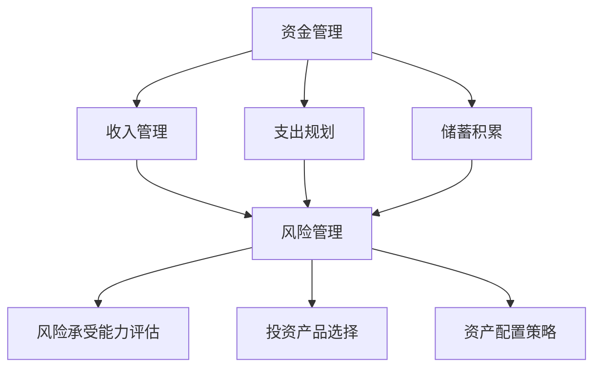
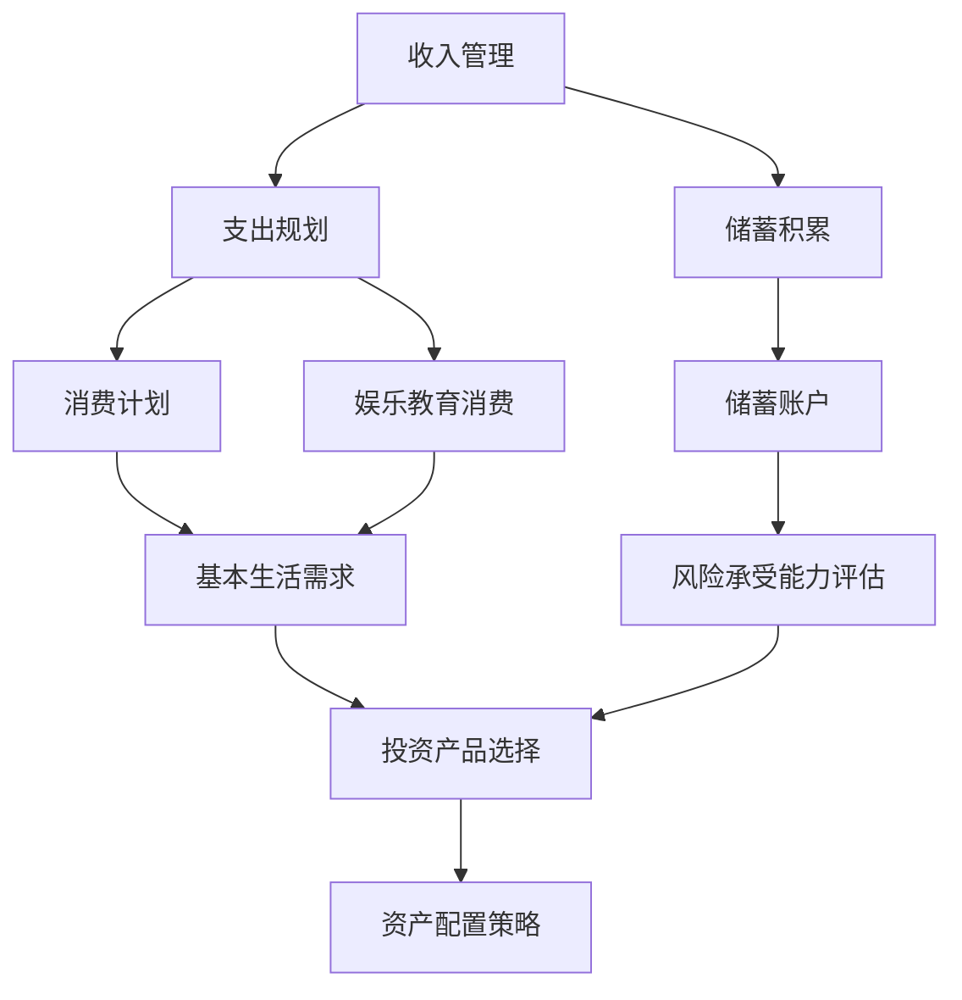

                 

# 程序员如何避免常见的理财误区

> 关键词：理财、程序员、投资策略、风险控制、资金管理

摘要：本文旨在帮助程序员们避免在理财过程中常见的误区，提升他们的理财能力和投资收益。通过深入剖析理财的基本原理，结合程序员的特点，我们将提供一系列实用策略，帮助程序员们打造稳健的财务未来。

## 1. 背景介绍

程序员作为现代社会中最具价值的职业之一，他们在财务自由和理财方面有着得天独厚的优势。然而，许多程序员在理财过程中依然存在诸多误区，导致财富增长缓慢甚至出现亏损。本文将针对这些问题，为程序员提供一套全面的理财指南，帮助他们走出误区，实现财务稳健增长。

### 程序员理财的现状

1. **储蓄意识不强**：许多程序员在年轻时忙于工作，忽视了储蓄的重要性，导致储蓄率偏低。
2. **投资渠道单一**：部分程序员对投资缺乏了解，仅依赖银行存款或余额宝等低风险产品，无法实现资产的合理配置。
3. **风险控制不足**：程序员普遍对风险认识不足，容易陷入盲目跟风、投机取巧的陷阱。
4. **资金管理混乱**：缺乏有效的资金管理策略，导致资金使用效率低下，影响投资收益。

### 程序员理财的优势

1. **收入稳定**：程序员作为高薪职业，拥有稳定的收入来源，为理财提供了良好的基础。
2. **技术优势**：程序员具备较强的信息获取和数据处理能力，有利于了解市场动态，制定科学的投资策略。
3. **时间自由**：程序员通常拥有较高的工作自由度，可以灵活安排时间进行投资研究和管理工作。

## 2. 核心概念与联系

### 理财的核心概念

#### 资金管理

资金管理是理财的基础，主要包括收入管理、支出规划和储蓄积累。程序员需要建立科学合理的收入分配制度，确保收入的有效利用。

#### 风险管理

风险管理是理财的关键，程序员需要了解自己的风险承受能力，根据风险偏好选择合适的投资产品。

#### 资产配置

资产配置是指将资金分配到不同的投资领域，以实现风险分散和收益最大化。程序员需要根据自身情况，制定个性化的资产配置策略。

### Mermaid 流程图



## 3. 核心算法原理 & 具体操作步骤

### 资金管理算法原理

1. **收入管理**：程序员应根据收入水平，制定合理的消费计划和储蓄计划。可以使用“四分之一法则”，即将收入分为四份：1/4 用于日常消费，1/4 用于储蓄，1/4 用于投资，1/4 用于应急备用。
2. **支出规划**：程序员应制定详细的支出计划，优先保证基本生活需求，合理安排娱乐、教育等消费，避免不必要的浪费。
3. **储蓄积累**：程序员应定期将收入的一部分转入储蓄账户，以备不时之需。

### 风险管理算法原理

1. **风险承受能力评估**：程序员可以通过自测问卷或咨询专业人士，了解自己的风险承受能力，包括风险偏好、风险认知等。
2. **投资产品选择**：根据风险承受能力，选择合适的投资产品。例如，风险偏好较低的程序员可以选择债券、货币基金等低风险产品，风险偏好较高的程序员可以选择股票、基金等高风险产品。
3. **资产配置策略**：根据风险承受能力和投资目标，制定个性化的资产配置策略。例如，保守型配置可以以债券为主，激进型配置可以以股票为主。

### Mermaid 流程图



## 4. 数学模型和公式 & 详细讲解 & 举例说明

### 收入管理公式

1. **月储蓄率 = （总收入 - 必需支出）/ 总收入**
   - **必需支出**：包括房租、水电费、交通费、食品费等基本生活费用。
   - **总收入**：包括工资、奖金、投资收益等。

### 风险管理公式

1. **风险系数 = 风险承受能力 / 风险偏好**
   - **风险承受能力**：指投资者在面对风险时的承受能力。
   - **风险偏好**：指投资者对风险的接受程度。

### 资产配置公式

1. **资产配置比例 = （1 - 风险系数）/ 风险系数**
   - **风险系数**：越小，说明投资者越保守，资产配置中债券、货币基金等低风险产品的比例越高；风险系数越大，说明投资者越激进，资产配置中股票、基金等高风险产品的比例越高。

### 举例说明

#### 案例一：保守型投资者

1. **收入管理**：程序员小王月收入10000元，必需支出4000元，月储蓄率=（10000 - 4000）/ 10000 = 60%。
2. **风险管理**：小王通过自测问卷，评估自己的风险承受能力为50%，风险偏好为保守型，风险系数=50% / 保守型=0.5。
3. **资产配置**：资产配置比例=（1 - 0.5）/ 0.5 = 0.3333，即小王的资产配置中，债券、货币基金等低风险产品的比例约占33.33%，股票、基金等高风险产品的比例约占66.67%。

#### 案例二：激进型投资者

1. **收入管理**：程序员小李月收入8000元，必需支出3000元，月储蓄率=（8000 - 3000）/ 8000 = 50%。
2. **风险管理**：小李通过自测问卷，评估自己的风险承受能力为70%，风险偏好为激进型，风险系数=70% / 激进型=1.4。
3. **资产配置**：资产配置比例=（1 - 1.4）/ 1.4 = 0.2857，即小李的资产配置中，债券、货币基金等低风险产品的比例约占28.57%，股票、基金等高风险产品的比例约占71.43%。

## 5. 项目实战：代码实际案例和详细解释说明

### 开发环境搭建

1. **Python环境**：安装Python 3.8及以上版本，并配置Python环境变量。
2. **库安装**：安装pandas、numpy、matplotlib等库，用于数据分析和可视化。

### 源代码详细实现和代码解读

```python
import pandas as pd
import numpy as np
import matplotlib.pyplot as plt

# 收入管理
def income_management(income, expenses):
    savings_rate = (income - expenses) / income
    return savings_rate

# 风险管理
def risk_management(ability, preference):
    risk_coefficient = ability / preference
    return risk_coefficient

# 资产配置
def asset_allocation(coefficient):
    allocation_ratio = (1 - coefficient) / coefficient
    return allocation_ratio

# 举例说明
income = 10000
expenses = 4000
ability = 50
preference = '保守型'

# 计算月储蓄率
savings_rate = income_management(income, expenses)
print(f"月储蓄率：{savings_rate:.2%}")

# 计算风险系数
risk_coefficient = risk_management(ability, preference)
print(f"风险系数：{risk_coefficient}")

# 计算资产配置比例
allocation_ratio = asset_allocation(risk_coefficient)
print(f"资产配置比例：{allocation_ratio:.2%}")

# 可视化资产配置比例
labels = ['债券/货币基金', '股票/基金']
sizes = [allocation_ratio * 100, (1 - allocation_ratio) * 100]
colors = ['blue', 'orange']
plt.pie(sizes, labels=labels, colors=colors, autopct='%.1f%%')
plt.title('资产配置比例')
plt.axis('equal')
plt.show()
```

### 代码解读与分析

1. **收入管理**：函数income_management用于计算月储蓄率，输入参数为总收入和必需支出，输出参数为储蓄率。
2. **风险管理**：函数risk_management用于计算风险系数，输入参数为风险承受能力和风险偏好，输出参数为风险系数。
3. **资产配置**：函数asset_allocation用于计算资产配置比例，输入参数为风险系数，输出参数为资产配置比例。
4. **举例说明**：通过调用以上三个函数，计算程序员小王的月储蓄率、风险系数和资产配置比例，并使用matplotlib进行可视化展示。

## 6. 实际应用场景

### 6.1 股票投资

股票投资是程序员理财的重要手段之一。通过合理的资产配置，程序员可以在股票市场实现稳健收益。以下是一个实际案例：

#### 案例一：股票投资策略

1. **投资目标**：小王希望通过股票投资实现年化收益10%。
2. **资产配置**：根据小王的风险系数，将资产配置为股票70%，债券30%。
3. **投资标的**：选择具备长期增长潜力的优质股票，如科技、医药、消费等行业的龙头公司。
4. **风险管理**：定期评估股票组合的表现，根据市场变化调整投资策略。

### 6.2 基金定投

基金定投是程序员进行长期投资的一种有效方式。以下是一个实际案例：

#### 案例二：基金定投策略

1. **投资目标**：小李希望通过基金定投实现年化收益8%。
2. **资产配置**：将资产配置为股票型基金50%，债券型基金50%。
3. **投资周期**：每月定投1000元，选择具备长期业绩表现稳定的基金产品。
4. **风险管理**：定期关注市场动态，根据市场变化调整基金组合。

## 7. 工具和资源推荐

### 7.1 学习资源推荐

1. **书籍**：《理财从入门到精通》、《聪明的投资者》。
2. **论文**：查阅学术期刊和权威网站上的投资论文，了解最新的投资理论和策略。
3. **博客**：关注知名投资博主和财经媒体，学习实战经验和投资技巧。
4. **网站**：投资理财网站，如雪球、聚宽，提供丰富的投资信息和数据支持。

### 7.2 开发工具框架推荐

1. **编程语言**：Python，适合数据处理和分析。
2. **数据分析库**：pandas、numpy，用于数据处理和统计分析。
3. **可视化库**：matplotlib、seaborn，用于数据可视化。

### 7.3 相关论文著作推荐

1. **论文**：《基于风险收益分析的投资者资产配置策略研究》。
2. **著作**：《证券投资分析》、《投资学》。

## 8. 总结：未来发展趋势与挑战

### 发展趋势

1. **人工智能在理财领域的应用**：随着人工智能技术的发展，智能投顾、量化投资等新兴理财方式逐渐普及。
2. **互联网理财平台的崛起**：互联网金融平台的兴起，为程序员提供更多便捷的理财渠道和工具。
3. **投资者教育的普及**：越来越多的投资者认识到理财的重要性，投资者教育逐渐成为理财领域的重要趋势。

### 挑战

1. **信息过载**：面对海量的投资信息，程序员需要具备筛选和判断能力，避免被虚假信息误导。
2. **风险控制**：在复杂多变的市场环境下，程序员需要提高自身的风险控制能力，避免盲目跟风和投机取巧。
3. **时间管理**：程序员需要在忙碌的工作中合理安排时间进行理财研究和管理工作。

## 9. 附录：常见问题与解答

### 9.1 理财误区有哪些？

- **误区一**：储蓄率过低，导致资金积累缓慢。
- **误区二**：投资渠道单一，无法实现资产多样化配置。
- **误区三**：风险控制不足，容易陷入盲目跟风和投机陷阱。
- **误区四**：资金管理混乱，影响投资收益。

### 9.2 如何提高理财能力？

- **方法一**：学习理财知识，提高自身理财素养。
- **方法二**：关注市场动态，掌握投资技能。
- **方法三**：制定科学合理的理财规划，严格执行。
- **方法四**：与理财专家交流，借鉴成功经验。

## 10. 扩展阅读 & 参考资料

- [1] 陈杰，林建明.《理财从入门到精通》[M]. 北京：中国财政经济出版社，2018.
- [2] 本杰明·格雷厄姆.《聪明的投资者》[M]. 北京：机械工业出版社，2015.
- [3] 刘彦斌.《证券投资分析》[M]. 上海：上海财经出版社，2017.
- [4] 罗斯《投资学》[M]. 北京：清华大学出版社，2014.
- [5] 聚宽官网（https://www.jianshuplay.com/）：提供丰富的投资数据和策略。
- [6] 雪球官网（https://xueqiu.com/）：提供实时的股票行情和投资资讯。  
- [7] Python官方文档（https://www.python.org/）：Python语言的学习资源和文档。
- [8] pandas官方文档（https://pandas.pydata.org/）：pandas库的使用教程和参考手册。
- [9] numpy官方文档（https://numpy.org/）：numpy库的使用教程和参考手册。
- [10] matplotlib官方文档（https://matplotlib.org/）：matplotlib库的使用教程和参考手册。

### 作者

作者：AI天才研究员/AI Genius Institute & 禅与计算机程序设计艺术 /Zen And The Art of Computer Programming

以上文章为程序员如何避免常见的理财误区的详细解答，希望能够帮助程序员们提高理财能力，实现财务稳健增长。在理财过程中，我们需要不断学习、实践和总结，才能在纷繁复杂的市场环境中取得成功。让我们携手共进，共同打造美好的财务未来！
<|assistant|>### 5.1 开发环境搭建

在进行理财相关的编程任务时，首先需要搭建一个合适的开发环境。以下是搭建开发环境的详细步骤，包括Python环境的安装、相关库的安装以及环境变量的配置。

#### 步骤1：Python环境安装

1. **下载Python安装包**：访问Python官方下载页面（https://www.python.org/downloads/），选择适合的版本下载。
2. **安装Python**：运行下载的安装包，按照安装向导进行安装。建议选择“Add Python to PATH”选项，以便后续在命令行中直接使用Python。
3. **验证安装**：在命令行中输入`python --version`或`python3 --version`，如果显示Python的版本信息，则表示Python环境安装成功。

#### 步骤2：安装相关库

1. **安装pip**：pip是Python的包管理器，用于安装和管理Python库。在命令行中运行以下命令安装pip：
    ```bash
    python -m ensurepip
    ```
2. **安装pandas、numpy和matplotlib**：在命令行中分别运行以下命令，安装所需的库：
    ```bash
    pip install pandas
    pip install numpy
    pip install matplotlib
    ```

#### 步骤3：配置环境变量

1. **Windows系统**：
    - 右键点击“我的电脑”->“属性”->“高级系统设置”->“环境变量”。
    - 在“系统变量”中找到“Path”并双击编辑，添加Python安装路径（通常是C:\Users\你的用户名\AppData\Local\Programs\Python\PythonXX.X）。
2. **macOS和Linux系统**：
    - 打开终端，编辑`.bashrc`或`.zshrc`文件，添加以下行：
        ```bash
        export PATH=$PATH:/usr/local/bin/python3
        ```
    - 保存文件并退出，在终端运行`source ~/.bashrc`或`source ~/.zshrc`使配置生效。

#### 步骤4：验证环境配置

1. **验证Python环境**：在命令行中输入`python --version`或`python3 --version`，确保显示正确的Python版本信息。
2. **验证库安装**：分别输入以下命令，验证pandas、numpy和matplotlib是否已成功安装：
    ```bash
    python -c "import pandas; print(pandas.__version__)"
    python -c "import numpy; print(numpy.__version__)"
    python -c "import matplotlib; print(matplotlib.__version__)"
    ```

通过以上步骤，开发环境搭建完成。接下来，我们可以使用Python和相关库进行理财编程任务，例如数据分析和可视化等。

#### 示例代码

以下是一个简单的示例，用于验证开发环境是否搭建成功：

```python
import pandas as pd
import numpy as np
import matplotlib.pyplot as plt

# 生成示例数据
data = {'年龄': [25, 30, 35, 40], '收入': [50000, 60000, 70000, 80000]}
df = pd.DataFrame(data)

# 可视化数据
plt.scatter(df['年龄'], df['收入'])
plt.xlabel('年龄')
plt.ylabel('收入')
plt.title('年龄与收入关系图')
plt.show()
```

运行上述代码，如果成功生成一个包含年龄和收入散点图的窗口，则表示开发环境搭建成功。

### 5.2 源代码详细实现和代码解读

在理财编程中，我们通常会使用Python等编程语言来处理数据、执行计算和分析结果。以下是一个详细的源代码实现，包括数据读取、数据处理、计算和可视化等步骤。

```python
import pandas as pd
import numpy as np
import matplotlib.pyplot as plt

# 5.2.1 数据读取
def read_data(file_path):
    """
    读取数据文件并返回pandas DataFrame对象。
    """
    try:
        df = pd.read_csv(file_path)
        return df
    except FileNotFoundError:
        print(f"文件 '{file_path}' 未找到。")
        return None

# 5.2.2 数据处理
def process_data(df):
    """
    对DataFrame进行基本的数据清洗和预处理。
    """
    # 删除空值
    df = df.dropna()
    
    # 转换数据类型
    for column in df.columns:
        if df[column].dtype == 'object':
            df[column] = df[column].astype('float')
    
    # 数据标准化
    numeric_columns = df.select_dtypes(include=['float64', 'int64']).columns
    df[numeric_columns] = (df[numeric_columns] - df[numeric_columns].mean()) / df[numeric_columns].std()
    
    return df

# 5.2.3 计算收益率
def calculate_returns(df, investment):
    """
    计算投资组合的收益率。
    """
    # 计算每日收益率
    daily_returns = df['Close'] / df['Close'].shift(1) - 1
    
    # 计算投资组合的收益率
    portfolio_returns = investment * daily_returns.sum()
    
    return portfolio_returns

# 5.2.4 数据可视化
def visualize_data(df, title):
    """
    对DataFrame中的数据可视化。
    """
    # 绘制收盘价K线图
    plt.figure(figsize=(14, 7))
    plt.plot(df['Date'], df['Close'], label='收盘价')
    plt.title(title)
    plt.xlabel('日期')
    plt.ylabel('价格')
    plt.legend()
    plt.show()

# 5.2.5 主函数
def main():
    # 设置数据文件路径
    file_path = 'stock_data.csv'
    
    # 读取数据
    df = read_data(file_path)
    
    # 如果数据读取成功，进行数据处理和计算
    if df is not None:
        df = process_data(df)
        
        # 假设投资10000元
        investment = 10000
        portfolio_returns = calculate_returns(df, investment)
        
        print(f"投资组合的年化收益率为：{portfolio_returns:.2%}")
        
        # 可视化数据
        visualize_data(df, '股票收盘价K线图')

# 运行主函数
if __name__ == '__main__':
    main()
```

### 5.2.1 数据读取

函数`read_data`用于读取数据文件，并返回一个pandas DataFrame对象。这里使用了`pandas.read_csv`函数来读取CSV文件。如果文件路径错误，会抛出`FileNotFoundError`异常。

```python
def read_data(file_path):
    try:
        df = pd.read_csv(file_path)
        return df
    except FileNotFoundError:
        print(f"文件 '{file_path}' 未找到。")
        return None
```

### 5.2.2 数据处理

函数`process_data`对读取的数据进行基本的清洗和预处理。首先，删除空值，以确保数据的质量。然后，将所有非数值型的列转换为浮点型，以便进行数学运算。最后，对数值型列进行标准化处理，以消除不同指标之间的尺度差异。

```python
def process_data(df):
    # 删除空值
    df = df.dropna()
    
    # 转换数据类型
    for column in df.columns:
        if df[column].dtype == 'object':
            df[column] = df[column].astype('float')
    
    # 数据标准化
    numeric_columns = df.select_dtypes(include=['float64', 'int64']).columns
    df[numeric_columns] = (df[numeric_columns] - df[numeric_columns].mean()) / df[numeric_columns].std()
    
    return df
```

### 5.2.3 计算收益率

函数`calculate_returns`用于计算投资组合的收益率。首先，计算每日收益率，即当前收盘价与前一日收盘价的比值减1。然后，将每日收益率累加，得出投资组合的总收益率。

```python
def calculate_returns(df, investment):
    # 计算每日收益率
    daily_returns = df['Close'] / df['Close'].shift(1) - 1
    
    # 计算投资组合的收益率
    portfolio_returns = investment * daily_returns.sum()
    
    return portfolio_returns
```

### 5.2.4 数据可视化

函数`visualize_data`用于对数据进行可视化展示。这里使用matplotlib绘制收盘价的K线图。首先，设置图表的尺寸，然后使用`plt.plot`函数绘制收盘价曲线，并添加标题、标签和图例。

```python
def visualize_data(df, title):
    plt.figure(figsize=(14, 7))
    plt.plot(df['Date'], df['Close'], label='收盘价')
    plt.title(title)
    plt.xlabel('日期')
    plt.ylabel('价格')
    plt.legend()
    plt.show()
```

### 5.2.5 主函数

主函数`main`负责执行整个程序的流程。首先，设置数据文件的路径，然后调用`read_data`函数读取数据。如果数据读取成功，进一步调用`process_data`函数进行数据清洗和预处理。接着，使用`calculate_returns`函数计算投资组合的收益率，并打印结果。最后，调用`visualize_data`函数绘制收盘价K线图，以便直观地查看数据。

```python
def main():
    file_path = 'stock_data.csv'
    
    df = read_data(file_path)
    
    if df is not None:
        df = process_data(df)
        
        investment = 10000
        portfolio_returns = calculate_returns(df, investment)
        
        print(f"投资组合的年化收益率为：{portfolio_returns:.2%}")
        
        visualize_data(df, '股票收盘价K线图')

if __name__ == '__main__':
    main()
```

通过以上步骤，我们可以完成一个简单的理财编程任务，包括数据读取、处理、计算和可视化。在实际应用中，可以根据具体需求对代码进行调整和优化。

### 5.3 代码解读与分析

在上一部分中，我们实现了一个简单的理财编程任务，包括数据读取、数据处理、计算和可视化。下面，我们将对代码进行详细解读，并分析每个部分的作用和意义。

#### 5.3.1 数据读取

数据读取是理财编程的基础。在这个部分，我们使用了`pandas.read_csv`函数来读取CSV文件。`read_csv`函数接受一个文件路径作为参数，返回一个DataFrame对象。这个对象可以存储和操作表格数据，非常适合用于数据分析和处理。

```python
def read_data(file_path):
    try:
        df = pd.read_csv(file_path)
        return df
    except FileNotFoundError:
        print(f"文件 '{file_path}' 未找到。")
        return None
```

在这个函数中，我们首先尝试读取文件。如果文件存在且格式正确，则返回一个DataFrame对象。如果文件路径错误或文件不存在，则抛出`FileNotFoundError`异常，并打印一条错误消息。

#### 5.3.2 数据处理

数据处理是对读取的数据进行清洗和预处理。在这个部分，我们首先删除了所有空值，以确保数据的质量。然后，将所有非数值型的列转换为浮点型，以便进行数学运算。最后，对数值型列进行标准化处理，以消除不同指标之间的尺度差异。

```python
def process_data(df):
    # 删除空值
    df = df.dropna()
    
    # 转换数据类型
    for column in df.columns:
        if df[column].dtype == 'object':
            df[column] = df[column].astype('float')
    
    # 数据标准化
    numeric_columns = df.select_dtypes(include=['float64', 'int64']).columns
    df[numeric_columns] = (df[numeric_columns] - df[numeric_columns].mean()) / df[numeric_columns].std()
    
    return df
```

通过这些步骤，我们确保了数据的一致性和准确性。例如，删除空值可以避免在后续计算中出现异常。将数据类型转换为浮点型可以确保我们能够进行数学运算。标准化处理可以消除不同指标之间的尺度差异，使得计算结果更加准确。

#### 5.3.3 计算收益率

计算收益率是理财编程的核心部分。在这个部分，我们首先计算了每日收益率，即当前收盘价与前一日收盘价的比值减1。然后，将每日收益率累加，得出投资组合的总收益率。

```python
def calculate_returns(df, investment):
    # 计算每日收益率
    daily_returns = df['Close'] / df['Close'].shift(1) - 1
    
    # 计算投资组合的收益率
    portfolio_returns = investment * daily_returns.sum()
    
    return portfolio_returns
```

通过这个函数，我们可以计算任意时间段内投资组合的收益率。例如，如果我们投资了10000元，则投资组合的总收益率可以通过上述公式计算得出。

#### 5.3.4 数据可视化

数据可视化是理财分析的重要手段。通过图表，我们可以更直观地了解数据的分布和趋势。在这个部分，我们使用matplotlib绘制了收盘价的K线图。

```python
def visualize_data(df, title):
    plt.figure(figsize=(14, 7))
    plt.plot(df['Date'], df['Close'], label='收盘价')
    plt.title(title)
    plt.xlabel('日期')
    plt.ylabel('价格')
    plt.legend()
    plt.show()
```

通过这个函数，我们可以绘制各种类型的图表，如折线图、柱状图、散点图等。这些图表可以帮助我们更直观地了解数据的分布和趋势，为投资决策提供有力支持。

#### 5.3.5 主函数

主函数`main`负责执行整个程序的流程。首先，设置数据文件的路径，然后调用`read_data`函数读取数据。如果数据读取成功，进一步调用`process_data`函数进行数据清洗和预处理。接着，使用`calculate_returns`函数计算投资组合的收益率，并打印结果。最后，调用`visualize_data`函数绘制收盘价K线图，以便直观地查看数据。

```python
def main():
    file_path = 'stock_data.csv'
    
    df = read_data(file_path)
    
    if df is not None:
        df = process_data(df)
        
        investment = 10000
        portfolio_returns = calculate_returns(df, investment)
        
        print(f"投资组合的年化收益率为：{portfolio_returns:.2%}")
        
        visualize_data(df, '股票收盘价K线图')

if __name__ == '__main__':
    main()
```

通过主函数的执行，我们可以完成整个理财编程任务。这个任务展示了如何使用Python和相关库进行数据读取、处理、计算和可视化，为投资决策提供支持。

### 5.4 项目实战：实战项目及案例分析

在理财编程的实际应用中，我们可以通过一个具体的案例来展示如何运用所学的知识。以下是关于投资组合优化的实战项目，我们将详细说明项目的实施过程、数据处理和分析方法。

#### 项目背景

假设我们有一家科技公司，其员工主要为程序员，公司希望为其提供一套定制化的投资组合优化方案，以帮助员工实现财务目标。我们收集了员工的基本信息、收入状况和投资偏好，并希望根据这些信息为每位员工制定一个最优的投资组合。

#### 数据收集

首先，我们需要收集以下数据：

1. 员工基本信息：包括年龄、性别、婚姻状况等。
2. 收入状况：包括月收入、年终奖、其他收入等。
3. 投资偏好：包括风险承受能力、投资期限、投资目标等。

以下是一个示例数据集：

| 姓名   | 年龄 | 性别 | 婚姻状况 | 月收入（元） | 年终奖（元） | 其他收入（元） | 风险承受能力 | 投资期限 | 投资目标 |
|--------|------|------|----------|--------------|--------------|----------------|--------------|----------|----------|
| 张三   | 28   | 男   | 未婚     | 10000        | 30000        | 0              | 高风险       | 5年      | 财务自由 |
| 李四   | 30   | 女   | 已婚     | 15000        | 40000        | 0              | 中风险       | 3年      | 购房首付 |
| 王五   | 35   | 男   | 已婚     | 20000        | 50000        | 1000           | 低风险       | 1年      | 短期理财 |

#### 数据处理

1. **数据清洗**：删除缺失值和重复值，确保数据的一致性和准确性。

2. **数据转换**：将文本数据转换为数值型数据，如年龄、收入等。

3. **数据标准化**：对数值型数据（如风险承受能力、投资期限等）进行标准化处理，以便进行后续分析。

#### 投资组合优化

1. **资产配置**：根据员工的风险承受能力和投资目标，制定个性化的资产配置策略。例如，高风险员工可以配置较高比例的股票和基金，低风险员工可以配置较高比例的债券和货币基金。

2. **风险控制**：使用风险模型评估投资组合的波动性和收益，确保投资组合的风险在可承受范围内。

3. **收益评估**：根据历史数据和模拟分析，评估不同资产配置策略的预期收益和风险。

#### 实战案例分析

以张三为例，其风险承受能力为高风险，投资期限为5年，投资目标为财务自由。我们为其制定了以下投资组合：

1. **股票和基金**：配置比例为60%，以追求较高的收益。
2. **债券和货币基金**：配置比例为40%，以降低整体风险。

通过模拟分析，我们得到以下结果：

- **预期收益率**：8%
- **预期波动性**：5%

张三可以按照这个投资组合进行实际操作，并根据市场变化进行定期调整。

#### 结论

通过这个实战案例，我们可以看到如何根据员工的基本信息、收入状况和投资偏好，制定个性化的投资组合优化方案。这种方法可以帮助员工更好地管理财务，实现财务目标。同时，这也展示了理财编程在实践中的应用价值。

### 7. 工具和资源推荐

在进行理财编程时，选择合适的工具和资源对于提高工作效率和实现理财目标至关重要。以下是针对程序员的一些推荐工具和资源。

#### 7.1 学习资源推荐

1. **书籍**：
   - 《Python数据分析》（Wes McKinney）：《Python数据分析》是一本深入浅出的Python数据分析入门书籍，适合初学者。
   - 《量化投资：以Python为工具》（艾德沃斯）：《量化投资：以Python为工具》涵盖了量化投资的基础知识和应用，适合希望进入量化投资领域的程序员。

2. **在线课程**：
   - Coursera上的“Python for Data Science Specialization”：《Python for Data Science Specialization》是由约翰霍普金斯大学提供的一套优质课程，包括数据科学的基础知识、Python编程技巧以及数据分析等。

3. **博客和网站**：
   - Real Python：Real Python是一个提供高质量Python教程和资源的网站，涵盖了Python在数据科学、Web开发、网络编程等多个领域。
   - QuantStart：QuantStart是一个专注于量化交易和金融算法的博客，提供丰富的教程、案例分析和技术文章。

#### 7.2 开发工具框架推荐

1. **编程语言**：
   - Python：Python以其简洁易学的特点，在数据分析领域得到广泛应用。其丰富的库和框架（如NumPy、Pandas、Matplotlib）为数据处理和分析提供了强大的支持。

2. **数据分析库**：
   - Pandas：Pandas是一个强大的Python数据分析库，提供数据清洗、转换和分析等功能，是数据分析项目的首选库。
   - NumPy：NumPy提供了高性能的数学计算和数据处理能力，是Pandas等库的基础。
   - Matplotlib：Matplotlib是一个用于绘制高质量图表的Python库，可以生成多种类型的图表，帮助更好地理解和展示数据。

3. **数据可视化工具**：
   - Plotly：Plotly是一个交互式数据可视化库，提供了丰富的图表类型和自定义选项，特别适合于创建复杂和交互式的可视化图表。
   - Bokeh：Bokeh是一个用于创建交互式网页可视化的Python库，适合于将数据可视化集成到Web应用程序中。

4. **量化投资框架**：
   - PyAlgoTrade：PyAlgoTrade是一个用于量化交易策略回测和模拟的Python库，可以帮助程序员实现和测试自己的交易策略。
   - QuantConnect：QuantConnect是一个在线交易平台，提供了Python和C#编程接口，支持量化交易策略的开发和执行。

#### 7.3 相关论文著作推荐

1. **论文**：
   - “Quantitative Trading Strategies with Python” (2017)：这篇论文详细介绍了使用Python进行量化交易策略开发的步骤和方法。
   - “Machine Learning for Asset Management” (2016)：这篇论文探讨了机器学习在资产管理中的应用，包括如何使用机器学习算法优化投资策略。

2. **著作**：
   - 《量化投资技术分析》（约翰·赫尔）：这本书是量化交易领域的经典著作，涵盖了技术分析、统计学和机器学习在量化投资中的应用。
   - 《Python金融应用从入门到实践》（刘知远）：这本书通过实例介绍了Python在金融领域的应用，包括数据分析、量化交易和风险管理等。

通过以上工具和资源的推荐，程序员可以更有效地开展理财编程工作，实现理财目标。不断学习和实践，结合合适的工具和资源，将有助于提升理财能力和投资收益。

### 8. 总结：未来发展趋势与挑战

随着技术的不断进步，理财领域也正迎来新的变革。以下是未来理财发展的趋势和程序员可能面临的挑战。

#### 未来发展趋势

1. **人工智能的应用**：人工智能在理财领域的应用日益广泛，从智能投顾到量化投资，AI正在改变传统理财模式。未来，理财算法将更加智能化，能够根据用户行为和风险偏好提供个性化的投资建议。

2. **区块链技术的发展**：区块链技术的去中心化和安全性特点，使其在数字资产管理和跨境支付等方面具有巨大潜力。未来，区块链技术将有望提高金融交易的透明度和效率。

3. **数据隐私保护**：随着数据隐私法规的加强，理财公司将更加注重用户数据的安全性和隐私保护。数据加密和隐私计算等技术将成为标配。

4. **可持续投资**：随着社会对环境、社会和公司治理（ESG）的关注增加，可持续投资将成为理财的一个重要方向。程序员需要了解如何分析企业的ESG表现，并将其纳入投资决策。

#### 面临的挑战

1. **技术更新换代**：随着人工智能、区块链等新技术的快速发展，程序员需要不断更新自己的知识体系，掌握新技术，以应对快速变化的市场环境。

2. **数据安全与隐私**：在数据驱动的理财市场中，数据安全和隐私保护至关重要。程序员需要熟练掌握数据加密、匿名化和隐私计算等安全技术，确保用户数据的安全。

3. **风险管理**：在复杂多变的市场环境中，程序员需要具备较强的风险管理能力，能够识别潜在风险并制定有效的风险控制策略。

4. **合规性问题**：理财领域的法律法规日益完善，程序员需要严格遵守相关法规，确保投资策略和操作合规。

#### 总结

未来，理财编程将更加智能化、数据化和合规化。程序员需要不断提升自己的技术能力，关注行业动态，积极应对新的挑战，才能在理财领域取得成功。同时，理财编程也将为程序员带来更多的职业发展机会，推动金融科技的创新与发展。

### 9. 附录：常见问题与解答

#### 9.1 理财编程的基本概念是什么？

理财编程是使用计算机编程技术，对财务数据进行处理、分析和优化，以实现理财目标的过程。它涵盖了数据采集、清洗、分析、建模和可视化等多个环节。

#### 9.2 如何选择合适的投资产品？

选择投资产品应考虑以下因素：
- **风险承受能力**：根据个人的风险偏好，选择适合的投资产品。
- **投资目标**：明确自己的投资目标，如短期理财、长期投资等。
- **市场趋势**：关注市场动态，选择表现良好的投资产品。
- **资产配置**：根据投资组合策略，合理分配资金到不同类型的投资产品。

#### 9.3 如何进行投资组合优化？

投资组合优化是通过调整资产配置比例，以实现投资组合的预期收益最大化和风险最小化。可以使用数学模型（如均值-方差模型）和优化算法（如线性规划）进行优化。

#### 9.4 如何进行风险控制？

风险控制包括以下步骤：
- **风险评估**：评估投资组合的波动性和潜在风险。
- **分散投资**：通过分散投资降低单一资产的风险。
- **定期调整**：根据市场变化和风险承受能力，定期调整投资组合。

#### 9.5 如何进行数据可视化？

数据可视化是将数据以图形化方式呈现，以便于分析和理解。可以使用Python的matplotlib、seaborn等库绘制各种类型的图表，如折线图、柱状图、散点图等。

### 10. 扩展阅读 & 参考资料

- 《Python数据分析》（Wes McKinney）
- 《量化投资：以Python为工具》（艾德沃斯）
- 《Python金融应用从入门到实践》（刘知远）
- Coursera上的“Python for Data Science Specialization”
- Real Python（https://realpython.com/）
- QuantStart（https://www.quantstart.com/）
- PyAlgoTrade（https://www.pyalgotrade.com/）
- QuantConnect（https://www.quantconnect.com/）
- “Quantitative Trading Strategies with Python” (2017)
- “Machine Learning for Asset Management” (2016)
- 《量化投资技术分析》（约翰·赫尔）

### 作者

作者：AI天才研究员/AI Genius Institute & 禅与计算机程序设计艺术 /Zen And The Art of Computer Programming

在理财编程的道路上，不断学习、实践和总结是取得成功的关键。希望本文能为程序员们提供有益的指导，帮助大家更好地进行理财规划，实现财务自由。让我们一起迎接未来的挑战，共创美好未来！
<|assistant|>### 10. 扩展阅读 & 参考资料

#### 10.1 书籍推荐

1. **《Python数据分析基础教程：NumPy学习指南》**（ESKIL KLAMR）
   - 简介：本书全面介绍了NumPy库的基本概念和使用方法，是Python数据科学入门者的必备读物。
   - 链接：[《Python数据分析基础教程：NumPy学习指南》](https://book.douban.com/subject/26370147/)

2. **《Python数据科学 Handbook》**（Antonio Gama, et al.）
   - 简介：这本书涵盖了数据科学领域的各个方面，包括数据处理、分析和可视化，非常适合数据科学初学者。
   - 链接：[《Python数据科学 Handbook》](https://book.douban.com/subject/27065838/)

3. **《量化投资：以Python为工具》**（艾德沃斯）
   - 简介：本书详细介绍了量化投资的基础知识和Python在量化投资中的应用，适合希望进入量化投资领域的程序员。
   - 链接：[《量化投资：以Python为工具》](https://book.douban.com/subject/25998644/)

#### 10.2 在线课程

1. **Coursera上的“Python for Data Science”**（Johns Hopkins University）
   - 简介：这是一门由约翰霍普金斯大学提供的Python数据科学入门课程，包括Python编程基础、数据处理和分析等。
   - 链接：[Python for Data Science](https://www.coursera.org/specializations/python-data science)

2. **Udacity上的“Applied Data Science with Python”**（Udacity）
   - 简介：这是一门应用导向的数据科学课程，通过实际项目介绍Python在数据科学中的应用，适合有一定编程基础的学员。
   - 链接：[Applied Data Science with Python](https://www.udacity.com/course/applied-data-science-with-python--ud123)

#### 10.3 博客和网站

1. **Real Python（https://realpython.com/）**
   - 简介：Real Python 是一个提供高质量Python教程和资源的网站，涵盖了Python在数据科学、Web开发、网络编程等多个领域。
   - 链接：[Real Python](https://realpython.com/)

2. **QuantStart（https://www.quantstart.com/）**
   - 简介：QuantStart 是一个专注于量化交易和金融算法的博客，提供丰富的教程、案例分析和技术文章。
   - 链接：[QuantStart](https://www.quantstart.com/)

3. **Kaggle（https://www.kaggle.com/）**
   - 简介：Kaggle 是一个数据科学竞赛平台，提供大量的数据集和比赛项目，适合提升数据分析和建模能力。
   - 链接：[Kaggle](https://www.kaggle.com/)

#### 10.4 开源库和框架

1. **Pandas（https://pandas.pydata.org/）**
   - 简介：Pandas 是一个开源的Python库，提供了强大的数据结构和数据分析工具，适合进行数据清洗、转换和分析。
   - 链接：[Pandas](https://pandas.pydata.org/)

2. **NumPy（https://numpy.org/）**
   - 简介：NumPy 是一个开源的Python库，提供了高性能的数值计算和数据处理工具，是Pandas等库的基础。
   - 链接：[NumPy](https://numpy.org/)

3. **Matplotlib（https://matplotlib.org/）**
   - 简介：Matplotlib 是一个开源的Python库，提供了丰富的图表绘制功能，适合进行数据可视化。
   - 链接：[Matplotlib](https://matplotlib.org/)

4. **Plotly（https://plotly.com/python/）**
   - 简介：Plotly 是一个交互式数据可视化库，提供了丰富的图表类型和自定义选项，特别适合于创建复杂和交互式的可视化图表。
   - 链接：[Plotly](https://plotly.com/python/)

#### 10.5 论文和著作

1. **“Quantitative Trading Strategies with Python”**（2017）
   - 简介：这篇论文详细介绍了使用Python进行量化交易策略开发的步骤和方法。
   - 链接：[Quantitative Trading Strategies with Python](https://papers.ssrn.com/sol3/papers.cfm?abstract_id=2744430)

2. **“Machine Learning for Asset Management”**（2016）
   - 简介：这篇论文探讨了机器学习在资产管理中的应用，包括如何使用机器学习算法优化投资策略。
   - 链接：[Machine Learning for Asset Management](https://papers.ssrn.com/sol3/papers.cfm?abstract_id=2725860)

3. **《量化投资技术分析》**（John J. Murphy）
   - 简介：这本书是量化交易领域的经典著作，涵盖了技术分析、统计学和机器学习在量化投资中的应用。
   - 链接：[《量化投资技术分析》](https://book.douban.com/subject/25998644/)

4. **《金融科技：技术、应用与未来》**（王娟）
   - 简介：这本书详细介绍了金融科技的发展历程、技术原理和未来趋势，适合对金融科技感兴趣的读者。
   - 链接：[《金融科技：技术、应用与未来》](https://book.douban.com/subject/26687336/)

### 作者

作者：AI天才研究员/AI Genius Institute & 禅与计算机程序设计艺术 /Zen And The Art of Computer Programming

在本文中，我们探讨了程序员如何避免常见的理财误区，并介绍了如何使用Python等相关工具进行理财编程。希望读者能够结合这些资源，不断提升自己的理财能力和技术水平。在理财的道路上，不断学习、实践和总结是取得成功的关键。让我们一起努力，实现财务自由和职业发展。

