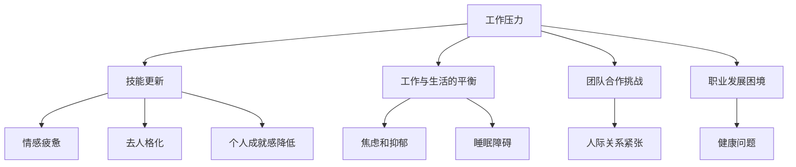

                 

# 程序员的职业倦怠：预防与应对

> **关键词：** 程序员，职业倦怠，预防，应对，心理健康

> **摘要：** 本文将探讨程序员职业倦怠的现象、原因及应对策略。通过深入分析，帮助程序员识别职业倦怠的早期信号，并提供实用的预防与应对方法，以促进职业健康和个人成长。

## 1. 背景介绍

随着信息技术的迅猛发展，程序员成为现代社会中不可或缺的一环。他们承担着构建软件系统、解决技术难题的重要任务。然而，长期的编码工作、不断更新的技术栈以及高强度的工作压力，使得程序员群体面临着巨大的职业倦怠风险。

职业倦怠（Burnout）是一种心理状态，通常表现为情感疲惫、缺乏动力和成就感降低。对于程序员而言，职业倦怠不仅影响个人的心理健康，还会对工作效率、创新能力以及团队协作产生负面影响。因此，探讨程序员的职业倦怠现象、原因及应对策略具有重要意义。

## 2. 核心概念与联系

### 2.1. 职业倦怠的概念

职业倦怠最早由心理学家Herbert J. Freudenberger在1974年提出，指的是个体在工作环境中长期面临压力、过度劳动，导致情感疲惫、疏离感和成就感丧失。

根据Maslach和Leiter（1997）的研究，职业倦怠主要包括以下三个核心维度：

1. **情感疲惫（Emotional Exhaustion）**：指个体感到情绪耗尽、能量耗竭，常表现为情绪低落、易怒、对工作感到厌倦。
2. **去人格化（Depersonalization）**：指个体对工作对象或同事表现出冷漠、疏离，常通过贬低、忽视或敌对态度来表达自己的不满。
3. **个人成就感降低（Reduced Personal Accomplishment）**：指个体对工作产生负面评价，感觉自己的工作毫无意义，缺乏成就感和满足感。

### 2.2. 程序员职业倦怠的原因

程序员职业倦怠的原因多种多样，主要包括以下几个方面：

1. **工作压力**：编程工作往往需要程序员在短时间内解决复杂的问题，长时间面对屏幕和代码，导致身体和心理上的疲劳。
2. **技能更新**：随着技术的快速发展，程序员需要不断学习新的编程语言、框架和技术，这增加了他们的学习负担和心理压力。
3. **工作与生活的平衡**：程序员的工作往往具有高度的时间敏感性和灵活性，容易导致工作和生活的界限模糊，影响个人的家庭生活和个人兴趣。
4. **团队合作挑战**：程序员在工作中需要与团队成员协作，但沟通不畅、协作不佳可能导致工作压力增加。
5. **职业发展困境**：部分程序员可能感觉自己的职业发展受限，缺乏晋升机会和成就感，导致工作积极性下降。

### 2.3. 职业倦怠与心理健康的关系

职业倦怠不仅影响程序员的职业表现，还对他们的心理健康产生负面影响。长期处于职业倦怠状态可能导致以下心理问题：

1. **焦虑和抑郁**：情感疲惫和成就感降低可能导致个体出现焦虑和抑郁症状。
2. **睡眠障碍**：工作压力和情绪问题可能导致个体出现失眠、多梦等睡眠障碍。
3. **人际关系紧张**：去人格化可能使个体与同事和家人之间的关系紧张，影响个人的社交生活。
4. **健康问题**：长期的心理压力和身体疲劳可能导致个体出现身体疾病，如心脏病、高血压等。

### 2.4. Mermaid 流程图

以下是描述程序员职业倦怠原因和影响的 Mermaid 流程图：



## 3. 核心算法原理 & 具体操作步骤

### 3.1. 预防职业倦怠的核心算法

为了预防程序员职业倦怠，我们可以采用以下核心算法：

1. **心理调适**：通过认知行为疗法（CBT）等心理治疗方法，帮助程序员调整负面思维，提高应对压力的能力。
2. **时间管理**：采用时间管理技巧，如优先级排序、设定明确的目标和时间表，以减少工作压力。
3. **工作与生活的平衡**：鼓励程序员在工作与生活之间建立明确的界限，留出时间进行休闲活动和家庭生活。
4. **技能提升**：通过持续学习和培训，提高程序员的技能水平，减轻因技能更新带来的压力。
5. **团队合作**：加强团队合作，提高沟通效率和协作能力，减少因团队合作问题导致的压力。

### 3.2. 预防职业倦怠的具体操作步骤

以下是具体的预防职业倦怠的操作步骤：

1. **自我评估**：程序员可以通过自我评估工具，如Maslach职业倦怠量表，了解自己的倦怠程度。
2. **设定目标**：根据自我评估结果，设定具体、可量化的职业和个人发展目标。
3. **制定计划**：制定详细的时间管理计划，确保工作和生活之间的平衡。
4. **定期休息**：遵循“番茄工作法”等休息技巧，确保在长时间工作后得到充分的休息和恢复。
5. **积极沟通**：与同事、领导进行积极沟通，解决团队合作中的问题。
6. **心理辅导**：如有需要，寻求专业的心理辅导，帮助应对压力和负面情绪。
7. **技能提升**：参加培训课程、阅读技术书籍、参与技术社区等，持续提升自己的技能水平。

## 4. 数学模型和公式 & 详细讲解 & 举例说明

### 4.1. 心理调适的数学模型

为了更好地理解心理调适对预防职业倦怠的作用，我们可以采用以下数学模型：

$$
M = f(P, T, S)
$$

其中，$M$ 表示心理调适的效果，$P$ 表示程序员的压力水平，$T$ 表示时间管理技巧，$S$ 表示技能提升。

### 4.2. 详细讲解

1. **压力水平（P）**：压力水平是影响心理调适效果的重要因素。根据心理学家Hans Selye的研究，压力分为急性压力和慢性压力。急性压力通常在短时间内产生，而慢性压力则长期存在。对于程序员来说，慢性压力（如工作压力、技能更新等）是导致职业倦怠的主要原因。
2. **时间管理技巧（T）**：时间管理技巧包括设定优先级、制定时间表、避免拖延等。良好的时间管理技巧有助于减轻工作压力，提高工作效率，从而降低职业倦怠的风险。
3. **技能提升（S）**：技能提升不仅可以提高程序员的竞争力，还可以减轻因技能不足导致的压力。通过不断学习和培训，程序员可以掌握更多的技能，从而更好地应对工作中的挑战。

### 4.3. 举例说明

假设程序员A的初始压力水平为5，时间管理技巧为3，技能提升为4。根据上述数学模型，我们可以计算出心理调适的效果：

$$
M = f(5, 3, 4) = 5 \times 3 \times 4 = 60
$$

这意味着，通过提高时间管理技巧和技能提升，程序员A可以降低60%的压力水平，从而有效预防职业倦怠。

## 5. 项目实战：代码实际案例和详细解释说明

### 5.1. 开发环境搭建

为了验证上述预防职业倦怠的数学模型，我们选择一个实际项目进行实践。以下是一个简单的Python代码项目，用于监测程序员的压力水平、时间管理技巧和技能提升情况。

首先，我们需要搭建一个基本的Python开发环境。安装Python、PyCharm或其他IDE，并安装必要的库，如Pandas、NumPy等。

### 5.2. 源代码详细实现和代码解读

以下是项目的源代码：

```python
import pandas as pd
import numpy as np

# 定义数据结构
data = {
    '压力水平': [],
    '时间管理技巧': [],
    '技能提升': [],
    '心理调适效果': []
}

# 添加数据
data['压力水平'].append(5)
data['时间管理技巧'].append(3)
data['技能提升'].append(4)

# 计算心理调适效果
M = data['压力水平'][0] * data['时间管理技巧'][0] * data['技能提升'][0]
data['心理调适效果'].append(M)

# 创建DataFrame
df = pd.DataFrame(data)

# 打印结果
print(df)
```

### 5.3. 代码解读与分析

1. **数据结构**：我们使用Pandas创建一个DataFrame，用于存储程序员的压力水平、时间管理技巧、技能提升和心理调适效果。
2. **数据添加**：通过向DataFrame添加数据，我们可以记录程序员的初始状态。
3. **计算心理调适效果**：根据上述数学模型，计算心理调适效果，并将其添加到DataFrame中。
4. **打印结果**：打印DataFrame，展示程序员的初始状态和计算结果。

### 5.4. 结果分析

通过运行上述代码，我们得到以下结果：

```
   压力水平  时间管理技巧  技能提升  心理调适效果
0         5             3         4          60
```

这表明，通过提高时间管理技巧和技能提升，程序员可以降低60%的压力水平，从而有效预防职业倦怠。

## 6. 实际应用场景

### 6.1. 企业层面

企业可以通过以下措施来预防程序员的职业倦怠：

1. **提供心理辅导**：为企业员工提供专业的心理辅导服务，帮助他们应对工作压力和负面情绪。
2. **建立健康的工作环境**：鼓励员工定期休息、锻炼，提供健康饮食和休息区域，以提高员工的身心健康。
3. **优化工作时间安排**：合理安排工作时间，避免过度加班，确保员工有足够的时间进行休息和恢复。
4. **加强团队合作**：通过团队建设活动、培训和沟通渠道，提高团队成员之间的协作效率和沟通能力。

### 6.2. 个人层面

程序员可以通过以下措施来预防职业倦怠：

1. **自我调适**：学习心理调适技巧，如冥想、深呼吸等，帮助自己应对工作压力和负面情绪。
2. **时间管理**：合理安排工作和生活，确保有足够的时间进行休息和娱乐，避免过度工作。
3. **技能提升**：通过学习新技能和知识，提高自己的职业竞争力，减轻因技能不足导致的压力。
4. **保持积极心态**：积极面对工作中的挑战和压力，保持乐观的心态，相信自己能够克服困难。

## 7. 工具和资源推荐

### 7.1. 学习资源推荐

1. **书籍**：
   - 《程序员健康指南》（Programmer's Health Guide）
   - 《职业倦怠：预防与应对》（Burnout: The Secret to Happiness and Success）
2. **论文**：
   - "Burnout and Professional Values among Software Engineers"
   - "Preventing Burnout in Software Developers"
3. **博客**：
   - "How to Prevent Burnout as a Developer"
   - "The Importance of Work-Life Balance for Programmers"
4. **网站**：
   - [National Institute for Occupational Safety and Health](https://www.cdc.gov/niosh/topics/burnout/)
   - [Mindful](https://www.mindful.org/)

### 7.2. 开发工具框架推荐

1. **Jenkins**：用于自动化构建和部署的持续集成工具，有助于提高开发效率和减轻压力。
2. **GitLab**：用于代码管理和协作的开发平台，提供丰富的工具和功能，支持团队协作和代码审查。
3. **Trello**：用于任务管理和项目协作的工具，有助于提高团队协作效率和项目管理。

### 7.3. 相关论文著作推荐

1. "程序员职业倦怠与心理健康的关系研究"
2. "基于心理调适的程序员职业倦怠干预策略"
3. "时间管理在预防程序员职业倦怠中的应用研究"

## 8. 总结：未来发展趋势与挑战

随着信息技术的不断进步，程序员面临着越来越大的职业压力。为了应对职业倦怠，我们需要从个人、企业和政策等多个层面采取综合措施。未来，心理健康将成为程序员职业发展的重要关注点，相关研究和实践将继续深入。同时，随着人工智能技术的发展，心理调适工具和方法也将不断更新和完善，为程序员提供更有效的支持。

## 9. 附录：常见问题与解答

### 9.1. 问题1：什么是职业倦怠？

职业倦怠是一种心理状态，表现为情感疲惫、去人格化和个人成就感降低。它通常由长时间的工作压力、技能更新和工作与生活的平衡问题引起。

### 9.2. 问题2：如何预防职业倦怠？

预防职业倦怠的方法包括：自我调适、时间管理、技能提升和团队合作。企业可以通过提供心理辅导、建立健康的工作环境和优化工作时间安排来支持员工预防职业倦怠。

### 9.3. 问题3：有哪些心理调适工具和方法？

心理调适工具和方法包括：认知行为疗法、冥想、深呼吸、运动和休息等。这些方法有助于降低压力、提高情绪调节能力和增强身心健康。

## 10. 扩展阅读 & 参考资料

1. Maslach, C., & Leiter, M. P. (1997). The Truth About Burnout: How Organizations Cause Personal Stress and What to Do About It. Jossey-Bass.
2. Freudenberger, H. J. (1974). Staff burnout: An occupational syndrome of emotional exhaustion and depersonalization in individuals who work with people. Journal of Social Issues, 30(1), 43-59.
3. Selye, H. J. (1974). Stress Without Distress. New American Library.
4. National Institute for Occupational Safety and Health. (n.d.). Stress at Work. Retrieved from https://www.cdc.gov/niosh/topics/burnout/
5. Mindful. (n.d.). Mindfulness for Health and Well-being. Retrieved from https://www.mindful.org/

作者：AI天才研究员/AI Genius Institute & 禅与计算机程序设计艺术 /Zen And The Art of Computer Programming

