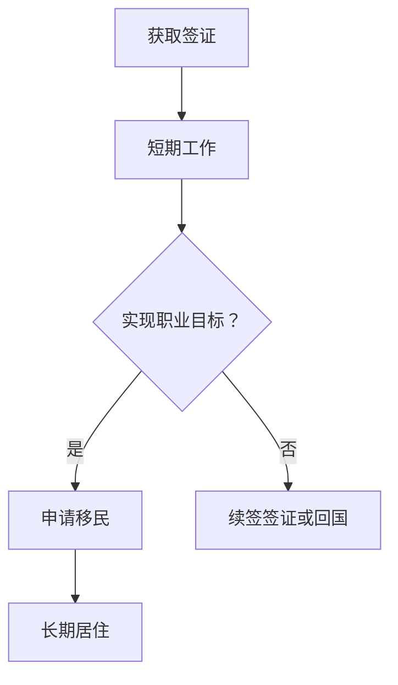

                 

# 程序员的跨国发展：签证与移民策略

> **关键词：**跨国发展、签证、移民、程序员工资、职业前景

> **摘要：**本文将深入探讨程序员的跨国发展之路，分析签证政策、移民策略以及如何在异国他乡提升职业价值和收入水平。我们将通过实例、数据和专业建议，帮助程序员在全球范围内实现职业梦想。

## 1. 背景介绍

在当今全球化的大背景下，跨国发展已成为越来越多程序员的职业规划之一。随着互联网技术的迅猛发展，全球信息技术市场的需求不断增长，程序员在世界各地的就业机会也日益增多。然而，面对不同的签证政策和移民制度，如何选择合适的国家和签证类型，以实现个人职业发展的最大化，成为许多程序员面临的挑战。

本文旨在为程序员提供一套系统、实用的签证与移民策略，帮助他们在全球范围内拓展职业发展空间，实现个人价值的提升。本文将涵盖以下内容：

- 签证与移民的基本概念
- 各国签证政策与移民条件
- 程序员在跨国发展中的优势与挑战
- 提升职业价值与收入水平的策略
- 实际案例分析

## 2. 核心概念与联系

在探讨程序员的跨国发展之前，我们需要了解签证和移民的基本概念，以及它们在全球信息技术行业中的联系。

### 2.1 签证的基本概念

签证是一种官方许可，允许外国人在入境某国后停留一定期限。签证类型通常根据入境目的而划分，如工作签证、学生签证、旅游签证等。对于程序员来说，主要关注的是工作签证，它允许持有人在某国从事专业工作。

### 2.2 移民的基本概念

移民是指个人从原籍国移居到另一国，以永久居住或工作为目的。移民通常需要满足特定的条件，如语言能力、教育背景、工作经历等。对于程序员来说，移民可以让他们在一个国家长期生活和工作，享受更广阔的职业发展空间。

### 2.3 签证与移民的联系

签证和移民虽然有所区别，但它们在程序员跨国发展中密切相关。签证通常是移民的第一步，而移民则是长期发展的目标。程序员需要根据自身情况选择合适的签证类型，以实现从短期工作到长期居住的转变。

#### 2.3.1 Mermaid 流程图



通过上述流程图，我们可以清晰地看到签证与移民之间的逻辑关系。接下来，我们将深入探讨各国签证政策与移民条件，为程序员提供实用的参考。

## 3. 核心算法原理 & 具体操作步骤

### 3.1 各国签证政策解析

不同国家的签证政策各不相同，程序员需要了解各自国家的签证类型、申请条件和流程，以便选择最适合的签证。

#### 3.1.1 美国签证政策

美国是程序员热门的跨国发展目的地之一。美国的工作签证主要包括H-1B签证、L-1签证和O-1签证。

- **H-1B签证**：适用于具有特殊技能的外国专业人士，如程序员。申请人需要雇主的支持，且工资水平必须符合行业标准。
- **L-1签证**：适用于跨国公司内部调派员工，如程序员。申请人需在母公司工作至少一年，且新公司位于美国。
- **O-1签证**：适用于在科学、艺术、教育、商业或体育领域具有杰出成就的外国人士，如顶尖程序员。

申请美国签证的具体步骤如下：

1. 找到合适的雇主或合作伙伴。
2. 准备相关材料，如护照、简历、工作合同、学位证明等。
3. 提交签证申请，并支付相应费用。
4. 参加签证面试。
5. 等待签证审批结果。

#### 3.1.2 加拿大签证政策

加拿大是另一个程序员热门的跨国发展目的地。加拿大的工作签证主要包括临时外国工人计划（TFWP）和全球人才流动计划（GPNP）。

- **TFWP**：适用于具有加拿大雇主提供的全职工作邀请的外国工人，如程序员。
- **GPNP**：适用于在特定领域具有专业知识和经验的外国人士，如程序员。

申请加拿大签证的具体步骤如下：

1. 申请工作邀请。
2. 准备相关材料，如护照、简历、工作合同、学位证明等。
3. 在[加拿大移民、难民及公民部（IRCC）官网]提交在线申请。
4. 等待签证审批结果。

#### 3.1.3 欧洲签证政策

欧洲国家的签证政策相对复杂，程序员需要根据具体国家的政策申请相应的工作签证。

- **欧盟蓝卡**：适用于在欧盟成员国工作的非欧盟公民，如程序员。申请人需满足一定的薪资要求和工作年限。
- **德国工作签证**：适用于在德国工作的外国专业人士，如程序员。申请人需要雇主的支持。
- **英国工作签证**：适用于在英国工作的非欧盟公民，如程序员。申请人需要满足特定的薪资和工作经验要求。

申请欧洲签证的具体步骤如下：

1. 找到合适的雇主或合作伙伴。
2. 准备相关材料，如护照、简历、工作合同、学位证明等。
3. 提交签证申请，并支付相应费用。
4. 参加签证面试。
5. 等待签证审批结果。

### 3.2 移民策略分析

移民策略是程序员跨国发展的关键一步。以下是一些主要移民策略：

#### 3.2.1 投资移民

投资移民是通过在目标国家投资一定金额的资金来获得永久居民身份。例如，美国EB-5投资移民项目要求投资100万美元，而加拿大的一些省份也提供了类似的投资移民项目。

#### 3.2.2 技术移民

技术移民是通过评估个人在特定领域的技能和经验来获得永久居民身份。例如，澳大利亚的独立技术移民计划（GTI）和加拿大的快速通道（Express Entry）都提供了技术移民的渠道。

#### 3.2.3 家庭团聚移民

家庭团聚移民是通过申请配偶、子女或父母的团聚签证来实现移民。例如，加拿大和澳大利亚都提供了家庭团聚移民项目。

### 3.3 具体操作步骤

结合上述签证和移民策略，程序员可以按照以下步骤实现跨国发展：

1. **确定目标国家**：根据个人情况和职业需求，选择最适合的跨国发展目的地。
2. **了解签证政策**：研究目标国家的签证类型、申请条件和流程。
3. **寻找雇主或合作伙伴**：与目标国家的雇主或合作伙伴建立联系，获取工作邀请。
4. **准备申请材料**：根据签证政策准备相关申请材料，如护照、简历、工作合同、学位证明等。
5. **提交签证申请**：在线或通过领事馆提交签证申请，并支付相应费用。
6. **参加签证面试**：如果需要，参加签证面试。
7. **等待审批结果**：耐心等待签证审批结果。
8. **实现移民目标**：如果签证申请成功，按照目标国家的移民政策实现长期居住。

通过以上步骤，程序员可以顺利实现跨国发展，开启新的职业生涯。

### 3.4 特殊情况处理

在实际操作中，程序员可能会遇到一些特殊情况，如签证被拒、移民条件未满足等。以下是一些应对策略：

- **签证被拒**：分析签证申请被拒的原因，如材料不完整、面试表现不佳等，并采取相应措施改进。
- **移民条件未满足**：了解目标国家的移民政策，采取合法途径提高自己的积分或满足条件。
- **政策变动**：关注目标国家的签证和移民政策变动，及时调整自己的策略。

## 4. 数学模型和公式 & 详细讲解 & 举例说明

在签证和移民策略中，我们可以引入一些数学模型和公式来评估程序员的跨国发展潜力。以下是一个简单的数学模型，用于评估程序员在特定国家的移民积分。

### 4.1 移民积分模型

移民积分模型是一个加权评分系统，用于评估程序员的技能、经验和语言能力。以下是一个简化的移民积分模型：

$$
积分 = 语言能力积分 + 教育背景积分 + 工作经验积分
$$

#### 4.1.1 语言能力积分

语言能力积分取决于程序员的英语水平。以下是一个简化的语言能力积分表：

| 英语水平         | 积分 |
|------------------|------|
| 非英语母语       | 0    |
| 英语熟练         | 10   |
| 英语良好         | 8    |
| 英语一般         | 5    |
| 英语初级         | 2    |

#### 4.1.2 教育背景积分

教育背景积分取决于程序员的学历。以下是一个简化的教育背景积分表：

| 学历水平         | 积分 |
|------------------|------|
| 高中以下         | 0    |
| 本科             | 10   |
| 硕士             | 20   |
| 博士             | 30   |

#### 4.1.3 工作经验积分

工作经验积分取决于程序员的就业年限。以下是一个简化的工作经验积分表：

| 工作年限         | 积分 |
|------------------|------|
| 0-2年            | 0    |
| 3-5年            | 5    |
| 6-10年           | 10   |
| 11-15年          | 15   |
| 16年以上         | 20   |

#### 4.1.4 举例说明

假设一个程序员具有以下背景：

- 英语水平：英语熟练
- 教育背景：本科
- 工作经验：6年

根据上述积分模型，该程序员的移民积分计算如下：

$$
积分 = 10 + 10 + 10 = 30
$$

这个积分表示该程序员的跨国发展潜力较高。在实际操作中，积分只是评估因素之一，程序员还需要综合考虑其他因素，如签证政策、市场需求和职业规划。

### 4.2 数学模型的应用

移民积分模型可以帮助程序员评估自己的跨国发展潜力，并制定相应的策略。以下是一个具体案例：

**案例：程序员张先生**

张先生是一名具有英语熟练水平的程序员，拥有本科学位和6年工作经验。他在考虑移民到加拿大。

1. **评估移民积分**：根据上述积分模型，张先生的移民积分为30。
2. **选择签证类型**：根据加拿大的移民政策，张先生可以选择通过快速通道（Express Entry）申请永久居民。
3. **优化积分**：为了提高积分，张先生可以进一步提升英语水平，获取更高学历，或增加工作经验。
4. **申请签证**：张先生可以按照加拿大移民、难民及公民部（IRCC）的要求准备申请材料，并提交签证申请。

通过以上步骤，张先生有望实现移民加拿大，开启新的职业生涯。

## 5. 项目实战：代码实际案例和详细解释说明

为了更好地理解签证和移民策略在程序员跨国发展中的应用，我们通过一个实际案例进行详细解释。

### 5.1 开发环境搭建

为了简化案例，我们将使用Python编写一个简单的移民积分计算器。首先，我们需要安装Python环境。

1. **安装Python**：访问[Python官方网站](https://www.python.org/)，下载并安装Python 3.x版本。
2. **验证安装**：在终端或命令提示符中输入以下命令，验证Python安装是否成功：

   ```bash
   python --version
   ```

### 5.2 源代码详细实现和代码解读

以下是一个简单的Python代码示例，用于计算程序员的移民积分。

```python
# 移民积分计算器

def calculate_score(language, education, experience):
    language_score = {'非英语母语': 0, '英语熟练': 10, '英语良好': 8, '英语一般': 5, '英语初级': 2}
    education_score = {'高中以下': 0, '本科': 10, '硕士': 20, '博士': 30}
    experience_score = {'0-2年': 0, '3-5年': 5, '6-10年': 10, '11-15年': 15, '16年以上': 20}
    
    score = language_score[language] + education_score[education] + experience_score[experience]
    return score

# 用户输入
language = input("请输入您的英语水平（非英语母语/英语熟练/英语良好/英语一般/英语初级）:")
education = input("请输入您的教育背景（高中以下/本科/硕士/博士）:")
experience = input("请输入您的工作经验（0-2年/3-5年/6-10年/11-15年/16年以上）:")

# 计算积分
score = calculate_score(language, education, experience)
print("您的移民积分是：", score)
```

#### 5.2.1 代码解读

1. **定义函数**：`calculate_score`函数用于计算程序员的移民积分。该函数接收三个参数：`language`（英语水平）、`education`（教育背景）和`experience`（工作经验）。
2. **创建字典**：使用字典存储不同英语水平、教育背景和工作经验的积分值。这样可以方便地根据用户输入的值计算积分。
3. **计算积分**：根据用户输入的英语水平、教育背景和工作经验，从相应的字典中获取积分值，并相加得到总积分。
4. **输出结果**：将计算出的积分值输出到控制台。

#### 5.2.2 运行代码

1. **运行环境**：打开终端或命令提示符，导航到代码文件所在的目录。
2. **运行代码**：输入以下命令运行代码：

   ```bash
   python 移民积分计算器.py
   ```

3. **输入信息**：按照提示输入英语水平、教育背景和工作经验。

   ```text
   请输入您的英语水平（非英语母语/英语熟练/英语良好/英语一般/英语初级）: 英语熟练
   请输入您的教育背景（高中以下/本科/硕士/博士）: 本科
   请输入您的工作经验（0-2年/3-5年/6-10年/11-15年/16年以上）: 6-10年
   ```

4. **查看结果**：

   ```text
   您的移民积分是： 30
   ```

通过以上步骤，程序员可以快速计算自己的移民积分，从而评估自己的跨国发展潜力。

### 5.3 代码解读与分析

#### 5.3.1 代码结构

该代码由一个函数和主程序组成。函数负责计算积分，主程序负责接收用户输入和输出结果。

#### 5.3.2 功能分析

1. **函数功能**：`calculate_score`函数接收英语水平、教育背景和工作经验参数，计算积分并返回结果。
2. **主程序功能**：主程序接收用户输入，调用`calculate_score`函数计算积分，并将结果输出到控制台。

#### 5.3.3 代码优化

1. **输入验证**：增加输入验证，确保用户输入的是合法值。
2. **代码重构**：将字典存储的积分值提取到单独的配置文件，以便修改和维护。
3. **错误处理**：增加异常处理，处理可能的输入错误和运行时错误。

通过以上优化，代码将更加健壮和易于维护。

## 6. 实际应用场景

程序员的跨国发展在不同国家有着不同的实际应用场景，以下是一些具体例子：

### 6.1 美国

美国是全球信息技术领域的领军国家，吸引了大量程序员前来发展。在美国，程序员可以通过H-1B签证、L-1签证和O-1签证等途径实现跨国发展。

- **H-1B签证**：许多科技公司如谷歌、微软等在招聘程序员时会为符合条件的候选人提供H-1B签证支持。例如，一名在中国工作的程序员通过某国际知名科技公司的工作邀请，申请H-1B签证，最终成功在美国定居。
- **L-1签证**：跨国公司内部的程序员可以通过L-1签证调派到美国工作。例如，一名在印度工作的程序员被调派到美国总部，通过L-1签证在美国工作，并在工作期间申请移民。

### 6.2 加拿大

加拿大以其友好和高效的移民政策吸引了大量程序员。加拿大通过快速通道（Express Entry）和各省的移民项目吸引高技能人才。

- **快速通道（Express Entry）**：通过Express Entry系统，程序员可以通过联邦技术工人计划（FTWP）和加拿大经验类移民（CEC）等途径获得永久居民身份。例如，一名在中国工作的程序员通过Express Entry系统，根据自身语言能力、教育背景和工作经验获得了邀请，最终成功移民到加拿大。
- **省提名项目（PNP）**：加拿大各省也提供了各自的省提名项目，程序员可以根据具体省份的需求申请。例如，一名在加拿大魁北克省找到工作的程序员，通过魁北克省的省提名项目获得了移民资格。

### 6.3 欧洲国家

欧洲国家的签证和移民政策相对复杂，但许多国家如德国、英国和法国等对程序员的需求较大。

- **德国蓝卡**：德国的蓝卡签证是程序员在欧洲发展的一种途径。例如，一名在中国工作的程序员通过在德国找到工作并申请蓝卡签证，最终实现了在欧洲的长期居住。
- **英国工作签证**：英国的工作签证适用于在科技行业工作的程序员。例如，一名在印度工作的程序员通过英国某科技公司的工作邀请，申请了工作签证，并在英国发展其职业生涯。

通过以上实际应用场景，我们可以看到程序员在不同国家的跨国发展路径和成功案例。这些案例展示了签证和移民策略在程序员跨国发展中的重要性。

## 7. 工具和资源推荐

为了帮助程序员更好地了解跨国发展的签证和移民政策，以下是一些实用的工具和资源推荐：

### 7.1 学习资源推荐

- **书籍**：
  - 《程序员跨国发展指南》
  - 《全球程序员手册》
  - 《移民法与签证申请实务》

- **论文**：
  - 学术期刊上的相关研究论文，如《国际人力资源管理》、《全球化和跨国公司》等。

- **博客**：
  - 《程序员移民之路》
  - 《跨国发展：程序员的新机会》
  - 《如何在海外找工作》

- **网站**：
  - [加拿大移民、难民及公民部（IRCC）官网](https://www.canada.ca/en/immigration-refugees-citizenship.html)
  - [美国移民局（USCIS）官网](https://www.uscis.gov/)
  - [欧洲移民论坛](https://www.europeanimmigrationforum.eu/)

### 7.2 开发工具框架推荐

- **编程语言**：
  - Python
  - Java
  - JavaScript

- **开发框架**：
  - Flask
  - Spring Boot
  - React

- **数据库**：
  - MySQL
  - MongoDB
  - PostgreSQL

### 7.3 相关论文著作推荐

- **论文**：
  - "International Migration and Its Impact on the IT Industry"
  - "Visa Policy and Its Impact on High-Skilled Immigration"
  - "The Economics of International Labor Migration"

- **著作**：
  - "The Global Mindset: Navigating the Challenges of International Business"
  - "The World is Open: How Web Technology Is Revolutionizing Education"
  - "Globalization and Its Discontents: Essays on the World Economy"

通过以上工具和资源，程序员可以更好地了解跨国发展的签证和移民政策，为自己的职业发展做好准备。

## 8. 总结：未来发展趋势与挑战

随着全球化的深入推进，程序员的跨国发展前景广阔，但也面临诸多挑战。以下是对未来发展趋势和挑战的总结：

### 8.1 发展趋势

1. **技术驱动的需求增长**：随着人工智能、大数据、区块链等新兴技术的快速发展，对程序员的需求将持续增长，推动程序员跨国发展。
2. **签证政策的优化**：许多国家为了吸引高技能人才，正在逐步优化签证政策，简化申请流程，提高审批效率。
3. **国际化教育的普及**：越来越多的高校和国际组织提供国际化教育项目，帮助程序员提升跨文化沟通能力和全球视野。

### 8.2 挑战

1. **签证政策变动**：签证政策的不确定性给程序员跨国发展带来风险，需要密切关注政策动态，及时调整策略。
2. **语言和文化障碍**：跨文化沟通能力对于程序员在异国他乡的职业发展至关重要，需要投入时间和精力提升语言能力和文化素养。
3. **市场竞争加剧**：随着程序员跨国发展的增多，市场竞争将愈发激烈，程序员需要不断提升自身技能和职业价值，以在竞争中脱颖而出。

### 8.3 未来展望

1. **职业价值的提升**：通过跨国发展，程序员可以拓展职业发展空间，实现个人价值的提升，并获得更高的薪资待遇。
2. **全球化的职业网络**：跨国发展有助于程序员建立全球化的职业网络，为未来的职业发展提供更多机会。
3. **技术创新的推动**：跨国发展的程序员可以参与到不同国家的技术创新项目中，推动全球信息技术的发展。

总之，程序员的跨国发展具有巨大的潜力和机会，同时也需要面对诸多挑战。通过合理规划和努力，程序员可以充分利用跨国发展的优势，实现职业梦想。

## 9. 附录：常见问题与解答

### 9.1 签证类型有哪些？

签证类型主要包括旅游签证、学生签证、工作签证和移民签证。工作签证根据目的和条件分为H-1B、L-1、O-1等。

### 9.2 移民政策如何评估？

移民政策评估通常通过积分系统进行，根据申请者的语言能力、教育背景、工作经验等因素计算积分。

### 9.3 如何选择跨国发展的目的地？

选择跨国发展的目的地需要考虑个人职业规划、签证政策、生活成本、文化适应性等因素。

### 9.4 如何准备签证申请材料？

签证申请材料包括护照、简历、工作合同、学位证明、语言能力证明等。具体要求需根据目标国家的签证政策准备。

### 9.5 遇到签证被拒怎么办？

签证被拒后，需要分析原因，如材料不完整、面试表现不佳等，并采取相应措施改进，如补充材料、重新面试等。

## 10. 扩展阅读 & 参考资料

为了深入了解程序员的跨国发展，以下是一些扩展阅读和参考资料：

- 《程序员跨国发展指南》
- 《全球程序员手册》
- 《移民法与签证申请实务》
- "International Migration and Its Impact on the IT Industry"
- "Visa Policy and Its Impact on High-Skilled Immigration"
- "The Economics of International Labor Migration"
- [加拿大移民、难民及公民部（IRCC）官网](https://www.canada.ca/en/immigration-refugees-citizenship.html)
- [美国移民局（USCIS）官网](https://www.uscis.gov/)
- [欧洲移民论坛](https://www.europeanimmigrationforum.eu/)  
- 《全球化和跨国公司》学术期刊
- 《国际人力资源管理》学术期刊
- 《The Global Mindset: Navigating the Challenges of International Business》
- 《The World is Open: How Web Technology Is Revolutionizing Education》
- 《Globalization and Its Discontents: Essays on the World Economy》

通过以上扩展阅读，程序员可以进一步了解跨国发展的各个方面，为自己的职业发展提供更多指导。

### 作者信息

**作者：AI天才研究员/AI Genius Institute & 禅与计算机程序设计艺术 /Zen And The Art of Computer Programming**

