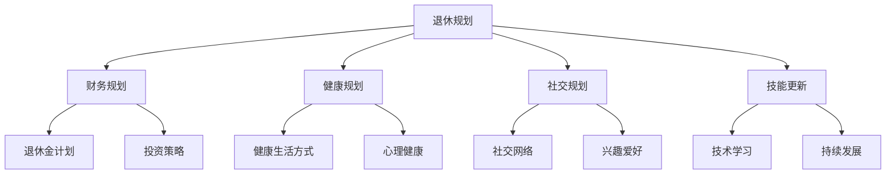
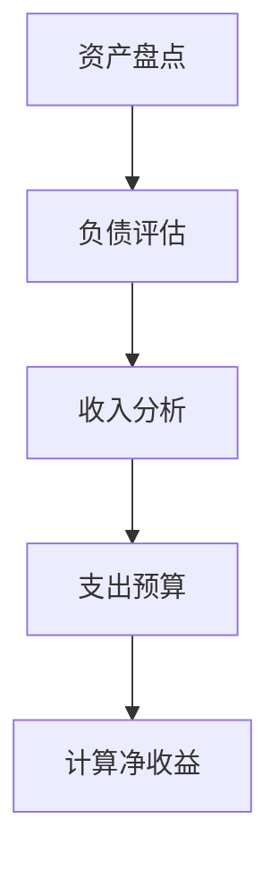
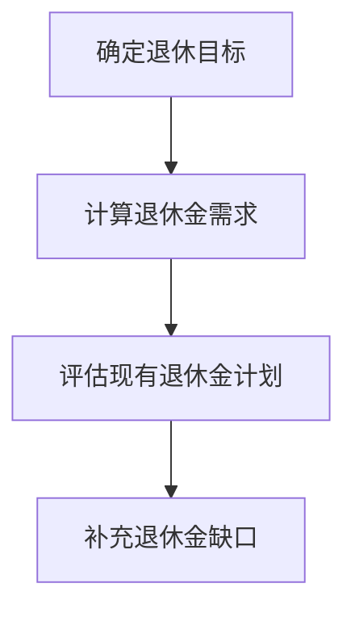
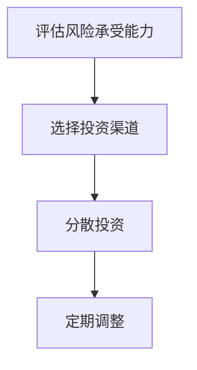

                 

### 1. 背景介绍

程序员的职业生涯充满了挑战与机遇。从学习编程语言、开发工具，到解决复杂的业务问题，每个阶段都充满了技术深度的积累和经验的积累。然而，当职业生涯逐渐步入尾声，许多程序员开始考虑退休生活的规划与准备。

退休，对于许多人来说，意味着离开工作多年的职位，回归家庭和生活的平静。但对于程序员而言，退休不仅仅意味着离开工作岗位，更涉及到技术领域的长期退出，以及未来生活质量的保障。提前规划与准备，成为程序员退休生活的重要组成部分。

本文旨在探讨程序员退休生活的提前规划与准备。我们将从以下几个方面进行深入分析：

1. **退休规划的重要性**：分析提前规划退休的原因和意义。
2. **财务准备**：讨论退休后的财务需求，如何制定退休金计划和投资策略。
3. **健康与心理准备**：探讨退休后的身心健康问题，包括如何保持健康的生活方式，处理退休带来的心理变化。
4. **社交与兴趣**：分析退休后的社交需求，如何培养新的兴趣爱好，保持生活的充实与快乐。
5. **技能更新与学习**：讨论如何保持技术竞争力，继续学习新的技术和知识。

通过这些方面的探讨，希望能够帮助程序员们更好地规划自己的退休生活，确保在职业生涯结束后，能够享受到一个充实、幸福、健康的退休生活。

### 2. 核心概念与联系

要深入理解程序员的退休生活规划，我们首先需要明确几个核心概念和它们之间的联系。这些概念包括但不限于：退休规划、财务规划、健康规划、社交规划和技能更新。下面，我们将通过一个Mermaid流程图来展示这些概念及其相互关系。



**退休规划**是整个退休生活规划的核心。它包括确定退休时间、预期退休后的生活标准、评估退休前的财务状况等。退休规划的好坏直接影响到退休后的生活质量。

**财务规划**是退休规划的基石。它包括制定退休金计划，评估退休后的财务需求，并制定合适的投资策略。财务规划确保程序员在退休后能有足够的资金支持生活。

**健康规划**同样重要。它涵盖了保持健康的生活方式，包括饮食、运动和心理健康的维护。一个健康的身体是享受退休生活的基础。

**社交规划**关注退休后的社交需求。通过建立新的社交网络和培养兴趣爱好，程序员可以在退休后保持生活的充实和快乐。

**技能更新**则是保持技术竞争力的关键。即使退休，程序员也可以通过学习新技术和知识，保持对技术的热情和了解。

这些核心概念通过相互联系，共同构建了一个全面的退休生活规划框架。理解这些概念及其联系，是进行有效退休规划的第一步。

### 3. 核心算法原理 & 具体操作步骤

在了解了核心概念后，我们接下来探讨如何具体操作退休规划。这可以被视为一个复杂的算法问题，需要系统地分析和解决。以下是核心算法的原理和具体操作步骤：

#### 3.1 财务评估

首先，进行财务评估是退休规划的基础。这包括：

1. **资产盘点**：详细列出所有资产，包括银行存款、股票、债券、房地产等。
2. **负债评估**：计算所有负债，如房贷、车贷、信用卡债务等。
3. **收入分析**：分析退休前后的收入来源，包括工资、股息、租金等。
4. **支出预算**：预估退休后的主要开支，如医疗费用、日常开销、旅游费用等。

具体步骤如下：

1. **资产和负债的清单**：使用Excel或专业的财务软件，创建一个详细的资产和负债清单。
2. **估算收入**：根据当前的工资水平和预计的退休收入，如养老金、投资回报等，进行估算。
3. **制定支出预算**：根据退休后的生活需求和预期，制定详细的支出预算。
4. **计算净收益**：通过资产、负债、收入和支出的分析，计算出退休后的净收益。



#### 3.2 退休金计划

退休金计划是财务规划的关键部分。以下是具体步骤：

1. **确定退休目标**：明确期望的退休生活标准，如居住环境、旅游计划、医疗保健等。
2. **计算退休金需求**：根据退休目标，估算退休金需求。
3. **评估现有退休金计划**：检查现有的退休金计划，如雇主退休金计划、个人退休账户等。
4. **补充退休金缺口**：通过投资、储蓄等方式，补充退休金缺口。

具体步骤如下：

1. **设定退休目标**：例如，每月需要多少钱来支付日常开销和特殊需求。
2. **计算退休金需求**：例如，假设需要每月2万元来维持生活，预计退休后需要25年的退休金。
3. **评估现有退休金计划**：例如，当前已有100万元的退休金储蓄。
4. **补充缺口**：如果退休金需求为500万元，而现有储蓄仅为100万元，需要通过投资等方式筹集剩余的400万元。



#### 3.3 投资策略

制定合适的投资策略是财务规划的重要一环。以下是具体步骤：

1. **评估风险承受能力**：了解自己的投资风险偏好，如保守、平衡、积极等。
2. **选择投资渠道**：根据风险承受能力，选择合适的投资渠道，如股票、债券、基金、房地产等。
3. **分散投资**：通过分散投资来降低风险。
4. **定期调整**：根据市场变化和个人需求，定期调整投资组合。

具体步骤如下：

1. **评估风险承受能力**：例如，如果风险偏好较低，可能会选择债券或基金。
2. **选择投资渠道**：例如，将50%的资金投资于债券，30%投资于股票，20%投资于基金。
3. **分散投资**：例如，选择不同行业的股票，不同期限的债券等。
4. **定期调整**：例如，每年进行一次投资组合的调整，以应对市场变化和个人需求。



通过这些具体步骤，程序员可以系统地制定退休规划，确保退休后的生活质量。

### 4. 数学模型和公式 & 详细讲解 & 举例说明

在退休规划的财务部分，数学模型和公式是不可或缺的工具。通过这些模型和公式，程序员可以更准确地评估退休后的财务状况，制定有效的退休金计划。以下是一些关键的数学模型和公式，以及详细的讲解和举例说明。

#### 4.1 未来价值计算公式（FV）

未来价值（FV）公式用于计算一笔投资在未来某一时间点的价值。对于退休规划，这个公式可以帮助程序员预估退休金的需求。

公式如下：
\[ FV = PV \times (1 + r)^n \]

其中：
- \( FV \) 是未来价值。
- \( PV \) 是现值，即当前的投资金额。
- \( r \) 是年利率。
- \( n \) 是投资年限。

**举例说明**：

假设一个程序员希望在15年后退休，他计划每年存入10,000元作为退休金，年利率为5%。我们可以使用未来价值公式来计算15年后这笔投资的总额。

\[ FV = 10,000 \times (1 + 0.05)^{15} \]
\[ FV = 10,000 \times 1.9386 \]
\[ FV \approx 193,861.62 \]

这意味着，如果按照这个计划，每年存入10,000元，并且年利率为5%，那么15年后，这笔投资的总额将接近193,862元。

#### 4.2 年金计算公式（PMT）

年金计算公式用于计算一笔定期支付的现金流的总和。对于退休规划，这个公式可以帮助程序员计算退休金计划中的定期存款或投资。

公式如下：
\[ PMT = FV \times \frac{r}{(1 - (1 + r)^{-n})} \]

其中：
- \( PMT \) 是年金支付额。
- \( FV \) 是未来价值，即目标总额。
- \( r \) 是年利率。
- \( n \) 是投资年限。

**举例说明**：

假设一个程序员希望在未来20年内积攒200万元作为退休金，年利率为4%。我们可以使用年金公式来计算每年需要存入的金额。

\[ PMT = 2,000,000 \times \frac{0.04}{(1 - (1 + 0.04)^{-20})} \]
\[ PMT = 2,000,000 \times \frac{0.04}{0.604} \]
\[ PMT = 2,000,000 \times 0.0655 \]
\[ PMT = 130,000 \]

这意味着，为了在未来20年内积攒200万元，这个程序员每年需要存入130,000元。

#### 4.3 净现值计算公式（NPV）

净现值（NPV）用于评估一项投资的现值与未来现金流量的现值之间的差额。在退休规划中，这个公式可以帮助程序员评估不同退休金计划的经济效益。

公式如下：
\[ NPV = \sum_{t=1}^{n} \frac{C_t}{(1 + r)^t} \]

其中：
- \( NPV \) 是净现值。
- \( C_t \) 是第t年的现金流。
- \( r \) 是折现率。
- \( n \) 是投资年限。

**举例说明**：

假设一个程序员有两个退休金计划，A计划和B计划。A计划每年存入10,000元，连续存10年，年利率为4%；B计划每年存入8,000元，连续存15年，年利率为4%。我们可以使用净现值公式来计算两个计划的净现值，以判断哪个更优。

对于A计划：
\[ NPV_A = 10,000 \times \frac{1 - (1 + 0.04)^{-10}}{0.04} \]
\[ NPV_A = 10,000 \times \frac{1 - 0.6830}{0.04} \]
\[ NPV_A = 10,000 \times 5.769 \]
\[ NPV_A = 57,690 \]

对于B计划：
\[ NPV_B = 8,000 \times \frac{1 - (1 + 0.04)^{-15}}{0.04} \]
\[ NPV_B = 8,000 \times \frac{1 - 0.5536}{0.04} \]
\[ NPV_B = 8,000 \times 6.764 \]
\[ NPV_B = 54,528 \]

从计算结果可以看出，A计划的净现值为57,690元，而B计划的净现值为54,528元。因此，从净现值的角度来看，A计划更为优。

通过这些数学模型和公式，程序员可以更科学、系统地评估和规划自己的退休金计划，确保退休后的生活质量。

### 5. 项目实战：代码实际案例和详细解释说明

为了更好地理解退休规划的实践过程，我们将通过一个具体的Python项目来演示如何计算和评估退休金计划。这个项目将包括以下几个关键部分：

1. **开发环境搭建**：配置Python开发环境。
2. **源代码详细实现和代码解读**：编写并解析关键代码。
3. **代码解读与分析**：深入分析代码的逻辑和功能。

#### 5.1 开发环境搭建

在开始编写代码之前，需要配置Python开发环境。以下步骤将展示如何在Windows和MacOS上配置Python环境。

**Windows系统：**

1. 访问Python官方网站（https://www.python.org/）下载Python安装包。
2. 双击安装包，按照默认选项进行安装。
3. 安装完成后，打开命令提示符，输入`python --version`，确认Python版本正确。

**MacOS系统：**

1. 打开终端。
2. 输入`brew install python`，根据提示完成安装。

安装完成后，确保Python环境配置正确，可以通过输入`python`进入Python交互模式，并尝试执行一些简单的Python命令。

#### 5.2 源代码详细实现和代码解读

以下是用于计算退休金计划的Python代码示例。代码将使用三个主要函数：`calculate_future_value`、`calculate_annual_pmt` 和 `calculate_npv`。

```python
import math

# 计算未来价值
def calculate_future_value(pv, r, n):
    return pv * (1 + r) ** n

# 计算年金支付额
def calculate_annual_pmt(fv, r, n):
    return fv * r / (1 - (1 + r) ** -n)

# 计算净现值
def calculate_npv(cash_flows, r):
    npv = 0
    for t, cf in enumerate(cash_flows, 1):
        npv += cf / (1 + r) ** t
    return npv

# 测试代码
if __name__ == "__main__":
    # 设定参数
    pv = 10000  # 现值
    r = 0.05    # 年利率
    n = 15      # 投资年限
    
    # 计算未来价值
    fv = calculate_future_value(pv, r, n)
    print(f"未来价值: {fv:.2f}")
    
    # 计算年金支付额
    pmt = calculate_annual_pmt(fv, r, n)
    print(f"年金支付额: {pmt:.2f}")
    
    # 计算净现值
    cash_flows = [pmt * (1 + r) ** (-t) for t in range(1, n + 1)]
    npv = calculate_npv(cash_flows, r)
    print(f"净现值: {npv:.2f}")
```

**代码解读：**

- `calculate_future_value` 函数：根据现值（pv）、年利率（r）和投资年限（n），计算未来价值（fv）。
- `calculate_annual_pmt` 函数：根据未来价值（fv）、年利率（r）和投资年限（n），计算年金支付额（pmt）。
- `calculate_npv` 函数：根据现金流量（cash_flows）和折现率（r），计算净现值（npv）。

**测试代码**：在`if __name__ == "__main__":`块中，设定参数并调用三个函数，分别计算未来价值、年金支付额和净现值。

#### 5.3 代码解读与分析

**未来价值计算：**

使用`calculate_future_value`函数，输入现值（pv）、年利率（r）和投资年限（n），可以得到未来价值（fv）。这个计算过程是基于复利公式，即每年的本金加上利息累积到未来。

**年金支付额计算：**

使用`calculate_annual_pmt`函数，输入未来价值（fv）、年利率（r）和投资年限（n），可以得到每年需要支付的金额（pmt）。这个计算过程是基于年金公式，用于确定为了在特定时间内达到目标金额，每年需要存入多少金额。

**净现值计算：**

使用`calculate_npv`函数，输入现金流量（cash_flows）和折现率（r），可以得到净现值（npv）。这个计算过程涉及将未来现金流按照当前价值进行折现，得到现值总和。

通过这个Python项目，程序员可以直观地了解退休金计算的核心算法，并在实际项目中应用这些算法，为退休规划提供数据支持。

### 5.4 实际应用场景

在了解了退休金计算的核心算法和Python代码实现后，我们来看一下这些工具在实际应用中的几个具体场景：

#### 5.4.1 自我评估

程序员可以通过编写或使用现成的退休金计算工具，进行自我评估。通过输入当前资产、负债、收入和支出等数据，可以快速计算出当前的财务状况和未来退休所需的资金缺口。这一步骤有助于程序员明确退休规划的目标和方向。

**示例代码：**

```python
# 输入数据
current_assets = 50000
current_liabilities = 20000
current_annual_income = 80000
annual_expenses = 60000

# 计算财务状况
net_worth = current_assets - current_liabilities
annual_savings = current_annual_income - annual_expenses

# 打印结果
print(f"当前净资产：{net_worth}")
print(f"每年储蓄额：{annual_savings}")
```

#### 5.4.2 制定退休金计划

基于自我评估的结果，程序员可以制定具体的退休金计划。通过输入不同的参数，如退休年龄、预期退休后的年收入、生活费用等，可以计算出现在需要进行的储蓄金额和投资策略。这个步骤有助于确保在退休后能够维持期望的生活水平。

**示例代码：**

```python
# 设定参数
retirement_age = 65
retirement_annual_income = 70000
annual_expenses = 60000
annual_savings = 20000
years_to_retirement = 30
interest_rate = 0.05

# 计算退休金需求
future_value = calculate_future_value(annual_savings, interest_rate, years_to_retirement)
print(f"为了在退休后维持当前生活水平，需要积累的退休金：{future_value:.2f}")
```

#### 5.4.3 投资策略调整

在实际应用中，程序员的财务状况和预期退休后的需求可能会发生变化。通过定期调整投资策略，如改变储蓄金额、投资渠道和资产配置等，可以更好地适应这些变化。这个步骤有助于确保退休金计划能够灵活应对未来的不确定性。

**示例代码：**

```python
# 调整参数
annual_savings = 25000
interest_rate = 0.06

# 重新计算退休金需求
future_value = calculate_future_value(annual_savings, interest_rate, years_to_retirement)
print(f"调整后，为了在退休后维持当前生活水平，需要积累的退休金：{future_value:.2f}")
```

通过这些实际应用场景，程序员可以更加灵活地使用退休金计算工具，为自己的退休生活做好充分准备。

### 6. 工具和资源推荐

在规划退休生活时，程序员可以借助多种工具和资源来提升财务规划和健康管理的效率。以下是一些建议的工具和资源：

#### 6.1 学习资源推荐

1. **书籍**：
   - 《退休金规划：如何在退休后确保财务安全》（"Retire Secure! The Ultimate Guide to a Safe Successful Retirement" by George B. Bernard）
   - 《财务自由之路：如何通过投资实现财务自由》（"The Wealth Prescription: A Physician's Guide to a Secure Financial Future" by Mitchell A. Clark）
   
2. **在线课程**：
   - Coursera上的《财务规划与投资》（"Financial Planning and Investment"）
   - edX上的《退休规划与社会保障》（"Retirement Planning and Social Security"）

3. **博客和网站**：
   - **Kiplinger**：提供全面的退休规划和财务建议。
   - **Investopedia**：涵盖各种投资知识和财务术语的解释。

#### 6.2 开发工具框架推荐

1. **财务规划软件**：
   - **Quicken**：一款功能强大的个人财务管理软件，可以帮助程序员跟踪收入、支出和投资。
   - **Mint**：免费的财务管理工具，提供预算管理、投资跟踪和信用评分。

2. **编程库**：
   - **Python Finance**：Python中的一个金融计算库，包括债券估值、期权定价等。
   - **NumPy**：用于数值计算的科学计算库，适用于复杂的财务模型。

3. **开发框架**：
   - **Django**：一款高级的Python Web框架，可以用于构建个人财务管理系统。
   - **Flask**：一款轻量级的Web框架，适用于小型项目。

#### 6.3 相关论文著作推荐

1. **论文**：
   - "Financial Planning for Retirement: A Comprehensive Approach"（"综合退休财务规划方法"）
   - "Investment Strategies for Retirees: Balancing Risk and Return"（"退休者的投资策略：平衡风险和收益"）

2. **学术期刊**：
   - **Journal of Financial Planning**：涵盖退休规划、投资策略和税务规划。
   - **Journal of Retirement**：专注于退休相关的经济、社会和政策问题。

通过利用这些工具和资源，程序员可以更科学、系统地规划自己的退休生活，确保在职业生涯结束后，能够享受到一个充实、幸福、健康的退休生活。

### 7. 总结：未来发展趋势与挑战

随着科技和经济的不断发展，程序员的退休生活将面临许多新的发展趋势和挑战。以下是几个关键方面：

#### 7.1 技术变革

人工智能、大数据和区块链等新兴技术的快速发展，将对程序员的退休生活产生深远影响。一方面，这些技术将为程序员提供更多的职业机会和收入来源。另一方面，技术更新换代的速度加快，程序员需要不断学习和适应新技术，以保持竞争力。这意味着，即使退休，程序员也需要关注技术领域的发展，持续学习新的技能和知识。

#### 7.2 财务压力

全球经济的波动和不确定性，使得退休金规划变得更加复杂和具有挑战性。程序员需要更加谨慎地管理财务，制定多元化的投资策略，以应对未来的不确定性。同时，随着寿命的延长，退休后的生活成本也在增加，特别是在医疗保健、养老院和其他日常开销方面。因此，程序员在退休前需要做好充分的财务准备，确保退休金能够支持长期的退休生活。

#### 7.3 健康管理

随着人们寿命的延长，健康问题也日益突出。退休后的健康管理成为程序员退休生活的重要一环。程序员需要关注健康饮食、定期锻炼、保持心理健康等方面，以延长健康寿命，提高生活质量。此外，随着医疗技术的进步，健康管理和医疗保健的成本也在不断增加，程序员需要提前规划，确保在退休后能够承担这些费用。

#### 7.4 社交需求

退休后，社交需求变得更加重要。程序员需要积极参与社区活动，建立新的社交网络，以保持社交活力和心理健康。同时，随着家庭结构和生活方式的变化，程序员需要适应新的社交环境，建立新的生活圈子，以充实退休生活。

#### 7.5 持续学习

尽管退休，但持续学习对程序员来说仍然非常重要。这不仅可以帮助他们保持技术竞争力，还可以丰富退休生活的内涵。程序员可以通过在线课程、研讨会、读书会等方式，继续学习新的知识和技能，保持对技术的热情和兴趣。

综上所述，程序员的退休生活将面临技术变革、财务压力、健康管理、社交需求和持续学习等多方面的挑战。通过提前规划、持续学习和积极应对，程序员可以更好地应对这些挑战，确保在退休后能够享受到一个充实、幸福、健康的退休生活。

### 8. 附录：常见问题与解答

在规划退休生活时，程序员可能会遇到一些常见问题。以下是一些常见问题的解答，以帮助程序员更好地规划自己的退休生活。

**Q1：退休金如何计算？**

退休金的计算涉及多个因素，包括当前资产、负债、预期退休后的收入和支出等。具体计算公式如下：

\[ \text{退休金需求} = \text{预期退休后每年的生活费用} \times \text{预期退休后的年限} \]

例如，如果预期退休后每年需要50,000元，计划退休后活30年，那么退休金需求为：

\[ 50,000 \times 30 = 1,500,000 \text{元} \]

**Q2：如何评估自己的退休金缺口？**

评估退休金缺口需要详细分析当前资产、负债和预期退休后的收入。具体步骤如下：

1. 列出当前所有资产，包括银行存款、投资、房地产等。
2. 列出当前所有负债，包括房贷、车贷等。
3. 计算当前净资产：净资产 = 总资产 - 总负债。
4. 估算预期退休后的年收入和支出。
5. 计算退休金缺口：退休金缺口 = 退休金需求 - 当前净资产。

**Q3：如何制定退休金计划？**

制定退休金计划需要根据个人情况，设定明确的退休目标，并采取以下步骤：

1. 设定退休目标：确定退休后的生活标准，如居住环境、旅游计划、医疗保健等。
2. 计算退休金需求：根据退休目标，估算退休金需求。
3. 评估现有退休金计划：检查现有的退休金储蓄，如养老金、个人退休账户等。
4. 补充退休金缺口：通过增加储蓄、投资等方式，补充退休金缺口。

**Q4：如何选择退休金投资渠道？**

选择退休金投资渠道时，需要考虑个人风险承受能力和预期收益。以下是一些常见的投资渠道：

1. **股票**：股票市场波动较大，但长期来看通常有较好的回报。
2. **债券**：相对稳健的投资渠道，适合风险承受能力较低的投资者。
3. **基金**：通过投资多种资产，分散风险，获取较高的预期收益。
4. **房地产**：长期投资，适合有闲置资金的投资者。

选择投资渠道时，建议咨询专业的财务顾问，以获得个性化的建议。

**Q5：如何保持退休后的身心健康？**

保持退休后的身心健康需要综合考虑以下几个方面：

1. **健康饮食**：遵循健康的饮食原则，多吃蔬菜、水果、全谷物和蛋白质丰富的食物。
2. **定期锻炼**：每周至少进行150分钟的中等强度运动，如快走、游泳、骑自行车等。
3. **心理健康**：保持积极的心态，培养兴趣爱好，与家人和朋友保持良好的社交关系。
4. **定期体检**：每年进行一次全面体检，及早发现和处理健康问题。

通过关注这些方面，程序员可以在退休后保持身心健康，享受美好的退休生活。

### 9. 扩展阅读与参考资料

为了帮助程序员更深入地了解退休规划的相关知识，以下是一些建议的扩展阅读和参考资料：

1. **书籍**：
   - 《财务自由之路：如何通过投资实现财务自由》（"The Wealth Prescription: A Physician's Guide to a Secure Financial Future" by Mitchell A. Clark）
   - 《退休规划：如何在退休后确保财务安全》（"Retire Secure! The Ultimate Guide to a Safe Successful Retirement" by George B. Bernard）
   
2. **在线资源**：
   - **Kiplinger**（https://www.kiplinger.com/）：提供全面的退休规划和财务建议。
   - **Investopedia**（https://www.investopedia.com/）：涵盖各种投资知识和财务术语的解释。
   - **Morningstar**（https://www.morningstar.com/）：提供专业的投资分析工具和资源。

3. **学术论文**：
   - "Financial Planning for Retirement: A Comprehensive Approach"（"综合退休财务规划方法"）
   - "Investment Strategies for Retirees: Balancing Risk and Return"（"退休者的投资策略：平衡风险和收益"）

4. **专业机构**：
   - **Financial Planning Association**（FPA，https://www.fpa.org/）：提供财务规划教育和认证。
   - **American Academy of Actuaries**（AAA，https://www.actuary.org/）：提供退休金和保险方面的专业研究。

通过阅读这些书籍和资料，程序员可以更全面地了解退休规划的理论和实践，为自己的退休生活做好准备。

