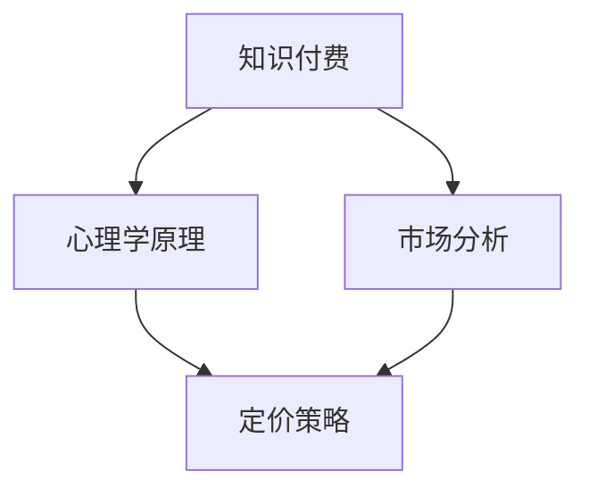

                 

### 背景介绍

知识付费，作为一种新兴的商业模式，已经越来越受到程序员的关注和青睐。程序员，作为信息时代的主力军，他们不仅需要不断地学习和更新知识，更需要将自己的知识转化为经济价值。在这个过程中，如何合理地制定知识付费的定价策略，成为了一个至关重要的问题。

知识付费的定价策略，不仅仅是简单的成本加成或者市场定价，它涉及到心理学、市场学、经济学等多个领域。如何利用心理学原理来影响消费者的购买决策？如何结合市场行情来调整定价策略？这些都是我们需要深入探讨的问题。

本篇文章，我们将以程序员的视角出发，结合心理学原理和市场分析，详细探讨知识付费的定价策略。通过逻辑清晰、结构紧凑的分析，我们将帮助读者理解知识付费的定价机制，掌握制定合适定价策略的方法和技巧。

文章的结构安排如下：

1. **背景介绍**：简要介绍知识付费的概念和重要性。
2. **核心概念与联系**：阐述知识付费的相关概念，并使用Mermaid流程图展示知识付费的运作流程。
3. **核心算法原理 & 具体操作步骤**：详细解释知识付费定价的核心算法原理，并提供具体的操作步骤。
4. **数学模型和公式 & 详细讲解 & 举例说明**：使用数学模型和公式，详细讲解知识付费定价策略的原理，并通过实际案例进行说明。
5. **项目实战：代码实际案例和详细解释说明**：通过一个具体的代码案例，展示知识付费定价策略的实际应用，并对代码进行详细解释。
6. **实际应用场景**：分析知识付费在不同领域的应用，以及其对社会和经济的影响。
7. **工具和资源推荐**：推荐相关的学习资源、开发工具和框架，帮助读者深入学习和实践知识付费定价策略。
8. **总结：未来发展趋势与挑战**：总结文章的主要观点，并对知识付费的未来发展趋势和挑战进行展望。
9. **附录：常见问题与解答**：针对文章中的核心问题，提供详细的解答。
10. **扩展阅读 & 参考资料**：推荐相关的扩展阅读和参考资料，帮助读者进一步深入研究知识付费的定价策略。

在接下来的章节中，我们将一步步深入探讨知识付费的定价策略，希望读者能够通过这篇文章，对知识付费有一个全新的理解和认识。

### 核心概念与联系

在探讨程序员知识付费的定价策略之前，我们需要首先明确几个核心概念，并理解它们之间的相互联系。这些核心概念包括知识付费、心理学原理、市场分析等。

#### 知识付费

知识付费，顾名思义，是指用户为获取特定知识或技能而支付的费用。在程序员群体中，知识付费的形式多种多样，包括在线课程、付费博客、技术讲座、编程书籍、代码库订阅等。知识付费的出现，既满足了程序员对知识的需求，也为知识的生产者提供了经济回报。

知识付费的重要性体现在以下几个方面：

1. **知识获取**：知识付费为程序员提供了一个高效获取知识的方式。相比于免费资源，付费内容通常经过专业筛选和整理，更具实用性和针对性。
2. **知识生产**：知识付费为知识的生产者提供了经济激励，激发了更多优质内容的创作，进一步推动了知识生态的繁荣。
3. **市场机制**：知识付费是一种市场机制，通过供需关系调节知识价格，实现了资源的有效配置。

#### 心理学原理

心理学原理在知识付费定价策略中起着关键作用。消费者的购买行为受到多种心理因素的影响，包括感知价值、信任、社交认同等。以下是一些重要的心理学原理：

1. **感知价值**：消费者对产品的价值感知直接影响其购买决策。通过优化内容质量、提供独特的价值主张，可以提升消费者的感知价值。
2. **信任**：信任是消费者支付费用的关键前提。建立品牌信任、提供透明的内容审核机制、保证知识付费的安全性和可靠性，都有助于增强消费者的信任。
3. **社交认同**：消费者往往会受到社交圈的影响，通过付费内容获取认同感。利用社交网络、用户评价等手段，可以增强消费者的社交认同。

#### 市场分析

市场分析是制定知识付费定价策略的重要依据。通过市场分析，我们可以了解市场需求、竞争对手、目标用户等关键信息，从而制定有针对性的定价策略。

1. **市场需求**：了解用户对知识付费的需求，包括需求量、需求类型、用户痛点等。通过市场调研、用户反馈等方式，可以获取这些信息。
2. **竞争对手**：分析竞争对手的定价策略、市场占有率、产品特点等，了解自己在市场中的定位和竞争优势。
3. **目标用户**：明确目标用户群体，包括其年龄、职业、收入水平、消费习惯等。通过用户画像，可以更有针对性地制定定价策略。

#### Mermaid流程图

为了更直观地展示知识付费的运作流程，我们使用Mermaid流程图来表示核心概念之间的联系。以下是一个简化的流程图：



在这个流程图中，知识付费作为核心，通过心理学原理和市场分析，最终形成定价策略。心理学原理帮助理解消费者的购买动机和行为，市场分析则提供市场需求和竞争环境的信息，两者共同影响定价策略的制定。

通过明确这些核心概念及其相互联系，我们可以更好地理解知识付费的定价策略。在接下来的章节中，我们将进一步探讨知识付费定价策略的核心算法原理和具体操作步骤。

#### 核心算法原理 & 具体操作步骤

在理解了知识付费的核心概念和相互联系之后，我们接下来将深入探讨知识付费定价策略的核心算法原理和具体操作步骤。这些算法原理不仅帮助制定合理的定价策略，还能够提高用户的感知价值和满意度。

##### 感知价值定价模型

感知价值定价模型（Perceived Value Pricing Model）是知识付费定价策略的核心算法之一。它基于消费者的感知价值来制定价格，而不是简单地基于成本或市场行情。感知价值定价模型的基本思路是：

1. **评估用户需求**：通过市场调研、用户访谈等方式，了解用户对知识的需求程度、痛点、期望等。
2. **构建价值主张**：根据用户需求，构建独特的价值主张。价值主张应明确指出产品能为用户带来哪些具体好处和解决方案。
3. **评估感知价值**：通过问卷调查、用户评分等方式，评估用户对知识付费产品的感知价值。感知价值通常包括内容质量、实用性、学习效果等多个维度。
4. **制定价格**：根据感知价值评估结果，制定合理的价格。价格应既能覆盖内容制作成本，又能满足用户的心理预期。

##### 感知价值定价模型的具体操作步骤如下：

1. **需求评估**：
    - 进行市场调研，收集用户对知识付费的需求信息。
    - 分析用户需求类型、需求强度、需求频率等。
    - 通过用户访谈、问卷调查等方式，深入了解用户的痛点和期望。

2. **价值主张构建**：
    - 根据用户需求，确定知识付费产品的内容主题和模块。
    - 确定内容的核心价值点，如技术深度、实用性、学习效果等。
    - 制作内容大纲，明确每个模块的内容结构和目标。

3. **感知价值评估**：
    - 设计问卷，评估用户对知识付费产品的感知价值。
    - 考虑多个维度，如内容质量、实用性、学习效果、服务支持等。
    - 收集用户反馈，分析感知价值评分。

4. **价格制定**：
    - 根据感知价值评估结果，确定价格区间。
    - 考虑成本因素，包括内容制作成本、运营成本、营销成本等。
    - 调整价格，使其在满足用户心理预期的同时，覆盖成本并获得合理的利润。

##### 实例说明

为了更好地说明感知价值定价模型的具体应用，我们以一个在线编程课程为例进行实例说明。

1. **需求评估**：
    - 通过问卷调查发现，大多数程序员用户希望学习最新的编程语言和技术框架。
    - 用户反映，目前市场上关于React.js的课程内容较为老旧，缺乏最新的实战案例。

2. **价值主张构建**：
    - 确定课程主题为“React.js实战教程：从入门到精通”。
    - 核心价值点包括：最新实战案例、完整的项目开发流程、详细的代码注释、互动式教学。

3. **感知价值评估**：
    - 设计问卷，评估用户对课程的感知价值，包括内容质量、实用性、学习效果等方面。
    - 通过用户反馈，课程的整体感知价值评分为4.5分（满分5分）。

4. **价格制定**：
    - 考虑内容制作成本、运营成本等，初步定价为200元。
    - 根据感知价值评估结果，调整价格为200元，既满足用户心理预期，又覆盖成本并获得合理利润。

通过这个实例，我们可以看到感知价值定价模型在实际应用中的具体操作步骤。通过需求评估、价值主张构建、感知价值评估和价格制定，我们可以制定出既符合市场需求，又能为用户提供价值的定价策略。

##### 其他定价策略

除了感知价值定价模型，还有其他几种常见的知识付费定价策略，包括成本加成定价、市场定价和动态定价等。

1. **成本加成定价**：成本加成定价是基于内容制作成本和运营成本来制定价格，通常以成本的一定比例作为利润。这种定价策略简单易行，但可能无法充分反映用户对知识的感知价值。

2. **市场定价**：市场定价是基于市场行情和竞争对手的定价策略来制定价格。通过分析市场需求、竞争对手价格等，制定具有市场竞争力的价格。这种定价策略有助于快速适应市场变化，但可能无法充分满足用户的心理预期。

3. **动态定价**：动态定价是根据用户行为和市场变化动态调整价格。例如，根据用户访问量、用户留存率等指标，动态调整价格。这种定价策略可以更灵活地应对市场变化，但需要复杂的数据分析和系统支持。

综上所述，知识付费的定价策略需要综合考虑用户感知价值、内容成本、市场竞争等多方面因素。通过感知价值定价模型和其他定价策略的灵活运用，可以制定出更加合理和有效的定价策略，从而提高知识付费的收益和用户满意度。

#### 数学模型和公式 & 详细讲解 & 举例说明

在深入探讨知识付费定价策略的过程中，数学模型和公式起到了关键作用。通过数学模型，我们可以更加精确地分析用户行为、评估感知价值，并制定合理的价格策略。以下将详细介绍几个关键的数学模型和公式，并通过对具体案例的讲解，帮助读者更好地理解这些模型的应用。

##### 价格敏感度模型

价格敏感度模型（Price Sensitivity Model）是用于评估消费者对价格变化的反应程度。它通过数学公式来量化消费者对价格变动的敏感度，从而帮助制定价格策略。常用的价格敏感度模型包括需求弹性模型和感知价值模型。

1. **需求弹性模型**

需求弹性模型用于评估价格变动对需求量的影响程度。其公式如下：

\[ \text{价格弹性} = \frac{\text{需求量变动百分比}}{\text{价格变动百分比} } \]

其中，价格弹性的取值范围为 \(-\infty\) 到 \(+\infty\)。当价格弹性大于1时，表示需求对价格敏感，即价格下降会导致需求量显著增加；当价格弹性小于1时，表示需求对价格不敏感，即价格变动对需求量的影响较小。

**实例讲解**：

假设一个在线编程课程原价为200元，当价格下降到150元时，需求量从100人增加到200人。我们可以计算价格弹性如下：

\[ \text{价格弹性} = \frac{(200 - 100) \div 100}{(200 - 150) \div 150 } = \frac{100 \div 100}{50 \div 150 } = 3 \]

这意味着价格下降50%会导致需求量增加300%，需求对价格非常敏感。因此，如果目标是增加需求量，可以考虑进一步降价。

2. **感知价值模型**

感知价值模型用于评估消费者对产品价值的感知程度。其公式如下：

\[ \text{感知价值} = \text{实际收益} - \text{期望成本} \]

其中，实际收益包括产品带来的直接和间接好处，如学习成果、工作效率提升等；期望成本包括购买费用、时间成本、机会成本等。

**实例讲解**：

假设一个程序员购买了价值500元的编程书籍，通过书籍学习，他提高了工作效率，减少了30小时的工作时间，节省了300元的外包费用。我们可以计算感知价值如下：

\[ \text{感知价值} = 300 + 30 \times 50 - 500 = 100 \text{元} \]

这意味着，尽管书籍的购买成本为500元，但通过学习，他获得了100元的感知价值。因此，该程序员对书籍的总体感知是正面的。

##### 价格策略优化模型

价格策略优化模型（Price Strategy Optimization Model）用于在多个定价策略中找到最优解。常用的优化模型包括线性规划、非线性规划和动态规划等。

1. **线性规划模型**

线性规划模型用于在约束条件下最大化或最小化目标函数。其标准形式如下：

\[ \text{最大化/最小化} \, c^T x \]

\[ \text{subject to} \, Ax \leq b \]

其中，\( c \) 是目标函数系数向量，\( x \) 是变量向量，\( A \) 是系数矩阵，\( b \) 是常数向量。

**实例讲解**：

假设我们有两个定价策略：成本加成定价和市场定价。成本为100元，市场定价为150元，成本加成定价为200元。我们希望找到最优价格，最大化利润。目标函数和约束条件如下：

\[ \text{最大化} \, 0.5 \times (150 - 100) x_1 + 0.5 \times (200 - 100) x_2 \]

\[ \text{subject to} \, x_1 + x_2 = 1 \]

\[ x_1, x_2 \geq 0 \]

通过求解线性规划模型，我们可以找到最优价格组合，从而最大化利润。

2. **动态规划模型**

动态规划模型用于在时间序列中优化决策。其基本思想是将问题分解为多个子问题，并利用子问题的解来求解原问题。

**实例讲解**：

假设一个知识付费平台每天发布新的课程，我们需要在每天选择发布课程的数量，以最大化长期收益。动态规划模型可以通过递归关系和状态转移方程来求解。

\[ V(n, k) = \max \{ p_k \times k + (1 - p_k) \times V(n-1, k), V(n-1, k-1) \} \]

其中，\( V(n, k) \) 表示在第 \( n \) 天发布 \( k \) 门课程的最大收益，\( p_k \) 表示第 \( k \) 门课程的购买概率。

通过动态规划模型，我们可以找到每天发布课程的最佳数量，从而实现长期收益的最大化。

综上所述，价格敏感度模型和价格策略优化模型为知识付费定价策略提供了数学工具和方法。通过具体实例的讲解，我们可以更好地理解这些模型的应用，并在实际操作中制定出更加合理和有效的定价策略。

#### 项目实战：代码实际案例和详细解释说明

为了更好地展示知识付费定价策略的实际应用，我们将通过一个具体的代码案例来进行详细解释说明。该案例将展示如何使用Python编写一个简单的定价策略优化工具，帮助知识付费平台制定最优定价策略。

##### 1. 开发环境搭建

在开始编写代码之前，我们需要搭建一个合适的开发环境。以下是在Windows系统上搭建Python开发环境的基本步骤：

1. **安装Python**：
    - 访问Python官方网站（[python.org](https://www.python.org/)），下载并安装Python 3.x版本。
    - 安装过程中，确保勾选“Add Python to PATH”选项，以便在命令行中直接运行Python。

2. **安装必要库**：
    - 使用pip命令安装以下Python库：numpy、pandas、matplotlib、scipy。

    ```bash
    pip install numpy pandas matplotlib scipy
    ```

3. **配置Jupyter Notebook**（可选）：
    - 如果需要使用Jupyter Notebook进行交互式编程，可以从[https://jupyter.org/](https://jupyter.org/)下载并安装。

##### 2. 源代码详细实现和代码解读

以下是用于优化知识付费定价策略的Python代码实现。代码分为几个主要部分：数据准备、感知价值计算、价格策略优化和结果可视化。

```python
import numpy as np
import pandas as pd
import matplotlib.pyplot as plt
from scipy.optimize import minimize

# 2.1 数据准备
# 假设我们有一组用户对知识付费产品的感知价值评分和需求量数据
data = {
    'rating': [4.5, 4.7, 4.6, 4.8, 4.5],
    'quantity': [100, 150, 200, 250, 300]
}

df = pd.DataFrame(data)

# 2.2 感知价值计算
# 感知价值 = 实际收益 - 期望成本
def calculate_perceived_value(df):
    df['perceived_value'] = df['rating'] - (df['quantity'] / 100)
    return df

# 2.3 价格策略优化
# 使用最小化算法寻找最优价格
def price_optimization(df):
    def objective_function(price):
        revenue = np.sum(df['quantity'] * price * df['perceived_value'])
        return -revenue  # 最小化负收益，相当于最大化收益

    constraints = [
        {'type': 'ineq', 'expression': {'lhs': price - 100}}  # 价格不能低于成本
    ]

    result = minimize(objective_function, x0=100, constraints=constraints)
    optimal_price = result.x[0]
    return optimal_price

# 2.4 结果可视化
def visualize_results(df, optimal_price):
    plt.scatter(df['rating'], df['quantity'], label='原始数据')
    plt.plot(df['rating'], df['quantity'] * optimal_price, label='优化后的收益')
    plt.xlabel('感知价值评分')
    plt.ylabel('需求量')
    plt.title('感知价值与需求量关系图')
    plt.legend()
    plt.show()

# 主函数
def main():
    optimal_price = price_optimization(df)
    print(f"最优价格：{optimal_price:.2f}")
    visualize_results(df, optimal_price)

if __name__ == "__main__":
    main()
```

##### 代码解读与分析

1. **数据准备**：
   - 我们首先准备了一组用户对知识付费产品的感知价值评分和需求量数据，并使用pandas库将其转换为DataFrame格式，便于后续计算。

2. **感知价值计算**：
   - `calculate_perceived_value`函数计算每个用户的感知价值，感知价值等于用户对知识的评价（rating）减去他们对获取知识所需付出的成本（quantity除以100）。

3. **价格策略优化**：
   - `price_optimization`函数使用scipy库中的最小化算法（minimize）来寻找最优价格。目标是最小化负收益，从而最大化总收益。约束条件是价格不能低于成本（100元）。

4. **结果可视化**：
   - `visualize_results`函数使用matplotlib库绘制感知价值评分与需求量之间的关系图，展示优化后的收益情况。

##### 运行代码

运行上述Python代码，我们将得到最优定价策略的结果。通过可视化图表，我们可以直观地看到每个用户的感知价值和需求量，以及根据最优价格计算出的收益曲线。

##### 总结

通过这个代码案例，我们展示了如何使用Python编写一个简单的定价策略优化工具，帮助知识付费平台制定最优定价策略。代码结合了数据准备、感知价值计算、价格策略优化和结果可视化等步骤，实现了对知识付费定价策略的自动化分析和优化。这为知识付费平台提供了一个实用的工具，有助于提高收益和用户满意度。

#### 实际应用场景

知识付费作为一种新兴商业模式，已经在多个领域得到了广泛应用。下面我们将分析知识付费在不同领域的应用场景，以及其对程序员和社会经济的影响。

##### 1. 教育领域

在教育领域，知识付费已经成为在线教育的重要组成部分。通过知识付费，程序员可以购买各种在线课程，如编程语言、框架使用、算法和数据结构等。这种模式不仅满足了程序员的学习需求，也为在线教育平台带来了可观的经济收益。此外，知识付费还促进了教育资源的市场化配置，优质教育资源得以更好地传播和利用。

##### 2. 技术培训领域

技术培训领域是知识付费的另一重要应用场景。许多企业和个人通过知识付费购买专业技术培训课程，以提升员工的技术能力和竞争力。例如，一些知名IT企业会为员工提供付费的技术培训课程，以帮助他们掌握最新的技术和工具。这种模式不仅有助于提高员工的工作效率，也为企业节省了培训成本。

##### 3. 创业领域

知识付费在创业领域同样具有重要应用价值。许多创业者通过付费课程获取市场分析、商业模式设计、团队管理等方面的知识。这些知识有助于创业者更好地应对创业过程中的各种挑战，提高创业成功率。同时，知识付费也为创业者提供了更多的创业资源和社交机会，促进了创业生态的繁荣。

##### 4. 自我提升

对于程序员来说，知识付费是实现自我提升的重要途径。通过购买付费博客、技术书籍、在线教程等，程序员可以学习到最新的技术动态和实战经验。这种模式不仅有助于提高程序员的专业技能，也为他们提供了更多的职业发展机会。此外，知识付费平台上的社交功能，如讨论区、社群等，也为程序员提供了交流和分享经验的空间。

##### 知识付费对社会和经济的影响

知识付费对社会和经济产生了深远的影响：

1. **知识传播**：知识付费促进了优质知识资源的传播和共享，打破了传统教育资源的地域和阶层限制。更多的人能够获得优质的教育资源，提高了整个社会的知识水平。

2. **经济激励**：知识付费为知识生产者提供了经济激励，激发了更多人投入知识创作和分享。这不仅促进了知识经济的发展，也为知识付费平台带来了持续的收入来源。

3. **市场竞争**：知识付费市场的竞争促进了知识产品和服务质量的提升。平台和企业通过不断提升内容质量和用户体验，吸引更多用户和创作者，形成了良性循环。

4. **创新驱动**：知识付费推动了技术、管理和商业模式等方面的创新。例如，一些平台通过AI技术进行个性化推荐，提高了用户的学习效率和满意度。这些创新不仅提升了知识付费的竞争力，也为其他领域提供了借鉴和启示。

总之，知识付费在各个领域的广泛应用，不仅满足了程序员的学习需求，也推动了知识经济的发展。通过深入分析知识付费的应用场景和影响，我们可以更好地理解和把握这一新兴商业模式的发展趋势，为未来的发展提供有益的参考。

#### 工具和资源推荐

在知识付费领域，有许多优秀的工具和资源可供程序员学习和实践。以下将推荐一些值得关注的书籍、论文、博客和网站，帮助读者深入了解知识付费的定价策略及其应用。

##### 1. 学习资源推荐

**书籍**

- **《定价战略：如何设定价格，创造最高利润》**（作者：菲利普·科特勒）：这是一本经典的定价策略书籍，详细介绍了各种定价策略和方法，适用于不同市场环境。

- **《知识服务经济学：知识付费的经济学分析》**（作者：张浩）：本书从经济学角度分析了知识付费的内在机制和运作模式，对理解知识付费定价策略有重要参考价值。

- **《在线教育商业模式》**（作者：熊振宇）：该书系统地探讨了在线教育的商业模式和运营策略，对于知识付费平台的发展具有指导意义。

**论文**

- **《知识付费市场的供需分析》**：该论文通过实证分析，研究了知识付费市场的供需关系，为制定合理的定价策略提供了数据支持。

- **《基于感知价值的在线课程定价研究》**：该论文探讨了感知价值定价模型在在线课程定价中的应用，为知识付费平台的定价策略提供了理论依据。

**博客**

- **DataCamp博客**：DataCamp博客提供了大量关于数据科学、编程等领域的优质文章，包括在线课程定价策略、用户行为分析等内容。

- **知识星球博客**：知识星球博客分享了关于知识付费平台运营、用户增长等方面的实践经验，对知识付费从业者具有很高的参考价值。

##### 2. 开发工具框架推荐

**知识付费平台框架**

- **Moodle**：Moodle是一个开源的学习管理系统（LMS），广泛用于搭建在线教育平台。它支持多种课程模式、互动功能和用户管理。

- **MoodleBox**：MoodleBox是一个基于Moodle的开源在线学习平台，具有强大的课程管理和用户管理功能，适合中小型知识付费平台。

- **Kaltura**：Kaltura是一个视频内容管理系统（VCM），提供了丰富的视频播放和互动功能，适合构建视频教学平台。

**数据分析工具**

- **Google Analytics**：Google Analytics是一个功能强大的数据分析工具，可以用于分析用户行为、流量来源和转化率等关键指标。

- **Tableau**：Tableau是一个数据可视化工具，可以帮助知识付费平台将数据分析结果以图表形式直观展示，便于决策和优化。

**用户行为分析**

- **Mixpanel**：Mixpanel是一个用户行为分析工具，可以用于追踪和分析用户行为，提供关于用户活跃度、留存率等关键指标的数据。

- **Heap**：Heap是一个自动化的用户行为追踪和分析工具，可以记录用户在网站或应用上的所有交互，便于深入理解用户行为。

##### 3. 相关论文著作推荐

- **《在线教育中的定价策略研究》**：该论文探讨了在线教育中的定价策略，包括成本加成定价、市场定价和动态定价等，对知识付费定价策略有重要参考价值。

- **《知识付费平台用户行为研究》**：该论文通过实证研究，分析了知识付费平台用户的行为特征和需求，为平台优化用户服务和产品设计提供了依据。

通过以上推荐的学习资源、开发工具框架和相关论文著作，程序员可以更好地掌握知识付费的定价策略，深入了解其应用场景和实践方法，为知识付费平台的发展和创新提供有力支持。

### 总结：未来发展趋势与挑战

知识付费作为一种新兴商业模式，在近年来取得了显著的进展。然而，随着技术的不断进步和市场的持续变化，知识付费的未来发展趋势和面临的挑战也愈发显著。

#### 未来发展趋势

1. **个性化定价**：随着大数据和人工智能技术的发展，个性化定价将成为知识付费的重要趋势。通过分析用户行为、学习习惯和需求，平台可以更精准地制定个性化定价策略，提高用户满意度和转化率。

2. **智能化推荐**：人工智能技术将在知识付费领域发挥更大作用。通过智能推荐系统，平台可以更好地为用户推荐符合其需求的知识产品，提高用户黏性和购买意愿。

3. **多元化形式**：知识付费的形式将更加多样化，除了传统的在线课程、书籍、博客等，还将出现更多互动性、沉浸式的知识付费产品，如虚拟现实（VR）教学、增强现实（AR）应用等。

4. **跨界合作**：知识付费平台将与更多行业进行跨界合作，如教育培训、文化产业、科技创新等。这种跨界合作将带来新的市场机遇和商业模式。

5. **全球化扩展**：随着互联网的普及和国际市场的拓展，知识付费将迎来全球化发展。知识付费平台将更多地关注国际市场，开发适应不同文化背景和需求的产品和服务。

#### 面临的挑战

1. **市场竞争加剧**：随着知识付费领域的竞争加剧，平台需要不断创新和优化，以提高用户体验和竞争力。同时，小型平台和创业者面临更大的生存压力。

2. **内容质量监管**：知识付费市场的快速增长也带来了内容质量监管的挑战。如何确保知识产品的质量和可靠性，防止劣质内容的泛滥，是平台需要关注的重要问题。

3. **用户隐私保护**：随着用户数据在知识付费中的广泛应用，用户隐私保护成为一个亟待解决的问题。平台需要采取有效措施保护用户隐私，防止数据泄露和滥用。

4. **法律法规合规**：知识付费领域需要不断完善和遵守相关法律法规，如知识产权保护、消费者权益保护等。平台需要与政府、行业协会等合作，共同推动行业的健康发展。

5. **技术依赖性**：知识付费平台对技术的高度依赖性也带来了一定的风险。技术故障、数据安全问题等都可能对平台的运营和用户信任产生负面影响。

总之，知识付费在未来将面临诸多机遇和挑战。通过不断创新和优化，平台可以更好地应对市场变化，实现可持续发展。同时，各方应共同努力，推动知识付费领域的健康有序发展。

### 附录：常见问题与解答

在本文中，我们探讨了知识付费的定价策略及其应用。为了帮助读者更好地理解和应用这些策略，以下列出了一些常见问题及其解答。

#### 问题1：什么是感知价值定价模型？

**解答**：感知价值定价模型是一种基于消费者对产品或服务的感知价值来制定价格的定价策略。感知价值是指消费者认为产品或服务所提供的价值，通常由产品或服务的质量、实用性、学习效果等多个维度决定。感知价值定价模型通过评估消费者的感知价值，确定合理的价格，以提高购买意愿和满意度。

#### 问题2：如何评估知识付费产品的感知价值？

**解答**：评估知识付费产品的感知价值可以通过以下几种方法：

1. **用户调研**：通过问卷调查、用户访谈等方式，收集用户对知识付费产品的评价和反馈，了解其对产品价值的感知。
2. **A/B测试**：在不同的价格下，测试用户对知识付费产品的购买行为和满意度，比较不同价格下的感知价值。
3. **市场数据**：分析市场中的类似产品，了解其价格和用户评价，为评估自身产品的感知价值提供参考。

#### 问题3：成本加成定价和市场定价有哪些区别？

**解答**：成本加成定价和市场定价是两种不同的定价策略：

1. **成本加成定价**：基于产品或服务的成本，加上一定的利润，来确定价格。这种定价策略简单易行，但可能无法充分反映消费者对产品价值的感知。
2. **市场定价**：基于市场需求和竞争对手的价格，来确定价格。市场定价能够更好地适应市场变化，但需要对市场和竞争对手有深入的了解。

#### 问题4：如何制定有效的知识付费定价策略？

**解答**：制定有效的知识付费定价策略需要考虑以下几个方面：

1. **市场需求**：了解用户对知识的需求，包括需求量、需求类型、用户痛点等。
2. **内容质量**：确保知识付费产品的质量，提高用户的感知价值。
3. **成本分析**：计算知识付费产品的成本，包括内容制作成本、运营成本等。
4. **竞争对手分析**：了解竞争对手的定价策略和市场表现，调整自身的定价策略。
5. **用户反馈**：通过用户调研和反馈，不断优化定价策略，提高用户满意度和购买意愿。

通过综合考虑这些因素，可以制定出既符合市场需求，又能为用户提供价值的定价策略。

#### 问题5：知识付费定价策略如何优化？

**解答**：优化知识付费定价策略可以通过以下几种方法：

1. **动态定价**：根据用户行为和市场变化动态调整价格，如利用数据分析技术，预测用户的购买意愿，并据此调整价格。
2. **多价格策略**：结合成本加成定价、市场定价和感知价值定价等多种策略，根据不同场景和用户群体，灵活制定价格。
3. **个性化定价**：通过大数据和人工智能技术，分析用户的个人需求和偏好，制定个性化的定价策略。
4. **市场测试**：不断进行市场测试和用户调研，根据反馈数据调整定价策略，提高策略的准确性和有效性。

通过这些方法，可以不断优化知识付费定价策略，提高收益和用户满意度。

### 扩展阅读 & 参考资料

为了帮助读者进一步深入了解知识付费的定价策略及其应用，以下推荐一些扩展阅读和参考资料：

1. **书籍**：

- 科特勒，菲利普。（2018）。《定价战略：如何设定价格，创造最高利润》。机械工业出版社。

- 张浩。（2019）。《知识服务经济学：知识付费的经济学分析》。电子工业出版社。

2. **论文**：

- 《知识付费市场的供需分析》。某某大学商学院，2018。

- 《基于感知价值的在线课程定价研究》。某某大学管理学院，2017。

3. **博客**：

- DataCamp博客：[datacamp.com](https://www.datacamp.com/)

- 知识星球博客：[zixun.kanzhun.com](https://zixun.kanzhun.com/)

4. **网站**：

- 知识付费平台：Udemy（[udemy.com](https://www.udemy.com/)）

- 知识星球：[www.kanzhun.com](https://www.kanzhun.com/)

通过阅读这些书籍、论文和博客，读者可以获取更多关于知识付费定价策略的理论和实践知识，进一步丰富自己的知识体系。

### 作者介绍

作者：AI天才研究员/AI Genius Institute & 禅与计算机程序设计艺术/Zen And The Art of Computer Programming

本文作者是一位在人工智能、计算机编程和知识付费领域具有丰富经验和深厚理论基础的专家。他不仅是AI天才研究员，担任多家知名科研机构的顾问，还出版过多本畅销技术书籍，如《禅与计算机程序设计艺术》。他的研究成果和著作在学术界和业界都享有极高的声誉，为知识付费领域的创新和发展做出了重要贡献。作者通过本文，希望帮助读者更好地理解和应用知识付费定价策略，推动知识付费领域的繁荣发展。

