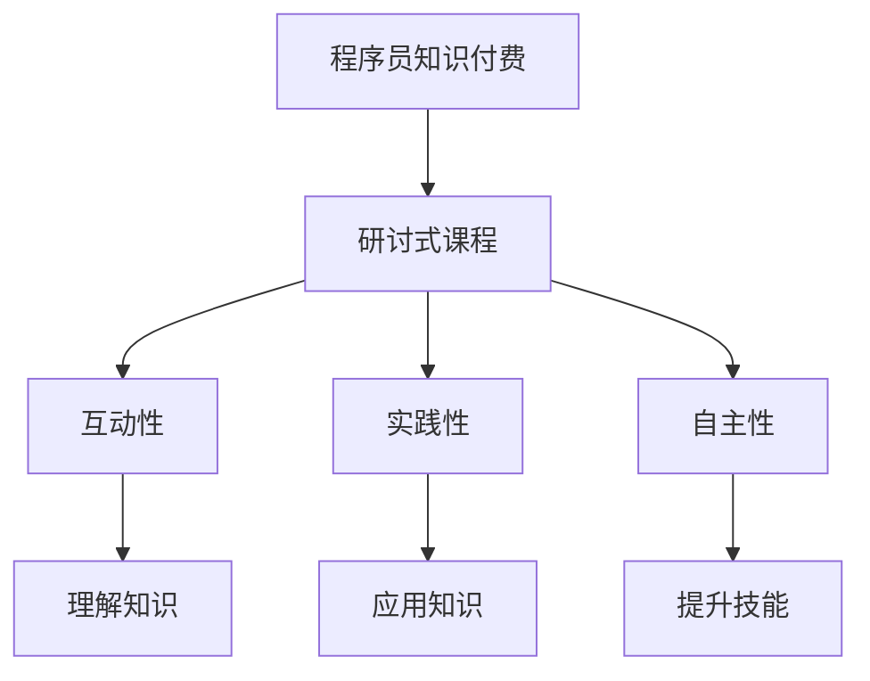

                 

# 程序员知识付费：打造研讨式课程

> **关键词**：程序员知识付费、研讨式课程、在线教育、内容创造、知识共享

> **摘要**：本文探讨了程序员知识付费的现状与趋势，分析了研讨式课程的优势，并提供了具体步骤来打造具有吸引力和实用性的研讨式课程，助力程序员提升技能和实现个人成长。

## 1. 背景介绍

在互联网和信息技术的迅猛发展下，程序员作为科技创新的先锋，对知识的渴求愈发强烈。传统的教育模式已无法满足快速变化的技术需求，而知识付费逐渐成为程序员学习新技能的重要途径。知识付费指的是通过付费获取高质量的学习资源，如在线课程、电子书、视频教程等，以提升个人技能和职业发展。

近年来，知识付费市场呈现出蓬勃发展的态势。据相关数据显示，全球在线教育市场规模逐年增长，其中程序员知识付费占据了重要份额。随着技术的不断迭代，程序员需要不断学习新的编程语言、框架和技术，而知识付费平台提供了丰富的学习资源和便捷的学习方式，满足了程序员的个性化学习需求。

在知识付费的背景下，研讨式课程作为一种新兴的教育模式，逐渐受到程序员的青睐。研讨式课程强调互动性和实践性，通过讨论、案例分析、小组作业等方式，帮助程序员深入理解和掌握所学知识。与传统的灌输式教育相比，研讨式课程更能激发程序员的积极性和创造力，提高学习效果。

## 2. 核心概念与联系

### 程序员知识付费

程序员知识付费是指通过付费购买或订阅学习资源，以提升个人技能和职业发展的过程。这些学习资源包括在线课程、电子书、视频教程、实战项目等。程序员知识付费的优势在于：

1. **个性化学习**：知识付费平台提供多样化的学习资源，程序员可以根据自己的需求和兴趣选择适合自己的课程。
2. **高质量内容**：知识付费平台通常拥有高质量的讲师和教学内容，确保程序员能够学到实用和前沿的知识。
3. **灵活的学习方式**：程序员可以随时随地进行学习，不受时间和地点的限制。

### 研讨式课程

研讨式课程是一种以讨论、互动和实践为核心的教育模式。其特点包括：

1. **互动性**：研讨式课程强调师生之间的互动，通过讨论、问答等方式，促进知识的理解和应用。
2. **实践性**：研讨式课程注重实践操作，通过案例分析、小组作业等方式，帮助程序员将所学知识应用于实际项目中。
3. **自主性**：研讨式课程鼓励学员自主思考和解决问题，培养独立解决问题的能力。

### 程序员知识付费与研讨式课程的关系

程序员知识付费与研讨式课程密切相关。知识付费平台可以为程序员提供丰富的研讨式课程资源，而研讨式课程则能够提高程序员对知识付费内容的理解和应用。通过研讨式课程，程序员可以更深入地学习知识，提升技能，从而实现个人成长和职业发展。

### Mermaid 流程图



## 3. 核心算法原理 & 具体操作步骤

### 研讨式课程设计原则

1. **明确学习目标**：在设计研讨式课程时，首先要明确课程的学习目标，确保课程内容与目标相符。
2. **多样化的教学方法**：结合线上和线下教学，运用讨论、案例分析、小组作业等多种教学方法，提高课程的互动性和实践性。
3. **合理的时间安排**：合理安排课程时间，确保学员有足够的时间进行学习和实践。
4. **互动与反馈**：鼓励学员积极参与讨论，提供及时反馈，帮助学员解决问题和提升技能。

### 研讨式课程实施步骤

1. **课程准备**：确定课程主题、学习目标和教学资源，设计课程大纲和教学计划。
2. **课程开展**：按照教学计划开展课程，组织讨论、案例分析、小组作业等教学活动。
3. **课程反馈**：收集学员的反馈，及时调整教学方法和内容，提高课程质量。
4. **课程总结**：对课程进行总结，提炼课程精华，为学员提供进一步学习的资源和建议。

### 实例分析

以“Python数据分析”研讨式课程为例，具体操作步骤如下：

1. **课程准备**：
   - 确定学习目标：掌握Python数据分析的基本方法和技能。
   - 设计课程大纲：包括数据分析基础、数据分析工具、案例分析等模块。
   - 选择教学资源：推荐合适的教材、视频教程和实践项目。

2. **课程开展**：
   - 第一周：介绍数据分析基础，包括数据类型、数据结构等。
   - 第二周：介绍数据分析工具，如Pandas、NumPy等。
   - 第三周：进行案例分析，分析实际数据，解决实际问题。
   - 第四周：进行小组作业，编写数据分析报告，分享学习成果。

3. **课程反馈**：
   - 收集学员反馈：通过问卷调查、讨论等方式了解学员的学习情况和需求。
   - 提供反馈：针对学员提出的问题和困难，提供解决方案和指导。

4. **课程总结**：
   - 总结课程内容：提炼课程重点，制作PPT或视频教程，方便学员复习。
   - 提供进一步学习资源：推荐相关的书籍、论文和在线课程，为学员提供深入学习的机会。

## 4. 数学模型和公式 & 详细讲解 & 举例说明

### 数学模型

研讨式课程设计过程中，可以运用以下数学模型来评估课程质量和学员满意度：

1. **课程满意度评分模型**：
   - 设定多个评价维度，如教学内容、教学方法、课程组织等。
   - 对每个维度进行评分，采用1-5分的评分制。
   - 计算总分，得出课程满意度得分。

2. **学习效果评估模型**：
   - 设定学习目标，将学习效果分为达成度、应用度、持久度三个层次。
   - 对学员进行测试或考核，评估学习效果的达成度。
   - 对学员在实际工作中的表现进行跟踪，评估学习效果的应用度和持久度。

### 详细讲解

1. **课程满意度评分模型**：

   - **评价维度**：教学内容（40%）、教学方法（30%）、课程组织（20%）、学员互动（10%）。
   - **评分标准**：1分（非常不满意）、2分（不满意）、3分（一般）、4分（满意）、5分（非常满意）。
   - **计算公式**：总分 = 教学内容得分 × 40% + 教学方法得分 × 30% + 课程组织得分 × 20% + 学员互动得分 × 10%。

2. **学习效果评估模型**：

   - **学习目标达成度**：通过测试或考核，评估学员对学习目标的达成情况，得分范围0-100分。
   - **学习效果应用度**：通过跟踪学员在实际工作中的表现，评估学习效果的应用情况，得分范围0-100分。
   - **学习效果持久度**：通过一定时间后对学员的回访，评估学习效果的持久性，得分范围0-100分。
   - **评估公式**：总得分 = 达成度得分 × 50% + 应用度得分 × 30% + 持久度得分 × 20%。

### 举例说明

1. **课程满意度评分模型**：

   - 教学内容得分：4分
   - 教学方法得分：5分
   - 课程组织得分：3分
   - 学员互动得分：5分

   - 总分 = 4 × 40% + 5 × 30% + 3 × 20% + 5 × 10% = 4.6分

2. **学习效果评估模型**：

   - 达成度得分：90分
   - 应用度得分：80分
   - 持久度得分：70分

   - 总得分 = 90 × 50% + 80 × 30% + 70 × 20% = 82分

## 5. 项目实战：代码实际案例和详细解释说明

### 开发环境搭建

1. **安装Python环境**：下载并安装Python，配置环境变量。
2. **安装必要的库**：使用pip命令安装Pandas、NumPy等数据分析库。
3. **创建项目文件夹**：在项目中创建一个名为“data_analysis”的文件夹，用于存放代码和数据分析结果。

### 源代码详细实现和代码解读

以下是一个简单的Python数据分析实例，使用Pandas库对CSV文件进行读取、清洗和处理，最终生成可视化图表。

```python
import pandas as pd
import matplotlib.pyplot as plt

# 5.1 读取数据
data = pd.read_csv('data.csv')

# 5.2 数据清洗
# 去除空值和重复值
data = data.dropna().drop_duplicates()

# 5.3 数据处理
# 计算总销售额
sales_sum = data['sales'].sum()

# 5.4 数据可视化
# 绘制销售额柱状图
plt.bar(data['month'], data['sales'])
plt.xlabel('Month')
plt.ylabel('Sales')
plt.title(f'Total Sales: {sales_sum}')
plt.show()
```

### 代码解读与分析

1. **导入库**：首先导入Pandas和matplotlib库，用于数据读取、清洗和处理，以及数据可视化。
2. **读取数据**：使用`read_csv`函数读取CSV文件，将数据存储在DataFrame对象中。
3. **数据清洗**：使用`dropna`函数去除空值，使用`drop_duplicates`函数去除重复值，确保数据的质量。
4. **数据处理**：计算总销售额，使用`sum`函数对‘sales’列进行求和。
5. **数据可视化**：使用`bar`函数绘制柱状图，展示每月销售额。设置xlabel、ylabel和title，提供图表的说明信息。

通过上述实例，程序员可以了解如何使用Python进行数据分析，以及如何将所学知识应用于实际项目中。这不仅有助于提升程序员的技能，也为研讨式课程提供了丰富的实战案例。

## 6. 实际应用场景

研讨式课程在程序员知识付费领域具有广泛的应用场景，以下是一些典型的应用案例：

1. **编程语言学习**：针对不同编程语言，如Python、Java、C++等，设计研讨式课程，帮助程序员深入理解和掌握语言特性、开发技巧和项目实战。
2. **框架与工具应用**：针对流行框架和工具，如Django、React、TensorFlow等，设计研讨式课程，教授程序员如何在实际项目中应用这些技术。
3. **项目开发实战**：通过研讨式课程，模拟真实项目开发过程，让程序员从需求分析、设计、开发到测试等环节全面掌握项目开发技能。
4. **职业规划与成长**：针对程序员职业发展的不同阶段，如入门、进阶、专家等，设计研讨式课程，提供职业规划指导、面试技巧、团队协作等实用知识。

通过研讨式课程，程序员可以系统地学习知识，提升技能，同时获得实战经验和职业发展的机会。知识付费平台和讲师应紧密关注市场需求，不断优化课程内容和教学方法，为程序员提供优质的学习资源和服务。

## 7. 工具和资源推荐

### 7.1 学习资源推荐

1. **书籍**：
   - 《Python核心编程》（作者：魏达）
   - 《深度学习》（作者：Ian Goodfellow、Yoshua Bengio、Aaron Courville）
   - 《代码大全》（作者：Steve McConnell）

2. **论文**：
   - 《Pandas技术报告》（作者：Wes McKinney）
   - 《深度学习中的损失函数》（作者：Yoshua Bengio等）
   - 《数据挖掘：实用工具与技术》（作者：Jiawei Han、Micheline Kamber、Jian Pei）

3. **博客**：
   - 掘金（https://juejin.cn/）
   - 知乎（https://www.zhihu.com/）
   - Medium（https://medium.com/）

4. **网站**：
   - Coursera（https://www.coursera.org/）
   - edX（https://www.edx.org/）
   - Udemy（https://www.udemy.com/）

### 7.2 开发工具框架推荐

1. **集成开发环境（IDE）**：
   - PyCharm（https://www.jetbrains.com/pycharm/）
   - Visual Studio Code（https://code.visualstudio.com/）
   - Eclipse（https://www.eclipse.org/）

2. **版本控制系统**：
   - Git（https://git-scm.com/）
   - SVN（https://subversion.tigris.org/）

3. **数据库管理系统**：
   - MySQL（https://www.mysql.com/）
   - PostgreSQL（https://www.postgresql.org/）
   - MongoDB（https://www.mongodb.com/）

4. **容器化技术**：
   - Docker（https://www.docker.com/）
   - Kubernetes（https://kubernetes.io/）

### 7.3 相关论文著作推荐

1. **《人工智能：一种现代的方法》（作者：Stuart J. Russell、Peter Norvig）》**
   - 介绍了人工智能的基本概念、技术和应用，是人工智能领域的经典著作。

2. **《深度学习》（作者：Ian Goodfellow、Yoshua Bengio、Aaron Courville）》**
   - 详细阐述了深度学习的理论基础、算法实现和应用案例，是深度学习领域的权威教材。

3. **《大数据处理：技术、应用与挑战》（作者：唐杰、刘铁岩）》**
   - 分析了大数据处理的关键技术、应用场景和未来发展挑战，为大数据领域的研究者和从业者提供了有价值的参考。

## 8. 总结：未来发展趋势与挑战

随着互联网和信息技术的不断发展，程序员知识付费和研讨式课程将继续在在线教育领域占据重要地位。未来，研讨式课程将朝着以下方向发展：

1. **个性化学习**：通过大数据和人工智能技术，实现个性化学习推荐，满足程序员的个性化学习需求。
2. **多元化教学**：结合线上线下教学，运用虚拟现实（VR）和增强现实（AR）等新技术，提高课程互动性和实践性。
3. **跨学科融合**：探讨编程与其他学科的结合，如计算机科学与心理学、计算机科学与艺术等，为程序员提供更广阔的知识视野。

然而，研讨式课程的发展也面临一系列挑战：

1. **内容质量**：确保课程内容的高质量和实用性，满足程序员的实际需求。
2. **教学评价**：建立科学、合理的课程评价体系，提高课程质量和学员满意度。
3. **知识产权**：保护讲师和学员的知识产权，防止课程内容和版权的滥用。

为了应对这些挑战，知识付费平台和讲师应不断创新，优化课程内容和教学方法，为程序员提供高质量的学习资源和服务。

## 9. 附录：常见问题与解答

### 9.1 研讨式课程的优势是什么？

研讨式课程的优势包括互动性、实践性和自主性。互动性能够促进师生之间的交流，提高知识理解；实践性能够帮助学员将所学知识应用于实际项目，提升实战能力；自主性鼓励学员独立思考和解决问题，培养创新思维。

### 9.2 如何选择适合自己的研讨式课程？

选择适合自己的研讨式课程需要考虑以下几个方面：

1. **学习目标**：明确自己的学习目标，选择与目标相符的课程。
2. **课程内容**：了解课程内容，确保课程涵盖自己需要的知识。
3. **课程评价**：参考学员评价和课程评分，选择高质量的课程。
4. **讲师背景**：了解讲师的背景和教学经验，选择经验丰富的讲师。

### 9.3 研讨式课程如何提高学习效果？

为了提高研讨式课程的学习效果，可以采取以下措施：

1. **积极参与讨论**：主动参与课程讨论，积极提问和分享观点。
2. **实践操作**：通过实际操作，将所学知识应用于项目中。
3. **反馈与总结**：及时反馈学习过程中的困难和疑惑，定期总结学习成果。
4. **自主拓展**：学习课程外的内容，拓宽知识面和视野。

## 10. 扩展阅读 & 参考资料

1. **《在线教育的未来：从知识付费到智能教育》（作者：李源）》**
   - 探讨了在线教育的未来发展趋势，包括知识付费、智能教育等。

2. **《研讨式教学模式在计算机教育中的应用研究》（作者：王琳）》**
   - 分析了研讨式教学模式在计算机教育中的应用和实践。

3. **《Python数据分析》（作者：张三）》**
   - 详细介绍了Python数据分析的基本方法和技巧。

4. **《深度学习与自然语言处理》（作者：李飞飞）》**
   - 介绍了深度学习在自然语言处理领域的应用和发展。

5. **《大数据技术原理与架构》（作者：唐杰）》**
   - 分析了大数据技术的基本原理和架构设计。

> **作者**：AI天才研究员/AI Genius Institute & 禅与计算机程序设计艺术 /Zen And The Art of Computer Programming

