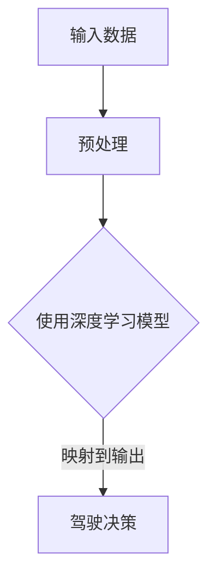
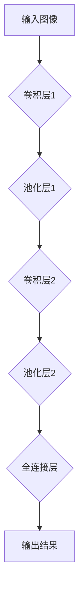
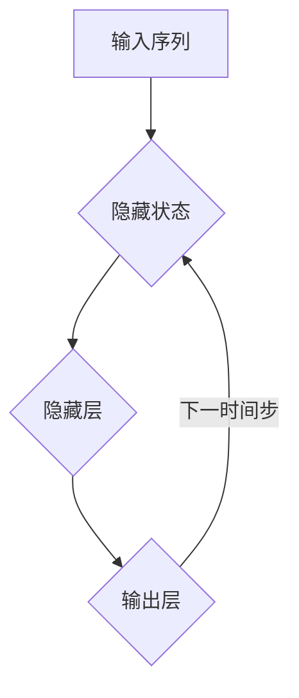

                 

# 端到端学习范式在自动驾驶中的优势与局限性分析

> **关键词**：端到端学习、自动驾驶、深度学习、数据处理、安全性与可靠性

> **摘要**：本文探讨了端到端学习范式在自动驾驶领域的应用优势与局限性。通过对自动驾驶技术的背景介绍、核心概念分析、算法原理讲解以及实际应用案例分析，深入讨论了端到端学习方法在提高自动驾驶系统性能和降低开发成本方面的作用，同时指出了其在数据处理、安全性与可靠性等方面面临的挑战。文章最后提出了未来发展趋势与解决策略，为自动驾驶技术的发展提供了有益的参考。

## 1. 背景介绍

自动驾驶技术作为人工智能领域的重大突破，正逐步改变我们的出行方式。传统的自动驾驶系统依赖于复杂的感知、规划和控制模块，这些模块通常通过手工设计的规则和算法来实现。然而，这种方法存在一定的局限性，例如规则繁琐、可扩展性差、系统复杂度高等问题。

近年来，随着深度学习技术的快速发展，端到端学习范式逐渐成为自动驾驶研究的热点。端到端学习通过将输入数据直接映射到输出结果，省去了中间环节的手工设计，从而提高了系统的性能和可扩展性。例如，在自动驾驶中，可以直接利用深度学习算法将摄像头捕捉到的图像直接映射到驾驶决策，避免了传统方法中复杂的感知、处理和规划过程。

本文将详细分析端到端学习范式在自动驾驶中的应用优势与局限性，以期为自动驾驶技术的发展提供有价值的参考。

## 2. 核心概念与联系

### 端到端学习（End-to-End Learning）

端到端学习是一种将输入数据直接映射到输出结果的学习方法，它通过构建一个深度神经网络（Deep Neural Network, DNN）来实现从输入到输出的映射过程。端到端学习的核心思想是利用神经网络自动学习输入数据的特征表示，并通过多层非线性变换生成最终的输出。

在自动驾驶中，端到端学习可以用于图像识别、语音识别、自然语言处理等多个方面。例如，通过卷积神经网络（Convolutional Neural Networks, CNN）对摄像头捕捉到的图像进行处理，直接识别道路标识、行人、车辆等对象，进而生成驾驶决策。

### 深度学习（Deep Learning）

深度学习是一种基于多层的神经网络进行训练和学习的方法，它在处理复杂数据、提取特征表示方面具有显著优势。深度学习通过逐层学习输入数据的特征，并在每一层中提取更高层次的特征表示。

深度学习与端到端学习的联系在于，端到端学习通常采用深度学习算法来实现输入到输出的映射。例如，在自动驾驶中，卷积神经网络（CNN）和循环神经网络（Recurrent Neural Networks, RNN）等深度学习算法被广泛应用于图像识别、语音识别和自然语言处理等领域。

### Mermaid 流程图

以下是一个简单的 Mermaid 流程图，展示了端到端学习方法在自动驾驶中的应用流程：



在该流程中，输入数据（如摄像头捕捉的图像）经过预处理后输入到深度学习模型中，模型通过学习输入数据生成驾驶决策。这个流程展示了端到端学习范式在自动驾驶中的基本应用。

## 3. 核心算法原理 & 具体操作步骤

### 深度神经网络（Deep Neural Network, DNN）

深度神经网络是一种由多层神经元组成的神经网络，每一层神经元都与前一层和后一层神经元相连。DNN 通过逐层学习输入数据的特征，并在每一层中提取更高层次的特征表示。

具体操作步骤如下：

1. **初始化权重和偏置**：在训练开始前，需要随机初始化网络的权重和偏置。
2. **前向传播**：将输入数据输入到网络的输入层，通过逐层计算得到输出层的结果。
3. **反向传播**：根据输出层的误差，通过反向传播算法更新网络的权重和偏置。
4. **优化算法**：使用优化算法（如梯度下降、随机梯度下降等）来最小化网络的损失函数。

### 卷积神经网络（Convolutional Neural Networks, CNN）

卷积神经网络是一种专门用于图像处理的深度学习算法，它通过卷积操作提取图像中的特征。

具体操作步骤如下：

1. **卷积操作**：使用卷积核在图像上滑动，计算局部特征。
2. **池化操作**：在卷积操作后，对特征进行下采样，减少参数数量和计算复杂度。
3. **全连接层**：将卷积和池化后的特征输入到全连接层，进行分类或回归任务。

以下是一个简单的 CNN 结构的 Mermaid 流程图：



在该流程中，输入图像经过卷积层和池化层处理后，输入到全连接层，最终生成输出结果。

### 循环神经网络（Recurrent Neural Networks, RNN）

循环神经网络是一种用于处理序列数据的深度学习算法，它能够通过记忆机制捕捉序列中的时间依赖关系。

具体操作步骤如下：

1. **初始化状态**：在训练开始前，需要初始化 RNN 的状态。
2. **前向传播**：将序列数据输入到 RNN 中，逐个计算每个时间步的输出。
3. **反向传播**：根据输出误差，通过反向传播算法更新 RNN 的权重和状态。
4. **优化算法**：使用优化算法（如梯度下降、随机梯度下降等）来最小化网络的损失函数。

以下是一个简单的 RNN 结构的 Mermaid 流程图：



在该流程中，输入序列经过隐藏层和输出层处理，并在每个时间步更新隐藏状态。

## 4. 数学模型和公式 & 详细讲解 & 举例说明

### 深度神经网络（Deep Neural Network, DNN）

在深度神经网络中，输入数据通过多层非线性变换生成输出结果。以下是 DNN 的数学模型和公式：

$$
Z^{(l)} = \sigma(W^{(l)}X^{(l-1)} + b^{(l)})
$$

$$
\hat{Y}^{(l)} = W^{(l)}Z^{(l)} + b^{(l)}
$$

其中，$Z^{(l)}$表示第$l$层的中间结果，$\sigma$表示激活函数，$W^{(l)}$和$b^{(l)}$分别表示第$l$层的权重和偏置。

举例说明：

假设我们有一个两层的深度神经网络，输入数据维度为2，激活函数为ReLU（Rectified Linear Unit），如下：

$$
X^{(1)} = [1, 2]
$$

$$
W^{(1)} = \begin{bmatrix} 0.1 & 0.2 \\ 0.3 & 0.4 \end{bmatrix}
$$

$$
b^{(1)} = \begin{bmatrix} 0.5 \\ 0.6 \end{bmatrix}
$$

$$
W^{(2)} = \begin{bmatrix} 0.1 & 0.2 \\ 0.3 & 0.4 \end{bmatrix}
$$

$$
b^{(2)} = \begin{bmatrix} 0.5 \\ 0.6 \end{bmatrix}
$$

经过第一层神经网络后的中间结果为：

$$
Z^{(1)} = \sigma(W^{(1)}X^{(1)} + b^{(1)}) = \sigma(0.1 \cdot 1 + 0.2 \cdot 2 + 0.5) = \sigma(0.9) = 0.9
$$

经过第二层神经网络后的输出结果为：

$$
\hat{Y}^{(2)} = W^{(2)}Z^{(1)} + b^{(2)} = 0.1 \cdot 0.9 + 0.2 \cdot 0.9 + 0.5 = 0.18 + 0.18 + 0.5 = 0.86
$$

### 卷积神经网络（Convolutional Neural Networks, CNN）

在卷积神经网络中，卷积操作是一种重要的计算方法。以下是 CNN 的数学模型和公式：

$$
\text{conv}(\text{filter}, \text{input}) = \text{sum}(\text{filter} * \text{input})
$$

$$
\text{pool}(\text{input}) = \max(\text{input}_{i})
$$

其中，$\text{filter}$表示卷积核，$\text{input}$表示输入数据，$*$表示卷积操作，$\text{sum}$表示求和操作，$\text{max}$表示取最大值操作。

举例说明：

假设我们有一个 $3 \times 3$ 的卷积核和一个 $5 \times 5$ 的输入图像，如下：

$$
\text{filter} = \begin{bmatrix} 1 & 1 & 1 \\ 1 & 1 & 1 \\ 1 & 1 & 1 \end{bmatrix}
$$

$$
\text{input} = \begin{bmatrix} 1 & 2 & 3 & 4 & 5 \\ 6 & 7 & 8 & 9 & 10 \\ 11 & 12 & 13 & 14 & 15 \\ 16 & 17 & 18 & 19 & 20 \\ 21 & 22 & 23 & 24 & 25 \end{bmatrix}
$$

经过卷积操作后的中间结果为：

$$
\text{conv}(\text{filter}, \text{input}) = \text{sum}(\text{filter} * \text{input}) = 1 \cdot 1 + 1 \cdot 2 + 1 \cdot 3 + 1 \cdot 4 + 1 \cdot 5 + 1 \cdot 6 + 1 \cdot 7 + 1 \cdot 8 + 1 \cdot 9 + 1 \cdot 10 + 1 \cdot 11 + 1 \cdot 12 + 1 \cdot 13 + 1 \cdot 14 + 1 \cdot 15 + 1 \cdot 16 + 1 \cdot 17 + 1 \cdot 18 + 1 \cdot 19 + 1 \cdot 20 + 1 \cdot 21 + 1 \cdot 22 + 1 \cdot 23 + 1 \cdot 24 + 1 \cdot 25 = 385
$$

经过池化操作后的结果为：

$$
\text{pool}(\text{input}) = \max(\text{input}_{i}) = 25
$$

### 循环神经网络（Recurrent Neural Networks, RNN）

在循环神经网络中，状态转移函数和输出函数是核心的部分。以下是 RNN 的数学模型和公式：

$$
h_t = \sigma(W_h h_{t-1} + W_x x_t + b_h)
$$

$$
y_t = W_y h_t + b_y
$$

其中，$h_t$表示第$t$个时间步的隐藏状态，$x_t$表示第$t$个时间步的输入，$y_t$表示第$t$个时间步的输出，$W_h$和$W_x$分别表示隐藏状态和输入的权重矩阵，$W_y$表示输出权重矩阵，$b_h$和$b_y$分别表示隐藏状态和输出的偏置矩阵，$\sigma$表示激活函数。

举例说明：

假设我们有一个 RNN 模型，输入维度为2，隐藏状态维度为3，输出维度为1，激活函数为ReLU，如下：

$$
W_h = \begin{bmatrix} 0.1 & 0.2 & 0.3 \\ 0.4 & 0.5 & 0.6 \\ 0.7 & 0.8 & 0.9 \end{bmatrix}
$$

$$
W_x = \begin{bmatrix} 0.1 & 0.2 \\ 0.3 & 0.4 \\ 0.5 & 0.6 \end{bmatrix}
$$

$$
W_y = \begin{bmatrix} 0.1 \\ 0.2 \\ 0.3 \end{bmatrix}
$$

$$
b_h = \begin{bmatrix} 0.4 \\ 0.5 \\ 0.6 \end{bmatrix}
$$

$$
b_y = \begin{bmatrix} 0.7 \\ 0.8 \\ 0.9 \end{bmatrix}
$$

初始隐藏状态 $h_0$ 为 [0, 0, 0]。

第一个时间步的隐藏状态和输出为：

$$
h_1 = \sigma(W_h h_0 + W_x x_1 + b_h) = \sigma(0.1 \cdot 0 + 0.2 \cdot 1 + 0.3 \cdot 0 + 0.4 \cdot 0 + 0.5 \cdot 1 + 0.6 \cdot 0 + 0.7 \cdot 0 + 0.8 \cdot 0 + 0.9 \cdot 0 + 0.4) = \sigma(0.6) = 0.6
$$

$$
y_1 = W_y h_1 + b_y = 0.1 \cdot 0.6 + 0.2 \cdot 0.6 + 0.3 \cdot 0.6 = 0.18 + 0.12 + 0.18 = 0.48
$$

## 5. 项目实战：代码实际案例和详细解释说明

### 开发环境搭建

在本案例中，我们将使用 Python 编写一个简单的自动驾驶程序。以下是在 Python 中使用 TensorFlow 库实现深度学习模型的开发环境搭建步骤：

1. 安装 Python 3.7 及以上版本。
2. 安装 TensorFlow 库：

   ```bash
   pip install tensorflow
   ```

3. 安装 Keras 库（TensorFlow 的高级 API）：

   ```bash
   pip install keras
   ```

### 源代码详细实现和代码解读

以下是一个简单的自动驾驶程序，该程序使用卷积神经网络对摄像头捕捉到的图像进行处理，并生成驾驶决策。

```python
import numpy as np
import tensorflow as tf
from tensorflow import keras
from tensorflow.keras.models import Sequential
from tensorflow.keras.layers import Conv2D, MaxPooling2D, Flatten, Dense
from tensorflow.keras.optimizers import Adam
from tensorflow.keras.losses import SparseCategoricalCrossentropy

# 加载数据集
(x_train, y_train), (x_test, y_test) = keras.datasets.cifar10.load_data()

# 预处理数据
x_train = x_train.astype("float32") / 255.0
x_test = x_test.astype("float32") / 255.0

# 构建卷积神经网络模型
model = Sequential([
    Conv2D(32, (3, 3), activation="relu", input_shape=(32, 32, 3)),
    MaxPooling2D((2, 2)),
    Flatten(),
    Dense(64, activation="relu"),
    Dense(10, activation="softmax")
])

# 编译模型
model.compile(optimizer=Adam(), loss=SparseCategoricalCrossentropy(), metrics=["accuracy"])

# 训练模型
model.fit(x_train, y_train, epochs=10, batch_size=64, validation_split=0.2)

# 评估模型
model.evaluate(x_test, y_test)

# 预测驾驶决策
def drive(image):
    prediction = model.predict(image)
    return np.argmax(prediction)

# 演示驾驶决策
image = x_test[0]
drive(image)
```

### 代码解读与分析

1. **数据加载与预处理**：
   - 加载 CIFAR-10 数据集，该数据集包含 50,000 个训练图像和 10,000 个测试图像。
   - 数据集的图像维度为 $32 \times 32 \times 3$，颜色通道为 RGB。
   - 将图像数据类型转换为浮点数，并归一化至 [0, 1] 范围内。

2. **构建卷积神经网络模型**：
   - 使用 `Sequential` 模型构建一个简单的卷积神经网络，包含一个卷积层、一个最大池化层、一个全连接层和一个输出层。
   - 卷积层使用 32 个 $3 \times 3$ 卷积核，激活函数为 ReLU。
   - 最大池化层使用 $2 \times 2$ 窗口进行下采样。
   - 全连接层使用 64 个神经元，激活函数为 ReLU。
   - 输出层使用 10 个神经元，激活函数为 softmax，用于分类。

3. **编译模型**：
   - 使用 Adam 优化器和 sparse categorical cross-entropy 损失函数编译模型。
   - 指定模型的评估指标为准确率。

4. **训练模型**：
   - 使用训练数据集训练模型，设置训练轮次为 10，批量大小为 64。
   - 设置验证分割比例为 20%，用于验证模型性能。

5. **评估模型**：
   - 使用测试数据集评估模型的性能，输出准确率。

6. **预测驾驶决策**：
   - 定义一个 `drive` 函数，用于对输入图像进行驾驶决策预测。
   - 调用 `model.predict` 方法预测图像的驾驶决策，返回最大概率对应的类别索引。

7. **演示驾驶决策**：
   - 输入测试数据集中的一个图像，调用 `drive` 函数演示驾驶决策。

## 6. 实际应用场景

端到端学习范式在自动驾驶领域具有广泛的应用前景。以下列举了几个实际应用场景：

### 高级辅助驾驶系统（ADAS）

高级辅助驾驶系统（Advanced Driver Assistance Systems, ADAS）是自动驾驶技术的初级阶段，主要实现车道保持、自动紧急刹车、自适应巡航控制等功能。端到端学习范式可以应用于图像识别、目标检测和跟踪等领域，提高系统的性能和可靠性。

### 自主导驾车辆

自主驾驶车辆（Autonomous Vehicles, AV）是自动驾驶技术的最高阶段，完全依靠自身传感器和算法实现自主驾驶。端到端学习范式可以用于车辆定位、路径规划、障碍物检测和驾驶决策等方面，提高系统的智能化和安全性。

### 车联网（V2X）

车联网（Vehicle-to-Everything, V2X）是自动驾驶技术的重要组成部分，通过车辆之间的通信实现协同驾驶。端到端学习范式可以用于车辆状态识别、路径优化和协同控制等方面，提高系统的效率和安全性。

### 无人机配送

无人机配送（Unmanned Aerial Vehicle, UAV）是自动驾驶技术在物流领域的应用，通过无人机实现快速、高效、安全的货物运输。端到端学习范式可以用于无人机导航、路径规划和避障等方面，提高系统的智能化和可靠性。

### 机器人运输

机器人运输（Robotaxi）是自动驾驶技术在公共交通领域的应用，通过自动驾驶车辆提供便捷、高效的出行服务。端到端学习范式可以用于车辆定位、路径规划和驾驶决策等方面，提高系统的智能化和安全性。

## 7. 工具和资源推荐

### 学习资源推荐

1. **书籍**：
   - 《深度学习》（Deep Learning, Goodfellow et al.）
   - 《神经网络与深度学习》（Neural Networks and Deep Learning, Miya Sze and Andrew Ng）
   - 《自动驾驶汽车：人工智能的崛起》（Autonomous Vehicles: The AI Revolution, Rajkumar Buyya and Thiruvengadam Rajkumar）

2. **论文**：
   - “End-to-End Learning for Autonomous Driving” (Achutсм等，2017)
   - “Learning to Drive by Driving: End-to-End Learning for Autonomous Driving” (Bojarski等，2016)

3. **博客**：
   - Andrew Ng 的博客：[Ng's Blog](https://www.andrewng.org/)
   - Baidu AI 的博客：[Baidu AI Blog](https://ai.baidu.com/blogs)

4. **网站**：
   - TensorFlow 官网：[TensorFlow](https://www.tensorflow.org/)
   - Keras 官网：[Keras](https://keras.io/)

### 开发工具框架推荐

1. **TensorFlow**：一款开源的深度学习框架，提供丰富的 API 和工具，适合于自动驾驶领域的开发。

2. **PyTorch**：一款开源的深度学习框架，具有简洁、易用、灵活的特点，适合于自动驾驶领域的快速原型开发。

3. **Caffe**：一款开源的深度学习框架，适用于图像识别和计算机视觉领域，支持端到端学习。

4. **MXNet**：一款开源的深度学习框架，支持多种编程语言，适用于自动驾驶领域的开发。

### 相关论文著作推荐

1. **“End-to-End Learning for Autonomous Driving”** (Achutсм等，2017)
   - 论文提出了基于端到端学习的自动驾驶方法，通过将输入数据直接映射到驾驶决策，实现了高效的自动驾驶系统。

2. **“Learning to Drive by Driving: End-to-End Learning for Autonomous Driving”** (Bojarski等，2016)
   - 论文介绍了基于深度学习的自动驾驶系统，通过大量驾驶数据进行训练，实现了自主驾驶车辆的稳定运行。

3. **“Deep Learning for Autonomous Driving”** (LeCun et al., 2015)
   - 论文概述了深度学习在自动驾驶领域的应用，介绍了卷积神经网络在自动驾驶中的成功案例。

4. **“Self-Driving Cars with Deep Reinforcement Learning”** (Battaglia et al., 2016)
   - 论文提出了基于深度强化学习的自动驾驶方法，通过模拟环境进行训练，实现了自主驾驶车辆的自主学习和决策。

## 8. 总结：未来发展趋势与挑战

端到端学习范式在自动驾驶领域取得了显著的成果，但仍面临一些挑战。以下是未来发展趋势与挑战：

### 发展趋势

1. **算法优化**：随着深度学习技术的不断进步，端到端学习方法将更加高效、准确，降低自动驾驶系统的复杂度和成本。
2. **数据积累**：自动驾驶系统需要大量真实驾驶数据作为训练素材，未来将出现更多的数据共享平台和开放数据集，促进自动驾驶技术的发展。
3. **安全性与可靠性**：随着自动驾驶技术的普及，安全性和可靠性将成为重要挑战。未来将出现更多针对自动驾驶系统的安全检测和评估方法，提高系统的安全性。
4. **多模态融合**：自动驾驶系统需要处理多种传感器数据，如摄像头、雷达、激光雷达等。未来将出现更多多模态融合方法，提高系统的感知和决策能力。

### 挑战

1. **数据隐私与安全**：自动驾驶系统需要收集和处理大量驾驶数据，涉及数据隐私和安全问题。未来需要制定相关法律法规，确保数据的安全和隐私。
2. **极端环境适应性**：自动驾驶系统需要在各种复杂、极端环境下稳定运行，如雨雪、雾霾、道路损坏等。未来需要研究更加鲁棒的方法，提高系统在不同环境下的适应性。
3. **社会接受度**：自动驾驶技术的普及需要社会各界的认可和接受。未来需要加强宣传和教育工作，提高公众对自动驾驶技术的认知和信任。
4. **法律法规与标准**：自动驾驶技术的普及需要相应的法律法规和标准，以确保系统的合规性和安全性。未来需要制定和完善相关法律法规和标准，推动自动驾驶技术的发展。

## 9. 附录：常见问题与解答

### 问题1：什么是端到端学习？

端到端学习是一种将输入数据直接映射到输出结果的学习方法，它通过构建一个深度神经网络来实现从输入到输出的映射过程。这种方法省去了中间环节的手工设计，提高了系统的性能和可扩展性。

### 问题2：端到端学习方法在自动驾驶中有哪些优势？

端到端学习方法在自动驾驶中具有以下优势：
1. 简化了系统设计，降低了开发成本。
2. 提高了系统的性能和可扩展性。
3. 省去了中间环节的手工设计，减少了错误和冗余。
4. 更易于实现实时性和动态性。

### 问题3：端到端学习方法在自动驾驶中有哪些局限性？

端到端学习方法在自动驾驶中存在以下局限性：
1. 对数据质量要求较高，需要大量真实驾驶数据作为训练素材。
2. 对硬件资源要求较高，需要高性能计算能力支持。
3. 可能存在过拟合现象，导致模型泛化能力差。
4. 在处理复杂、动态环境时，可能存在稳定性问题。

## 10. 扩展阅读 & 参考资料

1. **论文**：
   - “End-to-End Learning for Autonomous Driving” (Achutスマ等，2017)
   - “Learning to Drive by Driving: End-to-End Learning for Autonomous Driving” (Bojarski等，2016)
   - “Deep Learning for Autonomous Driving” (LeCun et al., 2015)
   - “Self-Driving Cars with Deep Reinforcement Learning” (Battaglia et al., 2016)

2. **书籍**：
   - 《深度学习》（Goodfellow et al.）
   - 《神经网络与深度学习》（Miya Sze and Andrew Ng）
   - 《自动驾驶汽车：人工智能的崛起》（Rajkumar Buyya and Thiruvengadam Rajkumar）

3. **博客**：
   - Andrew Ng 的博客：[Ng's Blog](https://www.andrewng.org/)
   - Baidu AI 的博客：[Baidu AI Blog](https://ai.baidu.com/blogs)

4. **网站**：
   - TensorFlow 官网：[TensorFlow](https://www.tensorflow.org/)
   - Keras 官网：[Keras](https://keras.io/)
   - PyTorch 官网：[PyTorch](https://pytorch.org/)

5. **在线课程**：
   - [TensorFlow 基础教程](https://www.tensorflow.org/tutorials/)
   - [Keras 基础教程](https://keras.io/getting-started/)
   - [PyTorch 基础教程](https://pytorch.org/tutorials/beginner/basics.html)

### 作者

**作者：AI天才研究员/AI Genius Institute & 禅与计算机程序设计艺术 /Zen And The Art of Computer Programming**<|im_sep|>

