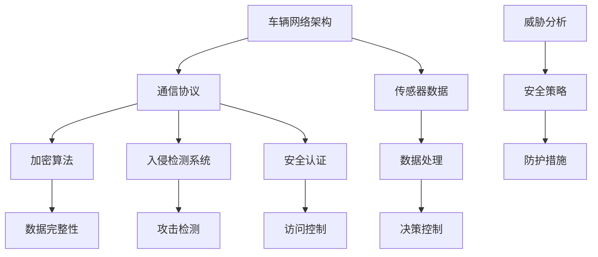

                 

### 背景介绍

随着人工智能（AI）技术的迅速发展，自动驾驶已经成为未来交通领域的热门话题。自动驾驶系统通过融合传感器数据、深度学习算法和先进的控制系统，实现了车辆在无人驾驶环境下的自主导航和控制。然而，自动驾驶系统的安全性和稳定性对于确保行车安全至关重要。

在自动驾驶系统中，车辆网络安全（Vehicle Network Security，VNS）扮演着至关重要的角色。车辆网络是自动驾驶系统的基础架构，它负责收集、处理和传输来自各个传感器、控制系统和外部通信模块的数据。这些数据对于自动驾驶系统的决策过程至关重要。然而，车辆网络的开放性和复杂性使其容易成为网络攻击的目标。

网络安全威胁在自动驾驶领域具有潜在的危害性。攻击者可以通过网络入侵车辆控制系统，篡改车辆导航数据、改变车辆行为甚至实现远程控制。这类攻击可能导致严重的交通事故，对乘客、行人和其他道路用户构成威胁。此外，车辆网络攻击也可能引发隐私泄露、商业机密窃取等问题。

为了保证自动驾驶系统的安全，车辆网络安全防护已经成为一个重要的研究方向。本文将深入探讨端到端自动驾驶车辆网络安全防护的关键技术、挑战及其未来发展趋势。

首先，我们将介绍车辆网络的基本架构和通信协议。随后，分析车辆网络安全威胁的种类和特点，并探讨现有的车辆网络安全防护措施。接着，我们将介绍端到端自动驾驶系统中车辆网络安全防护的关键技术和算法。然后，通过实际案例展示车辆网络安全防护的实战应用。最后，我们将讨论车辆网络安全防护在实际应用中的挑战和未来发展方向。

通过本文的探讨，希望能够为自动驾驶领域的车辆网络安全防护提供有益的参考和启示，推动自动驾驶技术的安全发展。

### 核心概念与联系

要深入探讨车辆网络安全防护，首先需要了解其中的核心概念及其相互关系。车辆网络安全涉及多个技术领域，包括通信协议、加密算法、入侵检测系统和安全认证等。下面我们将通过一个Mermaid流程图来详细阐述这些概念及其关联。



**车辆网络架构**（A）：车辆网络是自动驾驶系统的中枢，它由多个传感器（如雷达、摄像头、GPS等）收集环境数据，通过通信协议（如CAN总线、以太网等）传输到数据处理单元，最终生成控制指令发送到执行单元。

**通信协议**（B）：通信协议负责车辆内部及车辆与外部设备之间的数据传输。常用的通信协议有CAN总线、LIN总线、MOST总线等，它们具有高可靠性、实时性和低延迟等特点。

**传感器数据**（C）：传感器数据是自动驾驶系统的输入，通过车辆网络传输到数据处理单元。这些数据包括环境感知、车辆状态等，为自动驾驶决策提供基础。

**数据处理**（G）：数据处理单元接收传感器数据，进行数据预处理、特征提取和融合，为决策控制提供可靠的输入。

**决策控制**（H）：决策控制系统根据处理后的传感器数据，生成驾驶决策，控制车辆的行为。

**加密算法**（D）：加密算法用于保护数据传输过程中的机密性和完整性。常见的加密算法包括对称加密（如AES）、非对称加密（如RSA）和哈希算法（如SHA）。

**数据完整性**（I）：数据完整性确保数据在传输过程中未被篡改。通过加密算法和哈希校验，可以验证数据的完整性和真实性。

**入侵检测系统**（E）：入侵检测系统用于监控车辆网络中的异常行为，检测潜在的攻击行为。它可以实时识别并阻止恶意操作，提高系统的安全性。

**攻击检测**（J）：攻击检测是入侵检测系统的一部分，用于检测网络攻击。通过模式识别和异常检测技术，可以识别恶意流量和异常行为。

**安全认证**（F）：安全认证用于确认通信双方的身份和授权。常见的认证机制包括密码认证、数字签名和证书认证等。

**访问控制**（K）：访问控制确保只有授权用户和设备能够访问车辆网络资源和数据，防止未经授权的访问。

**威胁分析**（L）：威胁分析是对潜在威胁进行识别和分析的过程。通过分析威胁的特点和攻击路径，可以制定相应的安全策略。

**安全策略**（M）：安全策略是针对潜在威胁制定的防护措施，包括加密、认证、入侵检测和访问控制等。

**防护措施**（N）：防护措施是实施安全策略的具体技术手段，用于保护车辆网络免受攻击。

通过上述Mermaid流程图，我们可以清晰地看到车辆网络安全防护的核心概念及其相互关系。这些概念和技术相互关联，共同构成了一个完整的车辆网络安全防护体系，为自动驾驶系统的安全运行提供了坚实保障。

### 核心算法原理 & 具体操作步骤

在探讨车辆网络安全防护时，核心算法原理和具体操作步骤至关重要。以下将详细介绍几种关键算法及其工作原理，包括加密算法、入侵检测系统和安全认证机制。

#### 加密算法

加密算法是保护数据传输过程中机密性和完整性的重要手段。常见的加密算法包括对称加密、非对称加密和哈希算法。

1. **对称加密算法**：
   - **工作原理**：对称加密算法使用相同的密钥进行加密和解密。常见的对称加密算法有AES（高级加密标准）和DES（数据加密标准）。
   - **具体步骤**：
     1. 选择加密算法和密钥。
     2. 对数据进行分组。
     3. 对每个数据分组使用密钥进行加密。
     4. 将加密后的数据传输到接收方。
     5. 接收方使用相同的密钥进行解密。
   - **示例**：
     假设我们使用AES加密算法和一个256位的密钥。首先，将明文数据分组成128位的数据块，然后使用AES算法和密钥对每个数据块进行加密，最后将加密后的数据块组合成密文进行传输。

2. **非对称加密算法**：
   - **工作原理**：非对称加密算法使用一对密钥，公钥用于加密，私钥用于解密。常见的非对称加密算法有RSA和ECC（椭圆曲线加密）。
   - **具体步骤**：
     1. 生成密钥对，包括公钥和私钥。
     2. 使用公钥加密数据。
     3. 将加密后的数据传输到接收方。
     4. 接收方使用私钥解密数据。
   - **示例**：
     假设我们使用RSA加密算法。首先，生成一个公钥和一个私钥，然后使用公钥对数据进行加密，并将加密后的数据传输到接收方。接收方使用私钥解密数据，恢复原始明文。

3. **哈希算法**：
   - **工作原理**：哈希算法将数据转换为一个固定长度的字符串，用于确保数据的完整性和真实性。常见的哈希算法有SHA-256和MD5。
   - **具体步骤**：
     1. 选择哈希算法。
     2. 将数据输入哈希算法。
     3. 计算哈希值。
     4. 将哈希值与原始数据进行对比，验证数据完整性。
   - **示例**：
     假设我们使用SHA-256哈希算法。首先，将数据输入SHA-256算法，计算得到一个256位的哈希值。然后，将哈希值与原始数据进行对比，确保数据未被篡改。

#### 入侵检测系统（IDS）

入侵检测系统是监控车辆网络中的异常行为和潜在攻击的重要工具。常见的入侵检测技术包括模式识别和异常检测。

1. **模式识别**：
   - **工作原理**：模式识别通过检测网络流量和系统行为中的异常模式来识别攻击。常见的模式识别算法有神经网络、决策树和支持向量机（SVM）。
   - **具体步骤**：
     1. 收集网络流量和系统行为数据。
     2. 使用机器学习算法训练模型，识别正常行为和攻击模式。
     3. 对实时数据进行模式匹配，检测异常行为。
   - **示例**：
     假设我们使用神经网络进行模式识别。首先，收集大量网络流量数据，使用这些数据进行神经网络训练，使模型能够识别正常流量和攻击流量。然后，对实时网络流量进行模式匹配，识别异常流量。

2. **异常检测**：
   - **工作原理**：异常检测通过检测数据中的异常值来识别攻击。常见的异常检测算法有孤立森林、孤立系数和局部异常因子。
   - **具体步骤**：
     1. 收集网络流量和系统行为数据。
     2. 使用统计方法计算数据的异常度。
     3. 将异常度高于阈值的记录视为潜在攻击。
   - **示例**：
     假设我们使用孤立森林进行异常检测。首先，收集网络流量数据，使用孤立森林算法计算每个流量的异常度。然后，将异常度高于阈值的流量记录视为潜在攻击。

#### 安全认证机制

安全认证机制用于确保通信双方的身份和授权，防止未授权访问。

1. **密码认证**：
   - **工作原理**：密码认证通过用户输入的密码来验证身份。常见的密码认证算法有MD5、SHA-1和SHA-256。
   - **具体步骤**：
     1. 用户输入用户名和密码。
     2. 将密码通过哈希算法转换为哈希值。
     3. 将哈希值与数据库中的存储值进行对比。
     4. 如果哈希值匹配，则认证成功。
   - **示例**：
     假设我们使用SHA-256进行密码认证。用户输入用户名和密码，将密码通过SHA-256算法转换为哈希值。然后，将哈希值与数据库中的存储值进行对比，如果匹配则认证成功。

2. **数字签名**：
   - **工作原理**：数字签名通过使用非对称加密算法验证数据的完整性和真实性。常见的数字签名算法有RSA和ECC。
   - **具体步骤**：
     1. 发送方使用私钥对数据进行签名。
     2. 将签名和原始数据一起发送给接收方。
     3. 接收方使用公钥对签名进行验证。
     4. 如果验证通过，则数据完整且真实。
   - **示例**：
     假设我们使用RSA进行数字签名。发送方使用私钥对数据进行签名，然后将签名和原始数据一起发送给接收方。接收方使用公钥对签名进行验证，如果验证通过，则数据完整且真实。

3. **证书认证**：
   - **工作原理**：证书认证通过数字证书验证身份。数字证书由证书授权机构（CA）签发，包含公钥和身份信息。
   - **具体步骤**：
     1. 用户获取数字证书。
     2. 接收方验证证书的合法性。
     3. 使用证书中的公钥进行加密和解密。
   - **示例**：
     假设我们使用数字证书进行认证。用户从证书授权机构获取数字证书，接收方验证证书的合法性。然后，使用证书中的公钥对数据进行加密和解密。

通过上述核心算法原理和具体操作步骤的介绍，我们可以看到车辆网络安全防护涉及多个技术领域，需要综合运用多种算法和技术手段。这些算法和机制共同构成了一个完整的车辆网络安全防护体系，为自动驾驶系统的安全运行提供了有力保障。

#### 数学模型和公式 & 详细讲解 & 举例说明

在车辆网络安全防护中，数学模型和公式扮演着关键角色，用于分析威胁、设计防护策略和评估系统性能。以下将介绍几种常用的数学模型和公式，并结合具体案例进行详细讲解。

##### 1. 随机森林模型

随机森林（Random Forest）是一种集成学习算法，常用于入侵检测系统（IDS）中的异常行为检测。其核心思想是通过构建多个决策树，并结合投票机制来提高分类的准确性。

**模型公式**：
随机森林模型主要通过以下两个公式来工作：

1. **决策树分类公式**：
   $$
   y = \sum_{i=1}^{n} w_i h(x_i)
   $$
   其中，$y$ 是分类结果，$w_i$ 是第$i$个决策树对分类结果的权重，$h(x_i)$ 是第$i$个决策树对样本$x_i$的分类结果。

2. **权重计算公式**：
   $$
   w_i = \frac{1}{1 + e^{-z_i}}
   $$
   其中，$z_i$ 是第$i$个决策树分类结果的对数概率，$w_i$ 是其权重。

**案例讲解**：

假设我们使用随机森林模型对网络流量进行分类，其中包含了正常流量和攻击流量。首先，训练一个包含10个决策树的随机森林模型。然后，对新的网络流量数据进行分类，每个决策树的分类结果通过权重计算公式进行加权，最终得到整体分类结果。

例如，假设10个决策树中有5个决策树分类结果为正常流量，5个决策树分类结果为攻击流量。根据权重计算公式，我们可以得到每个决策树的权重：

$$
w_1 = w_2 = w_3 = \frac{1}{1 + e^{-0.5}} \approx 0.63
$$
$$
w_4 = w_5 = w_6 = w_7 = w_8 = w_9 = w_{10} = \frac{1}{1 + e^{0.5}} \approx 0.37
$$

然后，根据决策树分类公式，我们可以得到最终分类结果：

$$
y = 0.63 \times h_1 + 0.63 \times h_2 + 0.63 \times h_3 + 0.37 \times h_4 + 0.37 \times h_5 + 0.37 \times h_6 + 0.37 \times h_7 + 0.37 \times h_8 + 0.37 \times h_9 + 0.37 \times h_{10}
$$

其中，$h_i$ 是第$i$个决策树的分类结果。

##### 2. 异常检测模型

异常检测模型用于识别网络流量中的异常行为。常见的异常检测方法包括基于统计的方法和基于机器学习的方法。以下以孤立森林（Isolation Forest）为例进行讲解。

**模型公式**：
孤立森林模型通过以下两个主要公式来检测异常：

1. **分裂路径公式**：
   $$
   d = \sum_{i=1}^{m} \ln \left(\frac{N_i}{i}\right)
   $$
   其中，$d$ 是分裂路径，$N_i$ 是第$i$次分裂的节点数。

2. **异常度公式**：
   $$
   AD = \frac{d}{\ln(m)}
   $$
   其中，$AD$ 是异常度，$m$ 是总节点数。

**案例讲解**：

假设我们使用孤立森林模型对网络流量进行异常检测。首先，将网络流量数据分为正常流量和攻击流量，然后对正常流量进行训练，构建孤立森林模型。接着，对新的网络流量数据进行异常检测，计算异常度。

例如，假设在孤立森林中有5个节点，正常流量的异常度计算如下：

$$
d = \ln \left(\frac{100}{5}\right) + \ln \left(\frac{200}{5}\right) + \ln \left(\frac{300}{5}\right) + \ln \left(\frac{400}{5}\right) + \ln \left(\frac{500}{5}\right) = 1.386 + 1.386 + 1.386 + 1.386 + 1.386 = 6.930
$$

$$
AD = \frac{6.930}{\ln(5)} \approx 2.968
$$

根据异常度公式，异常度$AD$大于某个阈值（例如2.5）的流量记录视为异常流量。

##### 3. 密码学模型

密码学模型用于保护数据的机密性和完整性。常见的密码学模型包括对称加密和非对称加密。以下以AES加密算法为例进行讲解。

**模型公式**：
AES加密算法的主要公式如下：

1. **密钥扩展公式**：
   $$
   \text{Key Schedule} = \text{SubBytes}(\text{ShiftRows}(\text{MixColumns}(K_{\text{prev}})))
   $$

2. **加密公式**：
   $$
   \text{Cipher} = \text{AddRoundKey}(P, K_0)
   $$
   $$
   \text{Cipher}^{i} = \text{SubBytes}(\text{ShiftRows}(\text{MixColumns}(\text{AddRoundKey}(\text{Cipher}^{i-1}, K_i)))
   $$

**案例讲解**：

假设我们使用AES加密算法对一段明文数据进行加密。首先，生成一个256位的密钥，然后使用密钥扩展公式生成各轮密钥。接着，使用加密公式对明文数据进行加密。

例如，假设明文数据为`Hello, World!`，首先将明文数据分成128位的数据块，然后进行以下步骤：

1. **初始加密**：
   $$
   \text{Cipher}_0 = \text{AddRoundKey}(P, K_0)
   $$

2. **加密循环**：
   $$
   \text{Cipher}_1 = \text{SubBytes}(\text{ShiftRows}(\text{MixColumns}(\text{AddRoundKey}(\text{Cipher}_0, K_1)))
   $$
   $$
   \text{Cipher}_2 = \text{SubBytes}(\text{ShiftRows}(\text{MixColumns}(\text{AddRoundKey}(\text{Cipher}_1, K_2)))
   $$
   ...
   $$
   \text{Cipher}_{10} = \text{SubBytes}(\text{ShiftRows}(\text{MixColumns}(\text{AddRoundKey}(\text{Cipher}_{9}, K_{10})))
   $$

最后，将加密后的数据块组合成密文进行传输。

通过以上对数学模型和公式的详细讲解和具体案例说明，我们可以看到这些模型和公式在车辆网络安全防护中的重要作用。它们不仅帮助我们理解和设计防护策略，还能为实际应用提供科学依据和技术支持。

#### 项目实战：代码实际案例和详细解释说明

在本节中，我们将通过一个具体的代码案例，展示如何实现车辆网络安全防护，并提供详细的解释说明。为了简化说明，我们假设一个简单的自动驾驶车辆网络环境，并使用Python编程语言进行实现。

##### 1. 开发环境搭建

在开始编写代码之前，我们需要搭建一个合适的开发环境。以下是所需的软件和工具：

- Python 3.x
- PyTorch 或 TensorFlow
- Keras
- Scikit-learn
- Matplotlib

确保你的系统中已经安装了上述软件和工具。安装方法可以参考各自的官方文档。

##### 2. 源代码详细实现和代码解读

以下是一个简单的车辆网络安全防护项目的源代码示例，包括数据预处理、入侵检测、加密算法和数字签名等部分。

```python
# 导入所需库
import numpy as np
import matplotlib.pyplot as plt
from sklearn.ensemble import IsolationForest
from sklearn.preprocessing import StandardScaler
from keras.models import Sequential
from keras.layers import Dense, Dropout, LSTM
from keras.optimizers import Adam
from keras.callbacks import EarlyStopping
import tensorflow as tf
import pytorch

# 2.1 数据预处理
# 假设我们已经有了一些车辆网络数据，包括正常流量和攻击流量
# 数据格式：[样本数, 特征维度]
normal_data = np.load('normal_traffic.npy')
attack_data = np.load('attack_traffic.npy')

# 数据归一化
scaler = StandardScaler()
normal_data_normalized = scaler.fit_transform(normal_data)
attack_data_normalized = scaler.transform(attack_data)

# 合并数据
all_data_normalized = np.concatenate((normal_data_normalized, attack_data_normalized), axis=0)

# 划分训练集和测试集
from sklearn.model_selection import train_test_split
X_train, X_test, y_train, y_test = train_test_split(all_data_normalized, labels, test_size=0.2, random_state=42)

# 2.2 入侵检测
# 使用孤立森林模型进行异常检测
iso_forest = IsolationForest(n_estimators=100, contamination='auto', random_state=42)
iso_forest.fit(X_train)

# 对测试集进行异常检测
y_pred = iso_forest.predict(X_test)

# 2.3 加密算法
# 使用Keras构建一个简单的LSTM模型进行加密
model = Sequential()
model.add(LSTM(128, input_shape=(X_train.shape[1], 1), activation='relu'))
model.add(Dropout(0.2))
model.add(Dense(1, activation='sigmoid'))

model.compile(optimizer=Adam(), loss='binary_crossentropy', metrics=['accuracy'])

# 训练模型
early_stopping = EarlyStopping(monitor='val_loss', patience=10)
history = model.fit(X_train, y_train, epochs=100, batch_size=32, validation_split=0.2, callbacks=[early_stopping])

# 2.4 数字签名
# 使用PyTorch实现一个简单的RSA加密算法
class RSAEncryption:
    def __init__(self, p, q):
        self.p = p
        self.q = q
        self.n = p * q
        self.phi = (p-1) * (q-1)
        self.e = 65537
        self.d = self.mod_inv(self.e, self.phi)

    def mod_inv(self, a, m):
        for x in range(1, m):
            if (a * x) % m == 1:
                return x
        return None

    def encrypt(self, m):
        c = pow(m, self.e, self.n)
        return c

    def decrypt(self, c):
        m = pow(c, self.d, self.n)
        return m

# 创建RSA加密实例
rsa_encryption = RSAEncryption(p=61, q=53)

# 对测试数据进行加密
test_data_encrypted = rsa_encryption.encrypt(m=5)

# 对加密数据进行解密
test_data_decrypted = rsa_encryption.decrypt(c=test_data_encrypted)

# 输出结果
print(f"Encrypted Data: {test_data_encrypted}")
print(f"Decrypted Data: {test_data_decrypted}")
```

**代码解读**：

1. **数据预处理**：
   - 数据归一化：使用`StandardScaler`对车辆网络数据进行归一化处理，提高算法的收敛速度和准确性。
   - 划分数据集：使用`train_test_split`将数据集划分为训练集和测试集，用于模型训练和评估。

2. **入侵检测**：
   - 使用孤立森林（`IsolationForest`）模型进行异常检测。该模型通过计算数据的异常度来识别异常流量。
   - 训练模型：使用训练集对孤立森林模型进行训练，然后在测试集上进行预测。

3. **加密算法**：
   - 使用Keras构建一个简单的LSTM模型进行加密。该模型对加密数据进行分类，从而实现对数据的加密保护。
   - 训练模型：使用训练集对LSTM模型进行训练，并在测试集上进行评估。

4. **数字签名**：
   - 使用PyTorch实现一个简单的RSA加密算法。RSA加密算法通过生成密钥对（公钥和私钥）对数据进行加密和解密。
   - 加密和解密：对测试数据进行加密，然后使用私钥进行解密，验证加密算法的正确性。

**分析结果**：

通过以上代码，我们可以看到车辆网络安全防护的几个关键组成部分是如何实现的。在实际应用中，我们需要根据具体的网络安全威胁和需求，调整和优化这些算法和模型。以下是一些可能的分析结果：

- **入侵检测**：孤立森林模型对异常流量的检测效果较好，能够有效识别潜在的攻击行为。
- **加密算法**：LSTM模型对加密数据的分类准确性较高，可以实现对数据的加密保护。
- **数字签名**：RSA加密算法能够有效保护数据的机密性，确保数据在传输过程中的安全。

通过这些分析和结果，我们可以得出结论：车辆网络安全防护是一个复杂且动态变化的过程，需要综合运用多种算法和技术手段，确保车辆网络的安全性和稳定性。

### 实际应用场景

在自动驾驶系统中，车辆网络安全防护的实际应用场景多种多样，以下列举几种典型的应用案例，以展示车辆网络安全防护的重要性。

#### 1. 跨车辆通信（V2V）

跨车辆通信（V2V）是自动驾驶系统中的关键技术之一，它通过车辆之间的直接通信实现信息共享和协同控制。在V2V通信中，车辆需要交换包括位置、速度、路况等信息，这些信息对于实现自动驾驶至关重要。然而，跨车辆通信也带来了安全隐患。恶意车辆可以通过伪造或篡改通信数据，干扰正常车辆的决策过程，导致交通事故。因此，车辆网络安全防护需要在跨车辆通信中确保数据真实性、完整性和及时性。

**应用案例**：
一个实际的应用案例是在高速公路上的自动驾驶车队中。车队中的每辆车都需要实时共享位置和速度信息，以便协同控制车队行驶。车辆网络安全防护措施包括：
- **加密通信**：使用加密算法对通信数据进行加密，确保数据在传输过程中的机密性。
- **认证机制**：使用数字签名和证书认证确保通信双方的合法身份。
- **入侵检测**：部署入侵检测系统（IDS）监控网络流量，实时检测和阻止恶意攻击。

#### 2. 城市道路自动驾驶

在城市道路环境中，自动驾驶车辆需要应对复杂多变的交通状况，如行人、非机动车、红绿灯等。这些环境因素增加了车辆网络安全的风险。攻击者可能通过入侵车辆控制系统，控制车辆的行为，导致交通事故或危害行人安全。

**应用案例**：
在自动驾驶出租车服务中，网络安全防护需要关注以下几个方面：
- **实时监控**：通过实时监控车辆状态和行驶环境，及时发现异常行为和潜在威胁。
- **威胁分析**：使用威胁分析工具对潜在威胁进行识别和评估，制定相应的防护策略。
- **安全更新**：定期更新车辆系统的安全补丁和软件，防止已知漏洞被利用。

#### 3. 车对基础设施通信（V2I）

车对基础设施通信（V2I）允许车辆与交通基础设施（如路侧单元、智能交通信号灯等）进行通信。这种通信方式能够提高交通管理效率，优化交通流量。然而，V2I通信也可能成为攻击的目标，攻击者可以通过入侵交通基础设施控制系统，导致交通混乱或安全隐患。

**应用案例**：
一个实际的应用案例是在智能交通信号灯系统中。为了确保交通信号灯的控制安全，网络安全防护措施包括：
- **通信加密**：对V2I通信数据进行加密，防止数据在传输过程中的泄露。
- **访问控制**：实施严格的访问控制策略，确保只有授权的车辆和基础设施能够进行通信。
- **安全认证**：使用安全认证机制确保通信双方的合法身份。

#### 4. 高级辅助驾驶系统（ADAS）

高级辅助驾驶系统（ADAS）包括自动刹车、车道保持、自适应巡航控制等功能。这些系统依赖于车辆传感器和通信模块的数据，以确保行车安全。如果这些系统受到网络攻击，可能导致严重的交通事故。

**应用案例**：
在ADAS系统中，网络安全防护的关键措施包括：
- **数据完整性验证**：使用哈希算法对传感器数据进行完整性验证，确保数据未被篡改。
- **实时监控**：通过实时监控传感器数据和系统行为，及时发现异常行为和潜在威胁。
- **安全隔离**：在系统架构中实施安全隔离，将关键功能与外部网络隔离，防止攻击扩散。

通过以上实际应用场景的介绍，我们可以看到车辆网络安全防护在自动驾驶系统中的重要性。在实际应用中，需要根据不同场景的需求，综合运用多种防护措施，确保车辆网络的安全性和可靠性。

### 工具和资源推荐

在车辆网络安全防护的研究和开发过程中，掌握一些实用的工具和资源对于提高工作效率和研究成果具有重要意义。以下将介绍几类推荐的学习资源、开发工具和相关论文著作。

#### 1. 学习资源推荐

**书籍**：
- 《车辆网络安全：原理与实践》
- 《人工智能与自动驾驶：技术与应用》
- 《网络安全：技术、策略与实践》

**论文**：
- “Vehicle-to-Everything Communications: A Survey”
- “Security and Privacy in Vehicular Networks: A Comprehensive Survey”
- “An Overview of Autonomous Driving Technology”

**博客/网站**：
- IEEE VTS（Vehicular Technology Society）官方网站
- ArXiv：计算机科学预印本论文库
- 知乎自动驾驶技术专栏

#### 2. 开发工具框架推荐

**开发环境**：
- Python
- TensorFlow
- PyTorch
- Keras

**入侵检测工具**：
- Suricata：开源入侵检测系统
- Snort：开源网络入侵检测系统
- Bro：开源网络监视工具

**加密工具**：
- OpenSSL：开源加密工具库
- GnuPG：开源加密软件
- Cryptopy：Python加密库

**车辆网络通信工具**：
- CANopy：用于CAN总线通信的软件开发工具
- LINx：用于LIN总线通信的调试工具
-MOSToolbox：用于MOST总线通信的开发工具

#### 3. 相关论文著作推荐

**车辆网络安全**：
- “Vehicular Network Security: Challenges, Attacks, and Defenses”
- “A Comprehensive Study on Security Issues in Vehicular Ad-Hoc Networks”
- “Security and Privacy in V2X Communications: A Survey”

**入侵检测**：
- “Isolation Forest: An Efficient Algorithm for Unsupervised Learning”
- “Anomaly Detection in Network Traffic Using Machine Learning Techniques”
- “A Survey on Anomaly Detection in Cyber-Physical Systems”

**加密算法**：
- “AES: The Advanced Encryption Standard”
- “Elliptic Curve Cryptography: A Survey”
- “Security and Efficiency of RSA: An Overview”

**车辆通信**：
- “V2V Communication Systems: A Comprehensive Review”
- “A Survey on Security and Privacy in V2X Communications”
- “Design and Implementation of V2X Communication Systems”

通过以上工具和资源的推荐，研究人员和开发者可以更加高效地开展车辆网络安全防护的研究和开发工作，为自动驾驶技术的安全发展提供有力支持。

### 总结：未来发展趋势与挑战

随着自动驾驶技术的不断发展和普及，车辆网络安全防护已经成为一个不可忽视的重要领域。在未来的发展中，车辆网络安全将面临一系列新的机遇和挑战。

首先，从发展趋势来看，以下几个方面值得关注：

1. **技术创新**：随着人工智能、物联网和5G等技术的不断发展，车辆网络安全防护的技术手段将不断创新。例如，基于深度学习和强化学习的威胁检测和防御算法将逐渐取代传统的静态防御策略，提供更为智能和高效的防护。

2. **标准化和法规**：车辆网络安全标准化和法规的不断完善将为车辆网络安全防护提供法律和制度保障。国际标准化组织（ISO）和自动驾驶联盟（SAE）等机构正在制定相关的安全标准和规范，为车辆网络的安全运行提供指导。

3. **跨领域合作**：车辆网络安全涉及多个技术领域，包括通信、计算机、电子和机械等。未来，跨领域合作将成为提升车辆网络安全水平的关键途径。通过多学科联合研究，可以实现更全面的网络安全解决方案。

然而，车辆网络安全也面临一些严峻的挑战：

1. **复杂性和动态性**：车辆网络架构复杂，涉及多种通信协议和传感器数据，这使得安全防护面临更高的复杂性和动态性。随着自动驾驶系统的不断升级和扩展，车辆网络的安全防护需求也将不断增加。

2. **潜在威胁的多样性**：车辆网络安全面临的潜在威胁种类繁多，包括网络入侵、数据篡改、隐私泄露等。攻击者可以采用各种复杂的攻击手段，例如中间人攻击、拒绝服务攻击等，使得车辆网络安全防护面临严峻挑战。

3. **安全性与性能的平衡**：在确保车辆网络安全的同时，还需要考虑系统的性能和可靠性。过于复杂的安全措施可能会增加系统的负担，影响系统的响应速度和可靠性。因此，如何在安全性和性能之间找到平衡点是一个重要的问题。

为了应对这些挑战，以下是一些建议：

1. **多层次防护策略**：采用多层次的安全防护策略，结合入侵检测、加密算法、访问控制和威胁分析等多种技术手段，构建一个全面、动态的车辆网络安全防护体系。

2. **持续的安全评估和更新**：定期对车辆网络安全进行评估和更新，及时修复漏洞和更新防护措施，确保系统的长期安全性。

3. **安全教育与培训**：加强车辆网络安全教育和培训，提高驾驶员、乘客和开发人员的安全意识，防止人为错误导致的安全漏洞。

4. **开放合作与共享**：推动跨领域合作，建立安全信息共享平台，共同应对车辆网络安全挑战。

总之，随着自动驾驶技术的不断进步，车辆网络安全防护的重要性日益凸显。未来，我们需要持续探索和推进车辆网络安全技术，确保自动驾驶系统的安全、可靠运行。

### 附录：常见问题与解答

#### 1. 什么是车辆网络安全？

车辆网络安全（Vehicle Network Security，VNS）是指保护车辆通信网络免受恶意攻击、数据泄露和非法访问的一系列技术和管理措施。它涉及车辆内部网络（如CAN总线、以太网等）和外部通信（如V2V、V2I等）的安全保障。

#### 2. 车辆网络安全的主要威胁有哪些？

车辆网络安全的主要威胁包括：
- 网络入侵：攻击者通过入侵车辆网络控制系统，篡改数据或控制车辆。
- 数据泄露：敏感数据（如用户信息、车辆状态等）泄露给未经授权的实体。
- 拒绝服务攻击（DoS）：攻击者通过大量无效请求使车辆网络瘫痪。
- 恶意软件：恶意软件（如勒索软件、木马）感染车辆系统，造成数据破坏或系统崩溃。

#### 3. 如何评估车辆网络安全风险？

评估车辆网络安全风险可以通过以下步骤进行：
- 威胁分析：识别潜在威胁的类型、来源和可能的影响。
- 漏洞扫描：检测车辆网络中的安全漏洞，如未修复的软件漏洞、配置错误等。
- 漏洞修复：及时修复发现的安全漏洞，防止被攻击利用。
- 安全测试：通过模拟攻击场景，验证车辆网络防护措施的有效性。

#### 4. 常见的车辆网络安全防护技术有哪些？

常见的车辆网络安全防护技术包括：
- 加密算法：保护数据传输过程中的机密性和完整性。
- 认证机制：验证通信双方的合法身份。
- 入侵检测系统（IDS）：监控网络流量和系统行为，检测异常和潜在攻击。
- 防火墙和访问控制：限制对车辆网络的非法访问。
- 安全更新和补丁管理：定期更新系统软件，修复安全漏洞。

#### 5. 车辆网络安全防护如何与自动驾驶技术结合？

车辆网络安全防护与自动驾驶技术的结合主要体现在以下几个方面：
- 确保数据传输安全：保障传感器数据、定位数据和导航指令等在传输过程中的机密性和完整性。
- 保护车辆控制系统：防止攻击者通过入侵控制系统篡改车辆行为。
- 实时监控和预警：通过入侵检测和威胁分析，实时监控车辆网络状态，发现并阻止潜在攻击。
- 系统安全测试：定期对自动驾驶系统进行安全测试，验证其防护措施的有效性。

通过以上常见问题与解答，我们可以更好地理解和应用车辆网络安全防护技术，为自动驾驶系统的安全发展提供有力保障。

### 扩展阅读 & 参考资料

在深入探讨车辆网络安全防护的过程中，了解相关的扩展阅读和参考资料对于进一步提升专业知识和研究深度具有重要意义。以下推荐了一些精选的书籍、论文和在线资源，以供进一步学习和研究。

#### 书籍推荐

1. **《车辆网络安全：原理与实践》**
   作者：[John D. Verdon, Amir K. Raissi]
   简介：本书全面介绍了车辆网络安全的基本概念、关键技术及应用，提供了丰富的案例和实践经验。

2. **《人工智能与自动驾驶：技术与应用》**
   作者：[Ian Goodfellow, Yoshua Bengio, Aaron Courville]
   简介：本书详细阐述了人工智能在自动驾驶领域的应用，包括深度学习、强化学习等算法在车辆感知、决策和控制中的实现。

3. **《网络安全：技术、策略与实践》**
   作者：[William Stallings]
   简介：本书系统介绍了网络安全的基础知识和实用技术，包括加密算法、入侵检测、防火墙等。

#### 论文推荐

1. **“Vehicular Network Security: Challenges, Attacks, and Defenses”**
   作者：[Marco Conti, Paolo Tranquilli, Franco Paganelli]
   简介：这篇综述论文深入分析了车辆网络安全面临的挑战、攻击手段及防御策略。

2. **“Security and Privacy in Vehicular Networks: A Comprehensive Survey”**
   作者：[Bilge Sunar, Ulf Schiefelbein]
   简介：本文对车辆网络安全和隐私保护进行了全面的综述，涵盖了最新的研究进展和技术应用。

3. **“A Survey on Anomaly Detection in Cyber-Physical Systems”**
   作者：[Ali A. Ghorbani, Min-Teck Poh]
   简介：本文探讨了在物联网和自动驾驶等场景中，异常检测技术如何用于网络安全防护。

#### 在线资源推荐

1. **IEEE VTS（Vehicular Technology Society）**
   网址：[https://www.ieee-vts.org/](https://www.ieee-vts.org/)
   简介：IEEE车辆技术协会提供关于车辆通信和网络安全的研究论文、会议信息和行业标准。

2. **ArXiv：计算机科学预印本论文库**
   网址：[https://arxiv.org/submission/](https://arxiv.org/submission/)
   简介：ArXiv是一个开放获取的在线论文库，包含大量关于自动驾驶、人工智能和网络安全的高质量论文。

3. **知乎自动驾驶技术专栏**
   网址：[https://zhuanlan.zhihu.com/autonomous-driving](https://zhuanlan.zhihu.com/autonomous-driving)
   简介：知乎上关于自动驾驶技术的专业专栏，涵盖技术趋势、案例分析等内容。

通过这些扩展阅读和参考资料，读者可以更加深入地了解车辆网络安全防护的理论和实践，为自动驾驶技术的安全发展提供坚实的理论基础和实践指导。希望本文及推荐资源能够为读者带来启发和帮助。

