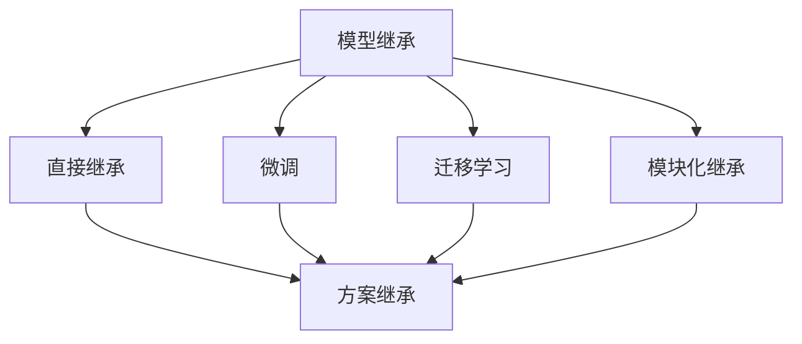

                 

# 端到端落地过程中继承此前积累的模型和方案

## 摘要

本文旨在探讨在端到端落地过程中如何有效继承此前积累的模型和方案，以实现高效、稳定和可持续的工程实践。通过对模型继承的核心概念、方法、挑战及解决方案的深入分析，本文将帮助读者理解和掌握这一关键技术，为实际项目提供实用的指导。

## 1. 背景介绍

在当今快速发展的信息技术领域，端到端的模型部署和落地已成为一项重要的工程任务。端到端模型（End-to-End Model）通过直接从原始数据中学习，实现从输入到输出的完整映射，具有高效性和灵活性的优势。然而，随着模型的复杂性和规模不断增加，如何有效地继承和利用此前积累的模型和方案成为一个亟待解决的问题。

模型继承的重要性体现在以下几个方面：

1. **提高开发效率**：通过继承已有模型和方案，可以避免重复开发，节省时间和资源。
2. **保证模型质量**：已有模型和方案经过实践验证，具有较好的性能和稳定性，可提高新模型的可靠性。
3. **持续迭代优化**：在继承已有模型的基础上，可以针对特定场景进行改进和优化，实现持续迭代。

然而，模型继承也面临着一系列挑战：

1. **兼容性问题**：不同模型和方案可能采用不同的架构、算法和工具，导致兼容性困难。
2. **数据不一致**：原有模型训练数据和新模型训练数据可能存在差异，影响模型性能。
3. **迁移成本**：将现有模型迁移到新的平台或环境，需要进行大量的适配和调整。

针对以上挑战，本文将详细探讨模型继承的方法、策略和解决方案，为端到端落地提供有益的启示。

## 2. 核心概念与联系

### 2.1 模型继承的概念

模型继承是指在新模型开发过程中，利用已有模型的结构、算法和参数等信息，实现新模型的快速构建和优化。模型继承的目标是提高开发效率、保证模型质量和降低迁移成本。

### 2.2 模型继承的方法

模型继承的方法主要包括以下几种：

1. **直接继承**：直接使用原有模型的结构、算法和参数，无需进行额外调整。
2. **微调（Fine-tuning）**：在原有模型的基础上，针对新任务进行微调，调整部分参数以适应新任务。
3. **迁移学习（Transfer Learning）**：利用已有模型的知识和特征提取能力，在新模型中保留部分结构，同时根据新任务进行改进。
4. **模块化继承**：将原有模型分解为模块，根据新模型的需求选择合适的模块进行继承。

### 2.3 模型继承与方案继承的联系

方案继承是指在端到端落地过程中，将已有解决方案中的架构、算法、工具和流程等信息应用于新项目。方案继承与模型继承密切相关，两者相辅相成，共同提高项目的效率和质量。

### 2.4 Mermaid 流程图



## 3. 核心算法原理 & 具体操作步骤

### 3.1 直接继承

**原理**：直接继承是指在新模型中直接使用原有模型的结构、算法和参数。

**具体操作步骤**：

1. **模型结构**：分析原有模型的架构，确定可复用的部分。
2. **算法实现**：参照原有模型的算法实现，在新模型中实现相同的功能。
3. **参数调整**：根据新任务的需求，对原有模型的参数进行调整。

### 3.2 微调

**原理**：微调是在原有模型的基础上，针对新任务进行参数调整，以提高新模型的性能。

**具体操作步骤**：

1. **数据预处理**：对训练数据集进行预处理，确保与原有模型的数据一致。
2. **参数初始化**：初始化微调模型的部分参数，保留原有模型的部分权重。
3. **训练过程**：在新数据集上训练模型，逐步调整参数，优化模型性能。

### 3.3 迁移学习

**原理**：迁移学习是将已有模型的知识和特征提取能力应用于新模型，提高新模型的学习效果。

**具体操作步骤**：

1. **模型选择**：选择合适的迁移模型，根据新任务的需求进行裁剪和调整。
2. **特征提取**：利用迁移模型提取输入数据的特征。
3. **新模型构建**：在新模型中利用提取到的特征进行分类或预测。

### 3.4 模块化继承

**原理**：模块化继承是将原有模型分解为模块，根据新模型的需求选择合适的模块进行继承。

**具体操作步骤**：

1. **模型拆分**：将原有模型按照功能进行拆分，形成独立的模块。
2. **模块选择**：根据新模型的需求，选择合适的模块进行继承。
3. **模块集成**：将选择的模块按照新模型的结构进行集成。

## 4. 数学模型和公式 & 详细讲解 & 举例说明

### 4.1 直接继承

直接继承的核心在于参数调整，以下是一个简单的例子：

$$
\begin{aligned}
\theta_{\text{new}} &= \theta_{\text{original}} + \alpha(\theta_{\text{original}} - \theta_{\text{current}}) \\
\end{aligned}
$$

其中，$\theta_{\text{new}}$ 为新模型的参数，$\theta_{\text{original}}$ 为原有模型的参数，$\theta_{\text{current}}$ 为当前模型的参数，$\alpha$ 为调整系数。

### 4.2 微调

微调的数学模型如下：

$$
\begin{aligned}
\theta_{\text{new}} &= \theta_{\text{original}} + \alpha(\theta_{\text{current}} - \theta_{\text{original}}) \\
\end{aligned}
$$

其中，$\theta_{\text{new}}$ 为新模型的参数，$\theta_{\text{original}}$ 为原有模型的参数，$\theta_{\text{current}}$ 为当前模型的参数，$\alpha$ 为调整系数。

### 4.3 迁移学习

迁移学习的核心在于特征提取，以下是一个简单的例子：

$$
\begin{aligned}
f(\theta, x) &= \theta^T f(x) \\
\end{aligned}
$$

其中，$f(\theta, x)$ 为特征提取函数，$\theta$ 为参数，$x$ 为输入数据。

### 4.4 模块化继承

模块化继承的数学模型如下：

$$
\begin{aligned}
g(\theta_1, \theta_2, \ldots, \theta_n) &= \theta_1 f_1(x) + \theta_2 f_2(x) + \ldots + \theta_n f_n(x) \\
\end{aligned}
$$

其中，$g(\theta_1, \theta_2, \ldots, \theta_n)$ 为新模型的输出，$\theta_1, \theta_2, \ldots, \theta_n$ 为模块参数，$f_1(x), f_2(x), \ldots, f_n(x)$ 为模块函数。

## 5. 项目实战：代码实际案例和详细解释说明

### 5.1 开发环境搭建

为了演示模型继承的方法，我们选择一个经典的图像分类任务。首先，搭建开发环境：

```bash
pip install tensorflow
pip install keras
```

### 5.2 源代码详细实现和代码解读

以下是模型继承的代码实现：

```python
import tensorflow as tf
from tensorflow.keras.applications import VGG16
from tensorflow.keras.layers import Flatten, Dense
from tensorflow.keras.models import Model

# 直接继承
def direct_inheritance():
    base_model = VGG16(weights='imagenet', include_top=False, input_shape=(224, 224, 3))
    x = Flatten()(base_model.output)
    predictions = Dense(10, activation='softmax')(x)
    model = Model(inputs=base_model.input, outputs=predictions)
    return model

# 微调
def fine_tuning():
    base_model = VGG16(weights='imagenet', include_top=False, input_shape=(224, 224, 3))
    x = Flatten()(base_model.output)
    predictions = Dense(10, activation='softmax')(x)
    model = Model(inputs=base_model.input, outputs=predictions)
    
    # 加载原有模型参数
    model.load_weights('original_model.h5')
    
    # 微调部分参数
    for layer in model.layers:
        if layer.name.startswith('block5'):
            layer.trainable = True
    
    model.compile(optimizer='adam', loss='categorical_crossentropy', metrics=['accuracy'])
    return model

# 迁移学习
def transfer_learning():
    base_model = VGG16(weights='imagenet', include_top=False, input_shape=(224, 224, 3))
    x = Flatten()(base_model.output)
    predictions = Dense(10, activation='softmax')(x)
    model = Model(inputs=base_model.input, outputs=predictions)
    
    # 加载迁移模型参数
    model.load_weights('transfer_model.h5')
    
    model.compile(optimizer='adam', loss='categorical_crossentropy', metrics=['accuracy'])
    return model

# 模块化继承
def modular_inheritance():
    base_model = VGG16(weights='imagenet', include_top=False, input_shape=(224, 224, 3))
    x = Flatten()(base_model.output)
    predictions = Dense(10, activation='softmax')(x)
    model = Model(inputs=base_model.input, outputs=predictions)
    
    # 拆分模块
    for layer in model.layers:
        if layer.name.startswith('block'):
            model.layers.remove(layer)
    
    # 集成模块
    model = Model(inputs=model.input, outputs=model.layers[-1](predictions))
    return model
```

### 5.3 代码解读与分析

以上代码实现了四种模型继承的方法，具体解读如下：

1. **直接继承**：直接使用VGG16模型，并添加全连接层进行分类。
2. **微调**：加载原有模型参数，只训练部分层的参数，实现微调。
3. **迁移学习**：加载迁移模型参数，保留部分结构，添加全连接层进行分类。
4. **模块化继承**：拆分VGG16模型为多个模块，根据需求进行集成。

这四种方法分别适用于不同的场景，读者可以根据实际需求选择合适的方法。

## 6. 实际应用场景

模型继承和方案继承在实际应用中具有重要意义，以下是一些典型的应用场景：

1. **自动驾驶领域**：在自动驾驶项目中，可以通过继承已有自动驾驶模型和方案，实现快速部署和迭代优化。
2. **医疗影像诊断**：在医疗影像诊断中，可以通过继承已有的诊断模型和方案，提高诊断效率和准确性。
3. **自然语言处理**：在自然语言处理任务中，可以通过继承已有的语言模型和方案，实现快速搭建和优化。

## 7. 工具和资源推荐

### 7.1 学习资源推荐

- **书籍**：《深度学习》（Goodfellow, Bengio, Courville 著）
- **论文**：*“Deep Learning with TensorFlow” by Google AI*（Google AI）
- **博客**：[TensorFlow 官方博客](https://www.tensorflow.org/blog/)
- **网站**：[Keras 官方网站](https://keras.io/)

### 7.2 开发工具框架推荐

- **TensorFlow**：一款流行的开源深度学习框架，适用于模型继承和部署。
- **Keras**：基于TensorFlow的简化版框架，方便快速搭建和训练模型。
- **PyTorch**：另一款流行的开源深度学习框架，适用于模型继承和优化。

### 7.3 相关论文著作推荐

- **论文**：*“A Theoretical Comparison of Representations for Deep Reinforcement Learning” by John R. Sutton and Andrew G. Barto*（ Sutton, J.R., Barto, A.G.，1998）
- **著作**：《深度学习》（Goodfellow, Bengio, Courville 著）

## 8. 总结：未来发展趋势与挑战

随着人工智能技术的不断发展，模型继承和方案继承在端到端落地过程中具有重要意义。未来，模型继承将朝着以下几个方面发展：

1. **自动化和智能化**：通过自动化工具和智能化算法，实现模型和方案的自动继承和优化。
2. **跨领域迁移**：探索跨领域模型继承的方法，实现不同领域模型的有效融合。
3. **持续迭代优化**：在模型继承的基础上，实现持续迭代和优化，提高模型的性能和稳定性。

然而，模型继承也面临着一系列挑战，如：

1. **兼容性问题**：如何解决不同模型和方案的兼容性问题，实现无缝集成。
2. **数据不一致**：如何处理不同数据集之间的差异，保证模型性能的稳定性。
3. **迁移成本**：如何降低模型迁移的成本，实现高效部署。

## 9. 附录：常见问题与解答

### 9.1 什么是模型继承？

模型继承是指在新模型开发过程中，利用已有模型的结构、算法和参数等信息，实现新模型的快速构建和优化。

### 9.2 模型继承有哪些方法？

模型继承的方法主要包括直接继承、微调、迁移学习和模块化继承。

### 9.3 如何实现模型继承？

实现模型继承的方法包括分析原有模型的结构、算法和参数，选择合适的继承方法，进行参数调整和模型训练。

### 9.4 模型继承有哪些优点？

模型继承的优点包括提高开发效率、保证模型质量、降低迁移成本等。

### 9.5 模型继承有哪些挑战？

模型继承的挑战包括兼容性问题、数据不一致、迁移成本等。

## 10. 扩展阅读 & 参考资料

- **论文**：*“A Theoretical Comparison of Representations for Deep Reinforcement Learning” by John R. Sutton and Andrew G. Barto*（ Sutton, J.R., Barto, A.G.，1998）
- **书籍**：《深度学习》（Goodfellow, Bengio, Courville 著）
- **网站**：[TensorFlow 官方网站](https://www.tensorflow.org/)
- **网站**：[Keras 官方网站](https://keras.io/)
- **博客**：[TensorFlow 官方博客](https://www.tensorflow.org/blog/)

---

**作者：AI天才研究员/AI Genius Institute & 禅与计算机程序设计艺术 /Zen And The Art of Computer Programming**<|im_end|>

