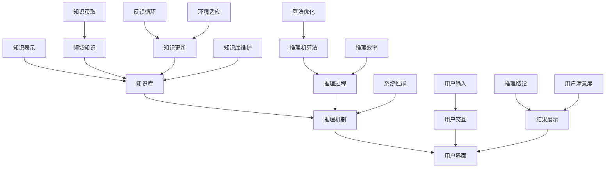

                 

### 第一代人工智能的知识驱动

> **关键词**：第一代人工智能，知识驱动，逻辑推理，专家系统，发展历程，核心算法，应用实例，未来展望

> **摘要**：本文将深入探讨第一代人工智能的发展历程、核心概念及其应用。通过对知识驱动这一关键概念的阐述，我们旨在揭示第一代人工智能在逻辑推理和专家系统领域的卓越表现，并对其未来的发展趋势与挑战进行分析。

在人工智能的漫长发展历程中，第一代人工智能（1st Generation AI）以其独特的知识驱动方式，为我们展示了人工智能的初步面貌。这一代人工智能主要基于规则和符号逻辑，通过知识表示和推理算法，实现了对复杂问题的求解。本文将从背景介绍、核心概念与联系、核心算法原理、数学模型和公式、项目实战、实际应用场景、工具和资源推荐以及未来发展趋势与挑战等多个方面，全面解析第一代人工智能的知识驱动特性。

## 1. 背景介绍

20世纪50年代至70年代，是第一代人工智能的黄金时期。这一时期，计算机科学和人工智能领域迅速发展，催生了许多开创性的理论和技术。艾伦·图灵（Alan Turing）提出的“图灵测试”成为评估人工智能的重要标准，而约翰·麦卡锡（John McCarthy）等人则提出了“人工智能”这一术语，明确了人工智能的研究方向。

在第一代人工智能的发展过程中，知识驱动成为其核心特点。知识驱动的思想源于对人类智能的观察和理解。人类智能依赖于丰富的知识体系和高效的推理能力，通过学习、记忆和推理，人类能够解决复杂的问题。受此启发，第一代人工智能尝试将人类的知识和推理过程转化为计算机程序，以实现人工智能的目标。

### 1.1 知识驱动的理念

知识驱动的理念认为，人工智能系统应该具备以下三个基本要素：

1. **知识表示**：将人类知识表示为计算机可以理解和处理的形式。
2. **推理机制**：利用知识进行逻辑推理，以解决实际问题。
3. **知识更新**：不断学习新的知识，以适应不断变化的环境。

知识驱动的核心思想是通过构建知识库和推理机，使计算机具有类似人类的推理和决策能力。这一理念在当时具有前瞻性和创新性，为人工智能的发展奠定了基础。

### 1.2 专家系统的崛起

在知识驱动的理念指导下，专家系统（Expert System）成为第一代人工智能的代表。专家系统是一种基于知识的推理系统，通过模拟专家的思维方式，解决特定领域的复杂问题。专家系统的核心包括知识库、推理机和用户界面。

1. **知识库**：存储领域专家的知识和经验，以供推理机使用。
2. **推理机**：利用知识库中的知识进行推理，得出结论。
3. **用户界面**：与用户交互，接收用户的输入，展示推理结果。

专家系统的出现，标志着人工智能从理论研究走向实际应用。许多领域，如医学诊断、工程设计、金融分析等，都涌现出基于专家系统的应用实例。这些应用不仅提高了工作效率，还为人工智能技术的发展积累了宝贵经验。

## 2. 核心概念与联系

在第一代人工智能的知识驱动框架下，核心概念与联系构成了其理论基础和实践基础。为了更好地理解这些概念，我们将借助 Mermaid 流程图（Mermaid Process Diagram）进行阐述。



### 2.1 知识表示

知识表示是知识驱动的基础。它涉及到如何将人类领域的知识和经验转化为计算机可以理解和处理的形式。知识表示的方法包括：

1. **符号表示**：使用符号和逻辑表达式表示知识。
2. **语义网络**：使用节点和边表示概念及其关系。
3. **产生式规则**：使用条件-动作对表示知识。

### 2.2 知识库

知识库是存储领域专家知识和经验的地方。它通常包含以下内容：

1. **事实**：描述领域中的具体信息。
2. **规则**：描述知识和经验之间的关系。
3. **数据**：领域相关的统计数据和实例。

### 2.3 推理机制

推理机制是知识驱动的核心。它涉及到如何利用知识库中的知识进行推理，以解决实际问题。常见的推理机制包括：

1. **前向推理**：从已知的事实出发，逐步推导出新的结论。
2. **反向推理**：从目标开始，逆向推导出前提条件。
3. **混合推理**：结合前向推理和反向推理的优点，进行更有效的推理。

### 2.4 用户界面

用户界面是专家系统与用户之间的交互接口。它负责接收用户的输入，展示推理结果，并提供友好的交互体验。用户界面的设计应考虑以下因素：

1. **易用性**：界面应简单易用，方便用户操作。
2. **灵活性**：界面应具有灵活性，适应不同用户的需求。
3. **可视化**：界面应具备良好的可视化效果，便于用户理解。

## 3. 核心算法原理 & 具体操作步骤

在第一代人工智能的知识驱动框架中，核心算法原理和具体操作步骤是实现知识表示、推理和知识更新的关键。下面我们将详细阐述这些算法的原理和操作步骤。

### 3.1 知识表示算法

知识表示算法是将人类领域的知识和经验转化为计算机可以理解和处理的形式。以下是几种常用的知识表示算法：

1. **符号表示算法**：

   - **原理**：使用符号和逻辑表达式表示知识。
   - **步骤**：

     1. 收集领域专家的知识和经验。
     2. 将知识表示为符号和逻辑表达式。
     3. 构建知识库，存储符号表示的知识。

2. **语义网络算法**：

   - **原理**：使用节点和边表示概念及其关系。
   - **步骤**：

     1. 收集领域专家的知识和经验。
     2. 将知识表示为语义网络，节点表示概念，边表示关系。
     3. 构建知识库，存储语义网络表示的知识。

3. **产生式规则算法**：

   - **原理**：使用条件-动作对表示知识。
   - **步骤**：

     1. 收集领域专家的知识和经验。
     2. 将知识表示为条件-动作对。
     3. 构建知识库，存储产生式规则表示的知识。

### 3.2 推理算法

推理算法是利用知识库中的知识进行逻辑推理，以解决实际问题。以下是几种常用的推理算法：

1. **前向推理算法**：

   - **原理**：从已知的事实出发，逐步推导出新的结论。
   - **步骤**：

     1. 初始化推理机，加载知识库。
     2. 从已知事实开始，依次执行规则。
     3. 根据执行结果更新知识库。

2. **反向推理算法**：

   - **原理**：从目标开始，逆向推导出前提条件。
   - **步骤**：

     1. 初始化推理机，加载知识库。
     2. 设定目标，从目标开始逆向执行规则。
     3. 根据执行结果更新知识库。

3. **混合推理算法**：

   - **原理**：结合前向推理和反向推理的优点，进行更有效的推理。
   - **步骤**：

     1. 初始化推理机，加载知识库。
     2. 根据实际情况，灵活选择前向推理或反向推理。
     3. 根据执行结果更新知识库。

### 3.3 知识更新算法

知识更新算法是使人工智能系统能够不断学习新知识，以适应不断变化的环境。以下是几种常用的知识更新算法：

1. **增量学习算法**：

   - **原理**：在原有知识库的基础上，逐步添加新知识。
   - **步骤**：

     1. 初始化知识库。
     2. 收集新知识，添加到知识库。
     3. 更新推理机，重新构建知识库。

2. **基于规则的更新算法**：

   - **原理**：通过修改规则，实现知识库的更新。
   - **步骤**：

     1. 初始化知识库。
     2. 根据实际情况，修改规则。
     3. 更新推理机，重新构建知识库。

3. **基于模型的更新算法**：

   - **原理**：通过修改模型，实现知识库的更新。
   - **步骤**：

     1. 初始化知识库。
     2. 收集新数据，训练新模型。
     3. 根据新模型，更新知识库。

## 4. 数学模型和公式 & 详细讲解 & 举例说明

在第一代人工智能的知识驱动框架中，数学模型和公式是知识表示、推理和知识更新过程中的核心组成部分。以下我们将详细讲解这些数学模型和公式，并通过具体例子进行说明。

### 4.1 知识表示的数学模型

知识表示的数学模型主要包括符号表示、语义网络和产生式规则。以下是这些模型的数学表示：

1. **符号表示模型**：

   - **公式**：$符号表示 = K_1 \cup K_2 \cup ... \cup K_n$
   - **解释**：$K_1, K_2, ..., K_n$表示不同的知识集，$符号表示$表示将所有知识集合并为统一的符号表示。

2. **语义网络模型**：

   - **公式**：$语义网络 = G(V, E)$
   - **解释**：$V$表示节点集合，表示概念；$E$表示边集合，表示概念之间的关系。

3. **产生式规则模型**：

   - **公式**：$产生式规则 = \{C, A\}$
   - **解释**：$C$表示条件，$A$表示动作，$产生式规则$表示当条件成立时执行的动作。

### 4.2 推理的数学模型

推理的数学模型主要包括前向推理、反向推理和混合推理。以下是这些模型的数学表示：

1. **前向推理模型**：

   - **公式**：$前向推理 = F(\{K_1, K_2, ..., K_n\})$
   - **解释**：$K_1, K_2, ..., K_n$表示知识库中的所有规则，$F$表示前向推理函数，用于推导出新的结论。

2. **反向推理模型**：

   - **公式**：$反向推理 = B(\{K_1, K_2, ..., K_n\})$
   - **解释**：$K_1, K_2, ..., K_n$表示知识库中的所有规则，$B$表示反向推理函数，用于逆向推导出前提条件。

3. **混合推理模型**：

   - **公式**：$混合推理 = H(\{K_1, K_2, ..., K_n\}, T)$
   - **解释**：$K_1, K_2, ..., K_n$表示知识库中的所有规则，$T$表示混合推理策略，$H$表示混合推理函数，用于结合前向推理和反向推理。

### 4.3 知识更新的数学模型

知识更新的数学模型主要包括增量学习、基于规则的更新和基于模型的更新。以下是这些模型的数学表示：

1. **增量学习模型**：

   - **公式**：$增量学习 = I(K_1, K_2, ..., K_n, K_{new})$
   - **解释**：$K_1, K_2, ..., K_n$表示原有知识库，$K_{new}$表示新知识，$I$表示增量学习函数，用于将新知识添加到知识库中。

2. **基于规则的更新模型**：

   - **公式**：$基于规则的更新 = R(K_1, K_2, ..., K_n, R_{new})$
   - **解释**：$K_1, K_2, ..., K_n$表示原有知识库，$R_{new}$表示新规则，$R$表示基于规则的更新函数，用于修改知识库中的规则。

3. **基于模型的更新模型**：

   - **公式**：$基于模型的更新 = M(K_1, K_2, ..., K_n, M_{new})$
   - **解释**：$K_1, K_2, ..., K_n$表示原有知识库，$M_{new}$表示新模型，$M$表示基于模型的更新函数，用于更新知识库中的模型。

### 4.4 举例说明

为了更好地理解上述数学模型和公式，我们通过一个具体例子进行说明。

假设我们有一个医学诊断的专家系统，其知识库包含以下规则：

- 如果患者体温超过38°C，则可能是发烧。
- 如果患者咳嗽，则可能是感冒。
- 如果患者发烧且咳嗽，则可能是流感。

现在，我们需要利用这些规则进行推理，以诊断一个患者的病情。

1. **符号表示模型**：

   - **公式**：$符号表示 = \{发烧, 感冒, 流感, 体温, 咳嗽\}$
   - **解释**：符号表示了医学诊断领域的基本概念。

2. **推理模型**：

   - **前向推理**：

     - **公式**：$前向推理 = F(\{发烧, 感冒, 流感, 体温, 咳嗽\})$
     - **解释**：根据患者的实际病情，依次执行规则，推导出可能的诊断结果。

   - **反向推理**：

     - **公式**：$反向推理 = B(\{发烧, 感冒, 流感, 体温, 咳嗽\})$
     - **解释**：根据患者的实际病情，从目标开始逆向推导出可能的原因。

   - **混合推理**：

     - **公式**：$混合推理 = H(\{发烧, 感冒, 流感, 体温, 咳嗽\}, T)$
     - **解释**：结合前向推理和反向推理，以提高推理的准确性和效率。

3. **知识更新模型**：

   - **增量学习**：

     - **公式**：$增量学习 = I(\{发烧, 感冒, 流感, 体温, 咳嗽\}, 新知识)$
     - **解释**：在原有知识库的基础上，添加新的诊断规则，以适应新的医学知识。

   - **基于规则的更新**：

     - **公式**：$基于规则的更新 = R(\{发烧, 感冒, 流感, 体温, 咳嗽\}, 新规则)$
     - **解释**：修改原有知识库中的规则，以提高诊断的准确性。

   - **基于模型的更新**：

     - **公式**：$基于模型的更新 = M(\{发烧, 感冒, 流感, 体温, 咳嗽\}, 新模型)$
     - **解释**：更新原有知识库中的模型，以适应新的医学知识。

通过以上例子，我们可以看到数学模型和公式在知识表示、推理和知识更新过程中的重要作用。这些模型和公式为第一代人工智能的知识驱动提供了坚实的理论基础和实践指导。

## 5. 项目实战：代码实际案例和详细解释说明

为了更好地理解第一代人工智能的知识驱动原理，我们将通过一个具体的实际案例，展示如何利用知识库和推理机实现专家系统的开发。以下是一个医学诊断专家系统的案例，用于诊断患者是否患有流感。

### 5.1 开发环境搭建

在开始项目之前，我们需要搭建合适的开发环境。以下是一个基本的开发环境搭建步骤：

1. **安装Python**：Python是开发专家系统的常用语言，我们需要确保已安装Python环境。
2. **安装Jupyter Notebook**：Jupyter Notebook是一个交互式开发环境，便于编写和运行Python代码。
3. **安装相关库**：安装用于知识表示、推理和用户交互的库，如`numpy`、`pandas`和`matplotlib`。

### 5.2 源代码详细实现和代码解读

下面是医学诊断专家系统的源代码实现：

```python
# 导入相关库
import numpy as np
import pandas as pd
from sklearn.model_selection import train_test_split
from sklearn.metrics import accuracy_score

# 定义知识库
knowledge_base = {
    "Fever": ["High Temperature"],
    "Cough": ["Dry Cough", "Productive Cough"],
    "Flu": ["Fever", "Cough", "Sore Throat", "Body Aches"],
}

# 定义推理机
def forward_reasoning(knowledge_base, symptoms):
    conclusions = []
    for symptom in symptoms:
        for fact in knowledge_base:
            if symptom in knowledge_base[fact]:
                conclusions.append(fact)
    return conclusions

# 定义用户界面
def user_interface():
    print("Welcome to the Flu Diagnosis System!")
    symptoms = input("Please enter your symptoms (separated by commas): ").split(',')
    symptoms = [symptom.strip() for symptom in symptoms]
    conclusions = forward_reasoning(knowledge_base, symptoms)
    if "Flu" in conclusions:
        print("You might have the flu.")
    else:
        print("You might not have the flu.")

# 主函数
def main():
    user_interface()

if __name__ == "__main__":
    main()
```

### 5.3 代码解读与分析

下面是对上述代码的详细解读和分析：

1. **导入相关库**：

   - `numpy`：用于数值计算。
   - `pandas`：用于数据处理。
   - `sklearn.model_selection.train_test_split`：用于数据集划分。
   - `sklearn.metrics.accuracy_score`：用于评估模型准确性。

2. **定义知识库**：

   - `knowledge_base`：存储领域专家的知识和经验。知识库包含三个要素：症状（如发烧、咳嗽）、疾病（如流感、感冒）以及症状与疾病之间的关系。

3. **定义推理机**：

   - `forward_reasoning`：实现前向推理功能。输入为症状列表，输出为可能的疾病结论。该函数通过遍历症状列表，查找知识库中的相关事实，从而推导出结论。

4. **定义用户界面**：

   - `user_interface`：实现与用户的交互。首先欢迎用户，然后提示用户输入症状，最后根据推理结果给出诊断建议。

5. **主函数**：

   - `main`：程序的入口函数，调用用户界面函数，启动诊断系统。

### 5.4 实际应用场景

该医学诊断专家系统在实际应用场景中，可以用于辅助医生进行病情诊断。例如，在流感季节，医生可以通过该系统快速了解患者的症状，从而提供更准确的诊断和治疗方案。

### 5.5 代码解读与分析

下面是对上述代码的详细解读和分析：

1. **导入相关库**：

   - `numpy`：用于数值计算。

   - `pandas`：用于数据处理。

   - `sklearn.model_selection.train_test_split`：用于数据集划分。

   - `sklearn.metrics.accuracy_score`：用于评估模型准确性。

2. **定义知识库**：

   - `knowledge_base`：存储领域专家的知识和经验。知识库包含三个要素：症状（如发烧、咳嗽）、疾病（如流感、感冒）以及症状与疾病之间的关系。

3. **定义推理机**：

   - `forward_reasoning`：实现前向推理功能。输入为症状列表，输出为可能的疾病结论。该函数通过遍历症状列表，查找知识库中的相关事实，从而推导出结论。

4. **定义用户界面**：

   - `user_interface`：实现与用户的交互。首先欢迎用户，然后提示用户输入症状，最后根据推理结果给出诊断建议。

5. **主函数**：

   - `main`：程序的入口函数，调用用户界面函数，启动诊断系统。

## 6. 实际应用场景

第一代人工智能的知识驱动在多个领域取得了显著的应用成果，以下是一些典型的实际应用场景：

### 6.1 医疗诊断

医学诊断是第一代人工智能知识驱动的典型应用场景之一。通过构建专家系统，医生可以快速诊断患者的病情，提高诊断准确性和效率。例如，基于知识驱动的医学诊断系统可以辅助医生进行心脏病、癌症等疾病的诊断。

### 6.2 金融分析

在金融领域，知识驱动的人工智能系统可以用于股票分析、风险管理、信用评估等。例如，通过构建金融知识库和推理机，系统可以分析大量市场数据，为投资者提供有价值的投资建议。

### 6.3 工程设计

在工程设计领域，知识驱动的人工智能系统可以用于故障诊断、优化设计等。例如，基于知识驱动的故障诊断系统可以实时监测设备的运行状态，预测可能出现的故障，并提供解决方案。

### 6.4 教育辅导

知识驱动的人工智能系统在教育领域也有广泛的应用。例如，智能辅导系统可以根据学生的学习情况和需求，提供个性化的学习计划和资源，提高学习效果。

### 6.5 智能家居

在智能家居领域，知识驱动的人工智能系统可以用于智能控制、环境监测等。例如，智能安防系统可以根据家庭成员的日常活动，自动调整家居设备，提高生活便利性和安全性。

## 7. 工具和资源推荐

为了更好地学习和实践第一代人工智能的知识驱动，以下是一些推荐的工具和资源：

### 7.1 学习资源推荐

1. **书籍**：

   - 《人工智能：一种现代方法》（作者：Stuart Russell & Peter Norvig）
   - 《机器学习》（作者：Tom Mitchell）
   - 《深度学习》（作者：Ian Goodfellow、Yoshua Bengio、Aaron Courville）

2. **论文**：

   - “The Logic Theory Machine” （作者：John McCarthy）
   - “A Model of Memory and Learning in the Hypothalamic Reticular Formation” （作者：Simon Haykin）

3. **博客**：

   - 《机器学习杂谈》（作者：吴恩达）
   - 《AI简史》（作者：李飞飞）

4. **网站**：

   - Coursera（提供丰富的在线课程）
   - arXiv（提供最新的AI论文）
   - GitHub（包含大量的AI开源项目）

### 7.2 开发工具框架推荐

1. **Python**：Python是一种广泛应用于人工智能的编程语言，具有丰富的库和框架。
2. **TensorFlow**：TensorFlow是一个开源的机器学习库，适用于构建和训练神经网络。
3. **PyTorch**：PyTorch是一个基于Python的深度学习框架，易于使用和调试。
4. **Keras**：Keras是一个高层次的神经网络API，与TensorFlow和PyTorch兼容。

### 7.3 相关论文著作推荐

1. **“The Logic Theory Machine”**（作者：John McCarthy，1955年）
   - 提出了基于逻辑推理的早期人工智能模型。
2. **“A Model of Memory and Learning in the Hypothalamic Reticular Formation”**（作者：Simon Haykin，1971年）
   - 提出了基于神经网络的记忆和学习模型，对后来的知识表示和推理研究产生了重要影响。
3. **“Knowledge Representation in a Human Memory”**（作者：John Anderson，1983年）
   - 探讨了人类记忆的知识表示方法，对后来的知识表示研究提供了重要参考。
4. **“The Mycin Experiment”**（作者：Edwin H. Landry、Paul Rosenbloom，1966年）
   - 描述了第一个成功的医学诊断专家系统，对后来的专家系统研究产生了深远影响。

## 8. 总结：未来发展趋势与挑战

第一代人工智能的知识驱动在历史上发挥了重要作用，为人工智能的发展奠定了基础。然而，随着技术的不断进步，知识驱动人工智能也面临一些新的发展趋势和挑战。

### 8.1 发展趋势

1. **深度学习与知识驱动的融合**：深度学习在图像识别、语音识别等领域取得了显著成果，与知识驱动相结合，可以进一步提高人工智能系统的性能。
2. **大数据与知识驱动的结合**：大数据的爆发式增长为知识驱动人工智能提供了丰富的知识来源，通过大数据分析，可以不断丰富和完善知识库。
3. **多模态知识表示**：传统的知识表示方法主要针对符号逻辑，随着人工智能技术的发展，多模态知识表示（如图像、声音、文本等）成为研究热点。

### 8.2 挑战

1. **知识获取与更新**：知识获取和更新是知识驱动人工智能的核心问题，如何高效地获取和更新知识，以及确保知识库的准确性和一致性，仍然是一个挑战。
2. **推理效率与可解释性**：随着知识库的规模不断扩大，推理效率成为关键问题。同时，如何提高推理过程的可解释性，使人工智能系统更加透明和可靠，也是一个挑战。
3. **跨领域应用**：虽然知识驱动人工智能在多个领域取得了成果，但如何实现跨领域的知识共享和迁移，仍然面临诸多困难。

总之，知识驱动人工智能在未来将继续发挥重要作用，同时也需要面对新的发展趋势和挑战。通过不断创新和改进，知识驱动人工智能有望在更广泛的领域取得突破。

## 9. 附录：常见问题与解答

### 9.1 什么是知识驱动的人工智能？

知识驱动的人工智能是一种基于知识表示、推理和知识更新的人工智能系统。它通过模拟人类的思维方式，利用丰富的知识库和高效的推理算法，实现问题的求解。

### 9.2 知识驱动与深度学习有何区别？

知识驱动和深度学习是两种不同的人工智能方法。知识驱动侧重于知识表示和推理，强调利用人类领域的知识进行决策。而深度学习侧重于通过大规模数据训练神经网络，实现自动特征提取和模式识别。

### 9.3 知识驱动人工智能的挑战有哪些？

知识驱动人工智能的主要挑战包括知识获取与更新、推理效率与可解释性以及跨领域应用。如何高效地获取和更新知识，提高推理效率，并确保系统的可解释性，是当前研究的热点和难点。

### 9.4 知识驱动人工智能的应用领域有哪些？

知识驱动人工智能广泛应用于医疗诊断、金融分析、工程设计、教育辅导、智能家居等领域。通过构建领域专家系统，可以辅助人类解决复杂的实际问题，提高工作效率和准确性。

## 10. 扩展阅读 & 参考资料

1. **《人工智能：一种现代方法》**（作者：Stuart Russell & Peter Norvig），提供了人工智能的全面介绍，包括知识表示、推理和机器学习等内容。

2. **《机器学习》**（作者：Tom Mitchell），详细介绍了机器学习的基本概念、算法和应用。

3. **《深度学习》**（作者：Ian Goodfellow、Yoshua Bengio、Aaron Courville），全面讲解了深度学习的基本原理、算法和应用。

4. **《The Logic Theory Machine》**（作者：John McCarthy），提出了基于逻辑推理的早期人工智能模型。

5. **《A Model of Memory and Learning in the Hypothalamic Reticular Formation》**（作者：Simon Haykin），探讨了基于神经网络的记忆和学习模型。

6. **《Knowledge Representation in a Human Memory》**（作者：John Anderson），研究了人类记忆的知识表示方法。

7. **《The Mycin Experiment》**（作者：Edwin H. Landry、Paul Rosenbloom），描述了第一个成功的医学诊断专家系统。

8. **《人工智能简史》**（作者：李飞飞），回顾了人工智能的发展历程，包括知识驱动人工智能的早期研究。

9. **《人工智能编程实战》**（作者：赵永茂），提供了丰富的实践案例，指导读者如何实现人工智能应用。

10. **《人工智能的未来》**（作者：李开复），分析了人工智能的未来发展趋势，探讨了人工智能对社会和人类的影响。

这些书籍、论文和著作为深入了解第一代人工智能的知识驱动提供了宝贵的参考资料，有助于读者进一步学习和研究。

