                 

### 背景介绍

#### 人工智能时代的兴起

随着科技的迅猛发展，人工智能（AI）已经成为当今社会的重要驱动力。从早期的专家系统到深度学习、强化学习等前沿技术，AI在各个领域都展现出了强大的影响力。无论是在医疗、金融、交通、制造业，还是在日常生活，AI的应用场景日益广泛，给人类生活带来了前所未有的便利和变革。

#### 技术与生活息息相关

人工智能技术已经深刻地渗透到了我们的日常生活中。从智能家居设备、语音助手、智能穿戴设备，到自动驾驶汽车、智能客服、在线教育平台，AI的应用使得我们的生活更加智能化和个性化。此外，随着大数据、云计算、物联网等技术的不断发展，AI的应用潜力将更加巨大，为人类社会的发展带来更多可能性。

#### 第一性原理的重要性

在人工智能领域，第一性原理（First Principles）是一种重要的思考方法。第一性原理强调从最基本的原理出发，通过逻辑推理和实验验证来推导出复杂系统的行为和特性。这种方法有助于我们深入理解问题的本质，从而设计出更加高效和可靠的解决方案。

本文将探讨第一性原理在人工智能领域中的应用，通过提出假说、周密观察、细致实验和总结归纳，深入分析核心概念、算法原理、数学模型、项目实战等，帮助读者更好地理解和掌握人工智能技术。

本文结构如下：

1. 背景介绍：阐述人工智能时代背景以及第一性原理的重要性。
2. 核心概念与联系：介绍人工智能的核心概念，并通过 Mermaid 流程图展示相关原理和架构。
3. 核心算法原理与具体操作步骤：详细讲解人工智能的核心算法原理，并提供具体操作步骤。
4. 数学模型和公式：介绍人工智能领域常用的数学模型和公式，并进行详细讲解和举例说明。
5. 项目实战：通过实际案例展示人工智能技术的应用，提供详细的代码实现和解读。
6. 实际应用场景：探讨人工智能在不同领域的应用场景，分析其优势和挑战。
7. 工具和资源推荐：推荐相关的学习资源、开发工具和论文著作。
8. 总结：展望人工智能的未来发展趋势和面临的挑战。
9. 附录：解答常见问题，提供扩展阅读和参考资料。

接下来，我们将深入探讨第一性原理在人工智能领域的应用，帮助读者更好地理解和掌握这一重要技术。## 1.1. 什么是第一性原理

第一性原理（First Principles）是一种哲学思考和解决问题的方法，最早由古希腊哲学家亚里士多德提出。亚里士多德认为，事物的本质是由一系列基本原理和规则构成的，通过不断追溯这些基本原理，我们可以理解事物的本质。

在科学和工程领域，第一性原理被广泛应用于解决问题和设计系统。它强调从最基本的原理出发，通过逻辑推理和实验验证来推导出复杂系统的行为和特性。这种方法有助于我们深入理解问题的本质，从而设计出更加高效和可靠的解决方案。

第一性原理在人工智能领域具有重要应用价值。人工智能涉及众多复杂的技术和概念，包括机器学习、深度学习、神经网络等。通过第一性原理，我们可以将复杂的问题分解为最基本的组成部分，从而更好地理解和掌握人工智能技术的本质。

具体来说，第一性原理在人工智能领域的应用包括以下几个方面：

1. **理解基本原理**：通过追溯人工智能技术的起源和发展，理解其基本原理和核心概念，如感知、推理、学习等。
2. **设计系统架构**：基于第一性原理，我们可以设计出更加合理和高效的人工智能系统架构，如神经网络、深度学习模型等。
3. **推导算法原理**：通过第一性原理，我们可以推导出各种人工智能算法的原理和数学模型，如梯度下降、反向传播等。
4. **优化算法性能**：利用第一性原理，我们可以对现有的人工智能算法进行优化，提高其性能和鲁棒性。
5. **解决实际问题**：通过第一性原理，我们可以更好地理解和解决实际的人工智能问题，如图像识别、自然语言处理等。

总之，第一性原理是一种重要的思考和解决问题的方法，在人工智能领域具有广泛的应用价值。通过第一性原理，我们可以深入理解人工智能技术的本质，从而更好地设计、优化和应用人工智能系统。## 1.2. 人工智能的核心概念

在探讨第一性原理在人工智能（AI）中的应用之前，我们需要先了解人工智能的核心概念。人工智能涉及众多技术和方法，但以下几个核心概念是理解其本质的基础。

#### 1.2.1. 感知（Perception）

感知是指人工智能系统对环境中的信息进行识别和理解的过程。在感知过程中，AI系统需要通过传感器、图像、声音、文本等多种形式获取信息，并将其转换为可处理的数据。感知是人工智能系统获取外部信息的重要途径，是后续推理和学习的基础。

#### 1.2.2. 推理（Reasoning）

推理是指人工智能系统基于感知到的信息进行逻辑推理和决策的过程。通过推理，AI系统能够对复杂问题进行求解，并做出合理决策。推理过程通常包括归纳推理、演绎推理和类比推理等。

#### 1.2.3. 学习（Learning）

学习是指人工智能系统通过数据训练，提高自身性能和知识积累的过程。学习可以分为有监督学习、无监督学习和强化学习等类型。有监督学习通过标注数据来训练模型，无监督学习则通过未标注的数据来发现模式，强化学习则通过奖励机制来引导模型学习。

#### 1.2.4. 知识表示（Knowledge Representation）

知识表示是指将人类知识或数据以计算机可处理的形式进行表示和存储。知识表示的方法包括符号表示、语义网络、知识图谱等。知识表示是人工智能系统进行推理、学习和决策的重要基础。

#### 1.2.5. 自适应（Adaptation）

自适应是指人工智能系统能够根据环境变化和反馈调整自身行为和性能。自适应能力是人工智能系统适应动态环境、实现智能行为的关键。

#### 1.2.6. 交互（Interaction）

交互是指人工智能系统与人类或其他系统进行交互的过程。通过交互，AI系统能够更好地理解人类需求、提供个性化服务，并不断优化自身性能。

#### 1.2.7. 安全性（Safety）

安全性是指人工智能系统在运行过程中对自身、人类和环境的安全保障。安全性是人工智能发展的重要挑战之一，需要从系统设计、算法优化和法律法规等方面进行综合考虑。

#### 1.2.8. 伦理（Ethics）

伦理是指人工智能系统在应用过程中需要遵循的道德原则和价值观。伦理问题涉及隐私、公平、透明等方面，对人工智能的发展和应用具有重要影响。

#### 1.2.9. 智能层次（Intelligence Level）

智能层次是指人工智能系统的智能水平，可以分为弱AI、强AI和超智能等。弱AI是指专注于特定任务的智能系统，强AI是指具备全面人类智能的智能系统，超智能则是指超越人类智能的智能系统。

#### 1.2.10. 模式识别（Pattern Recognition）

模式识别是指人工智能系统通过学习数据中的模式，实现对未知数据的分类、预测和识别。模式识别是图像识别、语音识别、自然语言处理等领域的基础。

通过了解这些核心概念，我们可以更好地理解人工智能的技术原理和应用场景，从而更有效地运用第一性原理来设计和优化人工智能系统。接下来，我们将通过 Mermaid 流程图展示这些核心概念之间的联系，进一步阐述人工智能的整体架构。## 1.3. 人工智能的整体架构

为了更好地理解人工智能（AI）的核心概念，我们通过 Mermaid 流程图展示它们之间的联系，从而描绘出人工智能的整体架构。

```mermaid
graph TD
    A[感知] --> B[知识表示]
    A --> C[推理]
    A --> D[学习]
    B --> E[知识表示]
    B --> F[推理]
    B --> G[学习]
    C --> H[知识表示]
    C --> I[学习]
    C --> J[交互]
    D --> K[知识表示]
    D --> L[推理]
    D --> M[交互]
    E --> N[知识表示]
    E --> O[推理]
    E --> P[学习]
    F --> Q[知识表示]
    F --> R[学习]
    F --> S[交互]
    G --> T[知识表示]
    G --> U[推理]
    G --> V[学习]
    H --> W[知识表示]
    H --> X[推理]
    H --> Y[学习]
    I --> Z[知识表示]
    I --> AA[推理]
    I --> BB[学习]
    J --> CC[交互]
    K --> DD[知识表示]
    K --> EE[推理]
    K --> FF[学习]
    L --> GG[知识表示]
    L --> HH[推理]
    L --> II[学习]
    M --> JJ[知识表示]
    M --> KK[推理]
    M --> LL[学习]
    N --> MM[知识表示]
    N --> NN[推理]
    N --> OO[学习]
    O --> PP[知识表示]
    O --> QQ[推理]
    O --> RR[学习]
    P --> SS[知识表示]
    P --> TT[推理]
    P --> UU[学习]
    Q --> VV[知识表示]
    Q --> WW[推理]
    Q --> XX[学习]
    R --> YY[知识表示]
    R --> ZZ[推理]
    R --> AAA[学习]
    S --> BBB[知识表示]
    S --> CCC[推理]
    S --> DDD[学习]
    T --> EEE[知识表示]
    T --> FFF[推理]
    T --> GGG[学习]
    U --> HHH[知识表示]
    U --> III[推理]
    U --> JJJ[学习]
    V --> KKK[知识表示]
    V --> LLL[推理]
    V --> MMM[学习]
    W --> NNN[知识表示]
    W --> OOO[推理]
    W --> PPP[学习]
    X --> QQQ[知识表示]
    X --> RRR[推理]
    X --> SSS[学习]
    Y --> TTT[知识表示]
    Y --> UUU[推理]
    Y --> VVV[学习]
    Z --> WWW[知识表示]
    Z --> XXX[推理]
    Z --> YYY[学习]
    AA --> ZZZ[知识表示]
    AA --> AAA[推理]
    AA --> BBB[学习]
    BB --> CCC[知识表示]
    BB --> DDD[推理]
    BB --> EEE[学习]
    CC --> FFF[知识表示]
    CC --> GGG[推理]
    CC --> HHH[学习]
    DD --> III[知识表示]
    DD --> JJJ[推理]
    DD --> KKK[学习]
    EE --> LLL[知识表示]
    EE --> MMM[推理]
    EE --> NNN[学习]
    FF --> OOO[知识表示]
    FF --> PPP[推理]
    FF --> QQQ[学习]
    GG --> RRR[知识表示]
    GG --> SSS[推理]
    GG --> TTT[学习]
    HH --> UUU[知识表示]
    HH --> VVV[推理]
    HH --> WWW[学习]
    II --> XXX[知识表示]
    II --> YYY[推理]
    II --> ZZZ[学习]
    JJ --> AAA[知识表示]
    JJ --> BBB[推理]
    JJ --> CCC[学习]
    KK --> DDD[知识表示]
    KK --> EEE[推理]
    KK --> FFF[学习]
    LL --> GGG[知识表示]
    LL --> HHH[推理]
    LL --> III[学习]
    MM --> JJJ[知识表示]
    MM --> KKK[推理]
    MM --> LLL[学习]
    NN --> MMM[知识表示]
    NN --> NNN[推理]
    NN --> OOO[学习]
    OO --> PPP[知识表示]
    OO --> QQQ[推理]
    OO --> RRR[学习]
    PP --> SSS[知识表示]
    PP --> TTT[推理]
    PP --> UUU[学习]
    QQ --> VVV[知识表示]
    QQ --> WWW[推理]
    QQ --> XXX[学习]
    RR --> YYY[知识表示]
    RR --> ZZZ[推理]
    RR --> AAA[学习]
    SS --> BBB[知识表示]
    SS --> CCC[推理]
    SS --> DDD[学习]
    TT --> EEE[知识表示]
    TT --> FFF[推理]
    TT --> GGG[学习]
    UU --> HHH[知识表示]
    UU --> III[推理]
    UU --> JJJ[学习]
    VV --> KKK[知识表示]
    VV --> LLL[推理]
    VV --> MMM[学习]
    WWW --> NNN[知识表示]
    WWW --> OOO[推理]
    WWW --> PPP[学习]
    XXX --> XXX[知识表示]
    XXX --> YYY[推理]
    XXX --> ZZZ[学习]
    YYY --> AAA[知识表示]
    YYY --> BBB[推理]
    YYY --> CCC[学习]
    ZZZ --> DDD[知识表示]
    ZZZ --> EEE[推理]
    ZZZ --> FFF[学习]
```



该流程图展示了人工智能的核心概念及其之间的联系，包括感知、知识表示、推理、学习、交互等。通过这个流程图，我们可以更清晰地理解人工智能的整体架构，为进一步探讨第一性原理在人工智能中的应用奠定基础。## 2. 核心算法原理 & 具体操作步骤

在了解了人工智能（AI）的核心概念和整体架构之后，我们将深入探讨其核心算法原理和具体操作步骤。这些算法构成了AI系统的基石，使其能够实现感知、推理、学习和交互等功能。下面，我们将介绍几种重要的AI算法，并详细说明其原理和操作步骤。

### 2.1. 机器学习算法

机器学习（Machine Learning）是人工智能的核心技术之一，它使得计算机系统能够通过数据学习并做出决策。以下是几种常见的机器学习算法：

#### 2.1.1. 线性回归（Linear Regression）

线性回归是一种用于预测数值结果的算法。其基本原理是通过最小化误差平方和来找到最佳拟合直线。

**操作步骤**：

1. **数据预处理**：清洗数据，处理缺失值和异常值。
2. **特征选择**：选择与预测目标相关的特征。
3. **模型训练**：使用最小二乘法找到最佳拟合直线。
4. **模型评估**：通过交叉验证和测试集评估模型性能。

$$
y = wx + b
$$

其中，$y$ 是预测目标，$x$ 是特征，$w$ 是权重，$b$ 是偏置。

#### 2.1.2. 支持向量机（Support Vector Machine, SVM）

支持向量机是一种用于分类的算法，其基本原理是通过找到最优的超平面将不同类别的数据分隔开。

**操作步骤**：

1. **数据预处理**：同线性回归。
2. **特征选择**：同线性回归。
3. **模型训练**：通过求解最优化问题找到支持向量。
4. **模型评估**：使用测试集评估模型性能。

$$
\min \frac{1}{2} ||w||^2 + C \sum_{i=1}^{n} \max(0, 1 - y_i (w \cdot x_i + b))
$$

其中，$w$ 是权重向量，$b$ 是偏置，$C$ 是惩罚参数。

#### 2.1.3. 随机森林（Random Forest）

随机森林是一种基于决策树的集成学习算法，其基本原理是通过构建多个决策树并取其预测结果的平均值来提高预测准确性。

**操作步骤**：

1. **数据预处理**：同线性回归。
2. **特征选择**：同线性回归。
3. **模型训练**：为每个决策树训练一个模型。
4. **模型评估**：通过投票机制确定最终预测结果。

### 2.2. 深度学习算法

深度学习（Deep Learning）是机器学习的一个重要分支，通过构建多层的神经网络来模拟人类大脑的思考过程。

#### 2.2.1. 卷积神经网络（Convolutional Neural Network, CNN）

卷积神经网络是一种用于图像识别和处理的深度学习算法，其基本原理是通过卷积操作提取图像特征。

**操作步骤**：

1. **数据预处理**：归一化图像数据。
2. **网络构建**：设计并构建CNN模型。
3. **模型训练**：使用反向传播算法训练模型。
4. **模型评估**：使用测试集评估模型性能。

$$
\text{ConvLayer}(x) = \text{relu}(\text{Conv}(x, W) + b)
$$

其中，$x$ 是输入数据，$W$ 是卷积核权重，$b$ 是偏置。

#### 2.2.2. 递归神经网络（Recurrent Neural Network, RNN）

递归神经网络是一种用于序列数据处理的深度学习算法，其基本原理是通过递归结构来处理序列中的依赖关系。

**操作步骤**：

1. **数据预处理**：归一化序列数据。
2. **网络构建**：设计并构建RNN模型。
3. **模型训练**：使用反向传播算法训练模型。
4. **模型评估**：使用测试集评估模型性能。

$$
h_t = \text{sigmoid}(W_h \cdot [h_{t-1}, x_t] + b_h)
$$

其中，$h_t$ 是第$t$个时间步的隐藏状态，$W_h$ 是权重矩阵，$b_h$ 是偏置。

#### 2.2.3. 生成对抗网络（Generative Adversarial Network, GAN）

生成对抗网络是一种用于生成数据和学习数据分布的深度学习算法，其基本原理是通过两个对抗网络的博弈来生成数据。

**操作步骤**：

1. **数据预处理**：归一化数据。
2. **网络构建**：设计并构建GAN模型。
3. **模型训练**：通过训练对抗网络生成数据。
4. **模型评估**：使用生成数据和真实数据进行对比。

$$
\text{Generator}(z) = G(z)
$$

$$
\text{Discriminator}(x) = D(x)
$$

其中，$z$ 是生成器的输入噪声，$G(z)$ 是生成器生成的数据，$D(x)$ 是判别器对真实数据和生成数据的判断。

通过以上算法，我们可以实现各种人工智能任务。接下来，我们将介绍人工智能领域常用的数学模型和公式，并对其进行详细讲解和举例说明。这将有助于我们更好地理解这些算法的工作原理和优化方法。## 4. 数学模型和公式 & 详细讲解 & 举例说明

在人工智能（AI）领域，数学模型和公式是构建和理解算法的核心。这些模型和公式为AI系统提供了计算和推理的基础。下面，我们将详细介绍一些常用的数学模型和公式，并进行详细讲解和举例说明。

### 4.1. 线性代数基础

线性代数是人工智能的核心数学工具之一。以下是一些基本的线性代数概念和公式：

#### 4.1.1. 向量和矩阵

向量（Vector）和矩阵（Matrix）是线性代数中的基本数据结构。向量是具有多个元素的有序集合，矩阵是具有行和列的二维数组。

**向量加法**：

$$
\vec{a} + \vec{b} = \begin{bmatrix}
a_1 + b_1 \\
a_2 + b_2 \\
\vdots \\
a_n + b_n
\end{bmatrix}
$$

**矩阵乘法**：

$$
\mathbf{A} \cdot \mathbf{B} = \begin{bmatrix}
a_{11}b_{11} + a_{12}b_{21} + \cdots + a_{1n}b_{n1} \\
a_{21}b_{11} + a_{22}b_{21} + \cdots + a_{2n}b_{n1} \\
\vdots \\
a_{m1}b_{11} + a_{m2}b_{21} + \cdots + a_{mn}b_{n1}
\end{bmatrix}
$$

**矩阵转置**：

$$
\mathbf{A}^T = \begin{bmatrix}
a_{11} & a_{21} & \cdots & a_{m1} \\
a_{12} & a_{22} & \cdots & a_{m2} \\
\vdots & \vdots & \ddots & \vdots \\
a_{1n} & a_{2n} & \cdots & a_{mn}
\end{bmatrix}
$$

#### 4.1.2. 矩阵求逆

矩阵求逆是解决线性方程组的重要工具。给定一个方阵$\mathbf{A}$，其逆矩阵$\mathbf{A}^{-1}$满足：

$$
\mathbf{A} \mathbf{A}^{-1} = \mathbf{I}
$$

其中，$\mathbf{I}$ 是单位矩阵。

**求逆公式**：

$$
\mathbf{A}^{-1} = (\det(\mathbf{A}))^{-1} \cdot \text{adj}(\mathbf{A})
$$

其中，$\det(\mathbf{A})$ 是$\mathbf{A}$ 的行列式，$\text{adj}(\mathbf{A})$ 是$\mathbf{A}$ 的伴随矩阵。

### 4.2. 概率论基础

概率论是人工智能的另一重要数学工具，用于处理不确定性和随机性。

#### 4.2.1. 概率分布

概率分布描述了随机变量的可能取值及其概率。以下是一些常见的概率分布：

**伯努利分布**：

$$
P(X = k) = C_n^k p^k (1-p)^{n-k}
$$

其中，$n$ 是试验次数，$p$ 是每次试验成功的概率，$k$ 是成功的次数。

**正态分布**：

$$
f(x|\mu, \sigma^2) = \frac{1}{\sqrt{2\pi\sigma^2}} e^{-\frac{(x-\mu)^2}{2\sigma^2}}
$$

其中，$\mu$ 是均值，$\sigma^2$ 是方差。

#### 4.2.2. 条件概率

条件概率描述了在某个事件发生的条件下，另一个事件发生的概率。

$$
P(A|B) = \frac{P(A \cap B)}{P(B)}
$$

### 4.3. 梯度下降法

梯度下降法是优化机器学习模型的重要算法，用于最小化损失函数。

#### 4.3.1. 梯度定义

给定一个函数$f(\mathbf{w})$，其梯度$\nabla f(\mathbf{w})$是一个向量，表示函数在当前参数$\mathbf{w}$处的斜率。

$$
\nabla f(\mathbf{w}) = \left( \frac{\partial f}{\partial w_1}, \frac{\partial f}{\partial w_2}, \ldots, \frac{\partial f}{\partial w_n} \right)
$$

#### 4.3.2. 梯度下降公式

梯度下降法通过以下公式更新参数：

$$
\mathbf{w}_{t+1} = \mathbf{w}_t - \alpha \nabla f(\mathbf{w}_t)
$$

其中，$\alpha$ 是学习率，$t$ 是迭代次数。

### 4.4. 举例说明

#### 4.4.1. 线性回归

假设我们要预测房价，使用线性回归模型：

$$
y = \beta_0 + \beta_1 x
$$

**例子**：

给定训练数据集$\{(x_1, y_1), (x_2, y_2), \ldots, (x_n, y_n)\}$，我们使用梯度下降法来求解$\beta_0$和$\beta_1$。

$$
\beta_0 = \frac{1}{n} \sum_{i=1}^{n} y_i - \beta_1 \frac{1}{n} \sum_{i=1}^{n} x_i
$$

$$
\beta_1 = \frac{1}{n} \sum_{i=1}^{n} (x_i - \bar{x})(y_i - \bar{y})
$$

其中，$\bar{x}$ 和 $\bar{y}$ 分别是$x$和$y$的平均值。

#### 4.4.2. 逻辑回归

逻辑回归是一种用于分类的模型，其损失函数为对数损失函数：

$$
J(\mathbf{w}) = -\frac{1}{m} \sum_{i=1}^{m} y_i \log(\hat{y}_i) + (1 - y_i) \log(1 - \hat{y}_i)
$$

其中，$\hat{y}_i = \sigma(z_i)$，$z_i = \mathbf{w}^T \mathbf{x}_i$，$\sigma$ 是 sigmoid 函数。

使用梯度下降法来优化参数$\mathbf{w}$：

$$
\frac{\partial J}{\partial w_j} = \frac{1}{m} \sum_{i=1}^{m} (\hat{y}_i - y_i) x_{ij}
$$

#### 4.4.3. 卷积神经网络（CNN）

在CNN中，卷积操作是核心。给定一个输入矩阵$\mathbf{X}$和一个卷积核$\mathbf{K}$，卷积操作的输出$\mathbf{Y}$为：

$$
Y_{ij} = \sum_{k=1}^{k} X_{i+k,j} K_{ik,j}
$$

**例子**：

假设$\mathbf{X}$是一个$5 \times 5$的矩阵，$\mathbf{K}$是一个$3 \times 3$的卷积核。计算$\mathbf{Y}$：

$$
\mathbf{Y} = \begin{bmatrix}
X_{1,1}K_{1,1} + X_{1,2}K_{1,2} + X_{1,3}K_{1,3} + X_{2,1}K_{2,1} + X_{2,2}K_{2,2} + X_{2,3}K_{2,3} + X_{3,1}K_{3,1} + X_{3,2}K_{3,2} + X_{3,3}K_{3,3} \\
X_{2,1}K_{1,1} + X_{2,2}K_{1,2} + X_{2,3}K_{1,3} + X_{3,1}K_{2,1} + X_{3,2}K_{2,2} + X_{3,3}K_{2,3} + X_{4,1}K_{3,1} + X_{4,2}K_{3,2} + X_{4,3}K_{3,3} \\
\vdots \\
X_{3,3}K_{1,1} + X_{4,3}K_{1,2} + X_{5,3}K_{1,3} + X_{4,3}K_{2,1} + X_{5,3}K_{2,2} + X_{6,3}K_{2,3} + X_{5,3}K_{3,1} + X_{6,3}K_{3,2} + X_{7,3}K_{3,3}
\end{bmatrix}
$$

通过这些数学模型和公式，我们可以更好地理解和应用人工智能算法，解决实际问题。在接下来的部分，我们将通过实际项目实战，展示这些算法的应用。## 5. 项目实战：代码实际案例和详细解释说明

在前文中，我们介绍了人工智能（AI）的核心概念、算法原理以及相关的数学模型。为了更好地理解这些理论在实际项目中的应用，我们将通过一个具体的案例来展示如何实现一个简单的AI项目。本案例将使用Python编程语言，结合机器学习库scikit-learn来实现一个基于线性回归的房价预测模型。

### 5.1. 开发环境搭建

在进行项目实战之前，我们需要搭建一个合适的开发环境。以下是搭建Python开发环境所需的基本步骤：

1. **安装Python**：从Python官网（https://www.python.org/downloads/）下载并安装Python 3.x版本。
2. **配置Python环境变量**：确保Python安装路径被添加到系统环境变量中，以便在任何命令提示符或终端中运行Python。
3. **安装Anaconda**：Anaconda是一个集成了Python和相关依赖项的科学计算平台。从Anaconda官网（https://www.anaconda.com/products/individual）下载并安装Anaconda，它将自动配置Python环境。
4. **安装scikit-learn**：在命令行中运行以下命令安装scikit-learn库：

   ```
   conda install scikit-learn
   ```

   或者使用pip安装：

   ```
   pip install scikit-learn
   ```

### 5.2. 源代码详细实现和代码解读

以下是实现房价预测模型的基本代码，我们将对关键部分进行详细解释。

```python
import numpy as np
import pandas as pd
from sklearn.model_selection import train_test_split
from sklearn.linear_model import LinearRegression
from sklearn.metrics import mean_squared_error

# 5.2.1. 数据预处理
# 加载数据集
data = pd.read_csv('house_prices.csv')

# 特征选择
X = data[['bedrooms', 'bathrooms', 'square_feet']]
y = data['price']

# 分割训练集和测试集
X_train, X_test, y_train, y_test = train_test_split(X, y, test_size=0.2, random_state=42)

# 5.2.2. 模型训练
# 创建线性回归模型实例
model = LinearRegression()

# 使用训练数据训练模型
model.fit(X_train, y_train)

# 5.2.3. 模型评估
# 使用测试数据评估模型
y_pred = model.predict(X_test)

# 计算均方误差
mse = mean_squared_error(y_test, y_pred)
print(f'Mean Squared Error: {mse}')

# 5.2.4. 预测新数据
# 输入新的房屋特征
new_data = np.array([[3, 2, 1200]])

# 预测房价
predicted_price = model.predict(new_data)
print(f'Predicted Price: {predicted_price[0]}')
```

#### 5.2.1. 数据预处理

在项目实战的第一步，我们首先需要加载数据集。在本案例中，我们使用一个CSV文件存储房屋价格数据。通过pandas库，我们可以轻松加载数据并对其进行预处理。

```python
data = pd.read_csv('house_prices.csv')
```

接下来，我们需要选择用于训练模型的特征。在本案例中，我们选择了卧室数量、浴室数量和房屋面积作为特征。

```python
X = data[['bedrooms', 'bathrooms', 'square_feet']]
y = data['price']
```

为了评估模型的性能，我们需要将数据集分为训练集和测试集。这里，我们使用scikit-learn库中的`train_test_split`函数来随机划分数据。

```python
X_train, X_test, y_train, y_test = train_test_split(X, y, test_size=0.2, random_state=42)
```

#### 5.2.2. 模型训练

在训练模型部分，我们首先创建一个线性回归模型实例。然后，使用训练数据集调用`fit`方法来训练模型。

```python
model = LinearRegression()
model.fit(X_train, y_train)
```

#### 5.2.3. 模型评估

训练完成后，我们需要使用测试数据集来评估模型的性能。这里，我们使用`predict`方法生成预测值，并计算均方误差（MSE）来衡量模型的预测误差。

```python
y_pred = model.predict(X_test)
mse = mean_squared_error(y_test, y_pred)
print(f'Mean Squared Error: {mse}')
```

#### 5.2.4. 预测新数据

最后，我们展示如何使用训练好的模型来预测新的数据。这里，我们输入了一个新的房屋特征数组，并使用模型进行预测。

```python
new_data = np.array([[3, 2, 1200]])
predicted_price = model.predict(new_data)
print(f'Predicted Price: {predicted_price[0]}')
```

### 5.3. 代码解读与分析

在上述代码中，我们首先进行了数据预处理，包括加载数据、选择特征、划分训练集和测试集。这些步骤是构建任何机器学习模型的基础，因为数据的质量直接影响模型的性能。

在模型训练部分，我们创建了一个线性回归模型实例，并使用训练数据集进行训练。线性回归模型是一种简单的预测模型，通过拟合数据点来确定特征与目标变量之间的关系。

在模型评估部分，我们使用测试数据集来评估模型的性能。通过计算均方误差（MSE），我们可以量化模型预测的准确性。MSE越低，模型的预测越准确。

最后，我们展示了如何使用训练好的模型来预测新的数据。这个功能使得模型具有实际应用价值，因为它可以对新数据提供预测。

总之，通过这个项目实战，我们不仅实现了线性回归模型的基本构建和训练，还学习了如何进行数据预处理、模型评估和预测。这些步骤为我们在实际项目中应用机器学习技术奠定了基础。## 6. 实际应用场景

人工智能（AI）在现实世界中有着广泛的应用，涵盖了许多不同的领域。以下是一些典型的AI应用场景，以及它们的优点和挑战。

### 6.1. 医疗

在医疗领域，AI技术被用于疾病诊断、药物研发和患者护理等方面。AI系统可以通过分析大量的医疗数据，如病历、影像和基因组数据，提供更准确的诊断和治疗方案。此外，AI还可以帮助识别疾病的早期症状，从而提高治疗效果。

**优点**：

- 提高诊断的准确性和效率。
- 帮助医生识别复杂的医学模式。
- 自动化一些重复性任务，减轻医生的工作负担。

**挑战**：

- 数据隐私和安全问题。
- 需要大量高质量的医疗数据。
- AI模型的解释性不足，难以向医生和患者解释诊断结果。

### 6.2. 金融

AI技术在金融领域被用于风险控制、信用评分、投资策略和客户服务等方面。AI系统可以通过分析历史数据和实时市场信息，提供更精确的预测和决策支持。

**优点**：

- 提高风险管理的准确性和效率。
- 帮助金融机构发现欺诈行为。
- 提供个性化的投资建议和客户服务。

**挑战**：

- 数据质量和完整性问题。
- AI模型的透明性和可解释性不足。
- 法律法规和合规性问题。

### 6.3. 制造业

在制造业中，AI技术被用于生产优化、质量控制和设备维护等方面。通过监测设备和生产线的状态，AI系统可以预测潜在的问题并采取预防措施，从而提高生产效率和产品质量。

**优点**：

- 提高生产效率和产品质量。
- 减少设备故障和停机时间。
- 提供实时监测和预测分析。

**挑战**：

- 需要大量的数据来训练AI模型。
- AI系统的可靠性和鲁棒性。
- 设备维护和更新成本。

### 6.4. 交通运输

AI技术在交通运输领域被用于自动驾驶、交通流量预测和智能调度等方面。自动驾驶技术有望在未来减少交通事故、提高交通效率。

**优点**：

- 提高交通安全和效率。
- 减少交通拥堵和碳排放。
- 提供个性化的出行体验。

**挑战**：

- 安全性和可靠性问题。
- 法律法规和道德问题。
- 高昂的开发和维护成本。

### 6.5. 教育

在教育领域，AI技术被用于个性化学习、学习分析和教育评估等方面。AI系统可以根据学生的学习习惯和进度提供个性化的学习资源，帮助学生更好地掌握知识。

**优点**：

- 提高学习效率和个人化。
- 帮助教师更好地了解学生的学习情况。
- 自动化一些教学和管理任务。

**挑战**：

- 需要大量的数据来训练AI模型。
- 教育资源的公平性和可及性。
- AI系统对人类教师角色的替代。

通过这些实际应用场景，我们可以看到AI技术在不同领域的潜力和挑战。随着AI技术的不断进步，我们有望看到更多创新和突破，为人类社会带来更多的便利和进步。## 7. 工具和资源推荐

为了更好地学习和实践人工智能（AI）技术，以下是一些推荐的工具、资源以及相关的书籍、论文和博客。

### 7.1. 学习资源推荐

**书籍**：

1. **《深度学习》（Deep Learning）** - Ian Goodfellow、Yoshua Bengio和Aaron Courville
2. **《Python机器学习》（Python Machine Learning）** - Sebastian Raschka和Vahid Mirjalili
3. **《机器学习实战》（Machine Learning in Action）** - Peter Harrington
4. **《机器学习》（Machine Learning）** - Tom M. Mitchell

**论文**：

1. **“A Theoretically Grounded Application of Dropout in Recurrent Neural Networks”** - Yarin Gal和Zoubin Ghahramani
2. **“ResNet: Training Deep Neural Networks for Visual Recognition”** - Kaiming He、Xiangyu Zhang、Shaoqing Ren和Jian Sun
3. **“Distributed Representations of Words and Phrases and Their Compositional Properties”** - Tomas Mikolov、Kyunghyun Cho和Yoshua Bengio

**博客**：

1. **Medium上的AI博客** - https://towardsai.net/
2. **Google Research Blog** - https://research.googleblog.com/
3. **AI Hub** - https://aihub.ai/

### 7.2. 开发工具框架推荐

**框架**：

1. **TensorFlow** - Google开发的开源机器学习框架，广泛用于深度学习和强化学习。
2. **PyTorch** - Facebook开发的开源机器学习库，以其灵活性和动态计算图而受到青睐。
3. **Keras** - 高级神经网络API，可以运行在TensorFlow和Theano之上，提供了易于使用的接口。
4. **Scikit-learn** - 用于数据挖掘和数据分析的科学计算库，提供了各种经典的机器学习算法。

**工具**：

1. **Jupyter Notebook** - 交互式计算环境，适用于编写和分享代码、文档和可视化。
2. **Google Colab** - Google提供的免费Jupyter Notebook平台，特别适用于AI和深度学习项目的协作。
3. **Docker** - 容器化平台，用于创建、运行和分发应用程序，有助于管理和部署AI模型。
4. **GitHub** - 版本控制系统和代码托管平台，适用于团队协作和代码管理。

### 7.3. 相关论文著作推荐

**书籍**：

1. **《人工智能：一种现代方法》（Artificial Intelligence: A Modern Approach）** - Stuart J. Russell和Peter Norvig
2. **《深度学习导论》（An Introduction to Deep Learning）** - Prof. Andrew Ng
3. **《机器学习年度回顾2019》** - 吴恩达等

**论文**：

1. **“Attention Is All You Need”** - Vaswani et al.
2. **“The Unsupervised Learning of Visual Representations by a Deep Neural Network”** - Krizhevsky et al.
3. **“EfficientDet: Scalable and Efficient Object Detection”** - Bochkovskiy et al.

通过上述推荐的资源，读者可以更全面地了解人工智能领域的前沿技术和理论，为学习实践打下坚实的基础。## 8. 总结：未来发展趋势与挑战

随着人工智能技术的不断发展，其应用范围和影响力也在不断扩大。在未来，人工智能有望在更多领域发挥重要作用，带来前所未有的变革。然而，这一过程中也面临着诸多挑战。

### 发展趋势

1. **技术的不断进化**：人工智能技术将继续向深度学习、强化学习等方向演进，算法的准确性和效率将得到进一步提升。
2. **跨领域的应用**：人工智能将在医疗、金融、教育、交通等更多领域得到广泛应用，推动产业升级和创新发展。
3. **个性化与智能化**：人工智能将更好地满足个性化需求，实现更加智能化的服务，提升人类生活质量。
4. **边缘计算与物联网**：人工智能将与边缘计算、物联网等新兴技术相结合，实现更高效的实时数据处理和智能决策。

### 挑战

1. **数据隐私和安全**：随着人工智能的广泛应用，数据隐私和安全问题将愈发突出，需要建立完善的法律法规和隐私保护机制。
2. **模型解释性**：当前许多人工智能模型缺乏解释性，无法清楚地解释其决策过程，这可能导致信任危机和伦理问题。
3. **资源消耗**：训练复杂的人工智能模型需要大量的计算资源和能源，这对环境造成了一定的压力。
4. **就业影响**：人工智能技术的广泛应用可能导致部分工作岗位的消失，需要政府和社会各界共同努力应对就业挑战。
5. **伦理问题**：人工智能的决策过程可能涉及伦理问题，如歧视、偏见等，需要制定相应的伦理规范和标准。

总之，人工智能技术在未来具有巨大的发展潜力，但同时也面临着诸多挑战。我们需要不断探索和创新，以实现人工智能的可持续发展，为人类社会带来更多福祉。## 9. 附录：常见问题与解答

在阅读本文过程中，您可能对一些概念、技术和方法有所疑问。以下是本文中提到的一些常见问题及解答。

### 9.1. 什么是第一性原理？

第一性原理是一种哲学思考和解决问题的方法，最早由古希腊哲学家亚里士多德提出。它强调从最基本的原理出发，通过逻辑推理和实验验证来推导出复杂系统的行为和特性。在人工智能领域，第一性原理有助于我们深入理解问题的本质，从而设计出更加高效和可靠的解决方案。

### 9.2. 人工智能的核心算法有哪些？

人工智能的核心算法包括机器学习算法和深度学习算法。常见的机器学习算法有线性回归、支持向量机、随机森林等；深度学习算法有卷积神经网络（CNN）、递归神经网络（RNN）、生成对抗网络（GAN）等。

### 9.3. 梯度下降法是什么？

梯度下降法是一种用于优化机器学习模型参数的算法。它通过计算目标函数的梯度，更新模型参数，以最小化目标函数的值。梯度下降法分为批量梯度下降、随机梯度下降和迷你批量梯度下降等变体。

### 9.4. 如何处理缺失数据？

处理缺失数据的方法包括删除缺失值、填充缺失值和预测缺失值。删除缺失值适用于缺失数据较多的情况；填充缺失值可以采用均值、中值、众数等方法；预测缺失值可以使用机器学习算法，如k近邻算法、决策树等。

### 9.5. 如何评估机器学习模型的性能？

评估机器学习模型性能的方法包括准确率、召回率、F1值、ROC曲线和AUC值等。根据具体应用场景，选择合适的评估指标来评估模型的性能。

### 9.6. 人工智能应用中的伦理问题有哪些？

人工智能应用中的伦理问题包括数据隐私、算法歧视、模型解释性、自动化决策的道德责任等。为了解决这些问题，需要建立相应的法律法规和伦理规范，确保人工智能技术的可持续发展。

### 9.7. 如何学习人工智能？

学习人工智能可以从以下几个方面入手：

1. **基础知识**：掌握线性代数、概率论、微积分等数学基础。
2. **编程技能**：学习Python、R等编程语言，熟练使用Jupyter Notebook等工具。
3. **算法原理**：学习机器学习、深度学习等算法原理。
4. **实践经验**：通过项目实战，积累实际应用经验。
5. **持续学习**：关注人工智能领域的最新研究进展，参加相关的学术会议和研讨会。

通过以上方法，可以逐步掌握人工智能技术，为未来的研究和应用打下坚实基础。## 10. 扩展阅读 & 参考资料

为了进一步深入研究人工智能（AI）领域的第一性原理及其应用，以下是相关的扩展阅读和参考资料，涵盖了书籍、学术论文、博客和技术文档等。

### 10.1. 书籍

1. **《第一性原理：从零开始构建复杂系统》** - Shane Parrish
2. **《人工智能：一种现代方法》** - Stuart J. Russell 和 Peter Norvig
3. **《深度学习》** - Ian Goodfellow、Yoshua Bengio 和 Aaron Courville
4. **《Python机器学习》** - Sebastian Raschka 和 Vahid Mirjalili
5. **《机器学习年度回顾》** - 吴恩达等

### 10.2. 论文

1. **“First Principles” - Wikipedia
2. **“On the Path to Artificial General Intelligence”** - Nick Bostrom
3. **“Deep Learning for Speech Recognition”** - Yann LeCun、Yoshua Bengio 和 Geoffrey Hinton
4. **“Attention Is All You Need”** - Vaswani et al.
5. **“Generative Adversarial Nets”** - Ian Goodfellow et al.

### 10.3. 博客

1. **AI Hub** - https://aihub.ai/
2. **Google Research Blog** - https://research.googleblog.com/
3. **Medium上的AI博客** - https://towardsai.net/

### 10.4. 技术文档

1. **TensorFlow官方文档** - https://www.tensorflow.org/
2. **PyTorch官方文档** - https://pytorch.org/
3. **Scikit-learn官方文档** - https://scikit-learn.org/stable/
4. **Keras官方文档** - https://keras.io/

通过这些扩展阅读和参考资料，您可以深入了解人工智能领域的第一性原理、核心算法和应用场景，为您的学习和研究提供有力支持。## 作者信息

作者：AI天才研究员/AI Genius Institute & 禅与计算机程序设计艺术 /Zen And The Art of Computer Programming

