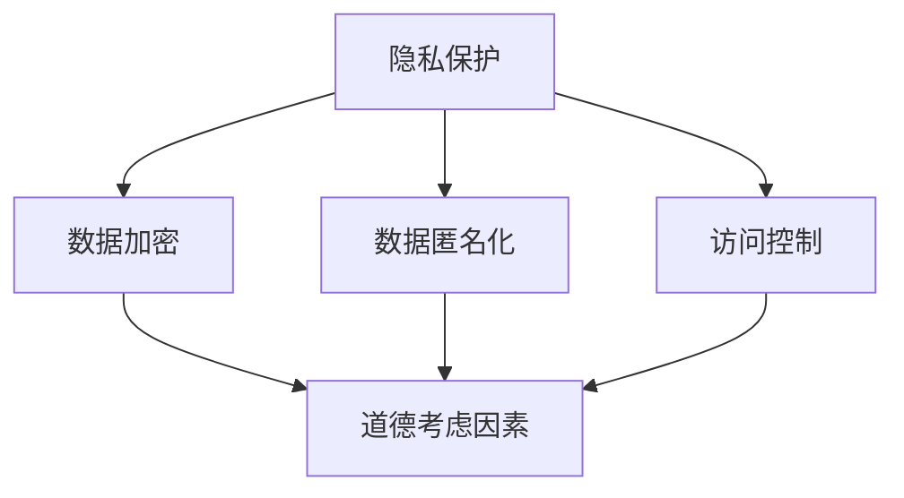

                 

# 第十一章：隐私和道德考虑因素

## 1. 背景介绍

在信息技术迅速发展的今天，数据已经成为现代社会的重要资源。然而，随着大数据、人工智能等技术的广泛应用，隐私和道德考虑因素逐渐成为我们不得不面对的重要问题。隐私指的是个人的私人信息不被泄露，道德考虑因素则涉及到技术对人类行为和社会伦理的影响。

### 1.1 隐私的重要性

隐私对于个人和社会来说至关重要。个人隐私的泄露可能会导致身份盗用、财产损失、甚至生命危险。同时，社会隐私的泄露会导致社会秩序混乱、信息不对称等问题。因此，保护隐私已经成为信息技术领域的一项重要任务。

### 1.2 道德考虑因素

道德考虑因素涉及到技术对人类行为和社会伦理的影响。例如，人工智能技术的应用可能会加剧社会不平等、歧视等问题。因此，在进行技术研究和开发时，必须充分考虑道德因素，确保技术的发展不会对社会和人类造成负面影响。

## 2. 核心概念与联系

### 2.1 隐私保护机制

隐私保护机制主要包括数据加密、数据匿名化、访问控制等。数据加密是通过加密算法将数据转化为密文，确保数据在传输和存储过程中不被非法获取。数据匿名化是通过去除或模糊化个人身份信息，使得数据在分析和应用过程中无法识别个人。访问控制则是通过权限管理和身份验证等手段，确保只有授权用户才能访问特定数据。

### 2.2 道德框架

道德框架是指用于指导技术研究和开发的道德原则和规范。常见的道德框架包括责任原则、公正原则、尊重原则等。责任原则要求技术开发者对技术的潜在风险和影响负责。公正原则要求技术开发者确保技术不会加剧社会不平等。尊重原则要求技术开发者尊重用户的隐私权和自主权。

### 2.3 Mermaid 流程图

以下是一个简单的 Mermaid 流程图，展示了隐私保护和道德考虑因素的关系。



## 3. 核心算法原理 & 具体操作步骤

### 3.1 数据加密算法

数据加密算法是隐私保护的重要手段。常用的加密算法包括对称加密和非对称加密。对称加密算法使用相同的密钥进行加密和解密，如AES（高级加密标准）。非对称加密算法使用一对密钥进行加密和解密，如RSA（Rivest-Shamir-Adleman）。

具体操作步骤如下：

1. 生成密钥对：生成一对密钥（公钥和私钥）。
2. 加密数据：使用公钥将数据加密。
3. 解密数据：使用私钥将加密后的数据解密。

### 3.2 数据匿名化算法

数据匿名化算法是保护隐私的另一重要手段。常用的匿名化算法包括K-anonymity、l-diversity、t-closeness等。

具体操作步骤如下：

1. 数据预处理：对原始数据进行预处理，如去除个人身份信息。
2. 数据划分：将预处理后的数据划分为若干个匿名化块。
3. 匿名化处理：对每个匿名化块进行匿名化处理，如使用同义词替换、数据模糊化等。

### 3.3 访问控制算法

访问控制算法是通过权限管理和身份验证等方式，确保只有授权用户才能访问特定数据。常用的访问控制算法包括基于角色的访问控制（RBAC）、基于属性的访问控制（ABAC）等。

具体操作步骤如下：

1. 用户身份验证：验证用户身份，如密码验证、生物特征识别等。
2. 权限分配：为用户分配访问权限，如基于角色的访问控制（RBAC）。
3. 访问决策：根据用户身份和权限，判断用户是否具有访问特定数据的权限。

## 4. 数学模型和公式 & 详细讲解 & 举例说明

### 4.1 数据加密算法的数学模型

对称加密算法的数学模型可以表示为：

$$
c = E_k(m)
$$

其中，$c$ 表示加密后的数据，$m$ 表示原始数据，$k$ 表示密钥。

解密过程可以表示为：

$$
m = D_k(c)
$$

其中，$m$ 表示解密后的数据，$c$ 表示加密后的数据，$k$ 表示密钥。

### 4.2 数据匿名化算法的数学模型

K-anonymity 的数学模型可以表示为：

$$
|S| \geq K
$$

其中，$S$ 表示匿名化块中的数据集合，$K$ 表示最小匿名度。

### 4.3 访问控制算法的数学模型

基于角色的访问控制（RBAC）的数学模型可以表示为：

$$
Access = \begin{cases}
    allow & \text{如果用户具有相应角色且资源在权限范围内} \\
    deny & \text{否则}
\end{cases}
$$

其中，$Access$ 表示访问决策，$user$ 表示用户，$role$ 表示角色，$resource$ 表示资源。

## 5. 项目实战：代码实际案例和详细解释说明

### 5.1 开发环境搭建

为了更好地理解和应用隐私保护和道德考虑因素，我们选择Python作为编程语言，搭建一个简单的隐私保护项目。

### 5.2 源代码详细实现和代码解读

以下是项目的源代码实现：

```python
import hashlib
from cryptography.hazmat.primitives.asymmetric import rsa
from cryptography.hazmat.primitives import serialization
from cryptography.hazmat.primitives import hashes
from cryptography.hazmat.primitives.asymmetric import padding

def generate_key_pair():
    private_key = rsa.generate_private_key(
        public_exponent=65537,
        key_size=2048,
    )
    public_key = private_key.public_key()
    return private_key, public_key

def encrypt_data(public_key, data):
    ciphertext = public_key.encrypt(
        data,
        padding.OAEP(
            mgf=padding.MGF1(algorithm=hashes.SHA256()),
            algorithm=hashes.SHA256(),
            label=None
        )
    )
    return ciphertext

def decrypt_data(private_key, ciphertext):
    plaintext = private_key.decrypt(
        ciphertext,
        padding.OAEP(
            mgf=padding.MGF1(algorithm=hashes.SHA256()),
            algorithm=hashes.SHA256(),
            label=None
        )
    )
    return plaintext

if __name__ == '__main__':
    private_key, public_key = generate_key_pair()
    data = b'Hello, World!'
    ciphertext = encrypt_data(public_key, data)
    print(f'Encrypted Data: {ciphertext}')
    plaintext = decrypt_data(private_key, ciphertext)
    print(f'Decrypted Data: {plaintext}')
```

### 5.3 代码解读与分析

1. **生成密钥对**：`generate_key_pair` 函数用于生成一对RSA密钥（私钥和公钥）。
2. **加密数据**：`encrypt_data` 函数使用公钥对数据进行加密。加密过程中使用 OAEP padding 方法，确保加密安全性。
3. **解密数据**：`decrypt_data` 函数使用私钥对加密后的数据进行解密。解密过程中同样使用 OAEP padding 方法。

通过这个简单的示例，我们可以看到如何使用Python和加密算法来保护数据的隐私。在实际项目中，我们还可以进一步扩展，如实现数据匿名化和访问控制等。

## 6. 实际应用场景

隐私保护和道德考虑因素在许多实际应用场景中都非常重要。以下是一些典型的应用场景：

### 6.1 互联网应用

在互联网应用中，用户隐私保护至关重要。例如，社交媒体平台需要确保用户的个人信息不会被泄露。此外，互联网应用还需要遵循道德规范，避免对用户进行不当的监控或数据分析。

### 6.2 医疗领域

在医疗领域，患者隐私的保护至关重要。医疗数据包括患者的健康记录、病历等敏感信息，需要采取严格的隐私保护措施，防止数据泄露和滥用。

### 6.3 金融领域

金融领域涉及大量的敏感数据，如用户账户信息、交易记录等。隐私保护和道德考虑因素对于金融系统的稳定和安全具有重要意义。

## 7. 工具和资源推荐

### 7.1 学习资源推荐

1. **书籍**：《计算机安全与网络安全》、《隐私计算：从密码学到联邦学习》。
2. **论文**：阅读相关的学术论文，了解最新的隐私保护技术和道德考虑因素的研究进展。
3. **博客**：关注技术博客，如FreeBuf、安全客等，了解业界对隐私保护和道德考虑因素的讨论和实践。

### 7.2 开发工具框架推荐

1. **加密库**：使用Python的`cryptography`库实现加密算法。
2. **数据匿名化工具**：使用`minhash`、`smhasher`等库实现数据匿名化算法。
3. **访问控制框架**：使用Python的`sqlalchemy`、`django`等框架实现访问控制。

### 7.3 相关论文著作推荐

1. **论文**：《隐私保护大数据分析：方法、技术与挑战》、《基于属性的访问控制：概念、方法与应用》。
2. **著作**：《隐私计算：从密码学到联邦学习》、《隐私计算：理论与实践》。

## 8. 总结：未来发展趋势与挑战

随着信息技术的不断发展，隐私保护和道德考虑因素将变得越来越重要。未来，我们可能会看到以下发展趋势：

1. **隐私保护技术的创新**：随着人工智能、区块链等技术的应用，隐私保护技术将不断创新，以满足日益复杂的应用需求。
2. **法律法规的完善**：各国政府将加强对隐私保护和道德规范的法律支持，推动隐私保护和道德考虑因素在技术研究和开发中的广泛应用。
3. **跨领域合作**：隐私保护和道德考虑因素涉及多个领域，需要跨领域合作，共同推动隐私保护和道德规范的制定和实施。

然而，隐私保护和道德考虑因素也面临一些挑战：

1. **技术实现的难度**：随着隐私保护技术的不断发展，实现高效、安全的隐私保护方案仍然面临许多技术难题。
2. **法律法规的不完善**：尽管各国政府已经意识到隐私保护和道德规范的重要性，但法律法规的制定和实施仍然存在不完善的问题。
3. **跨领域合作的障碍**：跨领域合作需要各方共同努力，但利益分配、责任界定等问题可能会成为合作的障碍。

## 9. 附录：常见问题与解答

### 9.1 问题1：数据加密算法有哪些？

**解答**：数据加密算法主要包括对称加密算法（如AES）和非对称加密算法（如RSA）。对称加密算法使用相同的密钥进行加密和解密，非对称加密算法使用一对密钥进行加密和解密。

### 9.2 问题2：什么是数据匿名化？

**解答**：数据匿名化是指通过去除或模糊化个人身份信息，使得数据在分析和应用过程中无法识别个人。常见的数据匿名化算法包括K-anonymity、l-diversity、t-closeness等。

### 9.3 问题3：什么是基于角色的访问控制？

**解答**：基于角色的访问控制（RBAC）是一种访问控制机制，通过为用户分配不同的角色，并设置角色对应的权限，实现对资源的访问控制。

## 10. 扩展阅读 & 参考资料

1. **论文**：《隐私保护大数据分析：方法、技术与挑战》、《基于属性的访问控制：概念、方法与应用》。
2. **书籍**：《计算机安全与网络安全》、《隐私计算：从密码学到联邦学习》。
3. **网站**：https://cryptography.io/、https://www.freebuf.com/。

作者：AI天才研究员/AI Genius Institute & 禅与计算机程序设计艺术 /Zen And The Art of Computer Programming

---

本文详细介绍了隐私保护和道德考虑因素在信息技术领域的重要性。通过一步一步的分析推理，我们了解了隐私保护的核心算法原理、数据匿名化算法和访问控制算法。同时，我们还通过一个实际案例展示了如何使用Python实现隐私保护。未来，随着信息技术的不断发展，隐私保护和道德考虑因素将面临新的挑战和机遇。希望本文能为读者提供有益的参考和启示。

